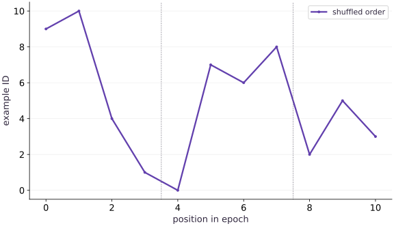

# Design an input pipeline

Phase 06: Data & checkpoint recovery · about 70 minutes · CPU

## What you will be able to do

- Build and audit a deterministic batched host pipeline.
- Distinguish membership, order, alignment and final-batch policies.
- Use masks to preserve statistics after padding.
- State what a preparation timing does and does not measure.

## The problem

Your dataset has eleven examples, but your model takes batches of four. What happens to the last three? We’ll build a small input pipeline and follow example IDs through shuffling and batching. That lets us catch missing examples or mismatched labels before a model’s loss hides the problem.

## The idea

An input pipeline decides which examples reach the model and in what order. Preserve example identities so duplication, omission and split leakage remain detectable. Shapes alone cannot tell us whether the intended data was used.

## Preserve identity through shuffling and batching

Imagine IDs A, B, C, D shuffled into C, A, D, B. Membership stays the same while order changes. A batch size of three leaves one example after the first batch. Dropping it, padding it or emitting a smaller batch are different policies.

Padding requires a validity mask so an artificial slot does not become another observation. Dropping requires acknowledging the lost coverage. Fixed shape should not silently choose the statistical meaning of an epoch.

Read the existing sample-ID plot as an ordering check. The height of an ID is not a physical measurement. Compare membership and multiplicities, then inspect exact order where continuation requires it.

### Pause and reason

Does the right epoch length prove every example occurred once?

<details><summary>Compare your reasoning</summary>

No. A duplicate and an omission preserve the count. Check identities and multiplicities against the intended membership.

</details>

## Preserve identity across every transformation

The dataset has IDs $0$ through $10$. Each ID maps to $x=\mathrm{id}/10$ and $y=2x-1$, giving a direct alignment reference. Shuffle indices, then use the same indices for IDs, features and labels. Shuffling feature and target arrays separately creates plausible shapes with the wrong learning problem.

An ID can identify an original record even when a transform changes its values. For a real dataset, choose stable identifiers and retain the data revision. Our digest includes shape, dtype and bytes of features and labels. It detects changes to this exact tiny dataset; it is not a substitute for a versioned data source contract.

```text
record identity → shared index → {id,x,y}
shuffle index, not independent x and y arrays
```

## Make epoch ordering a pure decision

epoch_order takes seed and epoch as inputs. `SeedSequence([seed,epoch])` supplies a deterministic generator state for that epoch. Reconstructing epoch $0$ with the same versions gives the same permutation; epoch $1$ is a separate decision. We do not hardcode a specific permutation as a cross-version promise.

A seed alone cannot express how much of an epoch has been consumed. To resume mid-epoch, you also need position or a stateful iterator snapshot. Changing batch size changes how a position measured in batches maps to records. The final recovery lesson saves the actual Grain iterator state and checks the next IDs rather than guessing from step count.

## Choose a deliberate policy for the last batch

Eleven observations grouped by four produce lengths $4$,$4$,$3$. Keeping the final partial batch preserves all examples but changes its shape, which can matter for compilation caching. drop_last instead produces $4$,$4$ and omits three examples. Neither policy is automatically correct: choose based on training/evaluation needs and report what was excluded.

Another option pads the last batch to a fixed shape and carries a mask. A mean must then divide by the number of real observations, not padded length. The practice checks this with known labels. Do not introduce artificial repeated examples without accounting for their statistical weight.

```text
11 records → [4] [4] [3]
drop remainder → [4] [4] + 3 omitted
pad/mask → [4] [4] [3 real + 1 masked]
```

## Measure what the stopwatch surrounds

The local perf_counter interval covers shuffling, host indexing and materializing three NumPy batches. It does not include compilation, device execution, storage I/O, decoding or asynchronous transfer. This microsecond-scale toy observation may be dominated by overhead and is not a throughput benchmark.

For a useful pipeline benchmark, first define a representative dataset and transforms. Warm up caches deliberately, measure multiple windows, and report examples per second together with batch shapes, worker settings and storage conditions. Here the useful result is the audited membership and order, not a claim that this sampler is fast.

## Prepare the data and state

Create main.py in your course workspace. Use the tested course environment and add this block first.

```python
# Step 1 — Prepare the data and state: This setup makes the dataset and software assumptions explicit.
# Import numpy for this computation.
import numpy as np
import hashlib
import time
# Initialize array `ids` with explicit values and shape.
ids = np.arange(11,dtype=np.int64)
# Cast or evaluate `features` in explicit floating-point precision.
features = (ids/10).astype(np.float32)
# Cast or evaluate `labels` in explicit floating-point precision.
labels = (2*features-1).astype(np.float32)
# Function `dataset_digest(x, y)` implementing this stage's computation:
def dataset_digest(x,y):
    # Compute deterministic cryptographic digest `digest` for provenance verification.
    digest = hashlib.sha256()
    # Iterate over `array` to step through the computation:
    for array in (x,y):
        # Update state in place with the new values.
        digest.update(str(array.dtype).encode())
        # Update state in place with the new values.
        digest.update(str(array.shape).encode())
        # Update state in place with the new values.
        digest.update(array.tobytes())
    # Return `digest.hexdigest()` to the caller.
    return digest.hexdigest()
# Run `dataset_digest` to compute `fingerprint`.
fingerprint = dataset_digest(features,labels)
# Function `epoch_order(seed, epoch)` implementing this stage's computation:
def epoch_order(seed,epoch):
    # Return `np.random.default_rng(np.random.SeedSequence([seed, epoch])).permutation(len(ids))` to the caller.
    return np.random.default_rng(np.random.SeedSequence([seed,epoch])).permutation(len(ids))
```

This setup makes the dataset and software assumptions explicit. No external dataset or accelerator is required.

## Build the pipeline or state transition

Append this block to the same file; follow the named state objects through each function.

```python
# Step 2 — Build the pipeline or state transition: The function boundaries expose which inputs determine the next...
def make_batches(seed,epoch,batch_size=4,drop_last=False):
    # Guard input contract (`batch_size <= 0`) and fail fast if violated.
    if batch_size <= 0:
        raise ValueError("batch_size must be positive")
    # Run `epoch_order` to compute `order`.
    order = epoch_order(seed,epoch)
    # Iterate over `start` to step through the computation:
    for start in range(0,len(order),batch_size):
        # Evaluate `chosen` from the current inputs and state.
        chosen = order[start:start+batch_size]
        # Branch on condition `drop_last and len(chosen) < batch_size`:
        if drop_last and len(chosen) < batch_size:
            break
        # Execute the next step of the computation.
        yield {"id":ids[chosen],"x":features[chosen],"y":labels[chosen]}
# Record execution timing or profiler trace in `start_time`.
start_time = time.perf_counter()
# Evaluate `make_batches(seed=17, epoch=0)` and convert the result into Python scalar/collection `batches`.
batches = list(make_batches(seed=17,epoch=0))
# Record execution timing or profiler trace in `elapsed`.
elapsed = time.perf_counter()-start_time
# Combine or mask array elements to form `seen`.
seen = np.concatenate([b["id"] for b in batches])
```

The function boundaries expose which inputs determine the next output and which state must be preserved.

## Run the comparison

Append the checks, save main.py and run python main.py. Predict what should agree before running.

```python
# Step 3 — Run the comparison: The comparison checks the next behavior, not merely whether a save...
# Verify contract: `[len(b['id']) for b in batches] == [4, 4, 3]`.
assert [len(b["id"]) for b in batches] == [4,4,3]
# Verify that computed values match the expected reference within numerical tolerance.
np.testing.assert_array_equal(np.sort(seen),ids)
# Verify contract: `len(np.unique(seen)) == len(ids)`.
assert len(np.unique(seen)) == len(ids)
# Iterate over `batch` to step through the computation:
for batch in batches:
    # Verify that computed values match the expected reference within numerical tolerance.
    np.testing.assert_allclose(batch["y"],2*batch["x"]-1,atol=1e-7)
# Combine or mask array elements to form `repeated`.
repeated = np.concatenate([b["id"] for b in make_batches(17,0)])
# Verify that computed values match the expected reference within numerical tolerance.
np.testing.assert_array_equal(seen,repeated)
# Print the observed values to compare against the expected result.
print("Batch sizes:",[len(b["id"]) for b in batches])
# Print diagnostic summary of the computed outputs.
print("Example order:",seen.tolist())
# Print diagnostic summary of the computed outputs.
print("Preparation seconds (local observation only):",elapsed)
# Print diagnostic summary of the computed outputs.
print("Dataset SHA256:",fingerprint)
```

The comparison checks the next behavior, not merely whether a save call succeeded.

## Run the example

```python
# Step 1 — Prepare the data and state: This setup makes the dataset and software assumptions explicit.
# Import numpy for this computation.
import numpy as np
import hashlib
import time
# Initialize array `ids` with explicit values and shape.
ids = np.arange(11,dtype=np.int64)
# Cast or evaluate `features` in explicit floating-point precision.
features = (ids/10).astype(np.float32)
# Cast or evaluate `labels` in explicit floating-point precision.
labels = (2*features-1).astype(np.float32)
# Function `dataset_digest(x, y)` implementing this stage's computation:
def dataset_digest(x,y):
    # Compute deterministic cryptographic digest `digest` for provenance verification.
    digest = hashlib.sha256()
    # Iterate over `array` to step through the computation:
    for array in (x,y):
        # Update state in place with the new values.
        digest.update(str(array.dtype).encode())
        # Update state in place with the new values.
        digest.update(str(array.shape).encode())
        # Update state in place with the new values.
        digest.update(array.tobytes())
    # Return `digest.hexdigest()` to the caller.
    return digest.hexdigest()
# Run `dataset_digest` to compute `fingerprint`.
fingerprint = dataset_digest(features,labels)
# Function `epoch_order(seed, epoch)` implementing this stage's computation:
def epoch_order(seed,epoch):
    # Return `np.random.default_rng(np.random.SeedSequence([seed, epoch])).permutation(len(ids))` to the caller.
    return np.random.default_rng(np.random.SeedSequence([seed,epoch])).permutation(len(ids))

# Step 2 — Build the pipeline or state transition: The function boundaries expose which inputs determine the next...
def make_batches(seed,epoch,batch_size=4,drop_last=False):
    # Guard input contract (`batch_size <= 0`) and fail fast if violated.
    if batch_size <= 0:
        raise ValueError("batch_size must be positive")
    # Run `epoch_order` to compute `order`.
    order = epoch_order(seed,epoch)
    # Iterate over `start` to step through the computation:
    for start in range(0,len(order),batch_size):
        # Evaluate `chosen` from the current inputs and state.
        chosen = order[start:start+batch_size]
        # Branch on condition `drop_last and len(chosen) < batch_size`:
        if drop_last and len(chosen) < batch_size:
            break
        # Execute the next step of the computation.
        yield {"id":ids[chosen],"x":features[chosen],"y":labels[chosen]}
# Record execution timing or profiler trace in `start_time`.
start_time = time.perf_counter()
# Evaluate `make_batches(seed=17, epoch=0)` and convert the result into Python scalar/collection `batches`.
batches = list(make_batches(seed=17,epoch=0))
# Record execution timing or profiler trace in `elapsed`.
elapsed = time.perf_counter()-start_time
# Combine or mask array elements to form `seen`.
seen = np.concatenate([b["id"] for b in batches])

# Step 3 — Run the comparison: The comparison checks the next behavior, not merely whether a save...
# Verify contract: `[len(b['id']) for b in batches] == [4, 4, 3]`.
assert [len(b["id"]) for b in batches] == [4,4,3]
# Verify that computed values match the expected reference within numerical tolerance.
np.testing.assert_array_equal(np.sort(seen),ids)
# Verify contract: `len(np.unique(seen)) == len(ids)`.
assert len(np.unique(seen)) == len(ids)
# Iterate over `batch` to step through the computation:
for batch in batches:
    # Verify that computed values match the expected reference within numerical tolerance.
    np.testing.assert_allclose(batch["y"],2*batch["x"]-1,atol=1e-7)
# Combine or mask array elements to form `repeated`.
repeated = np.concatenate([b["id"] for b in make_batches(17,0)])
# Verify that computed values match the expected reference within numerical tolerance.
np.testing.assert_array_equal(seen,repeated)
# Print the observed values to compare against the expected result.
print("Batch sizes:",[len(b["id"]) for b in batches])
# Print diagnostic summary of the computed outputs.
print("Example order:",seen.tolist())
# Print diagnostic summary of the computed outputs.
print("Preparation seconds (local observation only):",elapsed)
# Print diagnostic summary of the computed outputs.
print("Dataset SHA256:",fingerprint)
```

Expected: Batch sizes $[4,4,3]$; eleven distinct IDs exactly once, aligned labels and repeated order. Preparation time and digest are local observed values.

## Shuffling changes order, not dataset membership

**Predict:** Where does the short final batch begin?



**Recorded CPU computation**

### Read the figure

The horizontal axis is position within a shuffled epoch. The vertical axis is the example ID encountered at that position. The line begins with IDs $9,10,4,1$; its zigzags show a changed ordering, not increases and decreases in loss or example quality.

The dotted separators fall between positions $3$ and $4$, and between $7$ and $8$. They divide the sequence into batches of sizes $4$, $4$, and $3$. The final, shorter batch contains IDs $2,5,3$.

### Connect it to the computation

All IDs from $0$ through $10$ appear once, so shuffling preserves membership while changing order. The final batch is shorter because $11$ examples do not divide evenly into groups of $4$. Dropping that batch would omit three examples from this epoch.

The connected segments are a visual aid for following the sequence; an ID halfway between two plotted IDs is not a generated example. For recovery, record the ordering rule and the iterator’s position, so the resumed run consumes the same remaining examples.

```python
# Compute figure data for: Shuffling changes order, not dataset membership
# Evaluate `visual_data` from the current inputs and state.
visual_data = {'kind': 'line', 'x': list(range(len(seen))), 'xlabel': 'position in epoch', 'ylabel': 'example ID', 'series': [{'label': 'shuffled order', 'y': seen.tolist()}], 'boundaries': [3.5, 7.5]}
```

## Recorded reference execution

CPU run: 2026-10-08T14:02:52.562299+00:00. JAX 0.9.2.

```text
Batch sizes: [4, 4, 3]
Example order: [9, 10, 4, 1, 0, 7, 6, 8, 2, 5, 3]
Preparation seconds (local observation only): 0.011976082809269428
Dataset SHA256: 1a81451a8fb32a1bf0ad6307ea19198153ab1603b37174c76c4d498e343e6892
Batch sizes: [4, 4, 3]
Example order: [9, 10, 4, 1, 0, 7, 6, 8, 2, 5, 3]
Preparation seconds (local observation only): 2.5833025574684143e-05
Dataset SHA256: 1a81451a8fb32a1bf0ad6307ea19198153ab1603b37174c76c4d498e343e6892
Epoch one order: [4, 0, 5, 10, 6, 2, 1, 9, 7, 3, 8]
Omitted IDs: [2, 3, 5]
Copy preserves fingerprint; reordered source and edited labels invalidate it.
PASS: recovery-01

```

## Compare epochs without a hard-coded order

**Predict before running:** What should remain the same when changing epoch from zero to one?

```python
# Experiment — Compare epochs without a hard-coded order: Coverage is an invariant; ordering is a deterministic...
epoch_one = np.concatenate([b["id"] for b in make_batches(17,1)])
# Verify that computed values match the expected reference within numerical tolerance.
np.testing.assert_array_equal(np.sort(epoch_one),ids)
# Verify contract: `not np.array_equal(epoch_one, seen)`.
assert not np.array_equal(epoch_one,seen)
# Print the observed values to compare against the expected result.
print("Epoch one order:",epoch_one.tolist())
```

**Expected:** Same eleven IDs exactly once, different ordering for this tested seed/dataset.

Coverage is an invariant; ordering is a deterministic epoch-specific output. A changed order alone does not imply data loss.

## Expose dropped records

**Predict before running:** Predict the count when `drop_last=True` with batch size four.

```python
# Experiment — Expose dropped records: Logging just the number of batches hides exclusions.
dropped = list(make_batches(17,0,drop_last=True))
# Combine or mask array elements to form `dropped_ids`.
dropped_ids = np.concatenate([b["id"] for b in dropped])
# Verify contract: `len(dropped_ids) == 8`.
assert len(dropped_ids)==8
# Run `np.setdiff1d` to compute `omitted`.
omitted = np.setdiff1d(ids,dropped_ids)
# Verify contract: `len(omitted) == 3`.
assert len(omitted)==3
# Print the observed values to compare against the expected result.
print("Omitted IDs:",omitted.tolist())
```

**Expected:** Eight retained IDs and three explicitly identified omissions.

Logging just the number of batches hides exclusions. An ID audit exposes which observations were not processed.

## Make it yours

Pad the final three-label batch to four elements with zero. Show that an unmasked mean differs, then derive the correct masked mean.

### How to write this exercise — Step-by-step recipe & starter scaffold

**Key functions & syntax to use:**
- `x.sum(axis=...) / x.mean(axis=..., keepdims=...)` — Reduces values along the named `axis` (the axis you name is collapsed unless `keepdims=True`).
- `jnp.allclose(actual, expected, rtol=..., atol=...)` — Checks that two arrays match elementwise within floating-point tolerance.

**Step-by-step implementation plan:**
1. Combine or mask array elements to form `padded_labels`.
2. Initialize array `mask` with explicit values and shape.
3. Aggregate array values to compute `masked`.
4. Reduce across the target axis to summarize ``.
5. Verify that the numerical values match the expected reference within tolerance.

**Starter code scaffold (fill in the TODOs):**

```python
# Exercise solution: Pad the final three-label batch to four elements with zero.
last = ...  # TODO: compute last
# Combine or mask array elements to form `padded_labels`.
padded_labels = np.pad(...)  # TODO: compute padded_labels
# Initialize array `mask` with explicit values and shape.
mask = np.array(...)  # TODO: compute mask
# Aggregate array values to compute `masked`.
masked = ...  # TODO: compute masked
# Reduce across the target axis to summarize ``.
np.testing.assert_allclose(masked,last.mean(),atol = ...  # TODO: compute np.testing.assert_allclose(masked,last.mean(),atol
# Verify that the numerical values match the expected reference within tolerance.
assert not np.isclose(padded_labels.mean(),last.mean())  # TODO: complete assertion check
```

<details><summary>Reference solution</summary>

```python
# Exercise solution: Pad the final three-label batch to four elements with zero.
last = batches[-1]["y"]
# Combine or mask array elements to form `padded_labels`.
padded_labels = np.pad(last,(0,4-len(last)))
# Initialize array `mask` with explicit values and shape.
mask = np.array([1]*len(last)+[0]*(4-len(last)),dtype=np.float32)
# Aggregate array values to compute `masked`.
masked = (padded_labels*mask).sum()/mask.sum()
# Reduce across the target axis to summarize ``.
np.testing.assert_allclose(masked,last.mean(),atol=1e-7)
# Verify that the numerical values match the expected reference within tolerance.
assert not np.isclose(padded_labels.mean(),last.mean())
```

</details>

## Fingerprint meaning, not just a row count

**Transfer**

Reorder features and labels together, then change one label without changing any shape. Verify that both changes alter the dataset fingerprint while copying unchanged arrays preserves it. Explain why a new iterator order differs from a changed source dataset.

<details><summary>Hint</summary>

The fingerprint includes dtype, shape and array bytes.

</details>

### How to write: Fingerprint meaning, not just a row count — Step-by-step recipe & starter scaffold

**Key functions & syntax to use:**
- `count(...)` — Call `count` with your updated parameters or inputs from this lesson's workspace.
- `dataset_digest(...)` — Call `dataset_digest` with your updated parameters or inputs from this lesson's workspace.
- `assert condition` — Verify that the observed output shape, status, or numerical value satisfies the contract.

**Step-by-step implementation plan:**
1. Run `dataset_digest` to compute `reversed_digest`.
2. Run `labels.copy` to compute `changed_labels`.
3. Accumulate the next contribution into `changed_labels[0]`.
4. Run `dataset_digest` to compute `changed_digest`.
5. Verify contract: `same == fingerprint`.

**Starter code scaffold (fill in the TODOs):**

```python
# Fingerprint meaning, not just a row count (Transfer): A sampler permutation can be reproduced against a fixed source.
same = dataset_digest(...)  # TODO: compute same
# Run `dataset_digest` to compute `reversed_digest`.
reversed_digest = dataset_digest(...)  # TODO: compute reversed_digest
# Run `labels.copy` to compute `changed_labels`.
# Accumulate the next contribution into `changed_labels[0]`.
changed_labels = labels.copy(...)  # TODO: compute changed_labels
# Run `dataset_digest` to compute `changed_digest`.
changed_digest = dataset_digest(...)  # TODO: compute changed_digest
# Verify contract: `same == fingerprint`.
assert same  # TODO: complete assertion check
# Verify that the output satisfies the expected shape, finite-value, or numerical contract.
assert reversed_digest  # TODO: complete assertion check
# Print the observed values to compare against the expected result.
print('Copy preserves fingerprint; reordered source and edited labels invalidate it.')
```

<details><summary>Reference solution and reasoning</summary>

```python
# Fingerprint meaning, not just a row count (Transfer): A sampler permutation can be reproduced against a fixed source.
same=dataset_digest(features.copy(),labels.copy())
# Run `dataset_digest` to compute `reversed_digest`.
reversed_digest=dataset_digest(features[::-1],labels[::-1])
# Run `labels.copy` to compute `changed_labels`.
# Accumulate the next contribution into `changed_labels[0]`.
changed_labels=labels.copy();changed_labels[0]+=0.1
# Run `dataset_digest` to compute `changed_digest`.
changed_digest=dataset_digest(features,changed_labels)
# Verify contract: `same == fingerprint`.
assert same==fingerprint
# Verify that the output satisfies the expected shape, finite-value, or numerical contract.
assert reversed_digest!=fingerprint and changed_digest!=fingerprint
# Print the observed values to compare against the expected result.
print('Copy preserves fingerprint; reordered source and edited labels invalidate it.')
```

A sampler permutation can be reproduced against a fixed source. Reordering the source changes which example an index identifies, so restoring only the sampler position would no longer have the same meaning.

</details>

## Catch a feature/label shuffle mismatch

**Challenge**

Reverse the target order inside a batch but keep features unchanged. Reject this batch with an independent alignment check, then repair shared indexing.

<details><summary>Hint</summary>

The known relation $y=2x-1$ provides a stronger oracle than a falling training loss.

</details>

### How to write: Catch a feature/label shuffle mismatch — Step-by-step recipe & starter scaffold

**Key functions & syntax to use:**
- `jnp.allclose(actual, expected, rtol=..., atol=...)` — Checks that two arrays match elementwise within floating-point tolerance.

**Step-by-step implementation plan:**
1. Evaluate `wrong_labels` from the current inputs and state.
2. Verify that the numerical values match the expected reference within tolerance.
3. Evaluate `fixed` from the current inputs and state.
4. Verify that computed values match the expected reference within numerical tolerance.
5. Run `labels.copy` to compute `changed_labels`.

**Starter code scaffold (fill in the TODOs):**

```python
# Catch a feature/label shuffle mismatch (Challenge): Wrong alignment can preserve shapes and numeric ranges.
batch = ...  # TODO: compute batch
# Evaluate `wrong_labels` from the current inputs and state.
wrong_labels = ...  # TODO: compute wrong_labels
# Verify that the numerical values match the expected reference within tolerance.
assert not np.allclose(wrong_labels,2*batch["x"]-1)  # TODO: complete assertion check
# Evaluate `fixed` from the current inputs and state.
fixed = ...  # TODO: compute fixed
# Verify that computed values match the expected reference within numerical tolerance.
np.testing.assert_allclose(fixed,2*batch["x"]-1,atol=1e-7)
# Run `labels.copy` to compute `changed_labels`.
# Accumulate the next contribution into `changed_labels[0]`.
changed_labels = labels.copy(...)  # TODO: compute changed_labels
# Verify contract: `dataset_digest(features, changed_labels) != fingerprint`.
assert dataset_digest(features,changed_labels)  # TODO: complete assertion check
```

<details><summary>Reference solution and reasoning</summary>

```python
# Catch a feature/label shuffle mismatch (Challenge): Wrong alignment can preserve shapes and numeric ranges.
batch = batches[0]
# Evaluate `wrong_labels` from the current inputs and state.
wrong_labels = batch["y"][::-1]
# Verify that the numerical values match the expected reference within tolerance.
assert not np.allclose(wrong_labels,2*batch["x"]-1)
# Evaluate `fixed` from the current inputs and state.
fixed = labels[batch["id"]]
# Verify that computed values match the expected reference within numerical tolerance.
np.testing.assert_allclose(fixed,2*batch["x"]-1,atol=1e-7)
# Run `labels.copy` to compute `changed_labels`.
# Accumulate the next contribution into `changed_labels[0]`.
changed_labels = labels.copy(); changed_labels[0]+=1
# Verify contract: `dataset_digest(features, changed_labels) != fingerprint`.
assert dataset_digest(features,changed_labels)!=fingerprint
```

Wrong alignment can preserve shapes and numeric ranges. Keep common record IDs through transformations, and record dataset identity so restoring an old cursor does not silently select new content.

</details>

## Check your understanding

What information is missing from a model-only checkpoint for mid-epoch recovery?

1. The order/cursor and dataset/configuration identity.
2. The number of input columns is always enough.
3. Nothing: parameters reveal consumed example IDs.

<details><summary>Answer and explanation</summary>

The order/cursor and dataset/configuration identity.

Model state cannot reconstruct which records should be read next.

</details>

## Diagnose the result

Wrong alignment can preserve shapes and numeric ranges. Keep common record IDs through transformations, and record dataset identity so restoring an old cursor does not silently select new content.

## Carry forward

- Preserve identity across every transformation
- Make epoch ordering a pure decision
- Choose a deliberate policy for the last batch
- Measure what the stopwatch surrounds

## Keep your evidence

Keep the exact epoch/example ID order, uneven final-batch sizes, hand-derived masked versus unmasked label mean, changed seed order and duplicate/drop audit.

Save your predictions, modified code, terminal outputs, and reasoning in your engineering portfolio.

## Primary references

- [NumPy Generator permutation](https://numpy.org/doc/stable/reference/random/generated/numpy.random.Generator.permutation.html)
- [Grain DataLoader guide](https://google-grain.readthedocs.io/en/latest/tutorials/data_loader_tutorial.html)

