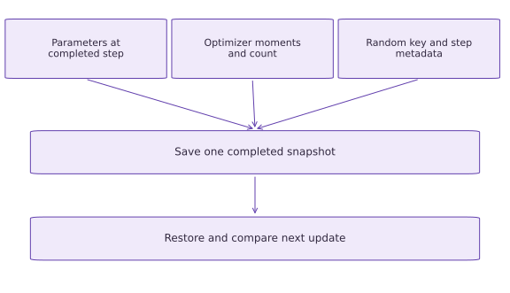

# Save model, optimizer, and random state

Phase 06: Data & checkpoint recovery · about 100 minutes · CPU

## What you will be able to do

- Checkpoint complete training state with Orbax and replay the next update.
- Explain Adam memory and continuation-key requirements.
- Restore known shapes/structure and validate version/data/configuration identity.
- Distinguish tested local synchronous saving from production durability.

## The problem

A saved file is useful only if it contains what you need to continue. We’ll train a tiny regression model, save its weights, optimizer state, random key and step with Orbax, and check the next update after restoring. Then we’ll leave out pieces on purpose to see why they matter.

## The idea

A training checkpoint needs enough state to reproduce the next update. Weights alone do not capture optimizer memory or random-state ownership. Think of the checkpoint as the complete input to a future state transition.

## Save the inputs to the next update

Two runs with identical weights but different Adam moments can receive the same gradient and take different next steps. Different random keys can change augmentation or dropout before the gradient is computed.

The existing diagram merges state components into one snapshot. Its arrows mean membership in the snapshot, not a sequence in which parameters must be computed before moments or randomness. Every component must agree on the completed-step boundary.

Loading bytes successfully checks serialization. Test continuation by restoring into a fresh process and comparing the next transition with an uninterrupted run. Add iterator state through the data-recovery procedure that follows this lesson.

### Pause and reason

What is stronger evidence than matching loaded weights?

<details><summary>Compare your reasoning</summary>

Match the next example identities, random state, optimizer update and resulting parameters. This tests the checkpoint's purpose rather than only its stored parameter values.

</details>

## Inventory everything the next step reads

step reads parameters, Adam memory and key_data, then consumes $x$ and $y$. It returns new parameters, new optimizer state, the continuation key and an incremented step count. Adam includes first and second gradient moments plus a count for bias correction. Reinitializing it from saved parameters discards those moments.

The noisy targets deliberately make randomness matter, so a key reset cannot pass invisibly. We serialize key_data as uint32 words and explicitly reconstruct a threefry2x32 key. Raw words alone do not identify every possible PRNG implementation; the contract records that choice. The learning rate and Adam identity are recorded because optimizer state does not encode every update rule.

```text
params + Adam moments/count + continuation key + step
                 + next batch → next update
```

## Save to a real local checkpoint directory

StandardCheckpointer may perform asynchronous work internally. We call wait_until_finished immediately after save and before restore. save writes an actual Orbax checkpoint under an absolute path in a TemporaryDirectory, then restore reads it back. Calling save alone is not our completion claim. No restore is accepted just because the directory exists: we compare the complete state and its next transition. All files are removed when the temporary workspace is cleaned up; copy a learner-run checkpoint to your chosen evidence folder if you want to keep it.

This example does not implement a cloud retention policy, an asynchronous manager, multi-process synchronization or protection against every storage failure. A successful synchronous local save demonstrates the tested library path and numerical replay. It is not evidence of production durability under a machine or disk failure.

## Restore into an explicit state template

The target supplies a known model dictionary and the Adam namedtuple/pytree structure initialized by the same optimizer definition. That prevents relying on an untyped collection of arrays as if it were a complete model. We then compare pytree structure and every leaf, including the continuation key and count.

The compatibility contract is encoded as JSON bytes in a fixed-size uint8 buffer with a separate length. This keeps the restore target shapes known without pickling Python objects. The 4096-byte capacity is a tutorial simplification: oversized metadata fails explicitly. For a different model shape or optimizer, define a migration deliberately rather than claiming a generic restore.

## Version and data checks belong to the application

The payload includes schema version, package versions, learning rate, optimizer identity, key implementation and a digest of this exact input/target pair. validate_contract rejects any mismatch before continuing training. A checksum can identify changed data; it does not repair it or authenticate a hostile checkpoint.

The strongest local recovery check is the next loss and full updated state against an uninterrupted transition at the same boundary. We use float32 and allclose with `rtol=1e-6`, `atol=1e-7` for numerical leaves. Keys and counters are integer state whose expected values should remain identical. Changing hardware, reductions or library versions needs new validation; this lesson establishes only the tested CPU environment.

## Prepare the data and state

Create main.py in your course workspace. Use the tested course environment and add this block first.

```python
import jax
jax.config.update("jax_platforms","cpu")
import jax.numpy as jnp
import numpy as np
import optax
import orbax.checkpoint as ocp
import tempfile
import json
import hashlib
from pathlib import Path
tx = optax.adam(0.05)
def initial_state():
    params = {"weight":jnp.array(0.,jnp.float32),"bias":jnp.array(0.,jnp.float32)}
    return {"params":params,"optimizer":tx.init(params),
            "key_data":jax.random.key_data(jax.random.key(7,impl="threefry2x32")),
            "step":jnp.array(0,jnp.int32)}
def pack_bytes(raw,capacity=4096):
    if len(raw)>capacity:
        raise ValueError("Snapshot exceeds tutorial fixed-byte capacity")
    buffer = np.zeros(capacity,dtype=np.uint8)
    buffer[:len(raw)] = np.frombuffer(raw,dtype=np.uint8)
    return {"buffer":buffer,"length":np.array(len(raw),dtype=np.int32)}
def unpack_bytes(packed):
    length = int(packed["length"])
    if not 0 <= length <= len(packed["buffer"]):
        raise ValueError("Invalid snapshot length")
    return np.asarray(packed["buffer"],dtype=np.uint8)[:length].tobytes()
def same_tree(left,right):
    assert jax.tree.structure(left)==jax.tree.structure(right)
    for a,b in zip(jax.tree.leaves(left),jax.tree.leaves(right)):
        host_a,host_b = np.asarray(a),np.asarray(b)
        assert host_a.shape==host_b.shape and host_a.dtype==host_b.dtype
        if np.issubdtype(host_a.dtype,np.integer):
            np.testing.assert_array_equal(host_a,host_b)
        else:
            np.testing.assert_allclose(host_a,host_b,rtol=1e-6,atol=1e-7)
def step(state,x,y):
    key = jax.random.wrap_key_data(state["key_data"],impl="threefry2x32")
    next_key,sample_key = jax.random.split(key)
    target_noise = 0.01*jax.random.normal(sample_key,y.shape)
    def objective(params):
        residual = params["weight"]*x+params["bias"]-(y+target_noise)
        return jnp.mean(residual**2)
    value,gradient = jax.value_and_grad(objective)(state["params"])
    updates,opt_state = tx.update(gradient,state["optimizer"],state["params"])
    next_state = {"params":optax.apply_updates(state["params"],updates),
                  "optimizer":opt_state,"key_data":jax.random.key_data(next_key),
                  "step":state["step"]+1}
    return next_state,value
def package_versions():
    import importlib.metadata
    return {name:importlib.metadata.version(name) for name in ("jax","numpy","optax","orbax-checkpoint")}
def encode_contract(contract):
    return pack_bytes(json.dumps(contract,sort_keys=True).encode())
def validate_contract(saved,expected):
    actual = json.loads(unpack_bytes(saved))
    if actual != expected:
        raise ValueError("Checkpoint contract differs: verify dataset, optimizer configuration, key implementation and package versions")
workspace = tempfile.TemporaryDirectory()
root = Path(workspace.name)
```

This setup makes the dataset and software assumptions explicit. No external dataset or accelerator is required.

## Build the pipeline or state transition

Append this block to the same file; follow the named state objects through each function.

```python
x = jnp.array([0.,0.5,1.],dtype=jnp.float32)
y = 2*x-1
contract = {"schema":1,"learning_rate":0.05,"optimizer":"adam",
            "key_impl":"threefry2x32","versions":package_versions(),
            "data_sha256":hashlib.sha256(np.asarray(x).tobytes()+np.asarray(y).tobytes()).hexdigest()}
state = initial_state()
for _ in range(3):
    state,_ = step(state,x,y)
checkpoint_path = root/"step_3"
payload = {"training":state,"contract":encode_contract(contract)}
with ocp.StandardCheckpointer() as checkpointer:
    checkpointer.save(checkpoint_path,payload)
    checkpointer.wait_until_finished()
    restored = checkpointer.restore(checkpoint_path,target={"training":initial_state(),"contract":encode_contract(contract)})
validate_contract(restored["contract"],contract)
```

The function boundaries expose which inputs determine the next output and which state must be preserved.

## Run the comparison

Append the checks, save main.py and run python main.py. Predict what should agree before running.

```python
same_tree(state,restored["training"])
expected_next,expected_loss = step(state,x,y)
restored_next,restored_loss = step(restored["training"],x,y)
same_tree(expected_next,restored_next)
np.testing.assert_allclose(np.asarray(expected_loss),np.asarray(restored_loss),rtol=1e-6)
assert int(restored_next["step"])==4
print("Restored step:",int(restored["training"]["step"]))
print("Optimizer count:",int(restored["training"]["optimizer"][0].count))
print("Next update and loss agree; checkpoint exists:",checkpoint_path.exists())
```

The comparison checks the next behavior, not merely whether a save call succeeded.

## Run the example

```python
import jax
jax.config.update("jax_platforms","cpu")
import jax.numpy as jnp
import numpy as np
import optax
import orbax.checkpoint as ocp
import tempfile
import json
import hashlib
from pathlib import Path
tx = optax.adam(0.05)
def initial_state():
    params = {"weight":jnp.array(0.,jnp.float32),"bias":jnp.array(0.,jnp.float32)}
    return {"params":params,"optimizer":tx.init(params),
            "key_data":jax.random.key_data(jax.random.key(7,impl="threefry2x32")),
            "step":jnp.array(0,jnp.int32)}
def pack_bytes(raw,capacity=4096):
    if len(raw)>capacity:
        raise ValueError("Snapshot exceeds tutorial fixed-byte capacity")
    buffer = np.zeros(capacity,dtype=np.uint8)
    buffer[:len(raw)] = np.frombuffer(raw,dtype=np.uint8)
    return {"buffer":buffer,"length":np.array(len(raw),dtype=np.int32)}
def unpack_bytes(packed):
    length = int(packed["length"])
    if not 0 <= length <= len(packed["buffer"]):
        raise ValueError("Invalid snapshot length")
    return np.asarray(packed["buffer"],dtype=np.uint8)[:length].tobytes()
def same_tree(left,right):
    assert jax.tree.structure(left)==jax.tree.structure(right)
    for a,b in zip(jax.tree.leaves(left),jax.tree.leaves(right)):
        host_a,host_b = np.asarray(a),np.asarray(b)
        assert host_a.shape==host_b.shape and host_a.dtype==host_b.dtype
        if np.issubdtype(host_a.dtype,np.integer):
            np.testing.assert_array_equal(host_a,host_b)
        else:
            np.testing.assert_allclose(host_a,host_b,rtol=1e-6,atol=1e-7)
def step(state,x,y):
    key = jax.random.wrap_key_data(state["key_data"],impl="threefry2x32")
    next_key,sample_key = jax.random.split(key)
    target_noise = 0.01*jax.random.normal(sample_key,y.shape)
    def objective(params):
        residual = params["weight"]*x+params["bias"]-(y+target_noise)
        return jnp.mean(residual**2)
    value,gradient = jax.value_and_grad(objective)(state["params"])
    updates,opt_state = tx.update(gradient,state["optimizer"],state["params"])
    next_state = {"params":optax.apply_updates(state["params"],updates),
                  "optimizer":opt_state,"key_data":jax.random.key_data(next_key),
                  "step":state["step"]+1}
    return next_state,value
def package_versions():
    import importlib.metadata
    return {name:importlib.metadata.version(name) for name in ("jax","numpy","optax","orbax-checkpoint")}
def encode_contract(contract):
    return pack_bytes(json.dumps(contract,sort_keys=True).encode())
def validate_contract(saved,expected):
    actual = json.loads(unpack_bytes(saved))
    if actual != expected:
        raise ValueError("Checkpoint contract differs: verify dataset, optimizer configuration, key implementation and package versions")
workspace = tempfile.TemporaryDirectory()
root = Path(workspace.name)

x = jnp.array([0.,0.5,1.],dtype=jnp.float32)
y = 2*x-1
contract = {"schema":1,"learning_rate":0.05,"optimizer":"adam",
            "key_impl":"threefry2x32","versions":package_versions(),
            "data_sha256":hashlib.sha256(np.asarray(x).tobytes()+np.asarray(y).tobytes()).hexdigest()}
state = initial_state()
for _ in range(3):
    state,_ = step(state,x,y)
checkpoint_path = root/"step_3"
payload = {"training":state,"contract":encode_contract(contract)}
with ocp.StandardCheckpointer() as checkpointer:
    checkpointer.save(checkpoint_path,payload)
    checkpointer.wait_until_finished()
    restored = checkpointer.restore(checkpoint_path,target={"training":initial_state(),"contract":encode_contract(contract)})
validate_contract(restored["contract"],contract)

same_tree(state,restored["training"])
expected_next,expected_loss = step(state,x,y)
restored_next,restored_loss = step(restored["training"],x,y)
same_tree(expected_next,restored_next)
np.testing.assert_allclose(np.asarray(expected_loss),np.asarray(restored_loss),rtol=1e-6)
assert int(restored_next["step"])==4
print("Restored step:",int(restored["training"]["step"]))
print("Optimizer count:",int(restored["training"]["optimizer"][0].count))
print("Next update and loss agree; checkpoint exists:",checkpoint_path.exists())
```

Expected: Saved/restored training step $3$ and Adam count $3$; next step $4$, loss and full state agree within stated tolerances. Actual checkpoint path is temporary.

## A checkpoint must retain the next update’s inputs

**Predict:** Would saving only weights reproduce the next Adam update?



**Conceptual diagram**

### Read the figure

The top row names three ingredients of one checkpoint: current parameters, optimizer history, and random state with step metadata. All three arrows join the same snapshot box. This means they must describe the same completed step, not three unrelated moments in training.

The final box asks you to restore and compare the next update. It is the behavioral test of recovery: can the restored state continue as the uninterrupted state would? The diagram’s arrows show dependencies, not measured save times.

### Connect it to the computation

In the executed example, both the restored step and optimizer count are $3$, and the next update and loss agree. Parameters alone would preserve the current model prediction but omit the optimizer’s accumulated history, which can change the next parameter update.

Read the diagram as a checklist of coupled state. A file existing on disk only demonstrates that something was written; matching the next transition demonstrates that the relevant state was recovered in this example. Data position is added explicitly in the following recovery lesson.

## Recorded reference execution

CPU run: 2026-10-06T21:58:22.672507+00:00. JAX 0.9.2.

```text
Restored step: 3
Optimizer count: 3
Next update and loss agree; checkpoint exists: True
Restored step: 3
Optimizer count: 3
Next update and loss agree; checkpoint exists: True
Model-only checkpoint produces a different Adam update
Reset key changes the noisy objective and continuation stream
Full restore Adam count: 4; reset memory count: 1; next parameters differ.
Expected changed configuration rejection
Expected exact key-data mismatch
PASS: recovery-03

```

## Model-only restoration loses Adam history

**Predict before running:** With the same parameters, key and input, will a freshly initialized optimizer reproduce the next update?

```python
model_only = dict(restored["training"])
model_only["optimizer"] = tx.init(model_only["params"])
wrong_next,_ = step(model_only,x,y)
assert any(not np.allclose(np.asarray(a),np.asarray(b),rtol=1e-6,atol=1e-7) for a,b in zip(jax.tree.leaves(wrong_next["params"]),jax.tree.leaves(expected_next["params"])))
assert int(wrong_next["optimizer"][0].count)==1
print("Model-only checkpoint produces a different Adam update")
```

**Expected:** Fresh optimizer count becomes $1$ and parameters differ from the full-state continuation.

Saved weights give the same pre-update predictions but not necessarily the same optimizer transition.

## Reset the random stream

**Predict before running:** What changes if parameters and Adam memory restore correctly but the key resets to seed seven?

```python
reset_random = dict(restored["training"])
reset_random["key_data"] = initial_state()["key_data"]
reset_next,reset_loss = step(reset_random,x,y)
assert not np.isclose(float(reset_loss),float(expected_loss),rtol=1e-6,atol=1e-7)
assert not np.array_equal(np.asarray(reset_next["key_data"]),np.asarray(expected_next["key_data"]))
print("Reset key changes the noisy objective and continuation stream")
```

**Expected:** The noisy objective and continuation key differ.

A seed identifies the initial stream; a saved continuation key identifies the current boundary.

## Make it yours

Advance to step five, save to a new directory, restore and verify step six against uninterrupted execution.

<details><summary>Reference solution</summary>

```python
later = state
for _ in range(2):later,_=step(later,x,y)
with ocp.StandardCheckpointer() as cp:
    later_path = Path(tempfile.mkdtemp(dir=root))/"step_5"
    cp.save(later_path,{"training":later,"contract":encode_contract(contract)})
    cp.wait_until_finished()
    recovered = cp.restore(later_path,target={"training":initial_state(),"contract":encode_contract(contract)})
validate_contract(recovered["contract"],contract)
left,_=step(later,x,y);right,_=step(recovered["training"],x,y)
same_tree(left,right)
assert int(right["step"])==6
```

</details>

## Show what weights-only recovery loses

**Transfer**

Keep the restored parameters but reset Adam’s memory. Compare the next update with the full-state restore. Keep data and random state identical so the optimizer memory is the only changed factor.

<details><summary>Hint</summary>

Create a new mapping and replace only its optimizer entry.

</details>

<details><summary>Reference solution and reasoning</summary>

```python
full=restored['training']
weights_only=dict(full,optimizer=tx.init(full['params']))
full_next,_=step(full,x,y)
reset_next,_=step(weights_only,x,y)
assert int(full_next['optimizer'][0].count)==4
assert int(reset_next['optimizer'][0].count)==1
assert any(not np.allclose(a,b,rtol=1e-6,atol=1e-7) for a,b in zip(jax.tree.leaves(full_next['params']),jax.tree.leaves(reset_next['params'])))
print('Full restore Adam count: 4; reset memory count: 1; next parameters differ.')
```

A checkpoint can return plausible predictions yet fail to resume the original training trajectory. Adam’s moments and count affect the next update even when the weights and batch match.

</details>

## Reject an incompatible update configuration

**Challenge**

Attempt to restore the contract under learning rate $0.1$. Show the rejection, then validate the original configuration. Also inspect shape and dtype equality of restored parameter leaves.

<details><summary>Hint</summary>

A compatible pytree can still represent the wrong update rule.

</details>

<details><summary>Reference solution and reasoning</summary>

```python
changed_contract = dict(contract,learning_rate=0.1)
try:
    validate_contract(restored["contract"],changed_contract)
except ValueError:
    print("Expected changed configuration rejection")
else:
    raise AssertionError("Expected contract mismatch")
validate_contract(restored["contract"],contract)
for a,b in zip(jax.tree.leaves(state["params"]),jax.tree.leaves(restored["training"]["params"])):
    assert a.shape==b.shape and a.dtype==b.dtype
# Integer PRNG words must be checked exactly, not with relative float tolerance.
changed_key = dict(state)
changed_key["key_data"] = state["key_data"].at[0].add(np.uint32(1))
try:
    same_tree(state,changed_key)
except AssertionError:
    print("Expected exact key-data mismatch")
else:
    raise AssertionError("Expected changed PRNG word rejection")
```

Array restoration does not verify that a learning rate, data revision or PRNG implementation agrees with the saved experiment. Refuse an incompatible continuation before applying an update.

</details>

## Check your understanding

Which checkpoint supports replaying the next Adam update with stochastic targets?

1. Parameters alone.
2. Parameters, Adam state/count, continuation key, step and compatible data/configuration.
3. A seed plus the last printed loss.

<details><summary>Answer and explanation</summary>

Parameters, Adam state/count, continuation key, step and compatible data/configuration.

The update reads all of those inputs; matching predictions before an update cannot replace preserving transition state.

</details>

## Diagnose the result

Array restoration does not verify that a learning rate, data revision or PRNG implementation agrees with the saved experiment. Refuse an incompatible continuation before applying an update.

## Carry forward

- Inventory everything the next step reads
- Save to a real local checkpoint directory
- Restore into an explicit state template
- Version and data checks belong to the application

## Keep your evidence

Keep Orbax save/wait/restore commands, snapshot step, Adam count/moments, exact PRNG words, numerical next-update replay and the parameter-only restart counterexample.

Keep predictions, modified code, observed results, and reasoning. A checkpoint alone does not demonstrate the exercise.

## Primary references

- [Orbax StandardCheckpointer](https://orbax.readthedocs.io/en/latest/api_reference/checkpoint.checkpointers.html)
- [Optax Adam](https://optax.readthedocs.io/en/latest/api/optimizers.html#optax.adam)
- [JAX random key data](https://docs.jax.dev/en/latest/_autosummary/jax.random.key_data.html)

