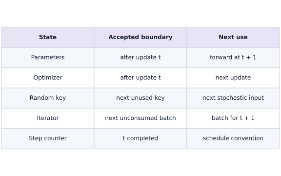
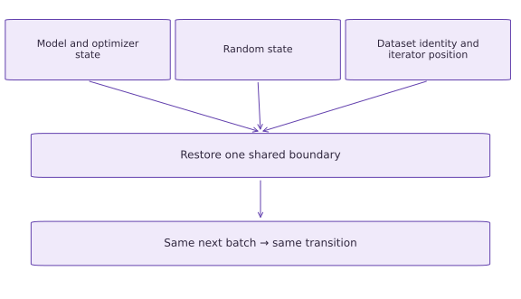

# Recover data position and resume

Phase 06: Data & checkpoint recovery · about 110 minutes · CPU

## What you will be able to do

- Persist model/optimizer/key and Grain iterator position at one boundary.
- Replay across an epoch transition and compare every future batch.
- Diagnose reader-only and model-only restores.
- Reject changed pipeline configuration and state the tested recovery limits.

## The problem

Let’s bring model recovery and data recovery together. We’ll interrupt training after two batches, save both the model state and the next-read position, then continue. Comparing the remaining batches with an uninterrupted run will show whether we really resumed at the same point, including across an epoch boundary.

## The idea

Exact recovery joins numerical state and input-pipeline state at one completed update. Mixing boundaries can repeat or skip examples while producing a plausible training curve.

## Align model time with data time

If saved weights include the C/D update but the iterator still points to C/D, recovery trains on that batch again. If the iterator is one batch too far ahead, it skips data. Both runs can continue without a shape error.

Draw one vertical boundary after an update and align parameters, optimizer, key and cursor with it. The next restored arrow must consume the same examples as the uninterrupted run.

When comparing loss trajectories, align measurement conventions too. A loss before an update and a loss after it describe different states. Compare IDs and state values alongside loss, because similar scalar losses can conceal different training histories.

### One checkpoint, one completed-step boundary

**Predict:** Why reject a resume even when its first loss nearly matches the reference?



*Conceptual / analytic teaching diagram; not a recorded benchmark.*

Read down the middle column: all state describes the same completed update. Across each row is its next use. An older cursor repeats data and a newer cursor skips it. The table shows logical state, not wall-clock timing.

### Pause and reason

Why reject a resume even when its first loss nearly matches the reference?

<details><summary>Compare your reasoning</summary>

Different data or optimizer state can coincidentally produce similar loss. Exact continuation requires the intended full state and data boundary.

</details>

## Commit one logical boundary

consume retrieves a batch, computes an update and returns the updated training state. After two calls, the model step is two and the iterator points at batch three. We pack that iterator snapshot in the same Orbax payload as the model, Adam memory, random stream and contract.

A real prefetcher may prepare data ahead of consumption; the snapshot semantics must refer to the iterator boundary supported by its implementation. This tutorial uses a serial Grain loader and synchronous checkpointing, so no speculative workers or asynchronous outstanding writes complicate the boundary. Do not extrapolate this protocol to an arbitrary data queue without checking its restore contract.

```text
read batch 1 → update 1
read batch 2 → update 2 → save {state_2,next_read_3}
restore → read batch 3 → update 3
```

## Persist opaque iterator bytes without editing them

Grain get_state returns bytes. We store them as a fixed-size uint8 buffer plus length so the Orbax restore target has a predictable shape. set_state receives the original byte sequence recovered from that buffer. The application does not inspect or patch Grain internal counters.

The buffer capacity is $4096$ bytes and over-capacity snapshots fail. It is a teaching representation, not a general replacement for Grain checkpoint integration handlers. Restore is supported for this tested source/sampler/worker configuration. Changing those settings may invalidate a snapshot, so our contract also records seed, batch size, record count and source revision.

## Audit the future, including an epoch transition

There are twelve records in each of two epochs and three four-example batches per epoch. We checkpoint after two batches. The remaining four batches are the final batch of epoch zero followed by all three batches of epoch one. Compare each future ID vector and each future loss in order, then compare every final state leaf.

Comparing only final loss can miss skipped or repeated observations, particularly on an easy dataset. Comparing only IDs can miss an optimizer/key reset. Comparing only weights can miss a count or random-state error that changes a subsequent step. The combined check targets all three failure classes.

```text
epoch 0: batch 1 | batch 2 | checkpoint | batch 3
epoch 1: batch 4 | batch 5 | batch 6
replay compares IDs + losses + params + Adam + key + step
```

## Define the limits of this recovery claim

The payload contract contains dataset SHA256, source revision, counts, ordering configuration, update configuration, PRNG implementation and package versions. Refuse a mismatch rather than silently announcing a resumed run. This is intentionally stricter than claiming compatibility between arbitrary versions.

The local directory is temporary and the writer is synchronous. The lesson verifies readable files and CPU replay after reconstructing objects in the same process; it does not simulate power loss, a separate machine, multi-host orchestration, async interruption or remote storage behavior. Your portfolio report should state those limits and identify the next failure mode to test. Production use should adopt the library-supported combined handlers/manager and test its completion/recovery boundaries.

## Prepare the data and state

Create main.py in your course workspace. Use the tested course environment and add this block first.

```python
# Step 1 — Prepare the data and state: This setup makes the dataset and software assumptions explicit.
# Import jax for this computation.
import jax
# Update state in place with the new values.
jax.config.update("jax_platforms","cpu")
# Import jax.numpy for this computation.
import jax.numpy as jnp
import numpy as np
import optax
import orbax.checkpoint as ocp
import tempfile
import json
import hashlib
from pathlib import Path
# Configure or step the Optax optimizer state (`tx`).
tx = optax.adam(0.05)
# Function `initial_state()` implementing this stage's computation:
def initial_state():
    # Initialize array `params` with explicit values and shape.
    params = {"weight":jnp.array(0.,jnp.float32),"bias":jnp.array(0.,jnp.float32)}
    # Return `{'params': params, 'optimizer': tx.init(params), 'key_data': jax.random.key_data(jax.random.key(7, impl='threefry2x32')), 'step': jnp.array(0, jnp.int32)}` to the caller.
    return {"params":params,"optimizer":tx.init(params),
            "key_data":jax.random.key_data(jax.random.key(7,impl="threefry2x32")),
            "step":jnp.array(0,jnp.int32)}
# Function `pack_bytes(raw, capacity)` implementing this stage's computation:
def pack_bytes(raw,capacity=4096):
    # Guard input contract (`len(raw) > capacity`) and fail fast if violated.
    if len(raw)>capacity:
        raise ValueError("Snapshot exceeds tutorial fixed-byte capacity")
    # Allocate initialized array `buffer` with the specified shape and dtype.
    buffer = np.zeros(capacity,dtype=np.uint8)
    # Run `np.frombuffer` to compute `buffer[:len(raw)]`.
    buffer[:len(raw)] = np.frombuffer(raw,dtype=np.uint8)
    # Return `{'buffer': buffer, 'length': np.array(len(raw), dtype=np.int32)}` to the caller.
    return {"buffer":buffer,"length":np.array(len(raw),dtype=np.int32)}
# Function `unpack_bytes(packed)` implementing this stage's computation:
def unpack_bytes(packed):
    # Evaluate `packed['length']` and convert the result into Python scalar/collection `length`.
    length = int(packed["length"])
    # Guard input contract (`not 0 <= length <= len(packed['buffer'])`) and fail fast if violated.
    if not 0 <= length <= len(packed["buffer"]):
        raise ValueError("Invalid snapshot length")
    # Return `np.asarray(packed['buffer'], dtype=np.uint8)[:length].tobytes()` to the caller.
    return np.asarray(packed["buffer"],dtype=np.uint8)[:length].tobytes()
# Function `same_tree(left, right)` implementing this stage's computation:
def same_tree(left,right):
    # Verify contract: `jax.tree.structure(left) == jax.tree.structure(right)`.
    assert jax.tree.structure(left)==jax.tree.structure(right)
    # Iterate over `(a, b)` to step through the computation:
    for a,b in zip(jax.tree.leaves(left),jax.tree.leaves(right)):
        # Convert `(host_a, host_b)` to a host NumPy array for inspection or verification.
        host_a,host_b = np.asarray(a),np.asarray(b)
        # Verify that the output tensor shape matches our prediction.
        assert host_a.shape==host_b.shape and host_a.dtype==host_b.dtype
        # Branch on condition `np.issubdtype(host_a.dtype, np.integer)`:
        if np.issubdtype(host_a.dtype,np.integer):
            np.testing.assert_array_equal(host_a,host_b)
        else:
            np.testing.assert_allclose(host_a,host_b,rtol=1e-6,atol=1e-7)
# Define `step(state, x, y)` to evaluate the objective and its automatic derivatives:
def step(state,x,y):
    # Sample deterministic random values into `key` using an explicit PRNG key.
    key = jax.random.wrap_key_data(state["key_data"],impl="threefry2x32")
    # Create or split explicit PRNG key(s) (`(next_key, sample_key)`) for reproducible randomness.
    next_key,sample_key = jax.random.split(key)
    # Sample deterministic random values into `target_noise` using an explicit PRNG key.
    target_noise = 0.01*jax.random.normal(sample_key,y.shape)
    # Function `objective(params)` implementing this stage's computation:
    def objective(params):
        # Evaluate `residual` from the current inputs and state.
        residual = params["weight"]*x+params["bias"]-(y+target_noise)
        # Return `jnp.mean(residual ** 2)` to the caller.
        return jnp.mean(residual**2)
    # Evaluate both scalar loss and parameter gradients in one pass (`(value, gradient)`).
    value,gradient = jax.value_and_grad(objective)(state["params"])
    # Run `tx.update` to compute `(updates, opt_state)`.
    updates,opt_state = tx.update(gradient,state["optimizer"],state["params"])
    # Initialize explicit deterministic PRNG key `next_state`.
    next_state = {"params":optax.apply_updates(state["params"],updates),
                  "optimizer":opt_state,"key_data":jax.random.key_data(next_key),
                  "step":state["step"]+1}
    # Return `(next_state, value)` to the caller.
    return next_state,value
# Function `package_versions()` implementing this stage's computation:
def package_versions():
    # Import importlib.metadata for this computation.
    import importlib.metadata
    # Return `{name: importlib.metadata.version(name) for name in ('jax', 'numpy', 'optax', 'orbax-checkpoint')}` to the caller.
    return {name:importlib.metadata.version(name) for name in ("jax","numpy","optax","orbax-checkpoint")}
# Function `encode_contract(contract)` implementing this stage's computation:
def encode_contract(contract):
    # Return `pack_bytes(json.dumps(contract, sort_keys=True).encode())` to the caller.
    return pack_bytes(json.dumps(contract,sort_keys=True).encode())
# Function `validate_contract(saved, expected)` implementing this stage's computation:
def validate_contract(saved,expected):
    # Read or serialize artifact data on disk (`actual`).
    actual = json.loads(unpack_bytes(saved))
    # Guard input contract (`actual != expected`) and fail fast if violated.
    if actual != expected:
        raise ValueError("Checkpoint contract differs: verify dataset, optimizer configuration, key implementation and package versions")
# Run `tempfile.TemporaryDirectory` to compute `workspace`.
workspace = tempfile.TemporaryDirectory()
# Read or serialize artifact data on disk (`root`).
root = Path(workspace.name)

# Import required JAX, NumPy, and standard-library modules.
import numpy as np
import grain.python as grain
# Module/container class `TutorialSource` encapsulating model parameters and forward pass:
class TutorialSource:
    # Function `__init__(self, count)` implementing this stage's computation:
    def __init__(self,count=12):
        # Evaluate `self.count` from the current inputs and state.
        self.count = count
    # Function `__len__(self)` implementing this stage's computation:
    def __len__(self):
        # Return `self.count` to the caller.
        return self.count
    # Function `__getitem__(self, index)` implementing this stage's computation:
    def __getitem__(self,index):
        # Cast or evaluate `value` in explicit floating-point precision.
        value = np.float32(index/10)
        # Return `{'id': np.int64(index), 'x': value, 'y': np.float32(2 * value - 1)}` to the caller.
        return {"id":np.int64(index),"x":value,"y":np.float32(2*value-1)}
    # Function `__repr__(self)` implementing this stage's computation:
    def __repr__(self):
        # Return `f'TutorialSource(v1,n={self.count})'` to the caller.
        return f"TutorialSource(v1,n={self.count})"
# Function `make_loader(seed, batch_size, count, drop_remainder)` implementing this stage's computation:
def make_loader(seed=42,batch_size=4,count=12,drop_remainder=False):
    # Return `grain.DataLoader(data_source=TutorialSource(count), sampler=grain.IndexSampler(num_records=count, num_epochs=2, shuffle=True, seed=seed), operations=[grain.Batch(batch_size, drop_remainder=drop_remainder)], worker_count=0)` to the caller.
    return grain.DataLoader(
        data_source=TutorialSource(count),
        sampler=grain.IndexSampler(num_records=count,num_epochs=2,shuffle=True,seed=seed),
        operations=[grain.Batch(batch_size,drop_remainder=drop_remainder)],
        worker_count=0)
```

This setup makes the dataset and software assumptions explicit. No external dataset or accelerator is required.

## Build the pipeline or state transition

Append this block to the same file; follow the named state objects through each function.

```python
# Step 2 — Build the pipeline or state transition: The function boundaries expose which inputs determine the next...
def data_contract(seed=42):
    # Run `TutorialSource` to compute `source`.
    source = TutorialSource()
    # Initialize array `values` with explicit values and shape.
    values = np.array([[source[i]["x"],source[i]["y"]] for i in range(len(source))],dtype=np.float32)
    # Return `{'schema': 1, 'seed': seed, 'batch_size': 4, 'count': 12, 'source': 'TutorialSource(v1,n=12)', 'sha256': hashlib.sha256(values.tobytes()).hexdigest(), 'learning_rate': 0.05, 'optimizer': 'adam', 'key_impl': 'threefry2x32', 'versions': dict(package_versions(), grain=__import__('importlib.metadata', fromlist=['version']).version('grain'))}` to the caller.
    return {"schema":1,"seed":seed,"batch_size":4,"count":12,"source":"TutorialSource(v1,n=12)",
            "sha256":hashlib.sha256(values.tobytes()).hexdigest(),
            "learning_rate":0.05,"optimizer":"adam","key_impl":"threefry2x32",
            "versions":dict(package_versions(),grain=__import__("importlib.metadata",fromlist=["version"]).version("grain"))}
# Function `consume(state, iterator, count)` implementing this stage's computation:
def consume(state,iterator,count):
    # Evaluate `losses` from the current inputs and state.
    # Evaluate `orders` from the current inputs and state.
    losses=[];orders=[]
    # Repeat the update loop over `range(count)` steps:
    for _ in range(count):
        # Run `next` to compute `batch`.
        batch = next(iterator)
        # Append the current step result to `orders`.
        orders.append(batch["id"].copy())
        # Create device-backed JAX array `(state, value)`.
        state,value = step(state,jnp.asarray(batch["x"]),jnp.asarray(batch["y"]))
        # Append the current step result to `losses`.
        losses.append(float(value))
    # Return `(state, np.array(losses), orders)` to the caller.
    return state,np.array(losses),orders
# Run `data_contract` to compute `contract`.
contract = data_contract()
# Run `iter` to compute `reference_iterator`.
reference_iterator = iter(make_loader())
# Run `consume` to compute `(reference_state, _, _)`.
reference_state,_,_ = consume(initial_state(),reference_iterator,2)
# Evaluate `payload` from the current inputs and state.
payload = {"training":reference_state,"pipeline":pack_bytes(reference_iterator.get_state()),"contract":encode_contract(contract)}
# Evaluate `resume_path` from the current inputs and state.
resume_path = root/"completed_step_2"
# Enter `ocp.StandardCheckpointer()` context block:
with ocp.StandardCheckpointer() as cp:
    # Run `cp.save` to perform the next check or state transition.
    cp.save(resume_path,payload)
    # Run `cp.wait_until_finished` to perform the next check or state transition.
    cp.wait_until_finished()
    # Run `cp.restore` to compute `restored_payload`.
    restored_payload = cp.restore(resume_path,target={"training":initial_state(),"pipeline":pack_bytes(b""),"contract":encode_contract(contract)})
# Run `validate_contract` to perform the next check or state transition.
validate_contract(restored_payload["contract"],contract)
# Run `iter` to compute `resumed_iterator`.
resumed_iterator = iter(make_loader())
# Run `resumed_iterator.set_state` to perform the next check or state transition.
resumed_iterator.set_state(unpack_bytes(restored_payload["pipeline"]))
```

The function boundaries expose which inputs determine the next output and which state must be preserved.

## Run the comparison

Append the checks, save main.py and run python main.py. Predict what should agree before running.

```python
# Step 3 — Run the comparison: The comparison checks the next behavior, not merely whether a save...
reference_final,reference_losses,reference_ids = consume(reference_state,reference_iterator,4)
# Run `consume` to compute `(resumed_final, resumed_losses, resumed_ids)`.
resumed_final,resumed_losses,resumed_ids = consume(restored_payload["training"],resumed_iterator,4)
# Iterate over `(a, b)` to step through the computation:
for a,b in zip(reference_ids,resumed_ids):np.testing.assert_array_equal(a,b)
# Verify that computed values match the expected reference within numerical tolerance.
np.testing.assert_allclose(reference_losses,resumed_losses,rtol=1e-6,atol=1e-7)
# Run `same_tree` to perform the next check or state transition.
same_tree(reference_final,resumed_final)
# Verify contract: `int(resumed_final['step']) == 6`.
assert int(resumed_final["step"])==6
# Print the observed values to compare against the expected result.
print("Restored next four ID batches:",[a.tolist() for a in resumed_ids])
# Print diagnostic summary of the computed outputs.
print("Restored next four losses:",resumed_losses.tolist())
# Print diagnostic summary of the computed outputs.
print("Full state agrees at step six")
```

The comparison checks the next behavior, not merely whether a save call succeeded.

## Run the example

```python
# Step 1 — Prepare the data and state: This setup makes the dataset and software assumptions explicit.
# Import jax for this computation.
import jax
# Update state in place with the new values.
jax.config.update("jax_platforms","cpu")
# Import jax.numpy for this computation.
import jax.numpy as jnp
import numpy as np
import optax
import orbax.checkpoint as ocp
import tempfile
import json
import hashlib
from pathlib import Path
# Configure or step the Optax optimizer state (`tx`).
tx = optax.adam(0.05)
# Function `initial_state()` implementing this stage's computation:
def initial_state():
    # Initialize array `params` with explicit values and shape.
    params = {"weight":jnp.array(0.,jnp.float32),"bias":jnp.array(0.,jnp.float32)}
    # Return `{'params': params, 'optimizer': tx.init(params), 'key_data': jax.random.key_data(jax.random.key(7, impl='threefry2x32')), 'step': jnp.array(0, jnp.int32)}` to the caller.
    return {"params":params,"optimizer":tx.init(params),
            "key_data":jax.random.key_data(jax.random.key(7,impl="threefry2x32")),
            "step":jnp.array(0,jnp.int32)}
# Function `pack_bytes(raw, capacity)` implementing this stage's computation:
def pack_bytes(raw,capacity=4096):
    # Guard input contract (`len(raw) > capacity`) and fail fast if violated.
    if len(raw)>capacity:
        raise ValueError("Snapshot exceeds tutorial fixed-byte capacity")
    # Allocate initialized array `buffer` with the specified shape and dtype.
    buffer = np.zeros(capacity,dtype=np.uint8)
    # Run `np.frombuffer` to compute `buffer[:len(raw)]`.
    buffer[:len(raw)] = np.frombuffer(raw,dtype=np.uint8)
    # Return `{'buffer': buffer, 'length': np.array(len(raw), dtype=np.int32)}` to the caller.
    return {"buffer":buffer,"length":np.array(len(raw),dtype=np.int32)}
# Function `unpack_bytes(packed)` implementing this stage's computation:
def unpack_bytes(packed):
    # Evaluate `packed['length']` and convert the result into Python scalar/collection `length`.
    length = int(packed["length"])
    # Guard input contract (`not 0 <= length <= len(packed['buffer'])`) and fail fast if violated.
    if not 0 <= length <= len(packed["buffer"]):
        raise ValueError("Invalid snapshot length")
    # Return `np.asarray(packed['buffer'], dtype=np.uint8)[:length].tobytes()` to the caller.
    return np.asarray(packed["buffer"],dtype=np.uint8)[:length].tobytes()
# Function `same_tree(left, right)` implementing this stage's computation:
def same_tree(left,right):
    # Verify contract: `jax.tree.structure(left) == jax.tree.structure(right)`.
    assert jax.tree.structure(left)==jax.tree.structure(right)
    # Iterate over `(a, b)` to step through the computation:
    for a,b in zip(jax.tree.leaves(left),jax.tree.leaves(right)):
        # Convert `(host_a, host_b)` to a host NumPy array for inspection or verification.
        host_a,host_b = np.asarray(a),np.asarray(b)
        # Verify that the output tensor shape matches our prediction.
        assert host_a.shape==host_b.shape and host_a.dtype==host_b.dtype
        # Branch on condition `np.issubdtype(host_a.dtype, np.integer)`:
        if np.issubdtype(host_a.dtype,np.integer):
            np.testing.assert_array_equal(host_a,host_b)
        else:
            np.testing.assert_allclose(host_a,host_b,rtol=1e-6,atol=1e-7)
# Define `step(state, x, y)` to evaluate the objective and its automatic derivatives:
def step(state,x,y):
    # Sample deterministic random values into `key` using an explicit PRNG key.
    key = jax.random.wrap_key_data(state["key_data"],impl="threefry2x32")
    # Create or split explicit PRNG key(s) (`(next_key, sample_key)`) for reproducible randomness.
    next_key,sample_key = jax.random.split(key)
    # Sample deterministic random values into `target_noise` using an explicit PRNG key.
    target_noise = 0.01*jax.random.normal(sample_key,y.shape)
    # Function `objective(params)` implementing this stage's computation:
    def objective(params):
        # Evaluate `residual` from the current inputs and state.
        residual = params["weight"]*x+params["bias"]-(y+target_noise)
        # Return `jnp.mean(residual ** 2)` to the caller.
        return jnp.mean(residual**2)
    # Evaluate both scalar loss and parameter gradients in one pass (`(value, gradient)`).
    value,gradient = jax.value_and_grad(objective)(state["params"])
    # Run `tx.update` to compute `(updates, opt_state)`.
    updates,opt_state = tx.update(gradient,state["optimizer"],state["params"])
    # Initialize explicit deterministic PRNG key `next_state`.
    next_state = {"params":optax.apply_updates(state["params"],updates),
                  "optimizer":opt_state,"key_data":jax.random.key_data(next_key),
                  "step":state["step"]+1}
    # Return `(next_state, value)` to the caller.
    return next_state,value
# Function `package_versions()` implementing this stage's computation:
def package_versions():
    # Import importlib.metadata for this computation.
    import importlib.metadata
    # Return `{name: importlib.metadata.version(name) for name in ('jax', 'numpy', 'optax', 'orbax-checkpoint')}` to the caller.
    return {name:importlib.metadata.version(name) for name in ("jax","numpy","optax","orbax-checkpoint")}
# Function `encode_contract(contract)` implementing this stage's computation:
def encode_contract(contract):
    # Return `pack_bytes(json.dumps(contract, sort_keys=True).encode())` to the caller.
    return pack_bytes(json.dumps(contract,sort_keys=True).encode())
# Function `validate_contract(saved, expected)` implementing this stage's computation:
def validate_contract(saved,expected):
    # Read or serialize artifact data on disk (`actual`).
    actual = json.loads(unpack_bytes(saved))
    # Guard input contract (`actual != expected`) and fail fast if violated.
    if actual != expected:
        raise ValueError("Checkpoint contract differs: verify dataset, optimizer configuration, key implementation and package versions")
# Run `tempfile.TemporaryDirectory` to compute `workspace`.
workspace = tempfile.TemporaryDirectory()
# Read or serialize artifact data on disk (`root`).
root = Path(workspace.name)

# Import required JAX, NumPy, and standard-library modules.
import numpy as np
import grain.python as grain
# Module/container class `TutorialSource` encapsulating model parameters and forward pass:
class TutorialSource:
    # Function `__init__(self, count)` implementing this stage's computation:
    def __init__(self,count=12):
        # Evaluate `self.count` from the current inputs and state.
        self.count = count
    # Function `__len__(self)` implementing this stage's computation:
    def __len__(self):
        # Return `self.count` to the caller.
        return self.count
    # Function `__getitem__(self, index)` implementing this stage's computation:
    def __getitem__(self,index):
        # Cast or evaluate `value` in explicit floating-point precision.
        value = np.float32(index/10)
        # Return `{'id': np.int64(index), 'x': value, 'y': np.float32(2 * value - 1)}` to the caller.
        return {"id":np.int64(index),"x":value,"y":np.float32(2*value-1)}
    # Function `__repr__(self)` implementing this stage's computation:
    def __repr__(self):
        # Return `f'TutorialSource(v1,n={self.count})'` to the caller.
        return f"TutorialSource(v1,n={self.count})"
# Function `make_loader(seed, batch_size, count, drop_remainder)` implementing this stage's computation:
def make_loader(seed=42,batch_size=4,count=12,drop_remainder=False):
    # Return `grain.DataLoader(data_source=TutorialSource(count), sampler=grain.IndexSampler(num_records=count, num_epochs=2, shuffle=True, seed=seed), operations=[grain.Batch(batch_size, drop_remainder=drop_remainder)], worker_count=0)` to the caller.
    return grain.DataLoader(
        data_source=TutorialSource(count),
        sampler=grain.IndexSampler(num_records=count,num_epochs=2,shuffle=True,seed=seed),
        operations=[grain.Batch(batch_size,drop_remainder=drop_remainder)],
        worker_count=0)

# Step 2 — Build the pipeline or state transition: The function boundaries expose which inputs determine the next...
def data_contract(seed=42):
    # Run `TutorialSource` to compute `source`.
    source = TutorialSource()
    # Initialize array `values` with explicit values and shape.
    values = np.array([[source[i]["x"],source[i]["y"]] for i in range(len(source))],dtype=np.float32)
    # Return `{'schema': 1, 'seed': seed, 'batch_size': 4, 'count': 12, 'source': 'TutorialSource(v1,n=12)', 'sha256': hashlib.sha256(values.tobytes()).hexdigest(), 'learning_rate': 0.05, 'optimizer': 'adam', 'key_impl': 'threefry2x32', 'versions': dict(package_versions(), grain=__import__('importlib.metadata', fromlist=['version']).version('grain'))}` to the caller.
    return {"schema":1,"seed":seed,"batch_size":4,"count":12,"source":"TutorialSource(v1,n=12)",
            "sha256":hashlib.sha256(values.tobytes()).hexdigest(),
            "learning_rate":0.05,"optimizer":"adam","key_impl":"threefry2x32",
            "versions":dict(package_versions(),grain=__import__("importlib.metadata",fromlist=["version"]).version("grain"))}
# Function `consume(state, iterator, count)` implementing this stage's computation:
def consume(state,iterator,count):
    # Evaluate `losses` from the current inputs and state.
    # Evaluate `orders` from the current inputs and state.
    losses=[];orders=[]
    # Repeat the update loop over `range(count)` steps:
    for _ in range(count):
        # Run `next` to compute `batch`.
        batch = next(iterator)
        # Append the current step result to `orders`.
        orders.append(batch["id"].copy())
        # Create device-backed JAX array `(state, value)`.
        state,value = step(state,jnp.asarray(batch["x"]),jnp.asarray(batch["y"]))
        # Append the current step result to `losses`.
        losses.append(float(value))
    # Return `(state, np.array(losses), orders)` to the caller.
    return state,np.array(losses),orders
# Run `data_contract` to compute `contract`.
contract = data_contract()
# Run `iter` to compute `reference_iterator`.
reference_iterator = iter(make_loader())
# Run `consume` to compute `(reference_state, _, _)`.
reference_state,_,_ = consume(initial_state(),reference_iterator,2)
# Evaluate `payload` from the current inputs and state.
payload = {"training":reference_state,"pipeline":pack_bytes(reference_iterator.get_state()),"contract":encode_contract(contract)}
# Evaluate `resume_path` from the current inputs and state.
resume_path = root/"completed_step_2"
# Enter `ocp.StandardCheckpointer()` context block:
with ocp.StandardCheckpointer() as cp:
    # Run `cp.save` to perform the next check or state transition.
    cp.save(resume_path,payload)
    # Run `cp.wait_until_finished` to perform the next check or state transition.
    cp.wait_until_finished()
    # Run `cp.restore` to compute `restored_payload`.
    restored_payload = cp.restore(resume_path,target={"training":initial_state(),"pipeline":pack_bytes(b""),"contract":encode_contract(contract)})
# Run `validate_contract` to perform the next check or state transition.
validate_contract(restored_payload["contract"],contract)
# Run `iter` to compute `resumed_iterator`.
resumed_iterator = iter(make_loader())
# Run `resumed_iterator.set_state` to perform the next check or state transition.
resumed_iterator.set_state(unpack_bytes(restored_payload["pipeline"]))

# Step 3 — Run the comparison: The comparison checks the next behavior, not merely whether a save...
reference_final,reference_losses,reference_ids = consume(reference_state,reference_iterator,4)
# Run `consume` to compute `(resumed_final, resumed_losses, resumed_ids)`.
resumed_final,resumed_losses,resumed_ids = consume(restored_payload["training"],resumed_iterator,4)
# Iterate over `(a, b)` to step through the computation:
for a,b in zip(reference_ids,resumed_ids):np.testing.assert_array_equal(a,b)
# Verify that computed values match the expected reference within numerical tolerance.
np.testing.assert_allclose(reference_losses,resumed_losses,rtol=1e-6,atol=1e-7)
# Run `same_tree` to perform the next check or state transition.
same_tree(reference_final,resumed_final)
# Verify contract: `int(resumed_final['step']) == 6`.
assert int(resumed_final["step"])==6
# Print the observed values to compare against the expected result.
print("Restored next four ID batches:",[a.tolist() for a in resumed_ids])
# Print diagnostic summary of the computed outputs.
print("Restored next four losses:",resumed_losses.tolist())
# Print diagnostic summary of the computed outputs.
print("Full state agrees at step six")
```

Expected: The next four ID batches and losses match; parameters, Adam state, continuation key and step agree at step six. One epoch boundary is crossed.

## Data position completes the recovery boundary

**Predict:** What changes if the model resumes with the wrong next batch?



**Conceptual diagram**

### Read the figure

The top boxes bring together model and optimizer state, random state, and dataset identity with iterator position. Their arrows converge on “Restore one shared boundary.” The layout emphasizes that none of these inputs can be recovered independently from a different training step.

The final box connects the same next batch to the same next transition. An unchanged model is not enough if the resumed iterator supplies different examples: the next gradient can then differ.

### Connect it to the computation

Think of the boundary as just after a completed update. The parameter values and optimizer history describe that update, the random state identifies the next draws, and the data position identifies the next examples. Dataset identity matters because the same numeric position in a different dataset need not mean the same batch.

The diagram is conceptual; its box sizes do not measure storage or runtime. The executable checks below compare batch IDs and resulting state. Follow that chain when diagnosing recovery: first establish the same inputs to the update, then compare the update’s outputs.

## Recorded reference execution

CPU run: 2026-10-08T14:03:15.851376+00:00. JAX 0.9.2.

```text
Restored next four ID batches: [[4, 10, 11, 3], [2, 0, 11, 1], [5, 7, 6, 8], [4, 3, 10, 9]]
Restored next four losses: [0.5496272444725037, 0.8390463590621948, 0.07169045507907867, 0.32427603006362915]
Full state agrees at step six
Restored next four ID batches: [[4, 10, 11, 3], [2, 0, 11, 1], [5, 7, 6, 8], [4, 3, 10, 9]]
Restored next four losses: [0.5496272444725037, 0.8390463590621948, 0.07169045507907867, 0.32427603006362915]
Full state agrees at step six
Missing iterator restore repeats earlier IDs and changes the next loss
Correct IDs alone do not restore the training transition
Rejected incompatible seed
Rejected incompatible sha256
Original run contract remains valid.
Expected batch-configuration mismatch
PASS: recovery-04

```

## Restart only the reader

**Predict before running:** Keep restored training state but start a fresh iterator. Which IDs arrive first, and should the next update match?

```python
# Experiment — Restart only the reader: A model step counter does not automatically seek a data iterator.
fresh = iter(make_loader())
# Run `consume` to compute `(wrong_state, wrong_losses, wrong_ids)`.
wrong_state,wrong_losses,wrong_ids = consume(restored_payload["training"],fresh,1)
# Verify contract: `not np.array_equal(wrong_ids[0], reference_ids[0])`.
assert not np.array_equal(wrong_ids[0],reference_ids[0])
# Verify that the output satisfies the expected shape, finite-value, or numerical contract.
assert not np.isclose(wrong_losses[0],reference_losses[0],rtol=1e-6,atol=1e-7)
# Print the observed values to compare against the expected result.
print("Missing iterator restore repeats earlier IDs and changes the next loss")
```

**Expected:** The first batch repeats instead of the saved next batch; the next loss differs.

A model step counter does not automatically seek a data iterator.

## Restore only the reader

**Predict before running:** Replay the correct IDs but initialize model/optimizer/key from scratch. Will losses match?

```python
# Experiment — Restore only the reader: Input replay and model-state replay are complementary...
reader_only = iter(make_loader());reader_only.set_state(unpack_bytes(restored_payload["pipeline"]))
# Run `consume` to compute `(wrong_model, wrong_model_losses, correct_ids)`.
wrong_model,wrong_model_losses,correct_ids = consume(initial_state(),reader_only,1)
# Verify that computed values match the expected reference within numerical tolerance.
np.testing.assert_array_equal(correct_ids[0],reference_ids[0])
# Verify that the numerical values match the expected reference within tolerance.
assert not np.isclose(wrong_model_losses[0],reference_losses[0],rtol=1e-6,atol=1e-7)
# Verify that the output satisfies the expected shape, finite-value, or numerical contract.
assert int(wrong_model["step"])==1
# Print the observed values to compare against the expected result.
print("Correct IDs alone do not restore the training transition")
```

**Expected:** IDs agree but loss and step differ.

Input replay and model-state replay are complementary requirements; either alone can look superficially successful.

## Make it yours

Repeat the protocol after one batch and compare the next five batches through step six. Save to a distinct directory.

### How to write this exercise — Step-by-step recipe & starter scaffold

**Key functions & syntax to use:**
- `jnp.allclose(actual, expected, rtol=..., atol=...)` — Checks that two arrays match elementwise within floating-point tolerance.

**Step-by-step implementation plan:**
1. Run `consume` to compute `(other_state, _, _)`.
2. Evaluate `other_payload` from the current inputs and state.
3. Enter `ocp.StandardCheckpointer()` context block:
4. Read or serialize artifact data on disk (`other_path`).
5. Run `cp.save` to perform the next check or state transition.

**Starter code scaffold (fill in the TODOs):**

```python
# Exercise solution: Repeat the protocol after one batch and compare the next five batches...
other_iterator = iter(...)  # TODO: compute other_iterator
# Run `consume` to compute `(other_state, _, _)`.
other_state,_,_ = consume(...)  # TODO: compute other_state,_,_
# Evaluate `other_payload` from the current inputs and state.
other_payload = ...  # TODO: compute other_payload
# Enter `ocp.StandardCheckpointer()` context block:
with ocp.StandardCheckpointer() as cp:
    # Read or serialize artifact data on disk (`other_path`).
    other_path = Path(...)  # TODO: compute other_path
    # Run `cp.save` to perform the next check or state transition.
    cp.save(other_path,other_payload)
    # Run `cp.wait_until_finished` to perform the next check or state transition.
    cp.wait_until_finished()
    # Run `cp.restore` to compute `other_saved`.
    other_saved = cp.restore(...)  # TODO: compute other_saved
# Run `iter` to compute `other_resumed`.
# Execute the next step of the computation.
other_resumed = iter(...)  # TODO: compute other_resumed
# Run `consume` to compute `(a, loss_a, ids_a)`.
a,loss_a,ids_a = consume(...)  # TODO: compute a,loss_a,ids_a
# Run `consume` to compute `(b, loss_b, ids_b)`.
b,loss_b,ids_b = consume(...)  # TODO: compute b,loss_b,ids_b
# Iterate over `(l, r)` to step through the computation:
for l,r in zip(ids_a,ids_b):np.testing.assert_array_equal(l,r)
# Verify that computed values match the expected reference within numerical tolerance.
np.testing.assert_allclose(loss_a,loss_b,rtol = ...  # TODO: compute np.testing.assert_allclose(loss_a,loss_b,rtol
# Run `same_tree` to perform the next check or state transition.
same_tree(a,b)
# Verify that the output satisfies the expected shape, finite-value, or numerical contract.
assert int(b["step"])  # TODO: complete assertion check
```

<details><summary>Reference solution</summary>

```python
# Exercise solution: Repeat the protocol after one batch and compare the next five batches...
other_iterator = iter(make_loader())
# Run `consume` to compute `(other_state, _, _)`.
other_state,_,_ = consume(initial_state(),other_iterator,1)
# Evaluate `other_payload` from the current inputs and state.
other_payload = {"training":other_state,"pipeline":pack_bytes(other_iterator.get_state()),"contract":encode_contract(contract)}
# Enter `ocp.StandardCheckpointer()` context block:
with ocp.StandardCheckpointer() as cp:
    # Read or serialize artifact data on disk (`other_path`).
    other_path = Path(tempfile.mkdtemp(dir=root))/"completed_step_1"
    # Run `cp.save` to perform the next check or state transition.
    cp.save(other_path,other_payload)
    # Run `cp.wait_until_finished` to perform the next check or state transition.
    cp.wait_until_finished()
    # Run `cp.restore` to compute `other_saved`.
    other_saved = cp.restore(other_path,target={"training":initial_state(),"pipeline":pack_bytes(b""),"contract":encode_contract(contract)})
# Run `iter` to compute `other_resumed`.
# Execute the next step of the computation.
other_resumed = iter(make_loader());other_resumed.set_state(unpack_bytes(other_saved["pipeline"]))
# Run `consume` to compute `(a, loss_a, ids_a)`.
a,loss_a,ids_a = consume(other_state,other_iterator,5)
# Run `consume` to compute `(b, loss_b, ids_b)`.
b,loss_b,ids_b = consume(other_saved["training"],other_resumed,5)
# Iterate over `(l, r)` to step through the computation:
for l,r in zip(ids_a,ids_b):np.testing.assert_array_equal(l,r)
# Verify that computed values match the expected reference within numerical tolerance.
np.testing.assert_allclose(loss_a,loss_b,rtol=1e-6,atol=1e-7)
# Run `same_tree` to perform the next check or state transition.
same_tree(a,b)
# Verify that the output satisfies the expected shape, finite-value, or numerical contract.
assert int(b["step"])==6
```

</details>

## Reject an incompatible resume before consuming data

**Transfer**

Try the saved contract with a changed sampler seed and then a changed dataset fingerprint. Both must fail before training resumes. Verify that the unchanged contract still passes.

<details><summary>Hint</summary>

Use validate_contract on copies of the expected contract; do not rewrite the saved payload.

</details>

### How to write: Reject an incompatible resume before consuming data — Step-by-step recipe & starter scaffold

**Key functions & syntax to use:**
- `data(...)` — Call `data` with your updated parameters or inputs from this lesson's workspace.
- `validate_contract(...)` — Call `validate_contract` with your updated parameters or inputs from this lesson's workspace.

**Step-by-step implementation plan:**
1. Iterate over `(field, value)` to step through the computation:
2. Evaluate `contract, **{field: value}` and convert the result into Python scalar/collection `incompatible`.
3. Run the boundary check and catch the expected exception:
4. Run `validate_contract` to perform the next check or state transition.
5. Print the observed values to compare against the expected result.

**Starter code scaffold (fill in the TODOs):**

```python
# Reject an incompatible resume before consuming data (Transfer): Exact state replay only makes sense under a compatible data...
# Iterate over `(field, value)` to step through the computation:
for field,value in [('seed',43),('sha256','different-dataset')]:
    # Evaluate `contract, **{field: value}` and convert the result into Python scalar/collection `incompatible`.
    incompatible = dict(...)  # TODO: compute incompatible
    # Run the boundary check and catch the expected exception:
    try:validate_contract(restored_payload['contract'],incompatible)
    except ValueError:print('Rejected incompatible',field)
    else:raise AssertionError('Incompatible resume was accepted')
# Run `validate_contract` to perform the next check or state transition.
validate_contract(restored_payload['contract'],contract)
# Print the observed values to compare against the expected result.
print('Original run contract remains valid.')
```

<details><summary>Reference solution and reasoning</summary>

```python
# Reject an incompatible resume before consuming data (Transfer): Exact state replay only makes sense under a compatible data...
# Iterate over `(field, value)` to step through the computation:
for field,value in [('seed',43),('sha256','different-dataset')]:
    # Evaluate `contract, **{field: value}` and convert the result into Python scalar/collection `incompatible`.
    incompatible=dict(contract,**{field:value})
    # Run the boundary check and catch the expected exception:
    try:validate_contract(restored_payload['contract'],incompatible)
    except ValueError:print('Rejected incompatible',field)
    else:raise AssertionError('Incompatible resume was accepted')
# Run `validate_contract` to perform the next check or state transition.
validate_contract(restored_payload['contract'],contract)
# Print the observed values to compare against the expected result.
print('Original run contract remains valid.')
```

Exact state replay only makes sense under a compatible data and update contract. Rejecting a mismatch before consuming a batch keeps an invalid resume from looking like a successful run.

</details>

## Reject changed batch size before consuming

**Challenge**

Pretend the resumed application now uses batch size three. Reject the saved contract before a reader is used, then restore the original configuration and check the next IDs.

<details><summary>Hint</summary>

The stored cursor is interpreted in a particular pipeline configuration.

</details>

### How to write: Reject changed batch size before consuming — Step-by-step recipe & starter scaffold

**Key functions & syntax to use:**
- `consuming(...)` — Call `consuming` with your updated parameters or inputs from this lesson's workspace.
- `validate_contract(...)` — Call `validate_contract` with your updated parameters or inputs from this lesson's workspace.

**Step-by-step implementation plan:**
1. Run the boundary check and catch the expected exception:
2. Run `validate_contract` to perform the next check or state transition.
3. Run `iter` to compute `fixed_reader`.
4. Execute the next step of the computation.
5. Verify that computed values match the expected reference within numerical tolerance.

**Starter code scaffold (fill in the TODOs):**

```python
# Reject changed batch size before consuming (Challenge): Changing batching changes consumption semantics.
changed = dict(...)  # TODO: compute changed
# Run the boundary check and catch the expected exception:
try:
    validate_contract(restored_payload["contract"],changed)
except ValueError:
    print("Expected batch-configuration mismatch")
else:
    raise AssertionError("Expected incompatible restore rejection")
# Run `validate_contract` to perform the next check or state transition.
validate_contract(restored_payload["contract"],contract)
# Run `iter` to compute `fixed_reader`.
# Execute the next step of the computation.
fixed_reader = iter(...)  # TODO: compute fixed_reader
# Verify that computed values match the expected reference within numerical tolerance.
np.testing.assert_array_equal(next(fixed_reader)["id"],reference_ids[0])
```

<details><summary>Reference solution and reasoning</summary>

```python
# Reject changed batch size before consuming (Challenge): Changing batching changes consumption semantics.
changed = dict(contract,batch_size=3)
# Run the boundary check and catch the expected exception:
try:
    validate_contract(restored_payload["contract"],changed)
except ValueError:
    print("Expected batch-configuration mismatch")
else:
    raise AssertionError("Expected incompatible restore rejection")
# Run `validate_contract` to perform the next check or state transition.
validate_contract(restored_payload["contract"],contract)
# Run `iter` to compute `fixed_reader`.
# Execute the next step of the computation.
fixed_reader = iter(make_loader());fixed_reader.set_state(unpack_bytes(restored_payload["pipeline"]))
# Verify that computed values match the expected reference within numerical tolerance.
np.testing.assert_array_equal(next(fixed_reader)["id"],reference_ids[0])
```

Changing batching changes consumption semantics. Refuse the mismatched configuration instead of assuming that training step two corresponds to the same next examples.

</details>

## Check your understanding

Which evidence supports a consistent restart boundary?

1. The checkpoint directory exists.
2. The next IDs, losses and full training state match the uninterrupted future under a compatible contract.
3. The final loss eventually decreases.

<details><summary>Answer and explanation</summary>

The next IDs, losses and full training state match the uninterrupted future under a compatible contract.

A consistent restart preserves both data position and transition state, not just a readable file or a favorable metric.

</details>

## Diagnose the result

Changing batching changes consumption semantics. Refuse the mismatched configuration instead of assuming that training step two corresponds to the same next examples.

## Carry forward

- Commit one logical boundary
- Persist opaque iterator bytes without editing them
- Audit the future, including an epoch transition
- Define the limits of this recovery claim

## Keep your evidence

Keep the committed model/optimizer/key/iterator snapshot, uninterrupted and resumed batch-ID ledger across the epoch boundary, exact keys/counts, declared floating tolerances and inconsistent model-only/reader-only restart failures.

Keep predictions, modified code, observed results, and reasoning. A checkpoint alone does not demonstrate the exercise.

## Primary references

- [NumPy Generator permutation](https://numpy.org/doc/stable/reference/random/generated/numpy.random.Generator.permutation.html)
- [Grain DataLoader guide](https://google-grain.readthedocs.io/en/latest/tutorials/data_loader_tutorial.html)
- [Orbax StandardCheckpointer](https://orbax.readthedocs.io/en/latest/api_reference/checkpoint.checkpointers.html)
- [Optax Adam](https://optax.readthedocs.io/en/latest/api/optimizers.html#optax.adam)
- [JAX random key data](https://docs.jax.dev/en/latest/_autosummary/jax.random.key_data.html)

