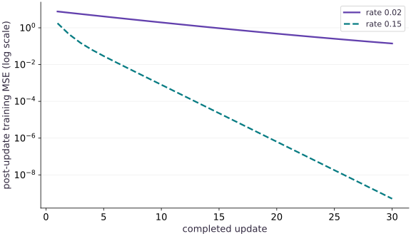

# Track experiments and lineage with MLflow

Phase 06: Data & checkpoint recovery · about 70 minutes · CPU

## What you will be able to do

- Decide what makes runs comparable
- Give data and code an identity
- Use a database and a deliberate artifact location
- Log at a useful boundary

## The problem

You ran two training configurations yesterday. Today you remember which curve looked better, but not which dataset, preprocessing or checkpoint produced it. Let’s make the comparison reproducible: train two small JAX models, log them to a real local MLflow database, then retrieve the selected run and its artifact.

## The idea

A tracker is useful when a plotted point leads back to the data, source, configuration and artifact that produced it. A run name or best label is not enough to identify a deployable checkpoint or reproduce its evaluation.

## Make every metric point traceable

Two runs may log validation loss at step 100 using different splits or denominators. The matching metric name and step do not make the values comparable. Record what was averaged and which examples contributed.

Link a selection decision to the precise checkpoint and evaluation. A run often contains many checkpoints, so selecting a run is not the same as selecting weights. Keep the model artifact's identity even if a dashboard display name changes.

The MLflow curves are recorded observations. Read configuration and metric definitions before ranking them. Tracking preserves a comparison's evidence; it cannot repair incompatible evaluation contracts. The same principle applies to Weights & Biases and other experiment trackers.

### Pause and reason

What belongs with a selected checkpoint besides its minimum validation value?

<details><summary>Compare your reasoning</summary>

Its artifact identity, dataset revision, metric definition, step convention, source/configuration and selection rule. Together these explain and reproduce the decision.

</details>

## Decide what makes runs comparable

We reuse a known regression problem so the engineering does not hide behind model complexity. Training inputs and validation inputs are separate. The target is $y=2x+1$, and the learned parameters are a weight and bias. Both runs start from zero, use the same examples and receive $30$ updates. Only the learning rate changes. Log those choices as parameters. Never compare two metrics with the same name when one is a sum and the other a mean, or one was measured before the update and the other afterward.

## Give data and code an identity

A path such as data.csv is a location, not a version. Hash the actual bytes, record the split IDs, and preserve preprocessing configuration. For this tiny fixture the hash covers the training arrays; a real dataset manifest should additionally identify schema, split/group rules and transformations. A Git commit is useful for clean code, but uncommitted edits require a source hash or captured diff. A checkpoint and an MLflow run should refer to the same identities; neither replaces the other.

## Use a database and a deliberate artifact location

The companion creates a temporary SQLite database and local artifact directory. SQLite stores run metadata; the artifacts contain the learned coefficients and preprocessing note. MlflowClient reads the records back, so a print statement is not our only evidence that logging occurred. These local examples use MLflow 3.16.1. A shared server needs supported database storage, artifact access, authentication, backup and retention; do not expose this local exercise as a public service.

**From the course workspace, install the tested CPU dependencies**

```bash
python -m pip install -r requirements-cpu.txt
```

**Expected:** MLflow 3.16.1 and the course numerical packages are installed in the selected environment.

## Log at a useful boundary

JAX dispatch is asynchronous. Converting a scalar loss to a Python float waits for it; logging every update is acceptable for this small demonstration but can slow a real training loop. Choose a reporting cadence, log the completed step, and separate checkpoint cadence from logging cadence. Here every training MSE is measured after its update. The validation MSE is computed on a fixed four-row set, with a second Python calculation checking the denominator.

$$
\operatorname{MSE}=\frac{1}{n}\sum_{i=1}^{n}(\hat y_i-y_i)^2
$$

## Retrieve before trusting the dashboard

The checker fetches all thirty metric steps, compares their stored values with the actual trajectory, checks the data tag and queries runs ordered by validation MSE. The faster-learning candidate wins this fixture. That is validation selection, not a final test result or a universal learning-rate recommendation. Finally we download the selected artifact and inspect its coefficients. Autologging can help supported frameworks, but explicit logging makes the boundary of this custom JAX loop visible.

## Continue into a real registry

Run the connected project lab to log two pyfunc models, register immutable versions, move a champion alias, reload the selected version and retain prompt/trace evidence. An alias is a mutable lookup; resolve it to a version for a deployment record. Setting champion does not roll out a service and MLflow does not enforce this course’s quality policy for you.

**Keep the local database and artifacts in a new output folder**

```bash
python projects/engineering-release/mlflow_lab.py --output ./engineering-run
```

**Expected:** Two training runs, two registered versions, one prompt version, one three-span trace and a model.json artifact are written. Use a fresh folder for another independent run.

## Run the example

```python
import os
os.environ['MLFLOW_DISABLE_AGENT_HINT'] = '1'
os.environ['MLFLOW_ENABLE_TELEMETRY'] = 'false'
import hashlib, json, tempfile
from pathlib import Path
import numpy as np
import jax
import jax.numpy as jnp
import mlflow
from mlflow import MlflowClient
x = jnp.array([-2., -1., 0., 1., 2.]); y = 2 * x + 1
vx = jnp.array([-1.5, -.5, .5, 1.5]); vy = 2 * vx + 1
objective = lambda p: jnp.mean((p[0] * x + p[1] - y) ** 2)
update = jax.jit(lambda p, rate: p - rate * jax.grad(objective)(p))
data_hash = hashlib.sha256(np.asarray(x).tobytes() + np.asarray(y).tobytes()).hexdigest()
curves, validation, run_ids = [], [], []
with tempfile.TemporaryDirectory(prefix='tracking-lesson-') as folder:
    root = Path(folder)
    mlflow.set_tracking_uri('sqlite:///' + str(root / 'tracking.db'))
    client = MlflowClient()
    experiment = client.create_experiment('two-rates', artifact_location=(root / 'artifacts').as_uri())
    for rate in [.02, .15]:
        p = jnp.zeros(2); history = []
        with mlflow.start_run(experiment_id=experiment) as run:
            mlflow.log_params({'rate': rate, 'updates': 30})
            mlflow.set_tags({'data_sha256': data_hash, 'jax': jax.__version__, 'backend': jax.default_backend(), 'metric_boundary': 'after update'})
            for step in range(1, 31):
                p = update(p, rate)
                metric = float(objective(p)); history.append(metric)
                mlflow.log_metric('train_mse', metric, step=step)
            held = float(jnp.mean((p[0] * vx + p[1] - vy) ** 2))
            # Independent host arithmetic checks what the reported validation metric means.
            oracle = sum((float(p[0]) * t + float(p[1]) - (2 * t + 1)) ** 2 for t in [-1.5, -.5, .5, 1.5]) / 4
            assert abs(held - oracle) < 1e-6
            mlflow.log_metric('validation_mse', held, step=30)
            mlflow.log_dict({'weight': float(p[0]), 'bias': float(p[1]), 'preprocessing': 'one unscaled scalar feature'}, 'model.json')
            run_ids.append(run.info.run_id)
        curves.append(history); validation.append(held)
        saved = client.get_metric_history(run_ids[-1], 'train_mse')
        assert [m.step for m in saved] == list(range(1, 31))
        np.testing.assert_allclose([m.value for m in saved], history)
        assert client.get_run(run_ids[-1]).data.tags['data_sha256'] == data_hash
    selected = client.search_runs([experiment], order_by=['metrics.validation_mse ASC'])[0]
    assert selected.info.run_id == run_ids[int(np.argmin(validation))]
    artifact = client.download_artifacts(selected.info.run_id, 'model.json')
    restored = json.loads(Path(artifact).read_text())
    assert abs(restored['weight'] - 2) < .001 and abs(restored['bias'] - 1) < .001
print('Validation MSE by learning rate:', dict(zip([.02, .15], validation)))
print('Verified 30 logged steps per run; selected and reloaded the better validation candidate.')

```

Expected: Validation MSE by learning rate: {0.02: 0.1199446..., 0.15: 5.04947...e-10}
Verified 30 logged steps per run; selected and reloaded the better validation candidate.

## Compare the runs that MLflow actually recorded

**Predict:** Do the two runs improve at the same rate, and can these training curves select a release by themselves?



**Recorded CPU computation**

### Read the figure

The horizontal axis counts completed updates, from $1$ to $30$. The vertical axis is post-update training MSE on a logarithmic scale: equal vertical distances represent ratios. The rate $0.15$ curve drops more quickly and ends far below the rate $0.02$ curve. The companion independently retrieves every plotted metric from MLflow. The final validation errors are about $0.11994$ and $5.05\times10^{-10}$, respectively; they are not plotted as a fabricated validation trajectory.

### Connect it to the computation

The comparison is controlled by shared data, initialization and update budget. It illustrates tracking and retrieval of evidence, not a general optimizer ranking. A separately held-out test and release checks still belong after validation selection.

```python
visual_data={'kind':'line','x':list(range(1,31)),'xlabel':'completed update','ylabel':'post-update training MSE (log scale)','yscale':'log','series':[{'label':'rate 0.02','y':curves[0]},{'label':'rate 0.15','y':curves[1]}]}
```

## Recorded reference execution

CPU run: 2026-10-06T15:40:39.487734+00:00. JAX 0.9.2.

```text
Validation MSE by learning rate: {0.02: 0.11994461715221405, 0.15: 5.049471951679152e-10}
Verified 30 logged steps per run; selected and reloaded the better validation candidate.
Validation difference: 0.11994461664726686
Wrong zero model validation MSE: 6.0
Changed target changes dataset identity.
PASS: recovery-06

```

## Check the stored comparison

**Predict before running:** Which learning rate should give the smaller error after the same update budget?

```python
assert validation[1] < validation[0]
print('Validation difference:',validation[0]-validation[1])
```

**Expected:** The rate 0.15 run has smaller validation MSE than the rate 0.02 run.

Both runs share initialization, data and update count. This isolates a configuration comparison; it does not compare equal wall-clock budgets or establish an optimal rate.

## Make it yours

Add a third, deliberately wrong model artifact and show why the smallest training loss alone is insufficient to select a release.

<details><summary>Reference solution</summary>

```python
bad_validation = sum((0. * t + 0. - (2*t+1))**2 for t in [-1.5,-.5,.5,1.5])/4
assert bad_validation > min(validation)
print('Wrong zero model validation MSE:',bad_validation)
```

</details>

## Change a data value

**transfer**

Change one training target and compute the data fingerprint again without overwriting the original record.

<details><summary>Hint</summary>

Hash the same input bytes plus changed target bytes.

</details>

<details><summary>Reference solution and reasoning</summary>

```python
changed_y=np.asarray(y).copy();changed_y[0]+=.1
changed_hash=hashlib.sha256(np.asarray(x).tobytes()+changed_y.tobytes()).hexdigest()
assert changed_hash != data_hash
print('Changed target changes dataset identity.')
```

Identical filenames or shapes do not imply identical data. A changed target creates a different experiment contract.

</details>

## Check your understanding

A run is tagged champion. What does that establish?

1. It is automatically deployed and monitored.
2. A registry alias points to that version; deployment and acceptance need their own evidence.
3. Its validation set is now an untouched test set.

<details><summary>Answer and explanation</summary>

A registry alias points to that version; deployment and acceptance need their own evidence.

An experiment groups comparable runs. A run stores one configuration, a history of metrics and artifacts. Lineage is the connection between those results and the exact code, data and environment that produced them. Tracking records an experiment; it does not recover the optimizer state or prove that a model deserves deployment.

</details>

## Diagnose the result

If a run is missing, inspect the tracking URI and experiment ID before repeating training. If metrics disagree, compare step and reduction conventions. If recovery changes the next batch, fix checkpoint state; MLflow logging does not restore it.

## Carry forward

- Decide what makes runs comparable
- Log at a useful boundary
- Continue into a real registry

## Keep your evidence

Keep both MLflow run IDs, source/data hashes, complete loss histories, the selection metric and predictions independently recomputed from the downloaded artifact.

Keep predictions, modified code, observed results, and reasoning. A checkpoint alone does not demonstrate the exercise.

## Primary references

- [MLflow experiment tracking](https://mlflow.org/docs/latest/ml/tracking/quickstart/)
- [MLflow model registry workflows](https://mlflow.org/docs/latest/ml/model-registry/workflow/)

