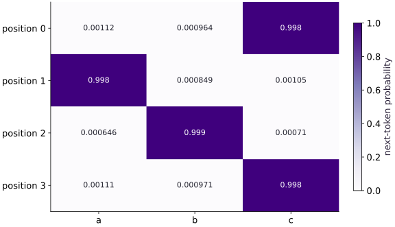

# Train, checkpoint, and generate

Phase 07: Transformers & language models · about 120 minutes · CPU

## What you will be able to do

- Assemble the token-to-logit contract
- Separate a learning experiment from a benchmark
- Checkpoint the continuation state and its schema
- Generate with an explicit decoding policy
- Use failures to test the experiment boundary

## The problem

Let’s connect the pieces into a tiny next-token model. We’ll use a repeating three-character sequence, so the targets and expected continuations are easy to inspect. You’ll train, save, resume one matching step, and generate tokens. Success on this controlled sequence does not demonstrate general language ability.

## The idea

Training provides known shifted targets. Generation predicts a next-token distribution and applies a decoding rule, then feeds the chosen token back as context. These two procedures use the model for different jobs.

## Separate teacher-forced targets from generated context

For probabilities $0.6,0.3,0.1$, greedy decoding selects the first token. Sampling may select another nonzero-probability token. That different choice changes the context and therefore the distribution at the following step.

Read each row of the probability figure before interpreting the generated string. Confidence on the fixture's target shows behavior on this small task; it does not establish broad language ability.

Keep tokenizer identity, context limit and termination rules with the checkpoint. Correct weights with a changed token-to-ID mapping define a different system. The text harness adds explicit cache behavior later; do not infer that this lesson's simple generation loop already implements it.

### Pause and reason

Why can two decoding policies produce different later distributions from identical weights?

<details><summary>Compare your reasoning</summary>

They can choose different earlier tokens, giving the model different later contexts. That is an expected consequence of decoding, not necessarily a numerical mismatch.

</details>

## Assemble the token-to-logit contract

Each token ID indexes one row of a $(3, 8)$ embedding table. Add a position row, apply the single-head causal block, normalize and project to three vocabulary logits. vmap applies this per-sequence function over the batch. The loss averages token cross entropy over both example and position axes.

For a uniform three-class prediction, negative log probability is `log(3)`, about $1.0986$, regardless of the target class. Zeroing the head provides a known check of that objective. This reduction assumes all positions are valid; padding and packing would require the masks and eligible-token reduction taught in the preceding lesson.

```text
IDs (B, T) → embeddings (B, T, 8)
+ positions → causal block → logits (B, T, 3)
shifted targets (B, T) → mean cross entropy → scalar
```

## Separate a learning experiment from a benchmark

The training string repeats abc; the held-out string begins with bca. Splitting strings makes the evaluation call distinct, but repeated periodic contexts mean that the split does not establish unseen-context generalization. The expected greedy sequence follows a known cycle, so it is a correctness fixture.

Record initial loss, final held-out loss and accuracy, and inspect target alignment by hand. A model could learn this rule with a simpler architecture. This exercise demonstrates the Transformer training plumbing; it does not demonstrate that attention is necessary for the task or that the model understands language.

## Checkpoint the continuation state and its schema

Adam carries count and moment estimates. Saving only parameters loses those values; even an equal initial loss after restart cannot prove that the next update will match. Save parameter and optimizer leaves, step, vocabulary and context. Recreate the expected tree structure from the same model and optimizer schema when loading, and reject mismatched leaf counts, shapes or dtypes.

The example writes numeric NPZ arrays with pickle disabled and a JSON manifest in a temporary directory, then checks the next transition against the uninterrupted state. The files are deliberately cleaned up after this smoke exercise. To keep learner evidence, change the directory to a persistent experiment folder. This two-file format is not atomic crash recovery; the data/recovery phase teaches stronger failure boundaries.

## Generate with an explicit decoding policy

For greedy generation, take the last token’s logits, choose argmax, append that token and repeat. Keep at most four tokens as the next context. There is no sampling key because this decoding policy is deterministic. Ties follow the argmax implementation; temperature and stochastic sampling would change the policy.

Recomputing the whole window is simple but inefficient for a large model. This lesson does not implement a key/value cache or serving scheduler. Unknown characters and empty prompts must fail clearly instead of silently becoming another vocabulary ID.

## Use failures to test the experiment boundary

Zero logits should give `log(3)`; a future-token perturbation should not affect earlier logits; a mismatched checkpoint vocabulary should be rejected; and an empty prompt should fail. These cases test different contracts, so passing one does not certify the others.

Keep the corpus, vocabulary, context, model seed, optimizer settings, package versions and numeric outputs with your work. The deterministic fixture has no shuffled data position or dropout key after initialization; a production resume must preserve those additional states when present.

## 1. Prepare packages and the vocabulary

Create main.py in the CPU environment. Add these imports and the vocabulary/context contract. Integer IDs must stay consistent with the output head.

```python
import jax
import jax.numpy as jnp
import numpy as np
import optax
import json
from pathlib import Path
from tempfile import TemporaryDirectory

VOCAB = {"a":0, "b":1, "c":2}
CONTEXT = 4
```

Vocabulary size is three, model width is eight, and the context limit is four.

## 2. Reuse the verified causal block

Append the normalization, projection initialization and causal block from the previous lesson. Identify where the attention mask prevents future reads.

```python
def layer_norm(x):
    mean = jnp.mean(x, axis=-1, keepdims=True)
    variance = jnp.mean((x-mean)**2, axis=-1, keepdims=True)
    return (x-mean) / jnp.sqrt(variance + 1e-5)

def init_block(key, width=8):
    keys = jax.random.split(key, 6)
    shapes = [(width,width)]*4 + [(width,2*width),(2*width,width)]
    return {name: jax.random.normal(k,s)*0.1 for name,k,s in zip(
        ["q","k","v","o","up","down"], keys, shapes)}

def block_forward(p, x):
    h = layer_norm(x)
    q, k, v = h@p["q"], h@p["k"], h@p["v"]
    scores = q@k.T / jnp.sqrt(x.shape[-1])
    allowed = jnp.arange(x.shape[0])[:,None] >= jnp.arange(x.shape[0])[None,:]
    weights = jax.nn.softmax(jnp.where(allowed, scores, -jnp.inf), axis=-1)
    residual = x + (weights@v)@p["o"]
    return residual + jax.nn.gelu(layer_norm(residual)@p["up"])@p["down"]
```

The block returns one model-width vector per token; it has no dropout or running statistics.

## 3. Add embeddings and the vocabulary head

Append model initialization, token-to-logit mapping and example construction. Write the input and target IDs for the first abcab window before proceeding.

```python
def init_lm(key):
    embed_key, block_key, head_key = jax.random.split(key, 3)
    return {"embed":jax.random.normal(embed_key,(3,8))*0.1,
            "position":jnp.arange(CONTEXT*8,dtype=jnp.float32).reshape(CONTEXT,8)*0.001,
            "block":init_block(block_key),
            "head":jax.random.normal(head_key,(8,3))*0.1}

def logits(p, tokens):
    h = p["embed"][tokens] + p["position"][:tokens.shape[0]]
    return layer_norm(block_forward(p["block"],h))@p["head"]

def make_examples(text):
    ids = np.array([VOCAB[c] for c in text],dtype=np.int32)
    rows = np.stack([ids[i:i+CONTEXT+1] for i in range(len(ids)-CONTEXT)])
    return jnp.array(rows[:,:-1]), jnp.array(rows[:,1:])
```

The head has three columns; make_examples shifts each window by one token for its targets.

## 4. Define the loss and compiled state transition

Append the dataset calls, cross-entropy reduction, Adam transformation and compiled step. Which values are returned for the next update?

```python
train_x, train_y = make_examples("abc"*12)
held_x, held_y = make_examples("bca"*6)
def lm_loss(p, x, y):
    predictions = jax.vmap(logits,in_axes=(None,0))(p,x)
    return jnp.mean(optax.softmax_cross_entropy_with_integer_labels(predictions,y))
optimizer = optax.adam(0.03)
@jax.jit
def train_step(p, state, x, y):
    value, gradients = jax.value_and_grad(lm_loss)(p,x,y)
    updates, next_state = optimizer.update(gradients,state,p)
    return optax.apply_updates(p,updates), next_state, value
```

train_step returns new parameters, optimizer state and the pre-update scalar loss; it does not mutate the caller.

## 5. Run the first twenty updates

Append this training block. You will save this state after twenty steps; keep the optimizer state alongside parameters.

```python
params = init_lm(jax.random.key(3))
state = optimizer.init(params)
initial = float(lm_loss(params,train_x,train_y))
for _ in range(20):
    params, state, _ = train_step(params,state,train_x,train_y)
# Save numeric leaves only, with a schema checked against this program's template.
```

Adam count should now equal twenty; initialization is the only random operation in this deterministic fixture.

## 6. Write and validate the snapshot format

Append the save/load helpers. Read each rejection check. Rebuilding a tree template supplies structure, not the saved numeric state.

```python
def save_snapshot(folder, p, state, step):
    leaves, _ = jax.tree.flatten((p,state))
    np.savez(folder/"state.npz", **{f"leaf_{i}":np.asarray(x) for i,x in enumerate(leaves)})
    manifest = {"schema":1,"step":step,"vocabulary":VOCAB,"context":CONTEXT,
                "shapes":[list(x.shape) for x in leaves],
                "dtypes":[str(x.dtype) for x in leaves]}
    (folder/"manifest.json").write_text(json.dumps(manifest))

def load_snapshot(folder):
    meta = json.loads((folder/"manifest.json").read_text())
    if meta["schema"] != 1 or meta["vocabulary"] != VOCAB or meta["context"] != CONTEXT:
        raise ValueError("checkpoint architecture/vocabulary mismatch")
    if type(meta["step"]) is not int or meta["step"] < 0:
        raise ValueError("invalid checkpoint step")
    template = init_lm(jax.random.key(0))
    template_leaves, structure = jax.tree.flatten((template,optimizer.init(template)))
    arrays = []
    with np.load(folder/"state.npz",allow_pickle=False) as data:
        if set(data.files) != {f"leaf_{i}" for i in range(len(template_leaves))}:
            raise ValueError("checkpoint leaf count mismatch")
        for i, leaf in enumerate(template_leaves):
            saved = data[f"leaf_{i}"]
            if saved.shape != leaf.shape or saved.dtype != np.asarray(leaf).dtype:
                raise ValueError("checkpoint leaf contract mismatch")
            arrays.append(jnp.array(saved))
    restored_p, restored_state = jax.tree.unflatten(structure,arrays)
    if int(restored_state[0].count) != meta["step"]:
        raise ValueError("checkpoint step and Adam count disagree")
    return restored_p, restored_state, meta["step"]
```

The loader checks architecture, vocabulary, numeric leaf contracts, step type and agreement with Adam count. It disables pickle.

## 7. Verify resume and evaluate the final fit

Append the disk round trip and next-step comparison, then the remaining eighty updates and held-out evaluation. The temporary folder is cleaned up.

```python
with TemporaryDirectory() as directory:
    folder = Path(directory)
    save_snapshot(folder,params,state,20)
    restored, restored_state, step = load_snapshot(folder)
    assert step == 20
    next_a, state_a, _ = train_step(params,state,train_x,train_y)
    next_b, state_b, _ = train_step(restored,restored_state,train_x,train_y)
    assert all(jnp.allclose(a,b,atol=1e-7) for a,b in zip(
        jax.tree.leaves((next_a,state_a)),jax.tree.leaves((next_b,state_b))))
for _ in range(80):
    params, state, _ = train_step(params,state,train_x,train_y)
held_logits = jax.vmap(logits,in_axes=(None,0))(params,held_x)
accuracy = jnp.mean(jnp.argmax(held_logits,axis=-1)==held_y)
final_loss = lm_loss(params,held_x,held_y)
print("Initial / held loss / held accuracy:",initial,float(final_loss),float(accuracy))
assert final_loss < 0.05
assert accuracy > 0.99
```

Uninterrupted and restored next transitions agree; the held-out periodic corpus tests pipeline behavior but repeats learned contexts.

## 8. Define greedy decoding

Append the prompt encoder and generation loop. Locate the context truncation and the deterministic argmax policy.

```python
def generate(p, prompt, count):
    tokens = [VOCAB[c] for c in prompt]
    if not tokens:
        raise ValueError("generation needs a nonempty prompt")
    inverse = {i:c for c,i in VOCAB.items()}
    for _ in range(count):
        window = jnp.array(tokens[-CONTEXT:],dtype=jnp.int32)
        new = int(jnp.argmax(logits(p,window)[-1]))
        tokens.append(new)
    return "".join(inverse[i] for i in tokens)
```

The generator recomputes a short window each step. It has no sampling, key/value cache or serving scheduler.

## 9. Check the expected continuation

Append the final call and run python main.py. Compare the continuation to the abc cycle you derived before training.

```python
continuation = generate(params,"abca",8)
print("Greedy continuation:",continuation)
assert continuation == "abcabcabcabc"
```

The expected continuation is abcabcabcabc, with held-out loss below $0.05$ and accuracy above $0.99$ for this fixture.

## Run the example

```python
import jax
import jax.numpy as jnp
import numpy as np
import optax
import json
from pathlib import Path
from tempfile import TemporaryDirectory

VOCAB = {"a":0, "b":1, "c":2}
CONTEXT = 4
def layer_norm(x):
    mean = jnp.mean(x, axis=-1, keepdims=True)
    variance = jnp.mean((x-mean)**2, axis=-1, keepdims=True)
    return (x-mean) / jnp.sqrt(variance + 1e-5)

def init_block(key, width=8):
    keys = jax.random.split(key, 6)
    shapes = [(width,width)]*4 + [(width,2*width),(2*width,width)]
    return {name: jax.random.normal(k,s)*0.1 for name,k,s in zip(
        ["q","k","v","o","up","down"], keys, shapes)}

def block_forward(p, x):
    h = layer_norm(x)
    q, k, v = h@p["q"], h@p["k"], h@p["v"]
    scores = q@k.T / jnp.sqrt(x.shape[-1])
    allowed = jnp.arange(x.shape[0])[:,None] >= jnp.arange(x.shape[0])[None,:]
    weights = jax.nn.softmax(jnp.where(allowed, scores, -jnp.inf), axis=-1)
    residual = x + (weights@v)@p["o"]
    return residual + jax.nn.gelu(layer_norm(residual)@p["up"])@p["down"]

def init_lm(key):
    embed_key, block_key, head_key = jax.random.split(key, 3)
    return {"embed":jax.random.normal(embed_key,(3,8))*0.1,
            "position":jnp.arange(CONTEXT*8,dtype=jnp.float32).reshape(CONTEXT,8)*0.001,
            "block":init_block(block_key),
            "head":jax.random.normal(head_key,(8,3))*0.1}

def logits(p, tokens):
    h = p["embed"][tokens] + p["position"][:tokens.shape[0]]
    return layer_norm(block_forward(p["block"],h))@p["head"]

def make_examples(text):
    ids = np.array([VOCAB[c] for c in text],dtype=np.int32)
    rows = np.stack([ids[i:i+CONTEXT+1] for i in range(len(ids)-CONTEXT)])
    return jnp.array(rows[:,:-1]), jnp.array(rows[:,1:])

train_x, train_y = make_examples("abc"*12)
held_x, held_y = make_examples("bca"*6)
def lm_loss(p, x, y):
    predictions = jax.vmap(logits,in_axes=(None,0))(p,x)
    return jnp.mean(optax.softmax_cross_entropy_with_integer_labels(predictions,y))
optimizer = optax.adam(0.03)
@jax.jit
def train_step(p, state, x, y):
    value, gradients = jax.value_and_grad(lm_loss)(p,x,y)
    updates, next_state = optimizer.update(gradients,state,p)
    return optax.apply_updates(p,updates), next_state, value

params = init_lm(jax.random.key(3))
state = optimizer.init(params)
initial = float(lm_loss(params,train_x,train_y))
for _ in range(20):
    params, state, _ = train_step(params,state,train_x,train_y)
# Save numeric leaves only, with a schema checked against this program's template.
def save_snapshot(folder, p, state, step):
    leaves, _ = jax.tree.flatten((p,state))
    np.savez(folder/"state.npz", **{f"leaf_{i}":np.asarray(x) for i,x in enumerate(leaves)})
    manifest = {"schema":1,"step":step,"vocabulary":VOCAB,"context":CONTEXT,
                "shapes":[list(x.shape) for x in leaves],
                "dtypes":[str(x.dtype) for x in leaves]}
    (folder/"manifest.json").write_text(json.dumps(manifest))

def load_snapshot(folder):
    meta = json.loads((folder/"manifest.json").read_text())
    if meta["schema"] != 1 or meta["vocabulary"] != VOCAB or meta["context"] != CONTEXT:
        raise ValueError("checkpoint architecture/vocabulary mismatch")
    if type(meta["step"]) is not int or meta["step"] < 0:
        raise ValueError("invalid checkpoint step")
    template = init_lm(jax.random.key(0))
    template_leaves, structure = jax.tree.flatten((template,optimizer.init(template)))
    arrays = []
    with np.load(folder/"state.npz",allow_pickle=False) as data:
        if set(data.files) != {f"leaf_{i}" for i in range(len(template_leaves))}:
            raise ValueError("checkpoint leaf count mismatch")
        for i, leaf in enumerate(template_leaves):
            saved = data[f"leaf_{i}"]
            if saved.shape != leaf.shape or saved.dtype != np.asarray(leaf).dtype:
                raise ValueError("checkpoint leaf contract mismatch")
            arrays.append(jnp.array(saved))
    restored_p, restored_state = jax.tree.unflatten(structure,arrays)
    if int(restored_state[0].count) != meta["step"]:
        raise ValueError("checkpoint step and Adam count disagree")
    return restored_p, restored_state, meta["step"]

with TemporaryDirectory() as directory:
    folder = Path(directory)
    save_snapshot(folder,params,state,20)
    restored, restored_state, step = load_snapshot(folder)
    assert step == 20
    next_a, state_a, _ = train_step(params,state,train_x,train_y)
    next_b, state_b, _ = train_step(restored,restored_state,train_x,train_y)
    assert all(jnp.allclose(a,b,atol=1e-7) for a,b in zip(
        jax.tree.leaves((next_a,state_a)),jax.tree.leaves((next_b,state_b))))
for _ in range(80):
    params, state, _ = train_step(params,state,train_x,train_y)
held_logits = jax.vmap(logits,in_axes=(None,0))(params,held_x)
accuracy = jnp.mean(jnp.argmax(held_logits,axis=-1)==held_y)
final_loss = lm_loss(params,held_x,held_y)
print("Initial / held loss / held accuracy:",initial,float(final_loss),float(accuracy))
assert final_loss < 0.05
assert accuracy > 0.99

def generate(p, prompt, count):
    tokens = [VOCAB[c] for c in prompt]
    if not tokens:
        raise ValueError("generation needs a nonempty prompt")
    inverse = {i:c for c,i in VOCAB.items()}
    for _ in range(count):
        window = jnp.array(tokens[-CONTEXT:],dtype=jnp.int32)
        new = int(jnp.argmax(logits(p,window)[-1]))
        tokens.append(new)
    return "".join(inverse[i] for i in tokens)

continuation = generate(params,"abca",8)
print("Greedy continuation:",continuation)
assert continuation == "abcabcabcabc"
```

Expected: Held-out loss below $0.05$ and accuracy above $0.99$ for the periodic fixture. Snapshot next-step replay agrees. Greedy continuation: abcabcabcabc. Exact loss depends on the tested backend.

## Inspect next-token probabilities before greedy decoding

**Predict:** Which token should follow each position in the held-out context?



**Recorded CPU computation**

### Read the figure

Each row is a position in the held-out context, and columns are the possible next tokens: a, b, and c. The cells contain next-token probabilities, with darker purple indicating larger probability. Each row sums to approximately $1$; displayed numbers are rounded.

Read the darkest column in each row: c, a, b, then c. Their probabilities are all above $0.99$ in this run, while the other entries are close to zero. For the context b, c, a, b, these choices continue the learned repeating sequence.

### Connect it to the computation

Greedy decoding takes the largest-probability token from the relevant row. The final context position therefore chooses c as the next token. The earlier rows show predictions for earlier prefixes; they are not four independently generated continuations from the final position.

These probabilities describe the trained model’s output on this tiny task. High probability and success on a repeating pattern do not establish general language ability or calibrated confidence. Check the row labels and the context before interpreting a bright cell as a correct prediction.

```python
probs = jax.nn.softmax(held_logits[0], axis=-1)
visual_data = {'kind': 'heatmap', 'values': probs.tolist(), 'rows': ['position ' + str(i) for i in range(CONTEXT)], 'columns': list(VOCAB.keys()), 'unit': 'next-token probability'}
```

## Recorded reference execution

CPU run: 2026-10-06T21:59:16.644263+00:00. JAX 0.9.2.

```text
Initial / held loss / held accuracy: 0.9807573556900024 0.0017881905660033226 1.0
Greedy continuation: abcabcabcabc
Initial / held loss / held accuracy: 0.9807573556900024 0.0017881905660033226 1.0
Greedy continuation: abcabcabcabc
PASS: transformers-04

```

## Verify uniform-logit cross entropy

**Predict before running:** With a zero output head, what is the cross entropy for any of the three targets?

```python
zero_head = {**params,"head":jnp.zeros_like(params["head"])}
assert jnp.allclose(lm_loss(zero_head,train_x,train_y),jnp.log(3.),atol=1e-6)
```

**Expected:** Mean loss `log(3)` ≈ $1.098612$.

A known probability distribution independently checks target handling and reduction.

## Test causality at the final model output

**Predict before running:** Changing only the last input token can affect which logits?

```python
example = jnp.array([0,1,2,0])
original = logits(params,example)
modified = logits(params,example.at[-1].set(1))
assert jnp.allclose(original[:3],modified[:3],atol=1e-5)
```

**Expected:** Earlier three logit rows remain the same.

Causal independence should hold for the full model, not only the standalone attention operation.

## Make it yours

Generate twelve new tokens from prompt bcab. Derive the expected cycle first; verify the string. Explain why success on this periodic example does not establish natural-language performance.

<details><summary>Reference solution</summary>

```python
assert generate(params,"bcab",12) == "bcabcabcabcabcab"
```

</details>

## Reject an incompatible checkpoint

**Transfer / diagnosis**

Save a fresh snapshot, edit only the vocabulary metadata, and prove the loader rejects it. Restore the metadata and verify recovery. Then forge `step=101` while retaining the 100-step optimizer state and verify that this mismatch is also rejected.

<details><summary>Hint</summary>

Change one vocabulary mapping rather than numeric leaves.

</details>

<details><summary>Reference solution and reasoning</summary>

```python
with TemporaryDirectory() as directory:
    folder = Path(directory)
    save_snapshot(folder,params,state,100)
    metadata_path = folder/"manifest.json"
    correct = metadata_path.read_text()
    metadata = json.loads(correct)
    metadata["vocabulary"] = {"a":1,"b":0,"c":2}
    metadata_path.write_text(json.dumps(metadata))
    try:
        load_snapshot(folder)
    except ValueError:
        pass
    else:
        raise AssertionError("wrong vocabulary accepted")
    forged_step = json.loads(correct)
    forged_step["step"] = 101
    metadata_path.write_text(json.dumps(forged_step))
    try:
        load_snapshot(folder)
    except ValueError:
        pass
    else:
        raise AssertionError("wrong step accepted")
    metadata_path.write_text(correct)
    recovered, _, recovered_step = load_snapshot(folder)
    assert recovered_step == 100
    assert jnp.allclose(logits(recovered,jnp.array([0,1,2,0])),logits(params,jnp.array([0,1,2,0])))
```

The metadata is part of the model contract even when parameter array shapes still match.

</details>

## Make prompt failures explicit

**Transfer / diagnosis**

Verify empty prompt rejection and unknown-character rejection. Record the difference between a ValueError for missing context and a KeyError for an unknown token.

<details><summary>Hint</summary>

The vocabulary mapping intentionally accepts only a, b and c.

</details>

<details><summary>Reference solution and reasoning</summary>

```python
try:
    generate(params,"",1)
except ValueError:
    pass
else:
    raise AssertionError("empty prompt accepted")
try:
    generate(params,"x",1)
except KeyError:
    pass
else:
    raise AssertionError("unknown token accepted")
assert generate(params,"abca",0) == "abca"
```

A decoding interface needs a defined input contract; neither failure should be mistaken for a training problem.

</details>

## Check your understanding

Why is saving only parameters insufficient to replay the next Adam update?

1. Adam uses optimizer count and moment history as well as parameters
2. The vocabulary alone stores all optimizer state
3. A matching current loss proves every future update matches

<details><summary>Answer and explanation</summary>

Adam uses optimizer count and moment history as well as parameters

Adam’s update depends on its explicit state. Compare the actual next transition after restoring both parameter and optimizer values.

</details>

## Diagnose the result

If loss does not improve, inspect the first shifted input/target window and verify the zero-head `log(3)` result before tuning the rate. If a resumed next step differs, compare both parameter leaves and Adam moments/count; a matching current loss is insufficient. The loader rejects vocabulary, shape, dtype and step/count mismatches. Generation failures require checking the prompt and context contract separately from training.

## Carry forward

- A known probability distribution independently checks target handling and reduction.
- Causal independence should hold for the full model, not only the standalone attention operation.

## Keep your evidence

Save the target alignment, uniform-loss derivation, training/held-out metrics with corpus limitations, snapshot continuation check, generated cycle and metadata/prompt rejection repairs.

Keep predictions, modified code, observed results, and reasoning. A checkpoint alone does not demonstrate the exercise.

## Primary references

- [JAX softmax API](https://docs.jax.dev/en/latest/_autosummary/jax.nn.softmax.html)
- [JAX attention API](https://docs.jax.dev/en/latest/_autosummary/jax.nn.dot_product_attention.html)
- [Optax cross entropy](https://optax.readthedocs.io/en/latest/api/losses.html)

