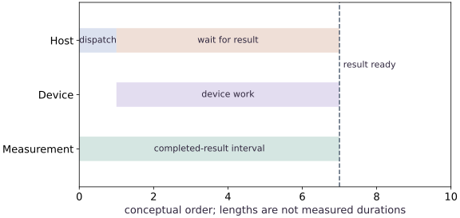
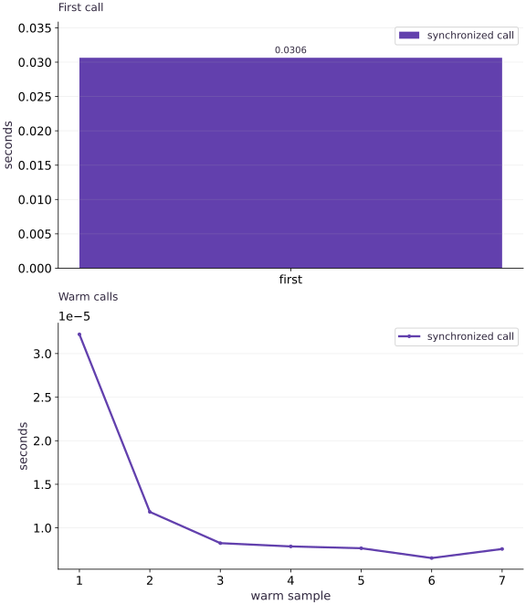

# Benchmark asynchronous work correctly

Phase 08: Performance diagnosis · about 80 minutes · CPU

## What you will be able to do

- Draw the interval a timing actually measures.
- Exclude initial placement from a device-resident benchmark.
- Check an independent NumPy result before comparing timings.
- Produce a report containing first-call and warmed sample distributions.

## The problem

A first timing suggests a tenfold speedup. Before celebrating, let’s ask when the timer started and stopped. We’ll separate the first call from warm calls, wait for JAX to finish, and compare numerical results. By the end, you’ll have a timing report another learner can reproduce.

## The idea

JAX can return an array handle before device work finishes. A benchmark must define what starts the interval and what counts as completion. First-call preparation, warm execution and end-to-end requests answer different performance questions.

## Time a completed result

If a timer stops as soon as dispatch returns, it may exclude most of the computation. Blocking on the result inside the interval includes completion of the work required to produce that result.

Warm up the intended specialization before measuring repeated execution, and retain startup separately if it matters to the application. Include preprocessing and transfers in a separately named end-to-end measurement when they belong to the request.

The first-call and warm bars represent different intervals. Their ratio depends on the workload and environment. A short dispatch time is not evidence of device throughput, and a warm kernel timing does not describe an entire service request.

$$
T_{\text{warm}} = \operatorname{median}_{r=1 \dots R}\left(t_{\text{ready}}^{(r)} - t_{\text{start}}^{(r)}\right), \qquad T_{\text{first}} = T_{\text{compile}} + T_{\text{warm}}
$$

### Time the completed result

**Predict:** Where should synchronization occur in completed-result latency measurement?



*Architecture and dataflow mechanism diagram.*

The host dispatches and waits while device work proceeds. The measurement lane includes readiness. Lengths illustrate ordering only and are not measured durations. Compilation and data preparation need separately chosen boundaries when included in a benchmark.

### Pause and reason

Where should synchronization occur in completed-result latency measurement?

<details><summary>Compare your reasoning</summary>

Before stopping the timer. Synchronizing afterward can omit unfinished work from the reported interval.

</details>

## Draw the boundary before starting the clock

For our workload, the input has shape $(64, 32)$, the weights have shape $(32, 16)$, and the result has shape $(64, 16)$. Matrix multiplication contracts the feature dimension, then tanh transforms each prediction. The timer starts after both input arrays are placed on CPU and ready. It stops after the output is ready.

That interval includes Python dispatch, execution and the final wait. It is not an isolated kernel duration. Data generation, initial placement and output conversion to NumPy are outside it. A serving request or data-loading benchmark would deliberately include different boundaries; specify which question your measurement answers.

```text
prepare host arrays → place → wait | start → call → result handle → wait → stop | inspect host values
```

## A handle is not proof of completion

Python can receive a JAX array before its contents finish computing. Reading shape or dtype can use metadata without reading the values. Calling block_until_ready on the result waits for readiness. Converting it to NumPy also requires the values, but adds a host-materialization boundary.

CPU dispatch behavior and workload size may make the difference difficult to see. If a handle-only interval is close to a synchronized interval on this machine, that does not justify removing synchronization from a portable benchmark. Timing two independent calls cannot be subtracted to obtain an exact queue or execution cost.

## First call and steady state answer different questions

A fresh jitted function can trace its Python body, lower the resulting program, obtain an executable and run it. The first-call timer combines these stages. Persistent caches and prior process activity can alter the result, so call it first-call latency for this process rather than an exact compilation measurement.

We then run seven synchronized repeats with identical shapes and dtypes. The list reveals variation; the median gives a compact center. Seven samples are an instructional start, not a confidence interval. Increase repetitions and document contention, power state and process initialization before drawing deployment conclusions.

## Correctness comes before a speed ratio

The NumPy reference uses the same float32 inputs and computes the same matrix product and tanh. Floating-point reduction order can vary, so the comparison permits small absolute and relative differences rather than demanding bit equality. We record maximum absolute error as well.

Comparing a float64 reference against an unreported float32 JAX computation, or comparing different matrix sizes, would mix numerical work with implementation differences. A faster answer to a different problem is not evidence of optimization. Retain both workload contracts and both checks in the report.

## Prepare and place the workload

Create benchmark.py in your activated course environment and add this block.

```python
# Step 1 — Prepare and place the workload: CPU placement and waiting occur before timing.
# Import json for this computation.
import json
import platform
import time
import statistics
import numpy as np
import jax
import jax.numpy as jnp
# Query the active JAX devices into `cpu`.
cpu = jax.devices("cpu")[0]
# Draw pseudorandom samples for `rng` using the explicit RNG state.
rng = np.random.default_rng(4)
# Cast or evaluate `x_host` in explicit floating-point precision.
x_host = rng.normal(size=(64, 32)).astype(np.float32)
# Cast or evaluate `w_host` in explicit floating-point precision.
w_host = rng.normal(size=(32, 16)).astype(np.float32)
# Place `x` explicitly onto the target JAX device.
x = jax.device_put(x_host, cpu)
# Place `w` explicitly onto the target JAX device.
w = jax.device_put(w_host, cpu)
# Synchronize host execution until asynchronous device computation completes.
jax.block_until_ready((x, w))
```

CPU placement and waiting occur before timing. The deterministic host inputs make the numerical check reproducible.

## Define the contract and timer

Append this block to the same file. Run the assembled file with python benchmark.py.

```python
# Step 2 — Define the contract and timer: The timer accepts arbitrary result pytrees because...
def predict(x, w):
    # Return `jnp.tanh(x @ w)` to the caller.
    return jnp.tanh(x @ w)
# Wrap with `jax.jit` (`compiled_predict`) so XLA traces and compiles the function.
compiled_predict = jax.jit(predict)
# Function `synchronized_samples(fn, args, repeats)` implementing this stage's computation:
def synchronized_samples(fn, args, repeats=7):
    # Guard input contract (`repeats < 1`) and fail fast if violated.
    if repeats < 1:
        raise ValueError("at least one repeat is required")
    # Compute `samples` from `[]`
    samples = []
    # Repeat the update loop over `range(repeats)` steps:
    for _ in range(repeats):
        # Record execution timing or profiler trace in `start`.
        start = time.perf_counter()
        # Run `fn` to compute `result`.
        result = fn(*args)
        # Synchronize host execution until asynchronous device computation completes.
        jax.block_until_ready(result)
        # Record execution timing or profiler trace in ``.
        samples.append(time.perf_counter() - start)
    # Return `(result, samples)` to the caller.
    return result, samples
```

The timer accepts arbitrary result pytrees because `jax.block_until_ready` waits across their array leaves. It collects observations without asserting which implementation is faster.

## Separate first call from warm calls

Append this block to the same file. Run the assembled file with python benchmark.py.

```python
# Step 3 — Separate first call from warm calls: The report prints variable measured times.
start = time.perf_counter()
# Run `compiled_predict` to compute `first`.
first = compiled_predict(x, w)
# Synchronize host execution until asynchronous device computation completes.
first.block_until_ready()
# Record execution timing or profiler trace in `first_call_seconds`.
first_call_seconds = time.perf_counter() - start
# Run `synchronized_samples` to compute `(result, samples)`.
result, samples = synchronized_samples(compiled_predict, (x, w))
# Perform matrix contraction / projection to compute `reference`.
reference = np.tanh(x_host @ w_host)
# Convert `` to a host NumPy array for inspection or verification.
np.testing.assert_allclose(np.asarray(result), reference, atol=2e-5, rtol=2e-5)
# Aggregate array values to compute `report`.
report = {
    "backend": str(cpu), "jax": jax.__version__, "numpy": np.__version__,
    "python": platform.python_version(), "input_shape": list(x.shape),
    "weight_shape": list(w.shape), "dtype": str(x.dtype),
    "boundary": "input already placed; call plus output synchronization",
    "first_call_seconds": first_call_seconds,
    "warm_samples_seconds": samples, "warm_median_seconds": statistics.median(samples),
    "max_abs_error": float(np.max(np.abs(np.asarray(result) - reference))),
}
# Assert invariant `len(samples) == 7 and all(t >= 0 for t in samples)` holds
assert len(samples) == 7 and all(t >= 0 for t in samples)
# Print the observed values to compare against the expected result.
print(json.dumps(report, indent=2))
```

The report prints variable measured times. Redirect the full run output to a text file and keep the benchmark script with it.

## Run the example

```python
# Step 1 — Prepare and place the workload: CPU placement and waiting occur before timing.
# Import json for this computation.
import json
import platform
import time
import statistics
import numpy as np
import jax
import jax.numpy as jnp
# Query the active JAX devices into `cpu`.
cpu = jax.devices("cpu")[0]
# Draw pseudorandom samples for `rng` using the explicit RNG state.
rng = np.random.default_rng(4)
# Cast or evaluate `x_host` in explicit floating-point precision.
x_host = rng.normal(size=(64, 32)).astype(np.float32)
# Cast or evaluate `w_host` in explicit floating-point precision.
w_host = rng.normal(size=(32, 16)).astype(np.float32)
# Place `x` explicitly onto the target JAX device.
x = jax.device_put(x_host, cpu)
# Place `w` explicitly onto the target JAX device.
w = jax.device_put(w_host, cpu)
# Synchronize host execution until asynchronous device computation completes.
jax.block_until_ready((x, w))
# Step 2 — Define the contract and timer: The timer accepts arbitrary result pytrees because...
def predict(x, w):
    # Return `jnp.tanh(x @ w)` to the caller.
    return jnp.tanh(x @ w)
# Wrap with `jax.jit` (`compiled_predict`) so XLA traces and compiles the function.
compiled_predict = jax.jit(predict)
# Function `synchronized_samples(fn, args, repeats)` implementing this stage's computation:
def synchronized_samples(fn, args, repeats=7):
    # Guard input contract (`repeats < 1`) and fail fast if violated.
    if repeats < 1:
        raise ValueError("at least one repeat is required")
    # Compute `samples` from `[]`
    samples = []
    # Repeat the update loop over `range(repeats)` steps:
    for _ in range(repeats):
        # Record execution timing or profiler trace in `start`.
        start = time.perf_counter()
        # Run `fn` to compute `result`.
        result = fn(*args)
        # Synchronize host execution until asynchronous device computation completes.
        jax.block_until_ready(result)
        # Record execution timing or profiler trace in ``.
        samples.append(time.perf_counter() - start)
    # Return `(result, samples)` to the caller.
    return result, samples
# Step 3 — Separate first call from warm calls: The report prints variable measured times.
start = time.perf_counter()
# Run `compiled_predict` to compute `first`.
first = compiled_predict(x, w)
# Synchronize host execution until asynchronous device computation completes.
first.block_until_ready()
# Record execution timing or profiler trace in `first_call_seconds`.
first_call_seconds = time.perf_counter() - start
# Run `synchronized_samples` to compute `(result, samples)`.
result, samples = synchronized_samples(compiled_predict, (x, w))
# Perform matrix contraction / projection to compute `reference`.
reference = np.tanh(x_host @ w_host)
# Convert `` to a host NumPy array for inspection or verification.
np.testing.assert_allclose(np.asarray(result), reference, atol=2e-5, rtol=2e-5)
# Aggregate array values to compute `report`.
report = {
    "backend": str(cpu), "jax": jax.__version__, "numpy": np.__version__,
    "python": platform.python_version(), "input_shape": list(x.shape),
    "weight_shape": list(w.shape), "dtype": str(x.dtype),
    "boundary": "input already placed; call plus output synchronization",
    "first_call_seconds": first_call_seconds,
    "warm_samples_seconds": samples, "warm_median_seconds": statistics.median(samples),
    "max_abs_error": float(np.max(np.abs(np.asarray(result) - reference))),
}
# Assert invariant `len(samples) == 7 and all(t >= 0 for t in samples)` holds
assert len(samples) == 7 and all(t >= 0 for t in samples)
# Print the observed values to compare against the expected result.
print(json.dumps(report, indent=2))
```

Expected: A JSON benchmark report: input_shape $[64, 32]$, weight_shape $[32, 16]$, dtype float32, seven nonnegative warmed samples, and a checked maximum error. Times vary by run; there is no required speedup.

## Separate the first call from warm measurements

**Predict:** Why should the first call not be averaged into steady-state latency?



**Recorded CPU computation**

### Read the figure

The upper panel measures the first synchronized call. The lower panel measures repeated warm calls, with sample number on the horizontal axis. Both report seconds, but they have independent vertical scales. Compare the tick values and any scientific-notation multiplier, not the physical heights of the panels.

The recorded first call is much longer than the warm calls. For orientation, $10^{-2}$ seconds is $10$ milliseconds, while $10^{-5}$ seconds is $10$ microseconds. A multiplier printed beside an axis applies to all its tick labels; overlooking it can hide a difference of orders of magnitude.

### Connect it to the computation

The first measurement includes work needed to prepare this specialization, including tracing and compilation. Compatible warm calls reuse it. Each measurement waits for the result, so it includes completed computation rather than only the time needed to dispatch work. Inputs are already placed before this measured boundary.

The warm line shows variation between individual samples. An isolated higher point is a slower sample, not proof of recompilation or a changing model. Read the recorded median alongside the full sample list, and rerun before comparing implementations. These measurements describe this small CPU workload; they are separate from accelerator speed or end-to-end request latency.

```python
# Compute figure data for: Separate the first call from warm measurements
# Compute `visual_data` from `{'kind': 'panels', 'panels': [{'kind': 'bar', 'title...`
visual_data = {'kind': 'panels', 'panels': [{'kind': 'bar', 'title': 'First call', 'labels': ['first'], 'ylabel': 'seconds', 'series': [{'label': 'synchronized call', 'y': [first_call_seconds]}]}, {'kind': 'line', 'title': 'Warm calls', 'x': list(range(1, len(samples) + 1)), 'xlabel': 'warm sample', 'ylabel': 'seconds', 'series': [{'label': 'synchronized call', 'y': samples}]}]}
```

## Recorded reference execution

CPU run: 2026-10-08T14:03:50.509935+00:00. JAX 0.9.2.

```text
{
  "backend": "TFRT_CPU_0",
  "jax": "0.9.2",
  "numpy": "2.4.4",
  "python": "3.14.3",
  "input_shape": [
    64,
    32
  ],
  "weight_shape": [
    32,
    16
  ],
  "dtype": "float32",
  "boundary": "input already placed; call plus output synchronization",
  "first_call_seconds": 0.033343374729156494,
  "warm_samples_seconds": [
    4.037516191601753e-05,
    1.5582889318466187e-05,
    1.00000761449337e-05,
    9.791925549507141e-06,
    8.124858140945435e-06,
    1.3916753232479095e-05,
    9.792391210794449e-06
  ],
  "warm_median_seconds": 1.00000761449337e-05,
  "max_abs_error": 2.384185791015625e-07
}
{
  "backend": "TFRT_CPU_0",
  "jax": "0.9.2",
  "numpy": "2.4.4",
  "python": "3.14.3",
  "input_shape": [
    64,
    32
  ],
  "weight_shape": [
    32,
    16
  ],
  "dtype": "float32",
  "boundary": "input already placed; call plus output synchronization",
  "first_call_seconds": 0.019748915918171406,
  "warm_samples_seconds": [
    3.808271139860153e-05,
    1.2124888598918915e-05,
    1.0499730706214905e-05,
    8.95792618393898e-06,
    1.329183578491211e-05,
    8.166301995515823e-06,
    1.2415926903486252e-05
  ],
  "warm_median_seconds": 1.2124888598918915e-05,
  "max_abs_error": 2.384185791015625e-07
}
Handle-only seconds: 1.0124873369932175e-05
Complete-call samples: [1.6333069652318954e-05, 9.917188435792923e-06, 1.2209173291921616e-05]
Structured samples: [4.345877096056938e-05, 2.5582965463399887e-05, 1.8499791622161865e-05]
Changed workload: (96, 32) [4.2499974370002747e-05, 1.8834136426448822e-05, 1.2958887964487076e-05, 1.2333039194345474e-05, 1.1541880667209625e-05]
Energy shape and samples: (64,) [3.2916199415922165e-05, 1.787487417459488e-05, 1.6292091459035873e-05, 8.66735354065895e-06, 1.3874843716621399e-05]
{'boundary': 'placed inputs; warm call plus output wait', 'samples': [1.7541926354169846e-05, 1.2667383998632431e-05, 1.1666212230920792e-05, 7.667113095521927e-06, 1.191580668091774e-05]}
PASS: performance-01

```

## Compare handle-only and synchronized boundaries

**Predict before running:** Will the handle-only number necessarily be smaller on this CPU? Which interval guarantees output completion?

```python
# Experiment — Compare handle-only and synchronized boundaries: The separate intervals have different measurement boundaries and...
start = time.perf_counter()
# Run `compiled_predict` to compute `handle`.
handle = compiled_predict(x, w)
# Record execution timing or profiler trace in `handle_seconds`.
handle_seconds = time.perf_counter() - start
handle.block_until_ready()  # drain this call before the separate comparison
# Run `synchronized_samples` to compute `(_, complete_samples)`.
_, complete_samples = synchronized_samples(compiled_predict, (x, w), repeats=3)
# Print the observed values to compare against the expected result.
print("Handle-only seconds:", handle_seconds)
# Print diagnostic summary of the computed outputs.
print("Complete-call samples:", complete_samples)
```

**Expected:** One handle-only interval and three complete-call intervals, all observed rather than fixed.

The separate intervals have different measurement boundaries and noise. Only synchronized samples guarantee completed output before the timer stops; no strict timing ordering is asserted.

## Return structured results without host copies

**Predict before running:** If a function returns predictions and their mean, does waiting for the prediction alone clearly document the readiness of every reported result?

```python
# Experiment — Return structured results without host copies: A tree-level wait makes the benchmark contract explicit for...
# Wrap with `jax.jit` (`structured`) so XLA traces and compiles the function.
structured = jax.jit(lambda a, b: {"prediction": jnp.tanh(a @ b), "mean": jnp.mean(jnp.tanh(a @ b))})
# Synchronize host execution until asynchronous device computation completes.
jax.block_until_ready(structured(x, w))
# Run `synchronized_samples` to compute `(structured_result, structured_times)`.
structured_result, structured_times = synchronized_samples(structured, (x, w), 3)
# Convert `` to a host NumPy array for inspection or verification.
np.testing.assert_allclose(np.asarray(structured_result["prediction"]), reference, atol=2e-5, rtol=2e-5)
# Convert `` to a host NumPy array for inspection or verification.
np.testing.assert_allclose(np.asarray(structured_result["mean"]), reference.mean(), atol=2e-5, rtol=2e-5)
# Print the observed values to compare against the expected result.
print("Structured samples:", structured_times)
```

**Expected:** Three timings and independently verified prediction/mean leaves.

A tree-level wait makes the benchmark contract explicit for every array leaf. Host inspection occurs after the timer, so the report describes device-ready computation rather than transfer-inclusive output consumption.

## Make it yours

Repeat the benchmark with $96$ rows while preserving the feature and output dimensions. Keep a separate report rather than overwriting the original workload label.

### How to write this exercise — Step-by-step recipe & starter scaffold

**Key functions & syntax to use:**
- `jnp.allclose(actual, expected, rtol=..., atol=...)` — Checks that two arrays match elementwise within floating-point tolerance.
- `Mesh + PartitionSpec + NamedSharding` — Maps logical tensor axes onto physical device mesh axes for SPMD data, tensor, or pipeline parallelism.
- `jax.block_until_ready(output)` — Synchronizes with the accelerator/CPU device so asynchronous dispatch finishes before wall-clock timing.

**Step-by-step implementation plan:**
1. Place `larger` explicitly onto the target JAX device.
2. Synchronize host execution until asynchronous device computation completes.
3. Synchronize host execution until asynchronous device computation completes.
4. Run `synchronized_samples` to compute `(larger_result, larger_times)`.
5. Convert `` to a host NumPy array for inspection or verification.

**Starter code scaffold (fill in the TODOs):**

```python
# Exercise solution: Repeat the benchmark with 96 rows while preserving the feature and...
larger_host = rng.normal(...)  # TODO: compute larger_host
# Place `larger` explicitly onto the target JAX device.
larger = jax.device_put(...)  # TODO: compute larger
# Synchronize host execution until asynchronous device computation completes.
larger.block_until_ready()
# Synchronize host execution until asynchronous device computation completes.
compiled_predict(larger, w).block_until_ready()
# Run `synchronized_samples` to compute `(larger_result, larger_times)`.
larger_result, larger_times = synchronized_samples(...)  # TODO: compute larger_result, larger_times
# Convert `` to a host NumPy array for inspection or verification.
np.testing.assert_allclose(np.asarray(larger_result), np.tanh(larger_host @ w_host), atol=2e-5, rtol=2e-5)
# Print the observed values to compare against the expected result.
print("Changed workload:", larger.shape, larger_times)
```

<details><summary>Reference solution</summary>

```python
# Exercise solution: Repeat the benchmark with 96 rows while preserving the feature and...
larger_host = rng.normal(size=(96, 32)).astype(np.float32)
# Place `larger` explicitly onto the target JAX device.
larger = jax.device_put(larger_host, cpu)
# Synchronize host execution until asynchronous device computation completes.
larger.block_until_ready()
# Synchronize host execution until asynchronous device computation completes.
compiled_predict(larger, w).block_until_ready()
# Run `synchronized_samples` to compute `(larger_result, larger_times)`.
larger_result, larger_times = synchronized_samples(compiled_predict, (larger, w), 5)
# Convert `` to a host NumPy array for inspection or verification.
np.testing.assert_allclose(np.asarray(larger_result), np.tanh(larger_host @ w_host), atol=2e-5, rtol=2e-5)
# Print the observed values to compare against the expected result.
print("Changed workload:", larger.shape, larger_times)
```

</details>

## Benchmark a different equivalent workload

**Transfer**

Replace tanh with a row-wise sum of squared predictions, returning one scalar per row. Derive the NumPy reference, warm this new function, collect five synchronized samples and record the changed output shape.

<details><summary>Hint</summary>

Square before reducing the output-feature axis; the result has shape $(64,)$.

</details>

### How to write: Benchmark a different equivalent workload — Step-by-step recipe & starter scaffold

**Key functions & syntax to use:**
- `x.sum(axis=...) / x.mean(axis=..., keepdims=...)` — Reduces values along the named `axis` (the axis you name is collapsed unless `keepdims=True`).
- `jnp.allclose(actual, expected, rtol=..., atol=...)` — Checks that two arrays match elementwise within floating-point tolerance.
- `jax.jit(fn) / @jax.jit` — Traces `fn` with abstract shapes and compiles a fused XLA executable cached by input shape and dtype.
- `jax.block_until_ready(output)` — Synchronizes with the accelerator/CPU device so asynchronous dispatch finishes before wall-clock timing.

**Step-by-step implementation plan:**
1. Wrap with `jax.jit` (`energy`) so XLA traces and compiles the function.
2. Synchronize host execution until asynchronous device computation completes.
3. Run `synchronized_samples` to compute `(energy_result, energy_times)`.
4. Reduce along axis=1 to compute `energy_reference`.
5. Check tensor shape invariant: `energy_result.shape == (64,)`

**Starter code scaffold (fill in the TODOs):**

```python
# Benchmark a different equivalent workload (Transfer): Changing the computation changes the performance question.
# Wrap with `jax.jit` (`energy`) so XLA traces and compiles the function.
energy = jax.jit(...)  # TODO: compute energy
# Synchronize host execution until asynchronous device computation completes.
energy(x, w).block_until_ready()
# Run `synchronized_samples` to compute `(energy_result, energy_times)`.
energy_result, energy_times = synchronized_samples(...)  # TODO: compute energy_result, energy_times
# Reduce along axis=1 to compute `energy_reference`.
energy_reference = np.sum(...)  # TODO: compute energy_reference
# Check tensor shape invariant: `energy_result.shape == (64,)`
assert energy_result.shape  # TODO: complete assertion check
# Convert `` to a host NumPy array for inspection or verification.
np.testing.assert_allclose(np.asarray(energy_result), energy_reference, atol = ...  # TODO: compute np.testing.assert_allclose(np.asarray(energy_result), energy_reference, atol
# Print the observed values to compare against the expected result.
print("Energy shape and samples:", energy_result.shape, energy_times)
```

<details><summary>Reference solution and reasoning</summary>

```python
# Benchmark a different equivalent workload (Transfer): Changing the computation changes the performance question.
# Wrap with `jax.jit` (`energy`) so XLA traces and compiles the function.
energy = jax.jit(lambda a, b: jnp.sum((a @ b)**2, axis=1))
# Synchronize host execution until asynchronous device computation completes.
energy(x, w).block_until_ready()
# Run `synchronized_samples` to compute `(energy_result, energy_times)`.
energy_result, energy_times = synchronized_samples(energy, (x, w), 5)
# Reduce along axis=1 to compute `energy_reference`.
energy_reference = np.sum((x_host @ w_host)**2, axis=1)
# Check tensor shape invariant: `energy_result.shape == (64,)`
assert energy_result.shape == (64,)
# Convert `` to a host NumPy array for inspection or verification.
np.testing.assert_allclose(np.asarray(energy_result), energy_reference, atol=2e-3, rtol=2e-5)
# Print the observed values to compare against the expected result.
print("Energy shape and samples:", energy_result.shape, energy_times)
```

Changing the computation changes the performance question. The shape and independent numerical check prevent a benchmark from accidentally timing an unrelated scalar reduction.

</details>

## Repair a timer that includes setup but omits completion

**Diagnosis**

Inspect the broken timer below conceptually: start; create inputs; call `jit(predict)(inputs)`; stop. Write a repaired runner and show its explicit boundary. Explain which stages the broken interval mixes and misses.

<details><summary>Hint</summary>

Prepare and wait for inputs, reuse one compiled callable, warm it, then synchronize the returned output inside every measured interval.

</details>

### How to write: Repair a timer that includes setup but omits completion — Step-by-step recipe & starter scaffold

**Key functions & syntax to use:**
- `jnp.allclose(actual, expected, rtol=..., atol=...)` — Checks that two arrays match elementwise within floating-point tolerance.
- `jax.block_until_ready(output)` — Synchronizes with the accelerator/CPU device so asynchronous dispatch finishes before wall-clock timing.

**Step-by-step implementation plan:**
1. Repair a timer that includes setup but omits completion (Diagnosis): The repaired boundary excludes setup, separates warmup and...
2. Synchronize host execution until asynchronous device computation completes.
3. Synchronize host execution until asynchronous device computation completes.
4. Run `synchronized_samples` to compute `(result, measured)`.
5. Return `({'boundary': 'placed inputs; warm call plus output wait', 'samples': measured}, result)` to the caller.

**Starter code scaffold (fill in the TODOs):**

```python
# Repair a timer that includes setup but omits completion (Diagnosis): The repaired boundary excludes setup, separates warmup and...
def repaired_benchmark(fn, args):
    # Synchronize host execution until asynchronous device computation completes.
    jax.block_until_ready(args)
    # Synchronize host execution until asynchronous device computation completes.
    jax.block_until_ready(fn(*args))
    # Run `synchronized_samples` to compute `(result, measured)`.
    result, measured = synchronized_samples(...)  # TODO: compute result, measured
    # Return `({'boundary': 'placed inputs; warm call plus output wait', 'samples': measured}, result)` to the caller.
    return ...  # TODO: return computed result
# Run `repaired_benchmark` to compute `(fixed_report, fixed_result)`.
fixed_report, fixed_result = repaired_benchmark(...)  # TODO: compute fixed_report, fixed_result
# Convert `` to a host NumPy array for inspection or verification.
np.testing.assert_allclose(np.asarray(fixed_result), reference, atol = ...  # TODO: compute np.testing.assert_allclose(np.asarray(fixed_result), reference, atol
# Assert invariant `len(fixed_report["samples"]) == 5` holds
assert len(fixed_report["samples"])  # TODO: complete assertion check
# Print the observed values to compare against the expected result.
print(fixed_report)
```

<details><summary>Reference solution and reasoning</summary>

```python
# Repair a timer that includes setup but omits completion (Diagnosis): The repaired boundary excludes setup, separates warmup and...
def repaired_benchmark(fn, args):
    # Synchronize host execution until asynchronous device computation completes.
    jax.block_until_ready(args)
    # Synchronize host execution until asynchronous device computation completes.
    jax.block_until_ready(fn(*args))
    # Run `synchronized_samples` to compute `(result, measured)`.
    result, measured = synchronized_samples(fn, args, 5)
    # Return `({'boundary': 'placed inputs; warm call plus output wait', 'samples': measured}, result)` to the caller.
    return {"boundary": "placed inputs; warm call plus output wait", "samples": measured}, result
# Run `repaired_benchmark` to compute `(fixed_report, fixed_result)`.
fixed_report, fixed_result = repaired_benchmark(compiled_predict, (x, w))
# Convert `` to a host NumPy array for inspection or verification.
np.testing.assert_allclose(np.asarray(fixed_result), reference, atol=2e-5, rtol=2e-5)
# Assert invariant `len(fixed_report["samples"]) == 5` holds
assert len(fixed_report["samples"]) == 5
# Print the observed values to compare against the expected result.
print(fixed_report)
```

The repaired boundary excludes setup, separates warmup and waits before stopping. A speedup cannot be reconstructed from the flawed interval; rerun both implementations under the same contract.

</details>

## Check your understanding

What does the synchronized warmed timer in this lesson measure?

1. Only the accelerator kernel, with all dispatch overhead removed
2. A warmed call including dispatch and waiting for output readiness, excluding prior input placement
3. Exactly the compiler duration

<details><summary>Answer and explanation</summary>

A warmed call including dispatch and waiting for output readiness, excluding prior input placement

The boundary includes the call and its completion wait. It excludes input placement and does not isolate compiler or kernel stages.

</details>

## Diagnose the result

If samples vary, first check workload identity, dtype, the warmup call, where synchronization occurs and system contention. Do not change a timer until its start/stop boundary answers the intended question.

## Carry forward

- Keep first-call latency separate from warmed samples.
- Wait for results before reporting completed computation.
- Report numerical equivalence and workload details beside times.

## Keep your evidence

Keep benchmark.py, complete observed JSON/sample output, workload shapes/dtypes, numerical tolerance/error, first-call versus warmed boundaries, changed-workload report and repaired timer explanation.

Save your predictions, modified code, terminal outputs, and reasoning in your engineering portfolio.

## Primary references

- [Benchmarking JAX code](https://docs.jax.dev/en/latest/benchmarking.html)
- [Asynchronous dispatch](https://docs.jax.dev/en/latest/async_dispatch.html)

