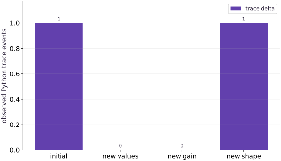

# Diagnose recompilation and host synchronization

Phase 08: Performance diagnosis · about 80 minutes · CPU

## What you will be able to do

- Record shapes, dtypes and dynamic/static choices beside observed tracing.
- Separate Python trace diagnostics from compilation evidence.
- Keep ordinary numerical hyperparameters dynamic when their values need not determine program structure.
- Compare per-step host consumption with one final host consumption while checking equivalent results.

## The problem

A new batch size makes one call pause; reading a metric makes another loop wait. Those delays can look similar, but they have different causes. We’ll record the shapes, dtypes and static choices of each call, then inspect where Python asks for device values. The evidence will guide the change.

## The idea

Slow steps can come from preparing new program specializations or from waiting for already-compiled work. Use a controlled call ledger and timing boundaries to separate those causes.

## Distinguish new tracing from host waiting

Change only array values while keeping shapes, dtypes and static choices fixed. Then change one signature component and record the observed trace behavior. Changing everything together makes the cause ambiguous.

Inspect host reads and logging next. Converting device results into Python values can force a wait even when no retracing occurs. That delay needs a different intervention from reducing signature variation.

Trace counts describe observed Python tracing. They are not a universal count of compiler work or a guarantee of cache reuse after restart. Combine the ledger with a trace of completed work before deciding which change improves the actual workload.

### Pause and reason

If the trace count stays constant but a step is slow, what should you inspect?

<details><summary>Compare your reasoning</summary>

Inspect synchronization, transfers, data preparation and logging. A stable trace count does not rule out those boundaries.

</details>

## A call signature is different from its numerical data

Our score is the sum of squared scaled inputs. With $x=[0, \ldots, 7]$ and gain $1$, the answer is $140$; with gain $2$ it becomes $560$. Passing a float32 scalar gain keeps its abstract shape and dtype unchanged when the value changes. The transformed computation can read that value at execution time.

An array of twelve elements has a different shape from the eight-element array. Ordinary jit specializes to these shapes, so this is a plausible cause of new staging work. A ledger records the actual calls before attributing a pause. Sharding, compiler options, callable identity and other context can matter too; the ledger is a diagnosis aid, not a full cache-key specification.

```text
call → (shape, dtype, static choices) → specialization
             dynamic values → execution of that program
```

## Observe tracing without mislabeling compilation

The score function appends its input signature to a Python list. This is a deliberate authoring diagnostic: Python runs while JAX traces the function, whereas the compiled numerical operations can run later without replaying that Python append. Never use this list as optimizer state or a reliable callback from accelerator execution.

We log the change in list length around each call, but assert numerical answers rather than a fixed event count. Cache state and implementation details affect observations. A trace event does not prove that a new executable was compiled, and absence of an event is not proof that no compiler activity occurred. Enable public jax_log_compiles diagnostics or obtain a profiler trace for stronger evidence, recording exactly which log event supports a claim.

**Capture public compilation diagnostics on macOS/Linux**

```POSIX shell
# Capture public compilation diagnostics on macOS/Linux
JAX_LOG_COMPILES=1 python diagnosis.py 2> compile.log
```

**Expected:** The usual ledger appears in the terminal. compile.log contains JAX diagnostics, including tracing and compilation messages when observed. Read the named stage in each line; do not count every line as a compile.

**Capture diagnostics in PowerShell**

```PowerShell
# Capture diagnostics in PowerShell
$env:JAX_LOG_COMPILES="1"
python diagnosis.py 2> compile.log
Remove-Item Env:JAX_LOG_COMPILES
```

**Expected:** The ledger appears in the terminal and diagnostics are captured in compile.log. Removing the environment variable restores the shell setting after the run.

## Choose static arguments for structure rather than convenience

A Boolean selecting one of two Python branches can be static so tracing selects the branch. Its value then becomes part of specialization, so changing that choice can trigger staging. Static arguments must be hashable and are unsuitable for arbitrary numerical array data. Avoid declaring a rapidly changing scalar gain static just to make Python logic convenient.

If the gain only participates in arithmetic, pass it as a typed scalar array as we did. If a runtime Boolean chooses arithmetic, express the selection with lax.cond or another appropriate array operation. Static metadata and dynamic numerical values serve different purposes; changing one into the other can change the number of specializations and the program itself.

## A host metric is an explicit synchronization boundary

`float(score)` needs the scalar contents in Python. That read waits for any outstanding work needed to produce it. Keeping a scalar loss as a JAX array allows later device computations to consume it without Python inspecting its value. A chain can then be synchronized once at the final output.

The exercise compares six dependent updates with host consumption after each step against six updates with a final wait. Both variants must produce the same scalar. Their wall-clock boundaries include different waits and conversion overhead; we record both but assert no speed ordering. Removing intermediate logging also removes observability, so production systems may use bounded logging intervals instead of silently dropping metrics.

## Prepare a trace ledger

Create diagnosis.py in your activated course environment and add this block.

```python
# Step 1 — Prepare a trace ledger: This CPU experiment deliberately keeps the trace ledger outside...
# Import json for this computation.
import json
import time
import numpy as np
import jax
import jax.numpy as jnp
# Query the active JAX devices into `cpu`.
cpu = jax.devices("cpu")[0]
# Evaluate `trace_events` from the current inputs and state.
trace_events = []
# Function `score(x, gain)` implementing this stage's computation:
def score(x, gain):
    # Authoring diagnostic: this Python effect happens during tracing.
    # It is NOT model state and does not count executable compilations.
    trace_events.append({"shape": list(x.shape), "dtype": str(x.dtype)})
    # Return `jnp.sum((x * gain) ** 2)` to the caller.
    return jnp.sum((x * gain)**2)
# Wrap with `jax.jit` (`compiled_score`) so XLA traces and compiles the function.
compiled_score = jax.jit(score)
# Initialize array `x8` with explicit values and shape.
x8 = jax.device_put(np.arange(8, dtype=np.float32), cpu)
# Initialize array `x12` with explicit values and shape.
x12 = jax.device_put(np.arange(12, dtype=np.float32), cpu)
# Synchronize host execution until asynchronous device computation completes.
jax.block_until_ready((x8, x12))
```

This CPU experiment deliberately keeps the trace ledger outside numerical state. Run it in a fresh process when comparing observations.

## Record call signatures and observed traces

Append this block to the same file. Run the assembled file with python diagnosis.py.

```python
# Step 2 — Record call signatures and observed traces: The ledger relates each controlled signature change to the...
call_rows = []
# Function `observed_call(label, x, gain)` implementing this stage's computation:
def observed_call(label, x, gain):
    # Run `len` to compute `before`.
    before = len(trace_events)
    # Place `result` explicitly onto the target JAX device.
    result = compiled_score(x, jax.device_put(np.float32(gain), cpu))
    # Synchronize host execution until asynchronous device computation completes.
    result.block_until_ready()
    # Convert `expected` to a host NumPy array for inspection or verification.
    expected = np.sum((np.asarray(x) * np.float32(gain))**2)
    # Convert `` to a host NumPy array for inspection or verification.
    np.testing.assert_allclose(np.asarray(result), expected, rtol=2e-5, atol=2e-5)
    # Append the current step result to `call_rows`.
    call_rows.append({"label": label, "shape": list(x.shape), "dtype": str(x.dtype),
                      "observed_trace_delta": len(trace_events) - before,
                      "result": float(result)})
    # Return `result` to the caller.
    return result
```

The ledger relates each controlled signature change to the observed Python event delta, with an independent NumPy value check.

## Run the controlled call sequence

Append this block to the same file. Run the assembled file with python diagnosis.py.

```python
# Step 3 — Run the controlled call sequence: Inspect the event deltas on your own environment.
observed_call("initial signature", x8, 1.)
# Run `observed_call` to perform the next check or state transition.
observed_call("same signature changed data", x8 + 1., 1.)
# Run `observed_call` to perform the next check or state transition.
observed_call("same signature changed dynamic gain", x8, 2.)
# Run `observed_call` to perform the next check or state transition.
observed_call("different input shape", x12, 1.)
# Print the observed values to compare against the expected result.
print(json.dumps({"jax": jax.__version__, "backend": str(cpu),
                  "calls": call_rows, "python_trace_events": trace_events}, indent=2))
# Verify contract: `call_rows[0]['result'] == 140.0`.
assert call_rows[0]["result"] == 140.
# Verify that the output satisfies the expected shape, finite-value, or numerical contract.
assert call_rows[2]["result"] == 560.
# Verify that the output satisfies the expected shape, finite-value, or numerical contract.
assert call_rows[3]["result"] == 506.
```

Inspect the event deltas on your own environment. The required outputs are checked numeric scores, not a fabricated trace or compilation count.

## Run the example

```python
# Step 1 — Prepare a trace ledger: This CPU experiment deliberately keeps the trace ledger outside...
# Import json for this computation.
import json
import time
import numpy as np
import jax
import jax.numpy as jnp
# Query the active JAX devices into `cpu`.
cpu = jax.devices("cpu")[0]
# Evaluate `trace_events` from the current inputs and state.
trace_events = []
# Function `score(x, gain)` implementing this stage's computation:
def score(x, gain):
    # Authoring diagnostic: this Python effect happens during tracing.
    # It is NOT model state and does not count executable compilations.
    trace_events.append({"shape": list(x.shape), "dtype": str(x.dtype)})
    # Return `jnp.sum((x * gain) ** 2)` to the caller.
    return jnp.sum((x * gain)**2)
# Wrap with `jax.jit` (`compiled_score`) so XLA traces and compiles the function.
compiled_score = jax.jit(score)
# Initialize array `x8` with explicit values and shape.
x8 = jax.device_put(np.arange(8, dtype=np.float32), cpu)
# Initialize array `x12` with explicit values and shape.
x12 = jax.device_put(np.arange(12, dtype=np.float32), cpu)
# Synchronize host execution until asynchronous device computation completes.
jax.block_until_ready((x8, x12))
# Step 2 — Record call signatures and observed traces: The ledger relates each controlled signature change to the...
call_rows = []
# Function `observed_call(label, x, gain)` implementing this stage's computation:
def observed_call(label, x, gain):
    # Run `len` to compute `before`.
    before = len(trace_events)
    # Place `result` explicitly onto the target JAX device.
    result = compiled_score(x, jax.device_put(np.float32(gain), cpu))
    # Synchronize host execution until asynchronous device computation completes.
    result.block_until_ready()
    # Convert `expected` to a host NumPy array for inspection or verification.
    expected = np.sum((np.asarray(x) * np.float32(gain))**2)
    # Convert `` to a host NumPy array for inspection or verification.
    np.testing.assert_allclose(np.asarray(result), expected, rtol=2e-5, atol=2e-5)
    # Append the current step result to `call_rows`.
    call_rows.append({"label": label, "shape": list(x.shape), "dtype": str(x.dtype),
                      "observed_trace_delta": len(trace_events) - before,
                      "result": float(result)})
    # Return `result` to the caller.
    return result
# Step 3 — Run the controlled call sequence: Inspect the event deltas on your own environment.
observed_call("initial signature", x8, 1.)
# Run `observed_call` to perform the next check or state transition.
observed_call("same signature changed data", x8 + 1., 1.)
# Run `observed_call` to perform the next check or state transition.
observed_call("same signature changed dynamic gain", x8, 2.)
# Run `observed_call` to perform the next check or state transition.
observed_call("different input shape", x12, 1.)
# Print the observed values to compare against the expected result.
print(json.dumps({"jax": jax.__version__, "backend": str(cpu),
                  "calls": call_rows, "python_trace_events": trace_events}, indent=2))
# Verify contract: `call_rows[0]['result'] == 140.0`.
assert call_rows[0]["result"] == 140.
# Verify that the output satisfies the expected shape, finite-value, or numerical contract.
assert call_rows[2]["result"] == 560.
# Verify that the output satisfies the expected shape, finite-value, or numerical contract.
assert call_rows[3]["result"] == 506.
```

Expected: A JSON ledger of four calls and observed Python trace events. Checked scores include $140$, $560$ and $506$; event deltas are recorded rather than fixed by the lesson.

## A new value is not necessarily a new trace

**Predict:** Which call changes the input signature?



**Recorded CPU computation**

### Read the figure

Each bar reports the additional Python tracing events observed during one call category. The sequence is $(1,0,0,1)$: the initial call traces, new array values do not, a new dynamic gain does not, and a new input shape triggers another trace.

The two zero-height bars are meaningful observations. The calls still execute and can return changed values; zero means the trace counter did not increase for those calls.

### Connect it to the computation

The existing specialization can accept compatible dynamic values without rerunning the traced Python body. Changing the example’s shape from length $8$ to length $12$ changes the abstract input signature, so a new trace is observed. This isolates shape from ordinary value changes.

The vertical axis counts Python traces, not seconds, device kernels, or an exact count of backend compilations. To diagnose runtime overhead, combine this kind of counter with synchronized measurements or a profiler. A changed answer alone is not evidence of retracing.

```python
# Compute figure data for: A new value is not necessarily a new trace
# Evaluate `visual_data` from the current inputs and state.
visual_data = {'kind': 'bar', 'labels': ['initial', 'new values', 'new gain', 'new shape'], 'ylabel': 'observed Python trace events', 'series': [{'label': 'trace delta', 'y': [r['observed_trace_delta'] for r in call_rows]}]}
```

## Recorded reference execution

CPU run: 2026-10-08T14:03:52.128835+00:00. JAX 0.9.2.

```text
{
  "jax": "0.9.2",
  "backend": "TFRT_CPU_0",
  "calls": [
    {
      "label": "initial signature",
      "shape": [
        8
      ],
      "dtype": "float32",
      "observed_trace_delta": 1,
      "result": 140.0
    },
    {
      "label": "same signature changed data",
      "shape": [
        8
      ],
      "dtype": "float32",
      "observed_trace_delta": 0,
      "result": 204.0
    },
    {
      "label": "same signature changed dynamic gain",
      "shape": [
        8
      ],
      "dtype": "float32",
      "observed_trace_delta": 0,
      "result": 560.0
    },
    {
      "label": "different input shape",
      "shape": [
        12
      ],
      "dtype": "float32",
      "observed_trace_delta": 1,
      "result": 506.0
    }
  ],
  "python_trace_events": [
    {
      "shape": [
        8
      ],
      "dtype": "float32"
    },
    {
      "shape": [
        12
      ],
      "dtype": "float32"
    }
  ]
}
{
  "jax": "0.9.2",
  "backend": "TFRT_CPU_0",
  "calls": [
    {
      "label": "initial signature",
      "shape": [
        8
      ],
      "dtype": "float32",
      "observed_trace_delta": 1,
      "result": 140.0
    },
    {
      "label": "same signature changed data",
      "shape": [
        8
      ],
      "dtype": "float32",
      "observed_trace_delta": 0,
      "result": 204.0
    },
    {
      "label": "same signature changed dynamic gain",
      "shape": [
        8
      ],
      "dtype": "float32",
      "observed_trace_delta": 0,
      "result": 560.0
    },
    {
      "label": "different input shape",
      "shape": [
        12
      ],
      "dtype": "float32",
      "observed_trace_delta": 1,
      "result": 506.0
    }
  ],
  "python_trace_events": [
    {
      "shape": [
        8
      ],
      "dtype": "float32"
    },
    {
      "shape": [
        12
      ],
      "dtype": "float32"
    }
  ]
}
Static branch trace observations: [{'shape': [8], 'square': True}, {'shape': [8], 'square': False}]
Per-step host reads seconds: 9.349966421723366e-05
Final-only wait seconds: 2.3833010345697403e-05
Added ledger row: {'label': 'new length sixteen', 'shape': [16], 'dtype': 'float32', 'observed_trace_delta': 1, 'result': 1240.0}
Masked versus unmasked padded objective: 55.0 58.0
Observed runtime-Python-branch tracing failure
PASS: performance-02

```

## Contrast static branch metadata with a dynamic gain

**Predict before running:** Which changes require a different Python branch to be selected while tracing? Is that the same as changing gain from $1$ to $2$?

```python
# Experiment — Contrast static branch metadata with a dynamic gain: The static Boolean controls Python program structure.
branch_events = []
# Function `branch_score(x, square)` implementing this stage's computation:
def branch_score(x, square):
    # Append the current step result to `branch_events`.
    branch_events.append({"shape": list(x.shape), "square": square})
    # Return `jnp.sum(x ** 2) if square else jnp.sum(x)` to the caller.
    return jnp.sum(x**2) if square else jnp.sum(x)
# Wrap with `jax.jit` (`static_score`) so XLA traces and compiles the function.
static_score = jax.jit(branch_score, static_argnames=("square",))
# Iterate over `square` to step through the computation:
for square in [True, True, False]:
    # Run `static_score` to compute `out`.
    out = static_score(x8, square=square)
    # Convert `` to a host NumPy array for inspection or verification.
    np.testing.assert_allclose(np.asarray(out), 140. if square else 28.)
# Print the observed values to compare against the expected result.
print("Static branch trace observations:", branch_events)
```

**Expected:** Correct scores for both branches, plus the trace events observed in this process.

The static Boolean controls Python program structure. The earlier numerical gain was dynamic arithmetic data. These are distinct specialization choices; the printed diagnostic is not an executable compilation count.

## Keep a metric on device until the reporting boundary

**Predict before running:** Will six per-step host reads and one final read produce the same value? Must one be faster on this CPU?

```python
# Experiment — Keep a metric on device until the reporting boundary: The geometric-series result checks the computation independently.
# Wrap with `jax.jit` (`update`) so XLA traces and compiles the function.
update = jax.jit(lambda value: 0.9 * value + 1.)
# Place `initial` explicitly onto the target JAX device.
initial = jax.device_put(np.float32(0.), cpu)
# Synchronize host execution until asynchronous device computation completes.
update(initial).block_until_ready()
# Function `metric_run(read_each)` implementing this stage's computation:
def metric_run(read_each):
    # Evaluate `value` from the current inputs and state.
    value = initial
    # Evaluate `observed` from the current inputs and state.
    observed = []
    # Record execution timing or profiler trace in `start`.
    start = time.perf_counter()
    # Repeat the update loop over `range(6)` steps:
    for _ in range(6):
        # Run `update` to compute `value`.
        value = update(value)
        # Branch on condition `read_each`:
        if read_each:
            observed.append(float(value))
    # Synchronize host execution until asynchronous device computation completes.
    value.block_until_ready()
    # Record execution timing or profiler trace in `elapsed`.
    elapsed = time.perf_counter() - start
    # Return `(value, elapsed, observed)` to the caller.
    return value, elapsed, observed
# Run `metric_run` to compute `(read_result, read_seconds, metrics)`.
read_result, read_seconds, metrics = metric_run(True)
# Run `metric_run` to compute `(final_result, final_seconds, _)`.
final_result, final_seconds, _ = metric_run(False)
# Evaluate `reference_value` from the current inputs and state.
reference_value = 10. * (1. - 0.9**6)
# Convert `` to a host NumPy array for inspection or verification.
np.testing.assert_allclose(np.asarray(read_result), reference_value, rtol=2e-5)
# Convert `` to a host NumPy array for inspection or verification.
np.testing.assert_allclose(np.asarray(final_result), reference_value, rtol=2e-5)
# Verify contract: `len(metrics) == 6`.
assert len(metrics) == 6
# Print diagnostic summary of the computed outputs.
print("Per-step host reads seconds:", read_seconds)
# Print diagnostic summary of the computed outputs.
print("Final-only wait seconds:", final_seconds)
```

**Expected:** Equivalent final values near $4.68559$ and two measured intervals; no required speed ordering.

The geometric-series result checks the computation independently. Moving host consumption changes the measurement/observability boundary, so keep that difference beside both times.

## Make it yours

Add a call with sixteen float32 elements. Calculate its expected score independently and extend the signature ledger without labeling a trace event as a compilation.

### How to write this exercise — Step-by-step recipe & starter scaffold

**Key functions & syntax to use:**
- `Mesh + PartitionSpec + NamedSharding` — Maps logical tensor axes onto physical device mesh axes for SPMD data, tensor, or pipeline parallelism.

**Step-by-step implementation plan:**
1. Initialize array `x16` with explicit values and shape.
2. Run `observed_call` to perform the next check or state transition.
3. Verify contract: `call_rows[-1]['result'] == sum((i * i for i in range(16)))`.
4. Print the observed values to compare against the expected result.

**Starter code scaffold (fill in the TODOs):**

```python
# Exercise solution: Add a call with sixteen float32 elements.
# Initialize array `x16` with explicit values and shape.
x16 = jax.device_put(...)  # TODO: compute x16
# Run `observed_call` to perform the next check or state transition.
observed_call("new length sixteen", x16, 1.)
# Verify contract: `call_rows[-1]['result'] == sum((i * i for i in range(16)))`.
assert call_rows[-1]["result"]  # TODO: complete assertion check
# Print the observed values to compare against the expected result.
print("Added ledger row:", call_rows[-1])
```

<details><summary>Reference solution</summary>

```python
# Exercise solution: Add a call with sixteen float32 elements.
# Initialize array `x16` with explicit values and shape.
x16 = jax.device_put(np.arange(16, dtype=np.float32), cpu)
# Run `observed_call` to perform the next check or state transition.
observed_call("new length sixteen", x16, 1.)
# Verify contract: `call_rows[-1]['result'] == sum((i * i for i in range(16)))`.
assert call_rows[-1]["result"] == sum(i*i for i in range(16))
# Print the observed values to compare against the expected result.
print("Added ledger row:", call_rows[-1])
```

</details>

## Pad a final batch while preserving the objective

**Transfer**

A final batch has five values while other batches have eight. Pad to eight and use an explicit validity mask in a dynamic array. Compare the masked sum of squares to an ordinary five-value calculation. Explain why padding without masking changes objectives with offsets.

<details><summary>Hint</summary>

Use a fixed-size input and mask; compute the offset transformation before masking.

</details>

### How to write: Pad a final batch while preserving the objective — Step-by-step recipe & starter scaffold

**Key functions & syntax to use:**
- `x.sum(axis=...) / x.mean(axis=..., keepdims=...)` — Reduces values along the named `axis` (the axis you name is collapsed unless `keepdims=True`).
- `jnp.allclose(actual, expected, rtol=..., atol=...)` — Checks that two arrays match elementwise within floating-point tolerance.
- `jax.jit(fn) / @jax.jit` — Traces `fn` with abstract shapes and compiles a fused XLA executable cached by input shape and dtype.
- `Mesh + PartitionSpec + NamedSharding` — Maps logical tensor axes onto physical device mesh axes for SPMD data, tensor, or pipeline parallelism.

**Step-by-step implementation plan:**
1. Wrap with `jax.jit` (`masked_score`) so XLA traces and compiles the function.
2. Initialize array `five` with explicit values and shape.
3. Place `padded` explicitly onto the target JAX device.
4. Initialize array `mask` with explicit values and shape.
5. Combine or mask array elements to form `masked`.

**Starter code scaffold (fill in the TODOs):**

```python
# Pad a final batch while preserving the objective (Transfer): The mask removes three synthetic rows.
# Wrap with `jax.jit` (`masked_score`) so XLA traces and compiles the function.
masked_score = jax.jit(...)  # TODO: compute masked_score
# Initialize array `five` with explicit values and shape.
five = np.arange(...)  # TODO: compute five
# Place `padded` explicitly onto the target JAX device.
padded = jax.device_put(...)  # TODO: compute padded
# Initialize array `mask` with explicit values and shape.
mask = jax.device_put(...)  # TODO: compute mask
# Combine or mask array elements to form `masked`.
masked = masked_score(...)  # TODO: compute masked
# Convert `` to a host NumPy array for inspection or verification.
np.testing.assert_allclose(np.asarray(masked), sum((i+1)**2 for i in range(5)))
# Aggregate array values to compute `wrong`.
wrong = jnp.sum(...)  # TODO: compute wrong
# Verify contract: `float(wrong) == float(masked) + 3.0`.
assert float(wrong)  # TODO: complete assertion check
# Print the observed values to compare against the expected result.
print("Masked versus unmasked padded objective:", float(masked), float(wrong))
```

<details><summary>Reference solution and reasoning</summary>

```python
# Pad a final batch while preserving the objective (Transfer): The mask removes three synthetic rows.
# Wrap with `jax.jit` (`masked_score`) so XLA traces and compiles the function.
masked_score = jax.jit(lambda values, mask: jnp.sum(jnp.where(mask, (values + 1.)**2, 0.)))
# Initialize array `five` with explicit values and shape.
five = np.arange(5, dtype=np.float32)
# Place `padded` explicitly onto the target JAX device.
padded = jax.device_put(np.pad(five, (0, 3)), cpu)
# Initialize array `mask` with explicit values and shape.
mask = jax.device_put(np.arange(8) < 5, cpu)
# Combine or mask array elements to form `masked`.
masked = masked_score(padded, mask)
# Convert `` to a host NumPy array for inspection or verification.
np.testing.assert_allclose(np.asarray(masked), sum((i+1)**2 for i in range(5)))
# Aggregate array values to compute `wrong`.
wrong = jnp.sum((padded + 1.)**2)
# Verify contract: `float(wrong) == float(masked) + 3.0`.
assert float(wrong) == float(masked) + 3.
# Print the observed values to compare against the expected result.
print("Masked versus unmasked padded objective:", float(masked), float(wrong))
```

The mask removes three synthetic rows. Zero padding alone adds three ones after the offset, so a fixed shape is useful only if it retains the original mathematical objective.

</details>

## Reproduce and repair runtime Python branching

**Diagnosis**

Write a jitted function using if gain > $1$ on a scalar array. Capture its tracing failure and replace the branch with lax.cond. Verify both branches against independent arithmetic.

<details><summary>Hint</summary>

A runtime scalar predicate is a tracer, so Python cannot decide its truth value during tracing.

</details>

### How to write: Reproduce and repair runtime Python branching — Step-by-step recipe & starter scaffold

**Key functions & syntax to use:**
- `x.sum(axis=...) / x.mean(axis=..., keepdims=...)` — Reduces values along the named `axis` (the axis you name is collapsed unless `keepdims=True`).
- `jnp.allclose(actual, expected, rtol=..., atol=...)` — Checks that two arrays match elementwise within floating-point tolerance.
- `jax.jit(fn) / @jax.jit` — Traces `fn` with abstract shapes and compiles a fused XLA executable cached by input shape and dtype.
- `Mesh + PartitionSpec + NamedSharding` — Maps logical tensor axes onto physical device mesh axes for SPMD data, tensor, or pipeline parallelism.

**Step-by-step implementation plan:**
1. Reproduce and repair runtime Python branching (Diagnosis): The failure identifies a mismatch between Python control...
2. Branch on condition `gain > 1.0`:
3. Return `jnp.sum(values)` to the caller.
4. Run the boundary check and catch the expected exception:
5. Wrap with `jax.jit` (`repaired`) so XLA traces and compiles the function.

**Starter code scaffold (fill in the TODOs):**

```python
# Reproduce and repair runtime Python branching (Diagnosis): The failure identifies a mismatch between Python control...
def broken_branch(values, gain):
    # Branch on condition `gain > 1.0`:
    if gain > 1.:
        return ...  # TODO: return computed result
    # Return `jnp.sum(values)` to the caller.
    return ...  # TODO: return computed result
# Run the boundary check and catch the expected exception:
try:
    jax.jit(broken_branch)(x8, jax.device_put(np.float32(2.), cpu))
except jax.errors.TracerBoolConversionError:
    print("Observed runtime-Python-branch tracing failure")
else:
    raise AssertionError("runtime branch unexpectedly accepted")
# Wrap with `jax.jit` (`repaired`) so XLA traces and compiles the function.
repaired = jax.jit(...)  # TODO: compute repaired
# Iterate over `(gain, expected)` to step through the computation:
for gain, expected in [(0.5, 28.), (2., 140.)]:
    # Place `result` explicitly onto the target JAX device.
    result = repaired(...)  # TODO: compute result
    # Convert `` to a host NumPy array for inspection or verification.
    np.testing.assert_allclose(np.asarray(result), expected)
```

<details><summary>Reference solution and reasoning</summary>

```python
# Reproduce and repair runtime Python branching (Diagnosis): The failure identifies a mismatch between Python control...
def broken_branch(values, gain):
    # Branch on condition `gain > 1.0`:
    if gain > 1.:
        return jnp.sum(values**2)
    # Return `jnp.sum(values)` to the caller.
    return jnp.sum(values)
# Run the boundary check and catch the expected exception:
try:
    jax.jit(broken_branch)(x8, jax.device_put(np.float32(2.), cpu))
except jax.errors.TracerBoolConversionError:
    print("Observed runtime-Python-branch tracing failure")
else:
    raise AssertionError("runtime branch unexpectedly accepted")
# Wrap with `jax.jit` (`repaired`) so XLA traces and compiles the function.
repaired = jax.jit(lambda values, gain: jax.lax.cond(gain > 1., lambda v:jnp.sum(v**2), lambda v:jnp.sum(v), values))
# Iterate over `(gain, expected)` to step through the computation:
for gain, expected in [(0.5, 28.), (2., 140.)]:
    # Place `result` explicitly onto the target JAX device.
    result = repaired(x8, jax.device_put(np.float32(gain), cpu))
    # Convert `` to a host NumPy array for inspection or verification.
    np.testing.assert_allclose(np.asarray(result), expected)
```

The failure identifies a mismatch between Python control flow and runtime numerical data. lax.cond preserves a dynamic choice; declaring gain static would choose a different specialization contract instead.

</details>

## Check your understanding

What does an append to a Python list inside a jitted function demonstrate?

1. One recorded event per device execution
2. An observed Python tracing event, which is not an executable compilation count
3. An exact measure of compiler duration

<details><summary>Answer and explanation</summary>

An observed Python tracing event, which is not an executable compilation count

Python executes during tracing; compiled array computation may run repeatedly without that append. Correlate with public compiler logs or traces before claiming recompilation.

</details>

## Diagnose the result

If pauses correlate with varying batch lengths, record their signatures and check an explicitly masked fixed-size alternative. If host reads appear inside every update, first specify the reporting boundary and verify numerical equivalence before comparing synchronized observations.

## Carry forward

- Record observed staging diagnostics without inventing compilation counts.
- Static metadata changes program specialization; ordinary arithmetic values can remain dynamic.
- Padding needs an objective-preserving mask.
- Host metrics provide useful observability and introduce completion boundaries.

## Keep your evidence

Keep the controlled call ledger, actual trace observations labeled as traces, static/dynamic explanation, observed host-consumption intervals, masked-versus-unmasked counterexample and reproduced/repaired tracing failure.

Save your predictions, modified code, terminal outputs, and reasoning in your engineering portfolio.

## Primary references

- [Just-in-time compilation and caching](https://docs.jax.dev/en/latest/jit-compilation.html)
- [jax.jit static arguments](https://docs.jax.dev/en/latest/_autosummary/jax.jit.html)
- [Asynchronous dispatch](https://docs.jax.dev/en/latest/async_dispatch.html)

