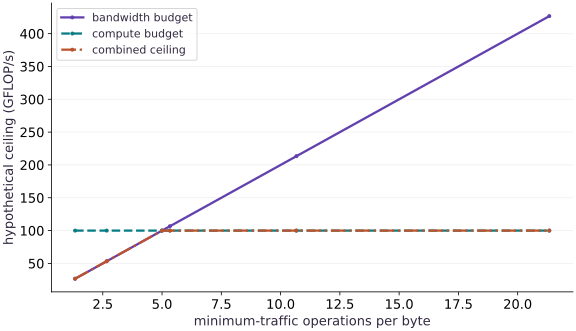

# Reason with HLO and the roofline model

Phase 08: Performance diagnosis · about 95 minutes · CPU

## What you will be able to do

- Locate matrix multiplication and activation in StableHLO.
- Derive the operation and minimum byte counts for a declared matrix contract.
- Identify the compute-versus-bandwidth transition in a hypothetical roofline.
- Explain why measured throughput can fall below either ceiling.

## The problem

A matrix multiplication appears in your Python code, but what reaches the compiler and what might limit its speed? We will inspect a lowered program, calculate an explicit work/traffic model, and compare that model with synchronized CPU measurements without confusing a ceiling with a prediction.

## The idea

A roofline compares arithmetic work with data movement under stated compute and bandwidth assumptions. It helps us predict which resource may constrain a workload. It is a model to test against measurements, not a hardware benchmark by itself.

## Read a roofline as a conditional bound

As a separate analytic example, assume $100$ GB/s bandwidth and $1000$ GFLOP/s compute capacity. The ridge is at $10$ FLOP/byte. At intensity $2$ FLOP/byte, the bandwidth-based bound is $200$ GFLOP/s.

The implementation need not reach that bound. Traffic estimates may omit intermediates, padding or cache effects; the assumed peaks may not apply to the actual dtype and device.

Use the lesson's hypothetical curve to propose a change, such as reducing data movement. Then inspect the resulting computation and measure the same workload. Moving a modeled point rightward does not establish that the implementation became faster.

### Pause and reason

Does reaching the compute-limited side guarantee peak throughput?

<details><summary>Compare your reasoning</summary>

No. It identifies the tighter bound in this model. Other bottlenecks and inefficient execution can keep observed performance far below it.

</details>

## Read the contract before the compiler text

Our left matrix has shape $(32,16)$, the right matrix $(16,8)$, and the result $(32,8)$. Their shared dimension is contracted; tanh is then applied elementwise. Lowering with these arrays specializes the computation to compatible input shapes and dtypes.

The lesson prints compiler cost estimates and checks for the corresponding dot and tanh operations in StableHLO. Compiler text and cost fields can change by backend and version. Read operation meaning and tensor types rather than depending on generated variable names or assuming every operation remains a separate kernel.

## Count work with a stated convention

For matrix dimensions $m,k,n$, we count one multiply and one addition for every inner-product term. This conventional estimate is $2mkn$ floating-point operations. It omits the tanh activation and treats the initial addition the same as later additions. State that convention beside a throughput calculation.

For the declared workload it gives $8192$ matrix operations. Counting a whole model using only that number would undercount the activation and other work. Compiler estimates are another model of work, not a substitute for a measured operation trace.

$$
F=2mkn
$$

## Minimum traffic is an assumption you can challenge

Assume each input matrix is read once and the output is written once. With float32 elements, the minimum traffic is four times the sum of their element counts. Our shapes give $3584$ bytes and arithmetic intensity $16/7$ operations per byte.

This ignores cache misses, repeated transfers, temporary arrays, layout changes and activation traffic. Fusion might avoid materializing some intermediates; a poor access pattern might read data more often. A roofline based on minimum traffic is an optimistic accounting model, not a statement that the device actually transferred exactly those bytes.

$$
B=4(mk+kn+mn),\qquad I=F/B
$$

## Find the corner in a hypothetical roofline

Use a hypothetical compute ceiling of $100$ billion operations per second and bandwidth of $20$ billion bytes per second. These are teaching assumptions, not specifications for the current CPU. The transition intensity is $5$ operations per byte. Below it, increasing reuse can raise the modeled ceiling; above it, this simple model hits the compute limit.

For square matrices, the minimum-traffic intensity simplifies to $n/6$. Our sizes cross the transition between the second and third cases. The calculation makes the mechanism visible without claiming that small matrices achieve these ceilings.

$$
P_{\mathrm{ceiling}}=\min(P_{\mathrm{compute}},\,\beta I)
$$

## Compare measurements only after checking equivalence

The executable is checked against an independent NumPy matrix product and activation, warmed, and timed with output synchronization. Small CPU calls can be dominated by dispatch overhead and poor parallel utilization, so a low fraction of the hypothetical ceiling is not evidence of a broken compiler.

To use a roofline for a real accelerator, replace the hypothetical budgets with applicable device/precision specifications or measured sustainable limits. Record the memory level being modeled and profile actual traffic where possible. Compare equivalent dtypes and workloads; do not mix sparse-operation marketing counts with dense measured work.

## Inspect a specialized lowered computation

Create a Python file in the course environment. Add this block after the preceding block, then run the assembled file.

```python
# Step 1 — Inspect a specialized lowered computation: StableHLO establishes the operation and shape contract.
# Import time for this computation.
import time
import numpy as np
import jax
import jax.numpy as jnp
```

StableHLO establishes the operation and shape contract. Numerical equality is checked after compiling that same lowered program.

## Calculate an explicitly hypothetical model

Create a Python file in the course environment. Add this block after the preceding block, then run the assembled file.

```python
# Step 2 — Calculate an explicitly hypothetical model: The square-matrix simplification supplies an independent...
def workload(a,b):return jnp.tanh(a@b)
# Construct and reshape `a` into the target tensor dimensions.
a=jnp.arange(32*16,dtype=jnp.float32).reshape(32,16)/512
# Construct and reshape `b` into the target tensor dimensions.
b=jnp.arange(16*8,dtype=jnp.float32).reshape(16,8)/128
# Wrap with `jax.jit` (`lowered`) so XLA traces and compiles the function.
lowered=jax.jit(workload).lower(a,b)
# Trace or lower the function to inspect its compiler representation (`stablehlo`).
stablehlo=str(lowered.compiler_ir(dialect='stablehlo'))
# Verify contract: `'dot_general' in stablehlo and 'tanh' in stablehlo`.
assert 'dot_general' in stablehlo and 'tanh' in stablehlo
# Trace or lower the function to inspect its compiler representation (`executable`).
executable=lowered.compile()
# Convert `` to a host NumPy array for inspection or verification.
np.testing.assert_allclose(executable(a,b),np.tanh(np.asarray(a)@np.asarray(b)),rtol=2e-5,atol=2e-5)
# Print the observed values to compare against the expected result.
print('StableHLO operations present: dot_general and tanh')
# Print diagnostic summary of the computed outputs.
print('Compiler estimates (backend-specific):',executable.cost_analysis())
```

The square-matrix simplification supplies an independent arithmetic check. The hardware budgets are illustrative constants.

## Keep runtime observations separate

Create a Python file in the course environment. Add this block after the preceding block, then run the assembled file.

```python
# An analytic traffic model, not a measurement of this CPU.
def contract(m,k,n,itemsize=4):
    # Guard input contract (`min(m, k, n, itemsize) <= 0`) and fail fast if violated.
    if min(m,k,n,itemsize)<=0:raise ValueError('positive dimensions and itemsize required')
    flops=2*m*k*n  # conventional multiply-add count; excludes tanh
    # Evaluate `minimum_bytes` from the current inputs and state.
    minimum_bytes=itemsize*(m*k+k*n+m*n)
    # Return `(flops, minimum_bytes, flops / minimum_bytes)` to the caller.
    return flops,minimum_bytes,flops/minimum_bytes
# Initialize array `sizes` with explicit values and shape.
sizes=np.array([8,16,32,64,128])
# Initialize array `intensity` with explicit values and shape.
intensity=np.array([contract(int(n),int(n),int(n))[2] for n in sizes])
# Verify that computed values match the expected reference within numerical tolerance.
np.testing.assert_allclose(intensity,sizes/6)
peak=100e9;bandwidth=20e9  # hypothetical budgets, not device specifications
# Evaluate `memory_ceiling` from the current inputs and state.
memory_ceiling=bandwidth*intensity
# Reduce across the target axis to summarize `roofline`.
roofline=np.minimum(peak,memory_ceiling)
# Verify that computed values match the expected reference within numerical tolerance.
np.testing.assert_allclose(roofline[:2]/1e9,[80/3,160/3])
# Verify contract: `np.all(roofline[2:] == peak)`.
assert np.all(roofline[2:]==peak)
```

Warm samples measure the current CPU, while the work count remains a matmul-only convention. The code never asserts a speedup or hardware saturation.

## Keep runtime observations separate

Create a Python file in the course environment. Add this block after the preceding block, then run the assembled file.

```python
# Step 4 — Keep runtime observations separate: Warm samples measure the current CPU, while the work count remains...
executable(a,b).block_until_ready()
# Evaluate `times` from the current inputs and state.
times=[]
# Repeat the update loop over `range(5)` steps:
for _ in range(5):
    # Synchronize host execution until asynchronous device computation completes.
    # Synchronize host execution until asynchronous device computation completes.
    # Synchronize host execution until asynchronous device computation completes.
    start=time.perf_counter();executable(a,b).block_until_ready();times.append(time.perf_counter()-start)
# Run `contract` to compute `(flops, minimum_bytes, ai)`.
flops,minimum_bytes,ai=contract(32,16,8)
# Print the observed values to compare against the expected result.
print('Local CPU samples seconds:',times)
# Print diagnostic summary of the computed outputs.
print('Matmul-only accounting:',{'flops':flops,'minimum_bytes':minimum_bytes,'flops_per_byte':ai})
# Print diagnostic summary of the computed outputs.
print('Hypothetical ceilings GFLOP/s:',(roofline/1e9).tolist())
```

Warm samples measure the current CPU, while the work count remains a matmul-only convention. The code never asserts a speedup or hardware saturation.

## Run the example

```python
# Step 1 — Inspect a specialized lowered computation: StableHLO establishes the operation and shape contract.
# Import time for this computation.
import time
import numpy as np
import jax
import jax.numpy as jnp

# Step 2 — Calculate an explicitly hypothetical model: The square-matrix simplification supplies an independent...
def workload(a,b):return jnp.tanh(a@b)
# Construct and reshape `a` into the target tensor dimensions.
a=jnp.arange(32*16,dtype=jnp.float32).reshape(32,16)/512
# Construct and reshape `b` into the target tensor dimensions.
b=jnp.arange(16*8,dtype=jnp.float32).reshape(16,8)/128
# Wrap with `jax.jit` (`lowered`) so XLA traces and compiles the function.
lowered=jax.jit(workload).lower(a,b)
# Trace or lower the function to inspect its compiler representation (`stablehlo`).
stablehlo=str(lowered.compiler_ir(dialect='stablehlo'))
# Verify contract: `'dot_general' in stablehlo and 'tanh' in stablehlo`.
assert 'dot_general' in stablehlo and 'tanh' in stablehlo
# Trace or lower the function to inspect its compiler representation (`executable`).
executable=lowered.compile()
# Convert `` to a host NumPy array for inspection or verification.
np.testing.assert_allclose(executable(a,b),np.tanh(np.asarray(a)@np.asarray(b)),rtol=2e-5,atol=2e-5)
# Print the observed values to compare against the expected result.
print('StableHLO operations present: dot_general and tanh')
# Print diagnostic summary of the computed outputs.
print('Compiler estimates (backend-specific):',executable.cost_analysis())

# An analytic traffic model, not a measurement of this CPU.
def contract(m,k,n,itemsize=4):
    # Guard input contract (`min(m, k, n, itemsize) <= 0`) and fail fast if violated.
    if min(m,k,n,itemsize)<=0:raise ValueError('positive dimensions and itemsize required')
    flops=2*m*k*n  # conventional multiply-add count; excludes tanh
    # Evaluate `minimum_bytes` from the current inputs and state.
    minimum_bytes=itemsize*(m*k+k*n+m*n)
    # Return `(flops, minimum_bytes, flops / minimum_bytes)` to the caller.
    return flops,minimum_bytes,flops/minimum_bytes
# Initialize array `sizes` with explicit values and shape.
sizes=np.array([8,16,32,64,128])
# Initialize array `intensity` with explicit values and shape.
intensity=np.array([contract(int(n),int(n),int(n))[2] for n in sizes])
# Verify that computed values match the expected reference within numerical tolerance.
np.testing.assert_allclose(intensity,sizes/6)
peak=100e9;bandwidth=20e9  # hypothetical budgets, not device specifications
# Evaluate `memory_ceiling` from the current inputs and state.
memory_ceiling=bandwidth*intensity
# Reduce across the target axis to summarize `roofline`.
roofline=np.minimum(peak,memory_ceiling)
# Verify that computed values match the expected reference within numerical tolerance.
np.testing.assert_allclose(roofline[:2]/1e9,[80/3,160/3])
# Verify contract: `np.all(roofline[2:] == peak)`.
assert np.all(roofline[2:]==peak)

# Step 4 — Keep runtime observations separate: Warm samples measure the current CPU, while the work count remains...
executable(a,b).block_until_ready()
# Evaluate `times` from the current inputs and state.
times=[]
# Repeat the update loop over `range(5)` steps:
for _ in range(5):
    # Synchronize host execution until asynchronous device computation completes.
    # Synchronize host execution until asynchronous device computation completes.
    # Synchronize host execution until asynchronous device computation completes.
    start=time.perf_counter();executable(a,b).block_until_ready();times.append(time.perf_counter()-start)
# Run `contract` to compute `(flops, minimum_bytes, ai)`.
flops,minimum_bytes,ai=contract(32,16,8)
# Print the observed values to compare against the expected result.
print('Local CPU samples seconds:',times)
# Print diagnostic summary of the computed outputs.
print('Matmul-only accounting:',{'flops':flops,'minimum_bytes':minimum_bytes,'flops_per_byte':ai})
# Print diagnostic summary of the computed outputs.
print('Hypothetical ceilings GFLOP/s:',(roofline/1e9).tolist())
```

Expected: StableHLO contains the declared dot and activation. The matmul accounting is $8192$ operations and $3584$ minimum bytes; the hypothetical ceilings begin near $26.67$, $53.33$, then $100$ GFLOP/s. CPU times vary.

## A hypothetical roofline bends at the compute budget

**Predict:** Which square-matrix cases lie below the transition intensity?



**Recorded CPU computation**

### Read the figure

The horizontal axis is the minimum-traffic arithmetic intensity, in operations per byte. The vertical axis is a hypothetical throughput ceiling in billions of operations per second. The rising bandwidth line multiplies intensity by the assumed bandwidth; the horizontal compute line is the assumed compute budget. Neither line is a device measurement.

The combined ceiling follows the lower of these two lines. The first two cases are about $26.67$ and $53.33$ GFLOP/s; from the third matrix-size case onward the ceiling is $100$. The change of slope occurs where the budgets meet, at intensity $5$, which is included explicitly as an extra point between the second and third matrix-size cases.

### Connect it to the computation

Each intensity comes from counting the elements in square input/output matrices and assuming one read or write per element. Increasing matrix size increases modeled reuse, so the bandwidth ceiling rises. After the compute cap is reached, further reuse cannot raise this simplified ceiling.

Actual small CPU measurements are recorded separately and include dispatch and completion waiting. Do not plot them against these invented hardware budgets as a measured efficiency claim. A real roofline study needs appropriate hardware limits and traffic evidence.

```python
# Compute figure data for: A hypothetical roofline bends at the compute budget
# Run `np.sort` to compute `plot_intensity`.
plot_intensity=np.sort(np.append(intensity,peak/bandwidth))
# Reduce across the target axis to summarize `visual_data`.
visual_data={'kind':'line','x':plot_intensity.tolist(),'xlabel':'minimum-traffic operations per byte','ylabel':'hypothetical ceiling (GFLOP/s)','series':[{'label':'bandwidth budget','y':(bandwidth*plot_intensity/1e9).tolist()},{'label':'compute budget','y':[peak/1e9]*len(plot_intensity)},{'label':'combined ceiling','y':(np.minimum(peak,bandwidth*plot_intensity)/1e9).tolist()}]}
```

## Recorded reference execution

CPU run: 2026-10-08T14:03:54.941256+00:00. JAX 0.9.2.

```text
StableHLO operations present: dot_general and tanh
Compiler estimates (backend-specific): {'utilization1{}': 1.0, 'bytes accessed0{}': 3072.0, 'transcendentals': 256.0, 'bytes accessed': 5632.0, 'flops': 8192.0, 'bytes accessed1{}': 512.0, 'bytes accessedout{}': 2048.0, 'utilization0{}': 2.0}
Local CPU samples seconds: [1.750001683831215e-05, 8.999835699796677e-06, 8.958857506513596e-06, 8.916947990655899e-06, 6.6659413278102875e-06]
Matmul-only accounting: {'flops': 8192, 'minimum_bytes': 3584, 'flops_per_byte': 2.2857142857142856}
Hypothetical ceilings GFLOP/s: [26.666666666666664, 53.33333333333333, 100.0, 100.0, 100.0]
StableHLO operations present: dot_general and tanh
Compiler estimates (backend-specific): {'flops': 8192.0, 'bytes accessedout{}': 2048.0, 'bytes accessed1{}': 512.0, 'bytes accessed': 5632.0, 'bytes accessed0{}': 3072.0, 'transcendentals': 256.0, 'utilization1{}': 1.0, 'utilization0{}': 2.0}
Local CPU samples seconds: [1.8459279090166092e-05, 8.875038474798203e-06, 9.040813893079758e-06, 6.58305361866951e-06, 7.2498805820941925e-06]
Matmul-only accounting: {'flops': 8192, 'minimum_bytes': 3584, 'flops_per_byte': 2.2857142857142856}
Hypothetical ceilings GFLOP/s: [26.666666666666664, 53.33333333333333, 100.0, 100.0, 100.0]
Ceilings with twice minimum traffic GFLOP/s: [13.333333333333332, 26.666666666666664, 53.33333333333333, 100.0, 100.0]
Changed contract: 27648 8064 3.4285714285714284 bandwidth-limited in the hypothetical model
Arithmetic unchanged; modeled traffic halved and intensity doubled.
PASS: performance-04

```

## Double the assumed data movement

**Predict before running:** If effective traffic doubles without changing arithmetic work, how does the intensity and modeled ceiling change?

```python
# Experiment — Double the assumed data movement: The work is unchanged; doubling transferred bytes halves intensity.
reduced=intensity/2
# Reduce across the target axis to summarize `revised`.
revised=np.minimum(peak,bandwidth*reduced)
# Verify that computed values match the expected reference within numerical tolerance.
np.testing.assert_allclose(revised[:2],roofline[:2]/2)
# Verify contract: `revised[-1] == peak`.
assert revised[-1]==peak
# Print the observed values to compare against the expected result.
print('Ceilings with twice minimum traffic GFLOP/s:',(revised/1e9).tolist())
```

**Expected:** The first bandwidth-limited ceilings halve; a sufficiently intense case stays compute-limited.

The work is unchanged; doubling transferred bytes halves intensity. This is a sensitivity calculation, not a measured cache miss rate.

## Make it yours

Derive the work and minimum traffic for shapes $(48,24)$ and $(24,12)$. Compare your hand calculation with the contract function and report the hypothetical limiting budget.

### How to write this exercise — Step-by-step recipe & starter scaffold

**Key functions & syntax to use:**
- `jnp.allclose(actual, expected, rtol=..., atol=...)` — Checks that two arrays match elementwise within floating-point tolerance.

**Step-by-step implementation plan:**
1. Verify contract: `work == 27648 and traffic == 8064`.
2. Verify that computed values match the expected reference within numerical tolerance.
3. Verify contract: `bandwidth * ratio < peak`.
4. Print the observed values to compare against the expected result.

**Starter code scaffold (fill in the TODOs):**

```python
# Exercise solution: Derive the work and minimum traffic for shapes (48,24) and (24,12).
work,traffic,ratio = contract(...)  # TODO: compute work,traffic,ratio
# Verify contract: `work == 27648 and traffic == 8064`.
assert work  # TODO: complete assertion check
# Verify that computed values match the expected reference within numerical tolerance.
np.testing.assert_allclose(ratio,24/7)
# Verify contract: `bandwidth * ratio < peak`.
assert bandwidth*ratio  # TODO: complete assertion check
# Print the observed values to compare against the expected result.
print('Changed contract:',work,traffic,ratio,'bandwidth-limited in the hypothetical model')
```

<details><summary>Reference solution</summary>

```python
# Exercise solution: Derive the work and minimum traffic for shapes (48,24) and (24,12).
work,traffic,ratio=contract(48,24,12)
# Verify contract: `work == 27648 and traffic == 8064`.
assert work==27648 and traffic==8064
# Verify that computed values match the expected reference within numerical tolerance.
np.testing.assert_allclose(ratio,24/7)
# Verify contract: `bandwidth * ratio < peak`.
assert bandwidth*ratio<peak
# Print the observed values to compare against the expected result.
print('Changed contract:',work,traffic,ratio,'bandwidth-limited in the hypothetical model')
```

</details>

## Keep the same shapes but change storage precision

**Transfer**

Change only the assumed element size from four bytes to two bytes. Calculate the resulting traffic and intensity, and explain why this is insufficient to predict an actual speedup.

<details><summary>Hint</summary>

The model assumes both inputs and output use that element size; real accumulation and conversion may differ.

</details>

### How to write: Keep the same shapes but change storage precision — Step-by-step recipe & starter scaffold

**Key functions & syntax to use:**
- `jnp.allclose(actual, expected, rtol=..., atol=...)` — Checks that two arrays match elementwise within floating-point tolerance.

**Step-by-step implementation plan:**
1. Run `contract` to compute `(f16, b16, i16)`.
2. Verify contract: `f32 == f16 and b32 == 2 * b16`.
3. Verify that computed values match the expected reference within numerical tolerance.
4. Print the observed values to compare against the expected result.

**Starter code scaffold (fill in the TODOs):**

```python
# Keep the same shapes but change storage precision (Transfer): Changing storage bytes in an accounting model does not...
f32,b32,i32 = contract(...)  # TODO: compute f32,b32,i32
# Run `contract` to compute `(f16, b16, i16)`.
f16,b16,i16 = contract(...)  # TODO: compute f16,b16,i16
# Verify contract: `f32 == f16 and b32 == 2 * b16`.
assert f32  # TODO: complete assertion check
# Verify that computed values match the expected reference within numerical tolerance.
np.testing.assert_allclose(i16,2*i32)
# Print the observed values to compare against the expected result.
print('Arithmetic unchanged; modeled traffic halved and intensity doubled.')
```

<details><summary>Reference solution and reasoning</summary>

```python
# Keep the same shapes but change storage precision (Transfer): Changing storage bytes in an accounting model does not...
f32,b32,i32=contract(32,16,8,4)
# Run `contract` to compute `(f16, b16, i16)`.
f16,b16,i16=contract(32,16,8,2)
# Verify contract: `f32 == f16 and b32 == 2 * b16`.
assert f32==f16 and b32==2*b16
# Verify that computed values match the expected reference within numerical tolerance.
np.testing.assert_allclose(i16,2*i32)
# Print the observed values to compare against the expected result.
print('Arithmetic unchanged; modeled traffic halved and intensity doubled.')
```

Changing storage bytes in an accounting model does not establish native arithmetic support, accumulation policy, quality preservation or measured runtime improvement.

</details>

## Check your understanding

The lowered program contains a dot operation and a roofline model predicts a high ceiling. What is still needed before claiming high accelerator throughput?

1. Nothing; lowered operations establish throughput.
2. A matching measured workload on the actual device, with justified traffic and precision assumptions.
3. Only the number of Python source lines.

<details><summary>Answer and explanation</summary>

A matching measured workload on the actual device, with justified traffic and precision assumptions.

A typed intermediate representation and an optimistic ceiling do not measure execution. Workload equivalence, synchronization, device evidence and appropriate model assumptions are still required.

</details>

## Diagnose the result

If a roofline claim looks implausible, check operation-count convention, byte units, element size, memory level and timing boundary. Inspect compiler estimates separately from measured traffic; neither should be silently relabeled as the other.

## Carry forward

- Lowered text describes a specialized program, not a timeline.
- Arithmetic intensity depends on an explicit traffic model.
- A roofline is a ceiling under assumptions, not a promised runtime.

## Keep your evidence

Keep StableHLO, synchronized CPU samples and independent output parity. Derive the byte/FLOP model and label the roofline peak and bandwidth as hypothetical.

Keep predictions, modified code, observed results, and reasoning. A checkpoint alone does not demonstrate the exercise.

## Primary references

- [JAX ahead-of-time lowering and compilation](https://docs.jax.dev/en/latest/aot.html)
- [JAX roofline analysis](https://jax-ml.github.io/scaling-book/roofline/)

