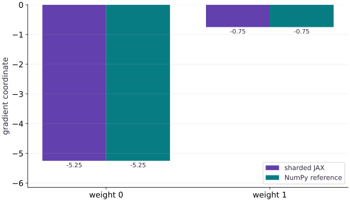

# A sharded training step

Phase 09: Distributed training · about 90 minutes · 4 logical CPU devices

## What you will be able to do

- Derive the global mean loss and gradient.
- Specify aligned data and replicated parameter placement.
- Verify sharded updates against independent host arithmetic.
- Diagnose normalization errors in equal and unequal local batches.

## The problem

If we split a batch across four devices, should the model learn four times as much in one step? It should still follow the same global loss. We’ll compare a sharded regression update with a formula we can check on the host, then reproduce the scaling mistake caused by summing local mean gradients.

## The idea

A sharded training step must preserve the intended global objective. Local reductions and collective operations should produce the same normalized gradient as an unsharded reference on the same examples.

## Derive the global denominator

One shard has two examples with mean gradient $1$; another has one example with gradient $4$. The global mean is $(2+4)/3=2$. Averaging the local means gives $2.5$, overweighting the small shard.

Carry contributions and counts so the final denominator matches the objective. With masked sequence losses, count valid targets rather than automatically counting devices or sequences.

The matching gradient bars are an important check on the current fixture. Add unequal valid counts to expose a weighting rule that balanced shards could hide. Numerical agreement should be tested where the implementation's assumptions are most vulnerable.

### Pause and reason

Which test exposes an incorrect average of local means?

<details><summary>Compare your reasoning</summary>

Use unequal example or valid-token counts per shard and compare with an independently calculated global mean.

</details>

## Write the objective before splitting the data

Our model predicts $Xw$ with two weights and no bias. The synthetic labels use true weights $[2,-1]$, but the initial weights are zero. The squared-error loss averages eight residuals. Its gradient is $\frac{2}{N}X^\mathsf{T}r$, where $r=Xw-y$ and $N=8$. This host formula is independent of JAX autodiff and supplies a useful reference for the first update.

At $w=0$ the targets are $[2,-1,1,4,-2,3,0,2]$. Squared targets sum to $39$, so initial loss is $39/8=4.875$. $X^\mathsf{T}y=[21,3]$, so the gradient is $[-5.25,-0.75]$. With learning rate $0.1$ the new weights are $[0.525,0.075]$. Check these values before looking at a training curve.

$$
\begin{aligned}L(w)&=\frac{1}{8}\sum_{i=1}^{8}(x_i^\mathsf{T}w-y_i)^2\\g&=\frac{2}{8}X^\mathsf{T}(Xw-y)\\w_{\mathrm{next}}&=w-0.1g\end{aligned}
$$

## Give batch and parameters different placements

The feature matrix has shape $(8,2)$ and uses `P("data",None)`; each of four devices owns two examples. Labels have shape $(8,)$ and use `P("data")`, so their shards align with the feature rows. Parameters have shape $(2,)$ and use `P()`, giving every device both weights.

The input sharding tree supplied to jit has one entry per argument. Outputs are weights, scalar loss and a two-element gradient; all three are replicated in this small example. Replication does not mean four independently trained models. The replicas represent the same global parameters and must receive the same global update.

```text
CPU 0: X rows 0:2, y rows 0:2, full w
CPU 1: X rows 2:4, y rows 2:4, full w
CPU 2: X rows 4:6, y rows 4:6, full w
CPU 3: X rows 6:8, y rows 6:8, full w
partial contributions → global gradient → same w_next
```

## Differentiate the global function rather than inventing a local objective

loss operates on global JAX arrays. value_and_grad evaluates the objective and obtains its parameter derivative together. jit compiles that function with explicit placement contracts; you do not call a Python training loop separately on each device. Combining contributions is necessary because each local batch alone cannot determine the global mean gradient.

This lesson uses automatic global-array parallelization, not manual shard_map or an explicit pmean. The compiler arranges required operations. Do not add an extra collective to an already global reduction merely because the input is sharded. If you later implement a manual local program, you must derive its aggregation and normalization from the same objective.

## A correct first update is stronger evidence than a falling curve — on CPU and on a 4-chip TPU VM

A loss curve can decrease even with a normalization bug, especially at a small learning rate. Compare the initial loss, every gradient component and updated weights with NumPy. Then change the batch contents and order: a correct global mean should not depend on which device receives a row. Check replicated weight shards separately.

A ten-step loop is included as a transfer experiment, but this is not a complete resilient training system. It has no data pipeline, optimizer moments, checkpoint or multi-host failure handling. CPU virtual devices demonstrate placement and numerical equivalence; to verify the same sharded `train_step` across four physical TPU chips (`v5litepod-4` or `v6e-4`), upload the lesson script to your TPU VM and target `jax.devices()[:4]` with `JAX_PLATFORMS=tpu`. Float32 reduction order may differ slightly across hardware, so use stated tolerances instead of bitwise comparisons.

**Run the sharded training step across four physical TPU chips**

```bash
gcloud compute tpus tpu-vm scp exercises/distributed-02.py $TPU_NAME:~/jax-tpu-lab/ --zone=$ZONE
gcloud compute tpus tpu-vm ssh $TPU_NAME --zone=$ZONE \
  --command="sed 's/jax.config.update(\"jax_platforms\", \"cpu\")/# use default TPU backend/; s/jax.devices(\"cpu\")/jax.devices()[:4]/' ~/jax-tpu-lab/distributed-02.py > ~/jax-tpu-lab/distributed-02-tpu.py && JAX_PLATFORMS=tpu ~/jax-tpu-lab/.venv/bin/python ~/jax-tpu-lab/distributed-02-tpu.py"
```

**Expected:** Executes the sharded value_and_grad update across 4 TPU devices and verifies that the initial loss (4.875), global gradient ([-5.25, -0.75]), and updated weights ([0.525, 0.075]) match the host reference within tolerance.

## Start a fresh CPU runtime

Create main.py in your course workspace. Paste this block first. If using a notebook, restart its kernel before running any cell.

```python
# Step 1 — Start a fresh CPU runtime: Configuration happens before devices() or array creation...
# Import jax for this computation.
import jax
# Run this file in a fresh process; in a notebook restart the kernel first.
jax.config.update("jax_platforms", "cpu")
# Update state in place with the new values.
jax.config.update("jax_num_cpu_devices", 4)
# Import jax.numpy for this computation.
import jax.numpy as jnp
import numpy as np
from jax.sharding import Mesh, NamedSharding, PartitionSpec as P
# Query the active JAX devices into `devices`.
devices = jax.devices("cpu")
# Guard input contract (`len(devices) != 4`) and fail fast if violated.
if len(devices) != 4:
    raise RuntimeError("Expected four CPU devices. Restart the notebook kernel, then Run all; do not run an earlier JAX cell first.")
# Configure multi-device placement / sharding specification (`mesh`).
mesh = Mesh(np.array(devices), ("data",))
# Configure multi-device placement / sharding specification (`rows`).
rows = NamedSharding(mesh, P("data", None))
# Configure multi-device placement / sharding specification (`replicated`).
replicated = NamedSharding(mesh, P())
```

Configuration happens before `devices()` or array creation initializes a backend. This file explicitly chooses CPU even on a GPU machine.

## Place and compute

Append this block in the same file. Predict the shapes and values before running.

```python
# Step 2 — Place and compute: Mesh axis names describe placement.
# Initialize array `host_x` with explicit values and shape.
host_x = np.array([[1,0],[0,1],[1,1],[2,0],[0,2],[2,1],[1,2],[2,2]],dtype=np.float32)
# Initialize array `true_w` with explicit values and shape.
true_w = np.array([2.,-1.],dtype=np.float32)
# Perform matrix / vector contraction (`@`) to compute `host_y`.
host_y = host_x @ true_w
# Configure multi-device placement / sharding specification (`labels_sharding`).
labels_sharding = NamedSharding(mesh,P("data"))
# Place `x` explicitly onto the target JAX device.
x = jax.device_put(host_x, rows)
# Place `y` explicitly onto the target JAX device.
y = jax.device_put(host_y, labels_sharding)
# Place `w` explicitly onto the target JAX device.
w = jax.device_put(np.zeros(2,dtype=np.float32),replicated)
# Function `loss(weights, features, labels)` implementing this stage's computation:
def loss(weights, features, labels):
    # Return `jnp.mean((features @ weights - labels) ** 2)` to the caller.
    return jnp.mean((features @ weights-labels)**2)
# Define `update(weights, features, labels)` to evaluate the objective and its automatic derivatives:
def update(weights, features, labels):
    # Differentiate the objective to obtain `(value, gradient)` via automatic differentiation.
    value, gradient = jax.value_and_grad(loss)(weights,features,labels)
    # Return `(weights - 0.1 * gradient, value, gradient)` to the caller.
    return weights - 0.1*gradient, value, gradient
# Wrap with `jax.jit` (`train_step`) so XLA traces and compiles the function.
train_step = jax.jit(update, in_shardings=(replicated,rows,labels_sharding),out_shardings=(replicated,replicated,replicated))
# Run `train_step` to compute `(new_w, before, gradient)`.
new_w, before, gradient = train_step(w,x,y)
```

Mesh axis names describe placement. They are separate from the numerical array dimensions.

## Inspect and verify

Append the checks, save the file and run python main.py with the setup lesson environment.

```python
# Step 3 — Inspect and verify: Assertions compare against host calculations or hand-derived...
expected_gradient = 2 * host_x.T @ (-host_y) / len(host_y)
# Convert `` to a host NumPy array for inspection or verification.
np.testing.assert_allclose(np.asarray(gradient),expected_gradient,rtol=1e-6,atol=1e-6)
# Convert `` to a host NumPy array for inspection or verification.
np.testing.assert_allclose(np.asarray(new_w),-0.1*expected_gradient,rtol=1e-6,atol=1e-6)
# Aggregate array values to compute `expected_loss`.
expected_loss = np.mean(host_y**2)
# Convert `` to a host NumPy array for inspection or verification.
np.testing.assert_allclose(np.asarray(before), expected_loss,rtol=1e-6)
# Verify contract: `float(loss(new_w, x, y)) < float(before)`.
assert float(loss(new_w,x,y)) < float(before)
# Iterate over `shard` to step through the computation:
for shard in new_w.addressable_shards:
    # Convert `` to a host NumPy array for inspection or verification.
    np.testing.assert_allclose(np.asarray(shard.data),np.asarray(new_w))
# Print the observed values to compare against the expected result.
print("Initial loss:",float(before))
# Print diagnostic summary of the computed outputs.
print("Gradient:",np.asarray(gradient),"updated weights:",np.asarray(new_w))
# Print diagnostic summary of the computed outputs.
print("Updated loss:",float(loss(new_w,x,y)))
```

Assertions compare against host calculations or hand-derived values; printing a sharding object alone does not establish correctness.

## Run the example

```python
# Step 1 — Start a fresh CPU runtime: Configuration happens before devices() or array creation...
# Import jax for this computation.
import jax
# Run this file in a fresh process; in a notebook restart the kernel first.
jax.config.update("jax_platforms", "cpu")
# Update state in place with the new values.
jax.config.update("jax_num_cpu_devices", 4)
# Import jax.numpy for this computation.
import jax.numpy as jnp
import numpy as np
from jax.sharding import Mesh, NamedSharding, PartitionSpec as P
# Query the active JAX devices into `devices`.
devices = jax.devices("cpu")
# Guard input contract (`len(devices) != 4`) and fail fast if violated.
if len(devices) != 4:
    raise RuntimeError("Expected four CPU devices. Restart the notebook kernel, then Run all; do not run an earlier JAX cell first.")
# Configure multi-device placement / sharding specification (`mesh`).
mesh = Mesh(np.array(devices), ("data",))
# Configure multi-device placement / sharding specification (`rows`).
rows = NamedSharding(mesh, P("data", None))
# Configure multi-device placement / sharding specification (`replicated`).
replicated = NamedSharding(mesh, P())

# Step 2 — Place and compute: Mesh axis names describe placement.
# Initialize array `host_x` with explicit values and shape.
host_x = np.array([[1,0],[0,1],[1,1],[2,0],[0,2],[2,1],[1,2],[2,2]],dtype=np.float32)
# Initialize array `true_w` with explicit values and shape.
true_w = np.array([2.,-1.],dtype=np.float32)
# Perform matrix / vector contraction (`@`) to compute `host_y`.
host_y = host_x @ true_w
# Configure multi-device placement / sharding specification (`labels_sharding`).
labels_sharding = NamedSharding(mesh,P("data"))
# Place `x` explicitly onto the target JAX device.
x = jax.device_put(host_x, rows)
# Place `y` explicitly onto the target JAX device.
y = jax.device_put(host_y, labels_sharding)
# Place `w` explicitly onto the target JAX device.
w = jax.device_put(np.zeros(2,dtype=np.float32),replicated)
# Function `loss(weights, features, labels)` implementing this stage's computation:
def loss(weights, features, labels):
    # Return `jnp.mean((features @ weights - labels) ** 2)` to the caller.
    return jnp.mean((features @ weights-labels)**2)
# Define `update(weights, features, labels)` to evaluate the objective and its automatic derivatives:
def update(weights, features, labels):
    # Differentiate the objective to obtain `(value, gradient)` via automatic differentiation.
    value, gradient = jax.value_and_grad(loss)(weights,features,labels)
    # Return `(weights - 0.1 * gradient, value, gradient)` to the caller.
    return weights - 0.1*gradient, value, gradient
# Wrap with `jax.jit` (`train_step`) so XLA traces and compiles the function.
train_step = jax.jit(update, in_shardings=(replicated,rows,labels_sharding),out_shardings=(replicated,replicated,replicated))
# Run `train_step` to compute `(new_w, before, gradient)`.
new_w, before, gradient = train_step(w,x,y)

# Step 3 — Inspect and verify: Assertions compare against host calculations or hand-derived...
expected_gradient = 2 * host_x.T @ (-host_y) / len(host_y)
# Convert `` to a host NumPy array for inspection or verification.
np.testing.assert_allclose(np.asarray(gradient),expected_gradient,rtol=1e-6,atol=1e-6)
# Convert `` to a host NumPy array for inspection or verification.
np.testing.assert_allclose(np.asarray(new_w),-0.1*expected_gradient,rtol=1e-6,atol=1e-6)
# Aggregate array values to compute `expected_loss`.
expected_loss = np.mean(host_y**2)
# Convert `` to a host NumPy array for inspection or verification.
np.testing.assert_allclose(np.asarray(before), expected_loss,rtol=1e-6)
# Verify contract: `float(loss(new_w, x, y)) < float(before)`.
assert float(loss(new_w,x,y)) < float(before)
# Iterate over `shard` to step through the computation:
for shard in new_w.addressable_shards:
    # Convert `` to a host NumPy array for inspection or verification.
    np.testing.assert_allclose(np.asarray(shard.data),np.asarray(new_w))
# Print the observed values to compare against the expected result.
print("Initial loss:",float(before))
# Print diagnostic summary of the computed outputs.
print("Gradient:",np.asarray(gradient),"updated weights:",np.asarray(new_w))
# Print diagnostic summary of the computed outputs.
print("Updated loss:",float(loss(new_w,x,y)))
```

Expected: Initial loss $4.875$; gradient $[-5.25,-0.75]$; weights $[0.525,0.075]$; updated loss is lower. Small float32 printing differences are expected.

## Sharded differentiation matches the global reference

**Predict:** Should placing examples on different devices change the gradient?



**Recorded CPU computation**

### Read the figure

For each weight coordinate, compare the sharded JAX gradient with the NumPy reference gradient beside it. Both methods give approximately $(-5.25,-0.75)$, so the paired bars have equal heights. They remain separate bars even where their edges touch.

The bars extend below zero because the derivatives are negative. This is not a plot of negative loss. The larger magnitude for weight $0$ indicates a stronger local sensitivity of the loss to that coordinate.

### Connect it to the computation

A gradient descent step subtracts these values. From zero weights with rate $0.1$, the next weights would be $(0.525,0.075)$. This connects the signs in the picture to an actual update rather than treating taller or shorter bars as inherently better.

Agreement with the global reference checks that sharding and reduction preserved the intended gradient on this batch. It does not establish a speedup, or imply that a coordinate’s current gradient sign reveals its final optimal weight. Input correlations and subsequent updates can change that sign.

```python
# Compute figure data for: Sharded differentiation matches the global reference
# Convert `visual_data` to a host NumPy array for inspection or verification.
visual_data = {'kind': 'bar', 'labels': ['weight 0', 'weight 1'], 'ylabel': 'gradient coordinate', 'series': [{'label': 'sharded JAX', 'y': np.asarray(gradient).tolist()}, {'label': 'NumPy reference', 'y': expected_gradient.tolist()}]}
```

## Recorded reference execution

CPU run: 2026-10-08T14:04:01.082011+00:00. JAX 0.9.2.

```text
Initial loss: 4.875
Gradient: [-5.25 -0.75] updated weights: [0.52500004 0.075     ]
Updated loss: 2.6784372329711914
Initial loss: 4.875
Gradient: [-5.25 -0.75] updated weights: [0.52500004 0.075     ]
Updated loss: 2.6784372329711914
Permutation preserves the global update
Ten-step weights: [ 1.704636  -0.7047408]
Summed local means are four times too large; weighted aggregation repaired
Summed local means are four times too large; weighted aggregation repaired
PASS: distributed-02

```

## Permutation across shards

**Predict before running:** Reversing example order changes which device owns each example. Should the global gradient change?

```python
# Experiment — Permutation across shards: The global mean is invariant to row order.
reverse_x = jax.device_put(host_x[::-1].copy(),rows)
# Place `reverse_y` explicitly onto the target JAX device.
reverse_y = jax.device_put(host_y[::-1].copy(),labels_sharding)
# Run `train_step` to compute `(reverse_w, reverse_loss, reverse_gradient)`.
reverse_w,reverse_loss,reverse_gradient = train_step(w,reverse_x,reverse_y)
# Convert `` to a host NumPy array for inspection or verification.
np.testing.assert_allclose(np.asarray(reverse_gradient),expected_gradient,rtol=1e-6,atol=1e-6)
# Convert `` to a host NumPy array for inspection or verification.
np.testing.assert_allclose(np.asarray(reverse_w),np.asarray(new_w),rtol=1e-6,atol=1e-6)
# Print the observed values to compare against the expected result.
print("Permutation preserves the global update")
```

**Expected:** Gradient and update agree within $10^{-6}$.

The global mean is invariant to row order. This check exposes accidental dependence on a particular local subset.

## Ten updates against a host training loop

**Predict before running:** Predict whether the two implementations should track each other, not whether loss reaches zero in ten steps.

```python
# Experiment — Ten updates against a host training loop: Checking every update catches transient mismatches that a single...
cpu_weights = w
# Allocate initialized array `reference_weights` with the specified shape and dtype.
reference_weights = np.zeros(2,dtype=np.float32)
# Iterate over `step_index` to step through the computation:
for step_index in range(10):
    # Run `train_step` to compute `(cpu_weights, _, _)`.
    cpu_weights,_,_ = train_step(cpu_weights,x,y)
    # Perform matrix contraction / projection to compute `residual`.
    residual = host_x @ reference_weights-host_y
    # Accumulate the next contribution into `reference_weights`.
    reference_weights -= 0.1*(2*host_x.T @ residual/len(host_y))
    # Convert `` to a host NumPy array for inspection or verification.
    np.testing.assert_allclose(np.asarray(cpu_weights),reference_weights,rtol=1e-5,atol=1e-6)
# Print the observed values to compare against the expected result.
print("Ten-step weights:",np.asarray(cpu_weights))
```

**Expected:** Each of ten parameter updates agrees with the independent host loop within the stated tolerance.

Checking every update catches transient mismatches that a single final loss comparison could hide.

## Make it yours

Run a changed target/initial-state update, then diagnose the factor-of-four local-mean bug and repair uneven-batch aggregation.

### How to write this exercise — Step-by-step recipe & starter scaffold

**Key functions & syntax to use:**
- `x.sum(axis=...) / x.mean(axis=..., keepdims=...)` — Reduces values along the named `axis` (the axis you name is collapsed unless `keepdims=True`).
- `jnp.allclose(actual, expected, rtol=..., atol=...)` — Checks that two arrays match elementwise within floating-point tolerance.
- `jax.grad(loss_fn)(params, ...)` — Transforms a scalar-output function into a function returning the gradient PyTree with the same structure as `params`.
- `jax.jit(fn) / @jax.jit` — Traces `fn` with abstract shapes and compiles a fused XLA executable cached by input shape and dtype.

**Step-by-step implementation plan:**
1. Initialize array `changed_y` with explicit values and shape.
2. Initialize array `start` with explicit values and shape.
3. Define `changed_update(weights, features, labels)` to evaluate the objective and its automatic derivatives:
4. Return `weights - 0.05 * jax.grad(loss)(weights, features, labels)` to the caller.
5. Wrap with `jax.jit` (`changed_step`) so XLA traces and compiles the function.

**Starter code scaffold (fill in the TODOs):**

```python
# Exercise solution: Run a changed target/initial-state update, then diagnose the...
# Initialize array `changed_y` with explicit values and shape.
changed_y = ...  # TODO: compute changed_y
# Initialize array `start` with explicit values and shape.
start = np.array(...)  # TODO: compute start
# Define `changed_update(weights, features, labels)` to evaluate the objective and its automatic derivatives:
def changed_update(weights,features,labels):
    # Return `weights - 0.05 * jax.grad(loss)(weights, features, labels)` to the caller.
    return ...  # TODO: return computed result
# Wrap with `jax.jit` (`changed_step`) so XLA traces and compiles the function.
changed_step = jax.jit(...)  # TODO: compute changed_step
# Place `result` explicitly onto the target JAX device.
result = changed_step(...)  # TODO: compute result
# Perform matrix contraction / projection to compute `reference_gradient`.
reference_gradient = ...  # TODO: compute reference_gradient
# Convert `` to a host NumPy array for inspection or verification.
np.testing.assert_allclose(np.asarray(result),start-0.05*reference_gradient,rtol=1e-6,atol=1e-6)

# Evaluate `local_gradients` from the current inputs and state.
local_gradients = ...  # TODO: compute local_gradients
# Iterate over `(features, labels)` to step through the computation:
for features,labels in zip(np.split(host_x,4),np.split(host_y,4)):
    # Perform matrix contraction / projection to compute ``.
    local_gradients.append(2*features.T @ (-labels)/len(labels))
# Reduce along axis=0 to compute `wrong`.
wrong = np.sum(...)  # TODO: compute wrong
# Reduce along axis=0 to compute `right`.
right = np.mean(...)  # TODO: compute right
# Verify that computed values match the expected reference within numerical tolerance.
np.testing.assert_allclose(wrong,4*expected_gradient,rtol=1e-6)
# Verify that computed values match the expected reference within numerical tolerance.
np.testing.assert_allclose(right,expected_gradient,rtol = ...  # TODO: compute np.testing.assert_allclose(right,expected_gradient,rtol
# Unequal partitions: weight local mean gradients by their observation counts.
parts = ...  # TODO: compute parts
# Perform matrix contraction / projection to compute `weighted`.
weighted = sum(...)  # TODO: compute weighted
# Verify that computed values match the expected reference within numerical tolerance.
np.testing.assert_allclose(weighted,expected_gradient,rtol = ...  # TODO: compute np.testing.assert_allclose(weighted,expected_gradient,rtol
# Print diagnostic summary of the computed outputs.
print("Summed local means are four times too large; weighted aggregation repaired")
```

<details><summary>Reference solution</summary>

```python
# Exercise solution: Run a changed target/initial-state update, then diagnose the...
# Initialize array `changed_y` with explicit values and shape.
changed_y = host_x @ np.array([-1.,3.],dtype=np.float32)
# Initialize array `start` with explicit values and shape.
start = np.array([0.2,-0.1],dtype=np.float32)
# Define `changed_update(weights, features, labels)` to evaluate the objective and its automatic derivatives:
def changed_update(weights,features,labels):
    # Return `weights - 0.05 * jax.grad(loss)(weights, features, labels)` to the caller.
    return weights-0.05*jax.grad(loss)(weights,features,labels)
# Wrap with `jax.jit` (`changed_step`) so XLA traces and compiles the function.
changed_step = jax.jit(changed_update,in_shardings=(replicated,rows,labels_sharding),out_shardings=replicated)
# Place `result` explicitly onto the target JAX device.
result = changed_step(jax.device_put(start,replicated),x,jax.device_put(changed_y,labels_sharding))
# Perform matrix contraction / projection to compute `reference_gradient`.
reference_gradient = 2*host_x.T @ (host_x@start-changed_y)/len(changed_y)
# Convert `` to a host NumPy array for inspection or verification.
np.testing.assert_allclose(np.asarray(result),start-0.05*reference_gradient,rtol=1e-6,atol=1e-6)

# Evaluate `local_gradients` from the current inputs and state.
local_gradients = []
# Iterate over `(features, labels)` to step through the computation:
for features,labels in zip(np.split(host_x,4),np.split(host_y,4)):
    # Perform matrix contraction / projection to compute ``.
    local_gradients.append(2*features.T @ (-labels)/len(labels))
# Reduce along axis=0 to compute `wrong`.
wrong = np.sum(local_gradients,axis=0)
# Reduce along axis=0 to compute `right`.
right = np.mean(local_gradients,axis=0)
# Verify that computed values match the expected reference within numerical tolerance.
np.testing.assert_allclose(wrong,4*expected_gradient,rtol=1e-6)
# Verify that computed values match the expected reference within numerical tolerance.
np.testing.assert_allclose(right,expected_gradient,rtol=1e-6)
# Unequal partitions: weight local mean gradients by their observation counts.
parts = [(host_x[:3],host_y[:3]),(host_x[3:],host_y[3:])]
# Perform matrix contraction / projection to compute `weighted`.
weighted = sum(len(b)*(2*a.T @ (-b)/len(b)) for a,b in parts)/len(host_y)
# Verify that computed values match the expected reference within numerical tolerance.
np.testing.assert_allclose(weighted,expected_gradient,rtol=1e-6)
# Print diagnostic summary of the computed outputs.
print("Summed local means are four times too large; weighted aggregation repaired")
```

</details>

## Transfer to a different target model

**Challenge**

Change true weights to $[-1,3]$, start at $[0.2,-0.1]$ and use learning rate $0.05$. Derive and check the new update without reusing the original numeric answer.

<details><summary>Hint</summary>

The original train_step hardcodes $0.1$; define a new step with the changed rate.

</details>

### How to write: Transfer to a different target model — Step-by-step recipe & starter scaffold

**Key functions & syntax to use:**
- `jnp.allclose(actual, expected, rtol=..., atol=...)` — Checks that two arrays match elementwise within floating-point tolerance.
- `jax.grad(loss_fn)(params, ...)` — Transforms a scalar-output function into a function returning the gradient PyTree with the same structure as `params`.
- `jax.jit(fn) / @jax.jit` — Traces `fn` with abstract shapes and compiles a fused XLA executable cached by input shape and dtype.
- `Mesh + PartitionSpec + NamedSharding` — Maps logical tensor axes onto physical device mesh axes for SPMD data, tensor, or pipeline parallelism.

**Step-by-step implementation plan:**
1. Initialize array `changed_y` with explicit values and shape.
2. Initialize array `start` with explicit values and shape.
3. Define `changed_update(weights, features, labels)` to evaluate the objective and its automatic derivatives:
4. Return `weights - 0.05 * jax.grad(loss)(weights, features, labels)` to the caller.
5. Wrap with `jax.jit` (`changed_step`) so XLA traces and compiles the function.

**Starter code scaffold (fill in the TODOs):**

```python
# Transfer to a different target model (Challenge): The independent formula follows the new target, initial...
# Initialize array `changed_y` with explicit values and shape.
changed_y = ...  # TODO: compute changed_y
# Initialize array `start` with explicit values and shape.
start = np.array(...)  # TODO: compute start
# Define `changed_update(weights, features, labels)` to evaluate the objective and its automatic derivatives:
def changed_update(weights,features,labels):
    # Return `weights - 0.05 * jax.grad(loss)(weights, features, labels)` to the caller.
    return ...  # TODO: return computed result
# Wrap with `jax.jit` (`changed_step`) so XLA traces and compiles the function.
changed_step = jax.jit(...)  # TODO: compute changed_step
# Place `result` explicitly onto the target JAX device.
result = changed_step(...)  # TODO: compute result
# Perform matrix contraction / projection to compute `reference_gradient`.
reference_gradient = ...  # TODO: compute reference_gradient
# Convert `` to a host NumPy array for inspection or verification.
np.testing.assert_allclose(np.asarray(result),start-0.05*reference_gradient,rtol=1e-6,atol=1e-6)
```

<details><summary>Reference solution and reasoning</summary>

```python
# Transfer to a different target model (Challenge): The independent formula follows the new target, initial...
# Initialize array `changed_y` with explicit values and shape.
changed_y = host_x @ np.array([-1.,3.],dtype=np.float32)
# Initialize array `start` with explicit values and shape.
start = np.array([0.2,-0.1],dtype=np.float32)
# Define `changed_update(weights, features, labels)` to evaluate the objective and its automatic derivatives:
def changed_update(weights,features,labels):
    # Return `weights - 0.05 * jax.grad(loss)(weights, features, labels)` to the caller.
    return weights-0.05*jax.grad(loss)(weights,features,labels)
# Wrap with `jax.jit` (`changed_step`) so XLA traces and compiles the function.
changed_step = jax.jit(changed_update,in_shardings=(replicated,rows,labels_sharding),out_shardings=replicated)
# Place `result` explicitly onto the target JAX device.
result = changed_step(jax.device_put(start,replicated),x,jax.device_put(changed_y,labels_sharding))
# Perform matrix contraction / projection to compute `reference_gradient`.
reference_gradient = 2*host_x.T @ (host_x@start-changed_y)/len(changed_y)
# Convert `` to a host NumPy array for inspection or verification.
np.testing.assert_allclose(np.asarray(result),start-0.05*reference_gradient,rtol=1e-6,atol=1e-6)
```

The independent formula follows the new target, initial state and learning rate. Reusing a hard-coded expected weight vector would not test transfer.

</details>

## Diagnose summed local means

**Challenge**

Compute four host local mean gradients. Show why summing them gives four times the global mean, then repair the aggregation. Also explain the unequal-batch generalization.

<details><summary>Hint</summary>

A mean of equal-size local means works; unequal sizes require weighting by local counts.

</details>

### How to write: Diagnose summed local means — Step-by-step recipe & starter scaffold

**Key functions & syntax to use:**
- `x.sum(axis=...) / x.mean(axis=..., keepdims=...)` — Reduces values along the named `axis` (the axis you name is collapsed unless `keepdims=True`).
- `jnp.allclose(actual, expected, rtol=..., atol=...)` — Checks that two arrays match elementwise within floating-point tolerance.

**Step-by-step implementation plan:**
1. Iterate over `(features, labels)` to step through the computation:
2. Perform matrix contraction / projection to compute ``.
3. Reduce along axis=0 to compute `wrong`.
4. Reduce along axis=0 to compute `right`.
5. Verify that computed values match the expected reference within numerical tolerance.

**Starter code scaffold (fill in the TODOs):**

```python
# Diagnose summed local means (Challenge): Each local gradient already divides by its local count.
local_gradients = ...  # TODO: compute local_gradients
# Iterate over `(features, labels)` to step through the computation:
for features,labels in zip(np.split(host_x,4),np.split(host_y,4)):
    # Perform matrix contraction / projection to compute ``.
    local_gradients.append(2*features.T @ (-labels)/len(labels))
# Reduce along axis=0 to compute `wrong`.
wrong = np.sum(...)  # TODO: compute wrong
# Reduce along axis=0 to compute `right`.
right = np.mean(...)  # TODO: compute right
# Verify that computed values match the expected reference within numerical tolerance.
np.testing.assert_allclose(wrong,4*expected_gradient,rtol=1e-6)
# Verify that computed values match the expected reference within numerical tolerance.
np.testing.assert_allclose(right,expected_gradient,rtol = ...  # TODO: compute np.testing.assert_allclose(right,expected_gradient,rtol
# Unequal partitions: weight local mean gradients by their observation counts.
parts = ...  # TODO: compute parts
# Perform matrix contraction / projection to compute `weighted`.
weighted = sum(...)  # TODO: compute weighted
# Verify that computed values match the expected reference within numerical tolerance.
np.testing.assert_allclose(weighted,expected_gradient,rtol = ...  # TODO: compute np.testing.assert_allclose(weighted,expected_gradient,rtol
# Print the observed values to compare against the expected result.
print("Summed local means are four times too large; weighted aggregation repaired")
```

<details><summary>Reference solution and reasoning</summary>

```python
# Diagnose summed local means (Challenge): Each local gradient already divides by its local count.
local_gradients = []
# Iterate over `(features, labels)` to step through the computation:
for features,labels in zip(np.split(host_x,4),np.split(host_y,4)):
    # Perform matrix contraction / projection to compute ``.
    local_gradients.append(2*features.T @ (-labels)/len(labels))
# Reduce along axis=0 to compute `wrong`.
wrong = np.sum(local_gradients,axis=0)
# Reduce along axis=0 to compute `right`.
right = np.mean(local_gradients,axis=0)
# Verify that computed values match the expected reference within numerical tolerance.
np.testing.assert_allclose(wrong,4*expected_gradient,rtol=1e-6)
# Verify that computed values match the expected reference within numerical tolerance.
np.testing.assert_allclose(right,expected_gradient,rtol=1e-6)
# Unequal partitions: weight local mean gradients by their observation counts.
parts = [(host_x[:3],host_y[:3]),(host_x[3:],host_y[3:])]
# Perform matrix contraction / projection to compute `weighted`.
weighted = sum(len(b)*(2*a.T @ (-b)/len(b)) for a,b in parts)/len(host_y)
# Verify that computed values match the expected reference within numerical tolerance.
np.testing.assert_allclose(weighted,expected_gradient,rtol=1e-6)
# Print the observed values to compare against the expected result.
print("Summed local means are four times too large; weighted aggregation repaired")
```

Each local gradient already divides by its local count. Summing four equal local means omits division by four. For unequal counts, an unweighted mean also misrepresents examples; sum count-weighted local means and divide by total count.

</details>

## Check your understanding

Four equal-size shards compute local mean gradients. Which aggregation gives the global mean gradient?

1. Sum them without scaling.
2. Average them, or sum local gradient numerators and divide by total examples.
3. Choose the device with the lowest local loss.

<details><summary>Answer and explanation</summary>

Average them, or sum local gradient numerators and divide by total examples.

A global mean gives each observation equal weight. With equal local counts, averaging local means preserves that weighting.

</details>

## Diagnose the result

Each local gradient already divides by its local count. Summing four equal local means omits division by four. For unequal counts, an unweighted mean also misrepresents examples; sum count-weighted local means and divide by total count.

## Carry forward

- Write the objective before splitting the data
- Give batch and parameters different placements
- Differentiate the global function rather than inventing a local objective
- A correct first update is stronger evidence than a falling curve

## Keep your evidence

Each local gradient already divides by its local count. Summing four equal local means omits division by four. For unequal counts, an unweighted mean also misrepresents examples; sum count-weighted local means and divide by total count.

Keep predictions, modified code, observed results, and reasoning. A checkpoint alone does not demonstrate the exercise.

## Primary references

- [JAX CPU device configuration (set before initialization)](https://docs.jax.dev/en/latest/config_options.html#num-cpu-devices)
- [Distributed arrays and automatic parallelization](https://docs.jax.dev/en/latest/201/sharding.html)

