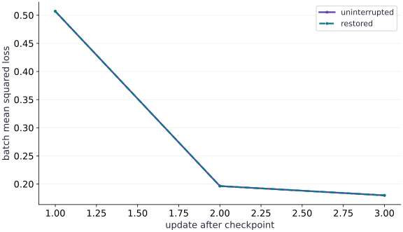

# Resilient distributed training

Phase 09: Distributed training · about 105 minutes · 4 logical CPU devices

## What you will be able to do

- Restore a complete training state with explicit target sharding.
- Compare next sample IDs, optimizer state and losses across an epoch boundary.
- Explain single-controller evidence and the additional requirements of a real multi-controller restart.

## The problem

A restarted sharded run loads the right weights, yet its next update differs. Which missing state could explain that? We will checkpoint a real sharded training step, restore its parameters, momentum, random key and data position, then compare three subsequent updates across an epoch boundary.

## The idea

A recovery point is a consistent boundary in a state machine. Every value needed to choose the next batch and compute the next update belongs to that boundary. Sharding adds a placement contract and multi-controller execution adds coordination; neither makes a weights-only checkpoint sufficient.

## Name the values that determine the next transition

The state contains weights $w$, momentum $v$, a random key, the current example permutation, the cursor into that permutation and the completed step. A batch is selected from the saved order, then a global mean gradient updates momentum and weights. After the final batch in an epoch, a new split key creates the next order. Saving only the current permutation can therefore reproduce the first resumed batch but fail at the next epoch.

$$
v_{t+1}=0.8v_t+\nabla L_t(w_t),\qquad w_{t+1}=w_t-0.04v_{t+1}
$$

## Checkpoint one completed global step

The example partitions examples across four logical CPU devices and keeps its small parameter state replicated. It waits for the step loss, saves the entire state with a real Orbax StandardCheckpointer, waits for saving to finish and restores against a target whose arrays carry the intended mesh and sharding. Every restored leaf is compared with the saved snapshot.

The dataset is a deterministic tiny NumPy fixture. Every controller can reconstruct it from the same declared seed, dimensions and target rule. Real input systems need data identity, preprocessing configuration and iterator recovery, as covered in the recovery phase; matching a seed alone is not enough for a changing dataset. Changing the number of devices here changes fixture dimensions and is deliberately outside this restart contract.

## Prove the next updates, including the next epoch

After restoring step one, run the uninterrupted and resumed states through three transitions. Compare sample IDs before comparing losses. Then compare every state leaf after each transition. The first resumed batch finishes the existing epoch, and the next transition draws a new permutation; this exercises saved random state as well as the current data cursor.

Each update also checks the global gradient with a separate NumPy formula. Agreement between two runs would not detect an identical bug in both runs. Independent arithmetic establishes the update; replay establishes the restore boundary. Float32 reduction order can vary, so numerical arrays use a stated tolerance while sample order must match exactly.

To check a real new process on CPU, save the assembled program as main.py, run it once and copy the printed checkpoint parent folder. Run `COURSE_RESUME=1 COURSE_CHECKPOINT_DIR=/your/printed/folder python main.py` from a new terminal process. This loads the existing file; it does not save a replacement. An incorrect path is rejected. Keep both reports.

## Move the protocol to multiple controllers explicitly

The default run has one controller and four logical CPU devices. It does not kill a worker or test cross-host storage failure. The optional COURSE_MULTIPROCESS branch calls jax.distributed.initialize before any device query and builds a global mesh. Every controller must run the same script, take the same branches and call save and restore in the same order. The tiny fixture is intentionally duplicated on each host; the callback supplies only the slices required by each addressable shard.

On a supported existing multi-host TPU environment, give every worker the same new shared checkpoint directory and run the command below on every worker. The launcher must supply the environment that JAX uses for initialization. A path local to only one worker is not shared storage. For a fresh-process restart of this drill, run every controller again with COURSE_RESUME=1 and the same checkpoint directory. Resume skips saving and restores the existing accepted step-one snapshot; the script recomputes the deterministic step-one baseline only to verify this teaching fixture. A general training job must select and validate its own accepted step. Restart the whole worker group according to your job manager; this lesson does not implement elastic membership or automatic worker replacement. This target branch is executable but has not been run on a multi-host cluster here.

**On every worker of an existing supported TPU job**

```bash
COURSE_MULTIPROCESS=1 JAX_PLATFORMS=tpu COURSE_CHECKPOINT_DIR=/shared/new-recovery-run python main.py
```

**Expected:** All workers coordinate, save and restore through the same new shared path, and report tpu with a process count greater than one. This command needs a configured distributed launch environment and has not been validated on a cluster here.

**Resume the same accepted checkpoint on every worker**

```bash
COURSE_MULTIPROCESS=1 COURSE_RESUME=1 JAX_PLATFORMS=tpu COURSE_CHECKPOINT_DIR=/shared/new-recovery-run python main.py
```

**Expected:** The group loads its existing step-one checkpoint without overwriting it, then verifies subsequent updates. CPU fresh-process replay of this branch is checked separately; multi-host TPU execution remains unverified.

## Reject an inconsistent recovery point

An existing checkpoint directory is rejected to avoid overwriting evidence from a previous experiment. Use a new directory for each drill. In a production system, the accepted checkpoint also needs a matching code/configuration version and data manifest. A readable checkpoint with the wrong schema, data stream or step counter must not become a successful recovery report.

The controlled failures below replace only momentum or only the random key. The first changes the very next update; the second can remain hidden until an epoch transition. These are fault-injected restore experiments, not claims that a live multi-host process failure was tested. The operations project separately exercises real local worker termination and a restart runbook.

## Initialize the runtime before device access

Add this block after the preceding block in main.py and run the assembled file in a fresh process.

```python
import os
import tempfile
from pathlib import Path
import jax
multi = os.environ.get('COURSE_MULTIPROCESS') == '1'
resume = os.environ.get('COURSE_RESUME') == '1'
if multi:
    # Every controller runs this before querying devices or creating arrays.
    jax.distributed.initialize()
else:
    jax.config.update('jax_platforms', 'cpu')
    jax.config.update('jax_num_cpu_devices', 4)
import jax.numpy as jnp
import numpy as np
import orbax.checkpoint as ocp
from jax.sharding import Mesh, NamedSharding, PartitionSpec as P
```

Every controller must use consistent state, data and collective order; the default exercise runs on four logical CPU devices.

## Define the global fixture and placements

Add this block after the preceding block in main.py and run the assembled file in a fresh process.

```python
count = jax.device_count()
assert count >= 2, 'Use at least two devices for the placement exercise'
mesh = Mesh(np.asarray(jax.devices()), ('data',))
rep = NamedSharding(mesh, P())
row = NamedSharding(mesh, P('data', None))
label = NamedSharding(mesh, P('data'))
batch_size, size, width = 2 * count, 4 * count, 2 * count
# Identical tiny synthetic fixture on each controller; not distributed data ingestion.
data = np.random.default_rng(41).normal(size=(size, width)).astype(np.float32)
truth = np.linspace(-0.3, 0.4, width, dtype=np.float32)
targets = data @ truth
```

Every controller must use consistent state, data and collective order; the default exercise runs on four logical CPU devices.

## Carry complete transition state

Add this block after the preceding block in main.py and run the assembled file in a fresh process.

```python
def placed(value, sharding=rep):
    a = np.asarray(value)
    return jax.make_array_from_callback(a.shape, sharding, lambda index: a[index])
```

Every controller must use consistent state, data and collective order; the default exercise runs on four logical CPU devices.

## Checkpoint and verify replay

Add this block after the preceding block in main.py and run the assembled file in a fresh process.

```python
def initial():
    key, order_key = jax.random.split(jax.random.PRNGKey(17))
    return { 'weights': placed(np.zeros(width, np.float32)),
             'momentum': placed(np.zeros(width, np.float32)),
             'key': placed(np.asarray(key)),
             'order': placed(np.asarray(jax.random.permutation(order_key, size))),
             'cursor': placed(np.int32(0)), 'step': placed(np.int32(0)) }
```

Every controller must use consistent state, data and collective order; the default exercise runs on four logical CPU devices.

## Checkpoint and verify replay

Add this block after the preceding block in main.py and run the assembled file in a fresh process.

```python
@jax.jit
def update(w, velocity, x, y):
    loss, grad = jax.value_and_grad(lambda a: jnp.mean((x @ a - y)**2))(w)
    v = 0.8 * velocity + grad
    return w - 0.04 * v, v, loss
```

Every controller must use consistent state, data and collective order; the default exercise runs on four logical CPU devices.

## Checkpoint and verify replay

Add this block after the preceding block in main.py and run the assembled file in a fresh process.

```python
def transition(state):
    cursor = int(state['cursor'])
    order = np.asarray(state['order'])
    key = state['key']
    if cursor == size:
        key, shuffle_key = jax.random.split(key)
        order = np.asarray(jax.random.permutation(shuffle_key, size))
        cursor = 0
    ids = order[cursor:cursor + batch_size]
    x, y = placed(data[ids], row), placed(targets[ids], label)
    w, v, loss = update(state['weights'], state['momentum'], x, y)
    loss.block_until_ready()
    # Independent global derivative and momentum update on the host.
    old_w, old_v = np.asarray(state['weights']), np.asarray(state['momentum'])
    g = 2 * data[ids].T @ (data[ids] @ old_w - targets[ids]) / batch_size
    np.testing.assert_allclose(np.asarray(v), 0.8 * old_v + g, rtol=2e-5, atol=2e-6)
    np.testing.assert_allclose(np.asarray(w), old_w - 0.04 * np.asarray(v), rtol=2e-5, atol=2e-6)
    new = dict(weights=w, momentum=v, key=placed(np.asarray(key)),
               order=placed(order), cursor=placed(np.int32(cursor+batch_size)),
               step=placed(np.int32(int(state['step'])+1)))
    return new, ids.copy(), float(loss)
```

Every controller must use consistent state, data and collective order; the default exercise runs on four logical CPU devices.

## Checkpoint and verify replay

Add this block after the preceding block in main.py and run the assembled file in a fresh process.

```python
state = initial()
state, first_ids, _ = transition(state)
# Shared path is mandatory for real multi-controller execution.
if multi:
    root = Path(os.environ['COURSE_CHECKPOINT_DIR']).resolve()
else:
    root = Path(os.environ['COURSE_CHECKPOINT_DIR']).resolve() if os.environ.get('COURSE_CHECKPOINT_DIR') else Path(tempfile.mkdtemp(prefix='jax-distributed-recovery-'))
checkpoint_path = root / 'step-one'
if resume and not checkpoint_path.exists():
    raise FileNotFoundError('Resume needs an existing step-one checkpoint')
if not resume and checkpoint_path.exists():
    raise FileExistsError('Use a new folder or set COURSE_RESUME=1 for the accepted checkpoint')
with ocp.StandardCheckpointer() as checkpointer:
    if not resume:
        checkpointer.save(checkpoint_path, state)
        checkpointer.wait_until_finished()
    # Target carries the current mesh/sharding, rather than inferring it from old metadata.
    restored = checkpointer.restore(checkpoint_path, target=initial())
    for name in state:
        np.testing.assert_array_equal(np.asarray(restored[name]), np.asarray(state[name]))
    baseline, resumed = state, restored
    baseline_losses, resumed_losses, replay_ids = [], [], []
    for _ in range(3):
        baseline, ids_a, loss_a = transition(baseline)
        resumed, ids_b, loss_b = transition(resumed)
        np.testing.assert_array_equal(ids_a, ids_b)
        for name in baseline:
            np.testing.assert_allclose(np.asarray(baseline[name]), np.asarray(resumed[name]), rtol=2e-5, atol=2e-6)
        baseline_losses.append(loss_a)
        resumed_losses.append(loss_b)
        replay_ids.append(ids_a.tolist())
print('Recorded backend/processes/devices:', jax.default_backend(), jax.process_count(), count)
print('Restored step/cursor:', int(restored['step']), int(restored['cursor']))
print('Next sample IDs across epoch boundary:', replay_ids)
print('Uninterrupted losses:', baseline_losses)
print('Restored losses:', resumed_losses)
print('Checkpoint:', checkpoint_path)

```

Every controller must use consistent state, data and collective order; the default exercise runs on four logical CPU devices.

## Run the example

```python
import os
import tempfile
from pathlib import Path
import jax
multi = os.environ.get('COURSE_MULTIPROCESS') == '1'
resume = os.environ.get('COURSE_RESUME') == '1'
if multi:
    # Every controller runs this before querying devices or creating arrays.
    jax.distributed.initialize()
else:
    jax.config.update('jax_platforms', 'cpu')
    jax.config.update('jax_num_cpu_devices', 4)
import jax.numpy as jnp
import numpy as np
import orbax.checkpoint as ocp
from jax.sharding import Mesh, NamedSharding, PartitionSpec as P

count = jax.device_count()
assert count >= 2, 'Use at least two devices for the placement exercise'
mesh = Mesh(np.asarray(jax.devices()), ('data',))
rep = NamedSharding(mesh, P())
row = NamedSharding(mesh, P('data', None))
label = NamedSharding(mesh, P('data'))
batch_size, size, width = 2 * count, 4 * count, 2 * count
# Identical tiny synthetic fixture on each controller; not distributed data ingestion.
data = np.random.default_rng(41).normal(size=(size, width)).astype(np.float32)
truth = np.linspace(-0.3, 0.4, width, dtype=np.float32)
targets = data @ truth

def placed(value, sharding=rep):
    a = np.asarray(value)
    return jax.make_array_from_callback(a.shape, sharding, lambda index: a[index])

def initial():
    key, order_key = jax.random.split(jax.random.PRNGKey(17))
    return { 'weights': placed(np.zeros(width, np.float32)),
             'momentum': placed(np.zeros(width, np.float32)),
             'key': placed(np.asarray(key)),
             'order': placed(np.asarray(jax.random.permutation(order_key, size))),
             'cursor': placed(np.int32(0)), 'step': placed(np.int32(0)) }

@jax.jit
def update(w, velocity, x, y):
    loss, grad = jax.value_and_grad(lambda a: jnp.mean((x @ a - y)**2))(w)
    v = 0.8 * velocity + grad
    return w - 0.04 * v, v, loss

def transition(state):
    cursor = int(state['cursor'])
    order = np.asarray(state['order'])
    key = state['key']
    if cursor == size:
        key, shuffle_key = jax.random.split(key)
        order = np.asarray(jax.random.permutation(shuffle_key, size))
        cursor = 0
    ids = order[cursor:cursor + batch_size]
    x, y = placed(data[ids], row), placed(targets[ids], label)
    w, v, loss = update(state['weights'], state['momentum'], x, y)
    loss.block_until_ready()
    # Independent global derivative and momentum update on the host.
    old_w, old_v = np.asarray(state['weights']), np.asarray(state['momentum'])
    g = 2 * data[ids].T @ (data[ids] @ old_w - targets[ids]) / batch_size
    np.testing.assert_allclose(np.asarray(v), 0.8 * old_v + g, rtol=2e-5, atol=2e-6)
    np.testing.assert_allclose(np.asarray(w), old_w - 0.04 * np.asarray(v), rtol=2e-5, atol=2e-6)
    new = dict(weights=w, momentum=v, key=placed(np.asarray(key)),
               order=placed(order), cursor=placed(np.int32(cursor+batch_size)),
               step=placed(np.int32(int(state['step'])+1)))
    return new, ids.copy(), float(loss)

state = initial()
state, first_ids, _ = transition(state)
# Shared path is mandatory for real multi-controller execution.
if multi:
    root = Path(os.environ['COURSE_CHECKPOINT_DIR']).resolve()
else:
    root = Path(os.environ['COURSE_CHECKPOINT_DIR']).resolve() if os.environ.get('COURSE_CHECKPOINT_DIR') else Path(tempfile.mkdtemp(prefix='jax-distributed-recovery-'))
checkpoint_path = root / 'step-one'
if resume and not checkpoint_path.exists():
    raise FileNotFoundError('Resume needs an existing step-one checkpoint')
if not resume and checkpoint_path.exists():
    raise FileExistsError('Use a new folder or set COURSE_RESUME=1 for the accepted checkpoint')
with ocp.StandardCheckpointer() as checkpointer:
    if not resume:
        checkpointer.save(checkpoint_path, state)
        checkpointer.wait_until_finished()
    # Target carries the current mesh/sharding, rather than inferring it from old metadata.
    restored = checkpointer.restore(checkpoint_path, target=initial())
    for name in state:
        np.testing.assert_array_equal(np.asarray(restored[name]), np.asarray(state[name]))
    baseline, resumed = state, restored
    baseline_losses, resumed_losses, replay_ids = [], [], []
    for _ in range(3):
        baseline, ids_a, loss_a = transition(baseline)
        resumed, ids_b, loss_b = transition(resumed)
        np.testing.assert_array_equal(ids_a, ids_b)
        for name in baseline:
            np.testing.assert_allclose(np.asarray(baseline[name]), np.asarray(resumed[name]), rtol=2e-5, atol=2e-6)
        baseline_losses.append(loss_a)
        resumed_losses.append(loss_b)
        replay_ids.append(ids_a.tolist())
print('Recorded backend/processes/devices:', jax.default_backend(), jax.process_count(), count)
print('Restored step/cursor:', int(restored['step']), int(restored['cursor']))
print('Next sample IDs across epoch boundary:', replay_ids)
print('Uninterrupted losses:', baseline_losses)
print('Restored losses:', resumed_losses)
print('Checkpoint:', checkpoint_path)

```

Expected: On the four-device CPU fixture, restoration starts at completed step 1 with cursor 8. The next three sample-ID lists and complete states agree with uninterrupted execution. Reference losses are approximately 0.5070, 0.1964 and 0.1798. The real checkpoint path is printed.

## Restored updates reproduce the reference trajectory

**Predict:** Where might two apparently equal restarts first diverge if the next epoch needs an unsaved random key?



**Recorded CPU computation**

### Read the figure

The horizontal axis counts the three updates after the checkpoint, starting at $1$. The vertical axis is the batch mean squared loss before each update. The uninterrupted and restored lines overlap at about $0.5070$, $0.1964$ and $0.1798$ on the recorded CPU fixture. These are different mini-batches, so the downward sequence should not be interpreted as a full-data convergence guarantee.

### Connect it to the computation

The second plotted update begins a newly shuffled epoch. Its agreement exercises the restored key in addition to the saved order and cursor. The code checks sample IDs and complete state; line overlap alone would not establish those facts. The wrong-key practice deliberately reproduces the first batch and then diverges at the next shuffle. No device throughput or multi-host failure timing is shown.

```python
visual_data={'kind':'line','x':[1,2,3],'xlabel':'update after checkpoint','ylabel':'batch mean squared loss','series':[{'label':'uninterrupted','y':baseline_losses},{'label':'restored','y':resumed_losses}]}
```

## Recorded reference execution

CPU run: 2026-10-06T01:24:38.990416+00:00. JAX 0.9.2.

```text
Recorded backend/processes/devices: cpu 1 4
Restored step/cursor: 1 8
Next sample IDs across epoch boundary: [[12, 5, 4, 1, 8, 13, 2, 11], [9, 0, 7, 15, 11, 13, 8, 14], [1, 6, 5, 4, 3, 12, 2, 10]]
Uninterrupted losses: [0.5069587826728821, 0.19637340307235718, 0.1798383891582489]
Restored losses: [0.5069587826728821, 0.19637340307235718, 0.1798383891582489]
Checkpoint: /var/folders/mp/_mq7srqx2y10p5nhjz9m7hj40000gn/T/jax-distributed-recovery-9teq3xry/step-one
Recorded backend/processes/devices: cpu 1 4
Restored step/cursor: 1 8
Next sample IDs across epoch boundary: [[12, 5, 4, 1, 8, 13, 2, 11], [9, 0, 7, 15, 11, 13, 8, 14], [1, 6, 5, 4, 3, 12, 2, 10]]
Uninterrupted losses: [0.5069587826728821, 0.19637340307235718, 0.1798383891582489]
Restored losses: [0.5069587826728821, 0.19637340307235718, 0.1798383891582489]
Checkpoint: /var/folders/mp/_mq7srqx2y10p5nhjz9m7hj40000gn/T/jax-distributed-recovery-6yhi1_zf/step-one
Same next sample IDs, different weights after missing momentum: 0.0195157527923584
Five resumed transitions and all addressable parameter replicas agree.
Current-epoch batch matches; next-epoch batch exposes the wrong key.
PASS: distributed-04

```

## Keep weights but discard momentum

**Predict before running:** Will restoring the correct weights be enough to reproduce the very next update?

```python
incomplete = {**restored, 'momentum': placed(np.zeros(width, np.float32))}
wrong_next, wrong_ids, _ = transition(incomplete)
right_next, right_ids, _ = transition(restored)
np.testing.assert_array_equal(wrong_ids, right_ids)
weight_gap = float(np.max(np.abs(np.asarray(wrong_next['weights']) - np.asarray(right_next['weights']))))
assert weight_gap > 1e-5
print('Same next sample IDs, different weights after missing momentum:', weight_gap)
```

**Expected:** The next sample IDs match but the updated weights differ.

The data stream is correct in this injected failure. The missing optimizer memory explains the different update, so restarting the data loader would not repair it.

## Make it yours

Extend uninterrupted and restored execution by two additional steps. Verify sample IDs, complete state and every local parameter replica. Explain which comparison would fail if a single replica held a different parameter vector.

<details><summary>Reference solution</summary>

```python
for _ in range(2):
    baseline, ids_a, _ = transition(baseline)
    resumed, ids_b, _ = transition(resumed)
    np.testing.assert_array_equal(ids_a, ids_b)
    for name in baseline:
        np.testing.assert_allclose(np.asarray(baseline[name]), np.asarray(resumed[name]), rtol=2e-5, atol=2e-6)
    for shard in resumed['weights'].addressable_shards:
        np.testing.assert_allclose(np.asarray(shard.data), np.asarray(baseline['weights']), rtol=2e-5, atol=2e-6)
assert int(resumed['step']) == 6
print('Five resumed transitions and all addressable parameter replicas agree.')
```

</details>

## Find a delayed random-state failure

**Transfer**

Restore the saved order and cursor but replace the saved key with a different key. Compare the first resumed batch and the following epoch’s first batch. Predict where replay will first fail.

<details><summary>Hint</summary>

The saved order supplies the remaining current-epoch batch. The key is consumed when the next permutation is generated.

</details>

<details><summary>Reference solution and reasoning</summary>

```python
wrong_key_state = {**restored, 'key': placed(np.asarray(jax.random.PRNGKey(999)))}
correct_a, ids_a, _ = transition(restored)
wrong_a, ids_b, _ = transition(wrong_key_state)
np.testing.assert_array_equal(ids_a, ids_b)
np.testing.assert_allclose(np.asarray(correct_a['weights']), np.asarray(wrong_a['weights']), rtol=2e-5, atol=2e-6)
correct_b, ids_c, _ = transition(correct_a)
wrong_b, ids_d, _ = transition(wrong_a)
assert not np.array_equal(ids_c, ids_d)
print('Current-epoch batch matches; next-epoch batch exposes the wrong key.')
```

A successful first resumed update does not establish future replay when later branches consume state that was not yet used. Crossing the epoch boundary reveals the changed key.

</details>

## Check your understanding

The first resumed batch and update match, but sample IDs differ at the next epoch. Which saved value should you inspect first?

1. Only the learning-rate constant.
2. The random key used to construct the next permutation.
3. The display formatting of the loss.

<details><summary>Answer and explanation</summary>

The random key used to construct the next permutation.

The current order can reproduce the rest of one epoch while an incorrect saved key changes the next shuffle. Check complete random state at the accepted boundary.

</details>

## Diagnose the result

Matching IDs with differing weights suggests parameter or optimizer-state mismatch. Differing IDs suggests order, cursor, data identity or shuffle-key mismatch. On multiple hosts also inspect consistent configuration, shared checkpoint access and collective call order; a local CPU pass cannot establish those conditions.

## Carry forward

- Restore parameters, optimizer, random and input-position state together.
- Compare more than one resumed update and cross a state-consuming boundary.
- Keep single-host correctness evidence separate from multi-host fault-tolerance evidence.

## Keep your evidence

Keep the checkpoint path, saved/restored full state, subsequent sample IDs and losses through a new epoch. Diagnose missing momentum and a changed shuffle key; state the untested multi-host boundary.

Keep predictions, modified code, observed results, and reasoning. A checkpoint alone does not demonstrate the exercise.

## Primary references

- [Orbax checkpointing](https://orbax.readthedocs.io/en/latest/guides/checkpoint/orbax_checkpoint_101.html)
- [JAX multi-controller execution](https://docs.jax.dev/en/latest/multi_process.html)
- [JAX distributed data loading](https://docs.jax.dev/en/latest/distributed_data_loading.html)

