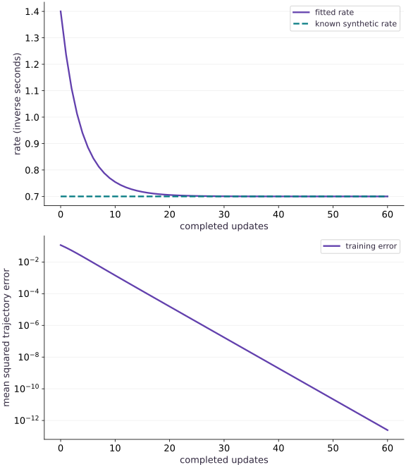

# Fit parameters and scale the simulation

Phase 10: Scientific computing · about 115 minutes · CPU

## What you will be able to do

- Fit a constrained physical parameter through an executed simulator.
- Separate training fit, held-out prediction and solver refinement.
- Diagnose unidentifiable observations and discretization-induced parameter bias.
- Measure synchronized batched CPU execution without claiming accelerator scaling.

## The problem

Suppose we can observe cooling trajectories but do not know the rate. Can we recover it without confusing optimizer success with a trustworthy physical inference? We will fit a positive rate, test new initial conditions, examine non-identifiability, and measure a batched CPU workload with explicit timing boundaries.

## The idea

An inverse problem uses observations to infer parameters of a forward model. A small fitting error is meaningful only if the observations contain information about those parameters and the forward model matches the observation process.

## Ask whether observations identify the parameter

For exponential decay $y(t)=y_0e^{-at}$, an observation only at $t=0$ equals $y_0$ for every rate $a$. No optimizer can recover the rate from that observation alone. Later observations supply rate information, provided their noise and timing are understood.

The fitting loop changes the parameter, runs the solver at the declared observation times and compares with the data. Keep those times fixed when comparing candidate parameters. Solver error can otherwise be mistaken for a physical parameter effect.

Read the fitted trajectory alongside the residuals and objective history. A decreasing objective shows progress on that objective; it does not establish uniqueness or uncertainty. Test a changed observation schedule to see which part of the result is supported by data.

### Pause and reason

Can zero fitting error imply that the parameter is uniquely identified?

<details><summary>Compare your reasoning</summary>

No. Several parameter settings can fit the same insufficient observations. Examine identifiability and changed observation conditions, not only residual size.

</details>

## Choose data that can reveal the parameter

We generate observations from the exponential at forty-one times for initial values $0.7$, $1.5$ and $2.3$. The analytic generator is independent of RK4, avoiding a perfect fit caused merely by using exactly the same numerical algorithm twice. The data are noiseless and synthetic. Their provenance and split must remain explicit in any report.

## Enforce positivity through a parameterization

An unconstrained update to $k$ could make the cooling rate negative, turning decay into growth. Instead train $\theta=\log k$. The chain rule gives $dL/d\theta=k\,dL/dk$; this changes the optimization geometry as well as enforcing positivity. We start at $k=1.4$, twice the true value, and use an explicit fixed learning rate. No claim is made that this rate is suitable for other units or systems.

$$
\theta_{m+1}=\theta_m-\eta\frac{dL(e^{\theta_m})}{d\theta_m},\qquad k_m=e^{\theta_m}>0
$$

## Inspect the recovered model beyond the training curve

The recovered rate is about $0.700000009$, close to the known $0.7$. The tiny difference is numerical: RK4 slightly approximates the exponential. We test new initial conditions $0.4$, $1.1$ and $3.2$, then halve the simulation step. A fitted parameter that changes materially under grid refinement may be compensating for solver error. Good held-out performance here tests the same equation on new starts; it does not establish generalization to a different physical law. On this noiseless fixture, the fitted rate compensates for the tiny RK4 bias: the original-grid held-out error is near roundoff, while finer-grid error is about $7.3\times10^{-9}$. Refinement can therefore increase this already tiny residual. The check requires a small error, not automatic improvement.

## Recognize observations that cannot identify a parameter

At time zero the state equals the prescribed initial condition regardless of the rate. If the dataset contains only initial observations, the loss gradient is zero for every rate and no optimizer can recover it. This is non-identifiability, not a learning-rate problem. With noisy data, late-time points may also carry little useful signal after the system has nearly decayed. Inspect sensitivities and measurement precision before collecting more equally uninformative data.

## Keep numerical bias separate from physical estimates

For an Euler step, matching an exact exponential interval means $1-k_{\mathrm{Euler}}h=e^{-k_{\mathrm{true}}h}$. Thus a coarse Euler fit can perfectly match these observations using the wrong physical rate. With $h=0.5$, a true rate of $0.7$ looks like about $0.5906$. Low training error is not enough to justify the inferred parameter.

$$
k_{\mathrm{Euler}}=\frac{1-e^{-k_{\mathrm{true}}h}}{h}
$$

## Measure a bounded scaling experiment

Compile and warm up each batch shape, place its inputs before the timed region, and wait for results with block_until_ready. Report both total milliseconds and time per trajectory. Changing batch shape may compile a new program. This CPU experiment measures a fixed forty-step output-producing solve; it does not measure training, input transfer, multi-host communication or TPU performance. A batch can amortize overhead without implying unlimited scaling.

## Move from this audit to a scientific workflow

The staged scientific-inverse project asks for a reusable simulation and fitting API with changed parameters, noisy observations, held-out checks and a reproducible report. For stiff or adaptive models, choose and validate a suitable solver before reusing the optimizer. Diffrax, Equinox and Lineax provide ecosystem building blocks, but this phase’s executed core intentionally uses the installed JAX environment; no optional library or target hardware execution is implied.

## Define the simulator and immutable observations

Append this block to main.py in your CPU course environment; for the first block create the file. Run blocks in order.

```python
# Step 1 — Define the simulator and immutable observations: Observations come from the analytic physical model, not the same...
# Import jax for this computation.
import jax
# Update state in place with the new values.
jax.config.update("jax_enable_x64", True)
# Import jax.numpy for this computation.
import jax.numpy as jnp
import numpy as np

# Function `rk4_step(rate, value, dt)` implementing this stage's computation:
def rk4_step(rate, value, dt):
    # Evaluate `a` from the current inputs and state.
    a = -rate*value
    # Evaluate `b` from the current inputs and state.
    b = -rate*(value + dt*a/2)
    # Evaluate `c` from the current inputs and state.
    c = -rate*(value + dt*b/2)
    # Evaluate `d` from the current inputs and state.
    d = -rate*(value + dt*c)
    # Return `value + dt * (a + 2 * b + 2 * c + d) / 6` to the caller.
    return value + dt*(a + 2*b + 2*c + d)/6

# Define `solve(rate, initial, steps, dt)` to carry state across steps with `jax.lax.scan`:
def solve(rate, initial, steps=40, dt=0.05):
    # Function `advance(value, unused)` implementing this stage's computation:
    def advance(value, unused):
        # Run `rk4_step` to compute `next_value`.
        next_value = rk4_step(rate, value, dt)
        # Return `(next_value, next_value)` to the caller.
        return next_value, next_value
    # Run compiled structured control flow via `jax.lax` (`(_, tail)`).
    _, tail = jax.lax.scan(advance, initial, None, length=steps)
    # Return `jnp.concatenate((jnp.atleast_1d(initial), tail))` to the caller.
    return jnp.concatenate((jnp.atleast_1d(initial), tail))

# Initialize array `train_initials` with explicit values and shape.
train_initials = jnp.array([0.7,1.5,2.3])
# Initialize array `times` with explicit values and shape.
times = jnp.arange(41)*0.05
# Evaluate `true_rate` from the current inputs and state.
true_rate = 0.7
# Evaluate `observations` from the current inputs and state.
observations = train_initials[:,None]*jnp.exp(-true_rate*times)
# Function `predict(rate, initials)` implementing this stage's computation:
def predict(rate, initials):
    # Return `jax.vmap(lambda initial: solve(rate, initial))(initials)` to the caller.
    return jax.vmap(lambda initial: solve(rate,initial))(initials)
# Function `objective(log_rate)` implementing this stage's computation:
def objective(log_rate):
    # Run `predict` to compute `residual`.
    residual = predict(jnp.exp(log_rate),train_initials)-observations
    # Return `jnp.mean(residual ** 2)` to the caller.
    return jnp.mean(residual**2)
```

Observations come from the analytic physical model, not the same discrete solver used for fitting. Different initial values are reserved for evaluation.

## Fit a positive rate with an explicit update

Append this block to main.py in your CPU course environment; for the first block create the file. Run blocks in order.

```python
# Step 2 — Fit a positive rate with an explicit update: The logarithm parameterization keeps the rate positive.
# Define and JIT-compile `update(log_rate)` so XLA traces and fuses the operations:
@jax.jit
# Function `update(log_rate)` implementing this stage's computation:
def update(log_rate):
    # Return `log_rate - 0.4 * jax.grad(objective)(log_rate)` to the caller.
    return log_rate - 0.4*jax.grad(objective)(log_rate)
# Run `jnp.log` to compute `log_rate`.
log_rate = jnp.log(1.4)
# Evaluate `loss_history` from the current inputs and state.
loss_history = [float(objective(log_rate))]
# Evaluate `rate_history` from the current inputs and state.
rate_history = [float(jnp.exp(log_rate))]
# Repeat the update loop over `range(160)` steps:
for _ in range(160):
    # Run `update` to compute `log_rate`.
    log_rate = update(log_rate)
    # Append the current step result to `loss_history`.
    loss_history.append(float(objective(log_rate)))
    # Append the current step result to `rate_history`.
    rate_history.append(float(jnp.exp(log_rate)))
# Evaluate `jnp.exp(log_rate)` and convert the result into Python scalar/collection `fitted_rate`.
fitted_rate = float(jnp.exp(log_rate))
# Verify contract: `abs(fitted_rate - true_rate) < 2e-07`.
assert abs(fitted_rate-true_rate) < 2e-7
# Verify that the output satisfies the expected shape, finite-value, or numerical contract.
assert loss_history[-1] < 1e-20
# Print the observed values to compare against the expected result.
print("Initial/fitted rate:",rate_history[0],fitted_rate)
# Print diagnostic summary of the computed outputs.
print("Initial/final loss:",loss_history[0],loss_history[-1])
```

The logarithm parameterization keeps the rate positive. The recorded first point is before any update; every later point evaluates the updated parameter.

## Validate on unseen initial conditions and a finer grid

Append this block to main.py in your CPU course environment; for the first block create the file. Run blocks in order.

```python
# Step 3 — Validate on unseen initial conditions and a finer grid: Held-out starts test transfer within this known equation.
# Initialize array `held_initials` with explicit values and shape.
held_initials=jnp.array([0.4,1.1,3.2])
# Convert `held_truth` to a host NumPy array for inspection or verification.
held_truth=np.asarray(held_initials)[:,None]*np.exp(-true_rate*np.asarray(times))
# Convert `held_prediction` to a host NumPy array for inspection or verification.
held_prediction=np.asarray(predict(fitted_rate,held_initials))
# Aggregate array values to compute `held_rmse`.
held_rmse=float(np.sqrt(np.mean((held_prediction-held_truth)**2)))
# Verify contract: `held_rmse < 1e-07`.
assert held_rmse < 1e-7
# Vectorize across the batch dimension with `jax.vmap` (`fine`).
fine=np.asarray(jax.vmap(lambda initial:solve(fitted_rate,initial,80,0.025))(held_initials))[:,::2]
# Aggregate array values to compute `fine_rmse`.
fine_rmse=float(np.sqrt(np.mean((fine-held_truth)**2)))
# Verify contract: `fine_rmse < 1e-07`.
assert fine_rmse < 1e-7
# Differentiate the objective to obtain `initial_only_gradient` via automatic differentiation.
initial_only_gradient=jax.grad(lambda p:jnp.mean((predict(jnp.exp(p),train_initials)[:,0]-observations[:,0])**2))(jnp.log(1.4))
# Verify contract: `float(initial_only_gradient) == 0.0`.
assert float(initial_only_gradient)==0.0
# Print diagnostic summary of the computed outputs.
print("Held-out RMSE:",held_rmse,"finer-grid RMSE:",fine_rmse)
# Print diagnostic summary of the computed outputs.
print("Initial-time-only gradient:",float(initial_only_gradient))
```

Held-out starts test transfer within this known equation. Refinement tests whether fitting exploited numerical bias. Initial-time-only data cannot identify the decay rate at all.

## Run the example

```python
# Step 1 — Define the simulator and immutable observations: Observations come from the analytic physical model, not the same...
# Import jax for this computation.
import jax
# Update state in place with the new values.
jax.config.update("jax_enable_x64", True)
# Import jax.numpy for this computation.
import jax.numpy as jnp
import numpy as np

# Function `rk4_step(rate, value, dt)` implementing this stage's computation:
def rk4_step(rate, value, dt):
    # Evaluate `a` from the current inputs and state.
    a = -rate*value
    # Evaluate `b` from the current inputs and state.
    b = -rate*(value + dt*a/2)
    # Evaluate `c` from the current inputs and state.
    c = -rate*(value + dt*b/2)
    # Evaluate `d` from the current inputs and state.
    d = -rate*(value + dt*c)
    # Return `value + dt * (a + 2 * b + 2 * c + d) / 6` to the caller.
    return value + dt*(a + 2*b + 2*c + d)/6

# Define `solve(rate, initial, steps, dt)` to carry state across steps with `jax.lax.scan`:
def solve(rate, initial, steps=40, dt=0.05):
    # Function `advance(value, unused)` implementing this stage's computation:
    def advance(value, unused):
        # Run `rk4_step` to compute `next_value`.
        next_value = rk4_step(rate, value, dt)
        # Return `(next_value, next_value)` to the caller.
        return next_value, next_value
    # Run compiled structured control flow via `jax.lax` (`(_, tail)`).
    _, tail = jax.lax.scan(advance, initial, None, length=steps)
    # Return `jnp.concatenate((jnp.atleast_1d(initial), tail))` to the caller.
    return jnp.concatenate((jnp.atleast_1d(initial), tail))

# Initialize array `train_initials` with explicit values and shape.
train_initials = jnp.array([0.7,1.5,2.3])
# Initialize array `times` with explicit values and shape.
times = jnp.arange(41)*0.05
# Evaluate `true_rate` from the current inputs and state.
true_rate = 0.7
# Evaluate `observations` from the current inputs and state.
observations = train_initials[:,None]*jnp.exp(-true_rate*times)
# Function `predict(rate, initials)` implementing this stage's computation:
def predict(rate, initials):
    # Return `jax.vmap(lambda initial: solve(rate, initial))(initials)` to the caller.
    return jax.vmap(lambda initial: solve(rate,initial))(initials)
# Function `objective(log_rate)` implementing this stage's computation:
def objective(log_rate):
    # Run `predict` to compute `residual`.
    residual = predict(jnp.exp(log_rate),train_initials)-observations
    # Return `jnp.mean(residual ** 2)` to the caller.
    return jnp.mean(residual**2)

# Step 2 — Fit a positive rate with an explicit update: The logarithm parameterization keeps the rate positive.
# Define and JIT-compile `update(log_rate)` so XLA traces and fuses the operations:
@jax.jit
# Function `update(log_rate)` implementing this stage's computation:
def update(log_rate):
    # Return `log_rate - 0.4 * jax.grad(objective)(log_rate)` to the caller.
    return log_rate - 0.4*jax.grad(objective)(log_rate)
# Run `jnp.log` to compute `log_rate`.
log_rate = jnp.log(1.4)
# Evaluate `loss_history` from the current inputs and state.
loss_history = [float(objective(log_rate))]
# Evaluate `rate_history` from the current inputs and state.
rate_history = [float(jnp.exp(log_rate))]
# Repeat the update loop over `range(160)` steps:
for _ in range(160):
    # Run `update` to compute `log_rate`.
    log_rate = update(log_rate)
    # Append the current step result to `loss_history`.
    loss_history.append(float(objective(log_rate)))
    # Append the current step result to `rate_history`.
    rate_history.append(float(jnp.exp(log_rate)))
# Evaluate `jnp.exp(log_rate)` and convert the result into Python scalar/collection `fitted_rate`.
fitted_rate = float(jnp.exp(log_rate))
# Verify contract: `abs(fitted_rate - true_rate) < 2e-07`.
assert abs(fitted_rate-true_rate) < 2e-7
# Verify that the output satisfies the expected shape, finite-value, or numerical contract.
assert loss_history[-1] < 1e-20
# Print the observed values to compare against the expected result.
print("Initial/fitted rate:",rate_history[0],fitted_rate)
# Print diagnostic summary of the computed outputs.
print("Initial/final loss:",loss_history[0],loss_history[-1])

# Step 3 — Validate on unseen initial conditions and a finer grid: Held-out starts test transfer within this known equation.
# Initialize array `held_initials` with explicit values and shape.
held_initials=jnp.array([0.4,1.1,3.2])
# Convert `held_truth` to a host NumPy array for inspection or verification.
held_truth=np.asarray(held_initials)[:,None]*np.exp(-true_rate*np.asarray(times))
# Convert `held_prediction` to a host NumPy array for inspection or verification.
held_prediction=np.asarray(predict(fitted_rate,held_initials))
# Aggregate array values to compute `held_rmse`.
held_rmse=float(np.sqrt(np.mean((held_prediction-held_truth)**2)))
# Verify contract: `held_rmse < 1e-07`.
assert held_rmse < 1e-7
# Vectorize across the batch dimension with `jax.vmap` (`fine`).
fine=np.asarray(jax.vmap(lambda initial:solve(fitted_rate,initial,80,0.025))(held_initials))[:,::2]
# Aggregate array values to compute `fine_rmse`.
fine_rmse=float(np.sqrt(np.mean((fine-held_truth)**2)))
# Verify contract: `fine_rmse < 1e-07`.
assert fine_rmse < 1e-7
# Differentiate the objective to obtain `initial_only_gradient` via automatic differentiation.
initial_only_gradient=jax.grad(lambda p:jnp.mean((predict(jnp.exp(p),train_initials)[:,0]-observations[:,0])**2))(jnp.log(1.4))
# Verify contract: `float(initial_only_gradient) == 0.0`.
assert float(initial_only_gradient)==0.0
# Print diagnostic summary of the computed outputs.
print("Held-out RMSE:",held_rmse,"finer-grid RMSE:",fine_rmse)
# Print diagnostic summary of the computed outputs.
print("Initial-time-only gradient:",float(initial_only_gradient))
```

Expected: The rate moves from 1.4 to approximately 0.700000009. Held-out and refined-grid RMSE stay below 1e-7; initial-only observations have zero rate gradient.

## Recover a physical rate, then check what the fit means

**Predict:** Does a falling loss alone prove that the recovered rate is physically correct?



**Recorded CPU computation**

### Read the figure

The top panel shows the positive rate estimate versus completed optimizer updates. Update $0$ is the initial $1.4$, before training. The reference line is the known synthetic rate $0.7$. By update $20$, the fitted rate is about $0.7055$; by update $40$, about $0.70006$.

The lower panel shows mean squared trajectory error on a logarithmic scale. Its initial value is about $0.1168$, falling to about $1.55\times10^{-5}$ after twenty updates. The displayed first sixty updates focus on the informative descent rather than the eventual floating-point floor.

### Connect it to the computation

These recorded post-update values correspond to the same parameters shown above. The reference observations come from the analytic exponential, while fitting uses RK4, so agreement tests a numerical model against independently generated data.

A tiny final loss is plausible for noiseless synthetic data and a single smooth parameter. It is not an uncertainty estimate or proof about real instruments. Held-out starts, grid refinement and the deliberately biased Euler example provide the additional evidence needed to interpret the parameter.

```python
# Compute figure data for: Recover a physical rate, then check what the fit means
# Evaluate `range(61)` and convert the result into Python scalar/collection `indices`.
indices=list(range(61))
# Evaluate `visual_data` from the current inputs and state.
visual_data={'panels':[{'kind':'line','x':indices,'xlabel':'completed updates','ylabel':'rate (inverse seconds)','series':[{'label':'fitted rate','y':rate_history[:61]},{'label':'known synthetic rate','y':[true_rate]*61}]},{'kind':'line','x':indices,'xlabel':'completed updates','ylabel':'mean squared trajectory error','yscale':'log','series':[{'label':'training error','y':loss_history[:61]}]}]}
```

## Recorded reference execution

CPU run: 2026-10-08T14:04:40.398785+00:00. JAX 0.9.2.

```text
Initial/fitted rate: 1.4 0.7000000090128304
Initial/final loss: 0.11676630453561089 1.9484774169068916e-32
Held-out RMSE: 4.572895313141112e-16 finer-grid RMSE: 7.282689372293896e-09
Initial-time-only gradient: 0.0
Initial/fitted rate: 1.4 0.7000000090128304
Initial/final loss: 0.11676630453561089 1.9484774169068916e-32
Held-out RMSE: 4.572895313141112e-16 finer-grid RMSE: 7.282689372293896e-09
Initial-time-only gradient: 0.0
True rate: 0.7 perfect coarse Euler rate: 0.5906238205625731
batch, median milliseconds, milliseconds per trajectory: [(1, 0.006167218089103699, 0.006167218089103699), (16, 0.005791895091533661, 0.0003619934432208538), (256, 0.03800028935074806, 0.00014843863027635962)]
Changed true/recovered rate: 0.4 0.40000000054230433
Recovered initial amplitude: 2.8000000000000003
Noisy grid-search estimate: 0.7 residual MSE: 2.6000611439697964e-05
PASS: science-04

```

## A perfect Euler fit can infer the wrong rate

**Predict before running:** Will a coarse Euler fit overestimate or underestimate the true cooling rate?

```python
# Experiment — A perfect Euler fit can infer the wrong rate: The model parameter absorbs discretization error.
h=0.5
# Evaluate `biased_rate` from the current inputs and state.
biased_rate=(1-np.exp(-true_rate*h))/h
# Initialize array `coarse_times` with explicit values and shape.
coarse_times=np.arange(5)*h
# Initialize array `matched` with explicit values and shape.
matched=2*(1-biased_rate*h)**np.arange(5)
# Verify that computed values match the expected reference within numerical tolerance.
np.testing.assert_allclose(matched,2*np.exp(-true_rate*coarse_times),rtol=1e-12)
# Verify contract: `abs(biased_rate - true_rate) > 0.1`.
assert abs(biased_rate-true_rate)>0.1
# Print the observed values to compare against the expected result.
print("True rate:",true_rate,"perfect coarse Euler rate:",biased_rate)
```

**Expected:** True rate 0.7; Euler fit approximately 0.59062382.

The model parameter absorbs discretization error. Refining the numerical model is necessary before giving the estimate a physical interpretation.

## Measure fixed-shape CPU batches

**Predict before running:** Will total time and time per trajectory necessarily move in the same direction?

```python
# Experiment — Measure fixed-shape CPU batches: The warmed, synchronized boundary excludes compilation and...
# Import time for this computation.
import time
# Evaluate `measurements` from the current inputs and state.
measurements=[]
# Iterate over `batch_size` to step through the computation:
for batch_size in (1,16,256):
    # Initialize array `starts` with explicit values and shape.
    starts=jnp.linspace(0.4,3.2,batch_size)
    # Wrap with `jax.jit` (`compiled`) so XLA traces and compiles the function.
    compiled=jax.jit(lambda values:predict(fitted_rate,values))
    # Synchronize host execution until asynchronous device computation completes.
    compiled(starts).block_until_ready()
    # Evaluate `samples` from the current inputs and state.
    samples=[]
    # Repeat the update loop over `range(7)` steps:
    for _ in range(7):
        # Record execution timing or profiler trace in `beginning`.
        beginning=time.perf_counter()
        # Synchronize host execution until asynchronous device computation completes.
        compiled(starts).block_until_ready()
        # Record execution timing or profiler trace in ``.
        samples.append((time.perf_counter()-beginning)*1000)
    # Evaluate `np.median(samples)` and convert the result into Python scalar/collection `median_ms`.
    median_ms=float(np.median(samples))
    # Verify that the output satisfies the expected shape, finite-value, or numerical contract.
    assert median_ms>0
    # Append the current step result to `measurements`.
    measurements.append((batch_size,median_ms,median_ms/batch_size))
# Print the observed values to compare against the expected result.
print("batch, median milliseconds, milliseconds per trajectory:",measurements)
```

**Expected:** Measured positive timings vary by machine and load; the code makes no ordering or speedup assertion.

The warmed, synchronized boundary excludes compilation and explicit host-to-device transfer. Report the observed samples and device instead of copying a reference timing.

## Make it yours

Repeat inference for a new true rate $0.4$ using analytically generated observations, starting at $0.9$. Show that the recovered parameter and held-out predictions change consistently.

### How to write this exercise — Step-by-step recipe & starter scaffold

**Key functions & syntax to use:**
- `x.sum(axis=...) / x.mean(axis=..., keepdims=...)` — Reduces values along the named `axis` (the axis you name is collapsed unless `keepdims=True`).
- `jnp.allclose(actual, expected, rtol=..., atol=...)` — Checks that two arrays match elementwise within floating-point tolerance.
- `jax.grad(loss_fn)(params, ...)` — Transforms a scalar-output function into a function returning the gradient PyTree with the same structure as `params`.
- `jax.jit(fn) / @jax.jit` — Traces `fn` with abstract shapes and compiles a fused XLA executable cached by input shape and dtype.

**Step-by-step implementation plan:**
1. Evaluate `changed_observations` from the current inputs and state.
2. Function `changed_objective(theta)` implementing this stage's computation:
3. Return `jnp.mean((predict(jnp.exp(theta), train_initials) - changed_observations) ** 2)` to the caller.
4. Differentiate the objective to obtain `changed_update` via automatic differentiation.
5. Run `jnp.log` to compute `changed_theta`.

**Starter code scaffold (fill in the TODOs):**

```python
# Exercise solution: Repeat inference for a new true rate 0.4 using analytically generated...
changed_truth = ...  # TODO: compute changed_truth
# Evaluate `changed_observations` from the current inputs and state.
changed_observations = ...  # TODO: compute changed_observations
# Function `changed_objective(theta)` implementing this stage's computation:
def changed_objective(theta):
    # Return `jnp.mean((predict(jnp.exp(theta), train_initials) - changed_observations) ** 2)` to the caller.
    return ...  # TODO: return computed result
# Differentiate the objective to obtain `changed_update` via automatic differentiation.
changed_update = jax.jit(...)  # TODO: compute changed_update
# Run `jnp.log` to compute `changed_theta`.
changed_theta = jnp.log(...)  # TODO: compute changed_theta
# Repeat the update loop over `range(200)` steps:
for _ in range(200):
    # Run `changed_update` to compute `changed_theta`.
    changed_theta = changed_update(...)  # TODO: compute changed_theta
# Evaluate `jnp.exp(changed_theta)` and convert the result into Python scalar/collection `changed_rate`.
changed_rate = float(...)  # TODO: compute changed_rate
# Verify contract: `abs(changed_rate - changed_truth) < 1e-06`.
assert abs(changed_rate-changed_truth)  # TODO: complete assertion check
# Convert `changed_held` to a host NumPy array for inspection or verification.
changed_held = np.asarray(...)  # TODO: compute changed_held
# Verify that computed values match the expected reference within numerical tolerance.
np.testing.assert_allclose(predict(changed_rate,held_initials),changed_held,rtol = ...  # TODO: compute np.testing.assert_allclose(predict(changed_rate,held_initials),changed_held,rtol
# Print the observed values to compare against the expected result.
print("Changed true/recovered rate:",changed_truth,changed_rate)
```

<details><summary>Reference solution</summary>

```python
# Exercise solution: Repeat inference for a new true rate 0.4 using analytically generated...
changed_truth=0.4
# Evaluate `changed_observations` from the current inputs and state.
changed_observations=train_initials[:,None]*jnp.exp(-changed_truth*times)
# Function `changed_objective(theta)` implementing this stage's computation:
def changed_objective(theta):
    # Return `jnp.mean((predict(jnp.exp(theta), train_initials) - changed_observations) ** 2)` to the caller.
    return jnp.mean((predict(jnp.exp(theta),train_initials)-changed_observations)**2)
# Differentiate the objective to obtain `changed_update` via automatic differentiation.
changed_update=jax.jit(lambda theta:theta-0.4*jax.grad(changed_objective)(theta))
# Run `jnp.log` to compute `changed_theta`.
changed_theta=jnp.log(0.9)
# Repeat the update loop over `range(200)` steps:
for _ in range(200):
    # Run `changed_update` to compute `changed_theta`.
    changed_theta=changed_update(changed_theta)
# Evaluate `jnp.exp(changed_theta)` and convert the result into Python scalar/collection `changed_rate`.
changed_rate=float(jnp.exp(changed_theta))
# Verify contract: `abs(changed_rate - changed_truth) < 1e-06`.
assert abs(changed_rate-changed_truth)<1e-6
# Convert `changed_held` to a host NumPy array for inspection or verification.
changed_held=np.asarray(held_initials)[:,None]*np.exp(-changed_truth*np.asarray(times))
# Verify that computed values match the expected reference within numerical tolerance.
np.testing.assert_allclose(predict(changed_rate,held_initials),changed_held,rtol=2e-6,atol=1e-7)
# Print the observed values to compare against the expected result.
print("Changed true/recovered rate:",changed_truth,changed_rate)
```

</details>

## Infer a different physical quantity

**Practice**

Hold the rate fixed and estimate an unknown initial amplitude from a trajectory using linear least squares. Verify the estimate with a NumPy closed form.

<details><summary>Hint</summary>

At fixed rate, predictions are amplitude multiplied by a known decay vector.

</details>

### How to write: Infer a different physical quantity — Step-by-step recipe & starter scaffold

**Key functions & syntax to use:**
- `x.sum(axis=...) / x.mean(axis=..., keepdims=...)` — Reduces values along the named `axis` (the axis you name is collapsed unless `keepdims=True`).
- `jax.grad(loss_fn)(params, ...)` — Transforms a scalar-output function into a function returning the gradient PyTree with the same structure as `params`.

**Step-by-step implementation plan:**
1. Evaluate `unknown_initial` from the current inputs and state.
2. Evaluate `measured` from the current inputs and state.
3. Evaluate `np.dot(basis, measured) / np.dot(basis, basis)` and convert the result into Python scalar/collection `estimate`.
4. Verify contract: `abs(estimate - unknown_initial) < 1e-12`.
5. Function `amplitude_loss(amplitude)` implementing this stage's computation:

**Starter code scaffold (fill in the TODOs):**

```python
# Infer a different physical quantity (Practice): The inverse problem becomes linear when rate is fixed.
basis = np.exp(...)  # TODO: compute basis
# Evaluate `unknown_initial` from the current inputs and state.
unknown_initial = ...  # TODO: compute unknown_initial
# Evaluate `measured` from the current inputs and state.
measured = ...  # TODO: compute measured
# Evaluate `np.dot(basis, measured) / np.dot(basis, basis)` and convert the result into Python scalar/collection `estimate`.
estimate = float(...)  # TODO: compute estimate
# Verify contract: `abs(estimate - unknown_initial) < 1e-12`.
assert abs(estimate-unknown_initial)  # TODO: complete assertion check
# Function `amplitude_loss(amplitude)` implementing this stage's computation:
def amplitude_loss(amplitude):
    # Return `jnp.mean((amplitude * jnp.asarray(basis) - jnp.asarray(measured)) ** 2)` to the caller.
    return ...  # TODO: return computed result
# Verify contract: `abs(float(jax.grad(amplitude_loss)(estimate))) < 1e-12`.
assert abs(float(jax.grad(amplitude_loss)(estimate)))  # TODO: complete assertion check
# Print the observed values to compare against the expected result.
print("Recovered initial amplitude:",estimate)
```

<details><summary>Reference solution and reasoning</summary>

```python
# Infer a different physical quantity (Practice): The inverse problem becomes linear when rate is fixed.
basis=np.exp(-0.7*np.asarray(times))
# Evaluate `unknown_initial` from the current inputs and state.
unknown_initial=2.8
# Evaluate `measured` from the current inputs and state.
measured=unknown_initial*basis
# Evaluate `np.dot(basis, measured) / np.dot(basis, basis)` and convert the result into Python scalar/collection `estimate`.
estimate=float(np.dot(basis,measured)/np.dot(basis,basis))
# Verify contract: `abs(estimate - unknown_initial) < 1e-12`.
assert abs(estimate-unknown_initial)<1e-12
# Function `amplitude_loss(amplitude)` implementing this stage's computation:
def amplitude_loss(amplitude):
    # Return `jnp.mean((amplitude * jnp.asarray(basis) - jnp.asarray(measured)) ** 2)` to the caller.
    return jnp.mean((amplitude*jnp.asarray(basis)-jnp.asarray(measured))**2)
# Verify contract: `abs(float(jax.grad(amplitude_loss)(estimate))) < 1e-12`.
assert abs(float(jax.grad(amplitude_loss)(estimate)))<1e-12
# Print the observed values to compare against the expected result.
print("Recovered initial amplitude:",estimate)
```

The inverse problem becomes linear when rate is fixed. Jointly unknown amplitude and rate require enough distinct observation times to distinguish their effects.

</details>

## Compare noisy inference with an independent search

**Challenge**

Create a deterministic noisy dataset and quantify rate sensitivity with an independent grid search, without selecting a fit using held-out labels.

<details><summary>Hint</summary>

Search a dense one-dimensional grid using the analytic forward model and report the minimizing rate and residual scale.

</details>

### How to write: Compare noisy inference with an independent search — Step-by-step recipe & starter scaffold

**Key functions & syntax to use:**
- `x.sum(axis=...) / x.mean(axis=..., keepdims=...)` — Reduces values along the named `axis` (the axis you name is collapsed unless `keepdims=True`).

**Step-by-step implementation plan:**
1. Initialize array `candidates` with explicit values and shape.
2. Convert `reference_predictions` to a host NumPy array for inspection or verification.
3. Reduce along axis=(1 to compute `reference_losses`.
4. Evaluate `candidates[np.argmin(reference_losses)]` and convert the result into Python scalar/collection `best`.
5. Verify contract: `abs(best - 0.7) < 0.01`.

**Starter code scaffold (fill in the TODOs):**

```python
# Compare noisy inference with an independent search (Challenge): A noisy optimum need not equal the generating parameter exactly.
noisy = np.asarray(...)  # TODO: compute noisy
# Initialize array `candidates` with explicit values and shape.
candidates = np.linspace(...)  # TODO: compute candidates
# Convert `reference_predictions` to a host NumPy array for inspection or verification.
reference_predictions = np.asarray(...)  # TODO: compute reference_predictions
# Reduce along axis=(1 to compute `reference_losses`.
reference_losses = np.mean(...)  # TODO: compute reference_losses
# Evaluate `candidates[np.argmin(reference_losses)]` and convert the result into Python scalar/collection `best`.
best = float(...)  # TODO: compute best
# Verify contract: `abs(best - 0.7) < 0.01`.
assert abs(best-0.7)  # TODO: complete assertion check
# Verify that the output satisfies the expected shape, finite-value, or numerical contract.
assert float(np.min(reference_losses))  # TODO: complete assertion check
# Print the observed values to compare against the expected result.
print("Noisy grid-search estimate:",best,"residual MSE:",float(np.min(reference_losses)))
```

<details><summary>Reference solution and reasoning</summary>

```python
# Compare noisy inference with an independent search (Challenge): A noisy optimum need not equal the generating parameter exactly.
noisy=np.asarray(observations)+0.005*np.random.default_rng(19).normal(size=observations.shape)
# Initialize array `candidates` with explicit values and shape.
candidates=np.linspace(0.65,0.75,1001)
# Convert `reference_predictions` to a host NumPy array for inspection or verification.
reference_predictions=np.asarray(train_initials)[None,:,None]*np.exp(-candidates[:,None,None]*np.asarray(times)[None,None,:])
# Reduce along axis=(1 to compute `reference_losses`.
reference_losses=np.mean((reference_predictions-noisy[None,:,:])**2,axis=(1,2))
# Evaluate `candidates[np.argmin(reference_losses)]` and convert the result into Python scalar/collection `best`.
best=float(candidates[np.argmin(reference_losses)])
# Verify contract: `abs(best - 0.7) < 0.01`.
assert abs(best-0.7)<0.01
# Verify that the output satisfies the expected shape, finite-value, or numerical contract.
assert float(np.min(reference_losses))>0
# Print the observed values to compare against the expected result.
print("Noisy grid-search estimate:",best,"residual MSE:",float(np.min(reference_losses)))
```

A noisy optimum need not equal the generating parameter exactly. One fixed-seed recovery check is not a calibrated uncertainty interval; repeated datasets or a justified statistical model are needed.

</details>

## Check your understanding

You fit only observations at time zero and every rate gives zero loss. What is the problem?

1. The batch is too small for a TPU.
2. The step size is too accurate.
3. The observations contain no information about the cooling rate.

<details><summary>Answer and explanation</summary>

The observations contain no information about the cooling rate.

The initial state is independent of rate. No optimizer can recover a rate from data whose predictions do not depend on it.

</details>

## Diagnose the result

If the training loss is tiny but the parameter changes with step size, suspect solver bias. If every candidate has zero derivative, inspect observation times and parameter dependence before adjusting the optimizer. If timing results are implausibly tiny, confirm synchronization and warmup. If test performance drove your learning-rate choice, the test set is no longer untouched.

## Carry forward

- Choose data that can reveal the parameter
- Enforce positivity through a parameterization
- Inspect the recovered model beyond the training curve
- Recognize observations that cannot identify a parameter
- Keep numerical bias separate from physical estimates
- Measure a bounded scaling experiment
- Move from this audit to a scientific workflow

## Keep your evidence

Full loss/rate histories, held-out and refined-grid metrics, noisy reference search, timing boundary and limitations. Keep the environment, observed outputs and your explanation of the figure.

Keep predictions, modified code, observed results, and reasoning. A checkpoint alone does not demonstrate the exercise.

## Primary references

- [JAX scan: fixed carry structure and reverse-mode differentiation](https://docs.jax.dev/en/latest/_autosummary/jax.lax.scan.html)
- [JAX automatic vectorization](https://docs.jax.dev/en/latest/_autosummary/jax.vmap.html)
- [JAX derivative checking and Jacobian products](https://docs.jax.dev/en/latest/notebooks/autodiff_cookbook.html)
- [Diffrax solver terms, saved values and solution inspection](https://docs.kidger.site/diffrax/usage/getting-started/)

