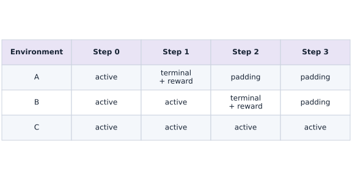
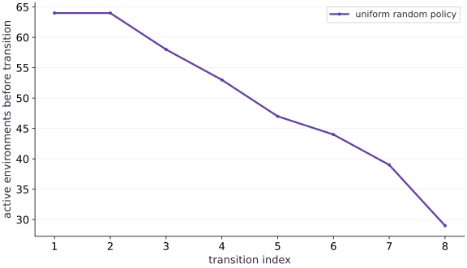

# Batch environments and scan rollouts

Phase 12: Reinforcement learning · about 85 minutes · CPU

## What you will be able to do

- Build a scan over vmapped transitions with explicit key ownership.
- Reconstruct episode returns and reward-to-go from padded trajectories.
- Verify the live-transition mask and distinguish batch dimensions from time dimensions.

## The problem

One episode is easy to inspect, but an agent needs many experiences. How do we collect a batch without mixing time, environments or random streams? We will turn the previous transition into a fixed-shape rollout and prove that its padded rows cannot become training evidence.

## The idea

Batched rollouts put independent environments on one axis and time on another. Some environments finish earlier, so masks describe which transitions remain meaningful while arrays keep fixed shapes.

## Keep the array shape fixed while activity changes

Draw one environment per row and time across columns. Mark the transition that terminates an episode, then mark later padding separately. The terminal transition can still earn reward; masking it out too early loses part of the episode.

Carry the next state and activity information explicitly. If the implementation resets finished environments, distinguish that contract from absorbing padding instead of mixing them in one explanation.

The active-count curve decreases while the tensor shape stays fixed. It measures active environments, not shrinking allocation. Verify one environment independently, then permute the batch to check that unrelated trajectories stay independent.

### A terminal transition still counts

**Predict:** Should every cell after the first done flag be treated identically to the transition that caused done?



*Conceptual / analytic teaching diagram; not a recorded benchmark.*

Each row is one environment. A terminating transition can still earn reward; later cells are padding under this absorbing-state contract. Tensor length stays fixed while activity changes. This is a conceptual rollout example, not an auto-reset implementation.

### Pause and reason

Should every cell after the first done flag be treated identically to the transition that caused done?

<details><summary>Compare your reasoning</summary>

No. The terminating transition can contain valid reward and learning information. Later padding follows the declared terminal policy and should not invent extra transitions.

</details>

## Give each axis one meaning

For $T=8$ and $B=64$, the reward array has shape $(8,64)$. Summing axis zero gives one return per episode. Summing axis one gives total reward at each time index across the batch, a different statistic. vmap maps reset and step over environments; scan threads the complete batch of states through time. The carry has the same structure, shapes and dtypes at every iteration.

## Split randomness where ownership changes

First split a reset key from an action key. Split reset keys across the $B$ environments. Split action keys across the $T$ time steps, then across environments. A scalar reset key broadcast to all environments would create correlated starts. An action key reused at every step would replay draws. Deterministic transitions do not need an extra key, so their signature stays simple.

## Store the behavior policy before changing it

Each position has a policy logit $\theta_s$. Applying the sigmoid gives the probability of moving right; the left probability is its complement. A sampled action is discrete, so we will not differentiate through action sampling. Instead, we store its log probability under the behavior policy. Stable log-sigmoid avoids taking a logarithm of a probability rounded to zero.

$$
\pi_\theta(1\mid s)=\sigma(\theta_s),\qquad \log\pi_\theta(a\mid s)=a\log\sigma(\theta_s)+(1-a)\log\sigma(-\theta_s)
$$

## A final transition is still a learning example

The active mask is computed from the state before step. Therefore the action that reaches the goal is active and retains its reward. Only subsequent rows are padding. Masking with the next state would delete the successful action itself. We store the final observation in the returned state and do not replace it with a fresh start. This collector handles one finite episode per environment, not an endless auto-reset stream.

## Credit each action with rewards that follow it

Reward-to-go sums rewards from the current time onward. For rewards $(-0.01,-0.01,1,0)$, targets are $(0.98,0.99,1,0)$. The first action can influence all later rewards; the last successful action is credited with the goal reward only. We reverse the time axis, take a cumulative sum, and reverse it back. There is no value bootstrap here because these are complete finite-horizon episodes.

$$
G_{t,b}=\sum_{u=t}^{T-1}r_{u,b}
$$

## Reuse the verified environment

Create main.py with this block. Run python3 main.py in the course CPU environment.

```python
"""Finite-horizon tabular policy training. CPU teaching environment, not a benchmark."""
from functools import partial
from typing import NamedTuple
import jax
import jax.numpy as jnp
import numpy as np


class State(NamedTuple):
    position: jax.Array
    elapsed: jax.Array
    done: jax.Array


def reset(key):
    """Start uniformly at position 0 or 1; goal is position 3."""
    return State(jax.random.randint(key, (), 0, 2), jnp.int32(0), jnp.bool_(False))


def step(state, action, horizon=8):
    """Action 0: left, 1: right. Caller supplies binary action and positive horizon.

    Returns next state, reward, termination event, truncation event. Finished
    states absorb without more rewards/events. No implicit reset or lost final observation.
    """
    active = ~state.done
    proposed = jnp.clip(state.position + 2 * action - 1, 0, 3)
    position = jnp.where(active, proposed, state.position)
    elapsed = state.elapsed + active.astype(jnp.int32)
    terminated = active & (position == 3)
    truncated = active & ~terminated & (elapsed >= horizon)
    reward = jnp.where(active, jnp.where(terminated, 1., -.01), 0.)
    return State(position, elapsed, state.done | terminated | truncated), reward, terminated, truncated
```

Keep the state and ending contract identical to the previous lesson.

## Collect a batch and compute targets

Append this block to main.py. Run python3 main.py in the course CPU environment.

```python
def log_probability(theta, observations, actions):
    logits = theta[jnp.minimum(observations, 2)]
    return jnp.where(actions == 1, jax.nn.log_sigmoid(logits), jax.nn.log_sigmoid(-logits))


@partial(jax.jit, static_argnames=('batch_size', 'horizon'))
def rollout(theta, key, batch_size=256, horizon=8):
    reset_key, action_key = jax.random.split(key)
    states = jax.vmap(reset)(jax.random.split(reset_key, batch_size))
    time_keys = jax.random.split(action_key, horizon)
    def body(states, time_key):
        observations = states.position
        keys = jax.random.split(time_key, batch_size)
        probabilities = jax.nn.sigmoid(theta[jnp.minimum(observations, 2)])
        actions = jax.vmap(jax.random.bernoulli)(keys, probabilities).astype(jnp.int32)
        next_states, rewards, terminated, truncated = jax.vmap(
            lambda s, a: step(s, a, horizon))(states, actions)
        record = dict(observation=observations, action=actions, reward=rewards,
                      active=~states.done, terminated=terminated, truncated=truncated,
                      old_logp=log_probability(theta, observations, actions))
        return next_states, record
    final, records = jax.lax.scan(body, states, time_keys)
    return final, records


def returns_to_go(rewards):
    """Undiscounted finite-episode objective; rewards after done are already zero."""
    return jnp.cumsum(rewards[::-1], axis=0)[::-1]
```

scan emits time-major arrays; vmap keeps environments independent within each time step.

## Check shapes and episode boundaries

Append this block to main.py. Run python3 main.py in the course CPU environment.

```python
theta = jnp.zeros(3)
final, records = rollout(theta, jax.random.key(5), batch_size=64, horizon=8)
assert records['reward'].shape == (8, 64)
assert bool(final.done.all())
assert bool(jnp.all(jnp.sum(records['terminated'] | records['truncated'], axis=0) == 1))
assert bool(jnp.all(jnp.where(records['active'], 0., records['reward']) == 0.))
episode_returns = records['reward'].sum(axis=0)
print('return mean:', float(episode_returns.mean()))
print('active environments by transition:', records['active'].sum(axis=1))
```

Exactly one ending event and zero padded rewards are stronger checks than a plausible mean return.

## Run the example

```python
"""Finite-horizon tabular policy training. CPU teaching environment, not a benchmark."""
from functools import partial
from typing import NamedTuple
import jax
import jax.numpy as jnp
import numpy as np


class State(NamedTuple):
    position: jax.Array
    elapsed: jax.Array
    done: jax.Array


def reset(key):
    """Start uniformly at position 0 or 1; goal is position 3."""
    return State(jax.random.randint(key, (), 0, 2), jnp.int32(0), jnp.bool_(False))


def step(state, action, horizon=8):
    """Action 0: left, 1: right. Caller supplies binary action and positive horizon.

    Returns next state, reward, termination event, truncation event. Finished
    states absorb without more rewards/events. No implicit reset or lost final observation.
    """
    active = ~state.done
    proposed = jnp.clip(state.position + 2 * action - 1, 0, 3)
    position = jnp.where(active, proposed, state.position)
    elapsed = state.elapsed + active.astype(jnp.int32)
    terminated = active & (position == 3)
    truncated = active & ~terminated & (elapsed >= horizon)
    reward = jnp.where(active, jnp.where(terminated, 1., -.01), 0.)
    return State(position, elapsed, state.done | terminated | truncated), reward, terminated, truncated

def log_probability(theta, observations, actions):
    logits = theta[jnp.minimum(observations, 2)]
    return jnp.where(actions == 1, jax.nn.log_sigmoid(logits), jax.nn.log_sigmoid(-logits))


@partial(jax.jit, static_argnames=('batch_size', 'horizon'))
def rollout(theta, key, batch_size=256, horizon=8):
    reset_key, action_key = jax.random.split(key)
    states = jax.vmap(reset)(jax.random.split(reset_key, batch_size))
    time_keys = jax.random.split(action_key, horizon)
    def body(states, time_key):
        observations = states.position
        keys = jax.random.split(time_key, batch_size)
        probabilities = jax.nn.sigmoid(theta[jnp.minimum(observations, 2)])
        actions = jax.vmap(jax.random.bernoulli)(keys, probabilities).astype(jnp.int32)
        next_states, rewards, terminated, truncated = jax.vmap(
            lambda s, a: step(s, a, horizon))(states, actions)
        record = dict(observation=observations, action=actions, reward=rewards,
                      active=~states.done, terminated=terminated, truncated=truncated,
                      old_logp=log_probability(theta, observations, actions))
        return next_states, record
    final, records = jax.lax.scan(body, states, time_keys)
    return final, records


def returns_to_go(rewards):
    """Undiscounted finite-episode objective; rewards after done are already zero."""
    return jnp.cumsum(rewards[::-1], axis=0)[::-1]

theta = jnp.zeros(3)
final, records = rollout(theta, jax.random.key(5), batch_size=64, horizon=8)
assert records['reward'].shape == (8, 64)
assert bool(final.done.all())
assert bool(jnp.all(jnp.sum(records['terminated'] | records['truncated'], axis=0) == 1))
assert bool(jnp.all(jnp.where(records['active'], 0., records['reward']) == 0.))
episode_returns = records['reward'].sum(axis=0)
print('return mean:', float(episode_returns.mean()))
print('active environments by transition:', records['active'].sum(axis=1))
```

Expected: The trajectory has the stated time and environment axes, exactly one ending event per episode, and zero reward on every padded row.

## The live batch shrinks while the array shape stays fixed

**Predict:** Should every row contain the same number of active environments?



**Recorded CPU computation**

### Read the figure

The horizontal axis is the transition index; the vertical axis counts environments active before that transition. The first value is $64$. The count never rises because we do not reset inside a rollout. Decreases show episodes reaching the goal; episodes still active on the final row will either finish or time out on that row. In the recorded seed, the first two counts are both $64$: even the nearer starting position needs two actions to reach the goal. The third count is $58$, and the last is $29$. The unchanged first pair is therefore expected, not a stalled loop.

### Connect it to the computation

This curve is not reward or policy quality: a fast-ending policy could succeed, fail or exploit a termination bug in a different task. Here the transition tests establish that early endings are goals. The fixed $(8,64)$ reward array retains later rows, but their active flags are false. Changing the seed can move individual counts while preserving these invariants.

```python
visual_data = {'kind':'line','x':list(range(1,9)),'xlabel':'transition index','ylabel':'active environments before transition','series':[{'label':'uniform random policy','y':records['active'].sum(1).tolist()}]}
```

## Recorded reference execution

CPU run: 2026-10-06T22:00:53.582933+00:00. JAX 0.9.2.

```text
return mean: 0.5848437547683716
active environments by transition: [64 64 58 53 47 44 39 29]
return mean: 0.5848437547683716
active environments by transition: [64 64 58 53 47 44 39 29]
reward-to-go: [0.98 0.99 1.   0.  ]
PASS: rl-02

```

## Replay the entire collector

**Predict before running:** Does replay require restoring only the environment state?

```python
again = rollout(theta, jax.random.key(5), 64, 8)[1]
for name in records:
    assert jnp.array_equal(records[name], again[name])
changed = rollout(theta, jax.random.key(6), 64, 8)[1]
assert not jnp.array_equal(records['action'], changed['action'])
```

**Expected:** Every field replays for the same configuration and key; another key changes actions.

The random stream is part of the experiment state. Replay in this environment is not a promise of identical outputs across arbitrary library versions or devices.

## Reward-to-go by hand

**Predict before running:** Predict the four targets for rewards $(-0.01,-0.01,1,0)$.

```python
r = jnp.array([[-.01],[-.01],[1.],[0.]])
g = returns_to_go(r)
assert jnp.allclose(g[:,0], jnp.array([.98,.99,1.,0.]))
print('reward-to-go:', g[:,0])
```

**Expected:** The targets are $(0.98,0.99,1,0)$.

Zero padded rewards preserve the finite-episode sum, while the active mask removes meaningless log probabilities.

## Make it yours

Change the batch to $7$ environments and the horizon to $5$. Verify array shapes, one ending event per episode and zero rewards after finishing.

<details><summary>Reference solution</summary>

```python
final7, r7 = rollout(theta, jax.random.key(17), 7, 5)
assert r7['reward'].shape == (5,7)
assert bool(final7.done.all())
assert jnp.array_equal((r7['terminated'] | r7['truncated']).sum(0), jnp.ones(7))
assert bool(jnp.all(jnp.where(r7['active'],0.,r7['reward']) == 0.))
```

</details>

## Catch a shifted mask

**Transfer / diagnosis**

Construct a two-action success from position $1$. Compare masking by the pre-transition done flag with masking by the post-transition done flag.

<details><summary>Hint</summary>

Record the mask before calling step; the successful transition still belongs to the episode.

</details>

<details><summary>Reference solution and reasoning</summary>

```python
s = State(jnp.int32(1),jnp.int32(0),jnp.bool_(False))
correct, broken = 0., 0.
for a in [1,1]:
    active = ~s.done
    s, reward, _, _ = step(s,jnp.int32(a))
    correct += float(reward*active)
    broken += float(reward*(~s.done))
assert abs(correct-.99) < 1e-6
assert abs(broken+.01) < 1e-6
```

The broken mask removes the action responsible for success, leaving only a cost.

</details>

## Check a deterministic policy limit

**Transfer / diagnosis**

Use very large positive logits and verify that every episode follows a shortest route.

<details><summary>Hint</summary>

The two start states need different numbers of actions. Compare each return against its own initial position.

</details>

<details><summary>Reference solution and reasoning</summary>

```python
_, easy = rollout(jnp.full(3,100.),jax.random.key(42),23,8)
expected = jnp.where(easy['observation'][0] == 0,.98,.99)
assert jnp.allclose(easy['reward'].sum(0),expected,atol=1e-6)
assert jnp.array_equal(easy['active'].sum(0),3-easy['observation'][0])
```

The expected return is calculated from the initial position rather than copied from the collector.

</details>

## Check your understanding

Which axis should be summed to obtain one return per environment from a time-major reward array?

1. The time axis
2. The environment axis
3. Both axes before averaging by live transitions

<details><summary>Answer and explanation</summary>

The time axis

Summing over time leaves one scalar for each episode. Averaging these episode returns gives the finite-episode performance objective.

</details>

## Diagnose the result

If reported return changes merely by padding an already finished trajectory, inspect reward masking. If success disappears from the objective, check whether active was recorded before step. If trajectories match too often, inspect broadcast or reused keys before increasing the batch.

## Carry forward

- vmap handles independent environments; scan handles the dependent time sequence.
- Store behavior log probabilities and live-transition masks with rewards.

## Keep your evidence

Keep reconstructed trajectories, randomized keys, padding masks and independent return calculations. Show how a changed key affects interaction without changing the environment rules.

Keep predictions, modified code, observed results, and reasoning. A checkpoint alone does not demonstrate the exercise.

## Primary references

- [JAX: explicit pseudorandom keys](https://docs.jax.dev/en/latest/random-numbers.html)
- [JAX scan: fixed-shape carry](https://docs.jax.dev/en/latest/_autosummary/jax.lax.scan.html)
- [Schulman et al.: Proximal Policy Optimization Algorithms](https://arxiv.org/abs/1707.06347)
- [Gymnasium: termination and truncation](https://gymnasium.farama.org/tutorials/gymnasium_basics/handling_time_limits/)

