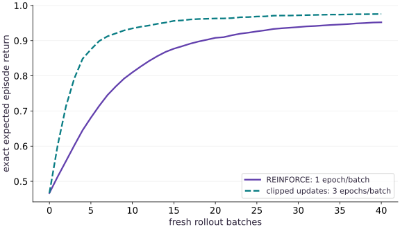

# Policy gradients and PPO

Phase 12: Reinforcement learning · about 110 minutes · CPU

## What you will be able to do

- Derive and implement the score-function policy gradient for complete episodes.
- Train with fresh stochastic rollouts and a fixed behavior policy per PPO batch.
- Explain both signs of the clipping objective and verify improvement against exact expected return.

## The problem

The collector produces experiences, but which parameter change makes useful actions more likely? We will train an actual stochastic policy from freshly sampled episodes, first with REINFORCE and then with repeated clipped policy updates. An exact calculation in this tiny environment will tell us whether the policy improved, independently of its noisy training rewards.

## The idea

A policy gradient increases the likelihood of actions with favorable estimated advantage. PPO compares a current policy with the rollout-time policy and clips part of the surrogate objective. The sign of the advantage determines which changes the clipping discourages.

## The clipped objective depends on the advantage sign

Let $r$ be the current-to-old action-probability ratio. With positive advantage, making $r$ much larger than the upper clipping threshold stops improving the clipped surrogate. With negative advantage, moving below the lower threshold has the corresponding saturation.

This does not impose a hard bound on the new policy probabilities. Shared parameters, multiple updates and other loss terms can still move the policy beyond the threshold. Inspect the ratio distribution and KL behavior rather than claiming clipping guarantees a trust region.

Keep old probabilities and advantage estimates fixed for the intended inner updates. The training-return curve reports the particular sampled runs; use the same evaluator and multiple seeds before concluding one procedure reliably performs better.

### Pause and reason

Is a ratio outside the clipping interval proof that PPO was implemented incorrectly?

<details><summary>Compare your reasoning</summary>

No. Clipping modifies the objective incentive, not a hard constraint on ratios. Check the actual surrogate calculation, fixed rollout quantities and update behavior.

</details>

## The derivative does not pass through the sampled action

Let $\theta$ denote the three position logits. We maximize expected episode return $J(\theta)$. The score-function identity gives the expectation below. Rewards before an action do not depend on that action, so reward-to-go is a valid credit signal. Our baseline is zero; we do not fit a critic or use generalized advantage estimation. We freeze sampled actions and targets with stop_gradient. Trying to differentiate through Bernoulli sampling is a different, inappropriate estimator for this exercise.

$$
\nabla J(\theta)=\mathbb{E}\!\left[\sum_t \nabla_\theta\log\pi_\theta(a_t\mid s_t)G_t\right]
$$

## Normalize by the object you promised to optimize

The objective is return per episode. We sum live action terms and divide by the number of episodes $B$, not the number of live transitions. Dividing by live transitions changes the batch-dependent scale as the policy learns to finish sooner. Each REINFORCE update uses a fresh on-policy rollout once. The learning rate is $0.5$ for this tabular fixture; that value is not a recommendation for neural agents.

## Freeze the policy that collected the batch

For PPO, store old log probabilities at collection time and keep them fixed through all $3$ optimization epochs. The ratio is computed by subtracting log probabilities before exponentiating. At the first epoch the ratio is $1$. It changes as the candidate policy changes; overwriting old probabilities each epoch would erase the reference point and defeat clipping. Our target $\hat A_t$ is reward-to-go with zero baseline, a noisy but valid first-epoch policy-gradient estimator.

$$
\rho_t(\theta)=\exp\!\left(\log\pi_\theta(a_t\mid s_t)-\log\pi_{\mathrm{old}}(a_t\mid s_t)\right)
$$

## The minimum matters for negative advantages

We maximize the minimum of the ordinary ratio-weighted target and its clipped alternative, with $\epsilon=0.2$. For a positive target $1$ and ratio $1.4$, the clipped objective is $1.2$: extra probability gets no extra reward. For a negative target $-1$ and ratio $0.6$, it is $-0.8$: reducing probability further gets no extra reward. The opposite directions remain penalized. Clipping a ratio inside every term without the minimum is not the same objective.

$$
L^{\mathrm{clip}}(\theta)=\frac1B\sum_{b,t}\min\!\left(\rho_{t,b}\hat A_{t,b},\operatorname{clip}(\rho_{t,b},1-\epsilon,1+\epsilon)\hat A_{t,b}\right)
$$

## Clipping is not a guaranteed trust region

The surrogate has flat regions for particular sampled actions; it does not constrain every probability or guarantee improvement in true return. Several parameters share data in a neural model, unseen states are absent, and multiple gradient steps can move the policy substantially. Our complete learning loop repeatedly collects fresh episodes and optimizes the frozen batch. It is a small clipped policy-gradient agent, not a production PPO stack: no critic, entropy bonus, observation normalization or minibatch scheduler is included.

## Calculate expected return without sampling

This environment has only three unfinished positions, so dynamic programming can average left and right outcomes exactly for each remaining step budget. Start from zero remaining reward, back up the transition expectation $8$ times, and average the values at initial positions $0$ and $1$. This evaluator does not use rollout samples. An always-left policy earns $-0.08$, the uniform policy earns $0.466875$, and always-right earns $0.985$. It is an unusually strong diagnostic available in a tiny fixture, not a scalable evaluator for arbitrary environments.

## Reuse the environment and collector

Create main.py with this block. Run python3 main.py in the course CPU environment.

```python
"""Finite-horizon tabular policy training. CPU teaching environment, not a benchmark."""
from functools import partial
from typing import NamedTuple
import jax
import jax.numpy as jnp
import numpy as np


class State(NamedTuple):
    position: jax.Array
    elapsed: jax.Array
    done: jax.Array


def reset(key):
    """Start uniformly at position 0 or 1; goal is position 3."""
    return State(jax.random.randint(key, (), 0, 2), jnp.int32(0), jnp.bool_(False))


def step(state, action, horizon=8):
    """Action 0: left, 1: right. Caller supplies binary action and positive horizon.

    Returns next state, reward, termination event, truncation event. Finished
    states absorb without more rewards/events. No implicit reset or lost final observation.
    """
    active = ~state.done
    proposed = jnp.clip(state.position + 2 * action - 1, 0, 3)
    position = jnp.where(active, proposed, state.position)
    elapsed = state.elapsed + active.astype(jnp.int32)
    terminated = active & (position == 3)
    truncated = active & ~terminated & (elapsed >= horizon)
    reward = jnp.where(active, jnp.where(terminated, 1., -.01), 0.)
    return State(position, elapsed, state.done | terminated | truncated), reward, terminated, truncated

def log_probability(theta, observations, actions):
    logits = theta[jnp.minimum(observations, 2)]
    return jnp.where(actions == 1, jax.nn.log_sigmoid(logits), jax.nn.log_sigmoid(-logits))


@partial(jax.jit, static_argnames=('batch_size', 'horizon'))
def rollout(theta, key, batch_size=256, horizon=8):
    reset_key, action_key = jax.random.split(key)
    states = jax.vmap(reset)(jax.random.split(reset_key, batch_size))
    time_keys = jax.random.split(action_key, horizon)
    def body(states, time_key):
        observations = states.position
        keys = jax.random.split(time_key, batch_size)
        probabilities = jax.nn.sigmoid(theta[jnp.minimum(observations, 2)])
        actions = jax.vmap(jax.random.bernoulli)(keys, probabilities).astype(jnp.int32)
        next_states, rewards, terminated, truncated = jax.vmap(
            lambda s, a: step(s, a, horizon))(states, actions)
        record = dict(observation=observations, action=actions, reward=rewards,
                      active=~states.done, terminated=terminated, truncated=truncated,
                      old_logp=log_probability(theta, observations, actions))
        return next_states, record
    final, records = jax.lax.scan(body, states, time_keys)
    return final, records


def returns_to_go(rewards):
    """Undiscounted finite-episode objective; rewards after done are already zero."""
    return jnp.cumsum(rewards[::-1], axis=0)[::-1]
```

These functions generate genuine trajectories. The policy update will not differentiate through their sampled actions.

## Add objectives and the repeated training loop

Append this block to main.py. Run python3 main.py in the course CPU environment.

```python
def policy_loss(theta, records, method='ppo', clip=.2):
    """Normalize by episodes, not live transitions. Freeze behavior data/returns."""
    advantage = jax.lax.stop_gradient(returns_to_go(records['reward']))
    old_logp = jax.lax.stop_gradient(records['old_logp'])
    new_logp = log_probability(theta, records['observation'], records['action'])
    if method == 'reinforce':
        terms = new_logp * advantage
    elif method == 'ppo':
        ratio = jnp.exp(new_logp - old_logp)
        terms = jnp.minimum(ratio * advantage, jnp.clip(ratio, 1-clip, 1+clip) * advantage)
    else:
        raise ValueError('method must be reinforce or ppo')
    return -jnp.sum(jnp.where(records['active'], terms, 0.)) / records['reward'].shape[1]


@partial(jax.jit, static_argnames=('horizon',))
def exact_return(theta, horizon=8):
    """Dynamic programming over states, independent of sampled rollouts."""
    p = jax.nn.sigmoid(theta)
    states = jnp.arange(3)
    left = jnp.maximum(states-1, 0)
    right = states+1
    def backup(_, values):
        q_left = -.01 + values[left]
        q_right = jnp.where(right == 3, 1., -.01 + values[right])
        return jnp.concatenate(((1-p)*q_left+p*q_right, jnp.zeros(1)))
    values = jax.lax.fori_loop(0, horizon, backup, jnp.zeros(4))
    return jnp.mean(values[:2])


@partial(jax.jit, static_argnames=('updates', 'batch_size', 'horizon', 'method', 'epochs'))
def _train(seed, updates, batch_size, horizon, method, epochs, learning_rate):
    key = jax.random.key(seed)
    theta = jnp.zeros(3)
    def update(carry, _):
        theta, key = carry
        key, sample_key = jax.random.split(key)
        _, records = rollout(theta, sample_key, batch_size, horizon)
        def epoch(_, candidate):
            grad = jax.grad(policy_loss)(candidate, records, method)
            return candidate - learning_rate * grad
        theta = jax.lax.fori_loop(0, epochs, epoch, theta)
        return (theta, key), exact_return(theta, horizon)
    (theta, _), history = jax.lax.scan(update, (theta, key), None, length=updates)
    return theta, jnp.concatenate((exact_return(jnp.zeros(3), horizon)[None], history))


def train(seed=0, updates=40, batch_size=256, horizon=8, method='ppo', epochs=3, learning_rate=.5):
    if updates < 1 or batch_size < 1 or horizon < 1 or epochs < 1 or learning_rate <= 0:
        raise ValueError('positive updates, batch_size, horizon, epochs and learning_rate required')
    if method not in ('ppo', 'reinforce'):
        raise ValueError('unknown method')
    if method == 'reinforce' and epochs != 1:
        raise ValueError('REINFORCE uses one update per fresh on-policy rollout')
    return _train(seed, updates, batch_size, horizon, method, epochs, learning_rate)
```

Keep a frozen rollout per update, then collect again using a fresh key. The exact evaluator is separate from the training targets.

## Train and compare to a derivative reference

Append this block to main.py. Run python3 main.py in the course CPU environment.

```python
theta_pg, history_pg = train(seed=0, method='reinforce', epochs=1)
theta_ppo, history_ppo = train(seed=0, method='ppo', epochs=3)
assert history_pg[-1] > .9 and history_ppo[-1] > .9
assert jnp.allclose(history_pg[0], .466875, atol=1e-6)
print('REINFORCE initial/final exact return:', history_pg[0], history_pg[-1])
print('PPO initial/final exact return:', history_ppo[0], history_ppo[-1])
# Compare a derivative of exact expectation with central differences.
z = jnp.array([-.2, .3, .7]); eps = 1e-3
d = jnp.array([0., 1., 0.])
fd = (exact_return(z+eps*d)-exact_return(z-eps*d))/(2*eps)
assert jnp.allclose(fd, jax.grad(exact_return)(z)[1], atol=1e-4)

```

The seed-specific return is measured after actual interaction and updates, while the derivative check uses deterministic expectations.

## Run the example

```python
"""Finite-horizon tabular policy training. CPU teaching environment, not a benchmark."""
from functools import partial
from typing import NamedTuple
import jax
import jax.numpy as jnp
import numpy as np


class State(NamedTuple):
    position: jax.Array
    elapsed: jax.Array
    done: jax.Array


def reset(key):
    """Start uniformly at position 0 or 1; goal is position 3."""
    return State(jax.random.randint(key, (), 0, 2), jnp.int32(0), jnp.bool_(False))


def step(state, action, horizon=8):
    """Action 0: left, 1: right. Caller supplies binary action and positive horizon.

    Returns next state, reward, termination event, truncation event. Finished
    states absorb without more rewards/events. No implicit reset or lost final observation.
    """
    active = ~state.done
    proposed = jnp.clip(state.position + 2 * action - 1, 0, 3)
    position = jnp.where(active, proposed, state.position)
    elapsed = state.elapsed + active.astype(jnp.int32)
    terminated = active & (position == 3)
    truncated = active & ~terminated & (elapsed >= horizon)
    reward = jnp.where(active, jnp.where(terminated, 1., -.01), 0.)
    return State(position, elapsed, state.done | terminated | truncated), reward, terminated, truncated

def log_probability(theta, observations, actions):
    logits = theta[jnp.minimum(observations, 2)]
    return jnp.where(actions == 1, jax.nn.log_sigmoid(logits), jax.nn.log_sigmoid(-logits))


@partial(jax.jit, static_argnames=('batch_size', 'horizon'))
def rollout(theta, key, batch_size=256, horizon=8):
    reset_key, action_key = jax.random.split(key)
    states = jax.vmap(reset)(jax.random.split(reset_key, batch_size))
    time_keys = jax.random.split(action_key, horizon)
    def body(states, time_key):
        observations = states.position
        keys = jax.random.split(time_key, batch_size)
        probabilities = jax.nn.sigmoid(theta[jnp.minimum(observations, 2)])
        actions = jax.vmap(jax.random.bernoulli)(keys, probabilities).astype(jnp.int32)
        next_states, rewards, terminated, truncated = jax.vmap(
            lambda s, a: step(s, a, horizon))(states, actions)
        record = dict(observation=observations, action=actions, reward=rewards,
                      active=~states.done, terminated=terminated, truncated=truncated,
                      old_logp=log_probability(theta, observations, actions))
        return next_states, record
    final, records = jax.lax.scan(body, states, time_keys)
    return final, records


def returns_to_go(rewards):
    """Undiscounted finite-episode objective; rewards after done are already zero."""
    return jnp.cumsum(rewards[::-1], axis=0)[::-1]

def policy_loss(theta, records, method='ppo', clip=.2):
    """Normalize by episodes, not live transitions. Freeze behavior data/returns."""
    advantage = jax.lax.stop_gradient(returns_to_go(records['reward']))
    old_logp = jax.lax.stop_gradient(records['old_logp'])
    new_logp = log_probability(theta, records['observation'], records['action'])
    if method == 'reinforce':
        terms = new_logp * advantage
    elif method == 'ppo':
        ratio = jnp.exp(new_logp - old_logp)
        terms = jnp.minimum(ratio * advantage, jnp.clip(ratio, 1-clip, 1+clip) * advantage)
    else:
        raise ValueError('method must be reinforce or ppo')
    return -jnp.sum(jnp.where(records['active'], terms, 0.)) / records['reward'].shape[1]


@partial(jax.jit, static_argnames=('horizon',))
def exact_return(theta, horizon=8):
    """Dynamic programming over states, independent of sampled rollouts."""
    p = jax.nn.sigmoid(theta)
    states = jnp.arange(3)
    left = jnp.maximum(states-1, 0)
    right = states+1
    def backup(_, values):
        q_left = -.01 + values[left]
        q_right = jnp.where(right == 3, 1., -.01 + values[right])
        return jnp.concatenate(((1-p)*q_left+p*q_right, jnp.zeros(1)))
    values = jax.lax.fori_loop(0, horizon, backup, jnp.zeros(4))
    return jnp.mean(values[:2])


@partial(jax.jit, static_argnames=('updates', 'batch_size', 'horizon', 'method', 'epochs'))
def _train(seed, updates, batch_size, horizon, method, epochs, learning_rate):
    key = jax.random.key(seed)
    theta = jnp.zeros(3)
    def update(carry, _):
        theta, key = carry
        key, sample_key = jax.random.split(key)
        _, records = rollout(theta, sample_key, batch_size, horizon)
        def epoch(_, candidate):
            grad = jax.grad(policy_loss)(candidate, records, method)
            return candidate - learning_rate * grad
        theta = jax.lax.fori_loop(0, epochs, epoch, theta)
        return (theta, key), exact_return(theta, horizon)
    (theta, _), history = jax.lax.scan(update, (theta, key), None, length=updates)
    return theta, jnp.concatenate((exact_return(jnp.zeros(3), horizon)[None], history))


def train(seed=0, updates=40, batch_size=256, horizon=8, method='ppo', epochs=3, learning_rate=.5):
    if updates < 1 or batch_size < 1 or horizon < 1 or epochs < 1 or learning_rate <= 0:
        raise ValueError('positive updates, batch_size, horizon, epochs and learning_rate required')
    if method not in ('ppo', 'reinforce'):
        raise ValueError('unknown method')
    if method == 'reinforce' and epochs != 1:
        raise ValueError('REINFORCE uses one update per fresh on-policy rollout')
    return _train(seed, updates, batch_size, horizon, method, epochs, learning_rate)

theta_pg, history_pg = train(seed=0, method='reinforce', epochs=1)
theta_ppo, history_ppo = train(seed=0, method='ppo', epochs=3)
assert history_pg[-1] > .9 and history_ppo[-1] > .9
assert jnp.allclose(history_pg[0], .466875, atol=1e-6)
print('REINFORCE initial/final exact return:', history_pg[0], history_pg[-1])
print('PPO initial/final exact return:', history_ppo[0], history_ppo[-1])
# Compare a derivative of exact expectation with central differences.
z = jnp.array([-.2, .3, .7]); eps = 1e-3
d = jnp.array([0., 1., 0.])
fd = (exact_return(z+eps*d)-exact_return(z-eps*d))/(2*eps)
assert jnp.allclose(fd, jax.grad(exact_return)(z)[1], atol=1e-4)

```

Expected: The reference seed improves exact expected return from $0.466875$ to approximately $0.9522$ with REINFORCE and $0.9758$ with the clipped updates after $40$ rollout batches.

## Two sampled training procedures, one exact evaluator

**Predict:** Must the exact return rise at every update?



**Recorded CPU computation**

### Read the figure

The horizontal axis counts freshly collected rollout batches; zero is the untrained policy. Each later point is the exact expected finite-horizon return of the updated policy. Both lines begin at $0.466875$. In this seed the REINFORCE line ends near $0.9522$, while the clipped-update line ends near $0.9758$. The curves measure return, not the optimization surrogate.

### Connect it to the computation

The clipped method takes three gradient steps per collection, while REINFORCE takes one. This is therefore not a compute-matched algorithm comparison. The always-right ceiling in this environment is $0.985$; approaching it shows that the policy has learned this corridor task. Small non-monotonic changes are compatible with stochastic updates, and one seed cannot establish which method is better on other tasks.

```python
visual_data = {'kind':'line','x':list(range(41)),'xlabel':'fresh rollout batches','ylabel':'exact expected episode return','series':[{'label':'REINFORCE: 1 epoch/batch','y':history_pg.tolist()},{'label':'clipped updates: 3 epochs/batch','y':history_ppo.tolist()}]}
```

## Recorded reference execution

CPU run: 2026-10-06T15:42:07.050693+00:00. JAX 0.9.2.

```text
REINFORCE initial/final exact return: 0.46687505 0.9521624
PPO initial/final exact return: 0.46687505 0.97578394
REINFORCE initial/final exact return: 0.46687505 0.9521624
PPO initial/final exact return: 0.46687505 0.97578394
positive / negative targets: [0.6 1.  1.2] [-0.8 -1.  -1.4]
sampled / exact gradient: [0.12067959 0.21948992 0.13326262] [0.12001554 0.21822323 0.13327113]
changed seed final exact return: 0.9501661
PASS: rl-03

```

## Check clipping on both signs

**Predict before running:** For which ratios does the clipped objective become flat?

```python
ratio = jnp.array([.6,1.,1.4])
positive = jnp.minimum(ratio,jnp.clip(ratio,.8,1.2))
negative = jnp.minimum(-ratio,-jnp.clip(ratio,.8,1.2))
assert jnp.allclose(positive,jnp.array([.6,1.,1.2]))
assert jnp.allclose(negative,jnp.array([-.8,-1.,-1.4]))
print('positive / negative targets:', positive, negative)
```

**Expected:** Positive and negative targets flatten on opposite sides.

The minimum prevents an update from gaining unlimited credit for pushing a sampled action in an already beneficial direction.

## Compare sampled and exact gradients

**Predict before running:** Will a large batch reproduce the exact gradient perfectly?

```python
_, batch = rollout(z,jax.random.key(902),32768,8)
sampled = -jax.grad(policy_loss)(z,batch,'reinforce')
exact = jax.grad(exact_return)(z)
assert jnp.allclose(sampled,exact,atol=.012,rtol=.04)
print('sampled / exact gradient:', sampled, exact)
```

**Expected:** The gradients agree within the declared sampling tolerance, not bit for bit.

The large batch reduces Monte Carlo noise. The exact evaluator and the sampled score-function estimator compute the same objective by different paths.

## Make it yours

Run REINFORCE with a different training seed and retain the initial and final exact return. Verify that the final policy improves on the uniform baseline without requiring every intermediate point to improve.

<details><summary>Reference solution</summary>

```python
other_theta, other_history = train(seed=11,method='reinforce',epochs=1)
assert other_history[-1] > other_history[0] + .35
assert other_history[-1] > .9
assert not jnp.array_equal(other_theta,theta_pg)
print('changed seed final exact return:', other_history[-1])
```

</details>

## Inspect a frozen behavior reference

**Transfer / diagnosis**

Collect at zero logits, then increase all logits to $1$. Verify that stored old log probabilities do not change and that live-action ratios include values on both sides of $1$.

<details><summary>Hint</summary>

Compute new probabilities from changed parameters, leaving the rollout dictionary untouched.

</details>

<details><summary>Reference solution and reasoning</summary>

```python
_, b = rollout(jnp.zeros(3),jax.random.key(77),128,8)
old = b['old_logp'].copy()
newlog = log_probability(jnp.ones(3),b['observation'],b['action'])
ratios = jnp.exp(newlog-old)
assert jnp.array_equal(old,b['old_logp'])
assert float(jnp.min(ratios)) < 1 < float(jnp.max(ratios))
old_grad = jax.grad(lambda lp: policy_loss(jnp.ones(3),dict(b,old_logp=lp)))(old)
assert jnp.all(old_grad == 0)
```

The candidate changes while the behavior policy remains the fixed denominator. A zero derivative through old probabilities enforces that distinction.

</details>

## Change the time budget

**Transfer / diagnosis**

For horizon $2$, compute the always-right expected return before running code. Only one initial position can reach the goal.

<details><summary>Hint</summary>

From position $0$, two moves earn $-0.02$. From position $1$, they earn $0.99$.

</details>

<details><summary>Reference solution and reasoning</summary>

```python
short = exact_return(jnp.full(3,100.),horizon=2)
assert jnp.allclose(short,(-.02+.99)/2,atol=1e-6)
assert short < exact_return(jnp.full(3,100.),horizon=8)
```

Changing the horizon changes the task itself. A lower return need not indicate a broken gradient.

</details>

## Check your understanding

During multiple PPO epochs on one rollout batch, what must remain fixed?

1. Only the current candidate policy
2. Only the clipping threshold; old probabilities can be recomputed from the candidate
3. The collected actions, return targets and behavior-policy log probabilities

<details><summary>Answer and explanation</summary>

The collected actions, return targets and behavior-policy log probabilities

The probability ratio compares the changing candidate with the policy that actually generated the batch. Replacing its denominator destroys that comparison.

</details>

## Diagnose the result

If loss falls while exact return fails to improve, first inspect the sign of the loss, the active mask and the frozen behavior probabilities. A ratio stuck at one on every epoch suggests the old policy was overwritten. If returns improve only on collection samples, evaluate independently before changing the optimizer.

## Carry forward

- A complete policy update alternates new interaction data with optimization.
- Clipping modifies an objective; it does not prove monotonic improvement or constrain every policy probability.

## Keep your evidence

Keep the exact small-state policy-gradient comparison, actual training curves and frozen PPO reference quantities. Diagnose changed clipping signs and distinguish Monte Carlo variation from an incorrect objective.

Keep predictions, modified code, observed results, and reasoning. A checkpoint alone does not demonstrate the exercise.

## Primary references

- [JAX: explicit pseudorandom keys](https://docs.jax.dev/en/latest/random-numbers.html)
- [JAX scan: fixed-shape carry](https://docs.jax.dev/en/latest/_autosummary/jax.lax.scan.html)
- [Schulman et al.: Proximal Policy Optimization Algorithms](https://arxiv.org/abs/1707.06347)
- [Gymnasium: termination and truncation](https://gymnasium.farama.org/tutorials/gymnasium_basics/handling_time_limits/)

