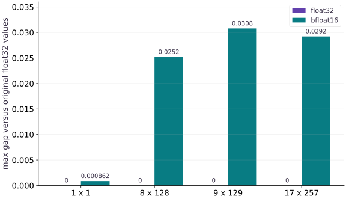

# Iterate with correctness and performance evidence

Phase 13: Pallas kernels · about 120 minutes · CPU

## What you will be able to do

- Build a representative shape/dtype correctness matrix for an actual Pallas pipeline.
- Separate kernel implementation error from input/output precision differences.
- Implement a guarded compile/warmup/synchronized target benchmark.
- Connect profiling, partitioning, tiling and numerical evidence to an optimization decision.

## The problem

A custom kernel is useful only if it stays correct when shapes and dtypes change and improves an actual workload. What evidence is enough to keep an optimization, and what should we do when no target hardware is available? We will build a repeatable audit and an executable target-only measurement protocol.

## The idea

A low-precision kernel can differ from a high-precision calculation because inputs changed representation, arithmetic changed, or the implementation is wrong. Separate these causes with references that answer different questions.

## Use two references to locate a precision gap

First compare the kernel with an independent computation using the same represented inputs. That isolates implementation behavior under the chosen numeric contract. Then compare the represented-input reference with the original high-precision calculation to estimate representation effects.

If the first comparison passes while the second shows a gap, changing indexing is unlikely to fix that gap. Investigate the precision policy and whether downstream quality tolerates it.

The error bars should keep those comparisons separate and state scale, dtype and tolerance. A passed numerical check also says nothing about speed. Keep workload identity, synchronization and target-device measurements with any optimization claim.

### Pause and reason

Which comparison should you inspect before blaming quantization for a wrong output?

<details><summary>Compare your reasoning</summary>

Compare against an independent reference on the same represented inputs. A mismatch there may be an implementation error rather than unavoidable representation error.

</details>

## Choose cases that challenge the contract

The fixtures include a singleton matrix, one exact tile, a small tail and a larger tail. The same frozen random data is tested in float32 and bfloat16. A benchmark-sized divisible matrix alone would miss many boundary bugs. Every implementation must return the original logical shape; padding is internal work, not extra observations in the output.

## Use two references for two different questions

The represented-input oracle promotes the actual stored inputs to float32, computes $2X+Y$, then applies the declared output cast. Kernel agreement with that reference checks implementation correctness. Comparing against the original float32 dataset instead reveals input and output rounding. These differences should not be merged into one unexplained error number or hidden by arbitrarily loose tolerances.

## Make target timing a complete operation

The target protocol compiles separately, warms up five times and synchronizes every measured output. Inputs are already placed on the target before timing. The measured boundary includes logical-shape padding, the Pallas call and cropping, because those are part of this wrapper’s user-visible cost. A kernel-only benchmark would need a different explicit boundary and could not be compared directly with these results.

## Compare a strong baseline with the same contract

The baseline is jitted ordinary JAX with float32 arithmetic and the same final dtype cast. XLA can fuse simple expressions, so the custom kernel may lose. Report every sample, median and ninetieth percentile, plus compilation time and actual device. The percentile is a distribution summary, not the maximum. Repeated samples expose variability but do not erase cache, thermal or system-load effects.

## Relate local kernels to the distributed workload

A kernel optimizes an operation on local arrays; it does not automatically reduce all-reduce or resharding costs. Use a profile to determine whether the workload is limited by local compute, memory movement, input staging or communication. Keep the partitioning decision explicit and verify the same global numerical objective. A faster local operation may have little end-to-end benefit when another part dominates.

## Accept, revise or decline the optimization

Keep the change only when representative correctness and the declared target boundary improve enough to justify maintenance and specialization costs. If performance is unchanged or worse, retain the simpler baseline and record the experiment. If target hardware is unavailable, retain the tested kernel and its runnable target protocol, mark performance unverified, and do not fill the gap with interpret-mode timings. The scale synthesis assessment asks for profiling and partitioning evidence as well as the local kernel audit.

## Keep reference semantics, target mode and benchmark boundary together

Create main.py for the first block, then append each block in order in your course CPU environment.

```python
import jax
import jax.numpy as jnp
import numpy as np
from jax.experimental import pallas as pl
from jax.experimental.pallas import tpu as pltpu

def validate_pair(x,y,block):
    if x.ndim!=2 or x.shape!=y.shape or min(x.shape)<1:
        raise ValueError("inputs must be nonempty matrices with identical shapes")
    if x.dtype!=y.dtype or x.dtype not in (jnp.float32,jnp.bfloat16):
        raise ValueError("matching float32 or bfloat16 inputs required")
    if len(block)!=2 or any(not isinstance(n,int) or n<1 for n in block):
        raise ValueError("two positive integer block dimensions required")

def pad_pair(x,y,block):
    validate_pair(x,y,block)
    m,n=x.shape;bm,bn=block
    padded=((m+bm-1)//bm*bm,(n+bn-1)//bn*bn)
    pads=((0,padded[0]-m),(0,padded[1]-n))
    return jnp.pad(x,pads),jnp.pad(y,pads),padded

def axpy_body(x_ref,y_ref,out_ref):
    result=2.0*x_ref[...].astype(jnp.float32)+y_ref[...].astype(jnp.float32)
    out_ref[...]=result.astype(out_ref.dtype)

def blocked_axpy(x,y,block=(2,4)):
    px,py,padded=pad_pair(x,y,block)
    bm,bn=block
    spec=pl.BlockSpec(block,lambda i,j:(i,j))
    out=pl.pallas_call(axpy_body,
        out_shape=jax.ShapeDtypeStruct(padded,x.dtype),
        grid=(padded[0]//bm,padded[1]//bn),
        in_specs=(spec,spec),out_specs=spec,interpret=True)(px,py)
    return out[:x.shape[0],:x.shape[1]]

def pipelined_axpy(x,y,block=(8,128),buffers=2,no_pipelining=False,mode="simulate"):
    px,py,padded=pad_pair(x,y,block)
    bm,bn=block
    if bm%8 or bn%128:
        raise ValueError("pipeline blocks must be multiples of (8,128)")
    if buffers not in (2,3):
        raise ValueError("this lab supports two or three buffers")
    if mode not in ("simulate","tpu"):
        raise ValueError("mode must explicitly be simulate or tpu")
    if mode=="tpu" and (jax.default_backend()!="tpu" or any(not isinstance(a,jax.core.Tracer) and any(d.platform!="tpu" for d in a.devices()) for a in (x,y))):
        raise RuntimeError("Real TPU inputs/backend required; simulation fallback is disabled")
    spec=pl.BlockSpec(block,lambda i,j:(i,j),pipeline_mode=pl.Buffered(buffer_count=buffers))
    output_spec=pl.BlockSpec(block,lambda i,j:(i,j),pipeline_mode=pl.Buffered(buffer_count=2))
    def outer(x_hbm,y_hbm,out_hbm):
        pltpu.emit_pipeline(axpy_body,grid=(padded[0]//bm,padded[1]//bn),
            in_specs=(spec,spec),out_specs=output_spec,
            no_pipelining=no_pipelining)(x_hbm,y_hbm,out_hbm)
    whole=pl.BlockSpec(memory_space=pl.ANY)
    interpretation=pltpu.InterpretParams(detect_races=True) if mode=="simulate" else False
    call=pl.pallas_call(outer,out_shape=jax.ShapeDtypeStruct(padded,x.dtype),
        in_specs=(whole,whole),out_specs=whole,interpret=interpretation)
    if mode=="simulate":
        # This describes a SIMULATED TPU layout, not the machine running the code.
        abstract=jax.sharding.AbstractMesh((1,),("simulated_device",),
            abstract_device=jax.sharding.AbstractDevice(device_kind="TPU v5 lite",num_cores=1))
        with jax.sharding.use_abstract_mesh(abstract):
            output=call(px,py)
    else:
        output=call(px,py)
    return output[:x.shape[0],:x.shape[1]]

def target_benchmark(candidate,baseline,args,repeats=20):
    if jax.default_backend()!="tpu" or any(d.platform!="tpu" for a in args for d in a.devices()):
        raise RuntimeError("TPU benchmark requires real TPU inputs; interpretation timings are not accepted")
    if repeats<5:
        raise ValueError("at least five repeated target measurements required")
    import time
    records={}
    for label,function in (("candidate",candidate),("baseline",baseline)):
        started=time.perf_counter()
        compiled=jax.jit(function).lower(*args).compile()
        compile_seconds=time.perf_counter()-started
        for _ in range(5):compiled(*args).block_until_ready()
        samples=[]
        for _ in range(repeats):
            started=time.perf_counter()
            compiled(*args).block_until_ready()
            samples.append((time.perf_counter()-started)*1000)
        records[label]={"compile_seconds":compile_seconds,"samples_ms":samples,
            "median_ms":float(np.median(samples)),"p90_ms":float(np.percentile(samples,90))}
    records["actual_backend"]=jax.default_backend()
    records["device_kind"]=jax.devices()[0].device_kind
    records["boundary"]="already-placed logical inputs; complete padded/cropped wrapper output; warm synchronized execution"
    return records
```

The candidate uses the same checked Pallas pipeline. The benchmark rejects CPU inputs before compiling or timing. It measures the complete wrapper, including padding/cropping, and records compilation separately.

## Audit a matrix of shapes and precisions

Create main.py for the first block, then append each block in order in your course CPU environment.

```python
rng=np.random.default_rng(42)
correctness=[];precision_gaps=[]
for shape in [(1,1),(8,128),(9,129),(17,257)]:
    original_x=rng.normal(size=shape).astype(np.float32)
    original_y=rng.normal(size=shape).astype(np.float32)
    ideal=2*original_x+original_y
    row=[];gaps=[]
    for dtype in (jnp.float32,jnp.bfloat16):
        a=jnp.asarray(original_x,dtype=dtype);b=jnp.asarray(original_y,dtype=dtype)
        actual=pipelined_axpy(a,b)
        represented=(2*a.astype(jnp.float32)+b.astype(jnp.float32)).astype(dtype)
        np.testing.assert_array_equal(np.asarray(actual),np.asarray(represented))
        error=float(np.max(np.abs(np.asarray(actual,dtype=np.float32)-np.asarray(represented,dtype=np.float32))))
        gap=float(np.max(np.abs(np.asarray(actual,dtype=np.float32)-ideal)))
        row.append(error);gaps.append(gap)
    correctness.append(row);precision_gaps.append(gaps)
print("Kernel errors versus represented-input oracle:",correctness)
print("Gaps versus original float32 data:",precision_gaps)
```

A zero kernel error means the implementation honored the declared precision contract. A nonzero gap to the original float32 dataset measures representation and output rounding, which must be reported separately.

## Check the evidence boundary before requesting a speed claim

Create main.py for the first block, then append each block in order in your course CPU environment.

```python
if jax.default_backend()=="cpu":
    probe=jnp.ones((8,128),dtype=jnp.float32)
    rejected=False
    try:target_benchmark(lambda a,b:pipelined_axpy(a,b,mode="tpu"),lambda a,b:2*a+b,(probe,probe))
    except RuntimeError as error:
        rejected=True;print("Expected benchmark refusal:",error)
    assert rejected
print("CPU correctness audit complete; no TPU latency or speedup measured")
```

The runnable target entry point is the project target_tpu.py script. A missing target receipt remains a missing target receipt; the CPU result is not relabeled as performance data.

## Run the example

```python
import jax
import jax.numpy as jnp
import numpy as np
from jax.experimental import pallas as pl
from jax.experimental.pallas import tpu as pltpu

def validate_pair(x,y,block):
    if x.ndim!=2 or x.shape!=y.shape or min(x.shape)<1:
        raise ValueError("inputs must be nonempty matrices with identical shapes")
    if x.dtype!=y.dtype or x.dtype not in (jnp.float32,jnp.bfloat16):
        raise ValueError("matching float32 or bfloat16 inputs required")
    if len(block)!=2 or any(not isinstance(n,int) or n<1 for n in block):
        raise ValueError("two positive integer block dimensions required")

def pad_pair(x,y,block):
    validate_pair(x,y,block)
    m,n=x.shape;bm,bn=block
    padded=((m+bm-1)//bm*bm,(n+bn-1)//bn*bn)
    pads=((0,padded[0]-m),(0,padded[1]-n))
    return jnp.pad(x,pads),jnp.pad(y,pads),padded

def axpy_body(x_ref,y_ref,out_ref):
    result=2.0*x_ref[...].astype(jnp.float32)+y_ref[...].astype(jnp.float32)
    out_ref[...]=result.astype(out_ref.dtype)

def blocked_axpy(x,y,block=(2,4)):
    px,py,padded=pad_pair(x,y,block)
    bm,bn=block
    spec=pl.BlockSpec(block,lambda i,j:(i,j))
    out=pl.pallas_call(axpy_body,
        out_shape=jax.ShapeDtypeStruct(padded,x.dtype),
        grid=(padded[0]//bm,padded[1]//bn),
        in_specs=(spec,spec),out_specs=spec,interpret=True)(px,py)
    return out[:x.shape[0],:x.shape[1]]

def pipelined_axpy(x,y,block=(8,128),buffers=2,no_pipelining=False,mode="simulate"):
    px,py,padded=pad_pair(x,y,block)
    bm,bn=block
    if bm%8 or bn%128:
        raise ValueError("pipeline blocks must be multiples of (8,128)")
    if buffers not in (2,3):
        raise ValueError("this lab supports two or three buffers")
    if mode not in ("simulate","tpu"):
        raise ValueError("mode must explicitly be simulate or tpu")
    if mode=="tpu" and (jax.default_backend()!="tpu" or any(not isinstance(a,jax.core.Tracer) and any(d.platform!="tpu" for d in a.devices()) for a in (x,y))):
        raise RuntimeError("Real TPU inputs/backend required; simulation fallback is disabled")
    spec=pl.BlockSpec(block,lambda i,j:(i,j),pipeline_mode=pl.Buffered(buffer_count=buffers))
    output_spec=pl.BlockSpec(block,lambda i,j:(i,j),pipeline_mode=pl.Buffered(buffer_count=2))
    def outer(x_hbm,y_hbm,out_hbm):
        pltpu.emit_pipeline(axpy_body,grid=(padded[0]//bm,padded[1]//bn),
            in_specs=(spec,spec),out_specs=output_spec,
            no_pipelining=no_pipelining)(x_hbm,y_hbm,out_hbm)
    whole=pl.BlockSpec(memory_space=pl.ANY)
    interpretation=pltpu.InterpretParams(detect_races=True) if mode=="simulate" else False
    call=pl.pallas_call(outer,out_shape=jax.ShapeDtypeStruct(padded,x.dtype),
        in_specs=(whole,whole),out_specs=whole,interpret=interpretation)
    if mode=="simulate":
        # This describes a SIMULATED TPU layout, not the machine running the code.
        abstract=jax.sharding.AbstractMesh((1,),("simulated_device",),
            abstract_device=jax.sharding.AbstractDevice(device_kind="TPU v5 lite",num_cores=1))
        with jax.sharding.use_abstract_mesh(abstract):
            output=call(px,py)
    else:
        output=call(px,py)
    return output[:x.shape[0],:x.shape[1]]

def target_benchmark(candidate,baseline,args,repeats=20):
    if jax.default_backend()!="tpu" or any(d.platform!="tpu" for a in args for d in a.devices()):
        raise RuntimeError("TPU benchmark requires real TPU inputs; interpretation timings are not accepted")
    if repeats<5:
        raise ValueError("at least five repeated target measurements required")
    import time
    records={}
    for label,function in (("candidate",candidate),("baseline",baseline)):
        started=time.perf_counter()
        compiled=jax.jit(function).lower(*args).compile()
        compile_seconds=time.perf_counter()-started
        for _ in range(5):compiled(*args).block_until_ready()
        samples=[]
        for _ in range(repeats):
            started=time.perf_counter()
            compiled(*args).block_until_ready()
            samples.append((time.perf_counter()-started)*1000)
        records[label]={"compile_seconds":compile_seconds,"samples_ms":samples,
            "median_ms":float(np.median(samples)),"p90_ms":float(np.percentile(samples,90))}
    records["actual_backend"]=jax.default_backend()
    records["device_kind"]=jax.devices()[0].device_kind
    records["boundary"]="already-placed logical inputs; complete padded/cropped wrapper output; warm synchronized execution"
    return records

rng=np.random.default_rng(42)
correctness=[];precision_gaps=[]
for shape in [(1,1),(8,128),(9,129),(17,257)]:
    original_x=rng.normal(size=shape).astype(np.float32)
    original_y=rng.normal(size=shape).astype(np.float32)
    ideal=2*original_x+original_y
    row=[];gaps=[]
    for dtype in (jnp.float32,jnp.bfloat16):
        a=jnp.asarray(original_x,dtype=dtype);b=jnp.asarray(original_y,dtype=dtype)
        actual=pipelined_axpy(a,b)
        represented=(2*a.astype(jnp.float32)+b.astype(jnp.float32)).astype(dtype)
        np.testing.assert_array_equal(np.asarray(actual),np.asarray(represented))
        error=float(np.max(np.abs(np.asarray(actual,dtype=np.float32)-np.asarray(represented,dtype=np.float32))))
        gap=float(np.max(np.abs(np.asarray(actual,dtype=np.float32)-ideal)))
        row.append(error);gaps.append(gap)
    correctness.append(row);precision_gaps.append(gaps)
print("Kernel errors versus represented-input oracle:",correctness)
print("Gaps versus original float32 data:",precision_gaps)

if jax.default_backend()=="cpu":
    probe=jnp.ones((8,128),dtype=jnp.float32)
    rejected=False
    try:target_benchmark(lambda a,b:pipelined_axpy(a,b,mode="tpu"),lambda a,b:2*a+b,(probe,probe))
    except RuntimeError as error:
        rejected=True;print("Expected benchmark refusal:",error)
    assert rejected
print("CPU correctness audit complete; no TPU latency or speedup measured")
```

Expected: All eight shape/dtype cases exactly match the represented-input oracle. bfloat16 differs from original float32 values by a separately reported precision gap. The benchmark refuses CPU execution; no target speedup is reported.

## Precision gaps remain after kernel correctness passes

**Predict:** Can a kernel have zero implementation error and still differ from the original higher-precision data?



**Recorded CPU computation**

### Read the figure

The horizontal axis names four frozen matrix fixtures. The vertical axis is maximum absolute difference between the actual simulated Pallas output and the original float32 dataset calculation. Float32 bars have zero height; bfloat16 bars are positive because stored inputs and final outputs are rounded.

The bfloat16 gaps are approximately $0.000862$, $0.02522$, $0.03079$ and $0.02922$. The largest matrix does not have the largest gap in this run. These are different frozen inputs, so the bar heights do not establish a monotonic law relating shape and error.

### Connect it to the computation

The separate represented-input oracle checks in the code report zero implementation error for every shape and dtype. This plot answers the additional precision question: what changed relative to the original float32 values despite correct execution of the chosen contract?

The figure contains no runtime or target-memory data. It cannot establish throughput, pipeline overlap or TPU correctness. Those claims require the guarded target runner and actual completed accelerator execution.

```python
labels=['1 x 1','8 x 128','9 x 129','17 x 257']
visual_data={'kind':'bar','labels':labels,'ylabel':'max gap versus original float32 values','series':[{'label':'float32','y':[r[0] for r in precision_gaps]},{'label':'bfloat16','y':[r[1] for r in precision_gaps]}]}
```

## Recorded reference execution

CPU run: 2026-10-06T15:42:30.333568+00:00. JAX 0.9.2.

```text
Kernel errors versus represented-input oracle: [[0.0, 0.0], [0.0, 0.0], [0.0, 0.0], [0.0, 0.0]]
Gaps versus original float32 data: [[0.0, 0.000862419605255127], [0.0, 0.025217056274414062], [0.0, 0.030788421630859375], [0.0, 0.0292205810546875]]
Expected benchmark refusal: TPU benchmark requires real TPU inputs; interpretation timings are not accepted
CPU correctness audit complete; no TPU latency or speedup measured
Kernel errors versus represented-input oracle: [[0.0, 0.0], [0.0, 0.0], [0.0, 0.0], [0.0, 0.0]]
Gaps versus original float32 data: [[0.0, 0.000862419605255127], [0.0, 0.025217056274414062], [0.0, 0.030788421630859375], [0.0, 0.0292205810546875]]
Expected benchmark refusal: TPU benchmark requires real TPU inputs; interpretation timings are not accepted
CPU correctness audit complete; no TPU latency or speedup measured
Joint row permutation preserves output identity
Early/final-only rounding: 1.0 1.0078125
Configuration, padded elements: (8, 128) 2 4096
Configuration, padded elements: (8, 128) 3 4096
Configuration, padded elements: (16, 256) 2 4096
Configuration, padded elements: (16, 256) 3 4096
Mixed and integer dtypes rejected
Modeled twofold-local speedup and zero-cost limit: 1.1764705882352942 1.4285714285714286
PASS: kernels-04

```

## Preserve correctness under a joint row permutation

**Predict before running:** Will permuting both input rows change any value after restoring the order?

```python
a=jnp.asarray(rng.normal(size=(9,129)),dtype=jnp.float32)
b=jnp.asarray(rng.normal(size=(9,129)),dtype=jnp.float32)
order=jnp.array([8,0,7,1,6,2,5,3,4])
inverse=jnp.argsort(order)
original=pipelined_axpy(a,b)
permuted=pipelined_axpy(a[order],b[order])[inverse]
np.testing.assert_array_equal(np.asarray(permuted),np.asarray(original))
print("Joint row permutation preserves output identity")
```

**Expected:** The restored output is identical.

This operation has no coupling between rows. A failure suggests ownership or data-pairing errors rather than ordinary floating-point variability.

## Make a precision-policy counterexample

**Predict before running:** Will rounding an intermediate bfloat16 value always equal one final output cast?

```python
first=jnp.array([1.00390625],dtype=jnp.float32)
second=jnp.array([0.00390625],dtype=jnp.float32)
early=(first.astype(jnp.bfloat16).astype(jnp.float32)+second).astype(jnp.bfloat16)
late=(first+second).astype(jnp.bfloat16)
assert float(early[0])!=float(late[0])
print("Early/final-only rounding:",float(early[0]),float(late[0]))
```

**Expected:** Early rounding yields 1.0 while one final cast yields 1.0078125.

The order of representation changes is part of the numerical algorithm. A reference must reflect the declared contract rather than a superficially similar expression.

## Make it yours

Add a (15,255) fixture, compare two tile choices and two buffer counts, and retain the same frozen inputs for every candidate. Report errors and padded work separately.

<details><summary>Reference solution</summary>

```python
a=jnp.asarray(np.random.default_rng(8).normal(size=(15,255)),dtype=jnp.float32)
b=jnp.asarray(np.random.default_rng(9).normal(size=(15,255)),dtype=jnp.float32)
expected=2*np.asarray(a)+np.asarray(b)
for block in [(8,128),(16,256)]:
    for buffers in (2,3):
        result=pipelined_axpy(a,b,block,buffers=buffers)
        np.testing.assert_allclose(result,expected,rtol=1e-6,atol=1e-6)
        gm=(15+block[0]-1)//block[0];gn=(255+block[1]-1)//block[1]
        print("Configuration, padded elements:",block,buffers,gm*gn*block[0]*block[1])
```

</details>

## Reject unsupported dtype mixing

**Practice**

Pass a float32 matrix and a bfloat16 matrix together, then pass integer arrays. Verify neither is silently coerced into an undocumented kernel contract.

<details><summary>Hint</summary>

The wrapper promises matching float32 or bfloat16 inputs.

</details>

<details><summary>Reference solution and reasoning</summary>

```python
for first,second in [(jnp.ones((8,128),jnp.float32),jnp.ones((8,128),jnp.bfloat16)),(jnp.ones((8,128),jnp.int32),jnp.ones((8,128),jnp.int32))]:
    rejected=False
    try:pipelined_axpy(first,second)
    except ValueError:rejected=True
    assert rejected
print("Mixed and integer dtypes rejected")
```

Supported dtype boundaries are a correctness decision. Adding a new dtype requires a reference, target support and justified tolerances.

</details>

## Bound the end-to-end opportunity

**Challenge**

A profile attributes $30\%$ of time to a local operation. Derive the best end-to-end speedup if that operation becomes twice as fast, then the impossible-to-exceed limit if its cost vanished.

<details><summary>Hint</summary>

Keep the remaining workload time unchanged in the calculation.

</details>

<details><summary>Reference solution and reasoning</summary>

```python
fraction=.3
local_speedup=2.0
end_to_end=1/((1-fraction)+fraction/local_speedup)
limit=1/(1-fraction)
np.testing.assert_allclose(end_to_end,1.1764705882352942)
np.testing.assert_allclose(limit,1.4285714285714286)
print("Modeled twofold-local speedup and zero-cost limit:",end_to_end,limit)
```

These are conditional analytic estimates, not measured speedups. Communication or scheduling changes can alter the fraction, so reprofile the complete workload.

</details>

## Check your understanding

The kernel matches the represented-input oracle exactly but differs from the original float32 dataset in bfloat16. What should the report say?

1. The kernel is necessarily incorrect.
2. The interpretation proves TPU throughput.
3. Implementation correctness passed for the declared precision policy; the separate representation gap must still be reported.

<details><summary>Answer and explanation</summary>

Implementation correctness passed for the declared precision policy; the separate representation gap must still be reported.

The references answer different questions. Correct execution of a low-precision contract does not imply identical values to a higher-precision dataset.

</details>

## Diagnose the result

If bfloat16 disagrees only with the original float32 data, check whether the represented-input oracle still passes before calling it a kernel bug. If timings are implausibly tiny, inspect synchronization and device placement. If a local speedup fails to improve the training step, reprofile communication and other unchanged work. Never replace missing target evidence with simulated-device labels.

## Carry forward

- Choose cases that challenge the contract
- Use two references for two different questions
- Make target timing a complete operation
- Compare a strong baseline with the same contract
- Relate local kernels to the distributed workload
- Accept, revise or decline the optimization

## Keep your evidence

Shape/dtype reference checks, separate precision gaps, guarded target benchmark and a bounded end-to-end speedup argument. Keep the environment, observed outputs and your explanation of the figure.

Keep predictions, modified code, observed results, and reasoning. A checkpoint alone does not demonstrate the exercise.

## Primary references

- [Pallas grids and block specifications](https://docs.jax.dev/en/latest/pallas/grid_blockspec.html)
- [Writing TPU kernels: layout and memory restrictions](https://docs.jax.dev/en/latest/pallas/tpu/details.html)
- [TPU pipelining and emit_pipeline](https://docs.jax.dev/en/latest/pallas/tpu/pipelining.html)
- [TPU interpretation is simulation, not target execution](https://docs.jax.dev/en/latest/_autosummary/jax.experimental.pallas.tpu.InterpretParams.html)

