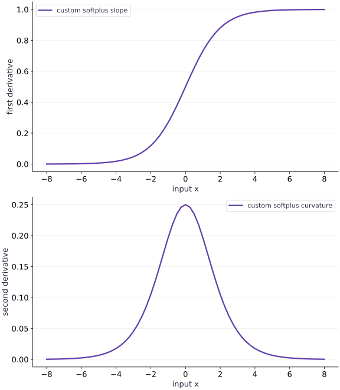

# Custom derivative rules

Phase 14: Autodiff & JAX internals · about 120 minutes · CPU

## What you will be able to do

- Implement actual custom_jvp and custom_vjp rules with correct return and residual contracts.
- Verify seed linearity, stable extreme values and second derivatives.
- Detect a wrong but linear derivative rule using independent numerical checks.
- Explain the forward-mode limitation of a custom_vjp function.

## The problem

Sometimes you know a stable formula for a derivative, or need to control what a reverse pass saves. How do you replace JAX’s default differentiation without quietly changing the mathematics? We will write two exact custom rules, check higher derivatives, and catch a deliberately plausible wrong rule.

## The idea

A custom derivative rule changes how differentiation treats a function. It must preserve the intended derivative while respecting transformation requirements. Stability of the primal computation and correctness of the derivative need separate checks.

## A custom rule is a mathematical contract

Start from a known analytic function and derive its slope. Compare the custom rule with that result over ordinary and extreme inputs, then examine the second derivative if higher-order use is intended.

A forward rule must be linear in its tangent input; a reverse rule must be linear in its incoming cotangent. Inserting an arbitrary nonlinear operation on that sensitivity can produce a rule that no longer represents a derivative.

The slope and curvature curves show more than a successful first gradient at one point. Follow their behavior near numerically difficult regions and use finite differences only where that independent approximation is reliable.

### Pause and reason

Why check more than one tangent magnitude or cotangent value?

<details><summary>Compare your reasoning</summary>

It can expose a rule that is incorrectly nonlinear in the sensitivity input. Matching a single derivative call can hide that contract violation.

</details>

## Keep the primal stable before customizing its derivative

Softplus is $s(x)=\log(1+e^x)$. Direct exponentiation overflows for a large positive input, even though the correct output is approximately $x$. logaddexp computes the same mathematical function without forming the dangerous exponential. Its derivative is the sigmoid $\sigma(x)$, and its second derivative is $\sigma(x)(1-\sigma(x))$. We use these identities as checks, not as permission to ignore the primal calculation.

$$
s(x)=\log(1+e^x),\qquad s\prime(x)=\sigma(x),\qquad s\prime\prime(x)=\sigma(x)(1-\sigma(x))
$$

## A custom JVP must remain linear in its tangent

The JVP receives tuples of primal arguments and tangent arguments. For one scalar input, it returns $(s(x),\sigma(x)\dot{x})$. The coefficient depends on the primal point; the expression is linear in the tangent $\dot{x}$. Squaring the tangent would not represent a derivative and would prevent a valid linear transpose. Multiplying by an incorrect constant remains linear but is still mathematically wrong, so linearity checks alone cannot establish correctness.

## Choose residuals for a custom reverse pass

For $\ell(x)=\log\sum_i e^{x_i}$, the gradient is softmax $p$. The forward rule returns the scalar primal and saves $p$ as the residual. The backward rule receives that residual and a scalar output cotangent $g$, then returns the input cotangent $gp$ inside a one-element tuple. Saving probabilities is a deliberate memory/recomputation choice in this small example; it is not a universal optimal residual policy.

$$
\frac{\partial\ell}{\partial x_i}=p_i,\qquad p_i=\frac{e^{x_i}}{\sum_j e^{x_j}}
$$

## Higher-order behavior is part of the promise

Differentiating the softplus rule again should give curvature $0.25$ at zero. Differentiating the log-sum-exp reverse gradient gives $\operatorname{diag}(p)-pp^\mathsf{T}$, a symmetric Hessian whose rows sum to zero because adding a common constant changes the value linearly. The reference checks use these formulas. A stop_gradient inserted into a residual path might preserve first derivatives while breaking these higher-order checks.

## Custom reverse mode has a transformation boundary

Applying jvp directly to a custom_vjp function is unsupported in the tested JAX API. We reproduce that boundary and report it explicitly. Reverse-over-reverse differentiation of this smooth, correctly implemented rule works and is checked. If forward-mode composition is needed, use an appropriate custom_jvp or ordinary JAX implementation rather than assuming every derivative decorator is interchangeable.

## An intentionally different gradient needs a different claim

A straight-through or surrogate rule can be useful in a modeling method, but it is not the exact derivative of the reported primal. This lesson teaches exact custom derivatives. We deliberately halve a correct derivative to show that a smooth-looking result and seed linearity do not make it true. A finite-difference comparison away from flat or saturated regions exposes the error.

## Write stable primal functions and exact derivative contracts

Create main.py for the first block, then append subsequent blocks in order using your course CPU environment.

```python
import jax
jax.config.update("jax_enable_x64", True)
import jax.numpy as jnp
import numpy as np

@jax.custom_jvp
def stable_softplus(x):
    return jnp.logaddexp(0.0,x)

@stable_softplus.defjvp
def softplus_jvp(primals,tangents):
    x,=primals
    dx,=tangents
    return stable_softplus(x),jax.nn.sigmoid(x)*dx

@jax.custom_vjp
def stable_logsumexp(x):
    return jax.scipy.special.logsumexp(x)

def logsumexp_fwd(x):
    value=stable_logsumexp(x)
    weights=jax.nn.softmax(x)
    return value,weights

def logsumexp_bwd(weights,cotangent):
    return (cotangent*weights,)

stable_logsumexp.defvjp(logsumexp_fwd,logsumexp_bwd)
```

The JVP rule returns primal and tangent; the VJP forward rule returns primal and residual, and its backward rule returns one cotangent per original input. Both preserve linearity in the directional seed.

## Check first and second derivatives independently

Create main.py for the first block, then append subsequent blocks in order using your course CPU environment.

```python
points=jnp.array([-4.,0.,3.])
values=jax.vmap(stable_softplus)(points)
first=jax.vmap(jax.grad(stable_softplus))(points)
second=jax.vmap(jax.grad(jax.grad(stable_softplus)))(points)
reference_first=1/(1+np.exp(-np.asarray(points)))
reference_second=reference_first*(1-reference_first)
np.testing.assert_allclose(values,np.logaddexp(0,np.asarray(points)),rtol=1e-12)
np.testing.assert_allclose(first,reference_first,rtol=1e-12)
np.testing.assert_allclose(second,reference_second,rtol=1e-12)
x=jnp.array([-0.8,0.4,1.1])
weights=np.exp(np.asarray(x)-np.max(np.asarray(x)));weights/=weights.sum()
hessian_reference=np.diag(weights)-np.outer(weights,weights)
np.testing.assert_allclose(jax.grad(stable_logsumexp)(x),weights,rtol=1e-12)
np.testing.assert_allclose(jax.jacrev(jax.grad(stable_logsumexp))(x),hessian_reference,rtol=1e-12,atol=1e-12)
print("Softplus first/second:",np.asarray(first),np.asarray(second))
print("Logsumexp gradient:",weights)
```

An exact first derivative can still hide mistakes in a higher-order rule. The softplus curvature and logsumexp Hessian are independently derived here.

## Exercise extremes and seed linearity

Create main.py for the first block, then append subsequent blocks in order using your course CPU environment.

```python
extremes=jnp.array([-1000.,0.,1000.])
extreme_values=jax.vmap(stable_softplus)(extremes)
extreme_gradients=jax.vmap(jax.grad(stable_softplus))(extremes)
assert np.isfinite(extreme_values).all() and np.isfinite(extreme_gradients).all()
np.testing.assert_allclose(extreme_values,[0.,np.log(2.),1000.],atol=1e-12)
with np.errstate(over='ignore'):
    naive=np.log1p(np.exp(np.asarray(extremes)))
assert not np.isfinite(naive[-1])
_,pullback=jax.vjp(stable_logsumexp,x)
np.testing.assert_allclose(pullback(2.0-0.3)[0],2*pullback(1.0)[0]-pullback(0.3)[0],rtol=1e-12)
print("Stable extreme values:",np.asarray(extreme_values),"naive positive extreme:",naive[-1])
```

Numerical stability must hold in both the primal and derivative path. Backward seed linearity is a contract of a true pullback, not an optional aesthetic property.

## Run the example

```python
import jax
jax.config.update("jax_enable_x64", True)
import jax.numpy as jnp
import numpy as np

@jax.custom_jvp
def stable_softplus(x):
    return jnp.logaddexp(0.0,x)

@stable_softplus.defjvp
def softplus_jvp(primals,tangents):
    x,=primals
    dx,=tangents
    return stable_softplus(x),jax.nn.sigmoid(x)*dx

@jax.custom_vjp
def stable_logsumexp(x):
    return jax.scipy.special.logsumexp(x)

def logsumexp_fwd(x):
    value=stable_logsumexp(x)
    weights=jax.nn.softmax(x)
    return value,weights

def logsumexp_bwd(weights,cotangent):
    return (cotangent*weights,)

stable_logsumexp.defvjp(logsumexp_fwd,logsumexp_bwd)

points=jnp.array([-4.,0.,3.])
values=jax.vmap(stable_softplus)(points)
first=jax.vmap(jax.grad(stable_softplus))(points)
second=jax.vmap(jax.grad(jax.grad(stable_softplus)))(points)
reference_first=1/(1+np.exp(-np.asarray(points)))
reference_second=reference_first*(1-reference_first)
np.testing.assert_allclose(values,np.logaddexp(0,np.asarray(points)),rtol=1e-12)
np.testing.assert_allclose(first,reference_first,rtol=1e-12)
np.testing.assert_allclose(second,reference_second,rtol=1e-12)
x=jnp.array([-0.8,0.4,1.1])
weights=np.exp(np.asarray(x)-np.max(np.asarray(x)));weights/=weights.sum()
hessian_reference=np.diag(weights)-np.outer(weights,weights)
np.testing.assert_allclose(jax.grad(stable_logsumexp)(x),weights,rtol=1e-12)
np.testing.assert_allclose(jax.jacrev(jax.grad(stable_logsumexp))(x),hessian_reference,rtol=1e-12,atol=1e-12)
print("Softplus first/second:",np.asarray(first),np.asarray(second))
print("Logsumexp gradient:",weights)

extremes=jnp.array([-1000.,0.,1000.])
extreme_values=jax.vmap(stable_softplus)(extremes)
extreme_gradients=jax.vmap(jax.grad(stable_softplus))(extremes)
assert np.isfinite(extreme_values).all() and np.isfinite(extreme_gradients).all()
np.testing.assert_allclose(extreme_values,[0.,np.log(2.),1000.],atol=1e-12)
with np.errstate(over='ignore'):
    naive=np.log1p(np.exp(np.asarray(extremes)))
assert not np.isfinite(naive[-1])
_,pullback=jax.vjp(stable_logsumexp,x)
np.testing.assert_allclose(pullback(2.0-0.3)[0],2*pullback(1.0)[0]-pullback(0.3)[0],rtol=1e-12)
print("Stable extreme values:",np.asarray(extreme_values),"naive positive extreme:",naive[-1])
```

Expected: Softplus derivatives at zero are 0.5 and 0.25. Stable values at [-1000, 0, 1000] are [0, log(2), 1000]; the naive positive extreme overflows. The custom reverse Hessian matches diag(p)-p p-transpose.

## A stable custom rule preserves both slope and curvature

**Predict:** Where should softplus have the greatest curvature, and what happens far into either tail?



**Recorded CPU computation**

### Read the figure

The upper panel plots the first derivative of the custom softplus against its scalar input. It rises smoothly from near zero to near one and passes through $0.5$ at zero. This is sensitivity, not the softplus value itself.

The lower panel plots the second derivative on the same input range. It reaches $0.25$ at zero and falls to about $0.01766$ at both $-4$ and $4$. The curvature is symmetric even though the first derivative is not.

### Connect it to the computation

The plotted values come from differentiating the registered custom rule, including differentiating it twice. Independent sigmoid and sigmoid-times-one-minus-sigmoid formulas check the numerical values at named points. The high-curvature central region is useful for detecting a wrong coefficient.

The separate extreme-input test reaches magnitude one thousand, beyond this display, to check overflow behavior. A smooth curve here cannot establish correctness in every transform or dtype; the VJP interface-boundary experiment and changed-size practice test other parts of the contract.

```python
grid=jnp.linspace(-8.,8.,65)
slopes=np.asarray(jax.vmap(jax.grad(stable_softplus))(grid))
curvatures=np.asarray(jax.vmap(jax.grad(jax.grad(stable_softplus)))(grid))
visual_data={'panels':[{'kind':'line','x':np.asarray(grid).tolist(),'xlabel':'input x','ylabel':'first derivative','series':[{'label':'custom softplus slope','y':slopes.tolist()}]},{'kind':'line','x':np.asarray(grid).tolist(),'xlabel':'input x','ylabel':'second derivative','series':[{'label':'custom softplus curvature','y':curvatures.tolist()}]}]}
```

## Recorded reference execution

CPU run: 2026-10-06T22:01:56.705751+00:00. JAX 0.9.2.

```text
Softplus first/second: [0.01798621 0.5        0.95257413] [0.01766271 0.25       0.04517666]
Logsumexp gradient: [0.09085944 0.30166396 0.60747661]
Stable extreme values: [0.00000000e+00 6.93147181e-01 1.00000000e+03] naive positive extreme: inf
Softplus first/second: [0.01798621 0.5        0.95257413] [0.01766271 0.25       0.04517666]
Logsumexp gradient: [0.09085944 0.30166396 0.60747661]
Stable extreme values: [0.00000000e+00 6.93147181e-01 1.00000000e+03] naive positive extreme: inf
Wrong/correct/finite-difference derivative: 0.29934383005622606 0.5986876601124521 0.5986876601138391
Expected custom_vjp forward-mode boundary: can't apply forward-mode autodiff (jvp) to a custom_vjp function.
Ordinary JAX common-shift JVP: 1.0
Changed-size gradient and cotangent scaling verified
Stable shift invariance and zero common-direction curvature verified
Nonlinear seed rule rejected by its contract; repaired JVP is linear
PASS: internals-03

```

## Expose a wrong but linear rule

**Predict before running:** Would halving the derivative violate seed linearity? Would it still be the derivative of softplus?

```python
@jax.custom_jvp
def wrong_softplus(z):
    return jnp.logaddexp(0.0,z)
@wrong_softplus.defjvp
def wrong_rule(primals,tangents):
    z,=primals;dz,=tangents
    return wrong_softplus(z),0.5*jax.nn.sigmoid(z)*dz
probe=0.4;eps=1e-5
finite=(np.logaddexp(0,probe+eps)-np.logaddexp(0,probe-eps))/(2*eps)
wrong=float(jax.grad(wrong_softplus)(probe))
right=float(jax.grad(stable_softplus)(probe))
assert abs(wrong-finite)>0.2
np.testing.assert_allclose(right,finite,rtol=1e-9)
print("Wrong/correct/finite-difference derivative:",wrong,right,finite)
```

**Expected:** Wrong derivative approximately 0.29934; correct and finite-difference derivatives approximately 0.59869.

The wrong tangent expression is linear, so transposition can still work. Only an independent mathematical or numerical oracle detects its incorrect coefficient.

## Exercise the custom VJP boundary

**Predict before running:** Can a custom reverse rule automatically supply a direct forward-mode product?

```python
rejected=False
try:
    jax.jvp(stable_logsumexp,(x,),(jnp.ones_like(x),))
except TypeError as error:
    rejected=True
    print("Expected custom_vjp forward-mode boundary:",str(error).splitlines()[0])
assert rejected
ordinary=lambda z:jax.scipy.special.logsumexp(z)
ordinary_direction=jax.jvp(ordinary,(x,),(jnp.ones_like(x),))[1]
np.testing.assert_allclose(ordinary_direction,1.0,atol=1e-12)
print("Ordinary JAX common-shift JVP:",float(ordinary_direction))
```

**Expected:** The custom_vjp direct JVP is rejected; the ordinary function gives directional derivative 1.

Adding the same constant to all logits shifts log-sum-exp by that constant. The mathematical derivative exists; the limitation belongs to the custom_vjp transformation interface.

## Make it yours

Check the custom log-sum-exp gradient on $(-3,0.2,2,5)$ against an independent stable softmax and central differences along two directions. Keep the output cotangent explicit.

<details><summary>Reference solution</summary>

```python
changed=jnp.array([-3.,0.2,2.,5.])
host=np.asarray(changed);p=np.exp(host-host.max());p/=p.sum()
actual=jax.grad(stable_logsumexp)(changed)
np.testing.assert_allclose(actual,p,rtol=1e-12)
for direction in (np.array([1.,-.5,.2,0.]),np.array([0.,1.,-1.,.3])):
    eps=1e-5
    reference=lambda z:np.max(z)+np.log(np.exp(z-np.max(z)).sum())
    fd=(reference(host+eps*direction)-reference(host-eps*direction))/(2*eps)
    np.testing.assert_allclose(np.dot(np.asarray(actual),direction),fd,rtol=1e-8,atol=1e-10)
np.testing.assert_allclose(jax.vjp(stable_logsumexp,changed)[1](2.5)[0],2.5*p,rtol=1e-12)
print("Changed-size gradient and cotangent scaling verified")
```

</details>

## Check common-shift invariance of curvature

**Practice**

Add a common constant of $1000$ to every logit. Verify the value shift, unchanged gradient, and Hessian row sums.

<details><summary>Hint</summary>

Use stable references and avoid direct exponentiation of the shifted logits.

</details>

<details><summary>Reference solution and reasoning</summary>

```python
shift=1000.0
np.testing.assert_allclose(stable_logsumexp(x+shift)-stable_logsumexp(x),shift,rtol=1e-12)
np.testing.assert_allclose(jax.grad(stable_logsumexp)(x+shift),jax.grad(stable_logsumexp)(x),rtol=1e-12)
hess=jax.jacrev(jax.grad(stable_logsumexp))(x+shift)
np.testing.assert_allclose(jnp.sum(hess,axis=1),0.,atol=1e-12)
print("Stable shift invariance and zero common-direction curvature verified")
```

The common shift leaves probabilities unchanged. Zero curvature in that direction is a structural identity, not a numerical accident.

</details>

## Audit a nonlinear seed rule before registering it

**Challenge**

A proposed JVP returns $\sigma(x)\dot{x}^2$. Show explicitly why it cannot be the derivative map, then repair it and test a mixed linear combination.

<details><summary>Hint</summary>

At fixed x, compare the response to twice a tangent with twice the response.

</details>

<details><summary>Reference solution and reasoning</summary>

```python
coefficient=float(jax.nn.sigmoid(0.4))
bad=lambda tangent:coefficient*tangent*tangent
assert not np.isclose(bad(2.0),2*bad(1.0))
good=lambda tangent:jax.jvp(stable_softplus,(jnp.array(0.4),),(jnp.array(tangent),))[1]
np.testing.assert_allclose(good(2*.7-.3),2*good(.7)-good(.3),rtol=1e-12)
print("Nonlinear seed rule rejected by its contract; repaired JVP is linear")
```

Linearity follows from the definition of a derivative at a fixed primal point. API acceptance is not a substitute for this mathematical check.

</details>

## Check your understanding

A custom derivative is linear in its tangent and returns finite values. What additional evidence is necessary before calling it exact?

1. Agreement with the actual primal derivative through an independent derivation or numerical check.
2. A larger batch size so its bars look smoother.
3. No additional evidence: linearity guarantees the coefficient is correct.

<details><summary>Answer and explanation</summary>

Agreement with the actual primal derivative through an independent derivation or numerical check.

Linearity is necessary, but a wrong constant multiple of the true derivative is also linear and finite. Independent comparisons establish the missing mathematical agreement.

</details>

## Diagnose the result

If first derivatives pass but second derivatives fail, inspect whether residuals or derivative coefficients have been detached. If extreme values are nonfinite, inspect both primal and derivative expressions. If a custom VJP direct JVP fails, treat that as an interface boundary. If a plausible custom gradient differs from finite differences, do not relabel it exact without a valid derivation.

## Carry forward

- Keep the primal stable before customizing its derivative
- A custom JVP must remain linear in its tangent
- Choose residuals for a custom reverse pass
- Higher-order behavior is part of the promise
- Custom reverse mode has a transformation boundary
- An intentionally different gradient needs a different claim

## Keep your evidence

Stable extreme inputs, analytic slopes/Hessians, seed linearity, independent finite differences and a deliberately wrong-rule diagnosis. Keep the environment, observed outputs and your explanation of the figure.

Keep predictions, modified code, observed results, and reasoning. A checkpoint alone does not demonstrate the exercise.

## Primary references

- [JAX automatic differentiation cookbook](https://docs.jax.dev/en/latest/notebooks/autodiff_cookbook.html)
- [Custom JVP and VJP rules](https://docs.jax.dev/en/latest/notebooks/Custom_derivative_rules_for_Python_code.html)
- [Ahead-of-time lowering and compilation](https://docs.jax.dev/en/latest/aot.html)
- [The jaxpr language](https://docs.jax.dev/en/latest/601/jaxpr.html)

