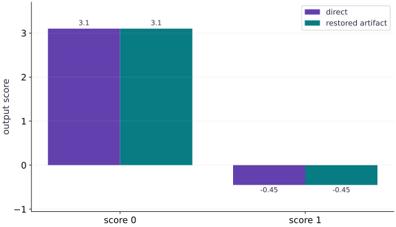

# Export a computation and verify its serving contract

Phase 15: Deployment, interoperability & edge AI · about 75 minutes · CPU

## What you will be able to do

- Serialize and reload a fixed-shape JAX inference computation.
- Test known values and changed requests independently.
- Distinguish export compatibility from service and edge-device readiness.

## The problem

Your function works in the training process. Let’s make sure it also works after saving and reloading its inference computation. We’ll define one request shape, check a known prediction, and deliberately send an incompatible request. These checks give us a clear contract before adding a service around the model.

## The idea

Export packages a computation for a supported runtime. The consumer still needs input validation, preprocessing, output meaning and compatibility information. Separate the artifact boundary from the surrounding service.

## A serialized computation still needs an interface

The lesson exports a fixed float32 input of shape $(1,3)$ to an output of shape $(1,2)$. A Python function may accept a larger batch while that particular exported signature does not. The consumer must follow the artifact's declared contract.

Serialize, load the file again and call the restored computation on new inputs. Comparing only the original in-memory function does not test the exported bytes. Keep artifact hash, environment and tolerance with the result.

If preprocessing lives outside the export, version it alongside the model. A correct graph can still return wrong application results when the caller normalizes inputs differently. A local round trip does not automatically qualify another runtime, hardware target or version.

### Pause and reason

What should happen to a request with the wrong feature count?

<details><summary>Compare your reasoning</summary>

Reject it at the interface with a clear explanation before inference. Silently reshaping may alter example meaning and does not make the request compatible with the exported signature.

</details>

## Freeze the inference boundary

The example closes over trained weights and bias, so those values become part of the exported computation. The single input is float32 $[1, 3]$; the output is float32 $[1, 2]$. A new weight version requires a new artifact here. For systems that pass weights as inputs, define and version those parameter signatures instead. Remove optimizer state and training-only behavior from this inference boundary.

## Fixed shapes are a deliberate constraint

A fixed batch-one signature simplifies the runtime contract. A batch of two is not accepted merely because the original Python expression supports it. JAX shape polymorphism is a separate export feature with its own constraints. Record permitted dimensions explicitly; an HTTP wrapper should reject malformed requests before invoking the computation.

## Verify the file, not the original function

Serialize, read back and deserialize before checking predictions. Then compare to both a manually known row and NumPy on new inputs. Record the JAX/jaxlib versions, platform, artifact hash, preprocessing and tolerance with the release. Exported calling conventions and supported platforms have compatibility rules; retain the environment instead of assuming a byte file runs everywhere.

## Choose a runtime after choosing an artifact

The local exported call still needs a compatible JAX runtime. For TensorFlow serving, investigate a supported jax2tf or Keras SavedModel route and retest outputs after conversion. For LiteRT, use its supported converter and runtime with explicit operator and dtype checks. ONNX Runtime needs a supported ONNX graph and execution provider. A format name alone says nothing about whether a target NPU can execute every operator.

## From local call to service

Place decoding, normalization, shape checks, inference and response encoding inside your request boundary. Set input size limits and concurrency limits. Measure cold initialization and warmed request latency separately; queueing and network time change the service result. The edge lesson extends this boundary to a single-device request. Autoscaling and a production server are outside this CPU artifact exercise.

## Run the example

```python
import tempfile
from pathlib import Path
import numpy as np
import jax
import jax.numpy as jnp
from jax import export
weights = jnp.array([[1., -2.], [.5, 1.], [-1., .25]], dtype=jnp.float32)
bias = jnp.array([.1, -.2], dtype=jnp.float32)
@jax.jit
def inference(x):
    return x @ weights + bias
signature = jax.ShapeDtypeStruct((1, 3), jnp.float32)
artifact = export.export(inference)(signature)
with tempfile.TemporaryDirectory() as folder:
    path = Path(folder) / "dense.jaxexport"
    path.write_bytes(artifact.serialize())
    restored = export.deserialize(path.read_bytes())
    sample = np.array([[1., 2., -1.]], np.float32)
    actual = np.asarray(restored.call(sample))
    np.testing.assert_allclose(actual, [[3.1, -.45]], atol=1e-6)
    print("Verified serialized bytes:", path.stat().st_size)

```

Expected: The serialized artifact reloads and returns $[3.1, -0.45]$. File size depends on the JAX version.

## Serialization preserves the declared computation

**Predict:** Do the restored scores match the direct function?



**Recorded CPU computation**

### Read the figure

Each category is one output score. The paired bars compare the direct computation with the restored serialized artifact on the same input. Both give approximately $3.1$ for score $0$ and $-0.45$ for score $1$.

The matching heights show numerical agreement. The bars are adjacent, rather than one line hiding another. A negative second score is valid because these are raw outputs, not probabilities constrained to lie between zero and one.

### Connect it to the computation

This is the first behavior to check after serialization: does the restored computation preserve the result within the declared tolerance? The figure makes a coordinate-by-coordinate mismatch visible instead of reducing all outputs to one aggregate number.

The example exports a specific float32 input signature with shape $(1,3)$. Agreement for this case does not establish acceptance of arbitrary shapes or support in every serving runtime. Keep the signature and input preprocessing with the artifact, then expand parity checks to the cases your application actually needs.

```python
direct = np.asarray(inference(sample))
visual_data = {'kind': 'bar', 'labels': ['score 0', 'score 1'], 'ylabel': 'output score', 'series': [{'label': 'direct', 'y': direct[0].tolist()}, {'label': 'restored artifact', 'y': actual[0].tolist()}]}
```

## Recorded reference execution

CPU run: 2026-10-06T15:42:53.010987+00:00. JAX 0.9.2.

```text
Verified serialized bytes: 1172
Rejected incompatible shape: ValueError
Changed exported request verified
PASS: deployment-03

```

## Reject the wrong batch

**Predict before running:** Does the exported signature accept two rows?

```python
try:
    restored.call(np.ones((2, 3), np.float32))
except (ValueError, TypeError) as error:
    print("Rejected incompatible shape:", type(error).__name__)
else:
    raise AssertionError("Fixed batch-one contract was not enforced")

```

**Expected:** The incompatible shape is rejected.

A Python function being shape-generic does not make its fixed exported interface polymorphic.

## Make it yours

Verify a new input $[-2, 0, 3]$ against an independent NumPy expression.

<details><summary>Reference solution</summary>

```python
changed = np.array([[-2., 0., 3.]], np.float32)
expected = changed @ np.asarray(weights) + np.asarray(bias)
np.testing.assert_allclose(restored.call(changed), expected, atol=1e-6)
print("Changed exported request verified")
```

</details>

## Validate a request before inference

**Transfer**

Write a host-side request checker that rejects nonfinite values and the wrong shape. Test a NaN input and a wrong feature count.

<details><summary>Hint</summary>

Validate shape and finiteness on the host before calling inference. Include a singleton batch, the wrong feature count and a NaN; specify which cases your serving signature permits.

</details>

<details><summary>Reference solution and reasoning</summary>

```python
def validate_request(values):
    array = np.asarray(values, dtype=np.float32)
    if array.shape != (1, 3) or not np.isfinite(array).all():
        raise ValueError("expected finite float32 [1, 3]")
    return array
for invalid in ([[1., 2.]], [[1., float("nan"), 3.]]):
    try:
        validate_request(invalid)
    except ValueError:
        pass
    else:
        raise AssertionError("invalid input accepted")
np.testing.assert_allclose(restored.call(validate_request([[1.,2.,-1.]])), [[3.1,-.45]], atol=1e-6)

```

Validation belongs before the runtime call. A dtype cast alone neither verifies input shape nor rejects NaNs.

</details>

## Check your understanding

What does a successful local export round trip prove?

1. The saved computation matches the tested CPU contract.
2. The file is an edge executable on every NPU.
3. An HTTP service now exists.

<details><summary>Answer and explanation</summary>

The saved computation matches the tested CPU contract.

A successful round trip verifies the tested artifact and local runtime. Other consumers, device kernels and request systems require separate checks.

</details>

## Diagnose the result

A missing flatbuffers dependency prevents serialization: reinstall requirements-cpu.txt. A rejected input may be correct enforcement of your shape/dtype signature. Conversion success with output drift calls for intermediate-tensor comparison, preprocessing checks and evaluation on held-out examples.

## Keep your evidence

Keep the export/reload code, version/platform manifest, known-output and changed-input checks, rejected-shape result, and the planned serving request boundary.

Keep predictions, modified code, observed results, and reasoning. A checkpoint alone does not demonstrate the exercise.

## Primary references

- [JAX export and serialization](https://docs.jax.dev/en/latest/export/export.html)
- [JAX shape polymorphism](https://docs.jax.dev/en/latest/export/shape_poly.html)
- [Keras inference export](https://keras.io/api/models/model_saving_apis/export/)

