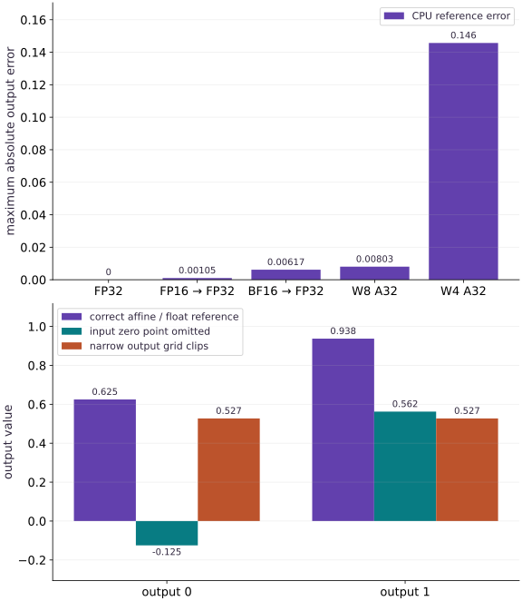

# Choose weight, activation and accumulation precision

Phase 15: Deployment, interoperability & edge AI · about 75 minutes · CPU

## What you will be able to do

- Compare FP32, FP16 and BF16 rounding without confusing storage with accumulation.
- Implement per-output-channel symmetric INT8 and INT4 weight quantization.
- Calibrate activations and diagnose clipping on unseen ranges.
- Explain FP64, FP8, weight-only, full integer and mixed precision policies.

## The problem

Someone asks you for an “8-bit model.” A helpful first question is: 8-bit weights, activations, or both? We’ll separate those choices, compare them with a float32 reference, and watch what happens when an input falls outside the calibrated range. You’ll leave with a precision policy you can explain, not just a dtype label.

## The idea

Weights are the numbers a model has learned. Activations are the values it computes for the current input. Accumulators hold intermediate sums. We can choose a different precision for each, so it helps to write those choices separately.

For example, W8A16 describes 8-bit weights and 16-bit activations, but leaves other questions open: how are values scaled, how wide are the sums, and which runtime kernels can use that format? Our CPU experiments isolate the numerical effects. They do not claim packed INT4 storage or accelerator speed.

## Write the policy before choosing a dtype

Use separate fields for stored weights, input/intermediate activations, multiply operands, accumulator, output and optimizer/master weights. FP32 is a useful baseline. FP64 can help sensitive numerical work; in JAX enable jax_enable_x64 before creating arrays and account for target support and cost. FP16 has a narrower exponent range than BF16, while BF16 gives up fraction precision for range. Keep reductions, normalization statistics and sensitive losses in FP32 when needed. The example rounds operands to each format, then explicitly returns them to FP32 for multiplication; it isolates representation error rather than proving low-precision kernel behavior.

## Mixed precision during training

A Keras mixed_float16 or mixed_bfloat16 policy generally keeps variables in FP32 while using lower-precision computations. Set the policy before constructing layers and inspect variable_dtype and compute_dtype. FP16 training may need loss scaling to avoid gradient underflow; unscale before clipping and updating, reject nonfinite updates, and keep optimizer/master state at suitable precision. BF16 has wider range but still incurs rounding. In explicit JAX code, cast intentionally at operation boundaries and test the full update. Merely changing the parameter storage dtype is not a complete mixed precision implementation.

## Quantize weights with scale metadata

Let $b$ be the number of bits and $q_{\max}=2^{b-1}-1$ the largest positive code. For each weight column, choose scale $s=\max(|w|)/q_{\max}$. Dividing a weight by $s$ moves it onto the integer grid; rounding chooses the nearest code, and clipping keeps the code in range. Reconstruct the approximate weight with $\widehat w=sq$.

Our Dense kernel’s output channels lie along axis $1$, so each column gets its own scale. This preserves resolution when columns have different ranges. For a zero column, use scale $1$ and codes $0$. Without clipping, rounding changes a value by at most $s/2$. Smaller quantization groups can improve local resolution, but each group also needs scale metadata.

## Weight-only and full integer are different deployments

W4A16 and W8A16 usually describe compressed weights with floating activations; a runtime may dequantize before multiplication or use a specialized mixed kernel. Our 4-bit codes live in int8 arrays and are not nibble-packed, so they do not realize 4-bit memory savings. W8A8 quantizes activations too. An affine activation reconstructs as $a=s(q-z)$, where $q$ is its integer code, $s$ is its scale, and $z$ is the zero point; calibration estimates its range from representative training/calibration data, never the held-out evaluation set. Static quantization fixes ranges; dynamic quantization estimates activation ranges at runtime. Accumulation commonly uses INT32 for integer kernels; bias and requantization must use compatible scales.

## FP8 and other low-bit formats require a target contract

FP8 E4M3 and E5M2 differ in range and precision; their names are not interchangeable. Scaling granularity, saturation behavior and kernel support matter. Do not treat a successful CPU dtype cast as evidence of FP8 acceleration. INT4, UINT8, INT16 activation schemes and newer sub-byte floating formats also depend on runtime/operator support. For ONNX Runtime or LiteRT, inspect the format, operator, quantization scheme and execution provider together. If a supported PTQ policy loses too much task accuracy, evaluate quantization-aware training rather than silently relaxing acceptance criteria.

## Evaluate quality separately from size and speed

Compare the original and converted models on held-out examples, including low-margin decisions and uncommon ranges. Record absolute/relative error with a sensible near-zero floor, task metrics, clipping rates and acceptance thresholds chosen in advance. Estimate weight storage as `ceil(parameter_count*bits/8)` plus metadata, but measure the real artifact and peak runtime memory. Activation buffers, KV caches, workspace and fallback copies can dominate. Benchmark on the intended device after verifying which kernels actually execute.

## Follow one value onto the quantization grid

A scale $s$ tells us how far apart the representable values are. For $s=0.1$, a weight of $0.26$ rounds to integer code $3$ and reconstructs as $0.3$. The error is $0.04$, less than half a grid step. If a value lies outside the supported range, clipping can make the error much larger. Our per-channel code computes a separate scale for each output column and treats a zero column specially.

$$
\begin{aligned}q_{\max}&=2^{b-1}-1\\q&=\operatorname{clip}\!\left(\operatorname{round}(w/s),-q_{\max},q_{\max}\right)\\\widehat w&=sq,\qquad |w-\widehat w|\le s/2\quad\text{without clipping}\end{aligned}
$$

## Follow an affine output through every numeric unit

Let an activation code be $q_x$, its zero point $z_x$, and its positive scale $s_x$. The represented value is $s_x(q_x-z_x)$. Subtract the zero point after widening the codes: raw INT8 arithmetic can overflow before accumulation. With symmetric weights, each output channel has weight zero point zero and scale $s_{w,j}$. Its accumulator therefore has units $s_xs_{w,j}$, so round the bias into those same units before adding it. In the worked experiment, corrected products plus bias give accumulators $5$ and $15$; their real outputs are $0.625$ and $0.9375$. Requantization maps these values onto the output grid. A small output scale offers fine spacing but can also make the representable range too narrow. The second plot separates forgetting the input zero point from clipping at the output; these are different bugs with different repairs.

$$
a_j=\sum_i(q_{x,i}-z_x)q_{w,ij}+\operatorname{round}\!\left(\frac{b_j}{s_xs_{w,j}}\right),\qquad q_{y,j}=\operatorname{clip}\!\left(\operatorname{round}\!\left(\frac{s_xs_{w,j}}{s_y}a_j\right)+z_y,-128,127\right)
$$

## Run the example

```python
import numpy as np
import jax.numpy as jnp
x = np.array([[.3, -1.2, 2.1], [1.1, .2, -.8]], np.float32)
w = np.array([[.11, -1.8], [.7, .2], [-.3, 2.4]], np.float32)
reference = x @ w
def mixed_forward(x, w, dtype):
    # Demonstrate rounding inputs/weights with explicit float32 accumulation.
    a = jnp.asarray(x, dtype).astype(jnp.float32)
    b = jnp.asarray(w, dtype).astype(jnp.float32)
    return np.asarray(a @ b)
for dtype in (jnp.float32, jnp.float16, jnp.bfloat16):
    y = mixed_forward(x, w, dtype)
    error = float(np.max(np.abs(y-reference)))
    assert np.isfinite(y).all() and error < .05
    print(str(dtype), "max absolute error", error)

def quantize_weights(weights, bits):
    if bits not in (4, 8):
        raise ValueError("use signed 4 or 8 bit symmetric quantization")
    limit = 2 ** (bits - 1) - 1
    maxima = np.max(np.abs(weights), axis=0, keepdims=True)
    scale = np.where(maxima == 0, 1., maxima / limit).astype(np.float32)
    q = np.clip(np.rint(weights / scale), -limit, limit).astype(np.int8)
    return q, scale
for bits in (8, 4):
    q, scale = quantize_weights(w, bits)
    reconstructed = q.astype(np.float32) * scale
    assert np.all(np.abs(reconstructed-w) <= scale / 2 + 1e-6)
    # Independent error bound: |x deltaW| <= |x| |deltaW|.
    error = np.abs(x @ reconstructed-reference)
    bound = np.abs(x) @ np.broadcast_to(scale / 2, w.shape)
    assert np.all(error <= bound + 1e-6)
    print("W%dA32 simulated output error" % bits, float(error.max()))

```

Expected: FP32, FP16 and BF16 comparisons are finite with error below $0.05$ for this fixture. INT8/INT4 reconstruction errors obey a half-scale bound; these are simulated weight-only computations.

## Precision choices trade representation for output error

**Predict:** Must two low-precision formats have the same error?



**Recorded CPU computation**

### Read the figure

The horizontal categories are precision policies; the vertical axis is maximum absolute output error against the FP32 reference on the same small input. Lower bars mean closer numerical agreement, not faster execution. The FP32 baseline is zero by construction.

The errors are approximately $0.00105$ for FP16 rounding, $0.00617$ for BF16 rounding, $0.00803$ for W8 A32, and $0.146$ for W4 A32. The four-bit weight simulation has about eighteen times the output error of the eight-bit simulation in this example. These are output units, not percentages or classification error rates.

The lower panel uses a separate exactly representable affine fixture, with output channel on the horizontal axis and real output value on the vertical axis. Correct values are $0.625$ and $0.9375$. Omitting the input zero point lowers them to $-0.125$ and $0.5625$; this is systematic offset error, not random rounding. The narrow output grid makes both bars equal $0.52734375$, the largest representable output under that policy. Equal bars here reveal saturation, not equal underlying predictions.

### Connect it to the computation

For the floating-point policies, both inputs and weights are rounded, then converted to FP32 for accumulation. FP16 has finer precision than BF16 around these particular values; BF16’s wider exponent range is not being tested here. The weight-only policies keep activations in FP32 and reconstruct quantized weights before multiplication.

Four-bit quantization uses fewer representable weight levels, so its larger rounding steps can create larger output discrepancies. The code uses per-output-column scales and checks an independent error bound. This is simulated quantization using ordinary CPU arrays, not a measurement of packed four-bit storage or native low-bit kernels. Accuracy, memory, and latency must each be evaluated on the intended workload and runtime.

Use the lower panel to decide what to inspect: zero-point subtraction and bias units for an offset mismatch; output range and clipping counts for saturation. The upper panel compares precision policies on the original fixture, while the lower panel isolates operator bookkeeping on a different fixture. Neither measures latency.

```python
names = []
errors = []
for name, dtype in [('FP32', jnp.float32), ('FP16 → FP32', jnp.float16), ('BF16 → FP32', jnp.bfloat16)]:
    names.append(name)
    errors.append(float(np.max(np.abs(mixed_forward(x, w, dtype) - reference))))
for bits_plot in (8, 4):
    q_plot, s_plot = quantize_weights(w, bits_plot)
    names.append('W' + str(bits_plot) + ' A32')
    errors.append(float(np.max(np.abs(x @ (q_plot.astype(np.float32) * s_plot) - reference))))
visual_data = {'kind': 'bar', 'labels': names, 'ylabel': 'maximum absolute output error', 'series': [{'label': 'CPU reference error', 'y': errors}]}
# Deliberately exact grid values make an independent hand calculation possible.
a_sx, a_zx = .25, -3
a_sw = np.array([.5, .25], np.float64)
a_qx = np.array([[-3, 1, 5]], np.int8)
a_qw = np.array([[2, -1], [-1, 2], [1, 1]], np.int8)
a_bias = np.array([.125, -.0625], np.float64)
a_bias_codes = np.rint(a_bias / (a_sx * a_sw)).astype(np.int64)
# Check the wide result before representing it with an INT32 accumulator.
a_wide = (a_qx.astype(np.int64) - a_zx) @ a_qw.astype(np.int64) + a_bias_codes
assert np.all((a_wide >= np.iinfo(np.int32).min) & (a_wide <= np.iinfo(np.int32).max))
a_acc = a_wide.astype(np.int32)
np.testing.assert_array_equal(a_acc, [[5, 15]])
a_real = a_acc.astype(np.float64) * a_sx * a_sw
# Independent real-valued input/weights, written without decoding the codes.
a_reference = np.array([[0., 1., 2.]]) @ np.array([[1., -.25], [-.5, .5], [.5, .25]]) + a_bias
np.testing.assert_array_equal(a_real, [[.625, .9375]])
np.testing.assert_allclose(a_real, a_reference, atol=1e-12, rtol=0)
def output_grid(real, scale, zero_point):
    if not np.isfinite(scale) or scale <= 0:
        raise ValueError('positive finite output scale required')
    if type(zero_point) is not int or not -128 <= zero_point <= 127:
        raise ValueError('integer INT8 zero point required')
    unbounded = np.rint(real / scale) + zero_point
    clipped = (unbounded < -128) | (unbounded > 127)
    codes = np.clip(unbounded, -128, 127).astype(np.int8)
    return codes, (codes.astype(np.float64) - zero_point) * scale, clipped

a_codes, a_restored, a_clipped = output_grid(a_real, .0625, -8)
np.testing.assert_array_equal(a_codes, [[2, 7]])
assert not a_clipped.any()
np.testing.assert_allclose(a_restored, a_reference, atol=1e-12, rtol=0)
a_wrong = (a_qx.astype(np.int64) @ a_qw.astype(np.int64) + a_bias_codes) * a_sx * a_sw
np.testing.assert_array_equal(a_wrong, [[-.125, .5625]])
_, a_saturated, a_small_clipped = output_grid(a_real, 1./256, -8)
assert a_small_clipped.all()
np.testing.assert_array_equal(a_saturated, [[135./256, 135./256]])
print('Affine accumulators:', a_acc.tolist(), 'output codes:', a_codes.tolist())
print('Correct / missing zero point / clipped:', a_restored.tolist(), a_wrong.tolist(), a_saturated.tolist())

first_panel = visual_data
visual_data = {'panels': [first_panel, {'kind': 'bar', 'labels': ['output 0', 'output 1'], 'ylabel': 'output value', 'series': [
    {'label': 'correct affine / float reference', 'y': a_restored[0].tolist()},
    {'label': 'input zero point omitted', 'y': a_wrong[0].tolist()},
    {'label': 'narrow output grid clips', 'y': a_saturated[0].tolist()}]}]}

```

## Recorded reference execution

CPU run: 2026-10-06T01:26:21.773000+00:00. JAX 0.9.2.

```text
<class 'jax.numpy.float32'> max absolute error 0.0
<class 'jax.numpy.float16'> max absolute error 0.0010547637939453125
<class 'jax.numpy.bfloat16'> max absolute error 0.006171703338623047
W8A32 simulated output error 0.008031368255615234
W4A32 simulated output error 0.14571428298950195
Affine accumulators: [[5, 15]] output codes: [[2, 7]]
Correct / missing zero point / clipped: [[0.625, 0.9375]] [[-0.125, 0.5625]] [[0.52734375, 0.52734375]]
Clipped values: 1 reconstructed: [0.19685039 0.8976378  1.        ]
Affine accumulators: [[5, 15]] output codes: [[2, 7]]
Correct / missing zero point / clipped: [[0.625, 0.9375]] [[-0.125, 0.5625]] [[0.52734375, 0.52734375]]
Zero channel handled
W8A8 fixture error 0.00742650032043457
Code-origin invariance and bias-only zero input verified.
PASS: deployment-05

```

## Calibrate an activation range, then shift it

**Predict before running:** What happens to a value of $4$ if calibration only covered $[-1, 1]$?

```python
calibration = np.linspace(-1., 1., 101, dtype=np.float32)
activation_scale = float(np.max(np.abs(calibration))) / 127
held_out = np.array([.2, .9, 4.], np.float32)
activation_codes = np.clip(np.rint(held_out / activation_scale), -127, 127).astype(np.int8)
restored_activations = activation_codes.astype(np.float32) * activation_scale
clipped = np.count_nonzero(np.abs(held_out) > 127 * activation_scale)
assert clipped == 1 and abs(float(restored_activations[-1])-4.) > 2.9
print("Clipped values:", clipped, "reconstructed:", restored_activations)

```

**Expected:** One value clips and reconstructs near $1$ instead of $4$.

Do not recalibrate on the test set to hide this error. Collect representative calibration data or choose a policy that meets the task requirements.

## Include zero points, bias and the output grid

**Predict before running:** Can finer output spacing make the answer worse? Predict the two outputs when the output scale changes from $0.0625$ to $1/256$, with zero point $-8$ held fixed.

```python
# Deliberately exact grid values make an independent hand calculation possible.
a_sx, a_zx = .25, -3
a_sw = np.array([.5, .25], np.float64)
a_qx = np.array([[-3, 1, 5]], np.int8)
a_qw = np.array([[2, -1], [-1, 2], [1, 1]], np.int8)
a_bias = np.array([.125, -.0625], np.float64)
a_bias_codes = np.rint(a_bias / (a_sx * a_sw)).astype(np.int64)
# Check the wide result before representing it with an INT32 accumulator.
a_wide = (a_qx.astype(np.int64) - a_zx) @ a_qw.astype(np.int64) + a_bias_codes
assert np.all((a_wide >= np.iinfo(np.int32).min) & (a_wide <= np.iinfo(np.int32).max))
a_acc = a_wide.astype(np.int32)
np.testing.assert_array_equal(a_acc, [[5, 15]])
a_real = a_acc.astype(np.float64) * a_sx * a_sw
# Independent real-valued input/weights, written without decoding the codes.
a_reference = np.array([[0., 1., 2.]]) @ np.array([[1., -.25], [-.5, .5], [.5, .25]]) + a_bias
np.testing.assert_array_equal(a_real, [[.625, .9375]])
np.testing.assert_allclose(a_real, a_reference, atol=1e-12, rtol=0)
def output_grid(real, scale, zero_point):
    if not np.isfinite(scale) or scale <= 0:
        raise ValueError('positive finite output scale required')
    if type(zero_point) is not int or not -128 <= zero_point <= 127:
        raise ValueError('integer INT8 zero point required')
    unbounded = np.rint(real / scale) + zero_point
    clipped = (unbounded < -128) | (unbounded > 127)
    codes = np.clip(unbounded, -128, 127).astype(np.int8)
    return codes, (codes.astype(np.float64) - zero_point) * scale, clipped

a_codes, a_restored, a_clipped = output_grid(a_real, .0625, -8)
np.testing.assert_array_equal(a_codes, [[2, 7]])
assert not a_clipped.any()
np.testing.assert_allclose(a_restored, a_reference, atol=1e-12, rtol=0)
a_wrong = (a_qx.astype(np.int64) @ a_qw.astype(np.int64) + a_bias_codes) * a_sx * a_sw
np.testing.assert_array_equal(a_wrong, [[-.125, .5625]])
_, a_saturated, a_small_clipped = output_grid(a_real, 1./256, -8)
assert a_small_clipped.all()
np.testing.assert_array_equal(a_saturated, [[135./256, 135./256]])
print('Affine accumulators:', a_acc.tolist(), 'output codes:', a_codes.tolist())
print('Correct / missing zero point / clipped:', a_restored.tolist(), a_wrong.tolist(), a_saturated.tolist())

```

**Expected:** Accumulators [[5, 15]], output codes [[2, 7]], correct outputs [[0.625, 0.9375]]. Omitting the input zero point gives [[-0.125, 0.5625]]. The narrow output grid clips both outputs to [[0.52734375, 0.52734375]].

The first grid represents both values exactly. With scale $1/256$, the highest output is $(127+8)/256=0.52734375$, so both values saturate. A half-step rounding bound applies only without clipping. This is a NumPy arithmetic audit, not a native INT8 kernel or bit-exact LiteRT implementation: real runtimes specify operator layouts, multiplier approximations and rounding rules separately.

## Make it yours

Add a zero-valued output channel and verify that its quantization scale is finite and its reconstruction is exactly zero.

<details><summary>Reference solution</summary>

```python
with_zero = np.column_stack((w, np.zeros(3, np.float32)))
q, scale = quantize_weights(with_zero, 8)
assert np.isfinite(scale).all()
np.testing.assert_array_equal(q[:, -1], 0)
np.testing.assert_array_equal((q * scale)[:, -1], 0)
print("Zero channel handled")
```

</details>

## Compute W8A8 with a wide accumulator

**Transfer**

Use calibrated symmetric scales for $x$ and per-channel scales for $w$. Multiply integer codes with INT32 accumulation, rescale, and compare to the float baseline. Do not multiply int8 arrays directly.

<details><summary>Hint</summary>

Cast both integer-code arrays before multiplication. The real accumulator unit is the activation scale multiplied by each output channel’s weight scale; compare with the unchanged floating-point reference.

</details>

<details><summary>Reference solution and reasoning</summary>

```python
sx = float(np.max(np.abs(x))) / 127
qx = np.clip(np.rint(x / sx), -127, 127).astype(np.int8)
qw, sw = quantize_weights(w, 8)
accumulator = qx.astype(np.int32) @ qw.astype(np.int32)
y_integer = accumulator.astype(np.float32) * sx * sw
assert accumulator.dtype == np.int32
np.testing.assert_allclose(y_integer, reference, atol=.06, rtol=0)
print("W8A8 fixture error", float(np.max(np.abs(y_integer-reference))))

```

This dense fixture uses zero points of zero and no bias. A real affine operator must subtract zero points and handle bias and output requantization. Wide accumulation avoids int8 overflow; sufficiently long reductions can still overflow INT32.

</details>

## Change the code origin without changing the values

**Transfer**

Change the activation zero point from $-3$ to $17$, shift the input codes accordingly, and prove that predictions stay unchanged. Then feed codes representing real zero and identify the expected bias-only result.

<details><summary>Hint</summary>

Shift the zero point and codes by the same amount before subtracting; verify representability before casting back to INT8.

</details>

<details><summary>Reference solution and reasoning</summary>

```python
shifted_zx = 17
shifted_codes_wide = a_qx.astype(np.int64) + (shifted_zx - a_zx)
assert np.all((-128 <= shifted_codes_wide) & (shifted_codes_wide <= 127))
shifted_codes = shifted_codes_wide.astype(np.int8)
shifted_acc = (shifted_codes.astype(np.int64) - shifted_zx) @ a_qw.astype(np.int64) + a_bias_codes
np.testing.assert_array_equal(shifted_acc, a_acc)
zero_codes = np.full((1, 3), shifted_zx, np.int8)
zero_result = ((zero_codes.astype(np.int64) - shifted_zx) @ a_qw.astype(np.int64) + a_bias_codes) * a_sx * a_sw
np.testing.assert_array_equal(zero_result, a_bias[None, :])
for bad_scale in (0., -1., float('nan')):
    try: output_grid(a_real, bad_scale, -8)
    except ValueError: pass
    else: raise AssertionError('invalid scale accepted')
print('Code-origin invariance and bias-only zero input verified.')
```

Integer codes are coordinates on a grid. Changing the coordinate origin consistently preserves represented values. The zero-input check exposes a missing zero-point correction or bias in the wrong accumulator units.

</details>

## Check your understanding

What must a deployment policy specify beyond “INT8 weights”?

1. Activation, accumulator and output formats, scales, calibration and supported kernels.
2. Only the filename extension.
3. Nothing; INT8 guarantees acceleration.

<details><summary>Answer and explanation</summary>

Activation, accumulator and output formats, scales, calibration and supported kernels.

Bit width alone is incomplete. Arithmetic, scale metadata, calibration and runtime support determine both behavior and practical benefit.

</details>

## Diagnose the result

NaNs in FP16 suggest checking range and sensitive reductions. Finite but degraded predictions suggest rounding or clipping; inspect tensor ranges and per-channel errors. No memory improvement from the INT4 exercise is expected because its codes use int8 storage. No latency gain after conversion calls for profiling fallback operators and data transfers on the target.

## Keep your evidence

Keep a precision table listing weight, activation, accumulator and output dtypes; max error and clipping counts on changed inputs; calibration provenance; and storage estimates that include scales and packing.

Keep predictions, modified code, observed results, and reasoning. A checkpoint alone does not demonstrate the exercise.

## Primary references

- [Keras mixed precision policies](https://keras.io/api/mixed_precision/)
- [JAX dtype defaults and X64](https://docs.jax.dev/en/latest/default_dtypes.html)
- [ONNX Runtime quantization](https://onnxruntime.ai/docs/performance/model-optimizations/quantization.html)
- [LiteRT integer conversion](https://developers.google.com/edge/litert/conversion/tensorflow/quantization/post_training_integer_quant)
- [LiteRT INT8 operator, zero-point and bias contracts](https://developers.google.com/edge/litert/conversion/tensorflow/quantization/quantization_spec)

