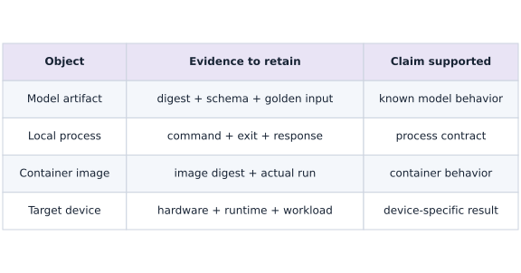
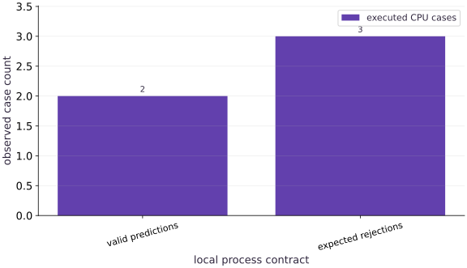

# Containerize a model service and verify its boundary

Phase 15: Deployment, interoperability & edge AI · about 110 minutes · CPU

## What you will be able to do

- Separate training from inference
- Understand the build context
- Keep runtime inputs explicit
- Prove the same request survives the boundary

## The problem

Your model works in a notebook, but another machine has a different interpreter, library set and working directory. Let’s export a small prediction artifact, verify it in a fresh process, then run the same boundary in a real Docker container.

## The idea

Containerization packages a runtime environment; a running container executes a process; a model artifact supplies versioned numerical content. Keeping these identities separate makes deployment and debugging reproducible.

## An image, a process and an artifact have different identities

A container image can start successfully while loading the wrong model path or configuration. Conversely, a valid model artifact can fail because the runtime lacks a compatible dependency. Record the image identity and model/configuration identities together.

Trace the build context into the image, then configuration and artifact mounts into the running process. Mark the request boundary where decoding, validation, inference and response encoding happen. A readiness signal should reflect the actual service contract, not merely process existence.

The current subprocess experiment demonstrates a process boundary. It is not evidence that a Docker build or container benchmark ran. Use that distinction when extending the lesson to your own container execution and keep the resulting receipt.

### What each deployment receipt proves

**Predict:** Which evidence would still be missing after the Python subprocess tests pass?



*Conceptual / analytic teaching diagram; not a recorded benchmark.*

Each row identifies an object and the evidence needed to make a claim about it. The current companion supplies artifact checks and fresh-process predictions. An actual container run must add image, user and runtime evidence; device qualification adds hardware and workload measurements. Do not fill later rows with results from an earlier boundary.

### Pause and reason

Does pinning a container image automatically pin a model loaded from a mutable path?

<details><summary>Compare your reasoning</summary>

No. The external artifact can change independently. Pin and verify its identity as part of the release configuration.

</details>

## Separate training from inference

Our service evaluates an exported scalar affine model using the Python standard library. The connected lab actually trains that model in JAX first. Inference does not need the optimizer, training data or MLflow server. This small portable contract makes it possible to compare Python-process, MLflow pyfunc and container outputs independently. Larger JAX exports need a compatible runtime and their own serialization checks; copying two coefficients does not demonstrate arbitrary graph portability.

## Understand the build context

Docker only sees the build context sent to the engine. The supplied .dockerignore excludes everything except Dockerfile and service.py, so local data, notebooks, environment files and training artifacts do not enter the image accidentally. COPY names only the service source. The base image is pinned by its observed digest, not just a moving tag. Pinning records an identity; you still need a deliberate dependency update process and image scanning.

## Keep runtime inputs explicit

MODEL_PATH selects a mounted artifact and MODEL_SHA256 verifies its bytes before serving. Configuration can be supplied at runtime; credentials belong in a runtime secret mechanism rather than build arguments or image layers. The container runs as a numeric non-root user, with a read-only filesystem and model mount. The default network-free check needs no published port. The optional HTTP mode binds a service port, enforces a small request-body and batch limit, and exposes readiness. It is a teaching server, not a production concurrency stack.

## Prove the same request survives the boundary

The CPU companion writes an artifact and starts a fresh Python process for every request. Singleton and changed-size batches must match independent arithmetic. An empty batch, boolean input and changed artifact digest are rejected. These are process checks; the connected Docker checker additionally builds the actual image, mounts the artifact, checks non-root execution, performs inference and tests readiness inside the running container. Keep those two evidence scopes distinct.

**Train and retain the model first**

```bash
# Run train and retain the model first using the course Python environment
python projects/engineering-release/mlflow_lab.py --output ./engineering-run
```

**Expected:** Creates model.json and report.json using actual tracked training.

**Build the local teaching image**

```bash
# Build the local teaching image
docker build -t jaxpathways-engineering:course projects/engineering-release
```

**Expected:** Build succeeds from the pinned base digest and copies only the inference service.

**Run the container qualification lab**

```bash
# Run run the container qualification lab using the course Python environment
python projects/engineering-release/container_check.py --model ./engineering-run/model.json --output ./container-report.json
```

**Expected:** Checks actual container predictions, digest rejection, non-root identity and HTTP readiness. Requires a running local Docker engine.

## Readiness, liveness and startup are different

A process can be alive while its model failed to load. Readiness should require a verified model and a completed smoke prediction; liveness asks whether the service is stuck. Docker HEALTHCHECK reports health but does not itself implement a rollout controller or restart policy. A Kubernetes startup probe can protect a slow load, readiness can remove an instance from service traffic, and liveness may restart it. Benchmark cold startup separately from warmed inference, then add concurrency and overload limits.

## Ship the artifact you actually checked

CI should run tests, build once, record the resulting image identity, verify the model and request contract, and attach evaluation evidence. Promote that immutable bundle into staging before selecting production. Rebuilding from a tag at deployment time can change the environment after testing. On accelerators, also verify drivers, runtime libraries, device discovery and kernel support. Even a passing CPU container receipt would not establish GPU or edge qualification.

## Matching bytes and valid model state are separate checks

A digest answers whether the bytes match an expected artifact. It does not answer whether those bytes encode a valid model. The service therefore checks the model's schema, version and finite coefficients after checking its digest. A valid artifact can still be the wrong model for a task, so the known request is a third check.

Change the weight from $2$ to $3$ without updating the expected digest: loading should fail. Update the digest as well: the artifact can now load, but the old expected scores must fail. This separates artifact identity from behavioral compatibility. A digest by itself is also not proof of who approved an artifact; record the approval and provenance separately.

### Pause and reason

Why does a correctly hashed artifact with a nonfinite weight still need to be rejected?

<details><summary>Compare your reasoning</summary>

The hash proves byte identity, while finite-value and schema checks establish whether the service can interpret the artifact under its contract. Hash verification cannot replace these semantic checks.

</details>

## Freeze a tiny model independently of training

Create main.py in your lesson workspace and run it with the active course Python environment. Write an inference artifact with a schema, one coefficient and one bias.

```python
# Step 1 — Freeze a tiny model independently of training: The independent probe computes 2\times2+1=5.
# Import hashlib, json, os, subprocess, sys, tempfile for this computation.
import hashlib, json, os, subprocess, sys, tempfile
from pathlib import Path
# Evaluate `MODEL` from the current inputs and state.
MODEL = {'schema': 1, 'weight': 2., 'bias': 1.}

# Verify contract: `MODEL['weight'] * 2 + MODEL['bias'] == 5`.
assert MODEL['weight']*2+MODEL['bias']==5
```

The independent probe computes $2\times2+1=5$. No training library is needed to state this model.

## Write the service boundary

Append this block to the same main.py and rerun the whole file. Define the separate service program. Read the order: digest, model schema, request validation, prediction and JSON encoding.

```python
# The deployment contract uses exported coefficients, not a training environment.
SERVICE = '''import hashlib,json,math,os,sys
raw=open(os.environ['MODEL_PATH'],'rb').read()
if hashlib.sha256(raw).hexdigest()!=os.environ['MODEL_SHA256']: raise ValueError('artifact mismatch')
m=json.loads(raw)
if not isinstance(m,dict) or set(m)!={'schema','weight','bias'}: raise ValueError('model schema')
if type(m['schema']) is not int or m['schema']!=1: raise ValueError('model schema version')
if any(type(m[k]) not in (int,float) or not math.isfinite(m[k]) for k in ('weight','bias')): raise ValueError('invalid coefficient')
x=json.load(sys.stdin)['inputs']
if not isinstance(x,list) or not 1<=len(x)<=32: raise ValueError('batch limit')
if any(type(v) not in (int,float) or not math.isfinite(v) for v in x): raise ValueError('invalid input')
print(json.dumps({'predictions':[m['weight']*v+m['bias'] for v in x]},allow_nan=False))
'''
```

The string is source code for a new process. This step defines it; the next step actually executes it. Notice that booleans are rejected even though Python treats bool as an integer subclass.

## Launch fresh processes and check both outcomes

Append this block to the same main.py and rerun the whole file. Materialize the artifact and program, then send valid and invalid requests.

```python
# Step 3 — Launch fresh processes and check both outcomes: Two valid batches pass and three deliberately invalid cases fail.
accepted, rejected = 0, 0
# Create an isolated temporary directory to run and inspect artifacts safely:
with tempfile.TemporaryDirectory(prefix='container-contract-') as folder:
    # Read or serialize artifact data on disk (`root`).
    # Evaluate `artifact` from the current inputs and state.
    # Evaluate `service` from the current inputs and state.
    root = Path(folder); artifact = root / 'model.json'; service = root / 'service.py'
    # Read or serialize artifact data on disk (``).
    # Read or serialize artifact data on disk (``).
    artifact.write_text(json.dumps(MODEL, sort_keys=True)); service.write_text(SERVICE)
    # Compute deterministic cryptographic digest `sha` for provenance verification.
    sha = hashlib.sha256(artifact.read_bytes()).hexdigest()
    # Configure environment variable before initializing the runtime.
    env = dict(os.environ, MODEL_PATH=str(artifact), MODEL_SHA256=sha)
    # Loop over `values` in `[[-0.5], [-2.0, 0.0, 1.5]]`:
    for values in [[-.5], [-2., 0., 1.5]]:
        # Read or serialize artifact data on disk (`completed`).
        completed = subprocess.run([sys.executable, str(service)], input=json.dumps({'inputs': values}), text=True, capture_output=True, env=env, check=True)
        # Read or serialize artifact data on disk (`actual`).
        actual = json.loads(completed.stdout)['predictions']
        # Verify that the output satisfies the expected shape, finite-value, or numerical contract.
        assert actual == [2 * value + 1 for value in values]
        # Accumulate the next contribution into `accepted`.
        accepted += 1
    # Loop over `(payload, changes)` in `[({'inputs': []}, {}), ({'inputs': [True]}, {}), ({'inputs': [0.0]}, {'MODEL_SHA256': '0' * 64})]`:
    for payload, changes in [({'inputs': []}, {}), ({'inputs': [True]}, {}), ({'inputs': [0.]}, {'MODEL_SHA256': '0' * 64})]:
        # Read or serialize artifact data on disk (`completed`).
        completed = subprocess.run([sys.executable, str(service)], input=json.dumps(payload), text=True, capture_output=True, env=dict(env, **changes))
        # Verify that the output satisfies the expected shape, finite-value, or numerical contract.
        # Accumulate the next contribution into `rejected`.
        assert completed.returncode != 0; rejected += 1
# Print the observed values to compare against the expected result.
print('Fresh-process valid requests:', accepted, 'rejected boundaries:', rejected)
# Print diagnostic summary of the computed outputs.
print('This companion tests the process/artifact contract. Run the Docker lab for container evidence.')
```

Two valid batches pass and three deliberately invalid cases fail. These are process checks. Use the separate Docker lab to gather image and runtime evidence.

## Run the example

```python
# Containerize a model service and verify its boundary: Containerization packages a runtime environment; a running...
# Import hashlib, json, os, subprocess, sys, tempfile for this computation.
import hashlib, json, os, subprocess, sys, tempfile
from pathlib import Path
# Evaluate `MODEL` from the current inputs and state.
MODEL = {'schema': 1, 'weight': 2., 'bias': 1.}
# The deployment contract uses exported coefficients, not a training environment.
SERVICE = '''import hashlib,json,math,os,sys
raw=open(os.environ['MODEL_PATH'],'rb').read()
if hashlib.sha256(raw).hexdigest()!=os.environ['MODEL_SHA256']: raise ValueError('artifact mismatch')
m=json.loads(raw)
if not isinstance(m,dict) or set(m)!={'schema','weight','bias'}: raise ValueError('model schema')
if type(m['schema']) is not int or m['schema']!=1: raise ValueError('model schema version')
if any(type(m[k]) not in (int,float) or not math.isfinite(m[k]) for k in ('weight','bias')): raise ValueError('invalid coefficient')
x=json.load(sys.stdin)['inputs']
if not isinstance(x,list) or not 1<=len(x)<=32: raise ValueError('batch limit')
if any(type(v) not in (int,float) or not math.isfinite(v) for v in x): raise ValueError('invalid input')
print(json.dumps({'predictions':[m['weight']*v+m['bias'] for v in x]},allow_nan=False))
'''
# Evaluate `(accepted, rejected)` from the current inputs and state.
accepted, rejected = 0, 0
# Create an isolated temporary directory to run and inspect artifacts safely:
with tempfile.TemporaryDirectory(prefix='container-contract-') as folder:
    # Read or serialize artifact data on disk (`root`).
    # Evaluate `artifact` from the current inputs and state.
    # Evaluate `service` from the current inputs and state.
    root = Path(folder); artifact = root / 'model.json'; service = root / 'service.py'
    # Read or serialize artifact data on disk (``).
    # Read or serialize artifact data on disk (``).
    artifact.write_text(json.dumps(MODEL, sort_keys=True)); service.write_text(SERVICE)
    # Compute deterministic cryptographic digest `sha` for provenance verification.
    sha = hashlib.sha256(artifact.read_bytes()).hexdigest()
    # Configure environment variable before initializing the runtime.
    env = dict(os.environ, MODEL_PATH=str(artifact), MODEL_SHA256=sha)
    # Loop over `values` in `[[-0.5], [-2.0, 0.0, 1.5]]`:
    for values in [[-.5], [-2., 0., 1.5]]:
        # Read or serialize artifact data on disk (`completed`).
        completed = subprocess.run([sys.executable, str(service)], input=json.dumps({'inputs': values}), text=True, capture_output=True, env=env, check=True)
        # Read or serialize artifact data on disk (`actual`).
        actual = json.loads(completed.stdout)['predictions']
        # Verify that the output satisfies the expected shape, finite-value, or numerical contract.
        assert actual == [2 * value + 1 for value in values]
        # Accumulate the next contribution into `accepted`.
        accepted += 1
    # Loop over `(payload, changes)` in `[({'inputs': []}, {}), ({'inputs': [True]}, {}), ({'inputs': [0.0]}, {'MODEL_SHA256': '0' * 64})]`:
    for payload, changes in [({'inputs': []}, {}), ({'inputs': [True]}, {}), ({'inputs': [0.]}, {'MODEL_SHA256': '0' * 64})]:
        # Read or serialize artifact data on disk (`completed`).
        completed = subprocess.run([sys.executable, str(service)], input=json.dumps(payload), text=True, capture_output=True, env=dict(env, **changes))
        # Verify that the output satisfies the expected shape, finite-value, or numerical contract.
        # Accumulate the next contribution into `rejected`.
        assert completed.returncode != 0; rejected += 1
# Print the observed values to compare against the expected result.
print('Fresh-process valid requests:', accepted, 'rejected boundaries:', rejected)
# Print diagnostic summary of the computed outputs.
print('This companion tests the process/artifact contract. Run the Docker lab for container evidence.')
```

Expected: Fresh-process valid requests: 2 rejected boundaries: 3
This companion tests the process/artifact contract. Run the Docker lab for container evidence.

## Observe the process boundary before containerizing it

**Predict:** Should invalid requests produce a prediction or a failed process?



**Recorded CPU computation**

### Read the figure

The horizontal categories separate the two valid request shapes from three deliberately invalid boundaries. Bar height is the number of cases observed by the local subprocess checker: $2$ successful prediction cases and $3$ expected rejections. These counts do not represent throughput, latency or a failure probability. Each success is also checked against independent affine arithmetic.

### Connect it to the computation

A container must preserve this contract. The Docker lab supplies additional engine, user and readiness evidence; this plot comes from ordinary Python processes and cannot prove image behavior by itself.

```python
# Compute figure data for: Observe the process boundary before containerizing it
# Evaluate `visual_data` from the current inputs and state.
visual_data={'kind':'bar','labels':['valid predictions','expected rejections'],'xlabel':'local process contract','ylabel':'observed case count','series':[{'label':'executed CPU cases','y':[accepted,rejected]}]}
```

## Recorded reference execution

CPU run: 2026-10-08T14:06:16.305452+00:00. JAX 0.9.2.

```text
Fresh-process valid requests: 2 rejected boundaries: 3
This companion tests the process/artifact contract. Run the Docker lab for container evidence.
Fresh-process valid requests: 2 rejected boundaries: 3
This companion tests the process/artifact contract. Run the Docker lab for container evidence.
Independent three-input predictions: 0.5, 2.5, 5.0
Matching digest did not bypass model validation.
Changed artifact requires a new recorded digest.
Nonfinite input rejected before output.
New artifact loads, but the old behavioral expectation no longer passes.
PASS: deployment-07

```

## Change the batch without changing the model

**Predict before running:** Will a three-element request give the same values as three singleton requests?

```python
# Experiment — Change the batch without changing the model: Batching changes transport shape, not the per-observation...
batch=[-.25,.75,2.]
# Verify contract: `[MODEL['weight'] * x + MODEL['bias'] for x in batch] == [0.5, 2.5, 5...`.
assert [MODEL['weight']*x+MODEL['bias'] for x in batch]==[.5,2.5,5.]
# Print the observed values to compare against the expected result.
print('Independent three-input predictions: 0.5, 2.5, 5.0')
```

**Expected:** Independent predictions are 0.5, 2.5 and 5.0.

Batching changes transport shape, not the per-observation prediction contract. A stateful or preprocessing-dependent service needs additional checks.

## Rehash an invalid model and watch validation reject it

**Predict before running:** Will a matching SHA-256 digest make an infinite model coefficient valid?

```python
# Experiment — Rehash an invalid model and watch validation reject it: Python accepts the nonstandard Infinity token in this fixture...
invalid_model = dict(MODEL, weight=float('inf'))
# Create an isolated temporary directory to run and inspect artifacts safely:
with tempfile.TemporaryDirectory() as directory:
    # Read or serialize artifact data on disk (`invalid_path`).
    invalid_path = Path(directory)/'model.json'
    # Read or serialize artifact data on disk (`runner_path`).
    runner_path = Path(directory)/'service.py'
    # Read or serialize artifact data on disk (``).
    # Read or serialize artifact data on disk (``).
    invalid_path.write_text(json.dumps(invalid_model)); runner_path.write_text(SERVICE)
    # Compute deterministic cryptographic digest `matching_digest` for provenance verification.
    matching_digest = hashlib.sha256(invalid_path.read_bytes()).hexdigest()
    # Configure environment variable before initializing the runtime.
    invalid_result = subprocess.run([sys.executable,str(runner_path)], input=json.dumps({'inputs':[0.]}), text=True,capture_output=True,env=dict(os.environ,MODEL_PATH=str(invalid_path),MODEL_SHA256=matching_digest),timeout=30)
    # Verify that the output satisfies the expected shape, finite-value, or numerical contract.
    assert invalid_result.returncode != 0 and 'invalid coefficient' in invalid_result.stderr
# Print the observed values to compare against the expected result.
print('Matching digest did not bypass model validation.')
```

**Expected:** The service rejects the nonfinite coefficient after the digest check passes.

Python accepts the nonstandard Infinity token in this fixture JSON; the explicit numerical contract still rejects it. This test is about process behavior, not evidence that a Docker image was built or exercised.

## Make it yours

Reject an artifact whose bytes changed after its expected digest was recorded.

### How to write this exercise — Step-by-step recipe & starter scaffold

**Key functions & syntax to use:**
- `json.dumps(...)` — Call `json.dumps` with your updated parameters or inputs from this lesson's workspace.
- `encode(...)` — Call `encode` with your updated parameters or inputs from this lesson's workspace.
- `assert condition` — Verify that the observed output shape, status, or numerical value satisfies the contract.

**Step-by-step implementation plan:**
1. Read or serialize artifact data on disk (`mutated`).
2. Verify contract: `hashlib.sha256(original).hexdigest() != hashlib.sha256(mutated).hexd...`.
3. Print the observed values to compare against the expected result.

**Starter code scaffold (fill in the TODOs):**

```python
# Exercise solution: Reject an artifact whose bytes changed after its expected digest was...
original = json.dumps(...)  # TODO: compute original
# Read or serialize artifact data on disk (`mutated`).
mutated = json.dumps(...)  # TODO: compute mutated
# Verify contract: `hashlib.sha256(original).hexdigest() != hashlib.sha256(mutated).hexd...`.
assert hashlib.sha256(original).hexdigest()  # TODO: complete assertion check
# Print the observed values to compare against the expected result.
print('Changed artifact requires a new recorded digest.')
```

<details><summary>Reference solution</summary>

```python
# Exercise solution: Reject an artifact whose bytes changed after its expected digest was...
original=json.dumps(MODEL,sort_keys=True).encode()
# Read or serialize artifact data on disk (`mutated`).
mutated=json.dumps(dict(MODEL,bias=2.),sort_keys=True).encode()
# Verify contract: `hashlib.sha256(original).hexdigest() != hashlib.sha256(mutated).hexd...`.
assert hashlib.sha256(original).hexdigest()!=hashlib.sha256(mutated).hexdigest()
# Print the observed values to compare against the expected result.
print('Changed artifact requires a new recorded digest.')
```

</details>

## Reject a nonfinite request

**transfer**

Send an infinite input to the process contract and verify the rejection.

<details><summary>Hint</summary>

The validation boundary should reject before producing JSON predictions.

</details>

### How to write: Reject a nonfinite request — Step-by-step recipe & starter scaffold

**Key functions & syntax to use:**
- `request(...)` — Call `request` with your updated parameters or inputs from this lesson's workspace.
- `tempfile.TemporaryDirectory(...)` — Call `tempfile.TemporaryDirectory` with your updated parameters or inputs from this lesson's workspace.
- `assert condition` — Verify that the observed output shape, status, or numerical value satisfies the contract.

**Step-by-step implementation plan:**
1. Reject a nonfinite request (transfer): A request can parse as JSON in Python while still violating...
2. Create an isolated temporary directory to run and inspect artifacts safely:
3. Read or serialize artifact data on disk (`p`).
4. Read or serialize artifact data on disk (``).
5. Read or serialize artifact data on disk (``).

**Starter code scaffold (fill in the TODOs):**

```python
# Reject a nonfinite request (transfer): A request can parse as JSON in Python while still violating...
# Create an isolated temporary directory to run and inspect artifacts safely:
with tempfile.TemporaryDirectory() as tmp:
    # Read or serialize artifact data on disk (`p`).
    # Read or serialize artifact data on disk (``).
    # Read or serialize artifact data on disk (``).
    p = Path(...)  # TODO: compute p
    # Configure environment variable before initializing the runtime.
    env = dict(...)  # TODO: compute env
    # Read or serialize artifact data on disk (`bad`).
    bad = subprocess.run(...)  # TODO: compute bad
    # Verify that the output satisfies the expected shape, finite-value, or numerical contract.
    assert bad.returncode  # TODO: complete assertion check
# Print the observed values to compare against the expected result.
print('Nonfinite input rejected before output.')
```

<details><summary>Reference solution and reasoning</summary>

```python
# Reject a nonfinite request (transfer): A request can parse as JSON in Python while still violating...
# Create an isolated temporary directory to run and inspect artifacts safely:
with tempfile.TemporaryDirectory() as tmp:
    # Read or serialize artifact data on disk (`p`).
    # Read or serialize artifact data on disk (``).
    # Read or serialize artifact data on disk (``).
    p=Path(tmp);(p/'model').write_text(json.dumps(MODEL));(p/'service.py').write_text(SERVICE)
    # Configure environment variable before initializing the runtime.
    env=dict(os.environ,MODEL_PATH=str(p/'model'),MODEL_SHA256=hashlib.sha256((p/'model').read_bytes()).hexdigest())
    # Read or serialize artifact data on disk (`bad`).
    bad=subprocess.run([sys.executable,str(p/'service.py')],input=json.dumps({'inputs':[float('inf')]}),text=True,capture_output=True,env=env)
    # Verify that the output satisfies the expected shape, finite-value, or numerical contract.
    assert bad.returncode != 0
# Print the observed values to compare against the expected result.
print('Nonfinite input rejected before output.')
```

A request can parse as JSON in Python while still violating the numerical service contract.

</details>

## Check changed behavior after a legitimate artifact replacement

**Transfer / diagnosis**

Create an artifact with weight $3$, keep bias $1$, and use its new matching digest. Check the result for input $2$, then compare with the previous model.

<details><summary>Hint</summary>

A legitimate new digest permits loading. Independent expected predictions decide whether the changed behavior is acceptable.

</details>

### How to write: Check changed behavior after a legitimate artifact replacement — Step-by-step recipe & starter scaffold

**Key functions & syntax to use:**
- `replacement(...)` — Call `replacement` with your updated parameters or inputs from this lesson's workspace.
- `tempfile.TemporaryDirectory(...)` — Call `tempfile.TemporaryDirectory` with your updated parameters or inputs from this lesson's workspace.
- `assert condition` — Verify that the observed output shape, status, or numerical value satisfies the contract.

**Step-by-step implementation plan:**
1. Create an isolated temporary directory to run and inspect artifacts safely:
2. Read or serialize artifact data on disk (`model_path`).
3. Read or serialize artifact data on disk (`runner_path`).
4. Read or serialize artifact data on disk (``).
5. Read or serialize artifact data on disk (``).

**Starter code scaffold (fill in the TODOs):**

```python
# Check changed behavior after a legitimate artifact replacement (Transfer / diagnosis): The old model produced 5; the new one produces 7.
# Create an isolated temporary directory to run and inspect artifacts safely:
with tempfile.TemporaryDirectory() as directory:
    # Read or serialize artifact data on disk (`model_path`).
    # Read or serialize artifact data on disk (`runner_path`).
    model_path = Path(...)  # TODO: compute model_path
    # Read or serialize artifact data on disk (``).
    # Read or serialize artifact data on disk (``).
    model_path.write_text(json.dumps(dict(MODEL,weight = ...  # TODO: compute model_path.write_text(json.dumps(dict(MODEL,weight
    # Compute deterministic cryptographic digest `digest` for provenance verification.
    digest = hashlib.sha256(...)  # TODO: compute digest
    # Configure environment variable before initializing the runtime.
    changed = subprocess.run(...)  # TODO: compute changed
    # Read or serialize artifact data on disk (`values`).
    values = json.loads(...)  # TODO: compute values
    # Verify that the output satisfies the expected shape, finite-value, or numerical contract.
    assert values  # TODO: complete assertion check
# Print the observed values to compare against the expected result.
print('New artifact loads, but the old behavioral expectation no longer passes.')
```

<details><summary>Reference solution and reasoning</summary>

```python
# Check changed behavior after a legitimate artifact replacement (Transfer / diagnosis): The old model produced 5; the new one produces 7.
# Create an isolated temporary directory to run and inspect artifacts safely:
with tempfile.TemporaryDirectory() as directory:
    # Read or serialize artifact data on disk (`model_path`).
    # Read or serialize artifact data on disk (`runner_path`).
    model_path=Path(directory)/'model.json';runner_path=Path(directory)/'service.py'
    # Read or serialize artifact data on disk (``).
    # Read or serialize artifact data on disk (``).
    model_path.write_text(json.dumps(dict(MODEL,weight=3.)));runner_path.write_text(SERVICE)
    # Compute deterministic cryptographic digest `digest` for provenance verification.
    digest=hashlib.sha256(model_path.read_bytes()).hexdigest()
    # Configure environment variable before initializing the runtime.
    changed=subprocess.run([sys.executable,str(runner_path)],input=json.dumps({'inputs':[2.]}),text=True,capture_output=True,check=True,env=dict(os.environ,MODEL_PATH=str(model_path),MODEL_SHA256=digest),timeout=30)
    # Read or serialize artifact data on disk (`values`).
    values=json.loads(changed.stdout)['predictions']
    # Verify that the output satisfies the expected shape, finite-value, or numerical contract.
    assert values==[7.] and values!=[5.]
# Print the observed values to compare against the expected result.
print('New artifact loads, but the old behavioral expectation no longer passes.')
```

The old model produced $5$; the new one produces $7$. Neither a successful build nor a matching digest decides whether that change is desirable. Retain both identities and compare the release against the intended task criteria.

</details>

## Check your understanding

The image built successfully. What should happen before serving traffic?

1. Assume the trained model is included and ready.
2. Load the expected artifact, verify its digest and complete a prediction through the target runtime.
3. Ignore preprocessing because dependencies are pinned.

<details><summary>Answer and explanation</summary>

Load the expected artifact, verify its digest and complete a prediction through the target runtime.

A container image packages the service runtime and code. The model artifact, runtime configuration and release identity are separate inputs. A reproducible service verifies all of them instead of assuming that an image tag names the same bytes forever.

</details>

## Diagnose the result

A missing model mount is a runtime configuration error, not a reason to rebuild the model into every image. Permission errors call for mount/user inspection. A successful local process check does not prove Docker is running. Keep engine and target failures in their own receipt.

## Carry forward

- Separate training from inference
- Prove the same request survives the boundary
- Ship the artifact you actually checked

## Keep your evidence

Keep the artifact digest, valid and rejected requests, fresh-process output and, when Docker is available, the actual image identity, runtime user and container qualification receipt.

Keep predictions, modified code, observed results, and reasoning. A checkpoint alone does not demonstrate the exercise.

## Primary references

- [Docker build best practices](https://docs.docker.com/build/building/best-practices/)
- [Dockerfile reference and health checks](https://docs.docker.com/reference/dockerfile/)
- [Kubernetes liveness, readiness and startup probes](https://kubernetes.io/docs/concepts/configuration/liveness-readiness-startup-probes/)

