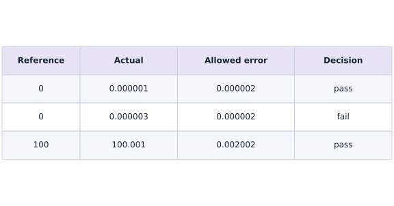
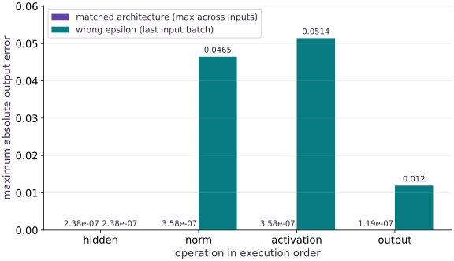

# Convert PyTorch weights to Flax and locate numerical errors

Phase 15: Deployment, interoperability & edge AI · about 130 minutes · CPU

## What you will be able to do

- Map named PyTorch tensors into Flax NNX parameters with complete key, shape and dtype checks.
- Locate the first mismatching operation using absolute and relative errors.
- Verify input gradients and reload the converted artifact independently.

## The problem

You copied a checkpoint and the new model runs, but its answers differ. Is the weight mapping wrong, or does the architecture compute a different function? We will load actual PyTorch tensors into a Flax NNX model and stop at the first layer whose values diverge.

## The idea

When a converted model disagrees with its reference, compare aligned intermediate activations on identical inputs. The earliest divergent boundary usually gives a more useful diagnosis than the final output alone.

## Find the earliest disagreement

Suppose the first dense output agrees but normalized activations do not. Inspect the normalization axis, epsilon and parameter mapping before changing the final layer. A later output difference may only be a consequence of the earlier mismatch.

Record absolute error and an appropriate relative measure. Near-zero references can make relative error large even when absolute error is small, so tolerances need scale and dtype context.

The layer-error plot identifies a location to investigate, not a universal threshold for all architectures. Use several inputs, including boundary cases, and compare the full preprocessing-to-output contract. Matching one fixture does not establish arbitrary checkpoint compatibility.

### Small errors need a scale-aware budget

**Predict:** Why can a larger absolute difference pass at a larger reference value?



*Conceptual / analytic teaching diagram; not a recorded benchmark.*

Read each row as one elementwise decision using absolute tolerance $2\times10^{-6}$ and relative tolerance $2\times10^{-5}$. Near zero the absolute term determines the allowance. At reference $100$, the relative term increases it. These are hand-worked tolerance examples, not measured conversion errors; the executed bar plot below reports the model comparison.

### Pause and reason

Why can only comparing final probabilities hide useful information?

<details><summary>Compare your reasoning</summary>

Different intermediate errors can cancel or be compressed by the final nonlinearity. Layerwise comparisons locate where the intended computation first changed.

</details>

## Write the architecture contract before mapping weights

Our input has shape $(B,3)$, the hidden width is $5$, and the output width is $2$. PyTorch Linear stores output-by-input weights, while Flax Linear uses input-by-output kernels, so transpose those two arrays. LayerNorm scale and bias stay one-dimensional and do not transpose. Require every expected key exactly once; ignoring unknown or missing parameters can silently leave random weights in the target.

## Match operations, not just tensors

Use the same LayerNorm epsilon, feature axes, variance convention and affine parameters. Select exact GELU in both frameworks instead of mixing exact and tanh approximations. Disable training-only behavior and match preprocessing, padding, positions and output labels before claiming parity. The Flax implementation disables the fast variance formula to make the comparison boundary explicit; float32 execution can still differ slightly across kernels.

## Use an error budget that works near zero

For each element, require the absolute difference to fit an absolute tolerance plus a relative tolerance times the reference magnitude. Absolute tolerance handles near-zero references; relative tolerance scales with large values. Report maximum absolute error and relative L2 error, but retain the elementwise decision so a small aggregate cannot hide a bad element. Set tolerances before inspecting the candidate, record dtype/backend, and never turn NaN into a passing comparison.

$$
|y_i-\widehat y_i|\leq a+r|y_i|,\qquad e_{\mathrm{rel},2}=\frac{\|y-\widehat y\|_2}{\max(\|y\|_2,10^{-12})}
$$

## Find the first mismatch

Capture hidden linear output, normalized values, activation and final logits for the same inputs. A wrong LayerNorm epsilon leaves the hidden linear output correct but changes the normalized output first. Later mismatches may be consequences rather than separate bugs. Use several batch sizes and amplitudes: one large random batch can miss epsilon-sensitive or near-zero behavior.

## Validate the derivative and the saved artifact

For a scalar sum of outputs, compare gradients with respect to the input in both frameworks. Then save the Flax arrays with architecture metadata and reload them before inference. The project also starts a fresh process for this step. Only load trusted checkpoint sources; weights_only loading limits the PyTorch loading path but does not establish authenticity or universal safety.

## Extend the mapping deliberately

Convolution kernels may require OIHW to HWIO permutations, not a dense transpose. Attention may fuse query/key/value tensors or arrange heads differently. Tied embeddings, normalization order, rotary positions and vocabulary row order can all change behavior despite matching shapes. Add these operations one at a time with golden inputs and intermediate comparisons. This lesson validates its named MLP only; those additional architectures need their own executed mappings.

## Read an error budget one element at a time

A relative error alone behaves badly near a zero reference. Use an absolute allowance $a$ near zero and a relative allowance $r$ for larger values. For a reference $y$ and converted value $\hat y$, the allowed difference is $a+r|y|$. The reference is deliberately the source value; exchanging the two arguments changes the budget slightly.

With $a=2\times10^{-6}$ and $r=2\times10^{-5}$, a reference of zero allows $2\times10^{-6}$ absolute error. An error of $10^{-6}$ passes even though dividing by the reference is undefined. At reference $100$, the budget is $0.002002$, so an error of $0.001$ passes. These tolerances are declared checks for this FP32 fixture. Derive and test a different budget for a different computation or precision policy.

$$
|\hat y_i-y_i|\leq a+r|y_i|
$$

### Pause and reason

An output near zero differs by $3\times10^{-6}$. Does a small relative-L2 error over the whole tensor guarantee it passes?

<details><summary>Compare your reasoning</summary>

No. The per-element absolute allowance near zero is about $2\times10^{-6}$. A global norm can conceal one failing element among many large, accurate values. Keep the elementwise gate as well as summary metrics.

</details>

## Probe more than the sum of the outputs

The companion compares the input gradient of the sum of outputs. That is one projection of the Jacobian: it weights every output equally. Opposing errors can cancel in that projection. Use a nonuniform output sensitivity, called a cotangent, to ask how a different weighted combination changes with the input.

Keep the source in evaluation mode, use the same input and cotangent, and reset the PyTorch input gradient before comparing. Inspect the first failing forward boundary before studying derivative differences. Matching this additional probe strengthens the test; it still does not prove equality of the entire Jacobian for every input.

$$
J(x)^{\mathsf T}v=\nabla_x\left(\sum_i v_i f_i(x)\right)
$$

## Make the source boundaries inspectable

Create main.py in your lesson workspace and run it with the active course Python environment. Define the source model so every named operation returns its intermediate result.

```python
"""Explicit CPU PyTorch -> Flax NNX mapping; no generic architecture converter."""
import numpy as np
import jax
import jax.numpy as jnp
import torch
from flax import nnx

class TorchModel(torch.nn.Module):
    def __init__(self, eps=1e-5):
        super().__init__()
        self.hidden=torch.nn.Linear(3,5)
        self.norm=torch.nn.LayerNorm(5,eps=eps)
        self.out=torch.nn.Linear(5,2)
    def forward(self,x):
        h=self.hidden(x);n=self.norm(h);a=torch.nn.functional.gelu(n,approximate='none')
        return {'hidden':h,'norm':n,'activation':a,'output':self.out(a)}

assert TorchModel().eval()(torch.zeros((2,3)))['output'].shape == (2,2)

```

The probe has two observations and returns an output of shape $(2,2)$. It also exposes hidden, normalization and activation tensors for diagnosis.

## Write the same operations in Flax

Append this block to the same main.py and rerun the whole file. Match dimensions, normalization epsilon, variance calculation and exact GELU.

```python
class FlaxModel(nnx.Module):
    def __init__(self,eps=1e-5):
        self.hidden=nnx.Linear(3,5,rngs=nnx.Rngs(0))
        self.norm=nnx.LayerNorm(5,epsilon=eps,use_fast_variance=False,rngs=nnx.Rngs(1))
        self.out=nnx.Linear(5,2,rngs=nnx.Rngs(2))
    def __call__(self,x):
        h=self.hidden(x);n=self.norm(h);a=jax.nn.gelu(n,approximate=False)
        return {'hidden':h,'norm':n,'activation':a,'output':self.out(a)}

assert FlaxModel()(jnp.zeros((2,3)))['output'].shape == (2,2)

```

The probe again returns shape $(2,2)$. At this point random parameters differ; matching shapes does not mean matching predictions.

## Map each parameter and declare tolerances

Append this block to the same main.py and rerun the whole file. Copy checked source arrays into named destination parameters. Compare a hidden output with an independent matrix calculation.

```python
def convert(state,eps=1e-5):
    shapes={'hidden.weight':(5,3),'hidden.bias':(5,),'norm.weight':(5,),'norm.bias':(5,),'out.weight':(2,5),'out.bias':(2,)}
    if set(state)!=set(shapes):raise ValueError('missing or unexpected state key')
    arrays={}
    for name,shape in shapes.items():
        value=state[name].detach().cpu().numpy()
        if value.shape!=shape or value.dtype!=np.float32 or not np.isfinite(value).all():
            raise ValueError('unexpected shape, dtype or nonfinite tensor: '+name)
        arrays[name]=value.copy()
    target=FlaxModel(eps)
    target.hidden.kernel[...]=jnp.asarray(arrays['hidden.weight'].T)
    target.hidden.bias[...]=jnp.asarray(arrays['hidden.bias'])
    target.norm.scale[...]=jnp.asarray(arrays['norm.weight'])
    target.norm.bias[...]=jnp.asarray(arrays['norm.bias'])
    target.out.kernel[...]=jnp.asarray(arrays['out.weight'].T)
    target.out.bias[...]=jnp.asarray(arrays['out.bias'])
    return target

def error_report(reference,actual,atol=2e-6,rtol=2e-5):
    reference=np.asarray(reference,dtype=np.float64);actual=np.asarray(actual,dtype=np.float64)
    if reference.shape!=actual.shape or not np.isfinite(reference).all() or not np.isfinite(actual).all():
        raise ValueError('shape or finite-value mismatch')
    if min(atol,rtol)<0 or not np.isfinite([atol,rtol]).all():raise ValueError('invalid tolerances')
    absolute=np.abs(actual-reference)
    budget=atol+rtol*np.abs(reference)
    return {'max_abs':float(absolute.max()),'relative_l2':float(np.linalg.norm(actual-reference)/max(np.linalg.norm(reference),1e-12)),
            'passed':bool(np.all(absolute<=budget))}

step_source = TorchModel().eval()
step_target = convert(step_source.state_dict())
step_input = np.array([[1., -2., .5]], np.float32)
step_expected = step_input @ step_source.hidden.weight.detach().numpy().T + step_source.hidden.bias.detach().numpy()
np.testing.assert_allclose(step_target(jnp.asarray(step_input))['hidden'], step_expected, rtol=2e-5, atol=2e-6)

```

The hidden-layer check passes after transposing the source kernel. A missing key or wrong source shape should fail before inference.

## Save and reload the converted state

Append this block to the same main.py and rerun the whole file. Store architecture metadata with the arrays and rebuild the target from that archive.

```python
def save_flax(model,path):
    np.savez(path,hidden_kernel=np.asarray(model.hidden.kernel[...]),hidden_bias=np.asarray(model.hidden.bias[...]),
             norm_scale=np.asarray(model.norm.scale[...]),norm_bias=np.asarray(model.norm.bias[...]),
             out_kernel=np.asarray(model.out.kernel[...]),out_bias=np.asarray(model.out.bias[...]),
             epsilon=np.array(model.norm.epsilon),schema=np.array(1))

def load_flax(path):
    shapes={'hidden_kernel':(3,5),'hidden_bias':(5,),'norm_scale':(5,),'norm_bias':(5,),'out_kernel':(5,2),'out_bias':(2,)}
    with np.load(path,allow_pickle=False) as archive:
        if set(archive.files)!=set(shapes)|{'epsilon','schema'}:raise ValueError('unexpected archive schema')
        if archive['schema'].shape!=() or int(archive['schema'])!=1:raise ValueError('unknown schema')
        if archive['epsilon'].shape!=():raise ValueError('epsilon must be scalar')
        eps=float(archive['epsilon'])
        if not np.isfinite(eps) or eps<=0:raise ValueError('invalid epsilon')
        arrays={}
        for key,shape in shapes.items():
            value=archive[key]
            if value.shape!=shape or value.dtype!=np.float32 or not np.isfinite(value).all():raise ValueError('invalid array '+key)
            arrays[key]=value.copy()
    model=FlaxModel(eps)
    for module,name,key in [(model.hidden,'kernel','hidden_kernel'),(model.hidden,'bias','hidden_bias'),(model.norm,'scale','norm_scale'),(model.norm,'bias','norm_bias'),(model.out,'kernel','out_kernel'),(model.out,'bias','out_bias')]:
        getattr(module,name)[...]=jnp.asarray(arrays[key])
    return model

import tempfile
from pathlib import Path
with tempfile.TemporaryDirectory() as step_folder:
    step_path = Path(step_folder) / 'roundtrip.npz'
    save_flax(step_target, step_path)
    step_reloaded = load_flax(step_path)
    np.testing.assert_allclose(step_reloaded(jnp.asarray(step_input))['output'], step_target(jnp.asarray(step_input))['output'], rtol=2e-5, atol=2e-6)

```

The temporary round trip preserves a probe output. The loader validates the array set, dtype, shape and epsilon; a filename alone establishes none of these properties.

## Compare input regimes and reproduce a mismatch

Append this block to the same main.py and rerun the whole file. Run the fixed-seed source, layerwise comparison, derivative checks and wrong-epsilon intervention.

```python
import tempfile
from pathlib import Path
torch.set_num_threads(1)
torch.manual_seed(9)
source=TorchModel().eval()
# A real local state_dict file, loaded using the tensor-only loading option.
with tempfile.TemporaryDirectory() as folder:
    checkpoint=Path(folder)/'weights.pt';torch.save(source.state_dict(),checkpoint)
    state=torch.load(checkpoint,map_location='cpu',weights_only=True)
    target=convert(state)
    # Save the converted weights independently of the live PyTorch object.
    converted=Path(folder)/'flax-weights.npz'
    save_flax(target,converted)
    target=load_flax(converted)
    errors={name:[] for name in ['hidden','norm','activation','output']}
    for batch,scale in [(1,1.),(7,1e-3),(5,4.)]:
        inputs=np.random.default_rng(batch).normal(size=(batch,3)).astype(np.float32)*scale
        tx=torch.tensor(inputs,requires_grad=True);torch_values=source(tx);flax_values=target(jnp.asarray(inputs))
        for name in errors:
            report=error_report(torch_values[name].detach().numpy(),flax_values[name]);assert report['passed'],(name,report)
            errors[name].append(report['max_abs'])
        torch_values['output'].sum().backward()
        input_gradient=jax.grad(lambda z:jnp.sum(target(z)['output']))(jnp.asarray(inputs))
        assert error_report(tx.grad.numpy(),input_gradient,atol=5e-6,rtol=5e-5)['passed']
    wrong=convert(state,eps=.1)
    reference={k:v.detach().numpy() for k,v in source(torch.tensor(inputs)).items()}
    wrong_reports={k:error_report(reference[k],v) for k,v in wrong(jnp.asarray(inputs)).items()}
    assert wrong_reports['hidden']['passed'] and not wrong_reports['norm']['passed']
    for bad in [dict(state,unexpected=torch.zeros(1)),{k:v for k,v in state.items() if k!='norm.bias'}]:
        try:convert(bad)
        except ValueError:pass
        else:raise AssertionError('incomplete mapping accepted')
print('Maximum absolute error per layer:',{k:max(v) for k,v in errors.items()})
print('Wrong epsilon: first mismatch is norm; intermediate outputs and input gradients verified on CPU.')

```

The original epsilon passes all declared gates. Changing only epsilon leaves the hidden layer unchanged and first fails normalization. Use that first mismatch to choose a repair.

## Run the example

```python
"""Explicit CPU PyTorch -> Flax NNX mapping; no generic architecture converter."""
import numpy as np
import jax
import jax.numpy as jnp
import torch
from flax import nnx

class TorchModel(torch.nn.Module):
    def __init__(self, eps=1e-5):
        super().__init__()
        self.hidden=torch.nn.Linear(3,5)
        self.norm=torch.nn.LayerNorm(5,eps=eps)
        self.out=torch.nn.Linear(5,2)
    def forward(self,x):
        h=self.hidden(x);n=self.norm(h);a=torch.nn.functional.gelu(n,approximate='none')
        return {'hidden':h,'norm':n,'activation':a,'output':self.out(a)}

class FlaxModel(nnx.Module):
    def __init__(self,eps=1e-5):
        self.hidden=nnx.Linear(3,5,rngs=nnx.Rngs(0))
        self.norm=nnx.LayerNorm(5,epsilon=eps,use_fast_variance=False,rngs=nnx.Rngs(1))
        self.out=nnx.Linear(5,2,rngs=nnx.Rngs(2))
    def __call__(self,x):
        h=self.hidden(x);n=self.norm(h);a=jax.nn.gelu(n,approximate=False)
        return {'hidden':h,'norm':n,'activation':a,'output':self.out(a)}

def convert(state,eps=1e-5):
    shapes={'hidden.weight':(5,3),'hidden.bias':(5,),'norm.weight':(5,),'norm.bias':(5,),'out.weight':(2,5),'out.bias':(2,)}
    if set(state)!=set(shapes):raise ValueError('missing or unexpected state key')
    arrays={}
    for name,shape in shapes.items():
        value=state[name].detach().cpu().numpy()
        if value.shape!=shape or value.dtype!=np.float32 or not np.isfinite(value).all():
            raise ValueError('unexpected shape, dtype or nonfinite tensor: '+name)
        arrays[name]=value.copy()
    target=FlaxModel(eps)
    target.hidden.kernel[...]=jnp.asarray(arrays['hidden.weight'].T)
    target.hidden.bias[...]=jnp.asarray(arrays['hidden.bias'])
    target.norm.scale[...]=jnp.asarray(arrays['norm.weight'])
    target.norm.bias[...]=jnp.asarray(arrays['norm.bias'])
    target.out.kernel[...]=jnp.asarray(arrays['out.weight'].T)
    target.out.bias[...]=jnp.asarray(arrays['out.bias'])
    return target

def error_report(reference,actual,atol=2e-6,rtol=2e-5):
    reference=np.asarray(reference,dtype=np.float64);actual=np.asarray(actual,dtype=np.float64)
    if reference.shape!=actual.shape or not np.isfinite(reference).all() or not np.isfinite(actual).all():
        raise ValueError('shape or finite-value mismatch')
    if min(atol,rtol)<0 or not np.isfinite([atol,rtol]).all():raise ValueError('invalid tolerances')
    absolute=np.abs(actual-reference)
    budget=atol+rtol*np.abs(reference)
    return {'max_abs':float(absolute.max()),'relative_l2':float(np.linalg.norm(actual-reference)/max(np.linalg.norm(reference),1e-12)),
            'passed':bool(np.all(absolute<=budget))}

def save_flax(model,path):
    np.savez(path,hidden_kernel=np.asarray(model.hidden.kernel[...]),hidden_bias=np.asarray(model.hidden.bias[...]),
             norm_scale=np.asarray(model.norm.scale[...]),norm_bias=np.asarray(model.norm.bias[...]),
             out_kernel=np.asarray(model.out.kernel[...]),out_bias=np.asarray(model.out.bias[...]),
             epsilon=np.array(model.norm.epsilon),schema=np.array(1))

def load_flax(path):
    shapes={'hidden_kernel':(3,5),'hidden_bias':(5,),'norm_scale':(5,),'norm_bias':(5,),'out_kernel':(5,2),'out_bias':(2,)}
    with np.load(path,allow_pickle=False) as archive:
        if set(archive.files)!=set(shapes)|{'epsilon','schema'}:raise ValueError('unexpected archive schema')
        if archive['schema'].shape!=() or int(archive['schema'])!=1:raise ValueError('unknown schema')
        if archive['epsilon'].shape!=():raise ValueError('epsilon must be scalar')
        eps=float(archive['epsilon'])
        if not np.isfinite(eps) or eps<=0:raise ValueError('invalid epsilon')
        arrays={}
        for key,shape in shapes.items():
            value=archive[key]
            if value.shape!=shape or value.dtype!=np.float32 or not np.isfinite(value).all():raise ValueError('invalid array '+key)
            arrays[key]=value.copy()
    model=FlaxModel(eps)
    for module,name,key in [(model.hidden,'kernel','hidden_kernel'),(model.hidden,'bias','hidden_bias'),(model.norm,'scale','norm_scale'),(model.norm,'bias','norm_bias'),(model.out,'kernel','out_kernel'),(model.out,'bias','out_bias')]:
        getattr(module,name)[...]=jnp.asarray(arrays[key])
    return model

import tempfile
from pathlib import Path
torch.set_num_threads(1)
torch.manual_seed(9)
source=TorchModel().eval()
# A real local state_dict file, loaded using the tensor-only loading option.
with tempfile.TemporaryDirectory() as folder:
    checkpoint=Path(folder)/'weights.pt';torch.save(source.state_dict(),checkpoint)
    state=torch.load(checkpoint,map_location='cpu',weights_only=True)
    target=convert(state)
    # Save the converted weights independently of the live PyTorch object.
    converted=Path(folder)/'flax-weights.npz'
    save_flax(target,converted)
    target=load_flax(converted)
    errors={name:[] for name in ['hidden','norm','activation','output']}
    for batch,scale in [(1,1.),(7,1e-3),(5,4.)]:
        inputs=np.random.default_rng(batch).normal(size=(batch,3)).astype(np.float32)*scale
        tx=torch.tensor(inputs,requires_grad=True);torch_values=source(tx);flax_values=target(jnp.asarray(inputs))
        for name in errors:
            report=error_report(torch_values[name].detach().numpy(),flax_values[name]);assert report['passed'],(name,report)
            errors[name].append(report['max_abs'])
        torch_values['output'].sum().backward()
        input_gradient=jax.grad(lambda z:jnp.sum(target(z)['output']))(jnp.asarray(inputs))
        assert error_report(tx.grad.numpy(),input_gradient,atol=5e-6,rtol=5e-5)['passed']
    wrong=convert(state,eps=.1)
    reference={k:v.detach().numpy() for k,v in source(torch.tensor(inputs)).items()}
    wrong_reports={k:error_report(reference[k],v) for k,v in wrong(jnp.asarray(inputs)).items()}
    assert wrong_reports['hidden']['passed'] and not wrong_reports['norm']['passed']
    for bad in [dict(state,unexpected=torch.zeros(1)),{k:v for k,v in state.items() if k!='norm.bias'}]:
        try:convert(bad)
        except ValueError:pass
        else:raise AssertionError('incomplete mapping accepted')
print('Maximum absolute error per layer:',{k:max(v) for k,v in errors.items()})
print('Wrong epsilon: first mismatch is norm; intermediate outputs and input gradients verified on CPU.')

```

Expected: Correct FP32 conversion passes layerwise and input-gradient tolerances on three input regimes. A changed LayerNorm epsilon first fails at norm; missing and unexpected keys are rejected.

## Locate the first divergent layer

**Predict:** Which bar should remain near zero when only LayerNorm epsilon is wrong?



**Recorded CPU computation**

### Read the figure

The horizontal categories follow execution order: hidden linear, normalization, activation and output. Bars show maximum absolute difference in that layer’s output units. The correct mapping remains near floating-point rounding error; the changed-epsilon model first diverges at normalization. The earlier matching hidden output narrows the cause. These are numerical errors, not accuracy or latency.

### Connect it to the computation

All weights are identical between the correct and wrong-epsilon target models. A parameter-file comparison alone would miss the changed operation. Later error may grow or shrink through nonlinearities and the output projection, so the largest bar is not necessarily the location of the original bug. The per-element tolerance and gradient checks are reported separately from this plot.

```python
visual_data={'kind':'bar','labels':list(errors),'xlabel':'operation in execution order','ylabel':'maximum absolute output error','series':[{'label':'matched architecture (max across inputs)','y':[max(v) for v in errors.values()]},{'label':'wrong epsilon (last input batch)','y':[wrong_reports[k]['max_abs'] for k in errors]}]}
```

## Recorded reference execution

CPU run: 2026-10-06T23:04:02.419910+00:00. JAX 0.9.2.

```text
Maximum absolute error per layer: {'hidden': 2.384185791015625e-07, 'norm': 3.5762786865234375e-07, 'activation': 3.5762786865234375e-07, 'output': 1.1920928955078125e-07}
Wrong epsilon: first mismatch is norm; intermediate outputs and input gradients verified on CPU.
Maximum absolute error per layer: {'hidden': 2.384185791015625e-07, 'norm': 3.5762786865234375e-07, 'activation': 3.5762786865234375e-07, 'output': 1.1920928955078125e-07}
Wrong epsilon: first mismatch is norm; intermediate outputs and input gradients verified on CPU.
Per-layer wrong-epsilon report: {'hidden': {'max_abs': 2.384185791015625e-07, 'relative_l2': 3.5662515782829134e-08, 'passed': True}, 'norm': {'max_abs': 0.046508073806762695, 'relative_l2': 0.018277932316979384, 'passed': False}, 'activation': {'max_abs': 0.05144989490509033, 'relative_l2': 0.022399576976497533, 'passed': False}, 'output': {'max_abs': 0.011958837509155273, 'relative_l2': 0.013684121610437203, 'passed': False}}
Near-zero, excessive near-zero, large-value: True False True
Near-zero acceptance and rejection verified.
Wrong source layout rejected
Nonuniform cotangent input-gradient parity: {'max_abs': 2.086162567138672e-07, 'relative_l2': 4.910744924550249e-07, 'passed': True}
PASS: deployment-08

```

## Inspect the wrong-epsilon signature

**Predict before running:** Will the dense hidden output fail when only normalization epsilon changes?

```python
assert wrong_reports['hidden']['passed']
assert not wrong_reports['norm']['passed']
print('Per-layer wrong-epsilon report:',wrong_reports)
```

**Expected:** The first dense layer passes; normalization fails first.

Localize the first divergent operation before remapping unrelated weights. The plot records downstream effects as well as the first failure.

## Test the tolerance rule near zero

**Predict before running:** Which differences pass at a zero reference and at a reference of $100$?

```python
near_zero = error_report([0.], [1e-6])
near_zero_fail = error_report([0.], [3e-6])
large_value = error_report([100.], [100.001])
assert near_zero['passed'] and not near_zero_fail['passed'] and large_value['passed']
print('Near-zero, excessive near-zero, large-value:', near_zero['passed'], near_zero_fail['passed'], large_value['passed'])

```

**Expected:** The three decisions are pass, fail, pass.

The gate checks each element against a reference-dependent budget. A single relative-error percentage is not a substitute.

## Make it yours

Compare a near-zero reference against two candidate errors. Verify that the absolute tolerance accepts rounding noise but rejects a meaningful discrepancy.

<details><summary>Reference solution</summary>

```python
assert error_report([0.,1.],[1e-7,1.000001])['passed']
assert not error_report([0.,1.],[1e-3,1.])['passed']
print('Near-zero acceptance and rejection verified.')
```

</details>

## Reject a plausible but wrong tensor layout

**Transfer**

Transpose the first PyTorch weight before conversion and prove the boundary rejects it instead of transposing it a second time.

<details><summary>Hint</summary>

The first weight is rectangular, so validate its source shape before applying the mapping.

</details>

<details><summary>Reference solution and reasoning</summary>

```python
bad_state=dict(state);bad_state['hidden.weight']=state['hidden.weight'].T
try:convert(bad_state)
except ValueError:print('Wrong source layout rejected')
else:raise AssertionError('layout mismatch accepted')
```

Asymmetric dimensions expose orientation errors that square test matrices can hide. Shape checks complement numerical checks rather than replacing them.

</details>

## Check a nonuniform output sensitivity

**Transfer / diagnosis**

Compare the source and converted input gradients for an output cotangent that contains unequal positive and negative entries. Explain what this tests beyond summing the outputs.

<details><summary>Hint</summary>

Form the same scalar weighted output in each framework. Create a fresh PyTorch input so earlier gradients do not accumulate.

</details>

<details><summary>Reference solution and reasoning</summary>

```python
probe_inputs = np.array([[.2, -.7, 1.1], [1., .4, -.5]], np.float32)
cotangent = np.array([[1., -.5], [2., .25]], np.float32)
probe_torch = torch.tensor(probe_inputs, requires_grad=True)
weighted_source = (source(probe_torch)['output'] * torch.tensor(cotangent)).sum()
weighted_source.backward()
weighted_target = jax.grad(lambda z: jnp.sum(target(z)['output'] * jnp.asarray(cotangent)))(jnp.asarray(probe_inputs))
vjp_report = error_report(probe_torch.grad.numpy(), weighted_target, atol=5e-6, rtol=5e-5)
assert vjp_report['passed'], vjp_report
print('Nonuniform cotangent input-gradient parity:', vjp_report)

```

This checks $J^{\mathsf T}v$ for a second, nonuniform direction. It can reveal errors hidden by an all-ones sensitivity. The same activation, normalization and parameter mapping must support both forward and derivative agreement.

</details>

## Check your understanding

The first linear layer agrees, but LayerNorm is the first mismatch. What should you inspect next?

1. Normalization axes, variance calculation, epsilon and affine parameters.
2. Relax every tolerance until the final outputs pass.
3. Assume successful checkpoint loading proves parity.

<details><summary>Answer and explanation</summary>

Normalization axes, variance calculation, epsilon and affine parameters.

The earliest mismatch narrows the investigation. Downstream error is often the propagated effect of that first difference.

</details>

## Diagnose the result

Reject missing, extra, malformed or nonfinite weights before assignment. If the first linear output differs, inspect orientation and bias. If normalization first differs, inspect its contract. If forward outputs agree but gradients differ, inspect operation approximations and differentiability; retain both results.

## Keep your evidence

Keep source checkpoint and architecture identity, complete parameter mapping, per-layer max-absolute/relative-L2 errors, elementwise tolerances, input-gradient comparisons, wrong-epsilon diagnosis and a fresh-process converted-artifact receipt.

Keep predictions, modified code, observed results, and reasoning. A checkpoint alone does not demonstrate the exercise.

## Primary references

- [PyTorch state_dict and weights-only loading](https://docs.pytorch.org/tutorials/beginner/saving_loading_models.html)
- [Flax NNX Linear](https://flax.readthedocs.io/en/latest/api_reference/flax.nnx/nn/linear.html)

