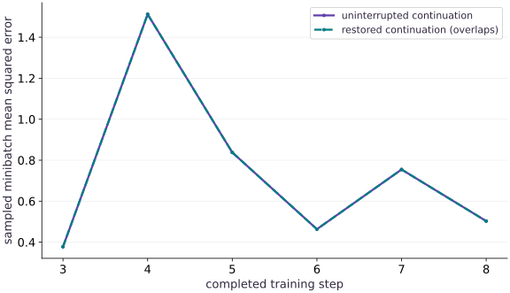

# Failure recovery and operational runbooks

Phase 16: Workload operations · about 110 minutes · CPU

## What you will be able to do

- Rehearse a real worker failure and resume from an atomic complete-state checkpoint.
- Verify the next update and every later state against an uninterrupted reference.
- Reject corrupted or incompatible recovery artifacts and record a usable runbook.

## The problem

A restarted job reaches a plausible final loss, but did it continue the same experiment? We will force a worker to fail after an uncheckpointed update, restore its last committed state, and compare every subsequent update with an uninterrupted run. A matching final metric alone will not be accepted as recovery evidence.

## The idea

An operational runbook connects a symptom with evidence, a decision and a verified recovery action. Its purpose is to reduce uncertainty during failure, not merely list restart commands.

## A runbook should choose the next diagnostic action

For an interrupted training job, first identify the failure boundary and newest accepted compatible checkpoint. Verify data, configuration and artifact identity before resuming. A restart from a convenient file can silently become a new experiment.

After recovery, compare the next data and state transition with the expected continuation. If that comparison fails, preserve the mismatch and investigate the state boundary rather than repeatedly restarting.

The replayed loss curve checks one part of the fixture. A complete incident record also explains what failed, why the selected recovery point was valid, what work was replayed and which observation confirmed the repair. Keep prevention work separate from the immediate restoration action.

### Pause and reason

What makes “restart the job” an incomplete runbook instruction?

<details><summary>Compare your reasoning</summary>

It does not identify a valid recovery point, compatibility checks or a success criterion. Specify those decisions and the evidence needed to make them.

</details>

## Identify the boundary before issuing a retry

The default job checkpoints after even-numbered updates. We inject failure after update $3$, leaving a committed checkpoint at step $2$. The runbook first confirms that the failed child is gone, preserves its events, then reads and validates that checkpoint. Blindly restarting from the beginning would repeat more work; continuing from the progress counter $3$ with checkpoint state $2$ would skip a state transition.

## Momentum is part of the experiment

For gradient $g_t$, velocity follows $v_{t+1}=\beta v_t+g_t$, and parameters follow $\theta_{t+1}=\theta_t-\alpha v_{t+1}$. Restoring only parameters sets the wrong velocity for the next step. Likewise, reseeding the generator returns to earlier minibatches instead of continuing the saved key. The serialized key is the actual legacy uint32 key array used by this worker, not a guessed integer seed.

$$
v_{t+1}=\beta v_t+g_t,\qquad \theta_{t+1}=\theta_t-\alpha v_{t+1}
$$

## Write the complete artifact before selecting it

The worker serializes state and its checksum into a sibling pending file, flushes and fsyncs the file, then uses os.replace to select it as the checkpoint. Readers see either the old complete file or the new complete file under the local filesystem’s replace contract. This avoids selecting a half-written JSON payload. It does not prove survival of a machine power loss or atomic behavior on an arbitrary remote filesystem; directory synchronization and storage-specific guarantees would need separate validation.

## Compatibility is more than array shape

The checkpoint includes schema version, data hash, training-configuration hash and worker-source hash. Restore checks these before accepting values, then checks parameter, velocity and key shapes and finite numeric state. A checksum detects accidental payload corruption; it is not a signature against an adversary who can edit both state and checksum. Operational controls such as failure injection and total requested steps are excluded from the training hash so a compatible retry can finish the intended work.

## Prove the continuation at the next update

The first restored progress event is update $3$, and its full-state hash must equal update $3$ from the uninterrupted run. We compare every remaining update and the final checkpoint, not only the final parameters. Wall-clock timestamps and timing samples should differ; they are observability metadata, not deterministic training state. Exact replay is bounded to this pinned CPU example, not promised across changed JAX versions or accelerator kernels.

## Write a runbook from the failed drill

Use the actual trace: confirm process exit; preserve logs; find the latest committed step; validate checksum and provenance; restore into a single writer; verify the first new update; continue and compare completion artifacts. Escalate an incompatible checkpoint instead of silently deleting fields or relaxing checks. A failed rehearsal is useful evidence about the runbook, whereas an untested list of commands is only a proposal.

## Create the local artifact helpers

Create main.py with this block. Run python3 main.py in the CPU course environment.

```python
# Step 1: Create the local artifact helpers
"""Bounded local JAX workload operations. No scheduler, cloud, or GPU emulator."""
# Import pathlib (Path) for this computation.
from pathlib import Path
import hashlib
import json
import math
import os
import subprocess
import sys
import tempfile
import time


# Function `digest(value)` implementing this stage's computation:
def digest(value):
    # Return `hashlib.sha256(json.dumps(value, sort_keys=True, separators=(',', ':'), allow_nan=False).encode()).hexdigest()` to the caller.
    return hashlib.sha256(json.dumps(value, sort_keys=True, separators=(',', ':'), allow_nan=False).encode()).hexdigest()


# Function `atomic_json(path, value)` implementing this stage's computation:
def atomic_json(path, value):
    """Replace one local JSON file only after its bytes have been flushed."""
    # Read or serialize artifact data on disk (`path`).
    # Execute the next step of the computation.
    path = Path(path); path.parent.mkdir(parents=True, exist_ok=True)
    # Run `tempfile.mkstemp` to compute `(fd, temporary)`.
    fd, temporary = tempfile.mkstemp(prefix=path.name+'.', suffix='.tmp', dir=path.parent)
    # Run the boundary check and catch the expected exception:
    try:
        # Enter `os.fdopen(fd, 'w')` context block:
        with os.fdopen(fd, 'w') as stream:
            json.dump(value, stream, sort_keys=True, allow_nan=False)
            stream.flush(); os.fsync(stream.fileno())
        os.replace(temporary, path)
    finally:
        if os.path.exists(temporary): os.unlink(temporary)
```

The only filesystem writes are to the caller-selected run directory. Stable JSON encoding makes hashes reproducible.

## Define the supervised worker

Append this block to main.py. Run python3 main.py in the CPU course environment.

```python
# This file is materialized only inside the caller-owned temporary run folder.
WORKER = r'''
import hashlib, json, os, sys, time
from pathlib import Path
import jax
import jax.numpy as jnp
import numpy as np
root = Path(sys.argv[1])
cfg = json.loads((root/'config.json').read_text())
worker_hash = hashlib.sha256(Path(__file__).read_bytes()).hexdigest()
def emit(event, **fields):
    print(json.dumps(dict(event=event, monotonic_s=time.monotonic(), **fields)), flush=True)
def digest(value):
    return hashlib.sha256(json.dumps(value,sort_keys=True,separators=(',', ':'),allow_nan=False).encode()).hexdigest()
def write_checkpoint(state):
    target = root/'checkpoint.json'; temporary = root/'checkpoint.pending'
    with temporary.open('w') as stream:
        json.dump(dict(state,checksum=digest(state)),stream,sort_keys=True,allow_nan=False)
        stream.flush(); os.fsync(stream.fileno())
    os.replace(temporary,target)
    emit('checkpoint',step=state['step'],state_hash=digest(state))
try:
    emit('started',pid=os.getpid(),backend=jax.default_backend(),device_count=jax.device_count())
    if jax.default_backend() != cfg['backend'] or jax.device_count() < cfg['min_devices']:
        raise ValueError('runtime backend/device contract failed')
    x = jnp.linspace(-1.,1.,64); y = 2*x+1
    data_hash = digest(dict(x=np.asarray(x).tolist(),y=np.asarray(y).tolist()))
    training = {name:cfg[name] for name in ('seed','learning_rate','momentum','batch_size')}
    config_hash = digest(training)
    if cfg['resume']:
        saved = json.loads((root/'checkpoint.json').read_text())
        checksum = saved.pop('checksum',None)
        if checksum != digest(saved) or saved.get('worker_hash') != worker_hash:
            raise ValueError('checkpoint checksum/source mismatch')
        if saved['schema_version'] != 1 or saved['config_hash'] != config_hash or saved['data_hash'] != data_hash:
            raise ValueError('checkpoint provenance mismatch')
        state = saved
        step = saved['step']; params=jnp.array(saved['params']); velocity=jnp.array(saved['velocity']); key=jnp.array(saved['key'],dtype=jnp.uint32)
        if not isinstance(step,int) or isinstance(step,bool) or step < 0 or step > cfg['steps'] or params.shape != (2,) or velocity.shape != (2,) or key.shape != (2,):
            raise ValueError('invalid checkpoint state shape or step')
        if not bool(jnp.all(jnp.isfinite(params))) or not bool(jnp.all(jnp.isfinite(velocity))):
            raise ValueError('nonfinite checkpoint state')
        emit('restored',step=step,state_hash=digest(saved))
    else:
        step=0; params=jnp.zeros(2);velocity=jnp.zeros(2);key=jax.random.PRNGKey(cfg['seed'])
    def update(params,velocity,key):
        key, sample = jax.random.split(key)
        indices=jax.random.choice(sample,64,(cfg['batch_size'],),replace=False)
        objective=lambda p:jnp.mean((p[0]*x[indices]+p[1]-y[indices])**2)
        loss, grad=jax.value_and_grad(objective)(params)
        velocity=cfg['momentum']*velocity+grad
        params=params-cfg['learning_rate']*velocity
        return params,velocity,key,loss
    compiled=jax.jit(update)
    # Compile and synchronize once without consuming actual training state.
    begin=time.perf_counter();warm=compiled(params,velocity,key);jax.block_until_ready(warm)
    emit('ready',compile_warmup_s=time.perf_counter()-begin,step=step)
    while step < cfg['steps']:
        if cfg.get('stall_at') == step:
            emit('stall_injected',step=step)
            time.sleep(cfg.get('stall_seconds',10.))
        begin=time.perf_counter()
        params,velocity,key,loss=compiled(params,velocity,key);jax.block_until_ready((params,velocity,key,loss))
        elapsed=time.perf_counter()-begin;step+=1
        state=dict(schema_version=1,worker_hash=worker_hash,step=step,params=np.asarray(params).tolist(),velocity=np.asarray(velocity).tolist(),key=np.asarray(key).tolist(),config_hash=config_hash,data_hash=data_hash)
        emit('progress',step=step,loss=float(loss),examples=cfg['batch_size'],update_s=elapsed,state_hash=digest(state))
        if step % cfg['checkpoint_every'] == 0 or step == cfg['steps']:
            write_checkpoint(state)
        if cfg.get('fail_after') == step:
            raise RuntimeError('controlled failure after update')
    write_checkpoint(state)
    emit('completed',step=step,state_hash=digest(state))
except Exception as error:
    emit('failed',kind=type(error).__name__,message=str(error))
    raise SystemExit(23)
'''
```

The string is a real Python program launched in a separate process. It emits structured events, synchronizes JAX updates and preserves complete state.

## Add bounded launch and result collection

Append this block to main.py. Run python3 main.py in the CPU course environment.

```python
# Step 3 — Add bounded launch and result collection: The supervisor owns the child handle, captures its output and...
def default_config(**changes):
    # Evaluate `seed=3, learning_rate=0.04, momentum=0.8, batch_size=8, steps=8, checkpoint_every=2, backend='cpu', min_devices=1, resume=False, fail_after=None, stall_at=None, stall_seconds=10.0` and convert the result into Python scalar/collection `cfg`.
    cfg=dict(seed=3,learning_rate=.04,momentum=.8,batch_size=8,steps=8,
             checkpoint_every=2,backend='cpu',min_devices=1,resume=False,
             fail_after=None,stall_at=None,stall_seconds=10.)
    # Update state in place with the new values.
    cfg.update(changes)
    # Iterate over `name` to step through the computation:
    for name in ('steps','checkpoint_every','batch_size','min_devices'):
        # Guard input contract (`not isinstance(cfg[name], int) or isinstance(cfg[name], bool) or cfg[name] < 1`) and fail fast if violated.
        if not isinstance(cfg[name],int) or isinstance(cfg[name],bool) or cfg[name] < 1: raise ValueError(name+' must be a positive integer')
    # Guard input contract (`cfg['batch_size'] > 64 or not 0 <= cfg['momentum'] < 1 or (not 0 < cfg['learning_rate'] < 1)`) and fail fast if violated.
    if cfg['batch_size'] > 64 or not 0 <= cfg['momentum'] < 1 or not 0 < cfg['learning_rate'] < 1:
        raise ValueError('invalid training configuration')
    # Return `cfg` to the caller.
    return cfg


# Function `launch(root, config, timeout)` implementing this stage's computation:
def launch(root, config=None, timeout=10.):
    # Read or serialize artifact data on disk (`root`).
    # Execute the next step of the computation.
    root=Path(root);root.mkdir(parents=True,exist_ok=True)
    # Run `default_config` to compute `cfg`.
    cfg=default_config(**(config or {}))
    # Guard input contract (`timeout <= 0`) and fail fast if violated.
    if timeout <= 0: raise ValueError('timeout must be positive')
    # Run `atomic_json` to perform the next check or state transition.
    atomic_json(root/'config.json',cfg)
    # Evaluate `worker` from the current inputs and state.
    # Read or serialize artifact data on disk (``).
    worker=root/'worker.py';worker.write_text(WORKER)
    # Configure environment variable before initializing the runtime.
    env=dict(os.environ,JAX_PLATFORMS=cfg['backend'],PYTHONUNBUFFERED='1')
    # Record execution timing or profiler trace in `started`.
    started=time.perf_counter()
    # Read or serialize artifact data on disk (`process`).
    process=subprocess.Popen([sys.executable,str(worker),str(root)],stdout=subprocess.PIPE,stderr=subprocess.PIPE,text=True,env=env)
    # Evaluate `timed_out` from the current inputs and state.
    timed_out=False
    try:
        stdout,stderr=process.communicate(timeout=timeout)
    except subprocess.TimeoutExpired:
        timed_out=True;process.terminate()
        try: stdout,stderr=process.communicate(timeout=1.)
        except subprocess.TimeoutExpired:
            process.kill();stdout,stderr=process.communicate(timeout=1.)
    # Record execution timing or profiler trace in `wall`.
    wall=time.perf_counter()-started
    # Evaluate `events` from the current inputs and state.
    # Evaluate `malformed` from the current inputs and state.
    events=[]; malformed=[]
    # Loop over `line` in `stdout.splitlines()`:
    for line in stdout.splitlines():
        # Branch on condition `not line.strip()`:
        if not line.strip(): continue
        try:
            event=json.loads(line)
            if not isinstance(event,dict) or 'event' not in event: raise ValueError('not an event')
            events.append(event)
        except (ValueError,TypeError): malformed.append(line)
    # Evaluate `status` from the current inputs and state.
    status='timed_out' if timed_out else 'completed' if process.returncode == 0 and not malformed and events and events[-1]['event']=='completed' else 'failed'
    # Compute deterministic cryptographic digest `result` for provenance verification.
    result=dict(status=status,returncode=process.returncode,wall_s=wall,events=events,stderr=stderr,
                worker_hash=hashlib.sha256(WORKER.encode()).hexdigest(),config=cfg,malformed_stdout=malformed)
    # Run `atomic_json` to perform the next check or state transition.
    atomic_json(root/'run.json',result)
    # Return `result` to the caller.
    return result
```

The supervisor owns the child handle, captures its output and always waits for termination after a timeout.

## Rehearse a failure and verify every resumed update

Append this block to main.py. Run python3 main.py in the CPU course environment.

```python
# Step 4 — Rehearse a failure and verify every resumed update: All files stay inside one temporary drill directory; the two runs...
# Create an isolated temporary directory to run and inspect artifacts safely:
with tempfile.TemporaryDirectory(prefix='ops-recovery-') as folder:
    # Read or serialize artifact data on disk (`base`).
    base=Path(folder)
    # Run `launch` to compute `uninterrupted`.
    uninterrupted=launch(base/'full')
    # Run `launch` to compute `failed`.
    failed=launch(base/'resume',dict(fail_after=3))
    # Read or serialize artifact data on disk (`committed`).
    committed=json.loads((base/'resume'/'checkpoint.json').read_text())
    # Verify that the output satisfies the expected shape, finite-value, or numerical contract.
    assert committed['step']==2
    # Run `launch` to compute `resumed`.
    resumed=launch(base/'resume',dict(resume=True))
    # Read or serialize artifact data on disk (`final_full`).
    final_full=json.loads((base/'full'/'checkpoint.json').read_text())
    # Read or serialize artifact data on disk (`final_resumed`).
    final_resumed=json.loads((base/'resume'/'checkpoint.json').read_text())
# Verify contract: `failed['status'] == 'failed' and resumed['status'] == 'completed'`.
assert failed['status']=='failed' and resumed['status']=='completed'
# Verify that the output satisfies the expected shape, finite-value, or numerical contract.
assert final_full==final_resumed
# Evaluate `full_events` from the current inputs and state.
full_events={e['step']:e for e in uninterrupted['events'] if e['event']=='progress'}
# Evaluate `resume_events` from the current inputs and state.
resume_events=[e for e in resumed['events'] if e['event']=='progress']
# Verify contract: `[e['step'] for e in resume_events] == [3, 4, 5, 6, 7, 8]`.
assert [e['step'] for e in resume_events]==[3,4,5,6,7,8]
# Verify that the output satisfies the expected shape, finite-value, or numerical contract.
assert all(e['state_hash']==full_events[e['step']]['state_hash'] for e in resume_events)
# Print the observed values to compare against the expected result.
print('restored step:',committed['step'],'replayed updates:',[e['step'] for e in resume_events])
# Print diagnostic summary of the computed outputs.
print('all next-update state hashes match:',final_full==final_resumed)
```

All files stay inside one temporary drill directory; the two runs have independent output paths.

## Run the example

```python
# Complete runnable example (operations-03)
"""Bounded local JAX workload operations. No scheduler, cloud, or GPU emulator."""
# Import pathlib (Path) for this computation.
from pathlib import Path
import hashlib
import json
import math
import os
import subprocess
import sys
import tempfile
import time


# Function `digest(value)` implementing this stage's computation:
def digest(value):
    # Return `hashlib.sha256(json.dumps(value, sort_keys=True, separators=(',', ':'), allow_nan=False).encode()).hexdigest()` to the caller.
    return hashlib.sha256(json.dumps(value, sort_keys=True, separators=(',', ':'), allow_nan=False).encode()).hexdigest()


# Function `atomic_json(path, value)` implementing this stage's computation:
def atomic_json(path, value):
    """Replace one local JSON file only after its bytes have been flushed."""
    # Read or serialize artifact data on disk (`path`).
    # Execute the next step of the computation.
    path = Path(path); path.parent.mkdir(parents=True, exist_ok=True)
    # Run `tempfile.mkstemp` to compute `(fd, temporary)`.
    fd, temporary = tempfile.mkstemp(prefix=path.name+'.', suffix='.tmp', dir=path.parent)
    # Run the boundary check and catch the expected exception:
    try:
        # Enter `os.fdopen(fd, 'w')` context block:
        with os.fdopen(fd, 'w') as stream:
            json.dump(value, stream, sort_keys=True, allow_nan=False)
            stream.flush(); os.fsync(stream.fileno())
        os.replace(temporary, path)
    finally:
        if os.path.exists(temporary): os.unlink(temporary)

# This file is materialized only inside the caller-owned temporary run folder.
WORKER = r'''
import hashlib, json, os, sys, time
from pathlib import Path
import jax
import jax.numpy as jnp
import numpy as np
root = Path(sys.argv[1])
cfg = json.loads((root/'config.json').read_text())
worker_hash = hashlib.sha256(Path(__file__).read_bytes()).hexdigest()
def emit(event, **fields):
    print(json.dumps(dict(event=event, monotonic_s=time.monotonic(), **fields)), flush=True)
def digest(value):
    return hashlib.sha256(json.dumps(value,sort_keys=True,separators=(',', ':'),allow_nan=False).encode()).hexdigest()
def write_checkpoint(state):
    target = root/'checkpoint.json'; temporary = root/'checkpoint.pending'
    with temporary.open('w') as stream:
        json.dump(dict(state,checksum=digest(state)),stream,sort_keys=True,allow_nan=False)
        stream.flush(); os.fsync(stream.fileno())
    os.replace(temporary,target)
    emit('checkpoint',step=state['step'],state_hash=digest(state))
try:
    emit('started',pid=os.getpid(),backend=jax.default_backend(),device_count=jax.device_count())
    if jax.default_backend() != cfg['backend'] or jax.device_count() < cfg['min_devices']:
        raise ValueError('runtime backend/device contract failed')
    x = jnp.linspace(-1.,1.,64); y = 2*x+1
    data_hash = digest(dict(x=np.asarray(x).tolist(),y=np.asarray(y).tolist()))
    training = {name:cfg[name] for name in ('seed','learning_rate','momentum','batch_size')}
    config_hash = digest(training)
    if cfg['resume']:
        saved = json.loads((root/'checkpoint.json').read_text())
        checksum = saved.pop('checksum',None)
        if checksum != digest(saved) or saved.get('worker_hash') != worker_hash:
            raise ValueError('checkpoint checksum/source mismatch')
        if saved['schema_version'] != 1 or saved['config_hash'] != config_hash or saved['data_hash'] != data_hash:
            raise ValueError('checkpoint provenance mismatch')
        state = saved
        step = saved['step']; params=jnp.array(saved['params']); velocity=jnp.array(saved['velocity']); key=jnp.array(saved['key'],dtype=jnp.uint32)
        if not isinstance(step,int) or isinstance(step,bool) or step < 0 or step > cfg['steps'] or params.shape != (2,) or velocity.shape != (2,) or key.shape != (2,):
            raise ValueError('invalid checkpoint state shape or step')
        if not bool(jnp.all(jnp.isfinite(params))) or not bool(jnp.all(jnp.isfinite(velocity))):
            raise ValueError('nonfinite checkpoint state')
        emit('restored',step=step,state_hash=digest(saved))
    else:
        step=0; params=jnp.zeros(2);velocity=jnp.zeros(2);key=jax.random.PRNGKey(cfg['seed'])
    def update(params,velocity,key):
        key, sample = jax.random.split(key)
        indices=jax.random.choice(sample,64,(cfg['batch_size'],),replace=False)
        objective=lambda p:jnp.mean((p[0]*x[indices]+p[1]-y[indices])**2)
        loss, grad=jax.value_and_grad(objective)(params)
        velocity=cfg['momentum']*velocity+grad
        params=params-cfg['learning_rate']*velocity
        return params,velocity,key,loss
    compiled=jax.jit(update)
    # Compile and synchronize once without consuming actual training state.
    begin=time.perf_counter();warm=compiled(params,velocity,key);jax.block_until_ready(warm)
    emit('ready',compile_warmup_s=time.perf_counter()-begin,step=step)
    while step < cfg['steps']:
        if cfg.get('stall_at') == step:
            emit('stall_injected',step=step)
            time.sleep(cfg.get('stall_seconds',10.))
        begin=time.perf_counter()
        params,velocity,key,loss=compiled(params,velocity,key);jax.block_until_ready((params,velocity,key,loss))
        elapsed=time.perf_counter()-begin;step+=1
        state=dict(schema_version=1,worker_hash=worker_hash,step=step,params=np.asarray(params).tolist(),velocity=np.asarray(velocity).tolist(),key=np.asarray(key).tolist(),config_hash=config_hash,data_hash=data_hash)
        emit('progress',step=step,loss=float(loss),examples=cfg['batch_size'],update_s=elapsed,state_hash=digest(state))
        if step % cfg['checkpoint_every'] == 0 or step == cfg['steps']:
            write_checkpoint(state)
        if cfg.get('fail_after') == step:
            raise RuntimeError('controlled failure after update')
    write_checkpoint(state)
    emit('completed',step=step,state_hash=digest(state))
except Exception as error:
    emit('failed',kind=type(error).__name__,message=str(error))
    raise SystemExit(23)
'''

# Step 3 — Add bounded launch and result collection: The supervisor owns the child handle, captures its output and...
def default_config(**changes):
    # Evaluate `seed=3, learning_rate=0.04, momentum=0.8, batch_size=8, steps=8, checkpoint_every=2, backend='cpu', min_devices=1, resume=False, fail_after=None, stall_at=None, stall_seconds=10.0` and convert the result into Python scalar/collection `cfg`.
    cfg=dict(seed=3,learning_rate=.04,momentum=.8,batch_size=8,steps=8,
             checkpoint_every=2,backend='cpu',min_devices=1,resume=False,
             fail_after=None,stall_at=None,stall_seconds=10.)
    # Update state in place with the new values.
    cfg.update(changes)
    # Iterate over `name` to step through the computation:
    for name in ('steps','checkpoint_every','batch_size','min_devices'):
        # Guard input contract (`not isinstance(cfg[name], int) or isinstance(cfg[name], bool) or cfg[name] < 1`) and fail fast if violated.
        if not isinstance(cfg[name],int) or isinstance(cfg[name],bool) or cfg[name] < 1: raise ValueError(name+' must be a positive integer')
    # Guard input contract (`cfg['batch_size'] > 64 or not 0 <= cfg['momentum'] < 1 or (not 0 < cfg['learning_rate'] < 1)`) and fail fast if violated.
    if cfg['batch_size'] > 64 or not 0 <= cfg['momentum'] < 1 or not 0 < cfg['learning_rate'] < 1:
        raise ValueError('invalid training configuration')
    # Return `cfg` to the caller.
    return cfg


# Function `launch(root, config, timeout)` implementing this stage's computation:
def launch(root, config=None, timeout=10.):
    # Read or serialize artifact data on disk (`root`).
    # Execute the next step of the computation.
    root=Path(root);root.mkdir(parents=True,exist_ok=True)
    # Run `default_config` to compute `cfg`.
    cfg=default_config(**(config or {}))
    # Guard input contract (`timeout <= 0`) and fail fast if violated.
    if timeout <= 0: raise ValueError('timeout must be positive')
    # Run `atomic_json` to perform the next check or state transition.
    atomic_json(root/'config.json',cfg)
    # Evaluate `worker` from the current inputs and state.
    # Read or serialize artifact data on disk (``).
    worker=root/'worker.py';worker.write_text(WORKER)
    # Configure environment variable before initializing the runtime.
    env=dict(os.environ,JAX_PLATFORMS=cfg['backend'],PYTHONUNBUFFERED='1')
    # Record execution timing or profiler trace in `started`.
    started=time.perf_counter()
    # Read or serialize artifact data on disk (`process`).
    process=subprocess.Popen([sys.executable,str(worker),str(root)],stdout=subprocess.PIPE,stderr=subprocess.PIPE,text=True,env=env)
    # Evaluate `timed_out` from the current inputs and state.
    timed_out=False
    try:
        stdout,stderr=process.communicate(timeout=timeout)
    except subprocess.TimeoutExpired:
        timed_out=True;process.terminate()
        try: stdout,stderr=process.communicate(timeout=1.)
        except subprocess.TimeoutExpired:
            process.kill();stdout,stderr=process.communicate(timeout=1.)
    # Record execution timing or profiler trace in `wall`.
    wall=time.perf_counter()-started
    # Evaluate `events` from the current inputs and state.
    # Evaluate `malformed` from the current inputs and state.
    events=[]; malformed=[]
    # Loop over `line` in `stdout.splitlines()`:
    for line in stdout.splitlines():
        # Branch on condition `not line.strip()`:
        if not line.strip(): continue
        try:
            event=json.loads(line)
            if not isinstance(event,dict) or 'event' not in event: raise ValueError('not an event')
            events.append(event)
        except (ValueError,TypeError): malformed.append(line)
    # Evaluate `status` from the current inputs and state.
    status='timed_out' if timed_out else 'completed' if process.returncode == 0 and not malformed and events and events[-1]['event']=='completed' else 'failed'
    # Compute deterministic cryptographic digest `result` for provenance verification.
    result=dict(status=status,returncode=process.returncode,wall_s=wall,events=events,stderr=stderr,
                worker_hash=hashlib.sha256(WORKER.encode()).hexdigest(),config=cfg,malformed_stdout=malformed)
    # Run `atomic_json` to perform the next check or state transition.
    atomic_json(root/'run.json',result)
    # Return `result` to the caller.
    return result

# Step 4 — Rehearse a failure and verify every resumed update: All files stay inside one temporary drill directory; the two runs...
# Create an isolated temporary directory to run and inspect artifacts safely:
with tempfile.TemporaryDirectory(prefix='ops-recovery-') as folder:
    # Read or serialize artifact data on disk (`base`).
    base=Path(folder)
    # Run `launch` to compute `uninterrupted`.
    uninterrupted=launch(base/'full')
    # Run `launch` to compute `failed`.
    failed=launch(base/'resume',dict(fail_after=3))
    # Read or serialize artifact data on disk (`committed`).
    committed=json.loads((base/'resume'/'checkpoint.json').read_text())
    # Verify that the output satisfies the expected shape, finite-value, or numerical contract.
    assert committed['step']==2
    # Run `launch` to compute `resumed`.
    resumed=launch(base/'resume',dict(resume=True))
    # Read or serialize artifact data on disk (`final_full`).
    final_full=json.loads((base/'full'/'checkpoint.json').read_text())
    # Read or serialize artifact data on disk (`final_resumed`).
    final_resumed=json.loads((base/'resume'/'checkpoint.json').read_text())
# Verify contract: `failed['status'] == 'failed' and resumed['status'] == 'completed'`.
assert failed['status']=='failed' and resumed['status']=='completed'
# Verify that the output satisfies the expected shape, finite-value, or numerical contract.
assert final_full==final_resumed
# Evaluate `full_events` from the current inputs and state.
full_events={e['step']:e for e in uninterrupted['events'] if e['event']=='progress'}
# Evaluate `resume_events` from the current inputs and state.
resume_events=[e for e in resumed['events'] if e['event']=='progress']
# Verify contract: `[e['step'] for e in resume_events] == [3, 4, 5, 6, 7, 8]`.
assert [e['step'] for e in resume_events]==[3,4,5,6,7,8]
# Verify that the output satisfies the expected shape, finite-value, or numerical contract.
assert all(e['state_hash']==full_events[e['step']]['state_hash'] for e in resume_events)
# Print the observed values to compare against the expected result.
print('restored step:',committed['step'],'replayed updates:',[e['step'] for e in resume_events])
# Print diagnostic summary of the computed outputs.
print('all next-update state hashes match:',final_full==final_resumed)
```

Expected: The failure leaves checkpoint step $2$. Resuming replays steps $3$ through $8$, and every complete-state hash plus the final checkpoint matches uninterrupted execution.

## Resumed loss follows the same continuation

**Predict:** Should timing and loss both match after a restart?



**Recorded CPU computation**

### Read the figure

The horizontal axis is completed training step; the vertical axis is that update’s sampled minibatch mean squared error. The plot zooms in on updates $3$ through $8$. Both lines cover that continuation, because the restored boundary was step $2$; the first two uninterrupted updates are outside this plotted interval. Its points lie on top of the uninterrupted points for the remaining updates. In the recorded run, loss rises from about $0.38$ at update $3$ to $1.51$ at update $4$, falls to about $0.46$ at update $6$, and rises again near $0.75$ at update $7$. Both executions share those same changes. The visible rebounds therefore do not indicate a restore mismatch.

### Connect it to the computation

The overlap is supported by equality checks of the complete state hashes, not inferred merely from a visually similar curve. The loss can move unevenly because each update samples a minibatch. Restart timing is deliberately absent: compilation, process startup and checkpoint reading add overhead even when the numerical continuation is exact.

```python
# Compute figure data for: Resumed loss follows the same continuation
# Evaluate `visual_data` from the current inputs and state.
visual_data={'kind':'line','x':list(range(3,9)),'xlabel':'completed training step','ylabel':'sampled minibatch mean squared error','series':[{'label':'uninterrupted continuation','y':[full_events[i]['loss'] for i in range(3,9)]},{'label':'restored continuation (overlaps)','y':[e['loss'] for e in resume_events]}]}
```

## Recorded reference execution

CPU run: 2026-10-08T14:07:19.693318+00:00. JAX 0.9.2.

```text
restored step: 2 replayed updates: [3, 4, 5, 6, 7, 8]
all next-update state hashes match: True
restored step: 2 replayed updates: [3, 4, 5, 6, 7, 8]
all next-update state hashes match: True
PASS: operations-03

```

## Compare state, not only loss

**Predict before running:** Could two different states have the same current loss?

```python
# Experiment — Compare state, not only loss: Loss is a scalar projection of a much larger state; equal loss...
# Iterate over `event` to step through the computation:
for event in resume_events:
    # Evaluate `original` from the current inputs and state.
    original=full_events[event['step']]
    # Verify contract: `event['state_hash'] == original['state_hash']`.
    assert event['state_hash']==original['state_hash']
    # Verify that the output satisfies the expected shape, finite-value, or numerical contract.
    assert event['loss']==original['loss']
# Verify contract: `all((name in committed for name in ['params', 'velocity', 'key', 'st...`.
assert all(name in committed for name in ['params','velocity','key','step','data_hash','config_hash','worker_hash'])
```

**Expected:** All state fields and later hashes support the continuation claim.

Loss is a scalar projection of a much larger state; equal loss alone would not prove the next update is correct.

## Reject a changed training rule

**Predict before running:** Should a learning-rate change be silently accepted as an exact resume?

```python
# Experiment — Reject a changed training rule: A deliberate branch experiment is valid when explicitly labeled,...
# Create an isolated temporary directory to run and inspect artifacts safely:
with tempfile.TemporaryDirectory() as folder:
    # Run `launch` to perform the next check or state transition.
    launch(folder,dict(steps=4))
    # Run `launch` to compute `incompatible`.
    incompatible=launch(folder,dict(steps=8,resume=True,learning_rate=.05))
# Verify contract: `incompatible['status'] == 'failed'`.
assert incompatible['status']=='failed'
# Verify that the output satisfies the expected shape, finite-value, or numerical contract.
assert any(e['event']=='failed' and 'provenance' in e['message'] for e in incompatible['events'])
```

**Expected:** Restore rejects the incompatible training configuration.

A deliberate branch experiment is valid when explicitly labeled, but it is not the same-run recovery being tested here.

## Make it yours

Repeat the recovery drill with seed $9$, checkpoint cadence $3$ and failure after update $5$. Verify restoration at step $3$ and equality with a matching uninterrupted run.

### How to write this exercise — Step-by-step recipe & starter scaffold

**Key functions & syntax to use:**
- `tempfile.TemporaryDirectory(...)` — Call `tempfile.TemporaryDirectory` with your updated parameters or inputs from this lesson's workspace.
- `disk(...)` — Call `disk` with your updated parameters or inputs from this lesson's workspace.
- `assert condition` — Verify that the observed output shape, status, or numerical value satisfies the contract.

**Step-by-step implementation plan:**
1. Create an isolated temporary directory to run and inspect artifacts safely:
2. Read or serialize artifact data on disk (`base`).
3. Evaluate `seed=9, checkpoint_every=3` and convert the result into Python scalar/collection `cfg`.
4. Run `launch` to compute `ref`.
5. Run `launch` to compute `broken`.

**Starter code scaffold (fill in the TODOs):**

```python
# Exercise solution: Repeat the recovery drill with seed 9, checkpoint cadence 3 and...
# Create an isolated temporary directory to run and inspect artifacts safely:
with tempfile.TemporaryDirectory() as folder:
    # Read or serialize artifact data on disk (`base`).
    # Evaluate `seed=9, checkpoint_every=3` and convert the result into Python scalar/collection `cfg`.
    base = Path(...)  # TODO: compute base
    # Run `launch` to compute `ref`.
    ref = launch(...)  # TODO: compute ref
    # Run `launch` to compute `broken`.
    broken = launch(...)  # TODO: compute broken
    # Read or serialize artifact data on disk (`cp`).
    cp = json.loads(...)  # TODO: compute cp
    # Verify that the output satisfies the expected shape, finite-value, or numerical contract.
    assert cp['step']  # TODO: complete assertion check
    # Run `launch` to compute `fixed`.
    fixed = launch(...)  # TODO: compute fixed
    # Verify that the output satisfies the expected shape, finite-value, or numerical contract.
    assert fixed['status']  # TODO: complete assertion check
    # Verify that the output satisfies the expected shape, finite-value, or numerical contract.
    assert json.loads((base/'ref'/'checkpoint.json').read_text())  # TODO: complete assertion check
```

<details><summary>Reference solution</summary>

```python
# Exercise solution: Repeat the recovery drill with seed 9, checkpoint cadence 3 and...
# Create an isolated temporary directory to run and inspect artifacts safely:
with tempfile.TemporaryDirectory() as folder:
    # Read or serialize artifact data on disk (`base`).
    # Evaluate `seed=9, checkpoint_every=3` and convert the result into Python scalar/collection `cfg`.
    base=Path(folder); cfg=dict(seed=9,checkpoint_every=3)
    # Run `launch` to compute `ref`.
    ref=launch(base/'ref',cfg)
    # Run `launch` to compute `broken`.
    broken=launch(base/'broken',dict(cfg,fail_after=5))
    # Read or serialize artifact data on disk (`cp`).
    cp=json.loads((base/'broken'/'checkpoint.json').read_text())
    # Verify that the output satisfies the expected shape, finite-value, or numerical contract.
    assert cp['step']==3
    # Run `launch` to compute `fixed`.
    fixed=launch(base/'broken',dict(cfg,resume=True))
    # Verify that the output satisfies the expected shape, finite-value, or numerical contract.
    assert fixed['status']=='completed'
    # Verify that the output satisfies the expected shape, finite-value, or numerical contract.
    assert json.loads((base/'ref'/'checkpoint.json').read_text())==json.loads((base/'broken'/'checkpoint.json').read_text())
```

</details>

## Reject accidental checkpoint corruption

**Transfer / diagnosis**

After saving a checkpoint, alter one momentum value without updating its checksum, then attempt to restore.

<details><summary>Hint</summary>

The expected outcome is a failed restore; preserve the failure event.

</details>

### How to write: Reject accidental checkpoint corruption — Step-by-step recipe & starter scaffold

**Key functions & syntax to use:**
- `corruption(...)` — Call `corruption` with your updated parameters or inputs from this lesson's workspace.
- `tempfile.TemporaryDirectory(...)` — Call `tempfile.TemporaryDirectory` with your updated parameters or inputs from this lesson's workspace.
- `assert condition` — Verify that the observed output shape, status, or numerical value satisfies the contract.

**Step-by-step implementation plan:**
1. Create an isolated temporary directory to run and inspect artifacts safely:
2. Run `launch` to perform the next check or state transition.
3. Read or serialize artifact data on disk (`path`).
4. Read or serialize artifact data on disk (`state`).
5. Accumulate the next contribution into `state['velocity'][0]`.

**Starter code scaffold (fill in the TODOs):**

```python
# Reject accidental checkpoint corruption (Transfer / diagnosis): Rejecting corruption is safer and more inspectable than...
# Create an isolated temporary directory to run and inspect artifacts safely:
with tempfile.TemporaryDirectory() as folder:
    # Run `launch` to perform the next check or state transition.
    launch(folder,dict(steps = ...  # TODO: compute launch(folder,dict(steps
    # Read or serialize artifact data on disk (`path`).
    # Read or serialize artifact data on disk (`state`).
    path = Path(...)  # TODO: compute path
    # Accumulate the next contribution into `state['velocity'][0]`.
    # Read or serialize artifact data on disk (``).
    state['velocity'][0]+=1.;path.write_text(json.dumps(state))
    # Run `launch` to compute `bad`.
    bad = launch(...)  # TODO: compute bad
# Verify contract: `bad['status'] == 'failed'`.
assert bad['status']  # TODO: complete assertion check
# Verify that the output satisfies the expected shape, finite-value, or numerical contract.
assert any(e['event']  # TODO: complete assertion check
```

<details><summary>Reference solution and reasoning</summary>

```python
# Reject accidental checkpoint corruption (Transfer / diagnosis): Rejecting corruption is safer and more inspectable than...
# Create an isolated temporary directory to run and inspect artifacts safely:
with tempfile.TemporaryDirectory() as folder:
    # Run `launch` to perform the next check or state transition.
    launch(folder,dict(steps=4))
    # Read or serialize artifact data on disk (`path`).
    # Read or serialize artifact data on disk (`state`).
    path=Path(folder)/'checkpoint.json'; state=json.loads(path.read_text())
    # Accumulate the next contribution into `state['velocity'][0]`.
    # Read or serialize artifact data on disk (``).
    state['velocity'][0]+=1.;path.write_text(json.dumps(state))
    # Run `launch` to compute `bad`.
    bad=launch(folder,dict(resume=True))
# Verify contract: `bad['status'] == 'failed'`.
assert bad['status']=='failed'
# Verify that the output satisfies the expected shape, finite-value, or numerical contract.
assert any(e['event']=='failed' and 'checksum' in e['message'] for e in bad['events'])
```

Rejecting corruption is safer and more inspectable than treating plausible parameter values as evidence of a valid checkpoint.

</details>

## Explain a weights-only mismatch by hand

**Transfer / diagnosis**

Let saved velocity be $2$, the next gradient $3$, momentum $0.8$, and learning rate $0.1$. Compare the correct parameter decrement with a reset-momentum decrement.

<details><summary>Hint</summary>

Apply the recurrence before multiplying by the learning rate.

</details>

### How to write: Explain a weights-only mismatch by hand — Step-by-step recipe & starter scaffold

**Key functions & syntax to use:**
- `hand(...)` — Call `hand` with your updated parameters or inputs from this lesson's workspace.
- `abs(...)` — Call `abs` with your updated parameters or inputs from this lesson's workspace.
- `assert condition` — Verify that the observed output shape, status, or numerical value satisfies the contract.

**Step-by-step implementation plan:**
1. Evaluate `weights_only` from the current inputs and state.
2. Verify contract: `abs(correct - 0.46) < 1e-12 and abs(weights_only - 0.3) < 1e-12`.
3. Verify that the output satisfies the expected shape, finite-value, or numerical contract.

**Starter code scaffold (fill in the TODOs):**

```python
# Explain a weights-only mismatch by hand (Transfer / diagnosis): The next loss could initially look close, but the state...
correct = ...  # TODO: compute correct
# Evaluate `weights_only` from the current inputs and state.
weights_only = ...  # TODO: compute weights_only
# Verify contract: `abs(correct - 0.46) < 1e-12 and abs(weights_only - 0.3) < 1e-12`.
assert abs(correct-.46)  # TODO: complete assertion check
# Verify that the output satisfies the expected shape, finite-value, or numerical contract.
assert abs(correct-weights_only-.16)  # TODO: complete assertion check
```

<details><summary>Reference solution and reasoning</summary>

```python
# Explain a weights-only mismatch by hand (Transfer / diagnosis): The next loss could initially look close, but the state...
correct=.1*(.8*2+3)
# Evaluate `weights_only` from the current inputs and state.
weights_only=.1*3
# Verify contract: `abs(correct - 0.46) < 1e-12 and abs(weights_only - 0.3) < 1e-12`.
assert abs(correct-.46)<1e-12 and abs(weights_only-.3)<1e-12
# Verify that the output satisfies the expected shape, finite-value, or numerical contract.
assert abs(correct-weights_only-.16)<1e-12
```

The next loss could initially look close, but the state transition has already changed.

</details>

## Check your understanding

Which evidence most directly supports a correct resume?

1. The process prints started again
2. The next and later complete training states match a compatible uninterrupted run
3. The final loss is finite

<details><summary>Answer and explanation</summary>

The next and later complete training states match a compatible uninterrupted run

Recovery preserves a continuation, so the first resumed update and subsequent state are the relevant evidence. Startup and a finite scalar loss are much weaker.

</details>

## Diagnose the result

When replay diverges immediately, compare saved key, momentum, step and data/config/source hashes before changing numerical tolerances. When restore rejects a checksum, retain the artifact for diagnosis rather than rewriting its checksum. When two workers target one checkpoint directory, stop the duplicate writer before continuing.

## Carry forward

- A checkpoint is a precise state boundary, including optimizer and randomness.
- A runbook becomes evidence only after a controlled failure and verified recovery.

## Keep your evidence

Keep the injected failure timeline, accepted checkpoint identity and full-state comparisons for every resumed update. Record the incompatible and corrupted restore rejections.

Keep predictions, modified code, observed results, and reasoning. A checkpoint alone does not demonstrate the exercise.

## Primary references

- [Python subprocess management](https://docs.python.org/3/library/subprocess.html)
- [Python os.replace and fsync](https://docs.python.org/3/library/os.html#os.replace)
- [JAX asynchronous dispatch and synchronization](https://docs.jax.dev/en/latest/async_dispatch.html)
- [JAX device discovery](https://docs.jax.dev/en/latest/_autosummary/jax.devices.html)

