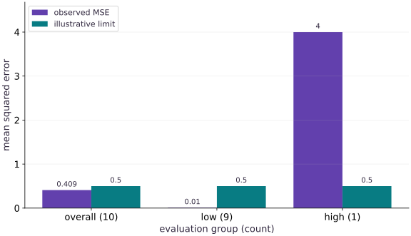

# MLOps: data contracts, CI gates and monitoring

Phase 16: Workload operations · about 70 minutes · CPU

## What you will be able to do

- Validate data before the expensive job
- Use a fixed release evaluation
- Separate code CI from model delivery
- Compare distributions without inventing labels

## The problem

A candidate looks good on an average dashboard, yet performs badly for a small group of requests. Let’s make an MLOps release decision from data identity, slice counts and independently checked metrics.

## The idea

A release pipeline should connect data contracts, evaluation and artifact selection. Aggregate metrics help summarize behavior, but important subpopulations may require explicit gates. Define those slices and acceptance rules before selecting the model.

## A passing average can hide a failing slice

Suppose nine examples have error $0$ and one important slice has error $10$. The overall mean error is $1$. Whether that is acceptable depends on the task and slice policy; the average alone cannot answer it.

Keep counts with slice metrics so a tiny subgroup is not mistaken for strong statistical evidence. Freeze evaluation data and decisions separately from training, and bind the resulting approval to the evaluated artifact.

The slice plot shows where the fixture's aggregate hides a problem. Monitoring later asks whether input or outcome behavior changed. Drift is a signal to investigate; it does not by itself determine that retraining is the correct intervention.

### Pause and reason

Why define a slice gate before inspecting candidate results?

<details><summary>Compare your reasoning</summary>

It makes the selection rule explicit and reduces post-hoc cherry-picking. The gate should reflect the application's requirements, with sample counts and uncertainty considered.

</details>

## Validate data before the expensive job

The fixture gives every observation an ID, a source group and a split. Validate names, finite numbers, allowed split values and group separation before training. Two different rows from the same subject or document can leak across splits even when row IDs differ. Hash the accepted manifest; reject unexpected schema changes explicitly. In a feature pipeline, also record event time, transformation version and missing-value rules to diagnose training-serving skew.

## Use a fixed release evaluation

We inspect ten squared errors: nine values of $0.01$ and one value of $4$. The count-weighted overall MSE is $(9\times0.01+4)/10=0.409$, below the illustrative limit $0.5$. But the high-input slice has MSE $4$, so the release must fail. An empty required slice also fails: zero observations are missing evidence, not perfect quality.

$$
\operatorname{MSE}_{\mathrm{all}}=\frac{\sum_s n_s\operatorname{MSE}_s}{\sum_s n_s}
$$

## Separate code CI from model delivery

A practical pipeline validates the schema and source, runs numerical/unit checks, trains or retrieves a candidate, evaluates a frozen versioned set, packages and tests the serving artifact, then promotes a recorded image/model pair. Failed jobs must preserve the previous accepted bundle. The project contains a portable CI example; its MLflow SQLite store is isolated per job, and its container stage never publishes an image. In a team, durable metadata and artifact storage belong outside disposable workers.

## Compare distributions without inventing labels

The input mix changes from $[0.9,0.1]$ to $[0.5,0.5]$ across two declared bins. Total variation is $0.4$. This says the observed input distribution changed under that binning. It does not say the model became inaccurate: labels may arrive later, and seasonal mix changes can be harmless. Track data-quality errors, request volume, latency/error budgets, slice outcomes and delayed labels separately.

$$
\operatorname{TV}(p,q)=\tfrac12\sum_b|p_b-q_b|
$$

## Plan a response instead of a reflex

An alert should name an owner, a runbook and a decision. Inspect whether a schema change, new population, broken preprocessing or genuine concept shift explains the evidence. Quarantine malformed inputs where appropriate; gather labels and compare a candidate before retraining or rollback. Retraining on corrupted data can make the situation worse. Record sample counts, time windows and alert thresholds; a small window can exaggerate apparent change.

## Rehearse the failed gate

The connected project varies errors, rejects nonfinite metrics and absent slices, checks data leakage, and confirms that failed approval cannot change the active pointer. Add representative protected/business slices appropriate to your domain, with minimum counts and uncertainty review. The fixed two-slice exercise teaches the decision mechanism; it is not a fairness audit or production statistical threshold.

**Run the release-policy stage from the extracted workspace**

```bash
python projects/engineering-release/tests/check.py --implementation solution --stage 1
```

**Expected:** Independent data and slice-gate checks pass, including changed-condition failures.

## Prepare the explicit contract

Create main.py and add this setup block. Continue with the next block in the same file.

```python
import hashlib, json, math
```

The fixture gives every observation an ID, a source group and a split. Validate names, finite numbers, allowed split values and group separation before training. Two different rows from the same subject or document can leak across splits even when row IDs differ. Hash the accepted manifest; reject unexpected schema changes explicitly. In a feature pipeline, also record event time, transformation version and missing-value rules to diagnose training-serving skew.

## Run and inspect the controlled experiment

Append this block, run main.py in the course environment, and retain the actual output.

```python
def digest(value):
    return hashlib.sha256(json.dumps(value, sort_keys=True, separators=(',', ':'), allow_nan=False).encode()).hexdigest()

def validate_rows(rows):
    """An observation has a stable identity, split, group, input and target."""
    if not rows:
        raise ValueError('empty dataset')
    ids = set()
    groups = {}
    for row in rows:
        if set(row) != {'id', 'group', 'split', 'x', 'y'}:
            raise ValueError('schema mismatch')
        if not isinstance(row['id'], str) or not row['id'] or row['id'] in ids:
            raise ValueError('duplicate or empty ID')
        if not isinstance(row['group'], str) or not row['group']:
            raise ValueError('missing source group')
        if row['split'] not in {'train', 'validation', 'test'}:
            raise ValueError('unknown split')
        for name in ['x', 'y']:
            if isinstance(row[name], bool) or not isinstance(row[name], (float, int)) or not math.isfinite(row[name]):
                raise ValueError('nonfinite or nonnumeric observation')
        if row['group'] in groups and groups[row['group']] != row['split']:
            raise ValueError('source group leaks between splits')
        ids.add(row['id']); groups[row['group']] = row['split']
    return digest(rows)

def gate_metrics(errors, slices, limit):
    """Count-weighted MSE plus every required slice; no empty-slice pass."""
    if len(errors) != len(slices) or not errors or not math.isfinite(limit) or limit < 0:
        raise ValueError('invalid metric contract')
    if any(not math.isfinite(e) or e < 0 for e in errors):
        raise ValueError('invalid squared error')
    if not set(slices) <= {'low', 'high'}:
        raise ValueError('unknown slice')
    result = {name: {'count': slices.count(name), 'mse': None} for name in ['low', 'high']}
    for name, item in result.items():
        selected = [e for e, s in zip(errors, slices) if s == name]
        if selected: item['mse'] = math.fsum(selected) / len(selected)
    result['overall'] = {'count': len(errors), 'mse': math.fsum(errors) / len(errors)}
    result['passed'] = all(v['count'] > 0 and v['mse'] <= limit for v in result.values())
    return result

rows = [dict(id=f'r{i}', group=f'g{i}', split='train' if i<4 else 'validation', x=float(i), y=2.*i+1.) for i in range(6)]
fingerprint = validate_rows(rows)
changed = [dict(r) for r in rows]; changed[-1]['x'] += 1
assert validate_rows(changed) != fingerprint
leaked = [dict(r) for r in rows]; leaked[-1]['group'] = rows[0]['group']
try: validate_rows(leaked)
except ValueError: pass
else: raise AssertionError('cross-split source leakage accepted')
errors = [.01] * 9 + [4.]
slices = ['low'] * 9 + ['high']
metrics = gate_metrics(errors, slices, .5)
assert math.isclose(metrics['overall']['mse'], .409)
assert metrics['overall']['mse'] < .5 and not metrics['passed']
assert metrics['high']['count'] == 1 and metrics['high']['mse'] == 4.
assert not gate_metrics([.01]*9, ['low']*9, .5)['passed']
# Total variation on two declared bins: changed input mix is a diagnostic, not proof of degraded accuracy.
reference_mix = [.9, .1]; current_mix = [.5, .5]
shift = .5 * sum(abs(a-b) for a,b in zip(reference_mix,current_mix))
assert math.isclose(shift, .4)
print('Overall MSE:',metrics['overall']['mse'],'high-slice MSE:',metrics['high']['mse'],'release:',metrics['passed'])
print('Two-bin input total variation:',shift,'(requires investigation; not an automatic retraining order)')
```

The input mix changes from $[0.9,0.1]$ to $[0.5,0.5]$ across two declared bins. Total variation is $0.4$. This says the observed input distribution changed under that binning. It does not say the model became inaccurate: labels may arrive later, and seasonal mix changes can be harmless. Track data-quality errors, request volume, latency/error budgets, slice outcomes and delayed labels separately.

## Run the example

```python
import hashlib, json, math

def digest(value):
    return hashlib.sha256(json.dumps(value, sort_keys=True, separators=(',', ':'), allow_nan=False).encode()).hexdigest()

def validate_rows(rows):
    """An observation has a stable identity, split, group, input and target."""
    if not rows:
        raise ValueError('empty dataset')
    ids = set()
    groups = {}
    for row in rows:
        if set(row) != {'id', 'group', 'split', 'x', 'y'}:
            raise ValueError('schema mismatch')
        if not isinstance(row['id'], str) or not row['id'] or row['id'] in ids:
            raise ValueError('duplicate or empty ID')
        if not isinstance(row['group'], str) or not row['group']:
            raise ValueError('missing source group')
        if row['split'] not in {'train', 'validation', 'test'}:
            raise ValueError('unknown split')
        for name in ['x', 'y']:
            if isinstance(row[name], bool) or not isinstance(row[name], (float, int)) or not math.isfinite(row[name]):
                raise ValueError('nonfinite or nonnumeric observation')
        if row['group'] in groups and groups[row['group']] != row['split']:
            raise ValueError('source group leaks between splits')
        ids.add(row['id']); groups[row['group']] = row['split']
    return digest(rows)

def gate_metrics(errors, slices, limit):
    """Count-weighted MSE plus every required slice; no empty-slice pass."""
    if len(errors) != len(slices) or not errors or not math.isfinite(limit) or limit < 0:
        raise ValueError('invalid metric contract')
    if any(not math.isfinite(e) or e < 0 for e in errors):
        raise ValueError('invalid squared error')
    if not set(slices) <= {'low', 'high'}:
        raise ValueError('unknown slice')
    result = {name: {'count': slices.count(name), 'mse': None} for name in ['low', 'high']}
    for name, item in result.items():
        selected = [e for e, s in zip(errors, slices) if s == name]
        if selected: item['mse'] = math.fsum(selected) / len(selected)
    result['overall'] = {'count': len(errors), 'mse': math.fsum(errors) / len(errors)}
    result['passed'] = all(v['count'] > 0 and v['mse'] <= limit for v in result.values())
    return result

rows = [dict(id=f'r{i}', group=f'g{i}', split='train' if i<4 else 'validation', x=float(i), y=2.*i+1.) for i in range(6)]
fingerprint = validate_rows(rows)
changed = [dict(r) for r in rows]; changed[-1]['x'] += 1
assert validate_rows(changed) != fingerprint
leaked = [dict(r) for r in rows]; leaked[-1]['group'] = rows[0]['group']
try: validate_rows(leaked)
except ValueError: pass
else: raise AssertionError('cross-split source leakage accepted')
errors = [.01] * 9 + [4.]
slices = ['low'] * 9 + ['high']
metrics = gate_metrics(errors, slices, .5)
assert math.isclose(metrics['overall']['mse'], .409)
assert metrics['overall']['mse'] < .5 and not metrics['passed']
assert metrics['high']['count'] == 1 and metrics['high']['mse'] == 4.
assert not gate_metrics([.01]*9, ['low']*9, .5)['passed']
# Total variation on two declared bins: changed input mix is a diagnostic, not proof of degraded accuracy.
reference_mix = [.9, .1]; current_mix = [.5, .5]
shift = .5 * sum(abs(a-b) for a,b in zip(reference_mix,current_mix))
assert math.isclose(shift, .4)
print('Overall MSE:',metrics['overall']['mse'],'high-slice MSE:',metrics['high']['mse'],'release:',metrics['passed'])
print('Two-bin input total variation:',shift,'(requires investigation; not an automatic retraining order)')

```

Expected: Overall MSE: 0.409 high-slice MSE: 4.0 release: False
Two-bin input total variation: 0.4 (requires investigation; not an automatic retraining order)

## An average can conceal the failing slice

**Predict:** Which bar would an aggregate-only dashboard hide?



**Recorded CPU computation**

### Read the figure

The categories are the overall set, the low-input slice and the high-input slice. Heights are squared-error means: $0.409$, $0.01$ and $4$. The second series marks the same illustrative acceptance limit $0.5$ for each category. The high slice crosses its limit even though the overall bar does not. There are nine low examples and only one high example; that imbalance explains the aggregate.

### Connect it to the computation

The plot comes from the exact errors checked by gate_metrics. The changed-mix exercise makes the overall bar rise while preserving the two slice bars. Counts, uncertainty and domain-specific acceptance rules are necessary before using a similar policy on real data.

```python
visual_data={'kind':'bar','labels':['overall (10)','low (9)','high (1)'],'xlabel':'evaluation group (count)','ylabel':'mean squared error','series':[{'label':'observed MSE','y':[metrics[k]['mse'] for k in ['overall','low','high']]},{'label':'illustrative limit','y':[.5,.5,.5]}]}
```

## Recorded reference execution

CPU run: 2026-10-06T15:43:59.346914+00:00. JAX 0.9.2.

```text
Overall MSE: 0.409 high-slice MSE: 4.0 release: False
Two-bin input total variation: 0.4 (requires investigation; not an automatic retraining order)
Overall MSE: 0.409 high-slice MSE: 4.0 release: False
Two-bin input total variation: 0.4 (requires investigation; not an automatic retraining order)
Aggregate-only acceptance would miss the high-slice failure.
Unweighted slice average: 2.005
New population MSE: 3.601
PASS: operations-06

```

## A good aggregate hides a bad slice

**Predict before running:** Does an overall MSE below 0.5 pass a gate that requires every slice below 0.5?

```python
assert metrics['overall']['mse'] < .5
assert metrics['high']['mse'] > .5 and metrics['passed'] is False
print('Aggregate-only acceptance would miss the high-slice failure.')
```

**Expected:** The overall score passes, but the complete gate fails.

A policy must define both aggregation and required slice evidence. The threshold is illustrative; its purpose must be justified in a real deployment.

## Make it yours

Show that averaging slice means without counts changes the overall error.

<details><summary>Reference solution</summary>

```python
wrong=(metrics['low']['mse']+metrics['high']['mse'])/2
assert math.isclose(wrong,2.005) and not math.isclose(wrong,metrics['overall']['mse'])
print('Unweighted slice average:',wrong)
```

</details>

## Change the population mix

**transfer**

Keep the two slice errors, but evaluate nine high-slice examples and one low-slice example.

<details><summary>Hint</summary>

Change counts rather than the model errors.

</details>

<details><summary>Reference solution and reasoning</summary>

```python
shifted=gate_metrics([.01]+[4.]*9,['low']+['high']*9,.5)
assert math.isclose(shifted['overall']['mse'],3.601)
assert shifted['high']['mse']==metrics['high']['mse']
print('New population MSE:',shifted['overall']['mse'])
```

Aggregate performance changes with population mix even when each slice’s error is unchanged. Report both before attributing the change to a model regression.

</details>

## Check your understanding

An input drift alert fired before new labels arrived. What follows?

1. Retrain and automatically replace the active model.
2. Investigate the change and gather quality evidence before choosing a response.
3. Declare accuracy has decreased by the drift score.

<details><summary>Answer and explanation</summary>

Investigate the change and gather quality evidence before choosing a response.

MLOps connects data validation, training, evaluation, packaging, delivery and monitoring. Continuous integration tests code and contracts; model promotion additionally needs data and quality evidence. Automatic retraining is a policy decision, not the inevitable response to any drift alert.

</details>

## Diagnose the result

Check denominators and slice counts before thresholds. A missing slice, nonfinite metric or changed evaluation manifest should block comparison. Investigate drift and training-serving skew separately from service health.

## Carry forward

- Validate data before the expensive job
- Compare distributions without inventing labels
- Rehearse the failed gate

## Keep your evidence

Keep the leaking-group rejection, data fingerprint, slice counts and MSEs, aggregate/slice gate disagreement, changed-population calculation and a written response to drift without labels.

Keep predictions, modified code, observed results, and reasoning. A checkpoint alone does not demonstrate the exercise.

## Primary references

- [Google Cloud MLOps: continuous delivery and automation](https://cloud.google.com/architecture/mlops-continuous-delivery-and-automation-pipelines-in-machine-learning)
- [MLflow experiment tracking](https://mlflow.org/docs/latest/ml/tracking/quickstart/)
- [MLflow model registry workflows](https://mlflow.org/docs/latest/ml/model-registry/workflow/)

