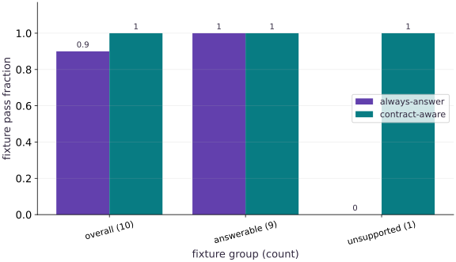

# LLMOps: version prompts, evaluate behavior and trace requests

Phase 16: Workload operations · about 75 minutes · CPU

## What you will be able to do

- Version the application boundary
- Define cases before changing the prompt
- Read the rare-case failure
- Trace enough to diagnose, without retaining everything

## The problem

A prompt edit improves ordinary answers but makes the system confidently answer a question its documents cannot support. Let’s build a small regression suite that exposes the failure and save real MLflow traces without calling a paid model.

## The idea

An LLM application combines prompts, retrieved context, model configuration and postprocessing. Version those components and keep a trace that explains a failed case. A model name alone does not identify the behavior of the whole application.

## Trace a response through the system that produced it

If a response is unsupported, first ask whether relevant evidence reached the model, whether the prompt requested grounded behavior and whether the evaluation checks the intended claim. Changing the model cannot necessarily repair a missing retrieval candidate.

Link case IDs to prompt, retriever, model and evaluator versions. Re-run a fixed case set after a change and inspect both repaired cases and regressions. An average pass rate can conceal a newly broken critical case.

The lesson uses a bounded fixture to teach release logic. Preserve that scope: passing a mocked or non-LLM check is separate from actual model behavior. Qualify the full application with executed traces when replacing the fixture.

$$
\text{Digest}(\text{Image}) = \operatorname{sha256}(\text{Layers} \;\|\; \text{Lockfile}), \qquad P(\text{reproduce}) = 1
$$

### Pause and reason

Why retain the retrieved context in an error trace?

<details><summary>Compare your reasoning</summary>

It distinguishes missing or wrong evidence from generation or instruction-following errors. Without that context, the same final response can support several incompatible diagnoses.

</details>

## Version the application boundary

For a text generator, record the model revision, tokenizer, prompt template and decoding settings. For retrieval, add corpus/index versions, chunking and retrieval configuration. For tools, version schemas and implementations and define permission boundaries. MLflow’s prompt registry can store versions; an alias is convenient for development, while an evaluated release should resolve an immutable prompt version. The connected lab actually registers and reloads a prompt version.

## Define cases before changing the prompt

The companion replays controlled answer objects against ten public fixtures: nine answerable cases and one unsupported question. An answer contains text, citation IDs and an abstention flag. The evaluator checks the output schema, exact expected answer for these deliberately simple fixtures, allowed citation IDs and abstention for the unsupported case. A citation ID being allowed does not generally prove that a claim is entailed by a document; real tasks need claim-level checks and human calibration.

## Read the rare-case failure

The always-answer candidate passes all nine ordinary cases and fails the unsupported one. Its aggregate pass rate is $0.9$, but its unsupported-case pass rate is $0$. The contract-aware replay passes all ten. These are deterministic candidate response fixtures, not outputs from a live LLM or a model-quality benchmark. They let us test whether the evaluator and release policy catch a known defect before spending money on generation.

## Trace enough to diagnose, without retaining everything

A trace connects one request’s spans: retrieval, model invocation, tool calls, validation and response. Keep request IDs, version IDs, timing, error category and useful aggregate diagnostics. Raw prompts, retrieved documents and tool outputs can contain private data; define redaction, access and retention before collecting them. This lab records fixture IDs and summary scores in two actual MLflow traces. It does not log private messages. Tracing observes behavior; it does not enforce tool permissions or protect against prompt injection.

## Add the production cases deliberately

Extend the suite with missing/contradictory context, multilingual inputs, long contexts, prompt injection in retrieved text, malformed tool arguments, unsupported tools, timeouts and rate limits. Treat retrieved text as data, not trusted instructions. Check tool allowlists and permissions outside the model. Keep a held-out test set and human-reviewed examples separate from cases used to tune prompts. If using an LLM judge, record the judge version and rubric and compare with human labels; judge disagreement is evidence to inspect, not an infallible score.

## Measure serving work in the right units

Measure prefill and decode separately, along with time to first token, output tokens per second, completion rate, tail latency and request cost under declared context lengths and concurrency. Provider token accounting must use the provider’s tokenizer and pricing; whitespace counts are not interchangeable tokens. Set retry and timeout budgets and test the fallback path. The text harness supplies actual tiny-model cache/export measurements; the replay lesson supplies evaluation/tracing contracts, not production throughput.

**Run the complete local prompt/trace demonstration**

```bash
# Run run the complete local prompt/trace demonstration using the course Python environment
python projects/engineering-release/mlflow_lab.py --output ./engineering-run-llm
```

**Expected:** Registers a real prompt version and records a nested retrieval/replay trace; no paid model API is used.

## A missing response is an evaluation failure

Freeze the case inventory before collecting responses. Pair responses by stable case ID, not by arrival order: concurrent requests may finish out of order, and a timeout may omit a reply entirely. A loop over paired lists can silently stop at the shorter list and make coverage disappear from the denominator. The new experiment accepts reordered complete replies but rejects missing, duplicate and unknown IDs. In a live application, retain a timeout or tool-error outcome under the original case ID and score it under a declared policy; do not delete difficult cases after seeing results.

## Prepare the explicit contract

Create main.py and add this setup block. Continue with the next block in the same file.

```python
# Step 1 — Prepare the explicit contract: For a text generator, record the model revision, tokenizer, prompt...
# Import os for this computation.
import os
# Configure environment variable before initializing the runtime.
os.environ["MLFLOW_DISABLE_AGENT_HINT"]="1"
# Configure environment variable before initializing the runtime.
os.environ["MLFLOW_ENABLE_ASYNC_TRACE_LOGGING"]="false"
# Configure environment variable before initializing the runtime.
os.environ["MLFLOW_ENABLE_TELEMETRY"]="false"
# Import required JAX, NumPy, and standard-library modules.
import tempfile
from pathlib import Path
import mlflow
from mlflow import MlflowClient
```

For a text generator, record the model revision, tokenizer, prompt template and decoding settings. For retrieval, add corpus/index versions, chunking and retrieval configuration. For tools, version schemas and implementations and define permission boundaries. MLflow’s prompt registry can store versions; an alias is convenient for development, while an evaluated release should resolve an immutable prompt version. The connected lab actually registers and reloads a prompt version.

## Run and inspect the controlled experiment

Append this block, run main.py in the course environment, and retain the actual output.

```python
# Step 2 — Run and inspect the controlled experiment: A trace connects one request’s spans: retrieval, model invocation,...
def llm_case(case, answer, allowed_citations):
    """Deterministic replay evaluator, not an LLM judge or a general safety classifier."""
    # Branch on condition `set(answer) != {'answer', 'citations', 'abstain'} or not isinstance(answer['answer'], str)`:
    if set(answer) != {'answer', 'citations', 'abstain'} or not isinstance(answer['answer'], str):
        return False
    # Branch on condition `not isinstance(answer['citations'], list) or any((not isinstance(c, str) for c in answer['citations']))`:
    if not isinstance(answer['citations'], list) or any(not isinstance(c, str) for c in answer['citations']):
        return False
    # Branch on condition `type(answer['abstain']) is not bool or not set(answer['citations']) <= set(allowed_citations)`:
    if type(answer['abstain']) is not bool or not set(answer['citations']) <= set(allowed_citations):
        return False
    # Branch on condition `case['unanswerable']`:
    if case['unanswerable']:
        return answer['abstain'] and not answer['citations'] and answer['answer'] == ''
    # Return `not answer['abstain'] and answer['answer'] == case['expected'] and (case['document'] in answer['citations'])` to the caller.
    return not answer['abstain'] and answer['answer'] == case['expected'] and case['document'] in answer['citations']

# Compute `cases` from `[dict(id=f'answerable-{i}', unanswerable=False, expe...`
cases = [dict(id=f'answerable-{i}', unanswerable=False, expected='CPU', document='course-v1') for i in range(9)]
# Accumulate the next contribution into `cases`.
cases += [dict(id='unsupported', unanswerable=True)]
# Evaluate `answer='CPU', citations=['course-v1'], abstain=False` and convert the result into Python scalar/collection `answer`.
answer = dict(answer='CPU', citations=['course-v1'], abstain=False)
# Compute `unsafe` from `[dict(answer) for _ in cases]`
unsafe = [dict(answer) for _ in cases]
# Compute `guarded` from `[dict(answer) for _ in cases[:-1]] + [dict(answer=''...`
guarded = [dict(answer) for _ in cases[:-1]] + [dict(answer='', citations=[], abstain=True)]
# Compute `results` from `[]`
results = []
# Create an isolated temporary directory to run and inspect artifacts safely:
with tempfile.TemporaryDirectory(prefix='llmops-') as folder:
    # Execute `mlflow.set_tracking_uri('sqlite:///' + str(Path(folder) / 'traces.db'))`.
    mlflow.set_tracking_uri('sqlite:///' + str(Path(folder) / 'traces.db'))
    # Run `MlflowClient` to compute `client`.
    # Read or serialize artifact data on disk (`experiment`).
    client = MlflowClient()
    experiment = client.create_experiment('replay-evaluation', artifact_location=(Path(folder)/'artifacts').as_uri())
    # Run `mlflow.set_experiment` to perform the next check or state transition.
    mlflow.set_experiment(experiment_id=experiment)
    # Loop over `(name, replies)` in `[('always-answer', unsafe), ('contract-aware', guarded)]`:
    for name,replies in [('always-answer',unsafe),('contract-aware',guarded)]:
        # Enter managed runtime/context scope for this block:
        with mlflow.start_span(name='evaluate-replay', span_type='CHAIN') as span:
            # Run `span.set_inputs` to perform the next check or state transition.
            span.set_inputs({'candidate': name, 'dataset_version': 'public-fixture-v1', 'case_count': len(cases)})
            # Compute `passed` from `[llm_case(case, reply, ['course-v1']) for case,reply...`
            passed = [llm_case(case, reply, ['course-v1']) for case,reply in zip(cases,replies)]
            # Compute `summary` from `{'overall': sum(passed)/len(passed), 'answerable': s...`
            summary = {'overall': sum(passed)/len(passed), 'answerable': sum(passed[:-1])/9, 'unanswerable': float(passed[-1])}
            # Run `span.set_outputs` to perform the next check or state transition.
            # Run `span.set_outputs` to perform the next check or state transition.
            span.set_outputs(summary)
            results.append(summary)
    # Run `mlflow.search_traces` to compute `traces`.
    traces = mlflow.search_traces(experiment_ids=[experiment], return_type='list')
    # Assert invariant `len(traces) == 2` holds
    assert len(traces) == 2
# Assert invariant `results[0] == {'overall': .9` holds
assert results[0] == {'overall': .9, 'answerable': 1., 'unanswerable': 0.}
# Assert invariant `results[1] == {'overall': 1.` holds
assert results[1] == {'overall': 1., 'answerable': 1., 'unanswerable': 1.}
# Assert invariant `not llm_case(cases[0]` holds
assert not llm_case(cases[0],dict(answer='CPU',citations=['invented'],abstain=False),['course-v1'])
# Print the observed values to compare against the expected result.
print('Observed replay scores:', results)
# Print diagnostic summary of the computed outputs.
print('Two real MLflow traces; no LLM API was called and no general model quality was evaluated.')
```

A trace connects one request’s spans: retrieval, model invocation, tool calls, validation and response. Keep request IDs, version IDs, timing, error category and useful aggregate diagnostics. Raw prompts, retrieved documents and tool outputs can contain private data; define redaction, access and retention before collecting them. This lab records fixture IDs and summary scores in two actual MLflow traces. It does not log private messages. Tracing observes behavior; it does not enforce tool permissions or protect against prompt injection.

## Step 3: Verify invariants on the completed state

Run the final shape and numerical assertions to confirm the state built in Steps 1 and 2.

```python
assert results[1] == {'overall': 1., 'answerable': 1., 'unanswerable': 1.}
assert not llm_case(cases[0],dict(answer='CPU',citations=['invented'],abstain=False),['course-v1'])
```

Checking these invariants confirms the computation is ready for the full worked experiment.

## Run the example

```python
# Step 1 — Prepare the explicit contract: For a text generator, record the model revision, tokenizer, prompt...
# Import os for this computation.
import os
# Configure environment variable before initializing the runtime.
os.environ["MLFLOW_DISABLE_AGENT_HINT"]="1"
# Configure environment variable before initializing the runtime.
os.environ["MLFLOW_ENABLE_ASYNC_TRACE_LOGGING"]="false"
# Configure environment variable before initializing the runtime.
os.environ["MLFLOW_ENABLE_TELEMETRY"]="false"
# Import required JAX, NumPy, and standard-library modules.
import tempfile
from pathlib import Path
import mlflow
from mlflow import MlflowClient

# Step 2 — Run and inspect the controlled experiment: A trace connects one request’s spans: retrieval, model invocation,...
def llm_case(case, answer, allowed_citations):
    """Deterministic replay evaluator, not an LLM judge or a general safety classifier."""
    # Branch on condition `set(answer) != {'answer', 'citations', 'abstain'} or not isinstance(answer['answer'], str)`:
    if set(answer) != {'answer', 'citations', 'abstain'} or not isinstance(answer['answer'], str):
        return False
    # Branch on condition `not isinstance(answer['citations'], list) or any((not isinstance(c, str) for c in answer['citations']))`:
    if not isinstance(answer['citations'], list) or any(not isinstance(c, str) for c in answer['citations']):
        return False
    # Branch on condition `type(answer['abstain']) is not bool or not set(answer['citations']) <= set(allowed_citations)`:
    if type(answer['abstain']) is not bool or not set(answer['citations']) <= set(allowed_citations):
        return False
    # Branch on condition `case['unanswerable']`:
    if case['unanswerable']:
        return answer['abstain'] and not answer['citations'] and answer['answer'] == ''
    # Return `not answer['abstain'] and answer['answer'] == case['expected'] and (case['document'] in answer['citations'])` to the caller.
    return not answer['abstain'] and answer['answer'] == case['expected'] and case['document'] in answer['citations']

# Compute `cases` from `[dict(id=f'answerable-{i}', unanswerable=False, expe...`
cases = [dict(id=f'answerable-{i}', unanswerable=False, expected='CPU', document='course-v1') for i in range(9)]
# Accumulate the next contribution into `cases`.
cases += [dict(id='unsupported', unanswerable=True)]
# Evaluate `answer='CPU', citations=['course-v1'], abstain=False` and convert the result into Python scalar/collection `answer`.
answer = dict(answer='CPU', citations=['course-v1'], abstain=False)
# Compute `unsafe` from `[dict(answer) for _ in cases]`
unsafe = [dict(answer) for _ in cases]
# Compute `guarded` from `[dict(answer) for _ in cases[:-1]] + [dict(answer=''...`
guarded = [dict(answer) for _ in cases[:-1]] + [dict(answer='', citations=[], abstain=True)]
# Compute `results` from `[]`
results = []
# Create an isolated temporary directory to run and inspect artifacts safely:
with tempfile.TemporaryDirectory(prefix='llmops-') as folder:
    # Execute `mlflow.set_tracking_uri('sqlite:///' + str(Path(folder) / 'traces.db'))`.
    mlflow.set_tracking_uri('sqlite:///' + str(Path(folder) / 'traces.db'))
    # Run `MlflowClient` to compute `client`.
    # Read or serialize artifact data on disk (`experiment`).
    client = MlflowClient()
    experiment = client.create_experiment('replay-evaluation', artifact_location=(Path(folder)/'artifacts').as_uri())
    # Run `mlflow.set_experiment` to perform the next check or state transition.
    mlflow.set_experiment(experiment_id=experiment)
    # Loop over `(name, replies)` in `[('always-answer', unsafe), ('contract-aware', guarded)]`:
    for name,replies in [('always-answer',unsafe),('contract-aware',guarded)]:
        # Enter managed runtime/context scope for this block:
        with mlflow.start_span(name='evaluate-replay', span_type='CHAIN') as span:
            # Run `span.set_inputs` to perform the next check or state transition.
            span.set_inputs({'candidate': name, 'dataset_version': 'public-fixture-v1', 'case_count': len(cases)})
            # Compute `passed` from `[llm_case(case, reply, ['course-v1']) for case,reply...`
            passed = [llm_case(case, reply, ['course-v1']) for case,reply in zip(cases,replies)]
            # Compute `summary` from `{'overall': sum(passed)/len(passed), 'answerable': s...`
            summary = {'overall': sum(passed)/len(passed), 'answerable': sum(passed[:-1])/9, 'unanswerable': float(passed[-1])}
            # Run `span.set_outputs` to perform the next check or state transition.
            # Run `span.set_outputs` to perform the next check or state transition.
            span.set_outputs(summary)
            results.append(summary)
    # Run `mlflow.search_traces` to compute `traces`.
    traces = mlflow.search_traces(experiment_ids=[experiment], return_type='list')
    # Assert invariant `len(traces) == 2` holds
    assert len(traces) == 2
# Assert invariant `results[0] == {'overall': .9` holds
assert results[0] == {'overall': .9, 'answerable': 1., 'unanswerable': 0.}
# Assert invariant `results[1] == {'overall': 1.` holds
assert results[1] == {'overall': 1., 'answerable': 1., 'unanswerable': 1.}
# Assert invariant `not llm_case(cases[0]` holds
assert not llm_case(cases[0],dict(answer='CPU',citations=['invented'],abstain=False),['course-v1'])
# Print the observed values to compare against the expected result.
print('Observed replay scores:', results)
# Print diagnostic summary of the computed outputs.
print('Two real MLflow traces; no LLM API was called and no general model quality was evaluated.')
```

Expected: Observed replay scores: [{'overall': 0.9, 'answerable': 1.0, 'unanswerable': 0.0}, {'overall': 1.0, 'answerable': 1.0, 'unanswerable': 1.0}]
Two real MLflow traces; no LLM API was called and no general model quality was evaluated.

## The unsupported case changes the release decision

**Predict:** How can a candidate pass 90% overall and still fail every unsupported case?



**Recorded CPU computation**

### Read the figure

The horizontal axis names the aggregate, answerable and unsupported groups. The vertical axis is the deterministic fixture pass fraction, between $0$ and $1$. Always-answer scores $0.9,1,0$; contract-aware scores $1,1,1$. The aggregate has ten cases, answerable has nine, and unsupported has one. The two answerable bars have equal height because both replays contain the same correct answers there.

### Connect it to the computation

The plot reports evaluator outputs from controlled answer objects recorded in real traces. It does not report accuracy of a live language model. In a real suite, expand critical cases and preserve sample counts and model-version evidence before making a release claim.

```python
# Compute figure data for: The unsupported case changes the release decision
# Compute `visual_data` from `{'kind':'bar','labels':['overall (10)','answerable (...`
visual_data={'kind':'bar','labels':['overall (10)','answerable (9)','unsupported (1)'],'xlabel':'fixture group (count)','ylabel':'fixture pass fraction','series':[{'label':name,'y':[r[k] for k in ['overall','answerable','unanswerable']]} for name,r in zip(['always-answer','contract-aware'],results)]}
```

## Recorded reference execution

CPU run: 2026-10-09T14:08:23.358882+00:00. JAX 0.9.2.

```text
Observed replay scores: [{'overall': 0.9, 'answerable': 1.0, 'unanswerable': 0.0}, {'overall': 1.0, 'answerable': 1.0, 'unanswerable': 1.0}]
Two real MLflow traces; no LLM API was called and no general model quality was evaluated.
Observed replay scores: [{'overall': 0.9, 'answerable': 1.0, 'unanswerable': 0.0}, {'overall': 1.0, 'answerable': 1.0, 'unanswerable': 1.0}]
Two real MLflow traces; no LLM API was called and no general model quality was evaluated.
Release decisions: [False, True]
Complete inventory: {'count': 10, 'passed': 9, 'fraction': 0.9} ; missing, duplicate and unknown responses rejected.
Unrecognized citations rejected.
An abstention flag alone does not satisfy the output contract.
Failed answerable work remains in denominator: {'count': 10, 'passed': 9, 'fraction': 0.9}
PASS: operations-07

```

## Separate aggregate and critical-case behavior

**Predict before running:** Can the 90% candidate satisfy a rule that requires the unsupported case to pass?

```python
# Experiment — Separate aggregate and critical-case behavior: The extra gate encodes a required behavior that the overall...
release=[r['overall']>=.9 and r['unanswerable']==1. for r in results]
# Assert invariant `release==[False,True]` holds
assert release==[False,True]
# Print the observed values to compare against the expected result.
print('Release decisions:',release)
```

**Expected:** Release decisions are False and True.

The extra gate encodes a required behavior that the overall average hides. One unsupported fixture is a regression test, not a population estimate.

## Reject an incomplete replay before reporting a score

**Predict before running:** If the only omitted response belongs to the unsupported case, what would a score over returned answers hide?

```python
# Experiment — Reject an incomplete replay before reporting a score: The case inventory defines the denominator.
def score_replay(inventory, replies, allowed_citations):
    # Compute `ids` from `[case['id'] for case in inventory]`
    ids = [case['id'] for case in inventory]
    # Compute `reply_ids` from `[reply['id'] for reply in replies]`
    reply_ids = [reply['id'] for reply in replies]
    # Guard input contract (`not ids or len(set(ids)) != len(ids)`) and fail fast if violated.
    if not ids or len(set(ids)) != len(ids):
        raise ValueError('empty or duplicate case inventory')
    # Guard input contract (`len(set(reply_ids)) != len(reply_ids) or set(reply_ids) != set(ids)`) and fail fast if violated.
    if len(set(reply_ids)) != len(reply_ids) or set(reply_ids) != set(ids):
        raise ValueError('missing, duplicate or unknown response IDs')
    # Compute `by_id` from `{reply['id']: reply['response'] for reply in replies}`
    by_id = {reply['id']: reply['response'] for reply in replies}
    # Compute `passed` from `[llm_case(case, by_id[case['id']], allowed_citations...`
    passed = [llm_case(case, by_id[case['id']], allowed_citations) for case in inventory]
    # Return `{'count': len(ids), 'passed': sum(passed), 'fraction': sum(passed) / len(ids)}` to the caller.
    return {'count': len(ids), 'passed': sum(passed), 'fraction': sum(passed) / len(ids)}

# Compute `complete_replies` from `[{'id': case['id'], 'response': reply} for case, rep...`
complete_replies = [{'id': case['id'], 'response': reply} for case, reply in zip(cases, unsafe)]
# Run `score_replay` to compute `replay_summary`.
replay_summary = score_replay(cases, list(reversed(complete_replies)), ['course-v1'])
# Assert invariant `replay_summary == {'count': 10` holds
assert replay_summary == {'count': 10, 'passed': 9, 'fraction': .9}
# Iterate over `broken` to step through the computation:
for broken in (complete_replies[:-1], complete_replies + [complete_replies[0]],
               complete_replies[:-1] + [dict(id='unknown', response=answer)]):
    try:
        score_replay(cases, broken, ['course-v1'])
    except ValueError:
        pass
    else:
        raise AssertionError('incomplete or ambiguous evaluation accepted')
# Print the observed values to compare against the expected result.
print('Complete inventory:', replay_summary, '; missing, duplicate and unknown responses rejected.')
```

**Expected:** Ten cases, nine passes, fraction 0.9; reordering preserves the score. Missing, duplicate and unknown response identities are rejected.

The case inventory defines the denominator. In particular, losing the unsupported case must not convert a critical failure into a perfect answerable-only score. This checks evaluation bookkeeping on replayed data, not live generation quality.

## Make it yours

Add a response with an invented citation and require the evaluator to fail it.

### How to write this exercise — Step-by-step recipe & starter scaffold

**Key functions & syntax to use:**
- `llm_case(...)` — Call `llm_case` with your updated parameters or inputs from this lesson's workspace.
- `assert condition` — Verify that the observed output shape, status, or numerical value satisfies the contract.

**Step-by-step implementation plan:**
1. Iterate over `citation` to step through the computation:
2. Assert invariant `not llm_case(cases[0]` holds
3. Print the observed values to compare against the expected result.

**Starter code scaffold (fill in the TODOs):**

```python
# Exercise solution: Add a response with an invented citation and require the evaluator to...
# Iterate over `citation` to step through the computation:
for citation in ['invented','old-index-v0']:
    # Assert invariant `not llm_case(cases[0]` holds
    assert not llm_case(cases[0],dict(answer='CPU',citations=[citation],abstain=False),['course-v1'])  # TODO: complete assertion check
# Print the observed values to compare against the expected result.
print('Unrecognized citations rejected.')
```

<details><summary>Reference solution</summary>

```python
# Exercise solution: Add a response with an invented citation and require the evaluator to...
# Iterate over `citation` to step through the computation:
for citation in ['invented','old-index-v0']:
    # Assert invariant `not llm_case(cases[0]` holds
    assert not llm_case(cases[0],dict(answer='CPU',citations=[citation],abstain=False),['course-v1'])
# Print the observed values to compare against the expected result.
print('Unrecognized citations rejected.')
```

</details>

## Check abstention structure

**transfer**

Try a response that claims to abstain but still returns an unsupported answer.

<details><summary>Hint</summary>

The fixture contract requires both empty answer text and no citations.

</details>

### How to write: Check abstention structure — Step-by-step recipe & starter scaffold

**Key functions & syntax to use:**
- `structure(...)` — Call `structure` with your updated parameters or inputs from this lesson's workspace.
- `llm_case(...)` — Call `llm_case` with your updated parameters or inputs from this lesson's workspace.
- `assert condition` — Verify that the observed output shape, status, or numerical value satisfies the contract.

**Step-by-step implementation plan:**
1. Check abstention structure (transfer): Validate the full response object; a boolean alone cannot...
2. Assert invariant `not llm_case(cases[-1]` holds
3. Print the observed values to compare against the expected result.

**Starter code scaffold (fill in the TODOs):**

```python
# Check abstention structure (transfer): Validate the full response object; a boolean alone cannot...
bad = dict(...)  # TODO: compute bad
# Assert invariant `not llm_case(cases[-1]` holds
assert not llm_case(cases[-1],bad,['course-v1'])  # TODO: complete assertion check
# Print the observed values to compare against the expected result.
print('An abstention flag alone does not satisfy the output contract.')
```

<details><summary>Reference solution and reasoning</summary>

```python
# Check abstention structure (transfer): Validate the full response object; a boolean alone cannot...
bad=dict(answer='An unsupported claim',citations=[],abstain=True)
# Assert invariant `not llm_case(cases[-1]` holds
assert not llm_case(cases[-1],bad,['course-v1'])
# Print the observed values to compare against the expected result.
print('An abstention flag alone does not satisfy the output contract.')
```

Validate the full response object; a boolean alone is distinct from that the application withheld an answer.

</details>

## Keep failed work in the evaluation inventory

**Transfer**

Replace the answer for the first answerable case with an empty abstention. Keep the case ID and show how the complete-suite score changes.

<details><summary>Hint</summary>

Use the contract-aware replies as the starting point. An empty abstention is correct for the unsupported case but wrong for the selected answerable case.

</details>

### How to write: Keep failed work in the evaluation inventory — Step-by-step recipe & starter scaffold

**Key functions & syntax to use:**
- `inventory(...)` — Call `inventory` with your updated parameters or inputs from this lesson's workspace.
- `zip(...)` — Call `zip` with your updated parameters or inputs from this lesson's workspace.
- `assert condition` — Verify that the observed output shape, status, or numerical value satisfies the contract.

**Step-by-step implementation plan:**
1. Evaluate `answer='', citations=[], abstain=True` and convert the result into Python scalar/collection `timeout_replies[0]['response']`.
2. Run `score_replay` to compute `timeout_summary`.
3. Assert invariant `timeout_summary == {'count': 10` holds
4. Print the observed values to compare against the expected result.

**Starter code scaffold (fill in the TODOs):**

```python
# Keep failed work in the evaluation inventory (Transfer): The fixture represents an unsuccessful answer as an empty...
timeout_replies = ...  # TODO: compute timeout_replies
# Evaluate `answer='', citations=[], abstain=True` and convert the result into Python scalar/collection `timeout_replies[0]['response']`.
timeout_replies[0]['response'] = dict(...)  # TODO: compute timeout_replies[0]['response']
# Run `score_replay` to compute `timeout_summary`.
timeout_summary = score_replay(...)  # TODO: compute timeout_summary
# Assert invariant `timeout_summary == {'count': 10` holds
assert timeout_summary  # TODO: complete assertion check
# Print the observed values to compare against the expected result.
print('Failed answerable work remains in denominator:', timeout_summary)
```

<details><summary>Reference solution and reasoning</summary>

```python
# Keep failed work in the evaluation inventory (Transfer): The fixture represents an unsuccessful answer as an empty...
timeout_replies = [{'id': case['id'], 'response': dict(reply)} for case, reply in zip(cases, guarded)]
# Evaluate `answer='', citations=[], abstain=True` and convert the result into Python scalar/collection `timeout_replies[0]['response']`.
timeout_replies[0]['response'] = dict(answer='', citations=[], abstain=True)
# Run `score_replay` to compute `timeout_summary`.
timeout_summary = score_replay(cases, timeout_replies, ['course-v1'])
# Assert invariant `timeout_summary == {'count': 10` holds
assert timeout_summary == {'count': 10, 'passed': 9, 'fraction': .9}
# Print the observed values to compare against the expected result.
print('Failed answerable work remains in denominator:', timeout_summary)
```

The fixture represents an unsuccessful answer as an empty abstention. A real trace should additionally distinguish timeout, retrieval failure and deliberate abstention as causes, while retaining all cases in the predeclared metric.

</details>

## Check your understanding

The controlled replay suite passes every case. What is established?

1. The live LLM is safe and accurate for arbitrary requests.
2. The evaluator accepts these fixtures; live model and held-out application evaluation remain separate.
3. Prompt versions no longer need recording.

<details><summary>Answer and explanation</summary>

The evaluator accepts these fixtures; live model and held-out application evaluation remain separate.

LLMOps versions the whole application: model and tokenizer, prompt, retrieval corpus and index, tools, decoding configuration, evaluators and runtime. A model weight version alone cannot reproduce a retrieval-augmented or tool-using answer.

</details>

## Diagnose the result

When quality changes, compare prompt/model/retrieval/tool versions and case-level traces before tuning weights. A high average can hide an unsupported-case regression. Do not call a synthetic replay a measured LLM response.

## Carry forward

- Version the application boundary
- Trace enough to diagnose, without retaining everything
- Measure serving work in the right units

## Keep your evidence

Keep all case IDs and per-slice replay scores, missing/duplicate-response rejections, the retained failed case, trace identities and application-version fields. Explain what requires separate live-model evaluation.

Save your predictions, modified code, terminal outputs, and reasoning in your engineering portfolio.

## Primary references

- [MLflow tracing quickstart](https://mlflow.org/docs/latest/genai/tracing/quickstart/)
- [MLflow prompt registry](https://mlflow.org/docs/latest/genai/prompt-registry/index.html)

