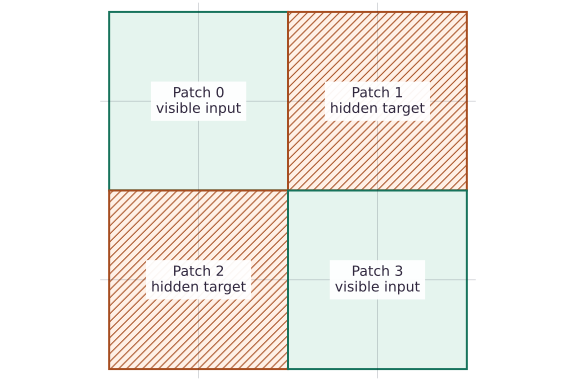
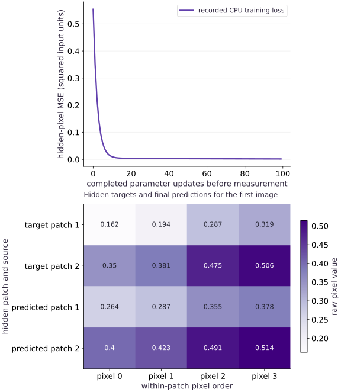

# Masked image modeling: reconstruct missing patches

Phase 17: Self-supervised pretraining: masked and contrastive learning · about 105 minutes · CPU

## What you will be able to do

- Preserve patch order and pixel order
- Keep hidden pixels out of the encoder
- Verify the changed-condition exercise and explain the limits of this fixture.

## The problem

If part of an image is hidden, can the model infer it from visible patches? The important question is whether hidden pixels are truly absent from the encoder, not whether the reconstruction looks attractive.

## The idea

Masked image modeling learns from visible image content to predict missing content. To understand the objective, distinguish observed patches, hidden targets and predicted values in the original image coordinates.

## Keep hidden patches in their spatial positions

The fixture splits a four-by-four image into four two-by-two patches in row-major order. Patches $0$ and $3$ are visible; $1$ and $2$ are hidden. Show hidden regions with hatching so they cannot be mistaken for observed black pixels.

The implemented reconstructor is linear: eight visible pixel values plus a constant feature map through a nine-by-sixteen weight matrix. It is a deliberately small mechanism example, not a masked autoencoder Transformer.

Compare target and predicted hidden patches at the same spatial coordinates and on a shared intensity scale. A separate error map reveals remaining mistakes that a small average loss can hide. Changing a hidden target without changing visible input must not change the model's forward input.

### Visible patches and hidden targets

**Predict:** Why should original and reconstructed images share a color scale?



*Conceptual / analytic teaching diagram; not a recorded benchmark.*

The sixteen cells preserve the four-by-four image layout. Green patches 0 and 3 provide visible values. Hatched patches 1 and 2 are hidden targets for reconstruction loss. Hatching means missing input, not observed black pixels. This maps the actual mask without inventing a reconstructed image or error measurement.

### Pause and reason

Why should original and reconstructed images share a color scale?

<details><summary>Compare your reasoning</summary>

Independent scaling can make different intensities look equal. A shared scale preserves visual comparison; the error map should have its own clearly labeled scale.

</details>

## Before coding: what information can the model use?

Imagine covering the top-right and bottom-left quarters of a small image. The model is allowed to see the other two quarters and must infer the covered pixels. Keep two separate paths on your sketch: visible patches go into features, while the untouched image supplies targets. A zero loss is suspicious if the target image is also an encoder input.

This dataset varies a single brightness amplitude on top of a fixed spatial pattern. Visible pixels reveal that amplitude, so a linear map can succeed. That makes the example suitable for auditing masking and patch order, but it cannot teach natural-image representation quality on its own.

## Preserve patch order and pixel order

Images use batch, height, width, channel axes. A $4\times4$ single-channel image becomes four $2\times2$ patches with four scalars each. Reshape alone does not generally produce row-major patch order; transpose the grid and within-patch axes deliberately. The first patch is checked against an independently sliced image region.

## Keep hidden pixels out of the encoder

Gather visible patches before constructing features. The clean full image belongs only to the reconstruction target. In a masked autoencoder, a visible-only encoder can reduce encoder work while a decoder uses position information and mask tokens to restore the complete patch ordering. Our linear decoder has an explicit output coordinate for each patch/pixel, so it has a fixed positional contract without a Transformer.

## Work through a patch rather than memorizing reshape

Number a single-channel image row by row from $0$ through $15$. Its top-left patch is $[0,1,4,5]$, not $[0,1,2,3]$. The latter is a horizontal strip caused by flattening without the grid-axis transpose. For general image shape $(B,H,W,C)$ and patch width $p$, the output shape is $(B,HW/p^2,p^2C)$. The channel coordinate remains inside each pixel.

In our fixture, two visible patches each contribute four pixels; appending a bias gives nine features. The decoder has sixteen outputs because it predicts every patch coordinate. Its visible outputs are unconstrained by the hidden-only objective. A whole-image picture should therefore show a composite that preserves visible input pixels and inserts predictions only where hidden.

## Understand which uncertainty the objective can solve

If two examples have exactly the same visible pixels but different hidden targets, no deterministic model can reconstruct both perfectly. For a scalar target equally likely to be $0$ or $2$, the mean-squared-error optimum is $1$, with average squared error $1$. The result looks like neither original target. More capacity cannot recover information absent from the inputs.

This explains why blurry reconstructions need not mean an implementation bug. First check information flow, patch layout and the irreducible ambiguity of the data; then investigate capacity or optimization. A useful downstream representation must be tested separately from pixel reconstruction.

## Reduce over the hidden reconstruction targets

First average squared pixel error within each patch, then sum the hidden-patch errors and divide by the hidden count. This definition gives equal weight to every hidden pixel because all patches have equal size. Errors on visible outputs are excluded. Mixing visible and hidden pixels can flatter the score when copying visible inputs is easy.

$$
L=\frac{\sum_{b,k}m_{bk}\,\frac1P\sum_{j=1}^{P}(\widehat x_{bkj}-x_{bkj})^2}{\sum_{b,k}m_{bk}}
$$

## Interpret normalization and reconstruction

Raw-pixel reconstruction and per-patch normalized reconstruction are different objectives. Normalization can remove a patch’s brightness/contrast information and requires a clear inverse or evaluation convention. This lesson uses raw synthetic values and records MSE in squared input units. Do not compare that number directly with a differently normalized experiment.

## Evaluate beyond the training mask

The reference checks intermediate amplitudes that were not training examples. That is a small interpolation test, not semantic recognition. For transfer, freeze the encoder and train a probe on separate labels, or fine-tune under a held-out protocol. Compare mask ratios with fixed compute/data budgets and keep all-hidden or all-visible policies explicit.

## Make a transfer test that can falsify your explanation

Our held-out amplitudes test interpolation under the same fixed spatial pattern. They do not test new mask layouts. Changing the visible positions while keeping the same feature coordinate meanings silently changes the model contract. A variable-mask encoder needs positions and a visible-token gathering/restoration scheme.

Before claiming a transferable image encoder, test new source images, compare a frozen probe and fine-tuning with a matched baseline, and inspect class-specific failures. In this lesson, keep a simpler evidence packet: a numbered patch oracle, a hidden-pixel intervention, an ambiguity example, a composite reconstruction, and a written explanation of which of these tests would catch leakage.

## 1. Define patch layout and masked error

Create main.py in your activated course environment. Paste this block, then run python main.py; function definitions alone print nothing.

```python
import jax
import jax.numpy as jnp
import numpy as np

def patchify(images, patch=2):
    b,h,w,c = images.shape
    if h % patch or w % patch:
        raise ValueError('image dimensions must be divisible by patch size')
    return images.reshape(b,h//patch,patch,w//patch,patch,c).transpose(0,1,3,2,4,5).reshape(b,(h//patch)*(w//patch),patch*patch*c)

def masked_mse(prediction, target, hidden):
    per_patch = jnp.mean((prediction-target)**2, axis=-1)
    return jnp.sum(jnp.where(hidden, per_patch, 0.)) / jnp.sum(hidden)

def validate_mask(selected, shape):
    a = np.asarray(selected)
    if a.shape != shape or a.dtype != np.bool_ or not a.any():
        raise ValueError('a nonempty Boolean mask of the target shape is required')
```

Trace the transpose against the numbered top-left patch. masked_mse gives equal weight to each hidden pixel only because every patch has equal size.

## 2. Separate visible features from full targets

Append this block to main.py and run python main.py again. Keep the earlier blocks above it.

```python
# Four patches share an amplitude plus a fixed spatial offset; no real photographs.
amplitude = jnp.array([.1,.3,.6,.8])
base_image = jnp.arange(16,dtype=jnp.float32).reshape(4,4,1)/32
images = amplitude[:,None,None,None]+base_image[None]
patches = patchify(images)
np.testing.assert_array_equal(patches[0,0],np.asarray(images[0,:2,:2,:]).reshape(-1))
hidden = jnp.array([[False,True,True,False]]*4)
validate_mask(hidden,patches.shape[:2])
# The encoder receives only visible patches; original hidden pixels are targets only.
visible = patches[:,[0,3],:]
features = jnp.concatenate([visible.reshape(4,-1),jnp.ones((4,1))],axis=1)
w = jnp.zeros((9,16)); history=[]
loss=lambda w:masked_mse((features@w).reshape(4,4,4),patches,hidden)
step=jax.jit(jax.value_and_grad(loss))
```

Only patches $0$ and $3$ enter features. The bias permits a spatial offset; hidden pixels remain solely in patches, the target array.

## 3. Fit the decoder and audit the reconstruction

Append this block to main.py and run python main.py again. Keep the earlier blocks above it.

```python
for _ in range(100):
    value,g=step(w);history.append(float(value));w=w-.15*g
prediction=(features@w).reshape(4,4,4)
assert history[-1] < history[0]*.02
# A scalar host loop is independent of the vectorized reduction.
expected=np.mean([float(np.mean((np.asarray(prediction[b,k])-np.asarray(patches[b,k]))**2)) for b in range(4) for k in [1,2]])
np.testing.assert_allclose(loss(w),expected,rtol=1e-5)
visible_changed=prediction.at[:,[0,3],:].set(999.)
np.testing.assert_allclose(masked_mse(visible_changed,patches,hidden),loss(w),atol=1e-7)
held_images=jnp.array([.2,.5])[:,None,None,None]+base_image[None]
held_patches=patchify(held_images)
held_features=jnp.concatenate([held_patches[:,[0,3],:].reshape(2,-1),jnp.ones((2,1))],axis=1)
held_loss=float(masked_mse((held_features@w).reshape(2,4,4),held_patches,hidden[:2]))
assert held_loss < .02
print('Masked pixel MSE initial/final/held amplitudes:',history[0],history[-1],held_loss)
```

The host loop checks the reduction independently. Corrupting visible outputs checks the loss boundary; held amplitudes check a narrow interpolation claim.

## Run the example

```python
import jax
import jax.numpy as jnp
import numpy as np

def patchify(images, patch=2):
    b,h,w,c = images.shape
    if h % patch or w % patch:
        raise ValueError('image dimensions must be divisible by patch size')
    return images.reshape(b,h//patch,patch,w//patch,patch,c).transpose(0,1,3,2,4,5).reshape(b,(h//patch)*(w//patch),patch*patch*c)

def masked_mse(prediction, target, hidden):
    per_patch = jnp.mean((prediction-target)**2, axis=-1)
    return jnp.sum(jnp.where(hidden, per_patch, 0.)) / jnp.sum(hidden)

def validate_mask(selected, shape):
    a = np.asarray(selected)
    if a.shape != shape or a.dtype != np.bool_ or not a.any():
        raise ValueError('a nonempty Boolean mask of the target shape is required')

# Four patches share an amplitude plus a fixed spatial offset; no real photographs.
amplitude = jnp.array([.1,.3,.6,.8])
base_image = jnp.arange(16,dtype=jnp.float32).reshape(4,4,1)/32
images = amplitude[:,None,None,None]+base_image[None]
patches = patchify(images)
np.testing.assert_array_equal(patches[0,0],np.asarray(images[0,:2,:2,:]).reshape(-1))
hidden = jnp.array([[False,True,True,False]]*4)
validate_mask(hidden,patches.shape[:2])
# The encoder receives only visible patches; original hidden pixels are targets only.
visible = patches[:,[0,3],:]
features = jnp.concatenate([visible.reshape(4,-1),jnp.ones((4,1))],axis=1)
w = jnp.zeros((9,16)); history=[]
loss=lambda w:masked_mse((features@w).reshape(4,4,4),patches,hidden)
step=jax.jit(jax.value_and_grad(loss))
for _ in range(100):
    value,g=step(w);history.append(float(value));w=w-.15*g
prediction=(features@w).reshape(4,4,4)
assert history[-1] < history[0]*.02
# A scalar host loop is independent of the vectorized reduction.
expected=np.mean([float(np.mean((np.asarray(prediction[b,k])-np.asarray(patches[b,k]))**2)) for b in range(4) for k in [1,2]])
np.testing.assert_allclose(loss(w),expected,rtol=1e-5)
visible_changed=prediction.at[:,[0,3],:].set(999.)
np.testing.assert_allclose(masked_mse(visible_changed,patches,hidden),loss(w),atol=1e-7)
held_images=jnp.array([.2,.5])[:,None,None,None]+base_image[None]
held_patches=patchify(held_images)
held_features=jnp.concatenate([held_patches[:,[0,3],:].reshape(2,-1),jnp.ones((2,1))],axis=1)
held_loss=float(masked_mse((held_features@w).reshape(2,4,4),held_patches,hidden[:2]))
assert held_loss < .02
print('Masked pixel MSE initial/final/held amplitudes:',history[0],history[-1],held_loss)

```

Expected: Hidden-patch training MSE falls below 0.002 and held-amplitude MSE stays below 0.02.

## Masked image modeling: reconstruct missing patches — recorded experiment

**Predict:** Will every predicted pixel match its target exactly? Which output patches were never trained?



**Recorded CPU computation**

### Read the figure

The line shows hidden-patch training MSE before each update, falling from about $0.554$ to $0.00169$. The vertical units are squared raw pixel units. The line excludes visible-patch reconstruction errors; it cannot be read as full-image MSE.

The second panel inspects the first image only. Its first two rows are clean hidden-patch targets; the last two are final predictions in the same within-patch order. Compare row one with row three and row two with row four, rather than looking for a diagonal. Residual brightness differences explain why the training MSE is small but nonzero. Visible outputs are omitted because this loss never trains them; displaying them as a full reconstructed image would be misleading.

### Connect it to the computation

Each image contains an amplitude and a fixed spatial pattern. Visible patches reveal the amplitude, so a linear decoder can infer hidden pixels on this deliberately learnable task. Separate held-amplitude MSE is approximately 0.00118. Natural-image semantics and a visible-token Transformer remain different experiments.

```python
visual_data={'kind':'line','xlabel':'completed parameter updates before measurement','ylabel':'hidden-pixel MSE (squared input units)','series':[{'label':'recorded CPU training loss','x':list(range(len(history))),'y':history}]}
for panel in visual_data.get('panels',[visual_data]):
    panel['x']=panel['series'][0]['x']

patch_comparison=np.concatenate([np.asarray(patches[0,[1,2],:]),np.asarray(prediction[0,[1,2],:])],axis=0)
extra_panel={'kind':'heatmap','values':patch_comparison.tolist(),'rows':['target patch 1','target patch 2','predicted patch 1','predicted patch 2'],'columns':['pixel 0','pixel 1','pixel 2','pixel 3'],'unit':'raw pixel value','xlabel':'within-patch pixel order','ylabel':'hidden patch and source','title':'Hidden targets and final predictions for the first image'}
visual_data={"panels":[*visual_data.get("panels",[visual_data]),extra_panel]}

```

## Recorded reference execution

CPU run: 2026-10-06T22:04:29.967783+00:00. JAX 0.9.2.

```text
Masked pixel MSE initial/final/held amplitudes: 0.5538085699081421 0.0016928859986364841 0.0011766081443056464
Masked pixel MSE initial/final/held amplitudes: 0.5538085699081421 0.0016928859986364841 0.0011766081443056464
Hidden MSE unchanged; full-image MSE is large.
Ambiguous target MSE at predictions 0, 1, 2: 2, 1, 2
Bottom-right patch order verified.
The zero-loss shortcut receives hidden pixels; the real features contain only eight visible pixels and a bias.
All rectangular RGB patches agree; hidden-pixel intervention preserves visible features.
PASS: pretraining-02

```

## Make visible-output errors arbitrarily large

**Predict before running:** Will visible-output corruption raise the hidden-patch objective?

```python
bad_visible=prediction.at[:,[0,3],:].set(-1000.)
np.testing.assert_allclose(masked_mse(bad_visible,patches,hidden),masked_mse(prediction,patches,hidden))
assert float(jnp.mean((bad_visible-patches)**2))>1000
print('Hidden MSE unchanged; full-image MSE is large.')
```

**Expected:** Hidden MSE stays unchanged while full-image MSE grows dramatically.

The disagreement identifies the reduction contract. Neither metric is universally correct; label which region and preprocessing it measures.

## Make hidden information impossible to recover

**Predict before running:** Can any deterministic prediction have zero MSE for two identical inputs with hidden targets zero and two?

```python
ambiguous_targets=jnp.array([[[0.]],[[2.]]]);ambiguous_mask=jnp.ones((2,1),dtype=bool)
def ambiguity_loss(value):return masked_mse(jnp.full_like(ambiguous_targets,value),ambiguous_targets,ambiguous_mask)
np.testing.assert_allclose([ambiguity_loss(0.),ambiguity_loss(1.),ambiguity_loss(2.)],[2.,1.,2.])
np.testing.assert_allclose(jax.grad(ambiguity_loss)(1.),0.,atol=1e-7)
print('Ambiguous target MSE at predictions 0, 1, 2: 2, 1, 2')
```

**Expected:** Predicting the mean is optimal but still leaves MSE of one.

The experiment isolates missing information. A loss plateau can be caused by ambiguity even when gradients and optimization are correct.

## Make it yours

Verify the bottom-right patch against a direct slice and explain why a whole-array reshape can hide a spatial permutation.

<details><summary>Reference solution</summary>

```python
np.testing.assert_array_equal(patches[2,3],np.asarray(images[2,2:,2:,:]).reshape(-1))
print('Bottom-right patch order verified.')
```

</details>

## Expose the leakage shortcut

**Transfer**

Compare a decoder that returns the clean target with the visible-only model. Explain why zero reconstruction loss is not sufficient evidence.

<details><summary>Hint</summary>

Measure the shortcut, then inspect which function inputs contain hidden pixels.

</details>

<details><summary>Reference solution and reasoning</summary>

```python
shortcut=patches
assert float(masked_mse(shortcut,patches,hidden))==0.
assert features.shape[1]==9
print('The zero-loss shortcut receives hidden pixels; the real features contain only eight visible pixels and a bias.')
```

An information-flow check is necessary because the leaked solution can outperform the honest model on the objective itself.

</details>

## Audit every patch of a rectangular color image

**Challenge**

Construct two 4-by-6 RGB images with numbered entries. Compare patchify with an independent nested slicing oracle for every patch, then change hidden pixels and prove visible features stay fixed.

<details><summary>Hint</summary>

Use explicit image slices inside the oracle; do not copy the reshape/transpose implementation.

</details>

<details><summary>Reference solution and reasoning</summary>

```python
numbered=np.arange(2*4*6*3,dtype=np.float32).reshape(2,4,6,3)
oracle=np.stack([np.stack([image[row:row+2,col:col+2,:].reshape(-1) for row in range(0,4,2) for col in range(0,6,2)]) for image in numbered])
np.testing.assert_array_equal(patchify(jnp.asarray(numbered)),oracle)
changed_images=images.at[:,:2,2:,:].add(17.).at[:,2:,:2,:].add(-9.)
changed_patches=patchify(changed_images)
np.testing.assert_array_equal(changed_patches[:,[0,3],:],visible)
assert not np.array_equal(np.asarray(changed_patches[:,[1,2],:]),np.asarray(patches[:,[1,2],:]))
print('All rectangular RGB patches agree; hidden-pixel intervention preserves visible features.')
```

The rectangular multichannel case catches axis errors that a single square grayscale patch can miss. The intervention independently checks that hidden targets cannot enter this encoder.

</details>

## Check your understanding

Why must the encoder input be inspected separately from reconstruction loss?

1. A leaked target can produce a perfect loss without learning to infer missing content.
2. A lower training loss by itself proves the full application is ready.
3. Matching shapes alone establishes the required behavior.

<details><summary>Answer and explanation</summary>

A leaked target can produce a perfect loss without learning to infer missing content.

Correct reduction does not prevent input leakage. Audit the visible-only boundary and validate patch order.

</details>

## Diagnose the result

If reconstruction is excellent before learning, inspect target leakage. If patches look shuffled, verify the patch transpose and decoder restoration order. If metrics differ, compare the mask count and normalization.

## Carry forward

- Number a single-channel image row by row from $0$ through $15$. Its top-left patch is $[0,1,4,5]$, not $[0,1,2,3]$. The latter is a horizontal strip caused by flattening without the grid-axis transpose. For general image shape $(B,H,W,C)$ and patch width $p$, the output shape is $(B,HW/p^2,p^2C)$. The channel coordinate remains inside each pixel.
- Our held-out amplitudes test interpolation under the same fixed spatial pattern. They do not test new mask layouts. Changing the visible positions while keeping the same feature coordinate meanings silently changes the model contract. A variable-mask encoder needs positions and a visible-token gathering/restoration scheme.

## Keep your evidence

Keep patch-order slices, visible-only feature shapes, hidden-patch counts, independent MSE and held-amplitude reconstruction results.

Keep predictions, modified code, observed results, and reasoning. A checkpoint alone does not demonstrate the exercise.

## Primary references

- [Masked Autoencoders](https://arxiv.org/abs/2111.06377)

