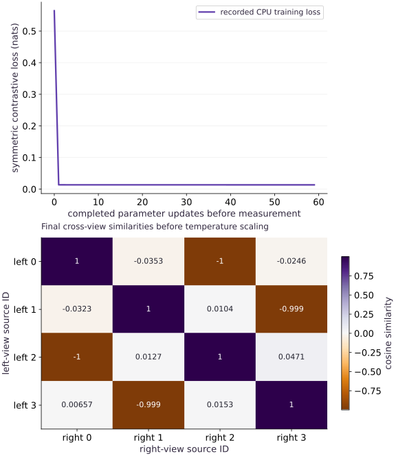

# Contrastive learning: views, positives and negatives

Phase 17: Self-supervised pretraining: masked and contrastive learning · about 105 minutes · CPU

## What you will be able to do

- Define the positive pair before augmenting
- Normalize embeddings and introduce temperature
- Verify the changed-condition exercise and explain the limits of this fixture.

## The problem

Two transformed views belong to the same source example. Can an encoder place them close together without mapping every input to the same point? We will inspect exactly which pairs the objective treats as positives.

## The idea

Contrastive learning compares representations using declared positive and negative relationships. Encoders and normalization produce comparable vectors, but the pairing rule decides which similarities the objective rewards.

## Define positive pairs before building the score matrix

Place one view on each score-matrix axis and mark the intended positive pairs. A diagonal positive mask assumes one matching pair per aligned index. If several examples share the same valid meaning, treating every off-diagonal entry as negative can create false negatives.

Temperature scales logits and changes concentration and gradient behavior; it does not change the underlying cosine values before scaling. Keep those two quantities on distinct labels.

Read both query directions when the objective trains both directions. A strong diagonal on a tiny fixture is separate from broad semantic retrieval. Inspect changed pairings and ambiguous cases, and avoid inventing a faithful two-dimensional picture of a higher-dimensional representation.

### Pause and reason

Can a high off-diagonal similarity always be called an error?

<details><summary>Compare your reasoning</summary>

No. It may be a false negative or another valid positive. Interpret scores using the declared semantic pairing contract, not index position alone.

</details>

## Before coding: make the retrieval problem explicit

Write four source IDs on cards and create two views of each. A row of the similarity matrix asks which right-hand card matches one left-hand card. A column asks the reverse. The diagonal is correct only while both lists have the same order. Source IDs, not array positions, define the positive relationship.

Our left and right views are short numeric vectors, and both pass through one shared linear encoder. CLIP uses separate image and text towers. The bookkeeping lesson transfers, but this four-pair exercise is not an image–text model. First learn how a correct pair competes with alternatives; only then replace the encoders and data.

## Define the positive pair before augmenting

Keep stable source IDs through both view pipelines. The positive for row i must still be the matching source in the other view. Augmentations encode an invariance assumption: a transformation that changes the label can create a false positive. Here small fixed perturbations preserve four explicitly defined directions.

## Normalize embeddings and introduce temperature

Unit-normalize embeddings, compute dot products, and divide by a positive temperature $\tau$. Lower temperature sharpens the categorical comparison. It does not change which pair is correct, and it is not automatically better. A norm floor defines numerical behavior near zero, but zero embeddings are still a collapsed representation.

$$
L=-\frac{1}{2N}\sum_i\left[\log\frac{e^{s_{ii}/\tau}}{\sum_j e^{s_{ij}/\tau}}+\log\frac{e^{s_{ii}/\tau}}{\sum_j e^{s_{ji}/\tau}}\right]
$$

## Calculate a two-pair objective by hand

For two orthogonal unit vectors paired with themselves, the cosine matrix has ones on the diagonal and zeros elsewhere. At temperature $\tau$, the correct candidate receives probability $e^{1/\tau}/(e^{1/\tau}+1)$. Both retrieval directions are identical, so the symmetric loss reduces to the expression below. A smaller temperature lowers this particular loss without changing which candidate ranks first.

Now swap only the right-hand order while retaining diagonal labels. The correct semantic match is off diagonal, but training is told to prefer the wrong card. Confident mistakes are penalized more strongly at low temperature. Lower training loss and better ranking are therefore related, but not interchangeable measurements.

$$
L=\log\left(1+e^{-1/\tau}\right)
$$

## Follow one row of the derivative

For logits $z_{ij}$, row cross-entropy contributes derivative $(p_{ij}-\mathbf{1}[j=i])/N$ before the symmetric half weight. The target logit is pushed up; competing logits are pushed down. The column objective adds another contribution. Unit normalization means the underlying encoder gradients also pass through the normalization Jacobian. A finite-difference check on an encoder weight tests that whole chain.

A collapsed representation has equal probabilities, but avoiding collapse on four training pairs does not prove semantics. Duplicate sources are especially revealing: they are indistinguishable candidates that diagonal-only supervision still treats as competitors.

## Check both directions independently

A row asks which right-hand view belongs to a left-hand example; a column asks the reverse question. The code calculates both with a stable host log-sum-exp reference. Check that jointly permuting both views preserves the objective. Permuting only one view without remapping targets should change the task.

## Understand collapse and false negatives

If every embedding is the same, every candidate has equal probability and the loss is $\log N$. That is a useful baseline, not a proof that every gradient path can escape collapse. Distinct source examples may share semantics; treating duplicates as negatives can penalize useful similarity. The cross-modal harness adds a multi-positive objective for that case.

## Separate pretraining evidence from downstream quality

The line records the four-pair training objective, and retrieval is checked on those same pairs. Neither is a linear-probe evaluation. A full representation study freezes the encoder, fits a small supervised probe using training labels and evaluates a held-out split; alternatively compare fine-tuning with random initialization under the same budget. Keep projection-head and encoder outputs distinct.

## Design an evaluation that is not just training-pair lookup

Freeze source-group splits before augmentation. Fit any probe on the training split only; evaluate on unseen source groups. Keep a fixed candidate pool for retrieval and define multiple-positive judgments and ties. Enlarging the pool makes the ranking task harder and changes the loss baseline, even if encoder weights remain unchanged.

Retain both the encoder representation and projection-head choice when reporting results. A representation useful to a linear probe can differ from the vector used by the training objective. For the next project, compare random, frozen pretrained and adapted encoders under one evaluation protocol, then inspect at least one correctly retrieved example and one plausible false negative.

## 1. Define both retrieval directions

Create main.py in your activated course environment. Paste this block, then run python main.py; function definitions alone print nothing.

```python
# Step 1 — 1. Define both retrieval directions: Row and column log-softmax share scores but normalize different...
# Import jax for this computation.
import jax
import jax.numpy as jnp
import numpy as np

# Function `paired_contrastive(left, right, temperature)` implementing this stage's computation:
def paired_contrastive(left, right, temperature=0.2):
    # Reduce across the target axis to summarize `left`.
    left = left / jnp.maximum(jnp.linalg.norm(left, axis=-1, keepdims=True), 1e-6)
    # Reduce across the target axis to summarize `right`.
    right = right / jnp.maximum(jnp.linalg.norm(right, axis=-1, keepdims=True), 1e-6)
    # Perform matrix contraction / projection to compute `scores`.
    scores = left @ right.T / temperature
    # Return `-0.5 * (jnp.mean(jnp.diag(jax.nn.log_softmax(scores, axis=1))) + jnp.mean(jnp.diag(jax.nn.log_softmax(scores, axis=0))))` to the caller.
    return -0.5 * (
        jnp.mean(jnp.diag(jax.nn.log_softmax(scores, axis=1)))
        + jnp.mean(jnp.diag(jax.nn.log_softmax(scores, axis=0)))
    )
```

Row and column log-softmax share scores but normalize different candidate axes. Draw which source each diagonal entry represents.

## 2. Construct paired views and an encoder

Append this block to main.py and run python main.py again. Keep the earlier blocks above it.

```python
# Step 2 — 2. Construct paired views and an encoder: The fixed perturbations preserve source identity.
# Construct `left` via `jnp.array(`
left = jnp.array(
    [[1.0, 0.0, 0.2], [0.0, 1.0, -0.2], [-1.0, 0.0, 0.1], [0.0, -1.0, -0.1]]
)
# Construct `right` via `left + jnp.array(`
right = left + jnp.array(
    [[0.02, -0.01, 0.0], [-0.01, 0.02, 0.0], [0.01, 0.01, 0.0], [-0.02, -0.01, 0.0]]
)
# Construct `w` via `jnp.array([[0.2, 0.1], [0.1, 0.1], [0.02, -0.01]])`
w = jnp.array([[0.2, 0.1], [0.1, 0.1], [0.02, -0.01]])
# Compute `history` from `[]`
history = []
# Differentiate the objective to obtain `step` via automatic differentiation.
step = jax.jit(
    jax.value_and_grad(lambda w: paired_contrastive(left @ w, right @ w, 0.2))
)
```

The fixed perturbations preserve source identity. Before training, list the four target column indices and predict the consequence of a one-sided permutation.

## 3. Train, then inspect identity and symmetry

Append this block to main.py and run python main.py again. Keep the earlier blocks above it.

```python
# Step 3 — 3. Train, then inspect identity and symmetry: The host calculation checks both denominators.
for _ in range(60):
    # Run `step` to compute `(value, g)`.
    value, g = step(w)
    # Append the current step result to `history`.
    history.append(float(value))
    # Compute `w` from `w - 0.03 * g`
    w = w - 0.03 * g

# Assert invariant `history[-1] < history[0]` holds
assert history[-1] < history[0]
# Perform matrix / vector contraction (`@`) to compute `zi`.
zi = left @ w
# Perform matrix / vector contraction (`@`) to compute `zt`.
zt = right @ w
# Compute `zi` from `zi / jnp.linalg.norm(zi, axis=1, keepdims=True)`
zi = zi / jnp.linalg.norm(zi, axis=1, keepdims=True)
# Compute `zt` from `zt / jnp.linalg.norm(zt, axis=1, keepdims=True)`
zt = zt / jnp.linalg.norm(zt, axis=1, keepdims=True)
# Perform matrix contraction / projection to compute `scores`.
scores = zi @ zt.T / 0.2
# Convert `host` to a host NumPy array for inspection or verification.
host = np.asarray(scores, dtype=np.float64)

# Function `host_ce(a)` implementing this stage's computation:
def host_ce(a):
    # Return `np.mean(np.log(np.exp(a - a.max(1, keepdims=True)).sum(1)) + a.max(1) - np.diag(a))` to the caller.
    return np.mean(
        np.log(np.exp(a - a.max(1, keepdims=True)).sum(1)) + a.max(1) - np.diag(a)
    )

# Perform matrix contraction / projection to compute ``.
np.testing.assert_allclose(
    paired_contrastive(left @ w, right @ w, 0.2),
    0.5 * (host_ce(host) + host_ce(host.T)),
    atol=1e-6,
)
# Assert invariant `np.array_equal(np.argmax(host, axis=1), np.arange(4))` holds
assert np.array_equal(np.argmax(host, axis=1), np.arange(4))
# Create device-backed JAX array `permutation`.
permutation = jnp.array([2, 0, 3, 1])
# Perform matrix contraction / projection to compute ``.
np.testing.assert_allclose(
    paired_contrastive(left @ w, right @ w),
    paired_contrastive((left @ w)[permutation], (right @ w)[permutation]),
    atol=1e-6,
)
# Print diagnostic summary of the computed outputs.
print(
    'Paired contrastive initial/final:',
    history[0],
    history[-1],
    '; all four nearest pairs correct',
)
```

The host calculation checks both denominators. Joint permutation preserves the problem; the later one-sided permutation deliberately changes it.

## Run the example

```python
# Step 1 — 1. Define both retrieval directions: Row and column log-softmax share scores but normalize different...
# Import jax for this computation.
import jax
import jax.numpy as jnp
import numpy as np

# Function `paired_contrastive(left, right, temperature)` implementing this stage's computation:
def paired_contrastive(left, right, temperature=0.2):
    # Reduce across the target axis to summarize `left`.
    left = left / jnp.maximum(jnp.linalg.norm(left, axis=-1, keepdims=True), 1e-6)
    # Reduce across the target axis to summarize `right`.
    right = right / jnp.maximum(jnp.linalg.norm(right, axis=-1, keepdims=True), 1e-6)
    # Perform matrix contraction / projection to compute `scores`.
    scores = left @ right.T / temperature
    # Return `-0.5 * (jnp.mean(jnp.diag(jax.nn.log_softmax(scores, axis=1))) + jnp.mean(jnp.diag(jax.nn.log_softmax(scores, axis=0))))` to the caller.
    return -0.5 * (
        jnp.mean(jnp.diag(jax.nn.log_softmax(scores, axis=1)))
        + jnp.mean(jnp.diag(jax.nn.log_softmax(scores, axis=0)))
    )

# Step 2 — 2. Construct paired views and an encoder: The fixed perturbations preserve source identity.
# Construct `left` via `jnp.array(`
left = jnp.array(
    [[1.0, 0.0, 0.2], [0.0, 1.0, -0.2], [-1.0, 0.0, 0.1], [0.0, -1.0, -0.1]]
)
# Construct `right` via `left + jnp.array(`
right = left + jnp.array(
    [[0.02, -0.01, 0.0], [-0.01, 0.02, 0.0], [0.01, 0.01, 0.0], [-0.02, -0.01, 0.0]]
)
# Construct `w` via `jnp.array([[0.2, 0.1], [0.1, 0.1], [0.02, -0.01]])`
w = jnp.array([[0.2, 0.1], [0.1, 0.1], [0.02, -0.01]])
# Compute `history` from `[]`
history = []
# Differentiate the objective to obtain `step` via automatic differentiation.
step = jax.jit(
    jax.value_and_grad(lambda w: paired_contrastive(left @ w, right @ w, 0.2))
)

# Step 3 — 3. Train, then inspect identity and symmetry: The host calculation checks both denominators.
for _ in range(60):
    # Run `step` to compute `(value, g)`.
    value, g = step(w)
    # Append the current step result to `history`.
    history.append(float(value))
    # Compute `w` from `w - 0.03 * g`
    w = w - 0.03 * g

# Assert invariant `history[-1] < history[0]` holds
assert history[-1] < history[0]
# Perform matrix / vector contraction (`@`) to compute `zi`.
zi = left @ w
# Perform matrix / vector contraction (`@`) to compute `zt`.
zt = right @ w
# Compute `zi` from `zi / jnp.linalg.norm(zi, axis=1, keepdims=True)`
zi = zi / jnp.linalg.norm(zi, axis=1, keepdims=True)
# Compute `zt` from `zt / jnp.linalg.norm(zt, axis=1, keepdims=True)`
zt = zt / jnp.linalg.norm(zt, axis=1, keepdims=True)
# Perform matrix contraction / projection to compute `scores`.
scores = zi @ zt.T / 0.2
# Convert `host` to a host NumPy array for inspection or verification.
host = np.asarray(scores, dtype=np.float64)

# Function `host_ce(a)` implementing this stage's computation:
def host_ce(a):
    # Return `np.mean(np.log(np.exp(a - a.max(1, keepdims=True)).sum(1)) + a.max(1) - np.diag(a))` to the caller.
    return np.mean(
        np.log(np.exp(a - a.max(1, keepdims=True)).sum(1)) + a.max(1) - np.diag(a)
    )

# Perform matrix contraction / projection to compute ``.
np.testing.assert_allclose(
    paired_contrastive(left @ w, right @ w, 0.2),
    0.5 * (host_ce(host) + host_ce(host.T)),
    atol=1e-6,
)
# Assert invariant `np.array_equal(np.argmax(host, axis=1), np.arange(4))` holds
assert np.array_equal(np.argmax(host, axis=1), np.arange(4))
# Create device-backed JAX array `permutation`.
permutation = jnp.array([2, 0, 3, 1])
# Perform matrix contraction / projection to compute ``.
np.testing.assert_allclose(
    paired_contrastive(left @ w, right @ w),
    paired_contrastive((left @ w)[permutation], (right @ w)[permutation]),
    atol=1e-6,
)
# Print diagnostic summary of the computed outputs.
print(
    'Paired contrastive initial/final:',
    history[0],
    history[-1],
    '; all four nearest pairs correct',
)
```

Expected: Training loss decreases and all four paired views are nearest neighbors.

## Contrastive learning: views, positives and negatives — recorded experiment

**Predict:** Predict where the largest similarity should appear in each row. What would a one-sided permutation do?



**Recorded CPU computation**

### Read the figure

The line is symmetric cross-view training loss in nats before each update. It falls from about $0.564$ to $0.014$. Lower values mean that the diagonal pair receives more probability among these four candidates, not that semantic accuracy is that number.

The second panel shows cosine similarity before division by temperature. A row is one left-view source and a column one right-view source. The row’s largest value lies at its matching ID on the diagonal; opposite directions can have negative similarity. Color encodes similarity, not a probability. Read both rows and columns because the loss trains both retrieval directions. A joint reorder moves the visible pattern without changing pair quality; an untracked one-sided reorder changes the labels.

### Connect it to the computation

The shared encoder starts with poorly separated directions and learns an embedding where each view retrieves its paired source. The duplicate-pair exercise changes the denominator and reveals why a loss cannot be compared blindly across batch construction policies.

```python
# Compute figure data for: Contrastive learning: views, positives and negatives — recorded experiment
# Compute `visual_data` from `{'kind':'line','xlabel':'completed parameter updates...`
visual_data={'kind':'line','xlabel':'completed parameter updates before measurement','ylabel':'symmetric contrastive loss (nats)','series':[{'label':'recorded CPU training loss','x':list(range(len(history))),'y':history}]}
# Loop over `panel` in `visual_data.get('panels', [visual_data])`:
for panel in visual_data.get('panels',[visual_data]):
    # Compute `panel['x']` from `panel['series'][0]['x']`
    panel['x']=panel['series'][0]['x']

# Convert `extra_panel` to a host NumPy array for inspection or verification.
extra_panel={'kind':'heatmap','values':np.asarray(zi@zt.T).tolist(),'rows':['left 0','left 1','left 2','left 3'],'columns':['right 0','right 1','right 2','right 3'],'unit':'cosine similarity','diverging':True,'xlabel':'right-view source ID','ylabel':'left-view source ID','title':'Final cross-view similarities before temperature scaling'}
# Compute `visual_data` from `{"panels":[*visual_data.get("panels",[visual_data]),...`
visual_data={"panels":[*visual_data.get("panels",[visual_data]),extra_panel]}
```

## Recorded reference execution

CPU run: 2026-10-08T14:07:54.832245+00:00. JAX 0.9.2.

```text
Paired contrastive initial/final: 0.564157247543335 0.013556718826293945 ; all four nearest pairs correct
Paired contrastive initial/final: 0.564157247543335 0.013556718826293945 ; all four nearest pairs correct
Collapsed baseline: 1.3862943649291992
Temperature/loss: 0.2 0.006715348921716213
Temperature/loss: 1.0 0.31326162815093994
Temperature/loss: 2.0 0.4740769863128662
Incorrect pair mapping loss: 7.493563652038574
Duplicated diagonal-only penalty: 0.6931472215801477
Step / finite difference / autodiff: 0.001 -1.3803242444992065 -1.3803226947784424
Step / finite difference / autodiff: 0.0005 -1.3802646398544312 -1.3803226947784424
PASS: pretraining-03

```

## Measure the collapsed baseline

**Predict before running:** What loss should identical embeddings achieve for four candidate pairs?

```python
# Experiment — Measure the collapsed baseline: Equal similarity gives each candidate probability one quarter.
# Construct `collapsed` via `jnp.ones((4, 2))`
collapsed = jnp.ones((4, 2))
# Evaluate `paired_contrastive(collapsed, collapsed)` and convert the result into Python scalar/collection `collapse_loss`.
collapse_loss = float(paired_contrastive(collapsed, collapsed))
# Compute `np.testing.assert_allclose(collapse_loss, np.log(4), atol` as `1e-6)`.
np.testing.assert_allclose(collapse_loss, np.log(4), atol=1e-6)
# Print the observed values to compare against the expected result.
print('Collapsed baseline:', collapse_loss)
```

**Expected:** The collapsed loss is log(4), approximately 1.386.

Equal similarity gives each candidate probability one quarter. This baseline catches objectives that reward only attraction and forget competing candidates.

## Separate temperature from ranking

**Predict before running:** For two orthogonal matched pairs, does lowering temperature change top-1 retrieval or only confidence?

```python
# Experiment — Separate temperature from ranking: The independent binary-softmax expression checks scale handling...
# Compute `orthogonal` from `jnp.eye(2)`
orthogonal = jnp.eye(2)
# Iterate over `tau` to step through the computation:
for tau in [0.2, 1.0, 2.0]:
    # Evaluate `paired_contrastive(orthogonal, orthogonal, tau)` and convert the result into Python scalar/collection `observed`.
    observed = float(paired_contrastive(orthogonal, orthogonal, tau))
    # Compute `np.testing.assert_allclose(observed, np.logaddexp(0.0, -1.0 / tau), atol` as `1e-6)`.
    np.testing.assert_allclose(observed, np.logaddexp(0.0, -1.0 / tau), atol=1e-6)
    # Convert `` to a host NumPy array for inspection or verification.
    np.testing.assert_array_equal(
        np.argmax(np.asarray(orthogonal @ orthogonal.T) / tau, axis=1), [0, 1]
    )
    # Print diagnostic summary of the computed outputs.
    print('Temperature/loss:', tau, observed)
```

**Expected:** All three temperatures keep the same ranking while their losses differ.

The independent binary-softmax expression checks scale handling and demonstrates why loss comparisons require a fixed temperature and pool.

## Make it yours

Permute only the right-hand embeddings after training and demonstrate the effect of broken pair identity.

### How to write this exercise — Step-by-step recipe & starter scaffold

**Key functions & syntax to use:**
- `paired_contrastive(...)` — Call `paired_contrastive` with your updated parameters or inputs from this lesson's workspace.
- `assert condition` — Verify that the observed output shape, status, or numerical value satisfies the contract.

**Step-by-step implementation plan:**
1. Assert invariant `wrong_pair_loss > float(paired_contrastive(left @ w, right @ w))` holds
2. Print the observed values to compare against the expected result.

**Starter code scaffold (fill in the TODOs):**

```python
# Exercise solution: Permute only the right-hand embeddings after training and demonstrate...
wrong_pair_loss = float(...)  # TODO: compute wrong_pair_loss
# Assert invariant `wrong_pair_loss > float(paired_contrastive(left @ w, right @ w))` holds
assert wrong_pair_loss  # TODO: complete assertion check
# Print the observed values to compare against the expected result.
print('Incorrect pair mapping loss:', wrong_pair_loss)
```

<details><summary>Reference solution</summary>

```python
# Exercise solution: Permute only the right-hand embeddings after training and demonstrate...
wrong_pair_loss = float(paired_contrastive(left @ w, (right @ w)[permutation]))
# Assert invariant `wrong_pair_loss > float(paired_contrastive(left @ w, right @ w))` holds
assert wrong_pair_loss > float(paired_contrastive(left @ w, right @ w))
# Print the observed values to compare against the expected result.
print('Incorrect pair mapping loss:', wrong_pair_loss)
```

</details>

## Duplicate a source and inspect the objective

**Transfer**

Duplicate all four pairs while keeping diagonal-only positives. Calculate the change in loss and explain the false-negative effect.

<details><summary>Hint</summary>

Each original candidate appears twice, but only one copy is labeled positive.

</details>

### How to write: Duplicate a source and inspect the objective — Step-by-step recipe & starter scaffold

**Key functions & syntax to use:**
- `jnp.allclose(actual, expected, rtol=..., atol=...)` — Checks that two arrays match elementwise within floating-point tolerance.

**Step-by-step implementation plan:**
1. Perform matrix contraction / projection to compute `original`.
2. Compute `np.testing.assert_allclose(duplicated - original, np.log(2), atol` as `1e-5)`.
3. Print the observed values to compare against the expected result.

**Starter code scaffold (fill in the TODOs):**

```python
# Duplicate a source and inspect the objective (Transfer): The extra log(2) comes from duplicating each denominator...
duplicated = float(...)  # TODO: compute duplicated
    paired_contrastive(jnp.tile(left @ w, (2, 1)), jnp.tile(right @ w, (2, 1)))
)
# Perform matrix contraction / projection to compute `original`.
original = float(...)  # TODO: compute original
# Compute `np.testing.assert_allclose(duplicated - original, np.log(2), atol` as `1e-5)`.
np.testing.assert_allclose(duplicated - original, np.log(2), atol=1e-5)
# Print the observed values to compare against the expected result.
print('Duplicated diagonal-only penalty:', duplicated - original)
```

<details><summary>Reference solution and reasoning</summary>

```python
# Duplicate a source and inspect the objective (Transfer): The extra log(2) comes from duplicating each denominator...
duplicated = float(
    paired_contrastive(jnp.tile(left @ w, (2, 1)), jnp.tile(right @ w, (2, 1)))
)
# Perform matrix contraction / projection to compute `original`.
original = float(paired_contrastive(left @ w, right @ w))
# Compute `np.testing.assert_allclose(duplicated - original, np.log(2), atol` as `1e-5)`.
np.testing.assert_allclose(duplicated - original, np.log(2), atol=1e-5)
# Print the observed values to compare against the expected result.
print('Duplicated diagonal-only penalty:', duplicated - original)
```

The extra log(2) comes from duplicating each denominator candidate without adding the second copy to the positive set. Use source/semantic identity to define multi-positive supervision when appropriate.

</details>

## Check the encoder gradient through normalization

**Challenge**

Perturb one encoder weight at the initial, noncollapsed matrix and compare centered differences with autodiff. Repeat with a second finite-difference step.

<details><summary>Hint</summary>

Use a fresh matrix; a gradient near a trained optimum may be too small to diagnose accurately.

</details>

### How to write: Check the encoder gradient through normalization — Step-by-step recipe & starter scaffold

**Key functions & syntax to use:**
- `jnp.array(values, dtype=...)` — Constructs an immutable device-backed JAX array from Python/NumPy values.
- `jnp.allclose(actual, expected, rtol=..., atol=...)` — Checks that two arrays match elementwise within floating-point tolerance.
- `jax.grad(loss_fn)(params, ...)` — Transforms a scalar-output function into a function returning the gradient PyTree with the same structure as `params`.

**Step-by-step implementation plan:**
1. Construct `audit_w` via `jnp.array([[0.2, 0.1], [0.1, 0.1], [0.02, -0.01]])`
2. Perform matrix contraction / projection to compute `objective`.
3. Differentiate the objective to obtain `auto` via automatic differentiation.
4. Iterate over `epsilon` to step through the computation:
5. Construct `delta` via `jnp.zeros_like(audit_w).at[0, 0].set(epsilon)`

**Starter code scaffold (fill in the TODOs):**

```python
# Check the encoder gradient through normalization (Challenge): This checks the complete input-to-normalized-similarity chain.
# Construct `audit_w` via `jnp.array([[0.2, 0.1], [0.1, 0.1], [0.02, -0.01]])`
audit_w = jnp.array(...)  # TODO: compute audit_w
# Perform matrix contraction / projection to compute `objective`.
objective = ...  # TODO: compute objective
# Differentiate the objective to obtain `auto` via automatic differentiation.
auto = float(...)  # TODO: compute auto
# Iterate over `epsilon` to step through the computation:
for epsilon in [1e-3, 5e-4]:
    # Construct `delta` via `jnp.zeros_like(audit_w).at[0, 0].set(epsilon)`
    delta = jnp.zeros_like(...)  # TODO: compute delta
    # Evaluate `(objective(audit_w + delta) - objective(audit_w - delta)) / (2 * epsilon)` and convert the result into Python scalar/collection `estimate`.
    estimate = float(...)  # TODO: compute estimate
        (objective(audit_w + delta) - objective(audit_w - delta)) / (2 * epsilon)
    )
    # Compute `np.testing.assert_allclose(estimate, auto, rtol` as `3e-3, atol=1e-3)`.
    np.testing.assert_allclose(estimate, auto, rtol = ...  # TODO: compute np.testing.assert_allclose(estimate, auto, rtol
    # Print diagnostic summary of the computed outputs.
    print('Step / finite difference / autodiff:', epsilon, estimate, auto)
```

<details><summary>Reference solution and reasoning</summary>

```python
# Check the encoder gradient through normalization (Challenge): This checks the complete input-to-normalized-similarity chain.
# Construct `audit_w` via `jnp.array([[0.2, 0.1], [0.1, 0.1], [0.02, -0.01]])`
audit_w = jnp.array([[0.2, 0.1], [0.1, 0.1], [0.02, -0.01]])
# Perform matrix contraction / projection to compute `objective`.
objective = lambda weights: paired_contrastive(left @ weights, right @ weights, 0.2)
# Differentiate the objective to obtain `auto` via automatic differentiation.
auto = float(jax.grad(objective)(audit_w)[0, 0])
# Iterate over `epsilon` to step through the computation:
for epsilon in [1e-3, 5e-4]:
    # Construct `delta` via `jnp.zeros_like(audit_w).at[0, 0].set(epsilon)`
    delta = jnp.zeros_like(audit_w).at[0, 0].set(epsilon)
    # Evaluate `(objective(audit_w + delta) - objective(audit_w - delta)) / (2 * epsilon)` and convert the result into Python scalar/collection `estimate`.
    estimate = float(
        (objective(audit_w + delta) - objective(audit_w - delta)) / (2 * epsilon)
    )
    # Compute `np.testing.assert_allclose(estimate, auto, rtol` as `3e-3, atol=1e-3)`.
    np.testing.assert_allclose(estimate, auto, rtol=3e-3, atol=1e-3)
    # Print diagnostic summary of the computed outputs.
    print('Step / finite difference / autodiff:', epsilon, estimate, auto)
```

This checks the complete input-to-normalized-similarity chain. Trying two step sizes helps distinguish truncation error from a broken derivative.

</details>

## Check your understanding

What does successful retrieval on the training pairs establish?

1. The encoder solves those pairs under that pairing and augmentation contract.
2. Lowering the temperature parameter $\tau$ improves the nearest-neighbor ranking order of the cosine matrix.
3. Diagonal-only supervision automatically merges duplicate semantic examples into a single positive target.

<details><summary>Answer and explanation</summary>

The encoder solves those pairs under that pairing and augmentation contract.

It is separate from downstream task quality or robustness to a new data distribution.

</details>

## Diagnose the result

If training stalls near the collapsed baseline, inspect norms and pairing before reducing temperature. Unexpected loss jumps after batching changes can reflect false negatives or a different candidate set.

## Carry forward

- Track source identity explicitly across both view pipelines: symmetric contrastive loss normalizes row and column retrieval probabilities over the candidate pool, and a collapsed representation sits at $\log N$.
- Keep temperature $\tau$ and candidate-pool size fixed when comparing contrastive losses, and evaluate frozen representations on held-out source groups rather than training-pair lookup.

## Keep your evidence

Keep source pairing, temperature, stable two-direction loss checks, collapse and duplicate baselines, training outputs and broken-pair diagnosis.

Save your predictions, modified code, terminal outputs, and reasoning in your engineering portfolio.

## Primary references

- [SimCLR: views and representations](https://arxiv.org/abs/2002.05709)
- [CLIP: symmetric paired contrastive training](https://arxiv.org/abs/2103.00020)

