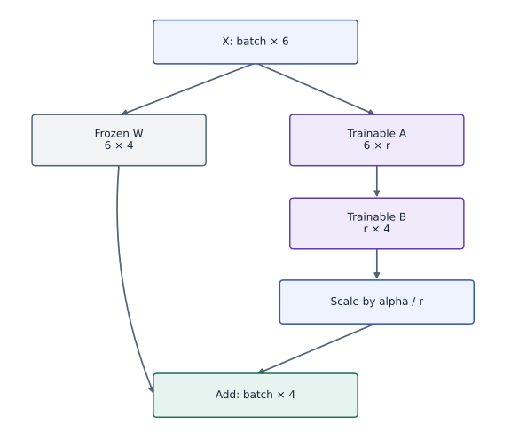

# LoRA: adapt, save and merge low-rank updates

Phase 18: Post-training: SFT, LoRA, reward models and RLHF · about 105 minutes · CPU

## What you will be able to do

- Separate the frozen base from trainable adapters
- Understand initialization and the first gradient
- Verify the changed-condition exercise and explain the limits of this fixture.

## The problem

A trained dense layer already works, but the task changes. Can we fit the change while leaving the original weights untouched? We will first train a base, then learn and audit a low-rank update.

## The idea

LoRA adds a trainable low-rank correction to a frozen weight map. The base still participates in the forward pass while a smaller set of factors adapts the output. Shape convention and scaling determine how those paths combine.

## Separate the frozen path from the low-rank correction

Here the base matrix has shape $(6,4)$. With rank $r$, factors have shapes $(6,r)$ and $(r,4)$, so their product has the same shape as the base. The correction is scaled by $\alpha/r$ before addition.

In the fixture, the second factor starts at zero. The correction is initially zero; the first factor's initial gradient is also zero, while the second factor can receive a nonzero gradient. This is an informative initialization check rather than evidence that training is broken.

After training, compare separate-branch inference with merged weights using the same scaling. Freezing parameters does not mean their computation vanishes. The plot of factor gradients explains which path learns first; it does not imply every full-model adapter behaves identically.

### Frozen base plus a low-rank correction

**Predict:** If rank changes while alpha stays fixed, can you omit the scaling when merging?



*Conceptual / analytic teaching diagram; not a recorded benchmark.*

Input enters both branches. The base weight is frozen; A and B are trainable. Both paths return four features before addition. Include $\alpha/r$ when merging. These are forward-data arrows: gradients update adapter factors but not frozen base parameters.

### Pause and reason

If rank changes while alpha stays fixed, can you omit the scaling when merging?

<details><summary>Compare your reasoning</summary>

No. Merge the exact scaled correction used in forward computation. Otherwise the merged model computes a different function.

</details>

## Before coding: adapt a change, not an entire matrix

Begin with a base mapping that already works on a source task. The new task changes the output in a small number of directions. LoRA represents an added matrix through two smaller factors while preserving the base weights. Freezing the base protects those stored weights; it does not guarantee the adapted outputs retain the old behavior. That is why adaptation and retention need separate evaluation.

Trace dimensions for input width $d$, output width $k$, and rank $r$. The first factor compresses inputs into $r$ coordinates, and the second expands them into the output coordinates. The update matrix can have rank at most $r$, regardless of training time.

## Separate the frozen base from trainable adapters

For input-by-output weights $W_0$, let $A$ have shape $(d,r)$ and $B$ shape $(r,k)$. Compute the base output plus the scaled adapter output. Only the adapter tuple is passed to the gradient function. Keep a copy of $W_0$ and compare it exactly after training.

$$
Y=XW_0+\frac{\alpha}{r}XAB
$$

## Understand initialization and the first gradient

Initialize $A$ randomly and $B$ to zero. The initial adapter output is zero, so predictions match the base. At this first step the gradient with respect to $A$ is zero because it multiplies $B$; the gradient for $B$ can be nonzero. Initializing both factors to zero would block both gradients for this bilinear update.

## Derive the first-step asymmetry

Write the dense-layer output gradient as $G$, with the same batch-by-output shape as the prediction. Let $s=\alpha/r$. The two derivatives below explain initialization. When $B=0$, the first derivative vanishes, while the second can be nonzero if $A$ is random. After one update to $B$, both factors may learn. If both factors start at zero, both gradients vanish and training stalls.

This is a property of the bilinear parameterization, not a JAX bug. Inspect factor norms and individual gradients before changing the learning rate.

$$
\nabla_A L=sX^\top GB^\top,\qquad \nabla_B L=sA^\top X^\top G
$$

## Use rank to predict a failure before training

A rank-one update can represent one independent output-change direction. Consider an ideal update with singular values $3$ and $1$. Any rank-one approximation leaves at least squared Frobenius error $1$; increasing optimization steps cannot remove that rank constraint. This matrix-space statement translates into prediction error only under assumptions about the input distribution. The exercise uses identity inputs so that distinction is visible.

Our main target was constructed as a rank-one update, so near-zero training error is expected. A convincing study compares several ranks on a harder held-out task and reports trainable parameters, optimizer memory, activation memory and measured runtime separately.

## Count the right kind of savings

The fixture has $6\times4=24$ base weights and rank $1$, giving $6+4=10$ trainable adapter scalars. The base remains resident. Real memory includes gradients, optimizer state, activations and runtime buffers. A low-bit frozen base plus adapters also needs a quantization policy and supported kernels; this lab does not implement QLoRA.

## Merge only under an explicit serving contract

Without adapter dropout, an inference merge computes $W_{\mathrm{merged}}=W_0+(\alpha/r)AB$. Check outputs on changed inputs before deleting or replacing anything. Keep the unmerged base, adapter and scaling metadata; a second accidental merge adds the update twice. Packed or quantized bases require dequantization/requantization rules rather than a blind in-place add.

## Save the adaptation identity

An adapter artifact needs the base checkpoint hash, target module names, rank, alpha, dtype and exact factor arrays. Match all of these on load. Compare the adapted task and original task separately; low rank does not prevent forgetting, and this rank-one teacher does not predict the rank required by a real task.

## Make an adapter artifact reproducible

Save the exact base identity, target layer names, tensor orientation, rank, scaling, factor dtype and adapter weights. Reconstruct the unmerged computation before testing a merge. A rank-two adapter with $\alpha=3$ requires scale $1.5$; forgetting that scale may go unnoticed in rank-one examples where it equals one.

Merging is exact algebraically for this dense layer, subject to floating-point rounding. Quantized bases, packed layouts and adapter dropout need additional contracts. Retain original artifacts, compare changed inputs after reload, and reject applying the same update twice. Keep a source-task metric alongside the new task before claiming that adaptation preserved useful behavior.

## 1. Define the frozen-plus-adapter forward pass

Create main.py in your activated course environment. Paste this block, then run python main.py; function definitions alone print nothing.

```python
import jax
import jax.numpy as jnp
import numpy as np

def lora_forward(x, base, a, b, alpha=1.):
    rank = a.shape[1]
    return x @ base + (alpha/rank) * (x @ a @ b)
```

The base is an input to the forward pass but is not in the adapter tuple differentiated by loss.

## 2. Train a base, freeze it and initialize the adapter

Append this block to main.py and run python main.py again. Keep the earlier blocks above it.

```python
x=jnp.asarray(np.random.default_rng(4).normal(size=(24,6)),jnp.float32)
source_w=jnp.arange(24,dtype=jnp.float32).reshape(6,4)/40
base=jnp.zeros_like(source_w)
base_step=jax.jit(jax.grad(lambda w:jnp.mean((x@w-x@source_w)**2)))
for _ in range(150):base=base-.15*base_step(base)
assert float(jnp.mean((x@base-x@source_w)**2))<1e-4
frozen=np.asarray(base).copy()
u=jnp.array([[.2],[-.3],[.1],[.2],[-.1],[.4]])
v=jnp.array([[.5,-.2,.3,.1]])
target=x@(base+u@v)
a=jax.random.normal(jax.random.key(4),(6,1))*.1;b=jnp.zeros((1,4));params=(a,b)
loss=lambda ab:jnp.mean((lora_forward(x,base,*ab,alpha=1.)-target)**2)
step=jax.jit(jax.value_and_grad(loss));history=[]
initial_grads=step(params)[1]
np.testing.assert_array_equal(initial_grads[0],np.zeros((6,1)))
assert np.linalg.norm(initial_grads[1])>0
```

This step includes the source-task training. Inspect the initial factor gradients: A has zero gradient and B has a nonzero one.

## 3. Adapt and verify the serving merge

Append this block to main.py and run python main.py again. Keep the earlier blocks above it.

```python
for _ in range(250):
    value,g=step(params);history.append(float(value));params=jax.tree.map(lambda a,b:a-.4*b,params,g)
a,b=params
assert history[-1]<history[0]*.02
np.testing.assert_array_equal(base,frozen)
merged=base+a@b
np.testing.assert_allclose(lora_forward(x,base,a,b),x@merged,rtol=1e-5,atol=1e-6)
print('LoRA initial/final:',history[0],history[-1],'; trainable:',a.size+b.size,'base:',base.size)
```

The reference target has rank one by construction. Exact base equality and changed-input merge checks answer different questions from adaptation loss.

## Run the example

```python
import jax
import jax.numpy as jnp
import numpy as np

def lora_forward(x, base, a, b, alpha=1.):
    rank = a.shape[1]
    return x @ base + (alpha/rank) * (x @ a @ b)

x=jnp.asarray(np.random.default_rng(4).normal(size=(24,6)),jnp.float32)
source_w=jnp.arange(24,dtype=jnp.float32).reshape(6,4)/40
base=jnp.zeros_like(source_w)
base_step=jax.jit(jax.grad(lambda w:jnp.mean((x@w-x@source_w)**2)))
for _ in range(150):base=base-.15*base_step(base)
assert float(jnp.mean((x@base-x@source_w)**2))<1e-4
frozen=np.asarray(base).copy()
u=jnp.array([[.2],[-.3],[.1],[.2],[-.1],[.4]])
v=jnp.array([[.5,-.2,.3,.1]])
target=x@(base+u@v)
a=jax.random.normal(jax.random.key(4),(6,1))*.1;b=jnp.zeros((1,4));params=(a,b)
loss=lambda ab:jnp.mean((lora_forward(x,base,*ab,alpha=1.)-target)**2)
step=jax.jit(jax.value_and_grad(loss));history=[]
initial_grads=step(params)[1]
np.testing.assert_array_equal(initial_grads[0],np.zeros((6,1)))
assert np.linalg.norm(initial_grads[1])>0
for _ in range(250):
    value,g=step(params);history.append(float(value));params=jax.tree.map(lambda a,b:a-.4*b,params,g)
a,b=params
assert history[-1]<history[0]*.02
np.testing.assert_array_equal(base,frozen)
merged=base+a@b
np.testing.assert_allclose(lora_forward(x,base,a,b),x@merged,rtol=1e-5,atol=1e-6)
print('LoRA initial/final:',history[0],history[-1],'; trainable:',a.size+b.size,'base:',base.size)

```

Expected: The trained base stays unchanged; 10 adapter scalars fit the rank-one change and merge equivalently.

## LoRA: adapt, save and merge low-rank updates — recorded experiment

**Predict:** Which initial adapter-gradient bar is zero, and why can training still begin?


**Recorded CPU computation**

### Read the figure

The plot is adaptation MSE before each update, falling from about $0.044$ to below $10^{-6}$. It does not include the preceding base-training run. The target update was constructed to have rank one, so this is an achievable representation test rather than a universal LoRA performance claim.

The second panel compares the two initial factor-gradient norms. The zero-height A bar is expected because B starts at zero; the positive B bar shows the update has a route to begin learning. After B changes, A can receive gradient. These are initial gradients while the first panel spans the full adaptation run. The all-zero initialization experiment predicts two zero bars and nonzero loss, exposing a stalled parameterization.

### Connect it to the computation

The first adapter update affects B; later updates can train both factors. The unchanged-base assertion, reloaded adapter and new-input merge comparison are separate evidence from the falling training line.

```python
visual_data={'kind':'line','xlabel':'completed parameter updates before measurement','ylabel':'adaptation MSE (squared output units)','series':[{'label':'recorded CPU training loss','x':list(range(len(history))),'y':history}]}
for panel in visual_data.get('panels',[visual_data]):
    panel['x']=panel['series'][0]['x']

extra_panel={'kind':'bar','x':[0,1],'labels':['factor A','factor B'],'series':[{'label':'initial gradient norm','y':[float(jnp.linalg.norm(initial_grads[0])),float(jnp.linalg.norm(initial_grads[1]))]}],'xlabel':'trainable factor','ylabel':'gradient L2 norm','title':'Why the first update changes only B'}
visual_data={"panels":[*visual_data.get("panels",[visual_data]),extra_panel]}

```

## Recorded reference execution

CPU run: 2026-10-06T22:04:46.112787+00:00. JAX 0.9.2.

```text
LoRA initial/final: 0.043869297951459885 2.466217665642034e-07 ; trainable: 10 base: 24
LoRA initial/final: 0.043869297951459885 2.466217665642034e-07 ; trainable: 10 base: 24
Both zero factors produce zero first gradients.
Both LoRA factor gradients match the matrix-calculus oracle at alpha/r = 1.5.
Adapter round trip and merge checked.
New-input merge passes; accidental double merge changes outputs.
Nonunit scaling passes; best rank-one identity-input MSE is 0.25.
PASS: posttraining-02

```

## Show why two zero factors cannot start learning

**Predict before running:** If both factors start at zero, can this first-order update move either one?

```python
zero=(jnp.zeros_like(a),jnp.zeros_like(b))
zero_grad=jax.grad(loss)(zero)
assert all(np.array_equal(np.asarray(g),np.zeros(g.shape)) for g in zero_grad)
print('Both zero factors produce zero first gradients.')
```

**Expected:** Both factor gradients are exactly zero.

Each factor’s derivative contains the other factor. Randomizing one and zeroing the other preserves the initial base output without blocking the whole update.

## Check both factor gradients with matrix calculus

**Predict before running:** At nonzero factors, will the two matrix-gradient formulas agree with autodiff including nonunit alpha?

```python
rng=np.random.default_rng(14)
a_probe=jnp.asarray(rng.normal(size=(6,2))*.1,jnp.float32)
b_probe=jnp.asarray(rng.normal(size=(2,4))*.1,jnp.float32)
scale=3./2
output_gradient=2*(lora_forward(x,base,a_probe,b_probe,3.)-target)/target.size
expected_a=scale*x.T@output_gradient@b_probe.T
expected_b=scale*a_probe.T@x.T@output_gradient
actual_a,actual_b=jax.grad(lambda aa,bb:jnp.mean((lora_forward(x,base,aa,bb,3.)-target)**2),argnums=(0,1))(a_probe,b_probe)
np.testing.assert_allclose(actual_a,expected_a,atol=1e-6)
np.testing.assert_allclose(actual_b,expected_b,atol=1e-6)
print('Both LoRA factor gradients match the matrix-calculus oracle at alpha/r = 1.5.')
```

**Expected:** Both factor derivatives match the independent output-gradient calculation.

Nonzero factors exercise both gradient paths, while nonunit scaling catches a factor missing from the derivative. The separate all-zero experiment demonstrates the initialization failure.

## Make it yours

Save both adapter factors and their rank/scaling metadata, reload them and check merged versus unmerged predictions.

<details><summary>Reference solution</summary>

```python
import tempfile
from pathlib import Path
with tempfile.TemporaryDirectory() as folder:
    path=Path(folder)/'adapter.npz'
    np.savez(path,a=np.asarray(a),b=np.asarray(b),alpha=np.array(1.),rank=np.array(1))
    with np.load(path,allow_pickle=False) as z:
        assert int(z['rank'])==z['a'].shape[1]
        np.testing.assert_allclose(lora_forward(x,base,z['a'],z['b'],float(z['alpha'])),x@merged,atol=1e-6,rtol=1e-5)
print('Adapter round trip and merge checked.')
```

</details>

## Check the merge on new inputs

**Transfer**

Draw a new input batch and compare the merged layer with the adapter path.

<details><summary>Hint</summary>

The equivalence is algebraic, so a new input should still agree.

</details>

<details><summary>Reference solution and reasoning</summary>

```python
new_x=jnp.asarray(np.random.default_rng(91).normal(size=(7,6)),jnp.float32)
np.testing.assert_allclose(lora_forward(new_x,base,a,b),new_x@merged,atol=1e-6,rtol=1e-5)
assert np.linalg.norm(np.asarray(new_x@(base+2*a@b)-new_x@merged))>1e-3
print('New-input merge passes; accidental double merge changes outputs.')
```

The second check detects an operational merge error that training loss alone would not reveal.

</details>

## Test nonunit scaling and an impossible rank-one target

**Challenge**

Check merge equivalence at rank two with alpha three. Then use identity inputs and a diagonal target with singular values three and one to calculate the best rank-one residual.

<details><summary>Hint</summary>

Use an independent singular-value decomposition for the rank bound, and divide alpha by rank in both serving paths.

</details>

<details><summary>Reference solution and reasoning</summary>

```python
rng=np.random.default_rng(8)
a2=jnp.asarray(rng.normal(size=(6,2)),jnp.float32);b2=jnp.asarray(rng.normal(size=(2,4)),jnp.float32)
np.testing.assert_allclose(lora_forward(x,base,a2,b2,alpha=3.),x@(base+1.5*a2@b2),rtol=1e-5,atol=2e-6)
target_update=np.diag([3.,1.]);u_s,s_s,v_s=np.linalg.svd(target_update)
rank_one=(u_s[:,:1]*s_s[:1])@v_s[:1]
np.testing.assert_allclose(np.sum((target_update-rank_one)**2),1.)
np.testing.assert_allclose(np.mean((np.eye(2)@target_update-np.eye(2)@rank_one)**2),.25)
print('Nonunit scaling passes; best rank-one identity-input MSE is 0.25.')
```

The residual predicts a capacity limit independently of an optimizer. The nonunit-alpha case catches a scaling bug that the main rank-one demonstration would miss.

</details>

## Check your understanding

Does LoRA require updating the base weights during adapter training?

1. No. The base is frozen; the selected adapter parameters receive updates.
2. A lower training loss by itself proves the full application is ready.
3. Matching shapes alone establishes the required behavior.

<details><summary>Answer and explanation</summary>

No. The base is frozen; the selected adapter parameters receive updates.

Freeze ownership should be checked in code, not inferred from an adapter-shaped parameter name.

</details>

## Diagnose the result

If neither factor moves, inspect initialization. If merged predictions drift, check factor orientation, rank scaling, dropout, base identity and accidental repeated merges.

## Carry forward

- Write the dense-layer output gradient as $G$, with the same batch-by-output shape as the prediction. Let $s=\alpha/r$. The two derivatives below explain initialization. When $B=0$, the first derivative vanishes, while the second can be nonzero if $A$ is random. After one update to $B$, both factors may learn. If both factors start at zero, both gradients vanish and training stalls.
- Save the exact base identity, target layer names, tensor orientation, rank, scaling, factor dtype and adapter weights. Reconstruct the unmerged computation before testing a merge. A rank-two adapter with $\alpha=3$ requires scale $1.5$; forgetting that scale may go unnoticed in rank-one examples where it equals one.

## Keep your evidence

Keep base-training evidence, unchanged base arrays, adapter factors/rank/alpha, initial-gradient checks and reloaded/new-input merge parity.

Keep predictions, modified code, observed results, and reasoning. A checkpoint alone does not demonstrate the exercise.

## Primary references

- [LoRA](https://arxiv.org/abs/2106.09685)

