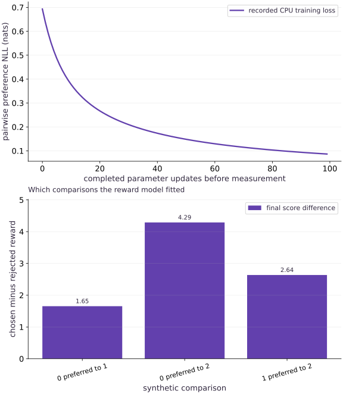

# Learn a reward model from pairwise preferences

Phase 18: Post-training: SFT, LoRA, reward models and RLHF · about 75 minutes · CPU

## What you will be able to do

- Represent a preference as a comparison
- Fit score differences with a stable likelihood
- Verify the changed-condition exercise and explain the limits of this fixture.

## The problem

You know which of two responses is preferred, but you do not have an absolute score for either. How can a model learn from that comparison, and what does its score mean?

## The idea

The reward model assigns a scalar to response features and fits pairwise comparisons using a logistic preference likelihood. All labels here are synthetic and declared. Training such a model from actual human feedback additionally requires a documented rating protocol, disagreement handling and independent evaluation.

## Represent a preference as a comparison

Keep the prompt identity, chosen/rejected response identities, label source and split. Pairwise ratings are conditional on a shared prompt and rubric; comparing unrelated prompts can teach a spurious score offset. The fixture has three response feature vectors with an explicit ordering.

## Fit score differences with a stable likelihood

The probability of preferring a chosen response is the sigmoid of its reward difference. The negative log likelihood is softplus of the negative margin. A tied pair starts at $\log 2$. A common offset to all rewards cancels, so comparisons alone do not identify an absolute reward origin.

$$
L_{\mathrm{RM}}=\mathbb E\left[\operatorname{softplus}\!\left(-(r_w(x,y^+)-r_w(x,y^-))\right)\right]
$$

## Separate ranking from calibration

Check ordering, held-out pair likelihood and agreement by prompt/source slice. A large positive margin means the model is confident under its likelihood, not that a response is universally good. Separable preferences can drive growing margins; regularization, validation and stopping rules matter even when every training comparison is correct.

## Preserve disagreement and data provenance

Real raters may disagree for legitimate reasons. Retain the rating rubric, task, annotator process and uncertainty instead of converting every disagreement into a perfect label. Split prompts and near-duplicate responses by source so a held-out score does not reward memorization. This lab does not collect personal data or human ratings.

## Keep the reward model fixed during policy evaluation

The next lesson freezes the learned reward while optimizing a policy. If reward changes mid-comparison, observed improvement may reflect a moving evaluator. Retain a reference policy, independent task metrics and adversarial examples to detect reward exploitation.

## Run the example

```python
import jax
import jax.numpy as jnp
import numpy as np

def preference_loss(w, chosen, rejected):
    margin = (chosen-rejected) @ w
    return jnp.mean(jax.nn.softplus(-margin))

features=jnp.array([[1.,0.],[0.,1.],[-1.,-1.]])
chosen=features[jnp.array([0,0,1])];rejected=features[jnp.array([1,2,2])]
w=jnp.zeros(2);history=[]
step=jax.jit(jax.value_and_grad(lambda w:preference_loss(w,chosen,rejected)))
for _ in range(100):
    value,g=step(w);history.append(float(value));w=w-.1*g
rewards=features@w
assert rewards[0]>rewards[1]>rewards[2]
np.testing.assert_allclose(history[0],np.log(2),atol=1e-6)
assert history[-1]<.1
margins=np.asarray((chosen-rejected)@w,dtype=np.float64)
np.testing.assert_allclose(preference_loss(w,chosen,rejected),np.mean(np.logaddexp(0,-margins)),atol=1e-6)
# Only differences are identified: a common score offset leaves preference probabilities unchanged.
np.testing.assert_allclose(jax.nn.sigmoid((chosen@w+9)-(rejected@w+9)),jax.nn.sigmoid((chosen-rejected)@w),atol=1e-6)
print('Synthetic preference NLL initial/final:',history[0],history[-1],'; rewards:',np.asarray(rewards))

```

Expected: The model learns all three declared preferences; common reward offsets preserve probabilities.

## Learn a reward model from pairwise preferences — recorded experiment

**Predict:** Predict what should change during training and what this curve cannot establish.



**Recorded CPU computation**

### Read the figure

The vertical axis is pairwise negative log likelihood in nats. It starts near $0.693=\log2$, then falls to about $0.087$. Each point is before an update on the same three synthetic comparisons; it is not a human agreement rate.

### Connect it to the computation

The initial zero weights tie all response scores. Training increases the chosen-minus-rejected margins. The offset and scaling exercises explain why reward values must be interpreted relative to their model and downstream objective.

```python
visual_data={'kind':'line','xlabel':'completed parameter updates before measurement','ylabel':'training objective','series':[{'label':'recorded CPU training loss','x':list(range(len(history))),'y':history}]}
for panel in visual_data.get('panels',[visual_data]):
    panel['x']=panel['series'][0]['x']

```

## Recorded reference execution

CPU run: 2026-10-06T01:27:47.006697+00:00. JAX 0.9.2.

```text
Synthetic preference NLL initial/final: 0.6931471824645996 0.08669456839561462 ; rewards: [ 1.9811294  0.327278  -2.3084073]
Forward/reversed preference NLL: 0.08596369624137878 2.94565486907959
Tied baseline and preference directions verified.
Ranking unchanged; confidence and downstream reward scale change.
PASS: posttraining-03

```

## Reverse the comparison

**Predict before running:** How should a positive margin change when chosen and rejected responses swap?

```python
forward=float(preference_loss(w,chosen,rejected))
reverse=float(preference_loss(w,rejected,chosen))
assert reverse>forward
print('Forward/reversed preference NLL:',forward,reverse)
```

**Expected:** The reversed-label loss is larger.

This checks label direction. A decreasing incorrectly signed loss can train a consistent but reversed preference model.

## Make it yours

Calculate the initial loss for tied reward scores independently and verify the trained ordering.

<details><summary>Reference solution</summary>

```python
np.testing.assert_allclose(preference_loss(jnp.zeros(2),chosen,rejected),-np.log(.5),atol=1e-6)
assert np.all(np.asarray((chosen-rejected)@w)>0)
print('Tied baseline and preference directions verified.')
```

</details>

## Show that feature scale can change scores without changing ranking

**Transfer**

Multiply the trained reward weights by two and compare ordering and preference probabilities.

<details><summary>Hint</summary>

Positive scaling preserves ordering but sharpens probabilities.

</details>

<details><summary>Reference solution and reasoning</summary>

```python
scaled_rewards=features@(2*w)
np.testing.assert_array_equal(np.argsort(rewards),np.argsort(scaled_rewards))
assert float(preference_loss(2*w,chosen,rejected))<float(preference_loss(w,chosen,rejected))
print('Ranking unchanged; confidence and downstream reward scale change.')
```

A policy’s reward-versus-KL tradeoff depends on reward scale. Rank agreement alone cannot establish an equivalent RL objective.

</details>

## Check your understanding

What do pairwise preferences identify directly?

1. Reward differences under the chosen comparison model, not an absolute universal utility.
2. A lower training loss by itself proves the full application is ready.
3. Matching shapes alone establishes the required behavior.

<details><summary>Answer and explanation</summary>

Reward differences under the chosen comparison model, not an absolute universal utility.

A shared additive offset cancels from every pairwise probability.

</details>

## Diagnose the result

If margins have the wrong sign, inspect chosen/rejected order. If training ranking is perfect but held-out agreement fails, inspect prompt leakage, rubric consistency and reward-model overfitting.

## Keep your evidence

Keep synthetic label provenance, stable preference-loss and gradient references, offset/scale tests and the learned ordering.

Keep predictions, modified code, observed results, and reasoning. A checkpoint alone does not demonstrate the exercise.

## Primary references

- [InstructGPT: reward modeling from preferences](https://arxiv.org/abs/2203.02155)

