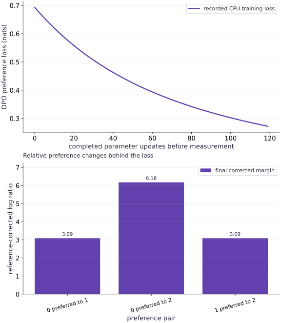

# Direct preference optimization and reference-corrected margins

Phase 18: Post-training: SFT, LoRA, reward models and RLHF · about 75 minutes · CPU

## What you will be able to do

- Compare chosen and rejected response log probabilities
- Subtract the reference preference
- Verify the changed-condition exercise and explain the limits of this fixture.

## The problem

Can we train on chosen/rejected responses without collecting fresh reward-model rollouts? DPO provides a different training objective. We will work through the reference correction and compare its bookkeeping with the preceding RLHF loop.

## The idea

DPO compares policy log-probability differences with the same differences under a frozen reference. The lab treats each response as one categorical action to isolate the objective. For language responses, substitute the sum of valid response-token log probabilities, with a consistent tokenizer and mask; arbitrary mean-length normalization changes the objective.

## Compare chosen and rejected response log probabilities

Both responses belong to the same prompt. Compute their sequence log probabilities under current and reference policies. Exclude prompt and padding tokens consistently. Keep lengths, tokenization and special-token rules visible because they determine the probability of the represented response.

## Subtract the reference preference

The reference-corrected margin subtracts what the reference already preferred. At initialization when current policy equals reference, the corrected margin is zero and the loss is $\log2$, even if the reference assigns unequal response probabilities.

$$
L_{\mathrm{DPO}}=\mathbb E\left[\operatorname{softplus}\!\left(-\beta\left[\log\frac{\pi_\theta(y^+|x)}{\pi_\theta(y^-|x)}-\log\frac{\pi_{\mathrm{ref}}(y^+|x)}{\pi_{\mathrm{ref}}(y^-|x)}\right]\right)\right]
$$

## Keep the algorithm distinction visible

This loop updates from fixed preference pairs; it has no separately trained reward model or on-policy rollout stage. That does not make it PPO with a different optimizer. Both methods need a base/reference identity and reliable preference data, but their estimators, data freshness and failure modes differ.

## Treat beta and length as part of the objective

Beta scales the corrected margin and changes update behavior; it is not interchangeable with every explicit KL coefficient in a PPO implementation. Response sums and response means also differ. Make comparisons under a declared objective and evaluation protocol instead of selecting hyperparameters from a training-loss curve alone.

## Evaluate beyond chosen-pair fit

Frozen-pair optimization can overfit or reduce useful response diversity. Retain held-out prompts, independent task metrics and reviewed outputs; inspect slices rather than only average preference accuracy. Synthetic action preferences establish an objective implementation test, not an aligned language model.

## Run the example

```python
import jax
import jax.numpy as jnp
import numpy as np

def dpo_loss(policy_logps, reference_logps, chosen, rejected, beta=.2):
    margin = (policy_logps[chosen]-policy_logps[rejected]) - jax.lax.stop_gradient(reference_logps[chosen]-reference_logps[rejected])
    return jnp.mean(jax.nn.softplus(-beta*margin))

reference=jax.nn.log_softmax(jnp.array([.2,0.,-.2]))
chosen=jnp.array([0,0,1]);rejected=jnp.array([1,2,2]);theta=jnp.array([.2,0.,-.2]);history=[]
loss=lambda theta:dpo_loss(jax.nn.log_softmax(theta),reference,chosen,rejected,.3)
step=jax.jit(jax.value_and_grad(loss))
np.testing.assert_allclose(loss(theta),np.log(2),atol=1e-6)
for _ in range(120):
    value,g=step(theta);history.append(float(value));theta=theta-.4*g
assert history[-1]<history[0]*.5
policy=jax.nn.log_softmax(theta)
margin=np.asarray((policy[chosen]-policy[rejected])-(reference[chosen]-reference[rejected]),np.float64)
np.testing.assert_allclose(loss(theta),np.mean(np.logaddexp(0,-.3*margin)),atol=1e-6)
assert np.all(margin>0)
np.testing.assert_allclose(loss(theta+50),loss(theta),atol=1e-6)
print('DPO initial/final:',history[0],history[-1],'; reference-corrected margins:',margin)

```

Expected: Reference-corrected margins become positive and the initial equal-policy loss is log(2).

## Direct preference optimization and reference-corrected margins — recorded experiment

**Predict:** Predict what should change during training and what this curve cannot establish.



**Recorded CPU computation**

### Read the figure

The line records preference loss before each update, starting at $0.693$ and falling to about $0.272$. It measures fit to the same three synthetic action comparisons. Its numerical scale depends on beta and does not directly compare with reward-model NLL or PPO reward.

### Connect it to the computation

Positive final corrected margins mean the policy favors each chosen action more strongly relative to the reference. The independent host softplus calculation and reference-gradient check establish objective behavior; separate generation and human review would be needed for a language application.

```python
visual_data={'kind':'line','xlabel':'completed parameter updates before measurement','ylabel':'training objective','series':[{'label':'recorded CPU training loss','x':list(range(len(history))),'y':history}]}
for panel in visual_data.get('panels',[visual_data]):
    panel['x']=panel['series'][0]['x']

```

## Recorded reference execution

CPU run: 2026-10-06T01:27:50.799268+00:00. JAX 0.9.2.

```text
DPO initial/final: 0.6931471824645996 0.27227783203125 ; reference-corrected margins: [3.0890286  6.17805719 3.08902884]
Corrected/unadjusted initial loss: 0.6931471824645996 0.6540467739105225
Reversed-label loss: 1.5064733028411865
Reference gradient is zero.
PASS: posttraining-05

```

## Verify the reference cancellation

**Predict before running:** Can a nonuniform reference still start at log(2)?

```python
initial=dpo_loss(reference,reference,chosen,rejected,.3)
np.testing.assert_allclose(initial,np.log(2),atol=1e-6)
uncorrected=jnp.mean(jax.nn.softplus(-.3*(reference[chosen]-reference[rejected])))
assert not np.isclose(float(initial),float(uncorrected))
print('Corrected/unadjusted initial loss:',float(initial),float(uncorrected))
```

**Expected:** The corrected initial loss is log(2); omitting the reference correction changes it.

The initial policy is not uniform. Cancellation, rather than equal response probabilities, makes the corrected margin zero.

## Make it yours

Swap chosen and rejected IDs after training and verify that the loss rises.

<details><summary>Reference solution</summary>

```python
reverse=float(dpo_loss(policy,reference,rejected,chosen,.3))
assert reverse>float(dpo_loss(policy,reference,chosen,rejected,.3))
print('Reversed-label loss:',reverse)
```

</details>

## Freeze the reference numerically and in autodiff

**Transfer**

Differentiate with respect to reference log probabilities and verify that their gradient is zero.

<details><summary>Hint</summary>

The reference is an input to the objective but not an optimization variable.

</details>

<details><summary>Reference solution and reasoning</summary>

```python
reference_grad=jax.grad(dpo_loss,argnums=1)(policy,reference,chosen,rejected,.3)
np.testing.assert_array_equal(reference_grad,np.zeros(reference_grad.shape))
print('Reference gradient is zero.')
```

Also retain the actual reference checkpoint and tokenizer identity. A detached but reloaded different model is still a changed reference.

</details>

## Check your understanding

Does this DPO loop require a separately trained reward model and fresh policy rollouts?

1. No. It optimizes reference-corrected preferences from the supplied pairs.
2. A lower training loss by itself proves the full application is ready.
3. Matching shapes alone establishes the required behavior.

<details><summary>Answer and explanation</summary>

No. It optimizes reference-corrected preferences from the supplied pairs.

Its data and objective differ from the learned-reward PPO loop; evaluation quality remains a separate question.

</details>

## Diagnose the result

If initial loss is not log(2) when current equals reference, inspect the subtraction and masks. If reversed preferences still improve the reported score, inspect label direction and cached-reference alignment.

## Keep your evidence

Keep reference identity, response log-probability conventions, log(2) initialization, independent margin loss, reversed labels and frozen-reference checks.

Keep predictions, modified code, observed results, and reasoning. A checkpoint alone does not demonstrate the exercise.

## Primary references

- [Direct Preference Optimization](https://arxiv.org/abs/2305.18290)

