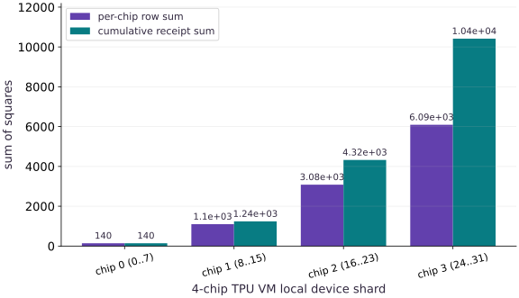

# Bootstrap .venv and verify a TPU runtime receipt

Phase 19: TPU Setup: Provisioning & Runtime Verification · about 20 minutes · CPU

## What you will be able to do

- Bootstrap `~/jax-tpu-lab/.venv` on a Cloud TPU VM and install `jax[tpu]` from the official `libtpu` wheel index.
- Verify `jax.default_backend()`, `jax.device_count()`, and a synchronized `jax.pmap` reduction across 1, 4, or 8 chips.
- Copy the JSON runtime receipt back to your workstation with `gcloud compute tpus tpu-vm scp`.
- Delete the Cloud TPU VM and confirm with `gcloud compute tpus tpu-vm list` that zero billable TPU nodes remain.

## The problem

After `gcloud compute tpus tpu-vm create` reports `READY`, you still cannot trust a benchmark or training job until Python inside your TPU VM's `.venv` proves it can load `libtpu`, see all attached TPU chips, execute a synchronized collective across them, and tear down cleanly so nothing keeps billing.

## The idea

Bootstrap an isolated `~/jax-tpu-lab/.venv` on the TPU VM Linux host with `jax[tpu]`, run a deterministic `jax.pmap` runtime receipt across all local chips, copy the receipt back to your laptop with `gcloud compute tpus tpu-vm scp`, and delete the TPU VM (`tpu-vm delete` + `tpu-vm list`) whenever your session ends.

## Why a synchronized `pmap` receipt is stronger than `import jax`

Importing `jax` on a Cloud TPU VM only proves that the Python package is installed on the Linux host. To prove that `libtpu` can initialize the attached TPU chips, allocate High Bandwidth Memory (HBM), compile an XLA HLO computation, and synchronize results back to the host, you should run a small `jax.pmap` reduction across `jax.local_devices()` and call `jax.block_until_ready`.

If each device $d \in \{0, \dots, D-1\}$ receives a slice of $8$ consecutive integers starting at $8d$, then across $D$ devices the global vector contains $0, 1, \dots, 8D - 1$, and the exact sum of squares is:
$$

S(D) = \sum_{k=0}^{8D - 1} k^2 = \frac{(8D - 1)(8D)(16D - 1)}{6}

$$
Checking that the `pmap` result equals $S(D)$ (for example, $S(1) = 140$, $S(4) = 10416$, $S(8) = 85344$) verifies both device discovery and multi-chip execution in one step.

$$
M_{\text{state}} = N_{\text{params}} \times (\text{bytes}_{\text{param}} + \text{bytes}_{\text{grad}} + 2 \cdot \text{bytes}_{\text{moment}})
$$

### Pause and reason

What happens if you close your SSH terminal without running `gcloud compute tpus tpu-vm delete`?

<details><summary>Compare your reasoning</summary>

The Cloud TPU VM stays allocated in the `READY` state and continues billing every hour even when no Python process or SSH session is active. Always delete the TPU VM and verify with `gcloud compute tpus tpu-vm list`.

</details>

## 1. Bootstrap `~/jax-tpu-lab/.venv` and install `jax[tpu]` over SSH

Use `gcloud compute tpus tpu-vm ssh` to create a dedicated virtual environment on the TPU VM host and install `jax[tpu]` plus the course libraries (`flax`, `optax`, `orbax-checkpoint`, `numpy`, `matplotlib`).

**Create ~/jax-tpu-lab/.venv and install jax[tpu] on the Cloud TPU VM**

```bash
# Create ~/jax-tpu-lab/.venv and install jax[tpu] on the Cloud TPU VM
gcloud compute tpus tpu-vm ssh "$TPU_NAME" --zone="$ZONE" --command="
  set -euo pipefail
  mkdir -p ~/jax-tpu-lab
  python3 -m venv ~/jax-tpu-lab/.venv
  source ~/jax-tpu-lab/.venv/bin/activate
  pip install -U pip
  pip install 'jax[tpu]' -f https://storage.googleapis.com/jax-releases/libtpu_releases.html
  pip install flax optax orbax-checkpoint numpy matplotlib
"
```

**Expected:** Installs jax[tpu], libtpu, and the course dependencies inside ~/jax-tpu-lab/.venv on the TPU VM.

## 2. Run the runtime receipt script, copy the JSON receipt back, and delete the TPU VM

Stage `public/exercises/tpu-04.py` to the TPU VM, run it inside `~/jax-tpu-lab/.venv`, copy the saved receipt back to your workstation, and delete the TPU VM when finished.

**Run the runtime receipt verifier on the TPU VM and copy the receipt home**

```bash
# Run the runtime receipt verifier on the TPU VM and copy the receipt home
gcloud compute tpus tpu-vm scp public/exercises/tpu-04.py "$TPU_NAME":~/jax-tpu-lab/ --zone="$ZONE"
gcloud compute tpus tpu-vm ssh "$TPU_NAME" --zone="$ZONE" \
  --command="JAX_PLATFORMS=tpu ~/jax-tpu-lab/.venv/bin/python ~/jax-tpu-lab/tpu-04.py | tee ~/jax-tpu-lab/tpu-receipt.txt"
gcloud compute tpus tpu-vm scp "$TPU_NAME":~/jax-tpu-lab/tpu-receipt.txt ./ --zone="$ZONE"
```

**Expected:** Runs tpu-04.py on the TPU VM, writes tpu-receipt.txt, and downloads it to your current directory.

**Delete the Cloud TPU VM and verify zero active TPU resources remain**

```bash
# Delete the Cloud TPU VM and verify zero active TPU resources remain
gcloud compute tpus tpu-vm delete "$TPU_NAME" --zone="$ZONE" --quiet
gcloud compute tpus tpu-vm list --zone="$ZONE"
```

**Expected:** Deletes the TPU VM and prints Listed 0 items.

## Define the closed-form sum-of-squares oracle and pmap receipt builder

Create main.py with closed_form_sum_of_squares and build_runtime_receipt.

```python
# Step 1 — Define the closed-form sum-of-squares oracle and pmap receipt builder: Each local device computes the sum of squares of its 8-element row...
# Import hashlib for this computation.
import hashlib
import json
import platform
import jax
import jax.numpy as jnp
import numpy as np


# Function `closed_form_sum_of_squares(num_devices, width)` implementing this stage's computation:
def closed_form_sum_of_squares(num_devices, width=8):
    # Evaluate `num_devices) * int(width` and convert the result into Python scalar/collection `n`.
    n = int(num_devices) * int(width)
    # Return `float((n - 1) * n * (2 * n - 1) // 6)` to the caller.
    return float((n - 1) * n * (2 * n - 1) // 6)


# Function `build_runtime_receipt()` implementing this stage's computation:
def build_runtime_receipt():
    # Query the active JAX devices into `devices`.
    devices = jax.local_devices()
    # Run `len` to compute `n_dev`.
    n_dev = len(devices)
    # Construct and reshape `x` into the target tensor dimensions.
    x = jnp.arange(n_dev * 8, dtype=jnp.float32).reshape(n_dev, 8)
    # Reduce across the target axis to summarize `per_device`.
    per_device = jax.pmap(lambda row: jnp.sum(row * row))(x)
    # Synchronize host execution until asynchronous device computation completes.
    observed_total = float(jax.block_until_ready(jnp.sum(per_device)))
    # Run `closed_form_sum_of_squares` to compute `expected_total`.
    expected_total = closed_form_sum_of_squares(n_dev, 8)
    # Check which hardware backend (`cpu`, `gpu`, or `tpu`) JAX selected for `payload`.
    payload = {
        "python": platform.python_version(),
        "jax": jax.__version__,
        "backend": jax.default_backend(),
        "local_device_count": n_dev,
        "per_device_sums": [float(v) for v in np.asarray(per_device)],
        "observed_total": observed_total,
        "expected_total": expected_total,
        "verified": bool(np.isclose(observed_total, expected_total)),
    }
    # Read or serialize artifact data on disk (`payload['receipt_sha256']`).
    payload["receipt_sha256"] = hashlib.sha256(
        json.dumps(payload, sort_keys=True, separators=(",", ":")).encode()
    ).hexdigest()[:16]
    # Return `payload` to the caller.
    return payload
```

Each local device computes the sum of squares of its 8-element row via jax.pmap, and the host verifies the synchronized total against the exact polynomial identity.

## Verify the active runtime receipt and tabulate multi-chip expectations

Append slice_expectations and the receipt verification assertions to main.py.

```python
# Step 2 — Verify the active runtime receipt and tabulate multi-chip expectations: Knowing the exact expected sum for 1, 4, and 8 devices lets you...
slice_expectations = [
    {"slice": "1-device (CPU / v5e-1)", "devices": 1, "expected_sum": closed_form_sum_of_squares(1)},
    {"slice": "4-device (v5litepod-4 / v6e-4)", "devices": 4, "expected_sum": closed_form_sum_of_squares(4)},
    {"slice": "8-device (v5litepod-8 / v6e-8)", "devices": 8, "expected_sum": closed_form_sum_of_squares(8)},
]
# Run `build_runtime_receipt` to compute `receipt`.
receipt = build_runtime_receipt()
# Assert invariant `receipt["verified"] is True` holds
assert receipt["verified"] is True
# Print the observed values to compare against the expected result.
print("Runtime receipt:", json.dumps(receipt, sort_keys=True))
# Print diagnostic summary of the computed outputs.
print("Expected pmap sums by slice:", {s["slice"]: s["expected_sum"] for s in slice_expectations})
```

Knowing the exact expected sum for 1, 4, and 8 devices lets you immediately spot if a 4-chip or 8-chip TPU VM only initialized a single device.

## Step 3: Verify invariants on the completed state

Run the final shape and numerical assertions to confirm the state built in Steps 1 and 2.

```python
receipt = build_runtime_receipt()
assert receipt["verified"] is True
```

Checking these invariants confirms the computation is ready for the full worked experiment.

## Run the example

```python
# Step 1 — Define the closed-form sum-of-squares oracle and pmap receipt builder: Each local device computes the sum of squares of its 8-element row...
# Import hashlib for this computation.
import hashlib
import json
import platform
import jax
import jax.numpy as jnp
import numpy as np


# Function `closed_form_sum_of_squares(num_devices, width)` implementing this stage's computation:
def closed_form_sum_of_squares(num_devices, width=8):
    # Evaluate `num_devices) * int(width` and convert the result into Python scalar/collection `n`.
    n = int(num_devices) * int(width)
    # Return `float((n - 1) * n * (2 * n - 1) // 6)` to the caller.
    return float((n - 1) * n * (2 * n - 1) // 6)


# Function `build_runtime_receipt()` implementing this stage's computation:
def build_runtime_receipt():
    # Query the active JAX devices into `devices`.
    devices = jax.local_devices()
    # Run `len` to compute `n_dev`.
    n_dev = len(devices)
    # Construct and reshape `x` into the target tensor dimensions.
    x = jnp.arange(n_dev * 8, dtype=jnp.float32).reshape(n_dev, 8)
    # Reduce across the target axis to summarize `per_device`.
    per_device = jax.pmap(lambda row: jnp.sum(row * row))(x)
    # Synchronize host execution until asynchronous device computation completes.
    observed_total = float(jax.block_until_ready(jnp.sum(per_device)))
    # Run `closed_form_sum_of_squares` to compute `expected_total`.
    expected_total = closed_form_sum_of_squares(n_dev, 8)
    # Check which hardware backend (`cpu`, `gpu`, or `tpu`) JAX selected for `payload`.
    payload = {
        "python": platform.python_version(),
        "jax": jax.__version__,
        "backend": jax.default_backend(),
        "local_device_count": n_dev,
        "per_device_sums": [float(v) for v in np.asarray(per_device)],
        "observed_total": observed_total,
        "expected_total": expected_total,
        "verified": bool(np.isclose(observed_total, expected_total)),
    }
    # Read or serialize artifact data on disk (`payload['receipt_sha256']`).
    payload["receipt_sha256"] = hashlib.sha256(
        json.dumps(payload, sort_keys=True, separators=(",", ":")).encode()
    ).hexdigest()[:16]
    # Return `payload` to the caller.
    return payload


# Step 2 — Verify the active runtime receipt and tabulate multi-chip expectations: Knowing the exact expected sum for 1, 4, and 8 devices lets you...
slice_expectations = [
    {"slice": "1-device (CPU / v5e-1)", "devices": 1, "expected_sum": closed_form_sum_of_squares(1)},
    {"slice": "4-device (v5litepod-4 / v6e-4)", "devices": 4, "expected_sum": closed_form_sum_of_squares(4)},
    {"slice": "8-device (v5litepod-8 / v6e-8)", "devices": 8, "expected_sum": closed_form_sum_of_squares(8)},
]
# Run `build_runtime_receipt` to compute `receipt`.
receipt = build_runtime_receipt()
# Assert invariant `receipt["verified"] is True` holds
assert receipt["verified"] is True
# Print the observed values to compare against the expected result.
print("Runtime receipt:", json.dumps(receipt, sort_keys=True))
# Print diagnostic summary of the computed outputs.
print("Expected pmap sums by slice:", {s["slice"]: s["expected_sum"] for s in slice_expectations})
```

Expected: Prints the verified JSON runtime receipt (observed_total: 140.0 on 1 device) and the expected pmap sums for 1-device (140.0), 4-device (10416.0), and 8-device (85344.0) slices.

## Per-chip contribution to the 4-device synchronized pmap verification receipt

**Predict:** How do the four per-chip sums of squares (`0..7`, `8..15`, `16..23`, `24..31`) combine into the 4-device runtime receipt (`10416.0`)?



**Recorded CPU computation**

### Read the figure

The horizontal axis lists each local chip (`chip 0` through `chip 3`) on a 4-device TPU slice (`v5litepod-4` or `v6e-4`). The bars show each chip's local sum of squares (`140`, `1100`, `3084`, `6092`) alongside the cumulative running total across chips (`140`, `1240`, `4324`, `10416`).

### Connect it to the computation

Because `x` is reshaped to `(4, 8)`, every chip executes the same `pmap` program on its own slice of 8 numbers; matching the final cumulative sum of `10416.0` proves all 4 chips participated.

```python
# Compute figure data for: Per-chip contribution to the 4-device synchronized pmap verification receipt
# Create evenly spaced index values in `per_chip`.
per_chip = [float(np.sum(np.arange(i * 8, (i + 1) * 8, dtype=np.float64) ** 2)) for i in range(4)]
# Compute `cumulative` from `[float(sum(per_chip[: i + 1])) for i in range(4)]`
cumulative = [float(sum(per_chip[: i + 1])) for i in range(4)]
# Construct dictionary `visual_data` with the structured fields for this stage.
visual_data = {
    'kind': 'bar',
    'labels': ['chip 0 (0..7)', 'chip 1 (8..15)', 'chip 2 (16..23)', 'chip 3 (24..31)'],
    'xlabel': '4-chip TPU VM local device shard',
    'ylabel': 'sum of squares',
    'series': [
        {'label': 'per-chip row sum', 'y': per_chip},
        {'label': 'cumulative receipt sum', 'y': cumulative},
    ],
}
```

## Recorded reference execution

CPU run: 2026-10-09T14:08:27.688189+00:00. JAX 0.9.2.

```text
Runtime receipt: {"backend": "cpu", "expected_total": 140.0, "jax": "0.9.2", "local_device_count": 1, "observed_total": 140.0, "per_device_sums": [140.0], "python": "3.14.3", "receipt_sha256": "8c6bd0cbe29edc78", "verified": true}
Expected pmap sums by slice: {'1-device (CPU / v5e-1)': 140.0, '4-device (v5litepod-4 / v6e-4)': 10416.0, '8-device (v5litepod-8 / v6e-8)': 85344.0}
Runtime receipt: {"backend": "cpu", "expected_total": 140.0, "jax": "0.9.2", "local_device_count": 1, "observed_total": 140.0, "per_device_sums": [140.0], "python": "3.14.3", "receipt_sha256": "8c6bd0cbe29edc78", "verified": true}
Expected pmap sums by slice: {'1-device (CPU / v5e-1)': 140.0, '4-device (v5litepod-4 / v6e-4)': 10416.0, '8-device (v5litepod-8 / v6e-8)': 85344.0}
Per-chip sums on a 4-chip slice: [140.0, 1100.0, 3084.0, 6092.0] Total: 10416.0
Teardown verifier passed for empty and non-empty gcloud list outputs.
4-chip expected sum: 10416.0 8-chip expected sum: 85344.0 receipt hash: 8c6bd0cbe29edc78
Simulated 4-chip TPU check: True Local CPU check: False
Overnight idle cost avoided (USD): 74.4
PASS: tpu-04

```

## Compare per-device row sums on a 4-chip TPU slice

**Predict before running:** On a 4-chip TPU VM (`v5litepod-4`), why does chip 3 produce a much larger row sum than chip 0?

```python
# Experiment — Compare per-device row sums on a 4-chip TPU slice: Inspecting per_device_sums confirms that distinct shards of x...
# Construct and reshape `x4` into the target tensor dimensions.
x4 = jnp.arange(4 * 8, dtype=jnp.float32).reshape(4, 8)
# Reduce along axis=1 to compute `row_sums_4`.
row_sums_4 = [float(v) for v in jnp.sum(x4 * x4, axis=1)]
# Print the observed values to compare against the expected result.
print("Per-chip sums on a 4-chip slice:", row_sums_4, "Total:", sum(row_sums_4))
# Assert that `row_sums_4 == [140.0, 1100.0, 3084.0, 6092.0] and sum(row_sums_4) == 10416.0`.
assert row_sums_4 == [140.0, 1100.0, 3084.0, 6092.0] and sum(row_sums_4) == 10416.0
```

**Expected:** Chip 0 sums 0^2..7^2 = 140.0, chip 1 sums 8^2..15^2 = 1100.0, chip 2 sums 16^2..23^2 = 3084.0, and chip 3 sums 24^2..31^2 = 6092.0 (total 10416.0).

Inspecting `per_device_sums` confirms that distinct shards of `x` were placed and squared on each of the 4 chips.

## Verify teardown confirmation logic

**Predict before running:** How can a helper script check that `gcloud compute tpus tpu-vm list` returned zero active VMs?

```python
# Experiment — Verify teardown confirmation logic: Checking gcloud compute tpus tpu-vm list --zone=$ZONE...
def is_tpu_zone_clean(gcloud_list_json):
    # Read or serialize artifact data on disk (`items`).
    items = json.loads(gcloud_list_json)
    # Return `len(items) == 0` to the caller.
    return len(items) == 0

# Assert invariant `is_tpu_zone_clean("[]") is True` holds
assert is_tpu_zone_clean("[]") is True
# Assert invariant `is_tpu_zone_clean('[{"name": "jax-tpu-course"` holds
assert is_tpu_zone_clean('[{"name": "jax-tpu-course", "state": "READY"}]') is False
# Print the observed values to compare against the expected result.
print("Teardown verifier passed for empty and non-empty gcloud list outputs.")
```

**Expected:** Returns True only when the JSON array from `gcloud compute tpus tpu-vm list --format=json` is empty (`[]`).

Checking `gcloud compute tpus tpu-vm list --zone=$ZONE --format=json` makes teardown verification machine-checkable.

## Make it yours

Compute `closed_form_sum_of_squares(4)` and `closed_form_sum_of_squares(8)`, verify that `closed_form_sum_of_squares(4) == 10416.0`, and assert that `receipt['verified']` is `True`.

### How to write this exercise — Step-by-step recipe & starter scaffold

**Key functions & syntax to use:**
- `closed_form_sum_of_squares(...)` — Call `closed_form_sum_of_squares` with your updated parameters or inputs from this lesson's workspace.
- `assert condition` — Verify that the observed output shape, status, or numerical value satisfies the contract.

**Step-by-step implementation plan:**
1. Run `closed_form_sum_of_squares` to compute `s8`.
2. Print the observed values to compare against the expected result.
3. Assert invariant `s4 == 10416.0 and s8 == 85344.0 and receipt["verified"] is True` holds

**Starter code scaffold (fill in the TODOs):**

```python
# Exercise solution: Compute closed_form_sum_of_squares(4) and...
s4 = closed_form_sum_of_squares(...)  # TODO: compute s4
# Run `closed_form_sum_of_squares` to compute `s8`.
s8 = closed_form_sum_of_squares(...)  # TODO: compute s8
# Print the observed values to compare against the expected result.
print("4-chip expected sum:", s4, "8-chip expected sum:", s8, "receipt hash:", receipt["receipt_sha256"])
# Assert invariant `s4 == 10416.0 and s8 == 85344.0 and receipt["verified"] is True` holds
assert s4  # TODO: complete assertion check
```

<details><summary>Reference solution</summary>

```python
# Exercise solution: Compute closed_form_sum_of_squares(4) and...
s4 = closed_form_sum_of_squares(4)
# Run `closed_form_sum_of_squares` to compute `s8`.
s8 = closed_form_sum_of_squares(8)
# Print the observed values to compare against the expected result.
print("4-chip expected sum:", s4, "8-chip expected sum:", s8, "receipt hash:", receipt["receipt_sha256"])
# Assert invariant `s4 == 10416.0 and s8 == 85344.0 and receipt["verified"] is True` holds
assert s4 == 10416.0 and s8 == 85344.0 and receipt["verified"] is True
```

</details>

## Detect a silent fallback from 4 TPU chips to 1 CPU device

**Foundations**

Write a check `is_four_chip_tpu_receipt(r)` that returns `True` only when `r['backend'] == 'tpu'`, `r['local_device_count'] == 4`, and `r['observed_total'] == 10416.0`.

<details><summary>Hint</summary>

Check all three fields in the receipt dictionary.

</details>

### How to write: Detect a silent fallback from 4 TPU chips to 1 CPU device — Step-by-step recipe & starter scaffold

**Key functions & syntax to use:**
- `device(...)` — Call `device` with your updated parameters or inputs from this lesson's workspace.
- `is_four_chip_tpu_receipt(...)` — Call `is_four_chip_tpu_receipt` with your updated parameters or inputs from this lesson's workspace.
- `assert condition` — Verify that the observed output shape, status, or numerical value satisfies the contract.

**Step-by-step implementation plan:**
1. Detect a silent fallback from 4 TPU chips to 1 CPU device (Foundations): Requiring backend == 'tpu', local_device_count == 4, and the...
2. Return `bool(r['backend'] == 'tpu' and r['local_device_count'] == 4 and np.isclose(r['observed_total'], 10416.0))` to the caller.
3. Compute `simulated_tpu` from `{"backend": "tpu", "local_device_count": 4, "observe...`
4. Print the observed values to compare against the expected result.
5. Assert invariant `is_four_chip_tpu_receipt(simulated_tpu) is True` holds

**Starter code scaffold (fill in the TODOs):**

```python
# Detect a silent fallback from 4 TPU chips to 1 CPU device (Foundations): Requiring backend == 'tpu', local_device_count == 4, and the...
def is_four_chip_tpu_receipt(r):
    # Return `bool(r['backend'] == 'tpu' and r['local_device_count'] == 4 and np.isclose(r['observed_total'], 10416.0))` to the caller.
    return bool(r["backend"] = ...  # TODO: compute return bool(r["backend"]

# Compute `simulated_tpu` from `{"backend": "tpu", "local_device_count": 4, "observe...`
simulated_tpu = ...  # TODO: compute simulated_tpu
# Print the observed values to compare against the expected result.
print("Simulated 4-chip TPU check:", is_four_chip_tpu_receipt(simulated_tpu), "Local CPU check:", is_four_chip_tpu_receipt(receipt))
# Assert invariant `is_four_chip_tpu_receipt(simulated_tpu) is True` holds
assert is_four_chip_tpu_receipt(simulated_tpu) is True  # TODO: complete assertion check
```

<details><summary>Reference solution and reasoning</summary>

```python
# Detect a silent fallback from 4 TPU chips to 1 CPU device (Foundations): Requiring backend == 'tpu', local_device_count == 4, and the...
def is_four_chip_tpu_receipt(r):
    # Return `bool(r['backend'] == 'tpu' and r['local_device_count'] == 4 and np.isclose(r['observed_total'], 10416.0))` to the caller.
    return bool(r["backend"] == "tpu" and r["local_device_count"] == 4 and np.isclose(r["observed_total"], 10416.0))

# Compute `simulated_tpu` from `{"backend": "tpu", "local_device_count": 4, "observe...`
simulated_tpu = {"backend": "tpu", "local_device_count": 4, "observed_total": 10416.0}
# Print the observed values to compare against the expected result.
print("Simulated 4-chip TPU check:", is_four_chip_tpu_receipt(simulated_tpu), "Local CPU check:", is_four_chip_tpu_receipt(receipt))
# Assert invariant `is_four_chip_tpu_receipt(simulated_tpu) is True` holds
assert is_four_chip_tpu_receipt(simulated_tpu) is True
```

Requiring `backend == 'tpu'`, `local_device_count == 4`, and the 4-chip `pmap` total prevents a misconfigured environment from passing as a 4-chip TPU run.

</details>

## Estimate hourly billing savings from immediate teardown

**Transfer / diagnosis**

If a 4-chip TPU slice costs $4.80$ USD/hour and your verification + experiment takes $0.5$ hours, compute how many USD you save by deleting the VM immediately instead of leaving it idle overnight for $16$ hours.

<details><summary>Hint</summary>

Compare `16.0 * 4.80` against `0.5 * 4.80`.

</details>

### How to write: Estimate hourly billing savings from immediate teardown — Step-by-step recipe & starter scaffold

**Key functions & syntax to use:**
- `teardown(...)` — Call `teardown` with your updated parameters or inputs from this lesson's workspace.
- `round(...)` — Call `round` with your updated parameters or inputs from this lesson's workspace.
- `assert condition` — Verify that the observed output shape, status, or numerical value satisfies the contract.

**Step-by-step implementation plan:**
1. Run `round` to compute `saved_usd`.
2. Print the observed values to compare against the expected result.
3. Assert invariant `saved_usd == 74.4` holds

**Starter code scaffold (fill in the TODOs):**

```python
# Estimate hourly billing savings from immediate teardown (Transfer / diagnosis): Deleting the Cloud TPU VM immediately after copying...
hourly_rate = ...  # TODO: compute hourly_rate
# Run `round` to compute `saved_usd`.
saved_usd = round(...)  # TODO: compute saved_usd
# Print the observed values to compare against the expected result.
print("Overnight idle cost avoided (USD):", saved_usd)
# Assert invariant `saved_usd == 74.4` holds
assert saved_usd  # TODO: complete assertion check
```

<details><summary>Reference solution and reasoning</summary>

```python
# Estimate hourly billing savings from immediate teardown (Transfer / diagnosis): Deleting the Cloud TPU VM immediately after copying...
hourly_rate = 4.80
# Run `round` to compute `saved_usd`.
saved_usd = round((16.0 - 0.5) * hourly_rate, 2)
# Print the observed values to compare against the expected result.
print("Overnight idle cost avoided (USD):", saved_usd)
# Assert invariant `saved_usd == 74.4` holds
assert saved_usd == 74.4
```

Deleting the Cloud TPU VM immediately after copying artifacts back avoids paying for 15.5 idle hours.

</details>

## Check your understanding

Why does `build_runtime_receipt()` run `jax.pmap` across `jax.local_devices()` and call `jax.block_until_ready` instead of only checking `jax.default_backend()`?

1. Because `jax.default_backend()` deletes the virtual environment
2. Because `jax.pmap` + `jax.block_until_ready` proves that `libtpu` compiled and executed a multi-device XLA computation across every local chip and returned the expected numerical result
3. Because `jax.pmap` automatically deletes the Cloud TPU VM

<details><summary>Answer and explanation</summary>

Because `jax.pmap` + `jax.block_until_ready` proves that `libtpu` compiled and executed a multi-device XLA computation across every local chip and returned the expected numerical result

A synchronized `pmap` reduction tests compilation, HBM allocation, and execution across all local devices rather than just querying a string.

</details>

## Diagnose the result

If `pip install 'jax[tpu]'` fails to find `libtpu`, verify that `-f https://storage.googleapis.com/jax-releases/libtpu_releases.html` was passed to `pip install` inside the activated `~/jax-tpu-lab/.venv` on the Linux TPU VM.

## Carry forward

- Always install `jax[tpu]` inside an isolated `~/jax-tpu-lab/.venv` on the TPU VM host.
- Verify `backend`, `local_device_count`, and a synchronized `jax.pmap` sum-of-squares receipt before starting longer experiments.
- Copy your receipt back with `gcloud compute tpus tpu-vm scp`, run `tpu-vm delete`, and confirm `tpu-vm list` is empty.

## Keep your evidence

Keep the JSON runtime receipt (observed_backend, device_count, pmap_sum_of_squares, receipt_sha256) and the 1-chip vs 4-chip vs 8-chip pmap reference values.

Save your predictions, modified code, terminal outputs, and reasoning in your engineering portfolio.

## Primary references

- [JAX installation for Cloud TPU](https://docs.jax.dev/en/latest/installation.html)
- [Manage Cloud TPU VMs with gcloud](https://cloud.google.com/tpu/docs/managing-tpus-tpu-vm)

