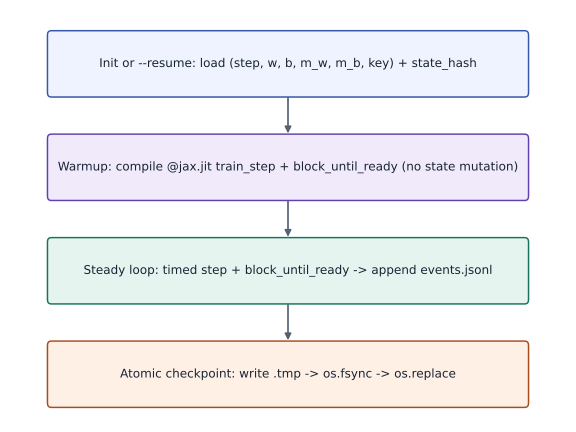
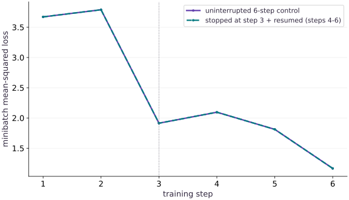

# Stage and launch checkpointed TPU jobs

Phase 20: TPU Workflows: Launching Jobs & Checkpointed Experiments · about 25 minutes · CPU

## What you will be able to do

- Stage the TPU launcher (`resources/tpu-gcp/launch.py`) to a Cloud TPU VM with `gcloud compute tpus tpu-vm scp`.
- Separate XLA compile warmup time from steady-state step time in structured `events.jsonl` logs.
- Write atomic checkpoints using `temp` + `os.fsync` + `os.replace` so preemption never corrupts the latest checkpoint.
- Interrupt, resume from an atomic checkpoint, and verify zero drift against an uninterrupted control run.

## The problem

Once a Cloud TPU VM is running, typing ad-hoc interactive commands in an SSH shell is fragile: if the connection drops or a Spot TPU is preempted, you lose progress and cannot tell compilation time from step time. You need a repeatable way to stage code, launch TPU jobs, log structured JSONL events, and checkpoint atomically.

## The idea

A TPU job launcher enforces four contracts: (1) validate `JAX_PLATFORMS` and device discovery before training, (2) run and synchronize one warmup step so XLA compilation is recorded separately from steady updates, (3) write atomic checkpoints (`temp` + `fsync` + `os.replace`) so `--resume` continues from the exact step, parameter, optimizer, and PRNG state, and (4) copy `events.jsonl` and checkpoints back via `gcloud compute tpus tpu-vm scp`.

## Why launching a TPU experiment is different from running a notebook cell

When you launch a JAX script on a TPU VM, the first call to a `@jax.jit` step traces Python and compiles an XLA HLO program for the attached TPU chips. If you time step $1$ together with steps $2\dots N$, your step-time measurement is dominated by XLA compilation rather than TPU execution.

A production-grade TPU launcher runs one synchronized warmup call before the training loop and logs `compile_warmup_s` in a dedicated `warmup` event. Subsequent `step` events measure synchronized steady-state updates (`jax.block_until_ready`).

Whenever a checkpoint step arrives, writing directly to `checkpoint-latest.json` risks leaving a half-written file if a Spot TPU VM is preempted mid-write. Writing to a temporary sibling file (`checkpoint-latest.json.tmp`), flushing with `os.fsync`, and atomically renaming with `os.replace` guarantees that the checkpoint on disk is always complete.

### Checkpointed TPU job launcher lifecycle from warmup to zero-drift resume

**Predict:** Why must the warmup compilation step run before the timed step loop without overwriting the restored checkpoint state?



*Conceptual / analytic teaching diagram; not a recorded benchmark.*

Read top to bottom: the launcher loads either the initial state or `checkpoint-latest.json`, runs one synchronized `@jax.jit` warmup call to compile XLA HLO without mutating state, executes timed steady-state steps while appending to `events.jsonl`, and writes `checkpoint-latest.json` atomically via `.tmp` + `fsync` + `os.replace`.

### Pause and reason

Why does restoring model weights alone after a Spot TPU preemption cause the resumed training curve to diverge from an uninterrupted run?

<details><summary>Compare your reasoning</summary>

Without restoring the optimizer momentum/variance buffers (`m_w`, `m_b`) and the PRNG key (`key`) alongside the step counter and weights, the next update uses zeroed momentum and a repeated or mismatched random batch.

</details>

## 1. Stage the launcher and run a checkpoint-resumed TPU experiment

Use `gcloud compute tpus tpu-vm scp` to copy `resources/tpu-gcp/launch.py` to `~/jax-tpu-lab/` on the TPU VM. Then run `launch.py --platform tpu` over SSH: first run $4$ steps and save a checkpoint at step $4$; resume to step $8$ with `--resume`; and compare the final parameter checksum against an uninterrupted $8$-step control job.

**Stage launch.py and verify checkpoint resume on the Cloud TPU VM**

```bash
# Stage launch.py and verify checkpoint resume on the Cloud TPU VM
gcloud compute tpus tpu-vm scp resources/tpu-gcp/launch.py "$TPU_NAME":~/jax-tpu-lab/ --zone="$ZONE"

gcloud compute tpus tpu-vm ssh "$TPU_NAME" --zone="$ZONE" --command="
  set -euo pipefail
  source ~/jax-tpu-lab/.venv/bin/activate
  python ~/jax-tpu-lab/launch.py --platform tpu --run-dir ~/jax-tpu-lab/run-resumed --steps 4 --save-every 2
  python ~/jax-tpu-lab/launch.py --platform tpu --run-dir ~/jax-tpu-lab/run-resumed --steps 8 --save-every 2 --resume
  python ~/jax-tpu-lab/launch.py --platform tpu --run-dir ~/jax-tpu-lab/run-control --steps 8 --save-every 2
"
```

**Expected:** Both runs emit started, warmup, step, checkpoint, and completed JSONL events with backend: tpu, and their step-8 state hashes match.

## Define deterministic hashing and atomic checkpoint writes

Create main.py with digest_obj and atomic_write_json so interrupted writes never corrupt the latest checkpoint.

```python
# Step 1 — Define deterministic hashing and atomic checkpoint writes: Writing to a temporary sibling file, flushing with fsync, and...
# Import hashlib for this computation.
import hashlib
import json
import os
from pathlib import Path
import tempfile
import time
import jax
import jax.numpy as jnp
import numpy as np


# Function `digest_obj(value)` implementing this stage's computation:
def digest_obj(value):
    # Return `hashlib.sha256(json.dumps(value, sort_keys=True, separators=(',', ':')).encode()).hexdigest()[:16]` to the caller.
    return hashlib.sha256(
        json.dumps(value, sort_keys=True, separators=(",", ":")).encode()
    ).hexdigest()[:16]


# Function `atomic_write_json(path, payload)` implementing this stage's computation:
def atomic_write_json(path, payload):
    # Read or serialize artifact data on disk (`path`).
    path = Path(path)
    # Run `path.parent.mkdir` to perform the next check or state transition.
    path.parent.mkdir(parents=True, exist_ok=True)
    # Run `path.with_suffix` to compute `tmp`.
    tmp = path.with_suffix(path.suffix + ".tmp")
    # Enter managed runtime/context scope for this block:
    with tmp.open("w", encoding="utf-8") as f:
        # Run `json.dump` to perform the next check or state transition.
        json.dump(payload, f, sort_keys=True)
        # Run `f.flush` to perform the next check or state transition.
        f.flush()
        # Run `os.fsync` to perform the next check or state transition.
        os.fsync(f.fileno())
    # Run `os.replace` to perform the next check or state transition.
    os.replace(tmp, path)
```

Writing to a temporary sibling file, flushing with fsync, and calling os.replace guarantees that checkpoint-latest.json is always complete.

## Implement the TPU-ready job runner with warmup separation and resume

Append run_tpu_ready_job to main.py.

```python
# Step 2 — Implement the TPU-ready job runner with warmup separation and resume: Warmup compiles the JIT function without mutating w, b, m_w, m_b,...
# Define `run_tpu_ready_job(run_dir, steps, save_every, resume...)` to evaluate the objective and its automatic derivatives:
def run_tpu_ready_job(run_dir, steps=6, save_every=2, resume=False, seed=0, lr=0.05):
    # Read or serialize artifact data on disk (`run_dir`).
    run_dir = Path(run_dir)
    # Run `run_dir.mkdir` to perform the next check or state transition.
    run_dir.mkdir(parents=True, exist_ok=True)
    # Evaluate `events_path` from the current inputs and state.
    events_path = run_dir / "events.jsonl"
    # Evaluate `ckpt_path` from the current inputs and state.
    ckpt_path = run_dir / "checkpoint-latest.json"

    # Function `emit(event)` implementing this stage's computation:
    def emit(event, **fields):
        # Check which hardware backend (`cpu`, `gpu`, or `tpu`) JAX selected for `record`.
        record = {"event": event, "backend": jax.default_backend(), "devices": jax.device_count(), **fields}
        # Enter managed runtime/context scope for this block:
        with events_path.open("a", encoding="utf-8") as f:
            # Read or serialize artifact data on disk (``).
            f.write(json.dumps(record, sort_keys=True) + "\n")
        # Return `record` to the caller.
        return record

    # Generate a uniform grid of points in `x`.
    x = jnp.linspace(-1.0, 1.0, 64, dtype=jnp.float32).reshape(64, 1)
    # Evaluate `target_y` from the current inputs and state.
    target_y = 3.0 * x - 0.5

    # Branch on condition `resume and ckpt_path.exists()`:
    if resume and ckpt_path.exists():
        saved = json.loads(ckpt_path.read_text(encoding="utf-8"))
        step = int(saved["step"])
        w = jnp.array(saved["w"], dtype=jnp.float32)
        b = jnp.array(saved["b"], dtype=jnp.float32)
        m_w = jnp.array(saved["m_w"], dtype=jnp.float32)
        m_b = jnp.array(saved["m_b"], dtype=jnp.float32)
        key = jnp.array(saved["key"], dtype=jnp.uint32)
        emit("restored", step=step, state_hash=saved["state_hash"])
    else:
        step = 0
        w = jnp.zeros((1, 1), dtype=jnp.float32)
        b = jnp.zeros((1,), dtype=jnp.float32)
        m_w = jnp.zeros_like(w)
        m_b = jnp.zeros_like(b)
        key = jax.random.PRNGKey(seed)
        emit("started", step=step)

    @jax.jit
    # Function `train_step(w, b, m_w, m_b, ...)` implementing this stage's computation:
    def train_step(w, b, m_w, m_b, key):
        # Split the PRNG key deterministically into independent subkeys (`(key, subkey)`).
        key, subkey = jax.random.split(key)
        # Draw pseudorandom samples for `idx` using the explicit RNG state.
        idx = jax.random.choice(subkey, 64, shape=(16,), replace=False)
        # Evaluate `(xb, yb)` from the current inputs and state.
        xb, yb = x[idx], target_y[idx]

        # Function `loss_fn(w_in, b_in)` implementing this stage's computation:
        def loss_fn(w_in, b_in):
            # Perform matrix contraction / projection to compute `pred`.
            pred = xb @ w_in + b_in
            # Return `jnp.mean((pred - yb) ** 2)` to the caller.
            return jnp.mean((pred - yb) ** 2)

        # Evaluate both scalar loss and parameter gradients in one pass (`(loss, (gw, gb))`).
        loss, (gw, gb) = jax.value_and_grad(loss_fn, argnums=(0, 1))(w, b)
        # Evaluate `m_w` from the current inputs and state.
        m_w = 0.8 * m_w + gw
        # Evaluate `m_b` from the current inputs and state.
        m_b = 0.8 * m_b + gb
        # Evaluate `w` from the current inputs and state.
        w = w - lr * m_w
        # Evaluate `b` from the current inputs and state.
        b = b - lr * m_b
        # Return `(w, b, m_w, m_b, key, loss)` to the caller.
        return w, b, m_w, m_b, key, loss

    # Record execution timing or profiler trace in `t0`.
    t0 = time.perf_counter()
    # Run `train_step` to compute `warm`.
    warm = train_step(w, b, m_w, m_b, key)
    # Synchronize host execution until asynchronous device computation completes.
    jax.block_until_ready(warm)
    # Record execution timing or profiler trace in `warmup_ms`.
    warmup_ms = (time.perf_counter() - t0) * 1000.0
    # Run `emit` to perform the next check or state transition.
    emit("warmup", warmup_ms=warmup_ms, step=step)

    # Evaluate `step_losses` from the current inputs and state.
    step_losses = []
    # Evaluate `step_times_ms` from the current inputs and state.
    step_times_ms = []
    while step < steps:
        t_step = time.perf_counter()
        w, b, m_w, m_b, key, loss = train_step(w, b, m_w, m_b, key)
        jax.block_until_ready((w, b, m_w, m_b, key, loss))
        elapsed_ms = (time.perf_counter() - t_step) * 1000.0
        step += 1
        state_payload = {
            "step": step,
            "w": np.asarray(w).tolist(),
            "b": np.asarray(b).tolist(),
            "m_w": np.asarray(m_w).tolist(),
            "m_b": np.asarray(m_b).tolist(),
            "key": np.asarray(key).tolist(),
        }
        state_payload["state_hash"] = digest_obj(state_payload)
        step_losses.append(float(loss))
        step_times_ms.append(float(elapsed_ms))
        emit("step", step=step, loss=float(loss), step_ms=elapsed_ms, state_hash=state_payload["state_hash"])
        if step % save_every == 0 or step == steps:
            atomic_write_json(ckpt_path, state_payload)
            emit("checkpoint", step=step, state_hash=state_payload["state_hash"])

    # Run `emit` to perform the next check or state transition.
    emit("completed", step=step, state_hash=state_payload["state_hash"])
    # Return `{'final_step': step, 'state_hash': state_payload['state_hash'], 'w': float(np.asarray(w).squeeze()), 'b': float(np.asarray(b).squeeze()), 'warmup_ms': warmup_ms, 'step_losses': step_losses, 'step_times_ms': step_times_ms}` to the caller.
    return {
        "final_step": step,
        "state_hash": state_payload["state_hash"],
        "w": float(np.asarray(w).squeeze()),
        "b": float(np.asarray(b).squeeze()),
        "warmup_ms": warmup_ms,
        "step_losses": step_losses,
        "step_times_ms": step_times_ms,
    }
```

Warmup compiles the JIT function without mutating w, b, m_w, m_b, or key, so step 1 starts from the exact initial or restored state.

## Compare a checkpoint-resumed run against an uninterrupted control run

Append the 3-step + 3-step resumed run and 6-step uninterrupted control comparison to main.py.

```python
# Step 3 — Compare a checkpoint-resumed run against an uninterrupted control run: Because parameters, momentum buffers, and PRNG keys are all...
# Create an isolated temporary directory to run and inspect artifacts safely:
with tempfile.TemporaryDirectory(prefix="tpu-launch-") as tmp:
    # Read or serialize artifact data on disk (`root`).
    root = Path(tmp)
    # Run `run_tpu_ready_job` to compute `part1`.
    part1 = run_tpu_ready_job(root / "resumed", steps=3, save_every=3, resume=False)
    # Run `run_tpu_ready_job` to compute `part2`.
    part2 = run_tpu_ready_job(root / "resumed", steps=6, save_every=3, resume=True)
    # Run `run_tpu_ready_job` to compute `control`.
    control = run_tpu_ready_job(root / "control", steps=6, save_every=3, resume=False)
    # Evaluate `resumed_losses` from the current inputs and state.
    resumed_losses = part1["step_losses"] + part2["step_losses"]

# Verify contract: `part2['state_hash'] == control['state_hash']`.
assert part2["state_hash"] == control["state_hash"]
# Verify that the output satisfies the expected shape, finite-value, or numerical contract.
assert np.allclose(resumed_losses, control["step_losses"])
# Print the observed values to compare against the expected result.
print("Resumed state_hash matches uninterrupted control:", part2["state_hash"])
# Print diagnostic summary of the computed outputs.
print("Losses across 6 steps:", [round(v, 5) for v in control["step_losses"]])
```

Because parameters, momentum buffers, and PRNG keys are all restored, the resumed trajectory matches the uninterrupted trajectory bit-for-bit.

## Run the example

```python
# Step 1 — Define deterministic hashing and atomic checkpoint writes: Writing to a temporary sibling file, flushing with fsync, and...
# Import hashlib for this computation.
import hashlib
import json
import os
from pathlib import Path
import tempfile
import time
import jax
import jax.numpy as jnp
import numpy as np


# Function `digest_obj(value)` implementing this stage's computation:
def digest_obj(value):
    # Return `hashlib.sha256(json.dumps(value, sort_keys=True, separators=(',', ':')).encode()).hexdigest()[:16]` to the caller.
    return hashlib.sha256(
        json.dumps(value, sort_keys=True, separators=(",", ":")).encode()
    ).hexdigest()[:16]


# Function `atomic_write_json(path, payload)` implementing this stage's computation:
def atomic_write_json(path, payload):
    # Read or serialize artifact data on disk (`path`).
    path = Path(path)
    # Run `path.parent.mkdir` to perform the next check or state transition.
    path.parent.mkdir(parents=True, exist_ok=True)
    # Run `path.with_suffix` to compute `tmp`.
    tmp = path.with_suffix(path.suffix + ".tmp")
    # Enter managed runtime/context scope for this block:
    with tmp.open("w", encoding="utf-8") as f:
        # Run `json.dump` to perform the next check or state transition.
        json.dump(payload, f, sort_keys=True)
        # Run `f.flush` to perform the next check or state transition.
        f.flush()
        # Run `os.fsync` to perform the next check or state transition.
        os.fsync(f.fileno())
    # Run `os.replace` to perform the next check or state transition.
    os.replace(tmp, path)


# Step 2 — Implement the TPU-ready job runner with warmup separation and resume: Warmup compiles the JIT function without mutating w, b, m_w, m_b,...
# Define `run_tpu_ready_job(run_dir, steps, save_every, resume...)` to evaluate the objective and its automatic derivatives:
def run_tpu_ready_job(run_dir, steps=6, save_every=2, resume=False, seed=0, lr=0.05):
    # Read or serialize artifact data on disk (`run_dir`).
    run_dir = Path(run_dir)
    # Run `run_dir.mkdir` to perform the next check or state transition.
    run_dir.mkdir(parents=True, exist_ok=True)
    # Evaluate `events_path` from the current inputs and state.
    events_path = run_dir / "events.jsonl"
    # Evaluate `ckpt_path` from the current inputs and state.
    ckpt_path = run_dir / "checkpoint-latest.json"

    # Function `emit(event)` implementing this stage's computation:
    def emit(event, **fields):
        # Check which hardware backend (`cpu`, `gpu`, or `tpu`) JAX selected for `record`.
        record = {"event": event, "backend": jax.default_backend(), "devices": jax.device_count(), **fields}
        # Enter managed runtime/context scope for this block:
        with events_path.open("a", encoding="utf-8") as f:
            # Read or serialize artifact data on disk (``).
            f.write(json.dumps(record, sort_keys=True) + "\n")
        # Return `record` to the caller.
        return record

    # Generate a uniform grid of points in `x`.
    x = jnp.linspace(-1.0, 1.0, 64, dtype=jnp.float32).reshape(64, 1)
    # Evaluate `target_y` from the current inputs and state.
    target_y = 3.0 * x - 0.5

    # Branch on condition `resume and ckpt_path.exists()`:
    if resume and ckpt_path.exists():
        saved = json.loads(ckpt_path.read_text(encoding="utf-8"))
        step = int(saved["step"])
        w = jnp.array(saved["w"], dtype=jnp.float32)
        b = jnp.array(saved["b"], dtype=jnp.float32)
        m_w = jnp.array(saved["m_w"], dtype=jnp.float32)
        m_b = jnp.array(saved["m_b"], dtype=jnp.float32)
        key = jnp.array(saved["key"], dtype=jnp.uint32)
        emit("restored", step=step, state_hash=saved["state_hash"])
    else:
        step = 0
        w = jnp.zeros((1, 1), dtype=jnp.float32)
        b = jnp.zeros((1,), dtype=jnp.float32)
        m_w = jnp.zeros_like(w)
        m_b = jnp.zeros_like(b)
        key = jax.random.PRNGKey(seed)
        emit("started", step=step)

    @jax.jit
    # Function `train_step(w, b, m_w, m_b, ...)` implementing this stage's computation:
    def train_step(w, b, m_w, m_b, key):
        # Split the PRNG key deterministically into independent subkeys (`(key, subkey)`).
        key, subkey = jax.random.split(key)
        # Draw pseudorandom samples for `idx` using the explicit RNG state.
        idx = jax.random.choice(subkey, 64, shape=(16,), replace=False)
        # Evaluate `(xb, yb)` from the current inputs and state.
        xb, yb = x[idx], target_y[idx]

        # Function `loss_fn(w_in, b_in)` implementing this stage's computation:
        def loss_fn(w_in, b_in):
            # Perform matrix contraction / projection to compute `pred`.
            pred = xb @ w_in + b_in
            # Return `jnp.mean((pred - yb) ** 2)` to the caller.
            return jnp.mean((pred - yb) ** 2)

        # Evaluate both scalar loss and parameter gradients in one pass (`(loss, (gw, gb))`).
        loss, (gw, gb) = jax.value_and_grad(loss_fn, argnums=(0, 1))(w, b)
        # Evaluate `m_w` from the current inputs and state.
        m_w = 0.8 * m_w + gw
        # Evaluate `m_b` from the current inputs and state.
        m_b = 0.8 * m_b + gb
        # Evaluate `w` from the current inputs and state.
        w = w - lr * m_w
        # Evaluate `b` from the current inputs and state.
        b = b - lr * m_b
        # Return `(w, b, m_w, m_b, key, loss)` to the caller.
        return w, b, m_w, m_b, key, loss

    # Record execution timing or profiler trace in `t0`.
    t0 = time.perf_counter()
    # Run `train_step` to compute `warm`.
    warm = train_step(w, b, m_w, m_b, key)
    # Synchronize host execution until asynchronous device computation completes.
    jax.block_until_ready(warm)
    # Record execution timing or profiler trace in `warmup_ms`.
    warmup_ms = (time.perf_counter() - t0) * 1000.0
    # Run `emit` to perform the next check or state transition.
    emit("warmup", warmup_ms=warmup_ms, step=step)

    # Evaluate `step_losses` from the current inputs and state.
    step_losses = []
    # Evaluate `step_times_ms` from the current inputs and state.
    step_times_ms = []
    while step < steps:
        t_step = time.perf_counter()
        w, b, m_w, m_b, key, loss = train_step(w, b, m_w, m_b, key)
        jax.block_until_ready((w, b, m_w, m_b, key, loss))
        elapsed_ms = (time.perf_counter() - t_step) * 1000.0
        step += 1
        state_payload = {
            "step": step,
            "w": np.asarray(w).tolist(),
            "b": np.asarray(b).tolist(),
            "m_w": np.asarray(m_w).tolist(),
            "m_b": np.asarray(m_b).tolist(),
            "key": np.asarray(key).tolist(),
        }
        state_payload["state_hash"] = digest_obj(state_payload)
        step_losses.append(float(loss))
        step_times_ms.append(float(elapsed_ms))
        emit("step", step=step, loss=float(loss), step_ms=elapsed_ms, state_hash=state_payload["state_hash"])
        if step % save_every == 0 or step == steps:
            atomic_write_json(ckpt_path, state_payload)
            emit("checkpoint", step=step, state_hash=state_payload["state_hash"])

    # Run `emit` to perform the next check or state transition.
    emit("completed", step=step, state_hash=state_payload["state_hash"])
    # Return `{'final_step': step, 'state_hash': state_payload['state_hash'], 'w': float(np.asarray(w).squeeze()), 'b': float(np.asarray(b).squeeze()), 'warmup_ms': warmup_ms, 'step_losses': step_losses, 'step_times_ms': step_times_ms}` to the caller.
    return {
        "final_step": step,
        "state_hash": state_payload["state_hash"],
        "w": float(np.asarray(w).squeeze()),
        "b": float(np.asarray(b).squeeze()),
        "warmup_ms": warmup_ms,
        "step_losses": step_losses,
        "step_times_ms": step_times_ms,
    }


# Step 3 — Compare a checkpoint-resumed run against an uninterrupted control run: Because parameters, momentum buffers, and PRNG keys are all...
# Create an isolated temporary directory to run and inspect artifacts safely:
with tempfile.TemporaryDirectory(prefix="tpu-launch-") as tmp:
    # Read or serialize artifact data on disk (`root`).
    root = Path(tmp)
    # Run `run_tpu_ready_job` to compute `part1`.
    part1 = run_tpu_ready_job(root / "resumed", steps=3, save_every=3, resume=False)
    # Run `run_tpu_ready_job` to compute `part2`.
    part2 = run_tpu_ready_job(root / "resumed", steps=6, save_every=3, resume=True)
    # Run `run_tpu_ready_job` to compute `control`.
    control = run_tpu_ready_job(root / "control", steps=6, save_every=3, resume=False)
    # Evaluate `resumed_losses` from the current inputs and state.
    resumed_losses = part1["step_losses"] + part2["step_losses"]

# Verify contract: `part2['state_hash'] == control['state_hash']`.
assert part2["state_hash"] == control["state_hash"]
# Verify that the output satisfies the expected shape, finite-value, or numerical contract.
assert np.allclose(resumed_losses, control["step_losses"])
# Print the observed values to compare against the expected result.
print("Resumed state_hash matches uninterrupted control:", part2["state_hash"])
# Print diagnostic summary of the computed outputs.
print("Losses across 6 steps:", [round(v, 5) for v in control["step_losses"]])
```

Expected: Prints the matching 16-character state_hash for the resumed and control runs and the monotonically decreasing 6-step loss trajectory.

## Interrupted-and-resumed trajectory vs uninterrupted 6-step control run

**Predict:** Does stopping after step 3 and resuming in a fresh call change the loss trajectory on steps 4 through 6?



**Recorded CPU computation**

### Read the figure

The horizontal axis shows training steps 1 through 6, with a vertical dotted boundary at step 3 where the first run stopped and wrote its checkpoint. The solid line is the uninterrupted 6-step control run; the dashed line is the run that stopped at step 3 and resumed for steps 4–6.

### Connect it to the computation

Because the checkpoint at step 3 saved `(w, b, m_w, m_b, key)` atomically and the warmup call did not consume the restored state, the two loss trajectories lie directly on top of each other (`max_abs_diff == 0`).

```python
# Compute figure data for: Interrupted-and-resumed trajectory vs uninterrupted 6-step control run
# Evaluate `visual_data` from the current inputs and state.
visual_data = {
    'kind': 'line',
    'x': [1, 2, 3, 4, 5, 6],
    'xlabel': 'training step',
    'ylabel': 'minibatch mean-squared loss',
    'boundaries': [3],
    'series': [
        {'label': 'uninterrupted 6-step control', 'y': [float(v) for v in control['step_losses']]},
        {'label': 'stopped at step 3 + resumed (steps 4-6)', 'y': [float(v) for v in resumed_losses]},
    ],
}
```

## Recorded reference execution

CPU run: 2026-10-08T14:08:19.539180+00:00. JAX 0.9.2.

```text
Resumed state_hash matches uninterrupted control: 62b9a0a939c380dc
Losses across 6 steps: [3.6712, 3.78913, 1.91372, 2.09553, 1.81174, 1.16636]
Resumed state_hash matches uninterrupted control: 62b9a0a939c380dc
Losses across 6 steps: [3.6712, 3.78913, 1.91372, 2.09553, 1.81174, 1.16636]
Warmup ms: 96.411 Median steady step ms: 0.0399
Drifted state_hash vs control: 98b637bef786a354 62b9a0a939c380dc
Step 8 resumed vs control hash: c2f49383b86e426e c2f49383b86e426e
Recorded event sequence: ['started', 'warmup', 'step', 'step', 'checkpoint', 'completed', 'restored', 'warmup', 'step', 'step', 'checkpoint', 'completed']
Loaded step: 4 Leftover tmp files: []
PASS: tpu-02

```

## Compare JIT warmup latency against steady-state step latency

**Predict before running:** How does the warmup call duration compare to the median steady-state step duration?

```python
# Experiment — Compare JIT warmup latency against steady-state step latency: Logging warmup separately in events.jsonl prevents compilation...
median_step_ms = float(np.median(control["step_times_ms"]))
# Print the observed values to compare against the expected result.
print("Warmup ms:", round(control["warmup_ms"], 3), "Median steady step ms:", round(median_step_ms, 4))
# Verify contract: `control['warmup_ms'] > median_step_ms`.
assert control["warmup_ms"] > median_step_ms
```

**Expected:** Warmup takes significantly longer than a steady-state compiled step because it includes tracing and XLA compilation.

Logging warmup separately in events.jsonl prevents compilation overhead from distorting per-step throughput numbers on CPU or TPU.

## Verify what breaks if momentum state is omitted on resume

**Predict before running:** If a resumed job resets momentum buffers m_w and m_b to zero at step 3, will step 4 match the uninterrupted run?

```python
# Experiment — Verify what breaks if momentum state is omitted on resume: Restoring model weights alone is not a valid checkpoint resume;...
# Create an isolated temporary directory to run and inspect artifacts safely:
with tempfile.TemporaryDirectory(prefix="tpu-bad-resume-") as tmp:
    # Read or serialize artifact data on disk (`bad_dir`).
    bad_dir = Path(tmp) / "bad"
    # Run `run_tpu_ready_job` to perform the next check or state transition.
    run_tpu_ready_job(bad_dir, steps=3, save_every=3, resume=False)
    # Read or serialize artifact data on disk (`ckpt`).
    ckpt = json.loads((bad_dir / "checkpoint-latest.json").read_text(encoding="utf-8"))
    # Evaluate `ckpt['m_w']` from the current inputs and state.
    ckpt["m_w"] = [[0.0]]
    # Evaluate `ckpt['m_b']` from the current inputs and state.
    ckpt["m_b"] = [0.0]
    # Read or serialize artifact data on disk (``).
    (bad_dir / "checkpoint-latest.json").write_text(json.dumps(ckpt), encoding="utf-8")
    # Run `run_tpu_ready_job` to compute `bad_part2`.
    bad_part2 = run_tpu_ready_job(bad_dir, steps=6, save_every=3, resume=True)
# Print the observed values to compare against the expected result.
print("Drifted state_hash vs control:", bad_part2["state_hash"], control["state_hash"])
# Verify contract: `bad_part2['state_hash'] != control['state_hash']`.
assert bad_part2["state_hash"] != control["state_hash"]
```

**Expected:** Resetting momentum at step 3 produces a different step-6 state_hash and loss trajectory.

Restoring model weights alone is not a valid checkpoint resume; optimizer state and PRNG keys must be restored together.

## Make it yours

Run `run_tpu_ready_job` for $4$ steps (`save_every=2`), resume to $8$ steps, and verify that the final `state_hash` at step $8$ equals an uninterrupted $8$-step run.

### How to write this exercise — Step-by-step recipe & starter scaffold

**Key functions & syntax to use:**
- `steps(...)` — Call `steps` with your updated parameters or inputs from this lesson's workspace.
- `tempfile.TemporaryDirectory(...)` — Call `tempfile.TemporaryDirectory` with your updated parameters or inputs from this lesson's workspace.
- `assert condition` — Verify that the observed output shape, status, or numerical value satisfies the contract.

**Step-by-step implementation plan:**
1. Create an isolated temporary directory to run and inspect artifacts safely:
2. Read or serialize artifact data on disk (`ex_root`).
3. Run `run_tpu_ready_job` to compute `r1`.
4. Run `run_tpu_ready_job` to compute `r2`.
5. Run `run_tpu_ready_job` to compute `ctrl8`.

**Starter code scaffold (fill in the TODOs):**

```python
# Exercise solution: Run run_tpu_ready_job for 4 steps (save_every=2), resume to 8 steps,...
# Create an isolated temporary directory to run and inspect artifacts safely:
with tempfile.TemporaryDirectory(prefix="tpu-ex-") as tmp:
    # Read or serialize artifact data on disk (`ex_root`).
    ex_root = Path(...)  # TODO: compute ex_root
    # Run `run_tpu_ready_job` to compute `r1`.
    r1 = run_tpu_ready_job(...)  # TODO: compute r1
    # Run `run_tpu_ready_job` to compute `r2`.
    r2 = run_tpu_ready_job(...)  # TODO: compute r2
    # Run `run_tpu_ready_job` to compute `ctrl8`.
    ctrl8 = run_tpu_ready_job(...)  # TODO: compute ctrl8
# Print the observed values to compare against the expected result.
print("Step 8 resumed vs control hash:", r2["state_hash"], ctrl8["state_hash"])
# Verify contract: `r2['state_hash'] == ctrl8['state_hash'] and len(r1['step_losses'] + ...`.
assert r2["state_hash"]  # TODO: complete assertion check
```

<details><summary>Reference solution</summary>

```python
# Exercise solution: Run run_tpu_ready_job for 4 steps (save_every=2), resume to 8 steps,...
# Create an isolated temporary directory to run and inspect artifacts safely:
with tempfile.TemporaryDirectory(prefix="tpu-ex-") as tmp:
    # Read or serialize artifact data on disk (`ex_root`).
    ex_root = Path(tmp)
    # Run `run_tpu_ready_job` to compute `r1`.
    r1 = run_tpu_ready_job(ex_root / "resumed", steps=4, save_every=2, resume=False)
    # Run `run_tpu_ready_job` to compute `r2`.
    r2 = run_tpu_ready_job(ex_root / "resumed", steps=8, save_every=2, resume=True)
    # Run `run_tpu_ready_job` to compute `ctrl8`.
    ctrl8 = run_tpu_ready_job(ex_root / "control", steps=8, save_every=2, resume=False)
# Print the observed values to compare against the expected result.
print("Step 8 resumed vs control hash:", r2["state_hash"], ctrl8["state_hash"])
# Verify contract: `r2['state_hash'] == ctrl8['state_hash'] and len(r1['step_losses'] + ...`.
assert r2["state_hash"] == ctrl8["state_hash"] and len(r1["step_losses"] + r2["step_losses"]) == 8
```

</details>

## Inspect the JSONL event sequence from a resumed run

**Foundations**

Run a $2$-step job followed by a `--resume` to step $4$ and list the ordered `event` names recorded in `events.jsonl`.

<details><summary>Hint</summary>

Read `events.jsonl` line by line with `json.loads`.

</details>

### How to write: Inspect the JSONL event sequence from a resumed run — Step-by-step recipe & starter scaffold

**Key functions & syntax to use:**
- `run(...)` — Call `run` with your updated parameters or inputs from this lesson's workspace.
- `tempfile.TemporaryDirectory(...)` — Call `tempfile.TemporaryDirectory` with your updated parameters or inputs from this lesson's workspace.
- `assert condition` — Verify that the observed output shape, status, or numerical value satisfies the contract.

**Step-by-step implementation plan:**
1. Inspect the JSONL event sequence from a resumed run (Foundations): The single append-only events.jsonl log captures both the...
2. Create an isolated temporary directory to run and inspect artifacts safely:
3. Read or serialize artifact data on disk (`ev_dir`).
4. Run `run_tpu_ready_job` to perform the next check or state transition.
5. Run `run_tpu_ready_job` to perform the next check or state transition.

**Starter code scaffold (fill in the TODOs):**

```python
# Inspect the JSONL event sequence from a resumed run (Foundations): The single append-only events.jsonl log captures both the...
# Create an isolated temporary directory to run and inspect artifacts safely:
with tempfile.TemporaryDirectory(prefix="tpu-events-") as tmp:
    # Read or serialize artifact data on disk (`ev_dir`).
    ev_dir = Path(...)  # TODO: compute ev_dir
    # Run `run_tpu_ready_job` to perform the next check or state transition.
    run_tpu_ready_job(ev_dir, steps = ...  # TODO: compute run_tpu_ready_job(ev_dir, steps
    # Run `run_tpu_ready_job` to perform the next check or state transition.
    run_tpu_ready_job(ev_dir, steps = ...  # TODO: compute run_tpu_ready_job(ev_dir, steps
    # Read or serialize artifact data on disk (`event_names`).
    event_names = ...  # TODO: compute event_names
# Print the observed values to compare against the expected result.
print("Recorded event sequence:", event_names)
# Verify contract: `'started' in event_names and 'restored' in event_names and (event_na...`.
assert "started"  # TODO: complete assertion check
```

<details><summary>Reference solution and reasoning</summary>

```python
# Inspect the JSONL event sequence from a resumed run (Foundations): The single append-only events.jsonl log captures both the...
# Create an isolated temporary directory to run and inspect artifacts safely:
with tempfile.TemporaryDirectory(prefix="tpu-events-") as tmp:
    # Read or serialize artifact data on disk (`ev_dir`).
    ev_dir = Path(tmp) / "job"
    # Run `run_tpu_ready_job` to perform the next check or state transition.
    run_tpu_ready_job(ev_dir, steps=2, save_every=2, resume=False)
    # Run `run_tpu_ready_job` to perform the next check or state transition.
    run_tpu_ready_job(ev_dir, steps=4, save_every=2, resume=True)
    # Read or serialize artifact data on disk (`event_names`).
    event_names = [json.loads(line)["event"] for line in (ev_dir / "events.jsonl").read_text().splitlines()]
# Print the observed values to compare against the expected result.
print("Recorded event sequence:", event_names)
# Verify contract: `'started' in event_names and 'restored' in event_names and (event_na...`.
assert "started" in event_names and "restored" in event_names and event_names[-1] == "completed"
```

The single append-only events.jsonl log captures both the initial run (`started` -> `warmup` -> `step` -> `checkpoint` -> `completed`) and the resumed run (`restored` -> `warmup` -> `step` -> `checkpoint` -> `completed`).

</details>

## Verify atomic checkpoint file replacement

**Transfer / diagnosis**

Write a small test that calls `atomic_write_json` twice on the same path and confirms that no `.tmp` file remains alongside the final JSON file.

<details><summary>Hint</summary>

Check `list(Path(tmp).glob('*.tmp')) == []`.

</details>

### How to write: Verify atomic checkpoint file replacement — Step-by-step recipe & starter scaffold

**Key functions & syntax to use:**
- `replacement(...)` — Call `replacement` with your updated parameters or inputs from this lesson's workspace.
- `tempfile.TemporaryDirectory(...)` — Call `tempfile.TemporaryDirectory` with your updated parameters or inputs from this lesson's workspace.
- `assert condition` — Verify that the observed output shape, status, or numerical value satisfies the contract.

**Step-by-step implementation plan:**
1. Create an isolated temporary directory to run and inspect artifacts safely:
2. Read or serialize artifact data on disk (`target`).
3. Run `atomic_write_json` to perform the next check or state transition.
4. Run `atomic_write_json` to perform the next check or state transition.
5. Read or serialize artifact data on disk (`leftovers`).

**Starter code scaffold (fill in the TODOs):**

```python
# Verify atomic checkpoint file replacement (Transfer / diagnosis): os.replace atomically swaps the flushed .tmp file into...
# Create an isolated temporary directory to run and inspect artifacts safely:
with tempfile.TemporaryDirectory(prefix="tpu-atomic-") as tmp:
    # Read or serialize artifact data on disk (`target`).
    target = Path(...)  # TODO: compute target
    # Run `atomic_write_json` to perform the next check or state transition.
    atomic_write_json(target, {"step": 2})
    # Run `atomic_write_json` to perform the next check or state transition.
    atomic_write_json(target, {"step": 4})
    # Read or serialize artifact data on disk (`leftovers`).
    leftovers = list(...)  # TODO: compute leftovers
    # Read or serialize artifact data on disk (`loaded`).
    loaded = json.loads(...)  # TODO: compute loaded
# Print the observed values to compare against the expected result.
print("Loaded step:", loaded["step"], "Leftover tmp files:", leftovers)
# Verify contract: `loaded['step'] == 4 and leftovers == []`.
assert loaded["step"]  # TODO: complete assertion check
```

<details><summary>Reference solution and reasoning</summary>

```python
# Verify atomic checkpoint file replacement (Transfer / diagnosis): os.replace atomically swaps the flushed .tmp file into...
# Create an isolated temporary directory to run and inspect artifacts safely:
with tempfile.TemporaryDirectory(prefix="tpu-atomic-") as tmp:
    # Read or serialize artifact data on disk (`target`).
    target = Path(tmp) / "checkpoint-latest.json"
    # Run `atomic_write_json` to perform the next check or state transition.
    atomic_write_json(target, {"step": 2})
    # Run `atomic_write_json` to perform the next check or state transition.
    atomic_write_json(target, {"step": 4})
    # Read or serialize artifact data on disk (`leftovers`).
    leftovers = list(Path(tmp).glob("*.tmp"))
    # Read or serialize artifact data on disk (`loaded`).
    loaded = json.loads(target.read_text(encoding="utf-8"))
# Print the observed values to compare against the expected result.
print("Loaded step:", loaded["step"], "Leftover tmp files:", leftovers)
# Verify contract: `loaded['step'] == 4 and leftovers == []`.
assert loaded["step"] == 4 and leftovers == []
```

`os.replace` atomically swaps the flushed `.tmp` file into `checkpoint-latest.json`, leaving zero partial files behind.

</details>

## Check your understanding

Why does `run_tpu_ready_job` execute `train_step` once and discard its outputs before starting the timed `while step < steps` loop?

1. To mutate the parameters one extra time before step 1
2. To trigger XLA compilation and synchronize the warmup result without altering the initial or restored training state, keeping compilation latency out of steady-state step measurements
3. Because JAX cannot save checkpoints without a warmup call

<details><summary>Answer and explanation</summary>

To trigger XLA compilation and synchronize the warmup result without altering the initial or restored training state, keeping compilation latency out of steady-state step measurements

JAX compiles `@jax.jit` functions on their first call for a given input shape and dtype; warming up on the initial state without overwriting `(w, b, m_w, m_b, key)` isolates compile time from step time while preserving exact state trajectories.

</details>

## Diagnose the result

If a resumed TPU run diverges from an uninterrupted run, check whether optimizer moments (`m_w`, `m_b`), PRNG `key`, or dataset position were omitted from the checkpoint.

## Carry forward

- Always separate `@jax.jit` warmup compilation from steady-state step timing and call `jax.block_until_ready`.
- Atomic checkpoints (`temp` + `fsync` + `os.replace`) containing parameters, optimizer state, and PRNG keys allow interrupted or Spot TPU runs to resume without numerical drift.

## Keep your evidence

Keep events.jsonl (started, warmup, step, checkpoint, restored, completed), checkpoint-latest.json, and matching resumed vs control state hashes.

Keep predictions, modified code, observed results, and reasoning. A checkpoint alone does not demonstrate the exercise.

## Primary references

- [Run JAX code on Cloud TPU VMs](https://cloud.google.com/tpu/docs/run-calculation-jax)
- [Orbax checkpointing guide](https://orbax.readthedocs.io/en/latest/)

