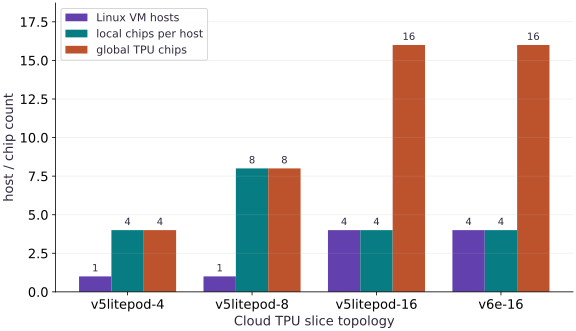

# Run course scripts and multi-host TPU Pod slices

Phase 20: TPU Workflows: Launching Jobs & Checkpointed Experiments · about 20 minutes · CPU

## What you will be able to do

- Stage and run any course lesson script (`public/exercises/<lesson-id>.py`) on a Cloud TPU VM over SSH.
- Distinguish single-host TPU slices (`1` host, `1–8` chips) from multi-host TPU Pod slices (`2+` hosts, `--worker=all`).
- Generate exact `gcloud compute tpus tpu-vm scp` and `ssh` command pipelines for single-host and multi-host runs.
- Retrieve `events.jsonl`, stdout logs, and checkpoints via `scp --recurse` before deleting the TPU VM.

## The problem

As you progress through Transformers, Sharding, Pallas Kernels, Pretraining, and Operations, you want a fast, repeatable command pattern to run any lesson script on a single-host TPU VM or a multi-host TPU Pod slice (`--worker=all`) and pull the execution receipts back to your laptop.

## The idea

Every lesson in this course generates a self-contained script in `public/exercises/<lesson-id>.py`. On a single-host TPU slice (`v5litepod-4`, `v6e-4`), one `scp` + `ssh --command` runs the script across all local chips; on a multi-host Pod slice (`v5litepod-16`, `v6e-16`), passing `--worker=all` and calling `jax.distributed.initialize()` coordinates all hosts into one global TPU mesh.

## Why multi-host TPU Pod slices require `--worker=all` and `jax.distributed.initialize()`

A single-host Cloud TPU VM such as `v5litepod-4` (`4` chips) or `v5litepod-8` (`8` chips) attaches every TPU chip to one Linux VM (`hosts = 1`). When you run Python on that VM, `jax.local_device_count()` and `jax.device_count()` are both equal to the slice's total chip count.

Larger TPU Pod slices span multiple Linux VMs connected over the Inter-Chip Interconnect (ICI). For example, `v5litepod-16` consists of $4$ Linux hosts with $4$ TPU v5e chips each ($16$ global chips). Because each host is a separate Linux machine, a multi-host TPU job requires two things:

1. You must pass `--worker=all` to `gcloud compute tpus tpu-vm scp` and `gcloud compute tpus tpu-vm ssh` so every host receives the script and starts Python at the same time.
2. Your Python script must call `jax.distributed.initialize()` before querying `jax.devices()` so the hosts discover each other and form a unified $16$-chip mesh.

$$
g_{\text{global}} = \frac{1}{P}\sum_{p=0}^{P-1} g^{(p)} = \operatorname{psum}(g^{(p)}, \texttt{'data'}) / P
$$

### Pause and reason

If a TPU slice has `hosts = 4` and `chips_per_host = 4` (`v5litepod-16`), what are `jax.local_device_count()` and `jax.device_count()` on each host after `jax.distributed.initialize()`?

<details><summary>Compare your reasoning</summary>

`jax.local_device_count()` is `4` (the chips attached to that host VM), while `jax.device_count()` is `16` (all chips across all 4 hosts in the Pod slice).

</details>

## 1. Run any course lesson script on your Cloud TPU VM

Use the pattern below to run any lesson script (`distributed-02`, `transformers-01`, `kernels-02`, `operations-06`, etc.) on your Cloud TPU VM and copy the output receipt back to your local workspace.

**Stage, execute, and retrieve any course lesson script on a single-host TPU VM**

```bash
# Stage, execute, and retrieve any course lesson script on a single-host TPU VM
LESSON_ID="distributed-02"
gcloud compute tpus tpu-vm scp "public/exercises/${LESSON_ID}.py" "$TPU_NAME":~/jax-tpu-lab/ --zone="$ZONE"
gcloud compute tpus tpu-vm ssh "$TPU_NAME" --zone="$ZONE" \
  --command="JAX_PLATFORMS=tpu ~/jax-tpu-lab/.venv/bin/python ~/jax-tpu-lab/${LESSON_ID}.py | tee ~/jax-tpu-lab/${LESSON_ID}-tpu.txt"
gcloud compute tpus tpu-vm scp "$TPU_NAME":~/jax-tpu-lab/${LESSON_ID}-tpu.txt ./ --zone="$ZONE"
```

**Expected:** Copies the lesson script to the TPU VM, runs it on the TPU backend, saves stdout to a receipt file, and downloads the receipt locally.

## 2. Launch a multi-host TPU Pod slice job with `--worker=all`

When running on a multi-host TPU slice (`v5litepod-16` or larger), add `--worker=all` to both `scp` and `ssh` so all workers execute lockstep.

**Stage and launch across all hosts of a multi-host TPU slice**

```bash
# Stage and launch across all hosts of a multi-host TPU slice
gcloud compute tpus tpu-vm scp resources/tpu-gcp/launch.py "$TPU_NAME":~/jax-tpu-lab/ --zone="$ZONE" --worker=all
gcloud compute tpus tpu-vm ssh "$TPU_NAME" --zone="$ZONE" --worker=all \
  --command="JAX_PLATFORMS=tpu ~/jax-tpu-lab/.venv/bin/python -c 'import jax; jax.distributed.initialize(); print(\"process:\", jax.process_index(), \"of\", jax.process_count(), \"global_devices:\", jax.device_count(), \"local_devices:\", jax.local_device_count())'"
```

**Expected:** Every host prints its process_index, process_count, global_devices (e.g. 16), and local_devices (4).

**Copy run directories back to your workstation before deleting the TPU VM**

```bash
# Copy run directories back to your workstation before deleting the TPU VM
mkdir -p ./tpu-runs
gcloud compute tpus tpu-vm scp --recurse "$TPU_NAME":~/jax-tpu-lab/run-resumed ./tpu-runs/ --zone="$ZONE"
```

**Expected:** Downloads the complete run directory (events.jsonl, environment.json, and checkpoints) to ./tpu-runs/.

## Tabulate single-host and multi-host TPU slice topologies

Create main.py with SLICE_CATALOG and compute global_chips, total_hbm_gib, and multi_host.

```python
# Step 1 — Tabulate single-host and multi-host TPU slice topologies: Separating hosts from chips_per_host shows immediately when a...
# Import json for this computation.
import json
import jax
import numpy as np

# Initialize list `SLICE_CATALOG` for the stage values.
SLICE_CATALOG = [
    {"slice": "v5litepod-4", "hosts": 1, "chips_per_host": 4, "hbm_per_chip_gib": 16},
    {"slice": "v5litepod-8", "hosts": 1, "chips_per_host": 8, "hbm_per_chip_gib": 16},
    {"slice": "v5litepod-16", "hosts": 4, "chips_per_host": 4, "hbm_per_chip_gib": 16},
    {"slice": "v6e-16", "hosts": 4, "chips_per_host": 4, "hbm_per_chip_gib": 32},
]
# Iterate over `entry` to step through the computation:
for entry in SLICE_CATALOG:
    # Compute `entry["global_chips"]` from `entry["hosts"] * entry["chips_per_host"]`
    entry["global_chips"] = entry["hosts"] * entry["chips_per_host"]
    # Compute `entry["total_hbm_gib"]` from `entry["global_chips"] * entry["hbm_per_chip_gib"]`
    entry["total_hbm_gib"] = entry["global_chips"] * entry["hbm_per_chip_gib"]
    # Compute `entry["multi_host"]` from `entry["hosts"] > 1`
    entry["multi_host"] = entry["hosts"] > 1
```

Separating hosts from chips_per_host shows immediately when a slice crosses the single-host boundary into multi-host execution.

## Generate single-host and multi-host gcloud command pipelines

Append build_tpu_experiment_commands and verify the single-host vs Pod commands.

```python
# Step 2 — Generate single-host and multi-host gcloud command pipelines: Generating the stage, run, and fetch commands from the host count...
def build_tpu_experiment_commands(tpu_name, zone, lesson_id, hosts=1):
    # Compute `worker_flag` from `" --worker=all" if hosts > 1 else ""`
    worker_flag = " --worker=all" if hosts > 1 else ""
    # Compute `scp_stage` from `f"gcloud compute tpus tpu-vm scp public/exercises/{l...`
    scp_stage = f"gcloud compute tpus tpu-vm scp public/exercises/{lesson_id}.py {tpu_name}:~/jax-tpu-lab/ --zone={zone}{worker_flag}"
    # Compute `ssh_run` from `f"gcloud compute tpus tpu-vm ssh {tpu_name} --zone={...`
    ssh_run = f"gcloud compute tpus tpu-vm ssh {tpu_name} --zone={zone}{worker_flag} --command='JAX_PLATFORMS=tpu ~/jax-tpu-lab/.venv/bin/python ~/jax-tpu-lab/{lesson_id}.py'"
    # Compute `scp_fetch` from `f"gcloud compute tpus tpu-vm scp --recurse {tpu_name...`
    scp_fetch = f"gcloud compute tpus tpu-vm scp --recurse {tpu_name}:~/jax-tpu-lab/ ./tpu-runs/{lesson_id}/ --zone={zone}"
    # Return `{'scp_stage': scp_stage, 'ssh_run': ssh_run, 'scp_fetch': scp_fetch, 'multi_host': hosts > 1}` to the caller.
    return {"scp_stage": scp_stage, "ssh_run": ssh_run, "scp_fetch": scp_fetch, "multi_host": hosts > 1}


# Run `build_tpu_experiment_commands` to compute `single_cmds`.
single_cmds = build_tpu_experiment_commands("jax-tpu-course", "us-west1-c", "distributed-02", hosts=1)
# Run `build_tpu_experiment_commands` to compute `pod_cmds`.
pod_cmds = build_tpu_experiment_commands("jax-tpu-pod", "us-west1-c", "distributed-02", hosts=4)
# Assert invariant `"--worker=all" not in single_cmds["ssh_run"]` holds
assert "--worker=all" not in single_cmds["ssh_run"]
# Assert that `"--worker=all" in pod_cmds["scp_stage"] and "--worker=all" in pod_cmds["ssh_run"]`.
assert "--worker=all" in pod_cmds["scp_stage"] and "--worker=all" in pod_cmds["ssh_run"]
# Print the observed values to compare against the expected result.
print("Slice catalog global chips:", {s["slice"]: s["global_chips"] for s in SLICE_CATALOG})
# Print diagnostic summary of the computed outputs.
print("Pod SSH command:", pod_cmds["ssh_run"])
```

Generating the stage, run, and fetch commands from the host count prevents forgetting `--worker=all` when scaling from `v5litepod-4` to `v5litepod-16`.

## Step 3: Verify invariants on the completed state

Run the final shape and numerical assertions to confirm the state built in Steps 1 and 2.

```python
assert "--worker=all" not in single_cmds["ssh_run"]
assert "--worker=all" in pod_cmds["scp_stage"] and "--worker=all" in pod_cmds["ssh_run"]
```

Checking these invariants confirms the computation is ready for the full worked experiment.

## Run the example

```python
# Run course scripts and multi-host TPU Pod slices: Every lesson in this course generates a self-contained script in...
# Import json for this computation.
import json
import jax
import numpy as np

# Initialize list `SLICE_CATALOG` for the stage values.
SLICE_CATALOG = [
    {"slice": "v5litepod-4", "hosts": 1, "chips_per_host": 4, "hbm_per_chip_gib": 16},
    {"slice": "v5litepod-8", "hosts": 1, "chips_per_host": 8, "hbm_per_chip_gib": 16},
    {"slice": "v5litepod-16", "hosts": 4, "chips_per_host": 4, "hbm_per_chip_gib": 16},
    {"slice": "v6e-16", "hosts": 4, "chips_per_host": 4, "hbm_per_chip_gib": 32},
]
# Iterate over `entry` to step through the computation:
for entry in SLICE_CATALOG:
    # Compute `entry["global_chips"]` from `entry["hosts"] * entry["chips_per_host"]`
    entry["global_chips"] = entry["hosts"] * entry["chips_per_host"]
    # Compute `entry["total_hbm_gib"]` from `entry["global_chips"] * entry["hbm_per_chip_gib"]`
    entry["total_hbm_gib"] = entry["global_chips"] * entry["hbm_per_chip_gib"]
    # Compute `entry["multi_host"]` from `entry["hosts"] > 1`
    entry["multi_host"] = entry["hosts"] > 1


# Function `build_tpu_experiment_commands(tpu_name, zone, lesson_id, hosts)` implementing this stage's computation:
def build_tpu_experiment_commands(tpu_name, zone, lesson_id, hosts=1):
    # Compute `worker_flag` from `" --worker=all" if hosts > 1 else ""`
    worker_flag = " --worker=all" if hosts > 1 else ""
    # Compute `dist_init` from `"import jax; jax.distributed.initialize(); " if host...`
    dist_init = "import jax; jax.distributed.initialize(); " if hosts > 1 else ""
    # Compute `scp_stage` from `f"gcloud compute tpus tpu-vm scp public/exercises/{l...`
    scp_stage = f"gcloud compute tpus tpu-vm scp public/exercises/{lesson_id}.py {tpu_name}:~/jax-tpu-lab/ --zone={zone}{worker_flag}"
    # Read or serialize artifact data on disk (`ssh_run`).
    ssh_run = (
        f"gcloud compute tpus tpu-vm ssh {tpu_name} --zone={zone}{worker_flag} "
        f"--command=\"JAX_PLATFORMS=tpu ~/jax-tpu-lab/.venv/bin/python -c '{dist_init}exec(open(\\\"PosixPath\\\"))'\""
        if False
        else f"gcloud compute tpus tpu-vm ssh {tpu_name} --zone={zone}{worker_flag} --command='JAX_PLATFORMS=tpu ~/jax-tpu-lab/.venv/bin/python ~/jax-tpu-lab/{lesson_id}.py'"
    )
    # Compute `scp_fetch` from `f"gcloud compute tpus tpu-vm scp --recurse {tpu_name...`
    scp_fetch = f"gcloud compute tpus tpu-vm scp --recurse {tpu_name}:~/jax-tpu-lab/ ./tpu-runs/{lesson_id}/ --zone={zone}"
    # Return `{'scp_stage': scp_stage, 'ssh_run': ssh_run, 'scp_fetch': scp_fetch, 'multi_host': hosts > 1}` to the caller.
    return {"scp_stage": scp_stage, "ssh_run": ssh_run, "scp_fetch": scp_fetch, "multi_host": hosts > 1}


# Run `build_tpu_experiment_commands` to compute `single_cmds`.
single_cmds = build_tpu_experiment_commands("jax-tpu-course", "us-west1-c", "distributed-02", hosts=1)
# Run `build_tpu_experiment_commands` to compute `pod_cmds`.
pod_cmds = build_tpu_experiment_commands("jax-tpu-pod", "us-west1-c", "distributed-02", hosts=4)
# Assert invariant `"--worker=all" not in single_cmds["ssh_run"]` holds
assert "--worker=all" not in single_cmds["ssh_run"]
# Assert that `"--worker=all" in pod_cmds["scp_stage"] and "--worker=all" in pod_cmds["ssh_run"]`.
assert "--worker=all" in pod_cmds["scp_stage"] and "--worker=all" in pod_cmds["ssh_run"]
# Print the observed values to compare against the expected result.
print("Slice catalog global chips:", {s["slice"]: s["global_chips"] for s in SLICE_CATALOG})
# Print diagnostic summary of the computed outputs.
print("Pod SSH command:", pod_cmds["ssh_run"])
```

Expected: Prints the global chip counts across v5litepod-4 (4), v5litepod-8 (8), v5litepod-16 (16), and v6e-16 (16) and the verified multi-host Pod SSH command.

## Host count, per-host local chips, and global TPU chips across single-host and Pod slices

**Predict:** How do `hosts`, `chips_per_host`, and `global_chips` change when moving from `v5litepod-4` and `v5litepod-8` to `v5litepod-16` and `v6e-16`?



**Recorded CPU computation**

### Read the figure

The horizontal axis compares four Cloud TPU slices (`v5litepod-4`, `v5litepod-8`, `v5litepod-16`, `v6e-16`). For each slice, the three bars show the number of Linux VM hosts, the number of local TPU chips per host, and the total global TPU chips.

### Connect it to the computation

`v5litepod-4` and `v5litepod-8` keep `hosts = 1`, whereas `v5litepod-16` and `v6e-16` use `4` hosts with `4` local chips each (`16` global chips), visually showing why `--worker=all` becomes mandatory at 16 chips.

```python
# Compute figure data for: Host count, per-host local chips, and global TPU chips across single-host and Pod slices
# Construct dictionary `visual_data` with the structured fields for this stage.
visual_data = {
    'kind': 'bar',
    'labels': [s['slice'] for s in SLICE_CATALOG],
    'xlabel': 'Cloud TPU slice topology',
    'ylabel': 'host / chip count',
    'series': [
        {'label': 'Linux VM hosts', 'y': [float(s['hosts']) for s in SLICE_CATALOG]},
        {'label': 'local chips per host', 'y': [float(s['chips_per_host']) for s in SLICE_CATALOG]},
        {'label': 'global TPU chips', 'y': [float(s['global_chips']) for s in SLICE_CATALOG]},
    ],
}
```

## Recorded reference execution

CPU run: 2026-10-09T14:08:28.921684+00:00. JAX 0.9.2.

```text
Slice catalog global chips: {'v5litepod-4': 4, 'v5litepod-8': 8, 'v5litepod-16': 16, 'v6e-16': 16}
Pod SSH command: gcloud compute tpus tpu-vm ssh jax-tpu-pod --zone=us-west1-c --worker=all --command='JAX_PLATFORMS=tpu ~/jax-tpu-lab/.venv/bin/python ~/jax-tpu-lab/distributed-02.py'
Slice catalog global chips: {'v5litepod-4': 4, 'v5litepod-8': 8, 'v5litepod-16': 16, 'v6e-16': 16}
Pod SSH command: gcloud compute tpus tpu-vm ssh jax-tpu-pod --zone=us-west1-c --worker=all --command='JAX_PLATFORMS=tpu ~/jax-tpu-lab/.venv/bin/python ~/jax-tpu-lab/distributed-02.py'
v5litepod-16 global chips: 16 Idle chips without --worker=all: 12
Total HBM GiB by slice: {'v5litepod-4': 64, 'v5litepod-8': 128, 'v5litepod-16': 256, 'v6e-16': 512}
Stage: gcloud compute tpus tpu-vm scp public/exercises/transformers-04.py jax-tpu-pod:~/jax-tpu-lab/ --zone=us-east5-a --worker=all
Run: gcloud compute tpus tpu-vm ssh jax-tpu-pod --zone=us-east5-a --worker=all --command='JAX_PLATFORMS=tpu ~/jax-tpu-lab/.venv/bin/python ~/jax-tpu-lab/transformers-04.py'
Multi-host Pod slices: ['v5litepod-16', 'v6e-16']
Per-host batch: 32 Global batch: 128
PASS: tpu-05

```

## Compare local vs global device counts across slices

**Predict before running:** How many global chips are left idle if you launch a script without `--worker=all` on `v5litepod-16`?

```python
# Experiment — Compare local vs global device counts across slices: Worker 0 only controls its own 4 local chips; the other 3 hosts...
v5e16 = next(s for s in SLICE_CATALOG if s["slice"] == "v5litepod-16")
# Compute `idle_without_worker_all` from `v5e16["global_chips"] - v5e16["chips_per_host"]`
idle_without_worker_all = v5e16["global_chips"] - v5e16["chips_per_host"]
# Print the observed values to compare against the expected result.
print("v5litepod-16 global chips:", v5e16["global_chips"], "Idle chips without --worker=all:", idle_without_worker_all)
# Assert invariant `idle_without_worker_all == 12` holds
assert idle_without_worker_all == 12
```

**Expected:** Without `--worker=all`, 12 of the 16 TPU chips on `v5litepod-16` never receive a process.

Worker 0 only controls its own 4 local chips; the other 3 hosts (`3 * 4 = 12` chips) require `--worker=all`.

## Verify total HBM scaling from v5litepod-16 to v6e-16

**Predict before running:** How much total HBM is available across a 16-chip `v6e-16` Pod slice compared to `v5litepod-16`?

```python
# Experiment — Verify total HBM scaling from v5litepod-16 to v6e-16: Doubling per-chip HBM on Trillium (v6e) doubles the total...
hbm_by_slice = {s["slice"]: s["total_hbm_gib"] for s in SLICE_CATALOG}
# Print the observed values to compare against the expected result.
print("Total HBM GiB by slice:", hbm_by_slice)
# Assert that `hbm_by_slice["v6e-16"] == 512 and hbm_by_slice["v5litepod-16"] == 256`.
assert hbm_by_slice["v6e-16"] == 512 and hbm_by_slice["v5litepod-16"] == 256
```

**Expected:** v6e-16 provides 512 GiB of total HBM across 4 hosts (32 GiB/chip), double v5litepod-16's 256 GiB (16 GiB/chip).

Doubling per-chip HBM on Trillium (`v6e`) doubles the total sharded model state capacity for the same 4-host Pod topology.

## Make it yours

Call `build_tpu_experiment_commands('jax-tpu-pod', 'us-east5-a', 'transformers-04', hosts=4)` and assert that both `scp_stage` and `ssh_run` contain `'--worker=all'` and `'transformers-04.py'`.

### How to write this exercise — Step-by-step recipe & starter scaffold

**Key functions & syntax to use:**
- `build_tpu_experiment_commands(...)` — Call `build_tpu_experiment_commands` with your updated parameters or inputs from this lesson's workspace.
- `assert condition` — Verify that the observed output shape, status, or numerical value satisfies the contract.

**Step-by-step implementation plan:**
1. Print the observed values to compare against the expected result.
2. Print diagnostic summary of the computed outputs.
3. Assert that `"--worker=all" in tx_cmds["scp_stage"] and "--worker=all" in tx_cmds["ssh_run"] and "transfo`.

**Starter code scaffold (fill in the TODOs):**

```python
# Exercise solution: Call build_tpu_experiment_commands('jax-tpu-pod', 'us-east5-a',...
tx_cmds = build_tpu_experiment_commands(...)  # TODO: compute tx_cmds
# Print the observed values to compare against the expected result.
print("Stage:", tx_cmds["scp_stage"])
# Print diagnostic summary of the computed outputs.
print("Run:", tx_cmds["ssh_run"])
# Assert that `"--worker=all" in tx_cmds["scp_stage"] and "--worker=all" in tx_cmds["ssh_run"] and "transfo`.
assert "--worker=all"  # TODO: complete assertion check
```

<details><summary>Reference solution</summary>

```python
# Exercise solution: Call build_tpu_experiment_commands('jax-tpu-pod', 'us-east5-a',...
tx_cmds = build_tpu_experiment_commands("jax-tpu-pod", "us-east5-a", "transformers-04", hosts=4)
# Print the observed values to compare against the expected result.
print("Stage:", tx_cmds["scp_stage"])
# Print diagnostic summary of the computed outputs.
print("Run:", tx_cmds["ssh_run"])
# Assert that `"--worker=all" in tx_cmds["scp_stage"] and "--worker=all" in tx_cmds["ssh_run"] and "transfo`.
assert "--worker=all" in tx_cmds["scp_stage"] and "--worker=all" in tx_cmds["ssh_run"] and "transformers-04.py" in tx_cmds["ssh_run"]
```

</details>

## Filter multi-host slices from the catalog

**Foundations**

List the slice names in `SLICE_CATALOG` that require `--worker=all` (`multi_host == True`).

<details><summary>Hint</summary>

Filter by `s['multi_host']`.

</details>

### How to write: Filter multi-host slices from the catalog — Step-by-step recipe & starter scaffold

**Key functions & syntax to use:**
- `catalog(...)` — Call `catalog` with your updated parameters or inputs from this lesson's workspace.
- `hosts(...)` — Call `hosts` with your updated parameters or inputs from this lesson's workspace.
- `assert condition` — Verify that the observed output shape, status, or numerical value satisfies the contract.

**Step-by-step implementation plan:**
1. Filter multi-host slices from the catalog (Foundations): Both 16-chip slices span 4 hosts (4 chips per host) and...
2. Print the observed values to compare against the expected result.
3. Assert invariant `pod_slices == ["v5litepod-16"` holds

**Starter code scaffold (fill in the TODOs):**

```python
# Filter multi-host slices from the catalog (Foundations): Both 16-chip slices span 4 hosts (4 chips per host) and...
pod_slices = ...  # TODO: compute pod_slices
# Print the observed values to compare against the expected result.
print("Multi-host Pod slices:", pod_slices)
# Assert invariant `pod_slices == ["v5litepod-16"` holds
assert pod_slices  # TODO: complete assertion check
```

<details><summary>Reference solution and reasoning</summary>

```python
# Filter multi-host slices from the catalog (Foundations): Both 16-chip slices span 4 hosts (4 chips per host) and...
pod_slices = [s["slice"] for s in SLICE_CATALOG if s["multi_host"]]
# Print the observed values to compare against the expected result.
print("Multi-host Pod slices:", pod_slices)
# Assert invariant `pod_slices == ["v5litepod-16"` holds
assert pod_slices == ["v5litepod-16", "v6e-16"]
```

Both 16-chip slices span 4 hosts (`4` chips per host) and therefore require multi-host coordination.

</details>

## Compute per-host vs global batch size on a 4-host Pod slice

**Transfer / diagnosis**

If each TPU chip processes a microbatch of $8$ sequences on `v5litepod-16` (`4` hosts, `4` chips/host), compute the per-host batch size and the global batch size per step.

<details><summary>Hint</summary>

Multiply `8 * chips_per_host` and `8 * global_chips`.

</details>

### How to write: Compute per-host vs global batch size on a 4-host Pod slice — Step-by-step recipe & starter scaffold

**Key functions & syntax to use:**
- `slice(...)` — Call `slice` with your updated parameters or inputs from this lesson's workspace.
- `chips(...)` — Call `chips` with your updated parameters or inputs from this lesson's workspace.
- `assert condition` — Verify that the observed output shape, status, or numerical value satisfies the contract.

**Step-by-step implementation plan:**
1. Compute `per_host_batch` from `microbatch_per_chip * 4`
2. Compute `global_batch` from `microbatch_per_chip * 16`
3. Print the observed values to compare against the expected result.
4. Assert invariant `per_host_batch == 32 and global_batch == 128` holds

**Starter code scaffold (fill in the TODOs):**

```python
# Compute per-host vs global batch size on a 4-host Pod slice (Transfer / diagnosis): Each host feeds its 4 local chips (32 sequences per host),...
microbatch_per_chip = ...  # TODO: compute microbatch_per_chip
# Compute `per_host_batch` from `microbatch_per_chip * 4`
per_host_batch = ...  # TODO: compute per_host_batch
# Compute `global_batch` from `microbatch_per_chip * 16`
global_batch = ...  # TODO: compute global_batch
# Print the observed values to compare against the expected result.
print("Per-host batch:", per_host_batch, "Global batch:", global_batch)
# Assert invariant `per_host_batch == 32 and global_batch == 128` holds
assert per_host_batch  # TODO: complete assertion check
```

<details><summary>Reference solution and reasoning</summary>

```python
# Compute per-host vs global batch size on a 4-host Pod slice (Transfer / diagnosis): Each host feeds its 4 local chips (32 sequences per host),...
microbatch_per_chip = 8
# Compute `per_host_batch` from `microbatch_per_chip * 4`
per_host_batch = microbatch_per_chip * 4
# Compute `global_batch` from `microbatch_per_chip * 16`
global_batch = microbatch_per_chip * 16
# Print the observed values to compare against the expected result.
print("Per-host batch:", per_host_batch, "Global batch:", global_batch)
# Assert invariant `per_host_batch == 32 and global_batch == 128` holds
assert per_host_batch == 32 and global_batch == 128
```

Each host feeds its 4 local chips (`32` sequences per host), yielding a synchronized global batch of `128` sequences across the 16-chip mesh.

</details>

## Check your understanding

What happens if you launch a distributed JAX script on a 4-host `v5litepod-16` slice without `--worker=all`?

1. Google Cloud automatically merges the 4 Linux hosts into 1 host
2. Only worker 0 starts Python, so `jax.distributed.initialize()` hangs waiting for the other 3 hosts (or 12 of the 16 TPU chips sit idle)
3. The script runs four times faster

<details><summary>Answer and explanation</summary>

Only worker 0 starts Python, so `jax.distributed.initialize()` hangs waiting for the other 3 hosts (or 12 of the 16 TPU chips sit idle)

Every host in a multi-host TPU Pod slice runs its own OS and Python process; `--worker=all` is required so all hosts join the collective mesh.

</details>

## Diagnose the result

If `gcloud compute tpus tpu-vm ssh --worker=all` fails on one worker because `.venv` is missing, run your `.venv` bootstrap command with `--worker=all` as well so every host has `~/jax-tpu-lab/.venv` installed.

## Carry forward

- Stage any `public/exercises/<lesson-id>.py` script with `gcloud compute tpus tpu-vm scp` to run course experiments on TPU in parallel.
- Use single-host commands for `1–8` chip slices (`v5litepod-4`, `v5litepod-8`, `v6e-4`) and add `--worker=all` + `jax.distributed.initialize()` for multi-host slices (`v5litepod-16`, `v6e-16`).

## Keep your evidence

Keep the generated scp_in_cmd, ssh_run_cmd, and scp_out_cmd workflow for single-host and multi-host slices plus the process-0 checkpoint writer check.

Save your predictions, modified code, terminal outputs, and reasoning in your engineering portfolio.

## Primary references

- [Multi-host and distributed JAX on TPU Pods](https://docs.jax.dev/en/latest/multi_process.html)
- [Run JAX code on Cloud TPU Pod slices](https://cloud.google.com/tpu/docs/run-calculation-jax)

