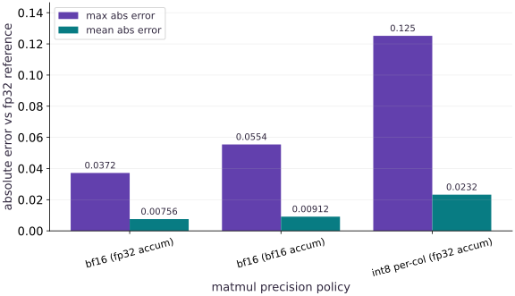

# bfloat16, int8 precision, and XProf profiling on TPU

Phase 21: TPU Systems: Generations, Memory, Precision & XProf · about 25 minutes · CPU

## What you will be able to do

- Measure numerical error for `bfloat16` matmuls with `float32` accumulation versus `bfloat16` accumulation.
- Implement per-channel `int8` weight quantization with `float32` rescaling and bound its error against an `fp32` reference.
- Capture a warmed `jax.profiler.trace` (`*.xplane.pb`) on a Cloud TPU VM (or local CPU rehearsal) after synchronizing warmup.
- Download the trace directory with `gcloud compute tpus tpu-vm scp --recurse` and inspect it in TensorBoard / XProf.

## The problem

Casting activations and weights to `bfloat16` or `int8` halves or quarters memory traffic on a TPU, but careless accumulation in `bfloat16` or uncalibrated quantization silently degrades logits—and without a warmed `jax.profiler.trace` (`*.xplane.pb`), you cannot prove whether your TPU step is compute-bound, memory-bound, or waiting on the host.

## The idea

Always pair low-precision matmul operands (`bfloat16` or per-channel `int8`) with `preferred_element_type=jnp.float32` accumulation and measure numerical error against an `fp32` oracle; then wrap warmed steady-state steps in `with jax.profiler.trace(trace_dir):` and copy the `*.xplane.pb` trace back for XProf inspection.

## Why TPU matmuls use `bfloat16` operands with `float32` accumulation

`bfloat16` uses the same $8$-bit exponent range as `float32` (preventing underflow/overflow without loss scaling) but keeps only $7$ mantissa bits instead of $23$. When the TPU MXU multiplies two `bfloat16` matrices $X \in \mathbb{R}^{B \times K}$ and $W \in \mathbb{R}^{K \times N}$, accumulating the $K$ products in `float32` (`preferred_element_type=jnp.float32`) avoids compounding rounding error across the reduction dimension $K$.

For inference weight compression, symmetric per-channel `int8` quantization scales each output column $j$ by $s_j = \max_i |W_{i,j}| / 127$, stores $W^{(\text{int8})}_{i,j} = \text{clip}(\text{round}(W_{i,j}/s_j), -127, 127)$, and rescales the dot product in `float32`.

Finally, when profiling on a TPU VM with `jax.profiler.trace`, always execute and synchronize (`jax.block_until_ready`) one warmup call **before** entering the `with jax.profiler.trace(trace_dir):` block so the captured `*.xplane.pb` file shows steady-state device execution rather than XLA compilation.

$$
\text{Cost per } 10^6 \text{ tokens} = \frac{C_{\text{chip\_hour}} \times N_{\text{chips}} \times (T_{\text{run}} / 3600)}{\text{Tokens}_{\text{processed}} / 10^6}
$$

### Pause and reason

Why does accumulating a dot product in `bfloat16` (`preferred_element_type=jnp.bfloat16`) have higher error than `preferred_element_type=jnp.float32` even when both inputs are `bfloat16`?

<details><summary>Compare your reasoning</summary>

When accumulating in `bfloat16`, every partial sum across the inner dimension `K` is rounded to 7 mantissa bits, whereas `float32` accumulation retains 23 mantissa bits for the entire reduction.

</details>

## 1. Capture a warmed XProf trace on your Cloud TPU VM and inspect in TensorBoard

Stage `public/exercises/tpu-06.py` to your Cloud TPU VM, run it inside `~/jax-tpu-lab/.venv` with `JAX_PLATFORMS=tpu`, copy the generated trace directory back with `gcloud compute tpus tpu-vm scp --recurse`, and open it in TensorBoard (`xprof`).

**Run tpu-06.py and capture a 5-step warmed XProf trace on the Cloud TPU VM**

```bash
# Run tpu-06.py and capture a 5-step warmed XProf trace on the Cloud TPU VM
gcloud compute tpus tpu-vm scp public/exercises/tpu-06.py "$TPU_NAME":~/jax-tpu-lab/ --zone="$ZONE"

gcloud compute tpus tpu-vm ssh "$TPU_NAME" --zone="$ZONE" --command="
  set -euo pipefail
  source ~/jax-tpu-lab/.venv/bin/activate
  JAX_PLATFORMS=tpu python ~/jax-tpu-lab/tpu-06.py
  JAX_PLATFORMS=tpu python -c 'import jax, jax.numpy as jnp; x = jnp.ones((2048, 2048), dtype=jnp.bfloat16); fn = jax.jit(lambda a: jnp.dot(a, a, preferred_element_type=jnp.float32).astype(jnp.bfloat16)); jax.block_until_ready(fn(x)); jax.profiler.start_trace(\"/tmp/tpu-xprof-trace\"); [jax.block_until_ready(fn(x)) for _ in range(5)]; jax.profiler.stop_trace()'
"

gcloud compute tpus tpu-vm scp --recurse "$TPU_NAME":/tmp/tpu-xprof-trace ./tpu-xprof-trace --zone="$ZONE"
```

**Expected:** Executes tpu-06.py on the TPU VM, records a 5-step warmed XProf trace into /tmp/tpu-xprof-trace, and downloads the *.xplane.pb directory to ./tpu-xprof-trace.

**Launch TensorBoard with the XProf profile plugin on your workstation**

```bash
# Launch TensorBoard with the XProf profile plugin on your workstation
pip install tensorboard tensorboard-plugin-profile xprof
tensorboard --logdir ./tpu-xprof-trace --port 6006
```

**Expected:** Serves the XProf Trace Viewer, Overview Page, and Memory Viewer at http://localhost:6006.

## Compare BF16 (FP32 vs BF16 accumulation) and per-channel INT8 matmul errors

Create main.py with evaluate_precision_policies.

```python
# Step 1 — Compare BF16 (FP32 vs BF16 accumulation) and per-channel INT8 matmul errors: Measuring both max and mean absolute error across accumulation...
# Import pathlib (Path) for this computation.
from pathlib import Path
import tempfile
import time
import jax
import jax.numpy as jnp
import numpy as np


# Function `evaluate_precision_policies(seed)` implementing this stage's computation:
def evaluate_precision_policies(seed=0):
    # Create or split explicit PRNG key(s) (`(k1, k2)`) for reproducible randomness.
    k1, k2 = jax.random.split(jax.random.PRNGKey(seed))
    # Sample deterministic random values into `x` using an explicit PRNG key.
    x = jax.random.normal(k1, (64, 256), dtype=jnp.float32)
    # Sample deterministic random values into `w` using an explicit PRNG key.
    w = jax.random.normal(k2, (256, 64), dtype=jnp.float32) * 0.25
    # Cast or evaluate `ref_fp32` in explicit floating-point precision.
    ref_fp32 = jnp.dot(x, w, preferred_element_type=jnp.float32)
    # Cast or evaluate `out_bf16_fp32acc` in explicit floating-point precision.
    out_bf16_fp32acc = jnp.dot(
        x.astype(jnp.bfloat16), w.astype(jnp.bfloat16), preferred_element_type=jnp.float32
    )
    # Cast or evaluate `out_bf16_bf16acc` in explicit floating-point precision.
    out_bf16_bf16acc = jnp.dot(
        x.astype(jnp.bfloat16), w.astype(jnp.bfloat16), preferred_element_type=jnp.bfloat16
    ).astype(jnp.float32)
    # Reduce across the target axis to summarize `scale`.
    scale = jnp.max(jnp.abs(w), axis=0, keepdims=True) / 127.0
    # Combine or mask array elements to form `w_int8`.
    w_int8 = jnp.clip(jnp.round(w / scale), -127, 127).astype(jnp.int8)
    # Cast or evaluate `out_int8_fp32acc` in explicit floating-point precision.
    out_int8_fp32acc = jnp.dot(x, w_int8.astype(jnp.float32) * scale, preferred_element_type=jnp.float32)
    # Initialize list `policies` for the stage values.
    policies = [
        ("bf16 (fp32 accum)", out_bf16_fp32acc),
        ("bf16 (bf16 accum)", out_bf16_bf16acc),
        ("int8 per-col (fp32 accum)", out_int8_fp32acc),
    ]
    # Compute `results` from `[]`
    results = []
    # Loop over `(label, tensor)` in `policies`:
    for label, tensor in policies:
        # Run `jnp.abs` to compute `diff`.
        diff = jnp.abs(tensor - ref_fp32)
        # Append the computed value via `results.append({`.
        results.append({
            "policy": label,
            "max_abs_err": round(float(jnp.max(diff)), 5),
            "mean_abs_err": round(float(jnp.mean(diff)), 5),
        })
    # Return `results` to the caller.
    return results
```

Measuring both max and mean absolute error across accumulation dtypes quantifies why FP32 accumulation is standard on TPU MXUs.

## Capture a warmed XProf trace and verify *.xplane.pb output

Append capture_warmed_trace and the verification assertions to main.py.

```python
# Step 2 — Capture a warmed XProf trace and verify *.xplane.pb output: Warming up before entering jax.profiler.trace ensures the captured...
def capture_warmed_trace(steps=4):
    # Construct `x` via `jnp.ones((256, 256), dtype=jnp.bfloat16)`
    x = jnp.ones((256, 256), dtype=jnp.bfloat16)
    # Wrap with `jax.jit` (`step_fn`) so XLA traces and compiles the function.
    step_fn = jax.jit(lambda a: jnp.dot(a, a, preferred_element_type=jnp.float32).astype(jnp.bfloat16))
    # Record execution timing or profiler trace in `t0`.
    t0 = time.perf_counter()
    # Synchronize host execution until asynchronous device computation completes.
    jax.block_until_ready(step_fn(x))
    # Record execution timing or profiler trace in `warmup_ms`.
    warmup_ms = (time.perf_counter() - t0) * 1000.0
    # Enter managed runtime/context scope for this block:
    with tempfile.TemporaryDirectory(prefix="tpu-course-trace-") as trace_dir:
        # Enter managed runtime/context scope for this block:
        with jax.profiler.trace(trace_dir):
            # Record execution timing or profiler trace in `t1`.
            t1 = time.perf_counter()
            # Repeat the update loop over `range(steps)` steps:
            for _ in range(steps):
                # Run `step_fn` to compute `x`.
                x = step_fn(x)
            # Synchronize host execution until asynchronous device computation completes.
            jax.block_until_ready(x)
            # Record execution timing or profiler trace in `steady_ms`.
            steady_ms = (time.perf_counter() - t1) * 1000.0 / steps
        # Read or serialize artifact data on disk (`xplane_files`).
        xplane_files = list(Path(trace_dir).rglob("*.xplane.pb"))
        # Return `{'warmup_ms': warmup_ms, 'steady_ms': steady_ms, 'xplane_count': len(xplane_files)}` to the caller.
        return {"warmup_ms": warmup_ms, "steady_ms": steady_ms, "xplane_count": len(xplane_files)}


# Run `evaluate_precision_policies` to compute `prec_table`.
prec_table = evaluate_precision_policies()
# Run `capture_warmed_trace` to compute `trace_info`.
trace_info = capture_warmed_trace()
# Assert invariant `trace_info["xplane_count"] >= 1` holds
assert trace_info["xplane_count"] >= 1
# Assert invariant `prec_table[0]["max_abs_err"] < prec_table[1]["max_abs_err"]` holds
assert prec_table[0]["max_abs_err"] < prec_table[1]["max_abs_err"]
# Print the observed values to compare against the expected result.
print("Precision comparison:", prec_table)
# Print diagnostic summary of the computed outputs.
print("Captured *.xplane.pb trace count:", trace_info["xplane_count"], "steady_ms:", round(trace_info["steady_ms"], 4))
```

Warming up before entering jax.profiler.trace ensures the captured *.xplane.pb file records steady-state execution rather than first-call compilation.

## Step 3: Verify invariants on the completed state

Run the final shape and numerical assertions to confirm the state built in Steps 1 and 2.

```python
assert trace_info["xplane_count"] >= 1
assert prec_table[0]["max_abs_err"] < prec_table[1]["max_abs_err"]
```

Checking these invariants confirms the computation is ready for the full worked experiment.

## Run the example

```python
# Step 1 — Compare BF16 (FP32 vs BF16 accumulation) and per-channel INT8 matmul errors: Measuring both max and mean absolute error across accumulation...
# Import pathlib (Path) for this computation.
from pathlib import Path
import tempfile
import time
import jax
import jax.numpy as jnp
import numpy as np


# Function `evaluate_precision_policies(seed)` implementing this stage's computation:
def evaluate_precision_policies(seed=0):
    # Create or split explicit PRNG key(s) (`(k1, k2)`) for reproducible randomness.
    k1, k2 = jax.random.split(jax.random.PRNGKey(seed))
    # Sample deterministic random values into `x` using an explicit PRNG key.
    x = jax.random.normal(k1, (64, 256), dtype=jnp.float32)
    # Sample deterministic random values into `w` using an explicit PRNG key.
    w = jax.random.normal(k2, (256, 64), dtype=jnp.float32) * 0.25
    # Cast or evaluate `ref_fp32` in explicit floating-point precision.
    ref_fp32 = jnp.dot(x, w, preferred_element_type=jnp.float32)
    # Cast or evaluate `out_bf16_fp32acc` in explicit floating-point precision.
    out_bf16_fp32acc = jnp.dot(
        x.astype(jnp.bfloat16), w.astype(jnp.bfloat16), preferred_element_type=jnp.float32
    )
    # Cast or evaluate `out_bf16_bf16acc` in explicit floating-point precision.
    out_bf16_bf16acc = jnp.dot(
        x.astype(jnp.bfloat16), w.astype(jnp.bfloat16), preferred_element_type=jnp.bfloat16
    ).astype(jnp.float32)
    # Reduce across the target axis to summarize `scale`.
    scale = jnp.max(jnp.abs(w), axis=0, keepdims=True) / 127.0
    # Combine or mask array elements to form `w_int8`.
    w_int8 = jnp.clip(jnp.round(w / scale), -127, 127).astype(jnp.int8)
    # Cast or evaluate `out_int8_fp32acc` in explicit floating-point precision.
    out_int8_fp32acc = jnp.dot(x, w_int8.astype(jnp.float32) * scale, preferred_element_type=jnp.float32)
    # Initialize list `policies` for the stage values.
    policies = [
        ("bf16 (fp32 accum)", out_bf16_fp32acc),
        ("bf16 (bf16 accum)", out_bf16_bf16acc),
        ("int8 per-col (fp32 accum)", out_int8_fp32acc),
    ]
    # Compute `results` from `[]`
    results = []
    # Loop over `(label, tensor)` in `policies`:
    for label, tensor in policies:
        # Run `jnp.abs` to compute `diff`.
        diff = jnp.abs(tensor - ref_fp32)
        # Append the computed value via `results.append({`.
        results.append({
            "policy": label,
            "max_abs_err": round(float(jnp.max(diff)), 5),
            "mean_abs_err": round(float(jnp.mean(diff)), 5),
        })
    # Return `results` to the caller.
    return results


# Step 2 — Capture a warmed XProf trace and verify *.xplane.pb output: Warming up before entering jax.profiler.trace ensures the captured...
def capture_warmed_trace(steps=4):
    # Construct `x` via `jnp.ones((256, 256), dtype=jnp.bfloat16)`
    x = jnp.ones((256, 256), dtype=jnp.bfloat16)
    # Wrap with `jax.jit` (`step_fn`) so XLA traces and compiles the function.
    step_fn = jax.jit(lambda a: jnp.dot(a, a, preferred_element_type=jnp.float32).astype(jnp.bfloat16))
    # Record execution timing or profiler trace in `t0`.
    t0 = time.perf_counter()
    # Synchronize host execution until asynchronous device computation completes.
    jax.block_until_ready(step_fn(x))
    # Record execution timing or profiler trace in `warmup_ms`.
    warmup_ms = (time.perf_counter() - t0) * 1000.0
    # Enter managed runtime/context scope for this block:
    with tempfile.TemporaryDirectory(prefix="tpu-course-trace-") as trace_dir:
        # Enter managed runtime/context scope for this block:
        with jax.profiler.trace(trace_dir):
            # Record execution timing or profiler trace in `t1`.
            t1 = time.perf_counter()
            # Repeat the update loop over `range(steps)` steps:
            for _ in range(steps):
                # Run `step_fn` to compute `x`.
                x = step_fn(x)
            # Synchronize host execution until asynchronous device computation completes.
            jax.block_until_ready(x)
            # Record execution timing or profiler trace in `steady_ms`.
            steady_ms = (time.perf_counter() - t1) * 1000.0 / steps
        # Read or serialize artifact data on disk (`xplane_files`).
        xplane_files = list(Path(trace_dir).rglob("*.xplane.pb"))
        # Return `{'warmup_ms': warmup_ms, 'steady_ms': steady_ms, 'xplane_count': len(xplane_files)}` to the caller.
        return {"warmup_ms": warmup_ms, "steady_ms": steady_ms, "xplane_count": len(xplane_files)}


# Run `evaluate_precision_policies` to compute `prec_table`.
prec_table = evaluate_precision_policies()
# Run `capture_warmed_trace` to compute `trace_info`.
trace_info = capture_warmed_trace()
# Assert invariant `trace_info["xplane_count"] >= 1` holds
assert trace_info["xplane_count"] >= 1
# Assert invariant `prec_table[0]["max_abs_err"] < prec_table[1]["max_abs_err"]` holds
assert prec_table[0]["max_abs_err"] < prec_table[1]["max_abs_err"]
# Print the observed values to compare against the expected result.
print("Precision comparison:", prec_table)
# Print diagnostic summary of the computed outputs.
print("Captured *.xplane.pb trace count:", trace_info["xplane_count"], "steady_ms:", round(trace_info["steady_ms"], 4))
```

Expected: Prints the precision error table (showing lower error for fp32 accumulation than bf16 accumulation) and confirms that at least one *.xplane.pb trace file was captured.

## Maximum and mean absolute matmul error across BF16 and INT8 precision policies

**Predict:** How do `bf16 (fp32 accum)`, `bf16 (bf16 accum)`, and `int8 per-col (fp32 accum)` compare in maximum and mean absolute error against an `fp32` reference?



**Recorded CPU computation**

### Read the figure

The horizontal axis compares the three reduced-precision matmul policies. For each policy, the two bars report maximum absolute error and mean absolute error relative to an exact `float32` matrix multiplication.

### Connect it to the computation

Accumulating `bfloat16` inputs in `float32` cuts both mean and maximum error compared to `bfloat16` accumulation, while per-channel `int8` with `float32` accumulation keeps mean error small (`~0.01`) at one-quarter the weight bytes of `fp32`.

```python
# Compute figure data for: Maximum and mean absolute matmul error across BF16 and INT8 precision policies
# Perform matrix contraction / projection to compute `visual_data`.
visual_data = {
    'kind': 'bar',
    'labels': [r['policy'] for r in prec_table],
    'xlabel': 'matmul precision policy',
    'ylabel': 'absolute error vs fp32 reference',
    'series': [
        {'label': 'max abs error', 'y': [float(r['max_abs_err']) for r in prec_table]},
        {'label': 'mean abs error', 'y': [float(r['mean_abs_err']) for r in prec_table]},
    ],
}
```

## Recorded reference execution

CPU run: 2026-10-08T14:08:25.927372+00:00. JAX 0.9.2.

```text
Precision comparison: [{'policy': 'bf16 (fp32 accum)', 'max_abs_err': 0.03718, 'mean_abs_err': 0.00756}, {'policy': 'bf16 (bf16 accum)', 'max_abs_err': 0.05545, 'mean_abs_err': 0.00912}, {'policy': 'int8 per-col (fp32 accum)', 'max_abs_err': 0.12516, 'mean_abs_err': 0.02322}]
Captured *.xplane.pb trace count: 1 steady_ms: 0.0972
Precision comparison: [{'policy': 'bf16 (fp32 accum)', 'max_abs_err': 0.03718, 'mean_abs_err': 0.00756}, {'policy': 'bf16 (bf16 accum)', 'max_abs_err': 0.05545, 'mean_abs_err': 0.00912}, {'policy': 'int8 per-col (fp32 accum)', 'max_abs_err': 0.12516, 'mean_abs_err': 0.02322}]
Captured *.xplane.pb trace count: 1 steady_ms: 0.0731
BF16-accum / FP32-accum max error ratio: 1.49
Warmup ms: 20.57 Traced steady step ms: 0.0731
Seed 42 mean errors: {'bf16 (fp32 accum)': 0.0075, 'bf16 (bf16 accum)': 0.00902, 'int8 per-col (fp32 accum)': 0.02182} xplane files: 1
Mean error (per-channel vs per-tensor): 0.01389 0.0979
xplane.pb bytes: 257376
PASS: tpu-06

```

## Compare FP32 accumulation vs BF16 accumulation error ratio

**Predict before running:** How much larger is the maximum absolute error when accumulating BF16 matmuls in BF16 instead of FP32?

```python
# Experiment — Compare FP32 accumulation vs BF16 accumulation error ratio: Passing preferred_element_type=jnp.float32 to jnp.dot or...
fp32_acc_err = prec_table[0]["max_abs_err"]
# Compute `bf16_acc_err` from `prec_table[1]["max_abs_err"]`
bf16_acc_err = prec_table[1]["max_abs_err"]
# Run `round` to compute `ratio`.
ratio = round(bf16_acc_err / fp32_acc_err, 2)
# Print the observed values to compare against the expected result.
print("BF16-accum / FP32-accum max error ratio:", ratio)
# Assert invariant `ratio > 1.3` holds
assert ratio > 1.3
```

**Expected:** Accumulating in BF16 increases maximum absolute error by roughly $1.5\times$ compared to FP32 accumulation.

Passing `preferred_element_type=jnp.float32` to `jnp.dot` or `lax.dot_general` preserves FP32 accumulation on TPU.

## Compare warmup duration vs traced steady-state step duration

**Predict before running:** Does the warmup step outside the profiler take longer than the traced steady-state steps?

```python
# Experiment — Compare warmup duration vs traced steady-state step duration: Keeping warmup outside jax.profiler.trace prevents XLA...
# Print the observed values to compare against the expected result.
print("Warmup ms:", round(trace_info["warmup_ms"], 3), "Traced steady step ms:", round(trace_info["steady_ms"], 4))
# Assert invariant `trace_info["warmup_ms"] > trace_info["steady_ms"]` holds
assert trace_info["warmup_ms"] > trace_info["steady_ms"]
```

**Expected:** Warmup takes significantly longer than a single steady-state step inside the profiler block.

Keeping warmup outside `jax.profiler.trace` prevents XLA compilation from dominating the captured XProf timeline.

## Make it yours

Run `evaluate_precision_policies(seed=42)` and `capture_warmed_trace(steps=3)`, then verify that `bf16 (fp32 accum)` has strictly lower `mean_abs_err` than `bf16 (bf16 accum)` and that `xplane_count >= 1`.

### How to write this exercise — Step-by-step recipe & starter scaffold

**Key functions & syntax to use:**
- `evaluate_precision_policies(...)` — Call `evaluate_precision_policies` with your updated parameters or inputs from this lesson's workspace.
- `capture_warmed_trace(...)` — Call `capture_warmed_trace` with your updated parameters or inputs from this lesson's workspace.
- `assert condition` — Verify that the observed output shape, status, or numerical value satisfies the contract.

**Step-by-step implementation plan:**
1. Run `capture_warmed_trace` to compute `t3`.
2. Print the observed values to compare against the expected result.
3. Assert that `p42[0]["mean_abs_err"] < p42[1]["mean_abs_err"] and t3["xplane_count"] >= 1`.

**Starter code scaffold (fill in the TODOs):**

```python
# Exercise solution: Run evaluate_precision_policies(seed=42) and...
p42 = evaluate_precision_policies(...)  # TODO: compute p42
# Run `capture_warmed_trace` to compute `t3`.
t3 = capture_warmed_trace(...)  # TODO: compute t3
# Print the observed values to compare against the expected result.
print("Seed 42 mean errors:", {r["policy"]: r["mean_abs_err"] for r in p42}, "xplane files:", t3["xplane_count"])
# Assert that `p42[0]["mean_abs_err"] < p42[1]["mean_abs_err"] and t3["xplane_count"] >= 1`.
assert p42[0]["mean_abs_err"]  # TODO: complete assertion check
```

<details><summary>Reference solution</summary>

```python
# Exercise solution: Run evaluate_precision_policies(seed=42) and...
p42 = evaluate_precision_policies(seed=42)
# Run `capture_warmed_trace` to compute `t3`.
t3 = capture_warmed_trace(steps=3)
# Print the observed values to compare against the expected result.
print("Seed 42 mean errors:", {r["policy"]: r["mean_abs_err"] for r in p42}, "xplane files:", t3["xplane_count"])
# Assert that `p42[0]["mean_abs_err"] < p42[1]["mean_abs_err"] and t3["xplane_count"] >= 1`.
assert p42[0]["mean_abs_err"] < p42[1]["mean_abs_err"] and t3["xplane_count"] >= 1
```

</details>

## Compare per-channel vs per-tensor INT8 quantization error

**Foundations**

Quantize `w` with a single global scalar `scale_global = jnp.max(jnp.abs(w)) / 127.0` and compare its max error against per-channel quantization when one column of `w` is scaled by `10.0`.

<details><summary>Hint</summary>

Multiply `w[:, :1]` by `10.0` and compare per-column `axis=0` scale vs global scalar scale.

</details>

### How to write: Compare per-channel vs per-tensor INT8 quantization error — Step-by-step recipe & starter scaffold

**Key functions & syntax to use:**
- `x.sum(axis=...) / x.mean(axis=..., keepdims=...)` — Reduces values along the named `axis` (the axis you name is collapsed unless `keepdims=True`).
- `jax.random.PRNGKey(seed) & jax.random.split(key)` — Manages explicit, stateless PRNG keys—always split a key before passing subkeys into independent random draws.

**Step-by-step implementation plan:**
1. Compare per-channel vs per-tensor INT8 quantization error (Foundations): One outlier channel stretches a per-tensor scale factor and...
2. Create or split explicit PRNG key(s) (`w_skew`) for reproducible randomness.
3. Compute `w_skew` from `w_skew.at[:, 0].multiply(10.0)`
4. Create or split explicit PRNG key(s) (`x_in`) for reproducible randomness.
5. Cast or evaluate `ref` in explicit floating-point precision.

**Starter code scaffold (fill in the TODOs):**

```python
# Compare per-channel vs per-tensor INT8 quantization error (Foundations): One outlier channel stretches a per-tensor scale factor and...
# Create or split explicit PRNG key(s) (`w_skew`) for reproducible randomness.
w_skew = jax.random.normal(...)  # TODO: compute w_skew
# Compute `w_skew` from `w_skew.at[:, 0].multiply(10.0)`
w_skew = ...  # TODO: compute w_skew
# Create or split explicit PRNG key(s) (`x_in`) for reproducible randomness.
x_in = jax.random.normal(...)  # TODO: compute x_in
# Cast or evaluate `ref` in explicit floating-point precision.
ref = jnp.dot(...)  # TODO: compute ref
# Reduce along axis=0 to compute `s_col`.
s_col = jnp.max(...)  # TODO: compute s_col
# Aggregate array values to compute `s_glb`.
s_glb = jnp.max(...)  # TODO: compute s_glb
# Combine or mask array elements to form `q_col`.
q_col = jnp.clip(...)  # TODO: compute q_col
# Combine or mask array elements to form `q_glb`.
q_glb = jnp.clip(...)  # TODO: compute q_glb
# Aggregate array values to compute `err_col`.
err_col = float(...)  # TODO: compute err_col
# Aggregate array values to compute `err_glb`.
err_glb = float(...)  # TODO: compute err_glb
# Print diagnostic summary of the computed outputs.
print("Mean error (per-channel vs per-tensor):", round(err_col, 5), round(err_glb, 5))
# Assert invariant `err_col < err_glb` holds
assert err_col  # TODO: complete assertion check
```

<details><summary>Reference solution and reasoning</summary>

```python
# Compare per-channel vs per-tensor INT8 quantization error (Foundations): One outlier channel stretches a per-tensor scale factor and...
# Create or split explicit PRNG key(s) (`w_skew`) for reproducible randomness.
w_skew = jax.random.normal(jax.random.PRNGKey(9), (128, 32), dtype=jnp.float32) * 0.2
# Compute `w_skew` from `w_skew.at[:, 0].multiply(10.0)`
w_skew = w_skew.at[:, 0].multiply(10.0)
# Create or split explicit PRNG key(s) (`x_in`) for reproducible randomness.
x_in = jax.random.normal(jax.random.PRNGKey(10), (32, 128), dtype=jnp.float32)
# Cast or evaluate `ref` in explicit floating-point precision.
ref = jnp.dot(x_in, w_skew, preferred_element_type=jnp.float32)
# Reduce along axis=0 to compute `s_col`.
s_col = jnp.max(jnp.abs(w_skew), axis=0, keepdims=True) / 127.0
# Aggregate array values to compute `s_glb`.
s_glb = jnp.max(jnp.abs(w_skew)) / 127.0
# Combine or mask array elements to form `q_col`.
q_col = jnp.clip(jnp.round(w_skew / s_col), -127, 127).astype(jnp.int8)
# Combine or mask array elements to form `q_glb`.
q_glb = jnp.clip(jnp.round(w_skew / s_glb), -127, 127).astype(jnp.int8)
# Aggregate array values to compute `err_col`.
err_col = float(jnp.mean(jnp.abs(jnp.dot(x_in, q_col.astype(jnp.float32) * s_col) - ref)))
# Aggregate array values to compute `err_glb`.
err_glb = float(jnp.mean(jnp.abs(jnp.dot(x_in, q_glb.astype(jnp.float32) * s_glb) - ref)))
# Print diagnostic summary of the computed outputs.
print("Mean error (per-channel vs per-tensor):", round(err_col, 5), round(err_glb, 5))
# Assert invariant `err_col < err_glb` holds
assert err_col < err_glb
```

One outlier channel stretches a per-tensor scale factor and crushes small channels into a few integer buckets; per-channel scaling isolates each column.

</details>

## Verify non-empty XProf *.xplane.pb byte size

**Transfer / diagnosis**

Capture a trace in a temporary directory and verify that the generated `*.xplane.pb` file has `stat().st_size > 0`.

<details><summary>Hint</summary>

Check `xplane_files[0].stat().st_size > 0`.

</details>

### How to write: Verify non-empty XProf *.xplane.pb byte size — Step-by-step recipe & starter scaffold

**Key functions & syntax to use:**
- `jnp.zeros / jnp.ones(shape, dtype=...)` — Allocates a tensor of the given `shape` initialized with constants.
- `jax.jit(fn) / @jax.jit` — Traces `fn` with abstract shapes and compiles a fused XLA executable cached by input shape and dtype.
- `jax.block_until_ready(output)` — Synchronizes with the accelerator/CPU device so asynchronous dispatch finishes before wall-clock timing.

**Step-by-step implementation plan:**
1. Create an isolated temporary directory to run and inspect artifacts safely:
2. Construct `a` via `jnp.ones((128, 128), dtype=jnp.bfloat16)`
3. Wrap with `jax.jit` (`fn`) so XLA traces and compiles the function.
4. Synchronize host execution until asynchronous device computation completes.
5. Enter managed runtime/context scope for this block:

**Starter code scaffold (fill in the TODOs):**

```python
# Verify non-empty XProf *.xplane.pb byte size (Transfer / diagnosis): Verifying a non-empty *.xplane.pb file confirms the profiler...
# Create an isolated temporary directory to run and inspect artifacts safely:
with tempfile.TemporaryDirectory(prefix="tpu-xplane-size-") as d:
    # Construct `a` via `jnp.ones((128, 128), dtype=jnp.bfloat16)`
    a = jnp.ones(...)  # TODO: compute a
    # Wrap with `jax.jit` (`fn`) so XLA traces and compiles the function.
    fn = jax.jit(...)  # TODO: compute fn
    # Synchronize host execution until asynchronous device computation completes.
    jax.block_until_ready(fn(a))
    # Enter managed runtime/context scope for this block:
    with jax.profiler.trace(d):
        # Synchronize host execution until asynchronous device computation completes.
        jax.block_until_ready(fn(a))
    # Read or serialize artifact data on disk (`pb`).
    pb = list(...)  # TODO: compute pb
    # Run `pb.stat` to compute `size_bytes`.
    size_bytes = pb.stat(...)  # TODO: compute size_bytes
# Print the observed values to compare against the expected result.
print("xplane.pb bytes:", size_bytes)
# Assert invariant `size_bytes > 0` holds
assert size_bytes  # TODO: complete assertion check
```

<details><summary>Reference solution and reasoning</summary>

```python
# Verify non-empty XProf *.xplane.pb byte size (Transfer / diagnosis): Verifying a non-empty *.xplane.pb file confirms the profiler...
# Create an isolated temporary directory to run and inspect artifacts safely:
with tempfile.TemporaryDirectory(prefix="tpu-xplane-size-") as d:
    # Construct `a` via `jnp.ones((128, 128), dtype=jnp.bfloat16)`
    a = jnp.ones((128, 128), dtype=jnp.bfloat16)
    # Wrap with `jax.jit` (`fn`) so XLA traces and compiles the function.
    fn = jax.jit(lambda z: z @ z)
    # Synchronize host execution until asynchronous device computation completes.
    jax.block_until_ready(fn(a))
    # Enter managed runtime/context scope for this block:
    with jax.profiler.trace(d):
        # Synchronize host execution until asynchronous device computation completes.
        jax.block_until_ready(fn(a))
    # Read or serialize artifact data on disk (`pb`).
    pb = list(Path(d).rglob("*.xplane.pb"))[0]
    # Run `pb.stat` to compute `size_bytes`.
    size_bytes = pb.stat().st_size
# Print the observed values to compare against the expected result.
print("xplane.pb bytes:", size_bytes)
# Assert invariant `size_bytes > 0` holds
assert size_bytes > 0
```

Verifying a non-empty `*.xplane.pb` file confirms the profiler flushed device and host events before closing.

</details>

## Check your understanding

Why should you run and synchronize at least one warmup step before entering `with jax.profiler.trace(trace_dir):` on a TPU VM?

1. Because `jax.profiler.trace` deletes all model weights if warmup is skipped
2. So the captured `*.xplane.pb` trace measures steady-state TPU execution and collective communication rather than one-time Python tracing and XLA HLO compilation
3. Because `bfloat16` only works inside a profiler context

<details><summary>Answer and explanation</summary>

So the captured `*.xplane.pb` trace measures steady-state TPU execution and collective communication rather than one-time Python tracing and XLA HLO compilation

Separating warmup from the traced steps ensures the XProf timeline reflects actual steady-state device execution, host input dispatch, and ICI collectives.

</details>

## Diagnose the result

If XProf shows large gaps between device steps on your TPU VM, check for un-jitted Python work, host-side NumPy conversions, or synchronous `print(array)` calls inside the training step.

## Carry forward

- Use `bfloat16` matmul operands with `preferred_element_type=jnp.float32` accumulation, and use per-channel scales when quantizing weights to `int8`.
- Capture warmed `jax.profiler.trace` (`*.xplane.pb`) artifacts on the TPU VM and copy them back with `gcloud compute tpus tpu-vm scp --recurse` before deleting the VM.

## Keep your evidence

Keep the BF16 vs INT8 error summary, FP32-vs-BF16 accumulator drift comparison, and captured *.xplane.pb trace receipt.

Save your predictions, modified code, terminal outputs, and reasoning in your engineering portfolio.

## Primary references

- [Profile JAX programs with XProf and TensorBoard](https://docs.jax.dev/en/latest/profiling.html)
- [Cloud TPU performance guide](https://cloud.google.com/tpu/docs/performance-guide)

