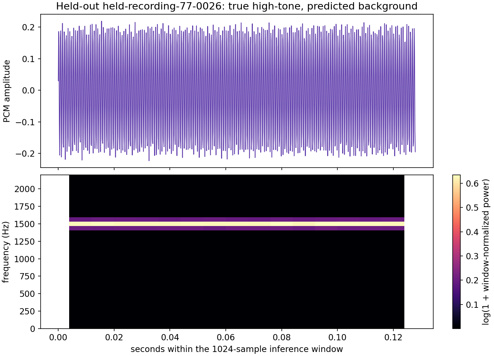
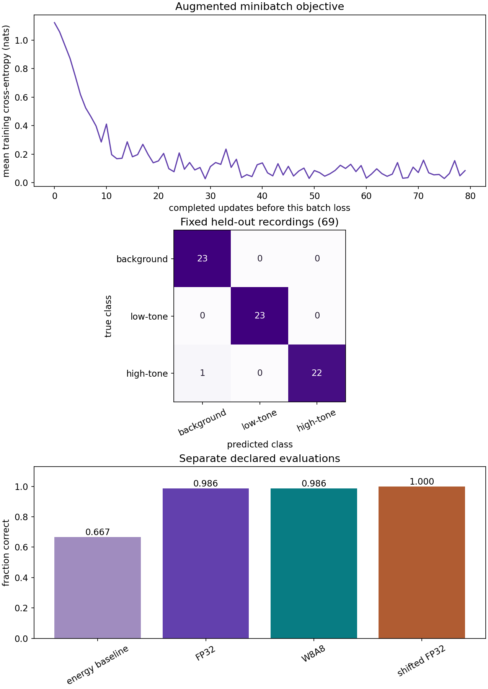

# Audio harness: from waveform to a verified inference artifact

A sound classifier needs more than a training loop. The sample rate changes the meaning of its frequency bins; a crop changes the observed event; a missing random key changes the next training example. This project carries those contracts through preprocessing, training, interrupted recovery, evaluation, integer arithmetic and an exported inference call.

The runnable task classifies **background, low tone and high tone** in short synthetic recordings. It is a teaching fixture with real waveform processing, not speech recognition or proof of accuracy on natural recordings. A supplied WAV ingestion path lets you bring recordings you have permission to use without silently changing their sample rate or splitting one recording across train and test.

## Start the connected experiment

Use the course CPU environment with requirements-cpu.txt. From the workspace root or the top folder of the project ZIP:

~~~sh
cp projects/audio-harness/starter/model.py projects/audio-harness/my_model.py
python3 projects/audio-harness/tests/check.py --implementation projects/audio-harness/my_model.py --stage 1
~~~

PowerShell uses Copy-Item instead of cp. Complete one stage at a time. After your own attempt, run the reference and regenerate its inspectable evidence:

~~~sh
python3 projects/audio-harness/tests/check.py --implementation solution --stage all
python3 projects/audio-harness/run.py --implementation solution
~~~

The second command writes plots, a report, a complete interrupted checkpoint and six exported computations under projects/audio-harness/outputs. It defaults to the public reference implementation; a passing reference run is verified separately from your independent work.

## Stage 1: make the waveform contract concrete

One inference example is a mono vector of \(1024\) finite samples at \(8000\) samples per second, representing \(0.128\) seconds. Amplitudes use floating-point PCM units between \(-1\) and \(1\). A batch adds a leading axis. The request rejects a wrong sample rate, extra channel axis, unsupported length, nonfinite values or a different preprocessing version. It does not silently resample, downmix, pad or clip.

Training recordings contain \(1280\) samples. Evaluation uses the fixed center crop from sample \(128\) through \(1151\). Training chooses a crop offset from \(0\) through \(256\), gain from \(0.8\) through \(1.15\), and small additive noise using explicitly owned keys.

The short-time Fourier transform uses a symmetric Hann window of length \(128\), hop \(64\), and no edge padding. There are \(15\) frames and \(65\) real-FFT frequency bins. Bin spacing is \(8000/128=62.5\) Hz. A \(500\) Hz pure tone falls at bin \(8\); a \(1500\) Hz tone falls at bin \(24\).

For each frame we compute squared FFT magnitude divided by the sum of squared window coefficients. We apply \(\log(1+\text{power})\) and average across frames, producing \(65\) features. Silence remains finite and maps to all-zero features before fitted normalization. This is window-normalized power, not a calibrated sound-pressure measurement and not a PSD in decibels per Hz. Averaging removes temporal order; this baseline cannot distinguish events that differ only in their time sequence.

~~~sh
python3 projects/audio-harness/tests/check.py --implementation projects/audio-harness/my_model.py --stage 1
~~~

**Verify:** independent NumPy framing/window/FFT values, a silence vector, a tone's frequency bin, malformed requests and an actual PCM WAV round trip. Keep recording IDs and recording groups separate from window IDs. Reject a group appearing in multiple splits before making windows.

## Read the actual waveform and spectrogram

The top plot shows PCM amplitude against seconds. The lower plot uses the same time axis; vertical position is frequency in Hz and color is \(\log(1+\text{window-normalized power})\). Frame centers begin after half a window, so the spectrogram does not fill the entire edge-to-edge waveform interval. The view shows frequencies through \(2200\) Hz; the computed features still include all bins through the \(4000\) Hz Nyquist limit.

This is held-recording-77-0026, the reference run's one held-out error. Its bright band is near \(1500\) Hz, consistent with its true high-tone label, yet the classifier predicts background. Extracting the correct dominant frequency does not guarantee a correct class decision. The example's RMS amplitude is about \(0.144\), compared with a median near \(0.384\) among high-tone training windows. That difference motivates a controlled gain-sensitivity experiment; it does not prove amplitude is the only cause of the error.

[Listen to this generated example](outputs/error-example.wav). It is a short synthetic tone, not a recording of a person.

## Stage 2: train and recover the complete state

Fit feature mean and standard deviation using only the \(96\) training recordings and fixed center crops. The standard deviation floor is \(0.05\), which prevents near-constant frequency bins from being divided by arbitrarily tiny values. Freeze those normalization arrays for validation, calibration and inference.

The model is a linear three-class classifier over normalized spectrum features. Its softmax cross-entropy is checked against an independent analytic gradient. Training uses momentum SGD and records loss **before** each update. Random crops, gain, noise and shuffled example order make successive minibatches different.

A checkpoint saves parameters, momentum arrays, fitted normalizer, PRNG state, shuffled order, iterator cursor, epoch, completed step, optimizer configuration and a fingerprint of recording arrays, labels, IDs, groups and sample rate. Array data use NPZ with pickle disabled; the manifest records the preprocessing and runtime contract and a checksum.

~~~sh
python3 projects/audio-harness/tests/check.py --implementation projects/audio-harness/my_model.py --stage 2
~~~

The public check interrupts after seven minibatches, starts a **fresh Python process**, restores and compares five subsequent updates across an epoch boundary. IDs, crop offsets, gains, feature bytes, losses, parameters and momentum must match uninterrupted execution. It deliberately rejects changed data and optimizer configuration.

Evaluate the frozen \(69\)-recording held-out split both at once and in uneven batches. Add loss sums and counts; do not average unequal batch means. Verify that evaluation leaves every training-state array unchanged. A second initialization and a separately generated frequency/noise-shifted set are checked without retuning the thresholds.

## Read the learning and error evidence

The first panel shows pre-update minibatch cross-entropy in nats. Its horizontal coordinate is the number of already completed updates. Loss falls rapidly from about \(1.1\) and then fluctuates with shuffled, augmented batches; those fluctuations do not represent a held-out validation curve.

The confusion matrix uses **true classes as rows** and **predicted classes as columns**. Each true class has \(23\) held-out recordings. Background and low-tone rows have \(23\) correct classifications each. The high-tone row has \(22\) correct examples and one background prediction, giving \(68/69\), about \(98.6\%\), overall accuracy.

The final panel compares explicitly different evaluations. An energy-only baseline recognizes quiet background but predicts low-tone for every audible example, so it obtains \(46/69\), about \(66.7\%\). The learned FP32 and W8A8 models both obtain \(68/69\) here. A separately seeded set with stronger frequency jitter and noise obtains \(72/72\). That last result does **not** prove that added noise improves the model: it uses different finite recordings and is not a paired causal comparison. No natural-audio performance claim follows from these fixture scores.

## Stage 3: calibrate precision and export the whole computation

Calibrate the maximum absolute **normalized feature** using the declared training recordings, never the held-out split. Keep a separate symmetric weight scale for each output class. The policies are:

| Boundary | FP32 | W8A32 | W8A8 |
| --- | --- | --- | --- |
| Waveform, STFT, log features, normalizer | FP32 | FP32 | FP32 |
| Stored classifier weights | FP32 | INT8 plus scales | INT8 plus scales |
| Classifier input features | FP32 | FP32 | Symmetric INT8 |
| Dot accumulation | FP32 | FP32 after weight dequantization | INT32 |
| Bias and output logits | FP32 | FP32 | FP32 after rescaling |

The W8A8 integer dot is executed and checked against an independent NumPy INT64 reference before converting back to FP32. This verifies the chosen integer arithmetic. It is verified separately from a native fast INT8 kernel or a target-device speedup. The activation quantization happens after spectral preprocessing; calling the entire FFT pipeline “fully integer” would be false.

The reference held-out maximum logit error is approximately \(0.0315\) for W8A32 and \(0.0468\) for W8A8. W8A8 clips one held-out normalized feature value beyond the training calibration range, yet its class decisions still match FP32 on this set. Matching accuracy does not mean matching scores, nor does one set establish robustness to larger shifts.

~~~sh
python3 projects/audio-harness/tests/check.py --implementation projects/audio-harness/my_model.py --stage 3
~~~

Export six real JAX computations: three policies at fixed batches one and four. Their input is raw decoded PCM. The artifact includes STFT, log features, the fitted normalizer and classifier parameters; inference cannot accidentally substitute a different feature implementation. The release manifest records contracts, class order, data/calibration hashes, parameter identity, signatures, precision scales and artifact checksums.

Reload from serialized bytes and compare changed inputs. A separate fresh process must load and execute the exported W8A8 path. Corrupt an artifact and require rejection. Keep the last verified release in a separate directory; rollback means reloading that known-good release and replaying golden inputs, not ignoring a failed checksum.

## Stage 4: measure the boundary the code actually implements

~~~sh
python3 projects/audio-harness/tests/check.py --implementation projects/audio-harness/my_model.py --stage 4
~~~

The timer includes decoded PCM validation, placement, the exported STFT/normalizer/classifier, completion and host output construction. It excludes audio capture, the time needed to accumulate a \(128\)-millisecond window, file decoding, networking and a server queue. A computation shorter than the window duration is not an end-to-end microphone latency of that duration.

The reference report retains a first request plus thirty warmed requests per policy. Read current p50 and p95 values from outputs/report.json instead of assuming another host will reproduce them. The public check uses twelve observations per batch for speed; neither sample count establishes production tail latency or thermal behavior.

Artifact file sizes and parameter-storage counts are recorded separately. INT8 weights plus scales occupy fewer parameter bytes in this tiny model, but serialized graph overhead and floating preprocessing remain. Peak runtime memory is explicitly unmeasured.

## Bring licensed recordings through the same boundary

load_wav_manifest accepts an explicit JSON list. Each row contains:

~~~json
{
  "id": "recording-001",
  "file": "clips/recording-001.wav",
  "label": 1,
  "split": "train",
  "group": "recorder-session-12",
  "license": "Name and terms of the permission covering this recording",
  "source": "Original collection URL or owned-recording provenance",
  "sha256": "SHA-256 of the original WAV bytes",
  "offset_samples": 0
}
~~~

Use PCM16 mono WAV at exactly \(8000\) Hz, with at least \(1280\) samples after the declared offset. The loader checks file hashes, recording identities, class IDs and cross-split group leakage. It does not infer that a license string grants permission; you must obtain and preserve the actual rights and attribution. The implementation is exercised with a generated WAV fixture, not with an external corpus.

If a collection uses another sample rate or channels, perform a separately specified conversion with anti-alias filtering, declared downmix rules and tests. Record original and converted hashes and converter versions. Do not relabel a \(16000\) Hz file as \(8000\) Hz: that halves the interpreted frequencies and doubles duration. Split by speaker, recorder/session or source before overlapping crops. Freeze a final test split and predeclare metrics. Change the class taxonomy explicitly before training natural sound events; a tone classifier is not a general sound recognizer.

## Edge extension and evidence review

Choose the actual target device, runtime and supported operator set before conversion. FFT, logarithms and normalization may require floating fallback or separate host preprocessing; inspect partitions and compare raw golden waveforms through the complete device path. If a converter lacks an FFT operator, a dense-only export does not preserve this artifact's boundary. Measure capture/buffering, sustained compute, memory, energy and thermal behavior on the named device.

Complete [the synthesis tasks](ASSESSMENT.md) and compare your reasoning with [reviewer notes](reviewer.md). Public fixture checks, your own report, human review and target-device evidence remain separate.
