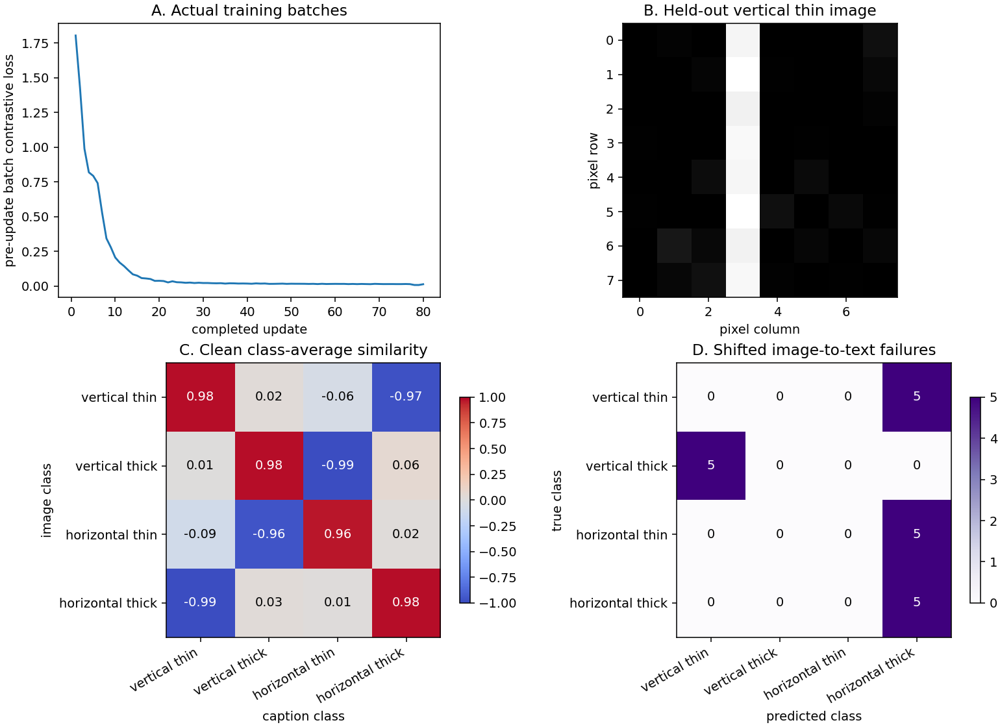

# Build and audit an image–text retrieval system

Given an image, retrieve a matching caption. Given a caption, retrieve a matching image. This project connects two encoders, a shared embedding space, complete training recovery, precision policies, exported inference and a measured release decision.

The teaching dataset contains noisy eight-by-eight bars and four literal concepts: vertical/horizontal and thin/thick. These are image arrays paired with text, but this is **not natural-language understanding**. The small fixture makes alignment, false negatives and deployment contracts inspectable. A clean fixture score does not establish retrieval quality on photographs or unrestricted captions.

## Start with one question

If two captions mean the same thing, should a contrastive loss force their images apart? Our answer is no. Every image and caption with the same declared semantic class is a positive. You will verify this rule independently, then inspect a failure that survives perfect scores on the clean fixture.

Prepare the course Python environment from `requirements-cpu.txt`. Work from the extracted project bundle’s top folder or the repository root:

```sh
# Copy the starter template into your editable workspace file
cp projects/cross-modal-harness/starter/model.py projects/cross-modal-harness/my_model.py
python3 projects/cross-modal-harness/tests/check.py --implementation projects/cross-modal-harness/my_model.py --stage 1
```

PowerShell:

```powershell
# Copy the starter template into your editable workspace file
Copy-Item projects/cross-modal-harness/starter/model.py projects/cross-modal-harness/my_model.py
```

Implement the marked functions one stage at a time. The supplied data fixture, initialization and file/export scaffolding remain visible. Read that scaffolding too: passing a stage is not proof that you understand its assumptions. Replace `--stage 1` with successive numbers through `5`; later stages include earlier checks. The public reference command is:

```sh
# Run run command in terminal using the course Python environment
python3 projects/cross-modal-harness/tests/check.py --implementation solution --stage all
python3 projects/cross-modal-harness/examples/figures.py
```

The second command runs the reference, exports all three precision policies and regenerates the figures and measurement receipt. It does not execute your unfinished starter. To investigate your solution, adapt the example import explicitly and record the file you ran.

## Stage 1 — Pair meaning and inputs

An image request is a nonempty `float32` array with shape `(batch, 8, 8)` and finite values in `[0, 1]`. We flatten spatial coordinates in row-major order; no resize, crop, color conversion or normalization is hidden in the runtime. A caption contains exactly one orientation and one thickness, in either order. The vocabulary order is recorded in the artifact, so `thin vertical` becomes `[1, 0, 1, 0]`.

Implement `image_features` and `text_features`. Predict the flattened location of one bright pixel before running. Reject a missing concept, unknown token, repeated word, wrong dtype or unsupported image shape. Silently assigning an unknown caption to zero would give a plausible vector with no defined meaning.

`check_splits` rejects shared pair IDs, and the local ingestion path rejects shared source groups. IDs alone cannot detect two copies of the same photograph under different names. A real dataset audit must also inspect source grouping and duplicates before selecting splits.

Keep a table with pair ID, source group, split, image shape and caption. Change one caption without changing its image and explain why a shape check cannot detect the resulting semantic error.

## Stage 2 — A shared space and an independently checked objective

The image encoder multiplies 64 pixel features by a matrix with four output columns. The text encoder maps four concept indicators into the same four-dimensional space. Each result is divided by its Euclidean norm, with a small denominator floor for a zero vector. Floor the squared norm before taking its square root; flooring the norm afterward leaves an undefined derivative at zero. The public check includes finite gradients for zero images and zero embeddings. A dot product then measures directional agreement. The floor makes a zero vector finite; it does not make it a meaningful embedding.

Let `scores` be the image-by-caption dot-product matrix divided by temperature `0.2`. For each query, the objective subtracts the log sum of positive-pair exponentials from the log sum over every candidate. Compute this for image queries and caption queries, then average the two directions. The checker implements the same mathematical definition independently in NumPy and checks several parameter derivatives by finite differences.

Multiple observations have the same caption. Treating only the diagonal as positive would incorrectly penalize a different image of the same class. Duplicate the complete batch: the chosen multi-positive objective stays unchanged because both positive and total mass double. This is a concrete test of what “positive” means, not a general claim that all contrastive losses are duplication-invariant.

Implement `objective`. Before optimizing, inspect one row of scores and its positive mask. Keep the loss reference and changed-parameter gradient comparisons. A falling loss alone would not catch a shared mask error.

## Stage 3 — Train, evaluate and recover across an epoch

The reference trains two projection matrices with momentum. The dataset order is shuffled explicitly. Training state contains both parameter matrices, both momentum matrices, a random key, the current permutation, its cursor, the completed step, batch size and data hash. The checkpoint also records optimizer/objective settings and the implementation hash; a changed learning rate or source must not silently resume an old run. Each transition reports a pre-update batch loss and the exact pair IDs it used.

Implement `transition` and `load_checkpoint`. Save after two batches and restore in a fresh process. Compare the next five events and every state value with uninterrupted execution. This crosses epoch boundaries, so a saved cursor without the future shuffle key is insufficient. The JSON checkpoint contains only numeric arrays and explicit metadata; its checksum detects accidental changes, not an authenticated producer.

Evaluate both retrieval directions on the fixed held-out seed. A successful retrieval means the retrieved candidate has the correct semantic class; several candidates can be equally valid. Do not report unique-pair identity accuracy for this fixture. The held-out set shares the same four concepts and geometric generation rule as training; its independent noise seed is a limited generalization check.

Now shift the bars one pixel. The reference’s image-to-text count drops from **20/20 to 5/20**. Do not tune the model against this recorded test and then call it untouched. Create a new development split if you want to explore translation augmentation, pooling or a convolutional encoder. The saved report also repeats clean and shifted comparisons within each of seeds seven and nine: both paired controls give 20/20 clean and 5/20 shifted, separating the geometry change from changing the noise seed.

## Read the actual figure



- **A: training.** Horizontal position is the completed update; height is the loss computed before that update on the selected batch. The reference falls from about `1.8045` to `0.0145`. Adjacent points can involve different examples, so the curve is not a full-dataset evaluation curve.
- **B: inputs.** Both axes are pixel coordinates. The bright vertical strip is one actual held-out thin-bar image. Gray background values are generated noise; the image has not been selected from a natural-image dataset.
- **C: clean similarity.** Rows are image classes and columns are caption classes. Each entry averages cosine similarity over the corresponding pairs. Diagonal values are approximately `0.983, 0.983, 0.962, 0.980`; large matching-class values explain successful clean retrieval. Off-diagonal values near zero or minus one describe learned geometry, not calibrated probabilities.
- **D: failure.** Rows are true shifted-image classes and columns are the retrieved classes. Counts in each row sum to five. The first row sends all five vertical-thin images to horizontal-thick captions. Only the final row retains its five correct matches, giving 5/20 overall. A fixed linear projection of pixel positions has not learned translation invariance.

Compare C and D carefully: C shows similarity, whereas D shows counts. Their color bars have different units. Neither proves understanding of arbitrary text or real-world images. The data and source hashes behind these figures are in `outputs/evidence.json`.

## Stage 4 — Export both branches and audit precision

Implement `encoder`. The project supports three explicit policies:

| Policy | Weight representation in computation | Activation treatment | Accumulation |
| --- | --- | --- | --- |
| FP32 | Float32 matrices | Float32 features | Float32 |
| W8A32 | Symmetric per-output-channel INT8 weights dequantized for the dot product | Float32 | Float32 |
| W8A8 | Symmetric per-output-channel INT8 weights | Symmetric INT8 inputs with recorded calibration scales | Explicit INT32 product and sum, then float32 normalization |

Zero weight columns need a positive fallback scale. Calibrate from training inputs, retain that dataset hash and keep held-out inputs out of calibration. Pixel and concept features are bounded in this project; a production embedding model has many more activation distributions to observe. There is no attention or autoregressive generation in this architecture, so it has **no KV cache**. Cache precision belongs to the text harness, not to an invented switch here.

The widest integer sum has 64 terms. The conservative magnitude bound `64 * 127**2` fits within signed INT32. The checker uses INT64 NumPy products as an independent reference for the integer calculation. L2 normalization remains float32. This is explicit quantized arithmetic on CPU, not evidence of a native INT8 accelerator kernel.

Both branches are serialized with `jax.export` for batches one and eight. The artifact records vocabulary, image contract, calibration provenance, parameter hash and checksums for all four exported computations. Fresh-process loading verifies predictions without retraining.

In the recorded run, all policies retrieve 20/20 clean examples. Maximum score changes relative to the float source are about `0.00439` for W8A32 and `0.00616` for W8A8. Their complete artifacts are **larger** here: approximately 10.6, 11.0 and 13.4 kB for FP32, W8A32 and W8A8. At this tiny scale, quantization machinery and metadata outweigh the matrix payload. Read actual bytes and timings rather than assuming lower precision is smaller or faster.

## Stage 5 — Requests, measured selection and rollback

Implement `infer` and `activate`. Each request supplies exactly one modality. A missing-modality query is valid only when the other modality is present; supplying neither or both is rejected by this embedding API. Retrieval combines image and caption embeddings outside that request boundary. The exported signatures support batches one and eight, so unsupported batch sizes must fail clearly.

Measure at least 30 warmed requests. The timer begins with an existing NumPy image array and includes validation, placement, exported execution, completion and conversion back to a host array. It excludes file decoding, networking, queueing and artifact loading. The full raw samples, median and sample p95 are recorded. Thirty observations cannot establish a production tail-latency guarantee.

The local release gate computes retrieval on eight declared labeled examples before changing `ACTIVE.json`. A zero-weight candidate is rejected based on its actual outputs. Try selecting the quantized release, then rolling back to FP32; the failed candidate must leave the previous pointer unchanged. Local temporary-file replacement is the teaching publication boundary, not a claim about object-store atomicity or machine-power-loss durability.

Corrupt one exported file in a disposable copy and confirm loading fails before inference. Do not repair a checksum merely to accept unknown bytes. Keep a runbook naming the accepted artifact and the quality, contract and timing evidence behind its selection.

## Bring local paired data carefully

`load_pairs(path, split)` reads an explicit manifest and local `.npy` image arrays with `allow_pickle=False`. Images must already satisfy the exact grayscale/shape/range contract. Keep originals and record how they were converted; this loader does not claim to decode every image format.

```json
{
  "provenance": "How these images were collected and converted",
  "license": "The rights or permission allowing this use",
  "records": [
    {"id": "pair-a", "group": "source-a", "split": "train", "image": "a.npy", "caption": "vertical thin"},
    {"id": "pair-b", "group": "source-b", "split": "held", "image": "b.npy", "caption": "horizontal thick"}
  ]
}
```

The public test writes actual local files and exercises this loader, including group leakage rejection. No external dataset has been downloaded or evaluated. Unrestricted captions require a new tokenizer and text encoder, new positive-pair rules, new exports and new evaluation—not simply relaxing validation in the current model.

## Framework and target-runtime extension

Use deployment-01 to compare a matching Keras/TensorFlow or PyTorch pair of linear encoders against this NumPy/JAX reference. Copy the pixel order, vocabulary order, normalization epsilon and matrix orientation explicitly. A serialized JAX computation is not itself a Keras model or a LiteRT artifact. No cross-framework conversion has been executed in this project.

For GPU, TPU or edge deployment, start from the framework and conversion path that actually supports your chosen operations and precision. The included exported artifacts target CPU. Re-export and rerun normal, zero-vector, malformed-input, changed-batch and quantization checks in the target environment before measuring device latency. Use the TPU bridge for placement verification and the edge course for target-device qualification. The current receipt establishes CPU training/export/inference only.

## Synthesis and evidence

Keep the pair manifest, independent objective/gradient checks, full fresh-process recovery comparison, both retrieval directions, the shifted failure, calibration hashes, exported parity, raw request samples and failed-release/rollback result.

For an independent review, change the noise seed and geometric shift, compare a fixed-pixel encoder with a translation-aware alternative, and decide which precision policy to deploy under a declared quality budget. Derive the multi-positive loss for one four-pair example by hand. Explain why a failed shift test changes your conclusion even if both the clean metric and public stage checks pass.
