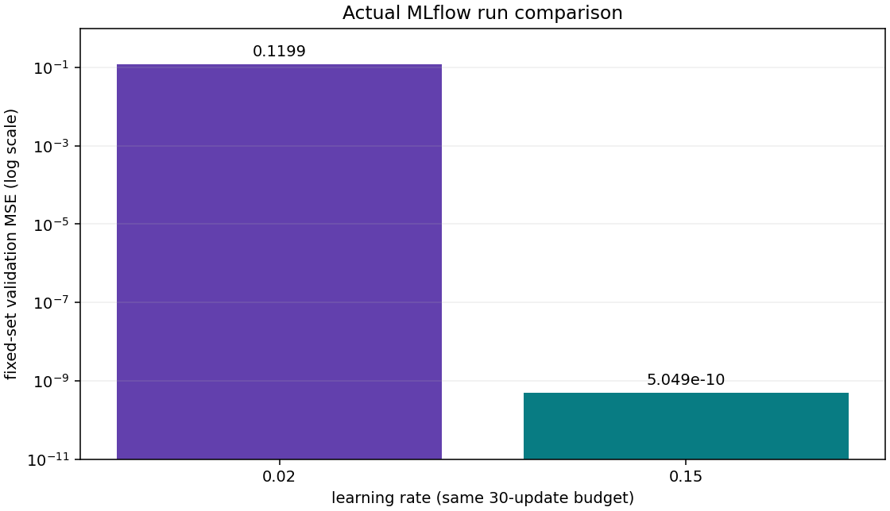

# Ship a tracked and containerized model release

A trained model is one part of a working system. This project connects a real JAX training run to MLflow, a versioned model artifact, a containerized service and an explicit release decision. You will also build an evaluation contract for a small text application and explain which operational responsibilities remain outside a local demo.

Start after experiment tracking, containerization and the three MLOps/LLMOps/ModelOps lessons listed in the project workspace. The [workload operations project](../workload-operations/README.md) supplies process failure and recovery practice; this project adds tracking, application evaluation and release ownership. Use the [text harness](../text-harness/README.md) when you need actual Transformer generation and cache measurements. The LLM evaluation here deliberately replays controlled answers so you can debug the evaluator without paying for a model API.

## Prepare your implementation

From the repository root or extracted workspace, install `requirements-cpu.txt` in your course environment. MLflow 3.16.1 is included. The reference was executed with Python 3.14.3 and JAX 0.9.2. A shared MLflow server, cloud account and Docker engine are not required for the four CPU stages.

```sh
cp projects/engineering-release/starter/engineering.py projects/engineering-release/my_engineering.py
python3 projects/engineering-release/tests/check.py --implementation projects/engineering-release/my_engineering.py --stage 1
```

On PowerShell replace `cp` with `Copy-Item`. The untouched starter fails at the first missing function. Complete `validate_rows`, `gate_metrics`, `llm_case` and `verify_release`, advancing through stages 1–3. Stage 4 integrates these policies with a real tracked model and the provided serving adapter; it is a guided integration lab, not another hidden learner implementation. Later stages rerun earlier checks.

```sh
python3 projects/engineering-release/tests/check.py --implementation solution --stage all
```

This checks the reference. Running it does not demonstrate that your own implementation passes.

## Stage 1 — Identify the data and evaluate the right population

Implement `validate_rows`. Each row carries a stable ID, source group, split, scalar feature and target. Reject empty datasets, duplicate IDs, unknown splits, malformed schema and nonfinite values. Keep source groups in one split: two distinct rows from one source can leak information even if their row IDs differ. Return a hash of the accepted manifest using sorted-key canonical JSON. The checker independently computes the expected digest and deliberately changes group and numerical fields.

Implement `gate_metrics`. Its inputs are squared errors, aligned slice labels and a nonnegative limit. Return counts and means for every required slice and for the full set. Missing slices do not pass. Nor do NaN or infinite metrics. The overall mean is count-weighted:

\[
\operatorname{MSE}_{\rm all}=\frac{\sum_s n_s\operatorname{MSE}_s}{\sum_s n_s}.
\]

With nine low-slice errors of \(0.01\) and one high-slice error of \(4\), the aggregate is \(0.409\). A limit of \(0.5\) would accept the aggregate, but the required high slice fails. Averaging the two slice means equally gives \(2.005\), which describes a different population. The checker changes counts and includes an absent slice to expose shortcuts.

**Transfer:** retain both slice means but reverse the population counts. Explain why aggregate MSE changes without any change in within-slice quality. Then propose minimum counts and uncertainty review for a real application. This small exercise supplies neither a statistically justified production threshold nor a fairness audit.

## Stage 2 — Evaluate application behavior, not only model loss

Implement `llm_case`. A response must have answer text, a list of citation IDs and a boolean abstention field. For the intentionally simple answerable fixtures, text must equal the expected answer and include the required document ID. Unknown citations fail. Unsupported cases must return an empty answer, no citations and true abstention.

This is an exact regression contract. It does not infer whether an arbitrary document entails a natural-language claim, detect every prompt injection or establish that a live language model is safe. Nine answerable cases plus one unsupported case demonstrate why a 90% average can conceal failure on every critical case. Extend a real suite with human-reviewed questions, retrieval failures, long context, languages, tool errors and provider failures; hold back cases you did not use to tune prompts.

Version the complete application: model/tokenizer, prompt, retrieved corpus/index, tool schemas, decoding settings, evaluator and runtime. An unchanged weight file can behave differently after any of these change. Model/tracing tools organize the evidence; tool authorization and sensitive-data handling belong in application code and access controls outside the model.

**Transfer:** submit an answer that sets abstention to true but still contains an unsupported claim. Then submit a citation from an older index. Both should fail the declared contract. Explain which further checks would be needed for paraphrased answers and claim-level citation support.

## Stage 3 — Bind review to an immutable release

Implement `verify_release`. The bundle names model, data and evaluation hashes, an image identity, owner, target and passing quality result. Review is bound to the hash of that whole bundle and a valid time interval. Any change requires a review that names the new bundle. The boundary is inclusive at approval time and exclusive at expiry.

The supplied `activate` validates before replacing the active pointer. Failed attempts must preserve the previous file byte-for-byte. The checker rejects changed model bytes, expired/not-yet-valid decisions, target mismatch and a failed quality gate. It then selects a second valid bundle and rolls back by revalidating the first.

The fixture reviewer is a string supplied by the test; it is **not authenticated identity**. A checksum establishes byte equality, not authority. A production implementation needs trusted reviewer identity, authorization, protected evaluation evidence and an audit log. Likewise, atomic rename supports one local writer; it is not concurrency control for several deployment controllers. Use a transactional or compare-and-swap mechanism for competing writers.

The format-valid image digest in the CPU policy fixtures is explicitly synthetic. Use the actual `image_id` from the separate container receipt for a real local release record. Registry aliases select versions; they do not deploy or retire serving instances. Retirement needs an owner, traffic removal, artifact/access decisions and evidence retention.

## Stage 4 — Track, retrieve, register and serve a real model

The included `mlflow_lab.py` performs the connected experiment in a new output directory:

```sh
python3 projects/engineering-release/mlflow_lab.py --output ./engineering-run
```

Use a fresh folder for another independent run. The lab creates a SQLite tracking/registry database with an explicit artifact directory, trains two JAX models for thirty updates, logs the learning rate and every post-update training MSE, records code/data identity, and evaluates both on the same four held-out validation rows. These are validation results used for selection, not an untouched final test.

Both models are logged with a pyfunc signature and input example, registered as versions and retrieved using an immutable version after resolving the champion alias. The adapter reads the logged coefficient artifact; predictions at changed inputs agree with independent scalar arithmetic. The lab leaves the champion unchanged when a candidate fails its illustrative quality limit. The registry itself does not enforce that limit: your release code must do so.

The same lab registers and reloads a prompt version, then records a real trace with retrieval and answer-replay child spans. The trace has three spans and contains public fixture IDs/summary outputs. It makes no paid call and does not pretend that replay is live model inference. Real application tracing needs explicit redaction, access and retention decisions before storing user content.

The final project checker reads the selected artifact in another Python process, checks singleton/changed inputs and rejects invalid requests. It uses the actual selected model's slice errors and model hash in the local release contract. Model selection, packaging and approval remain separate observable steps.



The horizontal axis identifies the learning rate. The vertical axis is fixed-set validation MSE on a logarithmic scale. Recorded errors are approximately \(0.11994\) and \(5.05\times10^{-10}\). The rate \(0.15\) run fits this exact synthetic affine relationship much more closely in the same thirty updates. The large gap is expected for this noiseless toy; it does not demonstrate real-data generalization or an optimal learning rate. The values are read from the actual MLflow receipt, not drawn as a hypothetical curve.

The database and serialized pyfunc objects stay in your generated output directory. The downloadable project includes compact observed receipts, not a live tracking server. Treat serialized Python models as executable artifacts and load only artifacts from a trusted source. In a team, use authenticated shared storage, tested backups and a deployment process that resolves immutable model versions.

## Container qualification — run the actual deployment boundary

Docker is a separate local dependency. The container uses a pinned Python base digest and only the stdlib inference service; it does not copy the training environment. `.dockerignore` allows only the Dockerfile and service source into the context. The model is mounted read-only and checked against its SHA-256 digest at startup. The service rejects malformed, nonfinite and oversized batches.

```sh
python3 projects/engineering-release/container_check.py --model ./engineering-run/model.json --output ./container-report.json
```

The command builds `jaxpathways-engineering:course`, runs CLI checks and starts a short-lived network-isolated container. It publishes no host port. An internal HTTP probe checks `/ready`, valid `/predict` requests, status 400 for an invalid request and UID 10001. It rejects a wrong model digest, records image/model/source identities, and removes only its own test container. The local image remains available for inspection and reuse.

The recorded qualification ran on Docker 29.3.1 with a Linux/arm64 image. The observed predictions for \([-0.37,0,2.2]\) were approximately \([0.259977,0.999977,5.399977]\). The small bias error matches the trained artifact. Readiness succeeded, invalid HTTP input returned 400, and wrong-digest loading failed. This verifies one local CPU deployment boundary; it does not qualify GPU drivers, an edge device, concurrency, a public service or cloud rollout.

`HEALTHCHECK` measures readiness inside the image, but Docker health state alone does not implement automatic replacement or rollout. Production serving also needs resource limits, overload handling, timeouts, graceful shutdown, authentication and a concurrency-capable server. Test those properties with the chosen runtime and request distribution before making an SLO claim.

## Put the checks in CI and assign the operational work

`ci.sh` is a portable example for a prepared Linux/macOS runner with the course dependencies and Docker. Run it from the workspace root. It runs policy tests, tracked training and the isolated container check in a temporary directory. It prints the final receipt before cleanup; adapt your CI artifact-upload step to retain evidence. It never pushes images or uses cloud credentials.

Use these responsibilities as a checklist for a real project:

| Work | Artifact to keep | Failure to rehearse |
| --- | --- | --- |
| Data engineering | schema, source/split manifest, preprocessing version | cross-split group leakage or malformed input |
| Experiment tracking | MLflow run, code/data identity, metric definition | wrong tracking URI or incomparable metric |
| Packaging | dependency/base-image pins, artifact and image digests | changed model bytes or missing mount |
| MLOps delivery | frozen evaluation, slice counts, CI result | aggregate passes while critical slice fails |
| LLMOps | prompt/retrieval/tool versions, cases, redacted traces | unsupported answer, invalid tool or provider timeout |
| ModelOps | owner, intended use, approved bundle, retention plan | stale approval or incompatible rollback |
| Runtime operations | ready/live/startup probes, workload and incident report | loaded version differs from selected version |

For image work, preserve decoder and preprocessing contracts. For audio, include sample rate, windowing and feature extraction. For text, include tokenizer, prompt and KV-cache policies. For cross-modal work, preserve both encoders and paired-data versions. Record weight, activation and accumulation precision in the release; a different quantized artifact requires parity and task-quality evaluation again.

## Keep your evidence

Retain your implementation, commands and actual outputs; a failed case and its diagnosis; MLflow run/model/prompt identifiers; model/image/evaluation identities; the container report when executed; and a written release or rejection decision. Explain what the figures and checks establish, and which production qualifications remain unperformed. Public reference checks and reviewer approval are distinct.

References: [MLflow tracking](https://mlflow.org/docs/latest/ml/tracking/quickstart/), [model registry](https://mlflow.org/docs/latest/ml/model-registry/workflow/), [prompt registry](https://mlflow.org/docs/latest/genai/prompt-registry/index.html), [tracing](https://mlflow.org/docs/latest/genai/tracing/quickstart/), [Docker build practices](https://docs.docker.com/build/building/best-practices/), and [Kubernetes probe boundaries](https://kubernetes.io/docs/concepts/configuration/liveness-readiness-startup-probes/).
