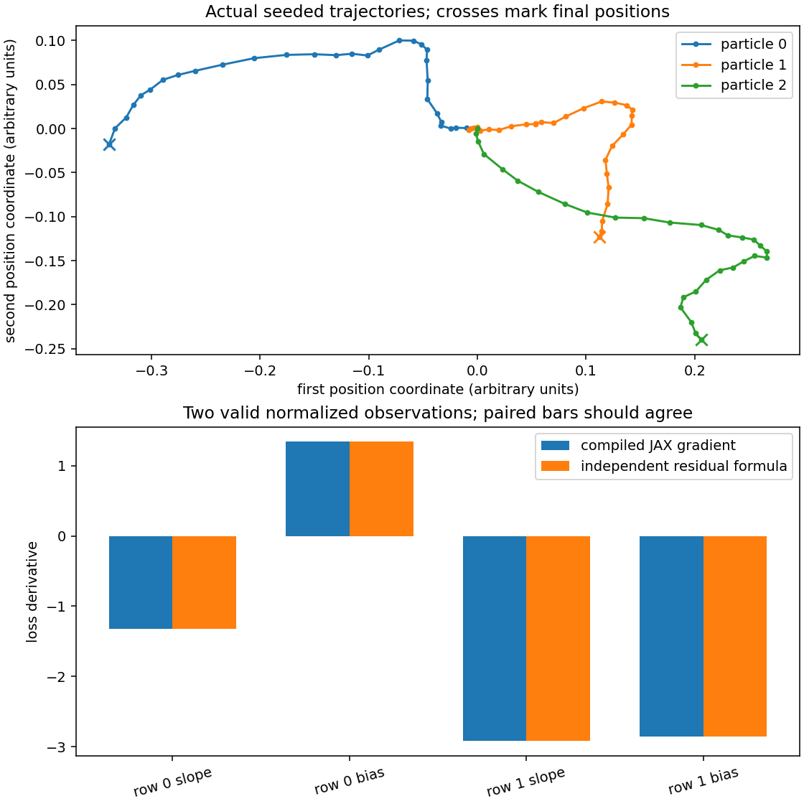

# Connect arrays, transformations and explicit state

This project supplies the integration work for the first four phases. Start with a completed array and its environment report. Process observations without losing their meaning, compile a batch of independently checked gradients, then replay a small stochastic simulation in a fresh process. The regression project follows in Math & optimization.

Use the course environment from `requirements-cpu.txt`. From the extracted bundle’s top folder or the repository root:

```sh
# Copy the starter template into your editable workspace file
cp projects/foundation-toolkit/starter/toolkit.py projects/foundation-toolkit/my_toolkit.py
python3 projects/foundation-toolkit/tests/check.py --implementation projects/foundation-toolkit/my_toolkit.py --stage 1
```

On PowerShell use `Copy-Item` for the copy command. Implement the four marked functions. Each successive stage includes all earlier checks. Save your code, the command, observed output and an explanation of a failure before moving on.

```sh
# Run run command in terminal using the course Python environment
python3 projects/foundation-toolkit/tests/check.py --implementation solution --stage all
python3 projects/foundation-toolkit/run.py
```

These commands execute the instructor reference. The second writes actual figures and a report bound to its source; it does not assess your starter.

## Stage 1 — What ran, and where?

Implement `environment_report`. A two-by-three matrix contains the numbers zero through five. Predict both row sums before running: the first is three, the second twelve. Compile the reduction, wait for completion and record the actual output device, dtype, shapes and package versions.

A package import does not establish that an operation ran on an accelerator. Record the array’s device after completion, not the device you hoped to use. This project runs on CPU; the TPU bridge supplies a separate target check.

**Change it:** replace the row reduction with a column reduction in a separate experiment. Derive `[3, 5, 7]` and explain why its shape differs. Keep the project’s specified row-report contract unchanged for the public checker.

## Stage 2 — Which rows count as observations?

Implement `normalize_columns`. Each row is an observation, each column a feature, and one boolean per row states whether it is valid. Invalid rows must enter neither the sum nor the count. After centering and scaling, set invalid output rows to zero without deleting them. The unchanged shape preserves alignment with labels and IDs.

For valid rows `[1, 4]` and `[3, 4]`, the means are `[2, 4]`. The first column’s population variance is one; the second is zero. Use a scale of one for a constant column so both of its centered values remain zero. A padded `[99, 99]` row with a false mask must not alter either statistic.

The public checks include a singleton, a constant column, a changed matrix shape and an all-false mask. Reject the last case: there is no defined observed mean. They also verify the input array was not modified.

**Change it:** append several different invalid rows and predict which outputs may change. The valid-row results, fitted statistics and count should stay the same. This is an invariance check, not merely a shape assertion.

## Stage 3 — What does each transformation do?

The model has a slope and bias. Its per-example loss is half the squared residual plus a small squared-weight penalty. `grad` returns the two parameter sensitivities for one example. `vmap` maps over observations and targets while sharing the parameters. `jit` compiles this batched function; it does not define a different objective.

Implement `batch_gradients`. If `r` is the residual, the slope derivative is `r*x + 0.2*w[0]`, and the bias derivative is `r + 0.2*w[1]`. The host reference computes these expressions independently of JAX autodiff. The output has one row per example and two columns for parameter derivatives. Averaging rows gives the derivative of the mean objective, with the penalty counted once in that mean.

A target with an extra trailing axis can broadcast into a larger residual matrix. Reject it before compilation. The checker changes both parameters and batch size, including a singleton, to catch hard-coded answers.

**Change it:** halve the residual term’s coefficient in a separate function, derive its new gradient and compare. The regularization derivative should not change unless its coefficient changes too.

## Stage 4 — What must survive an interruption?

Implement `transition`. Every particle has a two-dimensional position and velocity. Split the saved random key, draw one noise array, update velocity using its old value, and update position using the **new** velocity. Carry the new key and increment the step counter. `lax.scan` then repeats this same transition and records the positions.

This is a dimensionless teaching process, not a calibrated physical model. Update order is still part of its mathematical definition. Using old velocity for position would define a different process even if the result looked like a plausible random trajectory.

The checker independently computes one transition using NumPy arithmetic with the same sampled noise. It then compares a twelve-step run with five steps followed by a saved checkpoint and seven steps in a new interpreter. Parameters here are positions and velocities; the key is just as necessary for replay. Three seeds/particle counts and unchanged-input checks expose accidental mutation and fixed-shape assumptions.

The supplied loader validates stored NumPy dtypes **before** conversion to JAX. Otherwise a malformed 64-bit step counter could silently downcast or wrap into a valid-looking 32-bit value. Test malformed shapes, counter dtypes and random-key dtypes before accepting stored state.

**Change it:** restore positions and velocities but deliberately replace the key in a disposable state. Predict whether the future will match. Do not describe this as a checkpoint failure if the experiment intentionally changed the stochastic state.

## Read the connected reference



The upper panel shows three actual trajectories in the two position coordinates. Dots follow successive updates and crosses mark the final positions. Both axes use arbitrary units. Paths start at the origin but differ because each particle receives different noise values. Replaying a saved key and state repeats these paths; it does not mean all particles should share a path.

For the lower panel, take the final particle positions as observations. The first two particles are valid; the third is deliberately masked. Normalizing the first coordinate produces approximately minus one and plus one. Targets are defined by `2*x + 1` for this separate gradient check. With slope minus `0.1` and bias `0.2`, the derivative pairs are approximately `[-1.32, 1.34]` and `[-2.92, -2.86]`.

Paired bars compare compiled JAX derivatives with the independently calculated residual formulas. They should agree within each pair. The slope and bias bars need not agree with one another because they measure different sensitivities. This plot is not a training curve or a performance benchmark.

## What to keep

Keep the environment report, hand-derived row sums, masked statistics, per-example derivative calculations, malformed-input diagnoses and a fresh-process continuation comparison. The figure receipt identifies the exact reference source and environment. Your own evidence should identify your implementation and modifications.

The first four phases use stages one through four respectively. Completing the public reference checks does not prove an independent learner solution or award competency; explain the changed-condition exercises and have someone review the reasoning. Next, use the regression capstone to connect a checked derivative to repeated parameter fitting.
