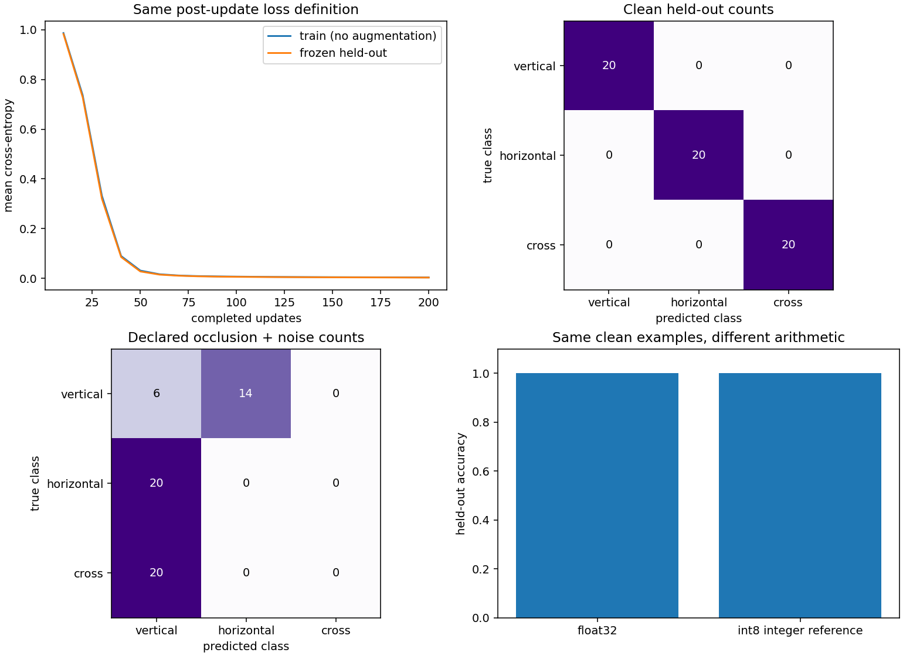
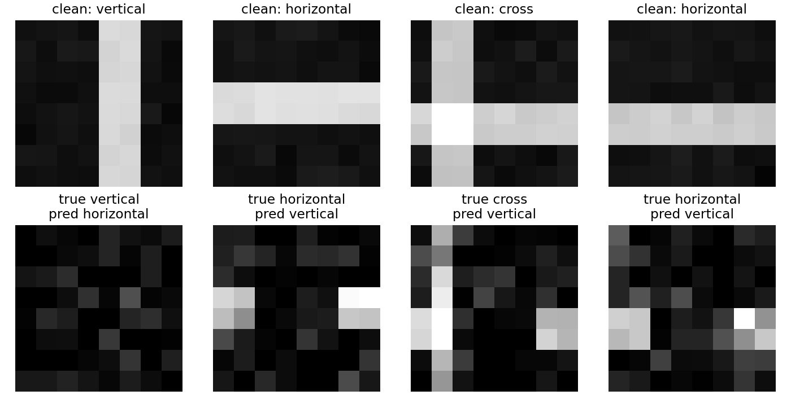

# Image harness: pixels, learning, recovery and exported inference

Build one connected image system whose behavior remains inspectable from raw pixels to a reloaded inference artifact. The model is a real small CNN trained on real image arrays. The images themselves are an explicitly synthetic teaching fixture: vertical bars, horizontal bars and crosses. They make shape, recovery and precision failures easy to inspect; they do not establish performance on photographs or a vision benchmark.

The project joins eight stages. Each stage produces evidence consumed by the next, rather than an isolated notebook with unrelated weights. The instructor reference trains an 81-parameter CNN, recovers it in a new process, evaluates fixed clean/corrupted sets, calibrates integer arithmetic, serializes actual JAX computations and measures the reloaded CPU inference adapter.

## Start with your own implementation

Use the pinned `requirements-cpu.txt` from the extracted project or course workspace. Pillow, used for local image decoding, is installed with the pinned plotting stack; record its version when exercising external files.

```sh
# Run run command in terminal using the course Python environment
python3 -m pip install -r requirements-cpu.txt
cp projects/image-harness/starter/model.py projects/image-harness/my_model.py
python3 projects/image-harness/tests/check.py --stage 1 --implementation projects/image-harness/my_model.py
```

PowerShell preparation:

```powershell
# Copy the starter template into your editable workspace file
Copy-Item projects/image-harness/starter/model.py projects/image-harness/my_model.py
```

The deterministic dataset and configuration helpers are supplied. Implement one lifecycle stage at a time in `my_model.py`; tests accept its path. Reference code remains separate in `solution/model.py`. The public checker is a diagnostic tool, not a hidden exam or a credential.

To inspect all instructor executions and regenerate the figures:

```sh
# Run run command in terminal using the course Python environment
python3 projects/image-harness/tests/check.py --stage 8 --implementation solution --figures --report projects/image-harness/validation.json
```

## 1. Give pixels an explicit meaning

One raw image has height, width and one grayscale or three RGB channels. The adapter accepts a nonempty rank-four batch with declared `NHWC` or `NCHW` layout. Declare either uint8 values from zero to 255 or finite floating values in the unit interval; do not infer range from one image’s maximum.

Resize to eight by eight with the documented floor-index nearest-neighbor rule. RGB luminance uses weights `(0.2126, 0.7152, 0.0722)` on the supplied display values. This is a declared channel conversion, not a color-managed linear-light transformation. Normalize with `2*gray-1`, producing contiguous float32 arrays of shape `(B,8,8,1)`.

Before execution, predict the normalized value of a solid red RGB image: `2*0.2126-1 = -0.5748`. Compare layout conversion, grayscale/RGB equivalence and uint8/unit-float paths using an independent NumPy calculation. Reject empty batches, unsupported channels and incompatible dtype/range declarations.

```sh
# Run run command in terminal using the course Python environment
python3 projects/image-harness/tests/check.py --stage 1 --implementation projects/image-harness/my_model.py
```

Keep image IDs, source-group IDs and provenance in every split. `validate_splits` rejects overlapping IDs/groups and identical image bytes across train and held-out data. Near-duplicates and incorrectly declared groups still require dataset review.

### Local real-image ingestion

`read_image(path)` opens an existing local image with Pillow, applies EXIF orientation, converts to RGB, rejects animation and checks a teaching pixel limit. It does not download anything. `load_external_manifest` accepts a JSON manifest adjacent to user-supplied files:

```json
{
  "split": "held-out",
  "source": "Describe the collection and capture conditions",
  "license": "Record permission or license for these exact images",
  "items": [
    {"path": "images/drawing.png", "id": "drawing-0042", "group": "source-session-7", "label": "vertical"}
  ]
}
```

Paths must remain within the manifest folder. Every decoded file receives a content hash. The loader resizes RGB data using the same index rule before the shared grayscale/normalization adapter. The public check creates and reads an actual PNG, validates provenance and rejects a corrupted image file.

For a real-data study, define the task and class map first; collect appropriately licensed data; group related subjects/source sessions before splitting; deduplicate; review labels; freeze validation/test manifests; and fit any future learned preprocessing only on training data. This fixture’s three class names describe line drawings. Do not attach those labels to unrelated photographs and call the result a real vision benchmark. The ingestion path is executable, but no external-photo dataset is supplied or validated here.

## 2. Trace and independently check the CNN

The network is deliberately small:

```text
(B,8,8,1) → valid Conv(3×3,6 channels) → (B,6,6,6)
          → ReLU → spatial mean → (B,6) → Dense(3) → (B,3)
```

The convolution has 54 weights and six biases; the head has 18 weights and three biases, for 81 parameters. A convolution location sees one three-by-three receptive field. Before trusting the library operation, multiply that field by each filter with an ordinary NumPy loop, add bias, apply ReLU, then average over space and apply the head.

The objective is mean multiclass cross-entropy from stable log-softmax logits. Labels must be a single integer vector, not a column silently broadcast against predictions. The independent checker compares forward outputs for singleton and changed batches at two initializations, and checks a head derivative with host float64 central differences.

```sh
# Run run command in terminal using the course Python environment
python3 projects/image-harness/tests/check.py --stage 2 --implementation projects/image-harness/my_model.py
```

Keep the shape diagram, parameter derivation, one receptive-field calculation and a finite-difference discrepancy with its tolerance.

## 3. Train the same model you will export

`start` creates parameters, zero momentum, a random key and a shuffled image order. `advance` selects the next minibatch, applies per-image horizontal flips and small brightness noise only during training, computes gradients and performs a momentum update. Labels remain valid under these transformations for the three drawing classes.

The sampler drops an incomplete tail when the next full batch would cross the epoch boundary, reshuffles, then starts the next epoch. That is an explicit policy, not an unnoticed omission; save its permutation and position. Changed datasets or a batch larger than the dataset are rejected.

Each update record contains its pre-update augmented minibatch loss, selected image IDs and an augmented-input hash. Learning curves in the figure use a different, clearly stated boundary: both training-set and held-out-set losses are evaluated without augmentation **after** each group of ten updates. This makes the two curves comparable. Never relabel the minibatch pre-update loss as a full-set post-update measurement.

```sh
# Run run command in terminal using the course Python environment
python3 projects/image-harness/tests/check.py --stage 3 --implementation projects/image-harness/my_model.py
```

The reference overfits a tiny batch, trains 200 updates on 96 images, replays the complete state with the same seed and checks a second training seed. A changing seed is expected to change parameters; it need not produce the same error trajectory.

## 4. Recover inputs and optimizer state in a fresh process

A checkpoint contains parameters, momentum, PRNG key, image permutation, next position, epoch, completed step, initial seed, optimizer settings, dataset identity, preprocessing contract and tested package versions. Array and metadata digests detect accidental changes. Serialization uses non-pickle NumPy arrays and a complete temporary file followed by local replacement.

The checker stops at update 13, saves state, then imports your implementation in a new Python interpreter. The restored run performs eleven more updates. Its next image IDs, augmented-input hashes, losses, parameters, momentum, key and data cursor must match uninterrupted continuation. Changing one image byte or optimizer learning rate must reject the restore.

```sh
# Run run command in terminal using the course Python environment
python3 projects/image-harness/tests/check.py --stage 4 --implementation projects/image-harness/my_model.py
```

Exact replay here is bounded to the pinned CPU environment. Local atomic replacement is not a claim about power-loss durability or arbitrary remote stores. Digests are integrity evidence, not authentication against a malicious writer who can replace both data and metadata.

## 5. Freeze evaluation and inspect failures

Evaluate 60 fixed clean held-out images in one batch and in unequal batches of seven. Aggregate loss sums, correct counts and sample counts. Compare results and independently computed logits; evaluation must not change training state.

The declared shifted set begins from the same clean images and masks the central four columns before adding a separate noise stream. Original generating labels are retained. This corruption is deliberately destructive, so poor results may reflect information removal and a distribution shift rather than a simple implementation bug. Keep failures instead of repeatedly changing the corruption until a chosen score appears.

```sh
# Run run command in terminal using the course Python environment
python3 projects/image-harness/tests/check.py --stage 5 --implementation projects/image-harness/my_model.py
```



Read the learning-curve horizontal axis as completed updates and the vertical axis as mean cross-entropy. Both curves use the same loss definition without augmentation. A falling clean held-out curve demonstrates fitting and generalization only within this synthetic generator.

For each confusion matrix, **rows are true classes and columns are predictions**. Each true class has 20 examples. Diagonal counts are correct; off-diagonal cells identify particular confusions. The clean reference is fully diagonal. In the recorded occlusion/noise matrix, six vertical examples remain correct and fourteen become horizontal predictions; all twenty horizontal and all twenty cross examples become vertical predictions. Only 6 of 60 remain correct (10%), even though clean accuracy is 100%. The bar chart compares float32 and integer-reference accuracy on those same clean inputs; equal bars do not mean identical logits. The recorded maximum logit difference is about 0.368, and three of 360 pooled hidden values clip in the integer path despite unchanged clean accuracy.



The top row shows original images corresponding to the failed corrupted examples below. The lower titles name both true and predicted classes. Removing the central columns can erase a vertical bar or interrupt a horizontal one. Inspect what remains before attributing the error to the optimizer. The figure uses a fixed pixel intensity scale and genuinely aligned pairs; the noise stream is separate from clean generation.

## 6. Separate weight, activation and accumulation policies

The float reference uses float32 weights, activations and accumulation. The source model also executes float16 and bfloat16 input/weight arithmetic with explicit float32 accumulation and float32 bias addition. These policies are measured for correctness on this CPU environment; the exported serving adapter supports the separately declared float32 graph and integer reference only.

The integer path calibrates on training images, never on final held-out examples. Convolution and head weights receive symmetric per-output-channel scales. Input and pooled activation scales come from a declared absolute-value percentile. Values are rounded and saturated into signed int8 with zero point zero. Zero channels receive a positive minimum scale.

The two affine stages perform **actual integer products with int32 accumulation**. Convolution uses explicit image patches; its nine-term bound is `9*127*127 = 145161`, already beyond signed int16. The six-term head bound is 96774. Dequantization, bias, ReLU and spatial pooling use float32 between those integer stages. This is an inspectable mixed integer/float reference pipeline, not a claim that every operation is int8 or that a native mobile kernel ran.

```sh
# Run run command in terminal using the course Python environment
python3 projects/image-harness/tests/check.py --stage 6 --implementation projects/image-harness/my_model.py
```

Keep per-layer scales, calibration data identity, activation clipping counts, maximum logit error, quality metrics and storage bytes. An aggressive calibration percentile should expose more clipped hidden values. Compare one integer receptive-field accumulation against a Python sum. Unsupported int16 accumulation must be rejected instead of silently overflowing. Smaller weights or equal accuracy do not establish lower latency.

## 7. Export actual computation and verify the boundary

`export_model` creates two serialized JAX computations for batch signatures `(1,8,8,1)` and `(4,8,8,1)`, an integer payload, float parameter archive and a versioned manifest. The manifest retains preprocessing, class order, training/calibration identities, settings, completed step, supported batches, JAX version, tested platform and payload hashes.

`load_model` verifies every required payload before deserializing. `infer` validates raw images, preprocesses, then chunks requests into supported groups of four or one. A request of two images therefore runs two singleton calls; it does not pretend that the exported graph accepts an untested signature. The test reloads and runs seven images in a completely new interpreter.

```sh
# Run run command in terminal using the course Python environment
python3 projects/image-harness/tests/check.py --stage 7 --implementation projects/image-harness/my_model.py
```

Normal and changed batch requests must match the source graph within stated tolerance. The integer artifact must match its pre-export integer reference exactly. Reject a mismatched preprocessing version, unsupported policy, malformed raw input and a corrupted serialized payload.

Keep a last verified runtime reference while validating a candidate with `select_runtime`. Only swap the active reference after load and declared canary parity pass. The check rehearses a valid replacement, rollback to the previous verified handle and a corrupt candidate that leaves the current handle untouched. This in-process adapter pattern is not an atomic fleet deployment or an HTTP service.

## 8. Measure the completed inference path

```sh
# Run run command in terminal using the course Python environment
python3 projects/image-harness/tests/check.py --stage 8 --implementation projects/image-harness/my_model.py
```

The benchmark first warms the loaded runtime, then records twelve completed runs on a four-image batch. It reports every sample, median and descriptive 95th sample percentile in milliseconds, plus images per second from total completed work divided by total elapsed time. The timer includes host layout/range/resize/normalization and synchronized inference; **file decoding is excluded** and must be separately timed for a file-serving workload.

Record actual device/backend, batch, precision, repetitions and artifact bytes. Twelve local samples do not establish a stable production tail latency. The NumPy integer reference may be slower than the compiled float graph: that is a measurement to retain, not a reason to claim native int8 acceleration.

For a supported target runtime, carry the same raw-image/EXIF/resize/channel/range/class mapping and canary cases into that runtime’s actual export/conversion path. Use the deployment course’s actual JAX export and optional LiteRT framework labs as preparation. This project’s receipt establishes CPU JAX-deserialized inference and CPU integer-reference execution only; it does not claim an Android, browser, GPU, TPU or LiteRT benchmark. A device-qualified extension requires real decoding/preprocessing/transfer/model timings, kernel support evidence, memory observations and target-device outputs.

## What a completed learner artifact contains

Keep your implementation, input/split manifests and rights notes, shape/gradient references, learning curves, checkpoint and fresh-process replay, raw evaluation counts and error IDs, calibration identities and clipping, serialized bundles and canary outputs, failed-load/rollback trace, actual measurements, environment and a limitations statement. The source-hashed `validation.json` and figures describe the instructor run; they do not substitute for your own work.

The expanded `assessments/models.md` retains the classifier fundamentals and adds image recovery, precision and exported inference tasks. This image project is a connected lifecycle capstone. Language-model-specific causal masking and decoding are assessed in the text harness, not silently covered by an image classifier.

## Primary references

The implementation was checked against [JAX convolution dimension and accumulation contracts](https://docs.jax.dev/en/latest/_autosummary/jax.lax.conv_general_dilated.html), [JAX export/serialization](https://docs.jax.dev/en/latest/export/export.html) and [Pillow EXIF transposition](https://pillow.readthedocs.io/en/stable/reference/ImageOps.html#PIL.ImageOps.exif_transpose), then executed with the environment recorded in `validation.json`. Numerical and format support claims apply to those actual executions.
