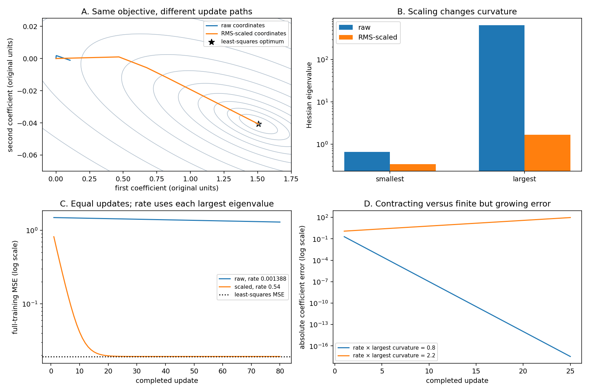
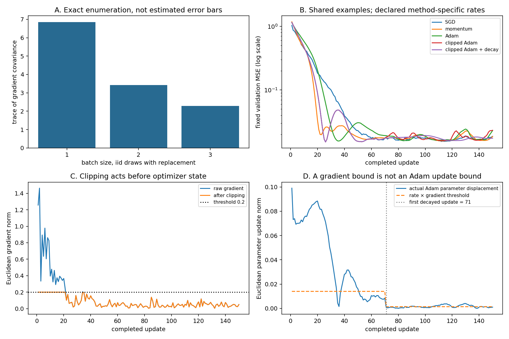
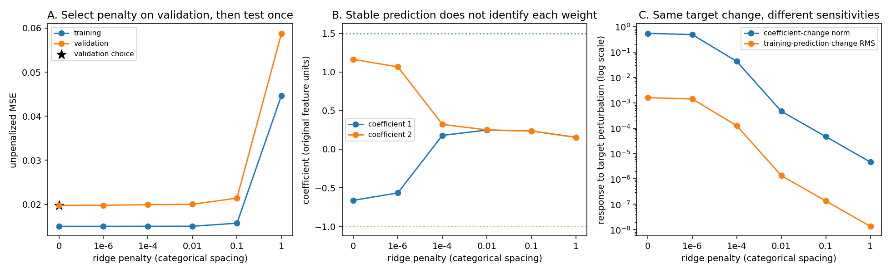

# Audit an optimization decision

Your gradient is correct and the loss is falling. Is the training experiment working well? This project follows that question through curvature, feature scaling, noisy batches, stateful optimizers and regularization. You will build five numerical tools and use their outputs to defend a specific decision.

Begin with the [regression audit](../regression-audit/README.md), then complete the twelve [Math & optimization lessons](../../phases/04-optimization/README.md). The earlier [foundations synthesis](../../assessments/foundations.md) checks the basic regression loop; this project adds the conditioning, curvature, noise and optimizer comparisons promised by the deeper phase. Passing these public checks is evidence about your implementation on the tested cases. It is not independent assessment or professional certification.

## Make your workspace

Install the course CPU environment from `requirements-cpu.txt`. Open a terminal in the repository root or extracted bundle’s top folder. The bundle contains the same nested `projects/optimizer-audit` folder.

macOS or Linux:

```sh
cp projects/optimizer-audit/starter/optimization.py projects/optimizer-audit/my_optimization.py
python3 projects/optimizer-audit/tests/check.py --implementation projects/optimizer-audit/my_optimization.py --stage 1
```

Windows PowerShell:

```powershell
Copy-Item projects/optimizer-audit/starter/optimization.py projects/optimizer-audit/my_optimization.py
python projects/optimizer-audit/tests/check.py --implementation projects/optimizer-audit/my_optimization.py --stage 1
```

The first run stops at the marked `NotImplementedError`. Implement only the current stage, then advance the stage number through `5`; later checks include earlier ones. Each stage below identifies the function to replace. The supplied validation, fixture and compiled loop are scaffolding you should read, not hidden answers to the missing functions.

The completed reference and its figure execution are separate commands:

```sh
python3 projects/optimizer-audit/tests/check.py --implementation solution --stage all
python3 projects/optimizer-audit/examples/figures.py
```

The figure command executes the reference and reruns its checker. To plot your implementation, change the example’s explicit import in your own copy and record the path. A figure generated from the supplied solution does not test your unfinished file. All experiments here run on CPU with synthetic data; they are neither hardware benchmarks nor an optimizer leaderboard.

## Stage 1 — Explain the derivative before checking it

Implement `objective`. Inputs are finite `float32` arrays: observations \(X\in\mathbb{R}^{n\times d}\), one target per row \(y\in\mathbb{R}^n\), and coefficients \(w\in\mathbb{R}^d\). No intercept is added silently. The objective is

\[
J_\lambda(w)=\frac{1}{2n}\|Xw-y\|_2^2+\frac{\lambda}{2}\|w\|_2^2,
\qquad \lambda\geq0.
\]

The squared residual is appropriate when prediction errors are penalized quadratically. With fixed Gaussian observation variance it also corresponds to a negative log likelihood up to scaling and constants. It does not model heavy-tailed noise or classification probabilities. The regularizer penalizes every supplied coefficient; adding an unpenalized intercept would require an explicit mask and a changed derivative contract.

Let \(r=Xw-y\). Moving \(w\) by a small vector \(h\) changes the predictions by \(Xh\). Expanding the squared residual gives

\[
\nabla J_\lambda(w)=\frac{X^Tr}{n}+\lambda w,
\qquad H_\lambda=\frac{X^TX}{n}+\lambda I.
\]

For a worked case, take rows \((-1,1)\) and \((1,1)\), targets \((-1,3)\), and zero coefficients with \(\lambda=0\). Residuals are \((1,-3)\), loss is \(2.5\), gradient is \((-2,-1)\), and the Hessian is the identity. A rate of \(0.1\) therefore gives new coefficients \((0.2,0.1)\). Write those values down before checking them.

`geometry` obtains the gradient and Hessian through JAX. The checker independently derives them with NumPy at different shapes, coefficients and penalties. It also compares a directional loss difference with \(g^Th\), and a gradient difference with \(Hh\). A correct gradient at one initial point cannot establish the entire implementation.

**Transfer:** use three unequal feature columns and an explicitly supplied constant column. Derive which entries change when the constant column is excluded from regularization. Keep this extension separate from the supplied all-coefficients penalty contract.

**If this fails:** inspect the residual vector and reduction first. Targets shaped \((n,1)\) can broadcast against vector predictions to produce a different matrix objective; the interface must reject them.

## Stage 2 — Make the same predictions in better coordinates

Implement `fit_scales`. Fit each column’s root mean square on **training rows only**:

\[
s_j=\sqrt{\frac1n\sum_i X_{ij}^2},\qquad Z_{ij}=X_{ij}/s_j.
\]

A completely zero column receives scale one. This is RMS rescaling, not mean centering. Use the same saved scales for validation rows. Let \(a_j=s_jw_j\); then \(Za=Xw\). Mapping predictions correctly lets us compare two training trajectories without accidentally changing the prediction problem.

The unregularized Hessian in the new coordinates is \(D^{-1}HD^{-1}\), where \(D\) contains the scales. Its eigenvalues describe curvature along orthogonal directions. The ratio between its largest and smallest positive eigenvalues is the Hessian condition number. A large ratio means one scalar step size must serve directions that react very differently.

Rescaling alone cannot remove duplicate columns or all correlation. Moreover, applying the same scalar ridge penalty to \(a\) would change the regularizer in original units. Our scaling comparison uses \(\lambda=0\); the later ridge experiment stays in original coordinates.



Read the four panels together:

- **A:** axes are coefficients in the original feature units. Gray contours show half mean squared error. Both paths start at zero. The orange scaled path reaches the black least-squares star; the blue raw path remains near the origin after the same update count. The contour calculation and training share the same observations and objective.
- **B:** height is a Hessian eigenvalue on a logarithmic scale. The raw condition number is about \(999.76\); RMS scaling lowers it to about \(4.99\). The smaller eigenvalue does not need to increase for the ratio to improve: the largest falls much more.
- **C:** horizontal position is the completed update, and height is full-training **MSE**, twice the unregularized objective. Each run uses rate \(0.9/L\), with its own largest eigenvalue \(L\). At update \(80\), raw MSE is about \(1.294\), while scaled MSE is \(0.01930\), overlapping the dotted least-squares level. These are whole-training measurements after each update, not noisy minibatch losses.
- **D:** this is a separate exactly diagonal quadratic whose largest curvature is \(8\). The initial error lies along that eigendirection. Its recurrence is \(e_{t+1}=(1-\eta L)e_t\). The blue run multiplies signed error by \(0.2\); the orange run multiplies it by \(-1.2\). The plot uses **absolute** error on a log scale, so the orange sign flips are hidden. It is finite but grows to about \(95.4\) at step \(25\). Finiteness is not convergence.

For a positive-definite quadratic, plain full-batch gradient descent contracts every eigendirection when \(0<\eta<2/L\). This is not a universal stability bound for Adam, momentum, clipped updates or an arbitrary nonquadratic loss.

**Transfer:** change feature units by multiplying just one column by \(100\), divide its known generating coefficient by the same factor, and predict which quantities should remain unchanged. Then make two columns exact duplicates and explain why scaling cannot restore coefficient uniqueness.

## Stage 3 — Count the sampler’s possible answers

Implement `noise_audit`. The miniature problem has three rows. Enumerate every ordered batch of sizes \(1\), \(2\) and \(3\), sampled uniformly **with replacement**. There are \(3^b\) possible batches of size \(b\). Repeated row IDs are valid draws.

If \(g_i\) is a single-row gradient including the same ridge term, then

\[
\hat g=\frac1b\sum_{k=1}^{b}g_{I_k},\qquad
\mathbb E[\hat g]=\frac1n\sum_i g_i,
\qquad \operatorname{Cov}(\hat g)=\frac1b\operatorname{Cov}(g_I).
\]

The covariance formula depends on independent draws. Sampling without replacement has a different finite-population factor. “Unbiased” means the average over all possible draws equals the full gradient; it does not say any particular batch gradient points in a useful direction.

The checker enumerates indices independently and compares the entire gradient table. It also splits the three rows into batches of two and one: weighting batch means by their row counts recovers the dataset mean, whereas averaging those two means equally does not. This makes the reduction rule observable.

**Transfer:** give the first observation twice the sampling probability of the others. Enumerate the new expectation. Either explain the resulting changed objective or derive importance weights to recover the original uniform objective. Keep sampler probabilities separate from arbitrary loss weights.

## Stage 4 — Compare updates you can reconstruct

Implement `optimizer_step`. The retained state contains coefficients, first and second accumulators, and the completed update count. Clip the raw gradient first, apply the selected stateful transformation next, then multiply its direction by the current learning rate.

For momentum we use \(v_t=0.85v_{t-1}+g_t\), without multiplying the new gradient by \(1-0.85\). Adam uses \(m_t=0.9m_{t-1}+0.1g_t\), \(v_t=0.99v_{t-1}+0.01g_t^2\), bias-corrected moments, and epsilon outside the square root:

\[
w_t=w_{t-1}-\eta_t\frac{m_t/(1-0.9^t)}{\sqrt{v_t/(1-0.99^t)}+10^{-8}}.
\]

For global clipping at threshold \(c\), replace \(g\) by \(g\min(1,c/\max(\|g\|,10^{-12}))\). This preserves direction for a nonzero gradient. Adam then divides by its coordinatewise second-moment estimate, so clipping its **input** does not bound the norm of its final parameter displacement by \(\eta c\).

The public checker reconstructs every update independently in float64 NumPy, including Adam’s counter and bias corrections. The JAX loop uses float32. Comparisons allow the documented small rounding tolerance rather than demanding bit identity between precisions.



- **A:** the three bars are exact covariance traces, approximately \(6.8472\), \(3.4236\) and \(2.2824\). They decrease as \(1/b\). They are not estimated confidence intervals and do not show a trained model’s loss.
- **B:** every method starts from zero and consumes the same stored sequence of \(150\) batches, each with \(12\) draws. Height is unpenalized MSE on one fixed validation set after each update, on a log scale. Momentum falls quickly and then rebounds; Adam and clipped Adam also show visible rebounds. The decayed clipped-Adam line becomes steadier late in this particular run.
- **C:** the raw gradient initially exceeds \(0.2\), so the clipped norm sits on the dotted threshold. Later the two curves mostly overlap because clipping is inactive. The plot describes the decayed clipped-Adam run only.
- **D:** early actual Adam updates exceed the dashed value \(\eta c\), despite the valid clipping in C. At completed update \(71\), the rate decreases by a factor of \(10\), and the displacement drops. The schedule uses zero-based index \(70\); that is why the plotted boundary is \(71\).

These are the declared rates and observed final validation MSEs:

| Method | Initial rate | Clip threshold | Rate change | Final validation MSE |
| --- | ---: | ---: | --- | ---: |
| SGD | 0.12 | None | None | 0.01862 |
| Momentum | 0.04 | None | None | 0.01851 |
| Adam | 0.07 | None | None | 0.02298 |
| Clipped Adam | 0.07 | 0.2 | None | 0.02316 |
| Clipped Adam with decay | 0.07 | 0.2 | Multiply by 0.1 at update 71 | 0.01742 |

Equal update and example counts do not imply equal runtime or equally thorough hyperparameter tuning. These declared configurations illustrate mechanisms; they do not rank algorithms universally. The displayed held-out rows are **validation** data used for comparison, not an untouched final test. Do not call the smallest table entry statistically significant from one seed.

**Transfer:** keep the example plan fixed and reset momentum after update \(30\). Compare the next update with retained state. Separately move clipping after Adam’s direction and explain which bound then changes. Neither extension should silently overwrite the reference experiment.

**If this fails:** compare the first two updates before inspecting the final curve. A forgotten bias-correction counter, reset momentum or off-by-one schedule can produce a plausible decreasing loss while implementing a different method.

## Stage 5 — Stable predictions can hide unstable coefficients

Implement `ridge_solution` with an augmented least-squares system. It solves the objective from Stage 1 without explicitly inverting the normal matrix:

\[
\begin{bmatrix}X/\sqrt n\\\sqrt\lambda I\end{bmatrix}w
\ \approx\ 
\begin{bmatrix}y/\sqrt n\\0\end{bmatrix}.
\]

The reference uses NumPy float64 for this direct audit, while training used JAX float32. Forming \(X^TX\) squares the design matrix’s condition number; the augmented least-squares solve avoids making that the computational route. The independently derived normal equation remains useful as a small-case check.

First inspect exact duplicate columns. For rows \((-2,-2),(-1,-1),(1,1),(2,2)\) and target twice the first column, only the coefficient sum is identified. Both \((2,0)\) and \((-3,5)\) make identical predictions. The minimum-norm unregularized solution is \((1,1)\); positive ridge penalty gives each coefficient \(5/(5+\lambda)\). These exact answers check the solver independently.

Then inspect near-collinear noisy features. The plot sweeps declared penalties using training and validation data. It selects the smallest validation MSE and evaluates that selected model on a separate test seed once.



- **A:** the horizontal labels are penalty categories with **equal visual spacing**, not a logarithmic numeric axis. The two curves are unpenalized MSE, so adding a penalty is not counted as prediction error. The validation winner here is actually \(\lambda=0\): about \(0.01979\). Strong regularization raises validation error. Its selected model’s one-time test MSE is about \(0.02345\). We retain this result instead of choosing another fixture to make ridge appear best.
- **B:** vertical position is each fitted coefficient in original units. Dotted lines mark generating coefficients \((1.5,-1)\), while the unregularized fit is approximately \((-0.663,1.163)\). Predictions can still be good because the two columns move together and the coefficient sum is near \(0.5\). Ridge draws both coefficients toward one another and eventually toward zero; it does not recover the generating values just by stabilizing the solve.
- **C:** all models see the same small target perturbation with Euclidean norm \(0.01\), directed along the least-sensitive left singular vector. Without ridge, coefficient-change norm is about \(0.542\), but training-prediction RMS changes only \(0.001581\). At penalty \(0.01\), those changes fall to about \(0.000461\) and \(0.00000134\). The two curves have different units; compare their responses across penalties rather than treating their vertical difference as a dimensionless ratio.

Ridge reduces coefficient sensitivity in this example but does not improve this validation score. That is a tradeoff, not a contradiction. If the task requires interpreting individual coefficients, collect observations that separate the correlated features or state the ambiguity. An optimizer cannot create missing information.

**Transfer:** choose a new train/validation/test seed triplet before running, halve the feature correlation, and predict how coefficient sensitivity changes. Choose the penalty with validation only, retain the full candidate table, and evaluate the chosen model once on the new test set. Do not reuse that test set for the next tuning round.

## Submit a decision another learner can inspect

Keep your implementation path, package versions, exact commands and the independent derivations. Your report should include one corrected failure, the raw/scaled prediction parity check, exact sampler counts, the optimizer state/update comparison, and a regularization decision that separates coefficients from predictions. Include the three figures and explain one concrete observation from every panel.

`outputs/evidence.json` records the actual reference trajectories, metric conventions, checker output and hashes of the executed source, checker and figure generator. It contains instructor reference evidence; your own submission should name your implementation and changed conditions. No natural dataset, accelerator, production convergence or independent learner review is claimed.

Primary references: [JAX automatic differentiation](https://docs.jax.dev/en/latest/automatic-differentiation.html), [Optax optimizer definitions](https://optax.readthedocs.io/en/latest/api/optimizers.html), and [Optax transformations and clipping](https://optax.readthedocs.io/en/latest/api/transformations.html). The project’s transparent recurrences are checked against independent derivations; the earlier Optax lessons provide the library integration.
