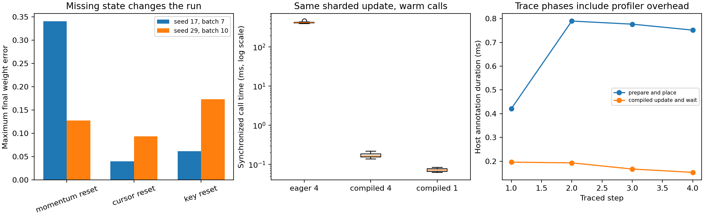

# Resume and profile a genuinely sharded training run

A checkpoint is useful when the next update means the same thing after a restart. A fast update is useful when it still computes the intended global objective. Here you connect those two claims: train a small regression model on four logical CPU devices, save its entire transition state, resume in a fresh Python process, and examine a real profile of the resumed style of workload.

This is one connected project for the recovery, performance and distributed phases. The four devices are logical partitions of one CPU host. They execute real JAX sharding and collectives, but they do **not** establish four-machine speed, network behavior, accelerator throughput or multi-host recovery. The task needs no external data and uses `requirements-cpu.txt` from the repository root.

## Start with the learner scaffold

```bash
cp projects/sharded-training/starter/model.py projects/sharded-training/my_model.py
python3 projects/sharded-training/tests/check.py --implementation projects/sharded-training/my_model.py --stage 1
```

On Windows use `Copy-Item` instead of `cp`. Run the checker in a fresh interpreter: its first JAX configuration selects CPU and creates four logical devices before any array or device query. Increase `--stage` from 1 to 4 as you work. Checks are cumulative. The implementation must actually place arrays and execute collectives; an ordinary NumPy-only replacement does not satisfy stage 2.

Run the complete reference separately:

```bash
python3 projects/sharded-training/tests/check.py --implementation solution --stage all --output projects/sharded-training/my-evidence
```

The command executes the reference, independent checks, two fresh-process replay experiments, warm timing samples, a real XPlane/Perfetto trace, and a plotted report. The shipped example lives in `outputs/`. Running your implementation does not modify the reference. A passing reference is evidence about this bounded experiment, not a grade for a learner implementation.

## Stage 1 — Make the next batch explicit

Implement `initial` and `next_batch`. The state contains weights, momentum, a PRNG key, a permutation of every sample ID, the next cursor, and the update count. Parameters and momentum are replicated JAX arrays. The one-controller sampler owns NumPy copies of its key, order, cursor and step. Keeping sampler state on the host is an explicit choice for this local project; a multi-host input service needs its own ownership and consistency design.

Split the initial key before drawing the first permutation. When the cursor reaches the dataset end, split the saved key again, create a new permutation, and reset the cursor. Return a new state rather than mutating the caller's dictionary or arrays. Advancing the sampler consumes examples; the optimizer transition later increments the step exactly once.

The fixture has 23 rows and eight features. Batches of seven therefore have sizes seven, seven, seven and two. Keep the remainder. Pad each selected batch to a multiple of four and place rows with `NamedSharding(mesh, P('data', None))`. Labels and validity masks use `P('data')`. A padded row has validity zero, regardless of its numeric contents. Do not count padding as an observation.

Before executing, predict the valid-row counts for each local partition. Seven rows become eight slots, giving `[2, 2, 2, 1]`. A one-row batch gives `[1, 0, 0, 0]`. The checks also change the seed, use batches of ten, and request a batch larger than the dataset. They verify complete epoch coverage, unchanged input state, deterministic replay, and the next epoch's changed key.

**Transfer exercise.** Use a dataset of 31 rows and batch size six. Write the expected batch lengths and partition counts on paper, then execute them. Explain why dropping the final row silently changes the objective and the definition of an epoch.

## Stage 2 — Derive the global update before distributing it

For real examples indexed by \(i\), let \(r_i=x_i^\top w-y_i\) and let the validity mask be \(m_i\). The global mean squared loss and its gradient are

\[
N=\sum_i m_i,\qquad L(w)=\frac{\sum_i m_i r_i^2}{N},\qquad
\nabla L(w)=\frac{2\sum_i m_i x_i r_i}{N}.
\]

Each device owns only some rows. It can compute a numerator and a valid count locally, but the denominator belongs to the whole batch. Use `lax.psum` to add counts and numerator contributions across the `data` axis. An empty local partition contributes zero; it must not divide by its own zero count. Averaging four local means gives the wrong answer when the partitions contain different numbers of observations.

Apply momentum only after obtaining the global gradient:

\[
v_{t+1}=0.8v_t+\nabla L(w_t),\qquad w_{t+1}=w_t-0.03v_{t+1}.
\]

`make_step(mesh)` returns a jitted `jax.shard_map` function accepting the padded features, targets, validity mask, weights and momentum. It returns new weights, new momentum, the **pre-update** loss and the gradient. `compiled=False` returns the same mapped body without the outer JIT, for the dispatch-overhead experiment. `transition` joins batching with this update and returns the new complete state, loss and selected IDs.

The checker independently computes the full-batch NumPy gradient and separately reconstructs the sum from partition numerators and counts. It checks multiple updates and every replica, including singleton batches and empty local partitions. It lowers the compiled function and requires actual `all_reduce` operations in StableHLO. In the reference there are three such operations: count, gradient numerator and loss numerator. Counting IR operations is a placement/communication inspection, not a measurement of network traffic or hardware utilization.

**Diagnosis.** If full batches pass but tails fail, inspect your denominator first. If gradient values match but the second update diverges, inspect momentum and whether weights were updated before computing the reported loss. If only one device is visible, restart Python and set the device count before initializing JAX.

## Stage 3 — Prove a fresh process continues the same experiment

Implement `contract`, `save` and `restore`. The contract records a schema, dataset shapes/dtypes/byte hash, seed, batch size, feature width, learning rate, momentum and device count. A checkpoint contains **all six state fields**, not just weights. Write a fresh NPZ file with `allow_pickle=False` on load and validate the contract before accepting it. The reference writes a temporary file then renames it to avoid exposing a partly written final file. It refuses to overwrite an existing checkpoint. This demonstrates local process restart, not power-loss durability or a concurrent distributed checkpoint service.

Check restored shapes, dtypes, finite parameter values, a valid permutation, cursor bounds, and nonnegative step. Recreate the named replicated placement for weights and momentum. The stored key has shape `(2,)` and dtype `uint32`; this project deliberately uses the legacy key representation for simple non-pickled persistence.

The test saves **after crossing an epoch boundary**, then launches another Python interpreter. That child restores and continues for more than two epochs. Compare every parameter and momentum element, all sampler fields, every next sample ID and every loss with an uninterrupted run. The reference matches exactly on the stored CPU fixture; the public float32 comparison allows small numerical differences and demands exact sampler equality.

Now inject three faults independently: restore weights but reset momentum; reset the cursor; reset the random key. Momentum changes the next update even if the next samples are identical. A cursor reset repeats samples. A key reset may wait until a later epoch to change the run, which is why one matching next step is insufficient evidence. The checks require a visible final-weight discrepancy for each fault and changed sample sequences for the cursor/key faults. They also reject missing momentum, a corrupted permutation, mismatched data/configuration and duplicate checkpoint paths.

**Transfer exercise.** Save midway through a remainder batch policy of your own. Decide whether changing batch size on restore is a continuation or a new experiment. This reference rejects the change: its promised replay includes sample grouping, update count and optimizer history. Document a different migration contract before loosening that rejection.

## Stage 4 — Measure the boundary you actually intend to optimize

The timing fixture is separate: 1,023 rows and 64 features. Compare three numerically equivalent updates: eager four-device `shard_map`, compiled four-device `shard_map`, and a compiled single-device global update. The single-device result also matches the independent NumPy gradient. Explicitly lowering and compiling measures compilation separately. Then warm each executable, alternate measurement order, retain eleven samples per variant and block on **all** output leaves before stopping the clock.

These warm samples start with inputs already placed on their respective devices. They exclude sampler preparation and host-to-device placement. Eager `shard_map` is intentionally a dispatch-overhead demonstration; its large cost is not a strong production baseline. The compiled single-device comparison is essential: for this small workload, collectives and host scheduling can dominate any benefit from row partitioning. Four logical devices share one host's resources, so even a faster four-device result would not establish cluster scaling.

The next four real transitions are profiled with `jax.profiler.trace`. Each has `prepare_and_place` and `compiled_update_and_wait` annotations inside `sharded_learner_step`. Preparation advances the actual saved sampler state, including epoch reshuffling, and waits for placement. The update annotation includes waiting for execution. `outputs/trace/` contains actual XPlane and gzipped Perfetto records, and the checker extracts annotation durations from the trace events. Open the Perfetto file in a compatible trace viewer, or load the profile directory in XProf, to inspect events beneath those named boundaries.

Trace durations include profiler overhead and differ from unprofiled timings. The last plot compares **host annotation durations**, not accelerator utilization. Before proposing an input pipeline optimization, identify whether preparation, placement or the compiled update dominates this measured boundary. Profile again after a change; do not fill a before/after table with theoretical estimates.

## Read the executed evidence



The left panel compares final weights after deliberately incomplete recovery. Horizontal labels identify the omitted state; vertical height is maximum absolute parameter error relative to the uninterrupted run. With seed 17 and batch seven, resetting momentum produced about 0.340 error, resetting the cursor 0.0400, and resetting the key 0.0617. With seed 29 and batch ten, the corresponding errors were about 0.128, 0.0938 and 0.173. Complete fresh-process recovery had zero observed final-weight error in both fixtures. The graph therefore shows why different state fields matter, rather than implying a checkpoint is correct because it loads without error.

The middle panel shows individual-run timing distributions on a logarithmic vertical axis. Read each box against the axis labels rather than treating equal screen distances as equal milliseconds. The eager four-device variant is dominated by repeated dispatch/setup overhead. The compiled four-device and compiled single-device variants provide the useful comparison for the small numerical workload. In this receipt, the warm medians were about 421.46 ms for eager four-device execution, 0.1661 ms for compiled four-device execution, and 0.07225 ms for compiled single-device execution. Compiling took about 33.90 ms and 28.76 ms for the four-device and single-device versions respectively. The four-device compiled call was about 2.30 times slower than the strong single-device baseline on this tiny local fixture. These measurements appear in `outputs/audit.json`; they describe this local run and can shift with host contention. A large eager-to-compiled ratio demonstrates the value of compiling the update, not a multi-device speedup.

The right panel comes from actual recorded trace events. The horizontal axis indexes four consecutive traced transitions; the vertical axis is elapsed time inside the named host annotation. `prepare_and_place` includes permutation handling, gathering, padding and device placement. `compiled_update_and_wait` includes the update and output readiness. Preparation took 0.421, 0.790, 0.777 and 0.752 ms, while completed updates took 0.196, 0.193, 0.167 and 0.153 ms. The later preparation points include an epoch-boundary reshuffle because this profiling fixture consumes the entire dataset per batch. This is consistent with extra sampler work; the four host durations alone do not isolate the cost of every sub-operation. A larger preparation point identifies work outside the compiled update that the warm-call timing excluded. These tiny four-point observations locate a question for the next experiment; they do not establish a latency percentile or bottleneck across real training workloads.

Together the panels answer three separate questions: does restart preserve the experiment, what changes when dispatch is compiled, and where does time go across the full local transition? The source hashes, environment, every timing sample, observed partition counts, exact recovery errors, actual IR and trace paths live in `outputs/audit.json` and `outputs/step.stablehlo.mlir`. Preserve those files alongside any claimed improvement. There is no accelerator, network or multi-host measurement in this report.

## Optional multi-host extension

Read [Resilient distributed training](../../phases/09-distributed/04-resilient-distributed-training/README.md) and its `code/main.py` before designing this extension. That lesson has an explicit `COURSE_MULTIPROCESS=1` branch that initializes distributed JAX before device access, uses global array construction and requires a shared checkpoint directory. Every controller must join the same ordered collective/checkpoint protocol. Local NPZ capture of addressable arrays is **not** a valid general replacement for a distributed checkpoint system.

The supplied project checker intentionally forces one-process CPU execution. Porting it requires a global sampler/data-ownership contract, coordinated restore targets and failure handling, plus separately provisioned hosts. The optional lesson launch and any real multi-host execution remain unverified by this project's tests. Keep its receipt separate rather than interpreting four local logical devices as four machines.

## Portfolio handoff

Submit your implementation, passing stage output, full-state recovery comparison, changed-seed/batch results, deliberate failure explanations, actual trace, placement/IR excerpt and synchronized samples. In your short report, name the device topology and measurement boundaries, justify the global denominator, and explain why checkpoint step count alone cannot reconstruct random/data-order state. A useful next optimization is a falsifiable hypothesis grounded in the actual profile, with a correctness gate before timing.

Primary references: [JAX shard_map](https://docs.jax.dev/en/latest/notebooks/shard_map.html), [profiling](https://docs.jax.dev/en/latest/profiling.html), [benchmarking](https://docs.jax.dev/en/latest/benchmarking.html), and [multi-process JAX](https://docs.jax.dev/en/latest/multi_process.html). Installed execution was checked on JAX 0.9.2; future API/backend changes require a fresh receipt.
