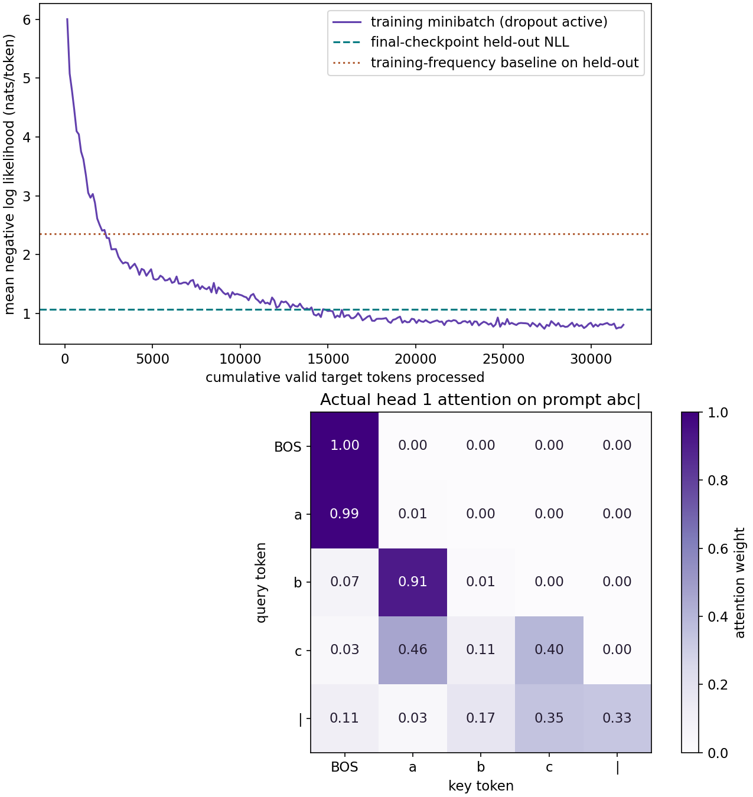
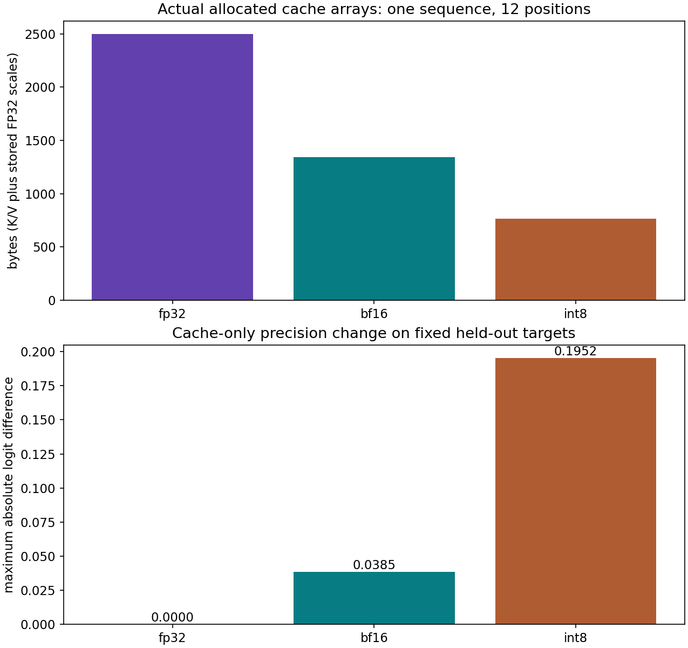

# Text harness: train, recover and serve a tiny causal Transformer

A generated string is the last step of a system. Before trusting it, we need to know which bytes became tokens, which targets contributed to loss, whether a resumed run sees the same next examples, and whether cached inference computes the same causal function.

This project connects those pieces in a real one-block, two-head Transformer. It trains on short synthetic reversal strings such as abc|cba. The fixture makes masking, state and cache mistakes inspectable. It is not a pretrained language model and is verified separately from natural-language quality.

## Run the learner stages

Use the course CPU environment and requirements-cpu.txt. From the course workspace root or extracted project ZIP top folder:

~~~sh
cp projects/text-harness/starter/model.py projects/text-harness/my_model.py
python3 projects/text-harness/tests/check.py --implementation projects/text-harness/my_model.py --stage 1
~~~

On PowerShell, use Copy-Item for the copy command. After your own attempt, inspect the reference and regenerate its connected evidence:

~~~sh
python3 projects/text-harness/tests/check.py --implementation solution --stage all
python3 projects/text-harness/run.py --implementation solution
~~~

The runner actually trains, interrupts/restores, exports, generates text, times inference and records a JAX profiler trace. Its output directory contains a source-bound report, figures, full checkpoint and serialized inference artifacts. Reference output is public; it is not proof that your own implementation or reasoning passes.

## Stage 1: define the token and causal contracts

The tokenizer preserves UTF-8 bytes with no text normalization. PAD is token \(0\), BOS is \(1\), EOS is \(2\), and byte \(b\) maps to token \(b+3\). There are \(259\) tokens. The character é occupies two UTF-8 bytes and therefore two byte tokens; byte-token counts are not word counts or BPE-token counts.

A training document contains BOS, its bytes, EOS and right padding to \(13\) positions. Inputs are positions zero through eleven; targets are positions one through twelve. We include EOS in loss and exclude PAD. The maximum inference context is \(12\) tokens including BOS. Overlong input is rejected rather than silently truncated. A byte tokenizer can represent arbitrary UTF-8 bytes, but this tiny context cannot support ordinary long documents.

Training and held-out documents have different identities, source groups and full string contents. The generated corpus contains \(96\) training strings and \(32\) fixed held-out strings. There is no document/window leakage. Both still come from the same deliberately small symbolic grammar.

The model uses width \(24\), two attention heads of width \(12\), learned positions, pre-layer-normalized causal attention, a residual connection and a \(48\)-wide GELU feed-forward block. Query/key scores are divided by \(\sqrt{12}\). A query may attend to its own position and earlier non-PAD keys, never future keys.

~~~sh
python3 projects/text-harness/tests/check.py --implementation projects/text-harness/my_model.py --stage 1
~~~

**Keep:** byte round trips including a multibyte example, shifted-target diagram, independent attention-row calculation and a proof that changing future tokens cannot affect earlier outputs. Compare masked token loss with a separate NumPy log-softmax calculation. The parser rejects cross-split duplicate content and source groups.

## Stage 2: train a stateful system and recover it exactly

Training uses Adam with FP32 parameters and moments, explicit dropout keys, shuffled document order, and a cursor into that order. Dropout is active only for training. The saved configuration records the rate, moment coefficients, epsilon convention, batch size and seed.

Record loss before the update and normalize by the number of valid target tokens in that batch. Variable-length examples mean that examples and tokens are different denominators. Evaluation adds loss sums and valid-token counts across batches; it must not average unequal batch means or refit any state.

The checkpoint stores parameters, both Adam moments, random key, shuffled order, cursor, epoch, completed step, tokenizer/architecture identity, corpus fingerprint and byte checksum. NPZ arrays are loaded with pickle disabled. A different dataset or optimizer configuration is a new experiment and must not silently count as a continuation.

~~~sh
python3 projects/text-harness/tests/check.py --implementation projects/text-harness/my_model.py --stage 2
~~~

The public check interrupts after five batches and restores in a **fresh Python process**. Four subsequent updates cross an epoch boundary. Document IDs, dropout keys, losses, moments, parameters and ordering must match the uninterrupted reference. A second initialization is trained and evaluated separately. Evaluation is checked for non-mutation and exact count-weighted aggregation.

## Interpret the actual learning and attention plots

The upper plot's horizontal axis is cumulative valid target tokens processed. Its curve is pre-update training cross-entropy with dropout active, measured in nats per token. The dashed line is the final checkpoint's held-out result, not a validation trajectory measured at every update. It is approximately \(1.071\) over \(276\) valid targets. The dotted line is a training-frequency baseline evaluated on those same held-out targets, approximately \(2.352\). The lower training loss alone would not establish generalization; the separate fixed result supplies the comparison.

Held-out perplexity is approximately \(2.918\), the exponential of token NLL under this byte tokenizer and fixture. Token accuracy is about \(60.1\%\). Some prefix bytes are deliberately random given their preceding context; do not equate token accuracy with the fraction of completely correct reversals.

The lower plot is head one's actual attention on BOS, a, b, c and |. Rows are queries; columns are keys. The first row places weight \(1\) on BOS because no earlier token exists. The b query places about \(0.914\) on a. The | query splits weight among several positions, including about \(0.346\) on c and \(0.332\) on itself. Entries above the diagonal are exactly masked out. These weights describe one head's information routing, not probabilities that the output token is correct and not a complete explanation of the model's decision.

The first three fixed held-out demonstrations produce aebd for dbea|, deaa for aaed|, and beda for adeb| in this run. A separate fixed diagnostic prompt abc| produces cbc followed by EOS, while the desired completion is cba. Keep that failure with the successful examples. A few readable outputs do not replace the complete token report, and no fluent-language claim is made.

## Stage 3: implement the cache, including its precision

Prefill processes a complete prompt and stores projected keys and values at their absolute positions. Cached decoding embeds **one new token**, appends its key/value, and attends over the retained prefix. It does not recompute old keys and values. Because this model has one block, each token's K/V comes from the normalized input embedding at that layer.

Cache length is an explicit scalar. Allocated capacity is twelve positions; the valid length decides which slots can be attended to. Preallocated slots may contain padded projections, so nonzero bytes in an unused slot do not mean that position is valid. Prefix slots must remain unchanged when a token is appended. Capacity exhaustion is rejected, with no wraparound or implicit position reset.

Three K/V policies are actually implemented:

| Cache | Stored K/V | Scale | Attention arithmetic |
| --- | --- | --- | --- |
| FP32 | FP32 arrays | Unified interface retains FP32 ones | FP32 |
| BF16 | BF16 arrays | Unified interface retains FP32 ones | Reconstruct to FP32 |
| INT8 | Signed INT8 arrays | Separate FP32 scale per token per head for K and V | Reconstruct to FP32 |

For INT8, the scale is the maximum absolute value in one head vector divided by \(127\), with a positive floor for a zero vector. Values round to integer codes and reconstruct through that stored scale. This is actual cache storage, not just a label attached to FP32 arrays.

~~~sh
python3 projects/text-harness/tests/check.py --implementation projects/text-harness/my_model.py --stage 3
~~~

Compare sequential cached decode with full causal recomputation after each appended token under the **same** cache policy. FP32 cached output should match the FP32 full function; a quantized cache should match a full reference that quantizes K/V in the same way. Separately compare quantized results with the original FP32 model to measure approximation error. Tests inspect dtypes, scale shapes, unchanged prefix entries and context-overflow rejection.

## Read the cache precision tradeoff

The upper bars count allocated K/V and scale-array bytes for one sequence at twelve positions: \(2496\) for FP32, \(1344\) for BF16 and \(768\) for INT8. These include \(192\) bytes of FP32 scale arrays even for the policies whose scales are ones. They exclude model parameters, runtime workspace and allocator overhead; they are not peak process memory.

The lower bars isolate cache precision while keeping the model computation FP32. Maximum absolute logit differences on valid held-out targets are approximately \(0.0385\) for BF16 cache and \(0.1952\) for INT8 cache. They are logit differences, not changes in accuracy or calibrated probabilities. Smaller cache arrays can be useful while still changing low-margin token choices.

The complete release also compares computation policies. BF16 rounds dense operands then performs FP32 accumulation. W8A8 uses dynamic per-row INT8 dense activations, per-output INT8 dense weights and actual INT32 dot accumulation. Embeddings, normalization, attention and output handling remain FP32. The combined W8A8/INT8-cache policy has a larger maximum logit difference of about \(0.3354\) on this fixture. Its slightly lower NLL on this one sample does not prove quantization improves quality. No native low-bit acceleration is claimed.

## Stage 4: export, generate and profile actual runtime calls

Export distinct prefill and cached-decode computations for each of the three release policies. The prefill signature accepts a padded batch-one prompt and its valid length. Decode accepts one token, K/V arrays, scale arrays and the current length, then returns the next logits and updated state. Tokenizer, context, class-free vocabulary semantics, precision boundaries, parameter identity and artifact hashes travel with the release.

~~~sh
python3 projects/text-harness/tests/check.py --implementation projects/text-harness/my_model.py --stage 4
~~~

The stage reloads actual serialized files, executes prefill/decode in another Python process, rejects a corrupted artifact, and tests generation beyond the context budget. The actual greedy decoder forbids PAD and BOS as generated outputs and stops at EOS. It retains raw token IDs; decoding invalid UTF-8 sequences uses a visible replacement character, so do not use decoded-string equality alone as a numerical parity test.

The benchmark measures synchronized prefill and cached decode separately. It uses the fixed five-token prefix BOS+abc| and one new token per decode repetition. Each timed decode starts from the same fixed prefix cache; it is **not** a long-stream throughput benchmark. The timer includes validated token inputs, exported runtime calls and completion of returned arrays. Networking, process startup, scheduling queues and text tokenization are outside that boundary.

The report retains first calls, thirty warm samples per phase and policy, milliseconds, token counts and cache bytes. On a tiny CPU model, Python/runtime overhead and conversions can outweigh cache or integer arithmetic advantages. Read the current measurements instead of assuming one policy must be faster.

The runner also records a real JAX profiler trace under outputs/profile. It marks five actual regions each of text-training-update, text-prefill and text-cached-decode. Open the recorded trace with a compatible local trace viewer and inspect those intervals, host work and device completion. The JSON report counts the regions in the actual trace. Annotation duration includes the declared Python boundary; it is not automatically pure kernel time. Profiling uses a shadow continuation so measurement work does not change the released model.

## External text and target qualification

load_text_manifest ingests user-provided UTF-8 files through a JSON list with id, file, split, group, license, source and sha256 fields. It checks actual file bytes, rejects duplicate content or groups across splits and uses the same tokenizer and context limit. Preserve the actual rights and attribution; a field containing a license name is not proof of permission.

This small model rejects overlong documents. To study a real corpus, explicitly design document-level splits, deduplication, chunk boundaries, long-context position behavior and tokenization; do not silently slice the first bytes and claim natural-language evaluation. Keep train, validation and final test responsibilities distinct.

The project's reference execution is CPU-only. In an existing supported TPU runtime, use the full course workspace to run the explicit device check:

~~~sh
COURSE_EXPECT_PLATFORM=tpu JAX_PLATFORMS=tpu python phases/00-welcome/03-move-your-experiment-to-a-tpu/code/main.py
~~~

For an already configured distributed TPU launch environment, run the recovery lab on **every worker** with one new shared checkpoint path:

~~~sh
COURSE_MULTIPROCESS=1 JAX_PLATFORMS=tpu COURSE_CHECKPOINT_DIR=/shared/new-recovery-run python phases/09-distributed/04-resilient-distributed-training/code/main.py
~~~

These commands are linked qualification exercises, not claims that this text harness ran on a TPU cluster. The labs require their documented runtime setup; a project-only ZIP does not contain those phase files. Keep the same data hashes, token masks and global objective when porting this harness, compare against its independent CPU reference, and then measure placement, collectives, global token counts, recovery and performance on the actual devices. A virtual CPU device exercise is not physical TPU evidence.

Complete the [TPU training-system synthesis](../../assessments/tpu.md). CPU model/system evidence and target-device qualification are reviewed separately.

## API references

The reference uses installed JAX 0.9.2 and verifies the actual serialized calls locally. The [JAX export guide](https://docs.jax.dev/en/latest/export/export.html) describes staged computation serialization; exported artifacts still require a compatible runtime. The [JAX profiling guide](https://docs.jax.dev/en/latest/profiling.html) explains trace recording and waiting for computation completion. The measured source-bound report takes precedence over assumptions about a different runtime or device.
